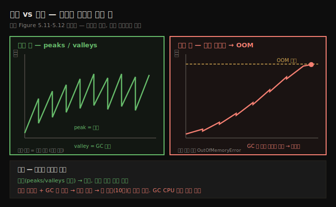
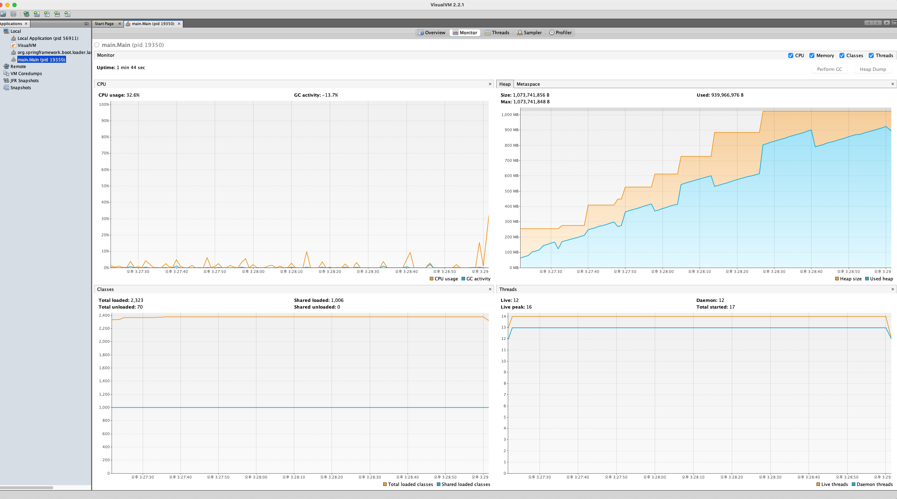
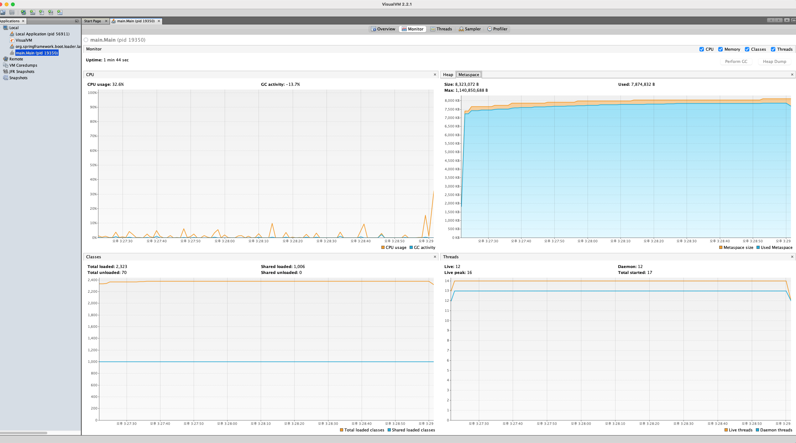

# 메모리 누수와 metaspace, AI 활용
---
> 메모리 누수는 안 쓰는 객체 참조를 못 버려 GC가 회수하지 못하는 상태라, 메모리 그래프가 톱니(peaks/valleys)가 아니라 계속 차오르면 누수 신호이고, 힙뿐 아니라 클래스 메타데이터를 담는 metaspace도 넘칠 수 있습니다


## 1. 메모리 누수란 무엇인가 — 옷장 속 잡동사니
> 메모리 누수는 더는 필요 없는 객체의 참조를 앱이 계속 붙들어 GC가 치우지 못하는 상태이고, 데이터가 쌓이다 힙이 가득 차면 OutOfMemoryError로 앱이 죽습니다

메모리 누수는 앱이 더는 필요 없는 객체를 붙들고 있을 때 생깁니다 — "언젠가 쓸지 몰라" 하며 옷장에 잡동사니를 쌓아 두는 것과 같습니다. 이렇게 남은 참조 때문에, 평소 안 쓰는 데이터를 치우는 도구인 GC가 제 일을 못 합니다. 앱이 데이터를 계속 쌓는 동안 메모리가 서서히 차고, 끝내 공간이 떨어지면 앱은 `OutOfMemoryError`를 던지며 — "꽉 찼다!"고 외치며 — 죽습니다.

이 동작을 보이려고 이 노트 1절은 일부러 `OutOfMemoryError`를 일으키는 단순한 앱(da-ch5-ex3)을 씁니다. 무작위 인스턴스를 리스트에 담되 그 참조를 절대 제거하지 않습니다.

```java
// listing 5.7 — OutOfMemoryError 만들기
public class Main {

  public static List<Cat> list = new ArrayList<>();

  public static void main(String[] args) {
    while(true) {
      list.add(new Cat(new Random().nextInt(10)));   // JVM 메모리가 떨어질 때까지 인스턴스를 계속 추가
    }
  }
}
```

`Cat` 클래스는 단순한 Java 객체입니다.

```java
public class Cat {

  private int age;

  public Cat(int age) {
    this.age = age;
  }

  // getter·setter 생략
}
```

- 이 앱을 실행하고 VisualVM으로 리소스 사용을 관찰합니다. 특히 메모리 사용량 위젯에 주목합니다.


## 2. 메모리 그래프 읽기 — 톱니(정상) vs 계속 차오름(누수)
> 정상 앱의 메모리 그래프는 할당으로 차오르는 peaks와 GC가 비우는 valleys가 번갈아 나오지만, 누수가 있으면 GC가 충분히 못 비워 그래프가 계속 차올라 끝내 OutOfMemoryError에 닿습니다

메모리 누수가 앱에 영향을 주면, 메모리 위젯은 **사용 메모리가 계속 증가**함을 확인해 줍니다. GC가 안 쓰는 데이터를 비우려 하지만 너무 조금만 제거합니다. 끝내 메모리가 가득 차 새 데이터를 담지 못하고 `OutOfMemoryError`를 던집니다. 앱을 충분히 오래 두면 콘솔에 다음 스택 트레이스가 보입니다.

```text
Exception in thread "main" java.lang.OutOfMemoryError: Java heap space
    at java.base/java.util.Arrays.copyOf(Arrays.java:3689)
    at java.base/java.util.ArrayList.grow(ArrayList.java:238)
    at java.base/java.util.ArrayList.grow(ArrayList.java:243)
    at java.base/java.util.ArrayList.add(ArrayList.java:486)
    at java.base/java.util.ArrayList.add(ArrayList.java:499)
    at main.Main.main(Main.java:13)
```

정상 앱과 누수 앱의 메모리 그래프는 모양이 다릅니다.



- **정상 앱** — 그래프에 **봉우리(peaks)와 골짜기(valleys)**가 번갈아 나옵니다. 앱이 메모리를 할당해 채우면(peaks) 이따금 GC가 더는 필요 없는 데이터를 치웁니다(valleys). 이 밀물·썰물은 조사 중인 기능이 누수에 걸리지 않았다는 좋은 신호입니다.
- **누수 앱** — 메모리가 점점 차는데 GC가 비우지 못하면 누수를 의심합니다. 메모리가 완전히 차는 순간 `OutOfMemoryError`가 납니다. 많은 경우 누수는 GC 활동도 격화시켜, CPU 리소스 위젯에서 GC가 CPU를 많이 쓰는 것으로도 나타납니다.

> **OOM 스택 위치 ≠ 근본 원인**: `OutOfMemoryError` 스택 트레이스가 문제를 *일으킨* 자리를 가리키는 것은 아닙니다. 앱에는 힙 메모리 위치가 *하나뿐*이라, 어떤 스레드가 문제를 일으켜도 *마지막에* 그 메모리를 쓰려던 운 나쁜 다른 스레드가 에러를 받을 수 있습니다. 근본 원인을 확실히 짚는 유일한 방법은 **힙 덤프(10장)**입니다.


### 2.1 실측으로 본 누수 그래프 — 우상향·GC 발버둥·힙 리사이징

da-ch5-ex3을 직접 띄워 VisualVM Monitor로 보면, 누수의 세 가지 특징이 한 화면에 드러납니다.



- **Used heap(파란)이 톱니를 그리되 계속 우상향합니다.** GC가 돌 때마다(톱니의 하강) 메모리가 잠깐 줄지만, `list`가 거의 모든 `Cat` 참조를 붙들고 있어 회수할 게 거의 없어 곧 다시 차오릅니다. 끝내 최대 힙에 닿으면 OOM입니다.
- **GC activity가 0%가 아니라 13.7%입니다.** 05-02의 좀비(GC 0%, 정리할 게 아예 없음)와 정반대로, 누수는 GC가 *발버둥치느라* CPU를 씁니다 — 노트가 말한 "누수는 GC 활동을 격화시킨다"가 이 숫자로 보입니다.
- **Heap size(주황)가 계단식으로 커집니다.** `-Xms`(초기 힙)를 안 주고 `-Xmx`(최대)만 줬기 때문에, JVM이 작게 시작해 부족할 때마다 OS에 더 요청해 힙을 최대까지 키웁니다. 주황(JVM이 확보한 그릇)이 최대에 닿고 파란(실제 사용)이 거기 차면 OOM입니다.

**정상 톱니와 누수 톱니의 결정적 차이는 *골짜기 바닥*입니다.** 둘 다 톱니지만, 정상은 GC가 깎으면 *이전 바닥으로 돌아가는* 제자리 진동이고, 누수는 GC가 깎아도 *다음 바닥이 더 높은* 우상향입니다. 그래프의 *기울기*가 아니라 **GC가 깎고 난 바닥선이 올라가는가**가 판별 기준입니다.

> **우상향만으로는 누수를 확정하지 못합니다.** 메모리가 계속 오르는 데는 두 가지가 있습니다 — 안 쓰는 객체를 못 버리는 진짜 누수와, 실제로 더 많은 작업을 처리해 객체가 정당하게 느는 경우입니다. 확정하려면 ① VisualVM의 `Perform GC` 버튼으로 강제 Full GC를 돌려 *used heap이 떨어지는지* 보고(누수면 거의 안 떨어짐), ② 그래도 남은 게 정당한지 누수인지는 **힙 덤프(10장)**로 "누가 그 객체를 붙들고 있나"를 봐야 합니다. 그래프는 누수 *의심*까지, 확정은 힙 덤프입니다.

> **힙을 크게 잡는 게 늘 답은 아닙니다 — Full GC의 STW를 키웁니다.** `-Xms = -Xmx`로 힙을 크게 고정하면 리사이징 비용은 없어지지만, 그 큰 힙에서 Full GC가 돌면 **STW(Stop-The-World, GC 동안 앱 스레드 전체 정지)** 가 길어져 서비스 응답이 멈출 수 있습니다. 그래서 저지연 서비스는 STW가 힙 크기와 거의 무관한 **ZGC·Shenandoah**를 쓰거나 힙을 *적정* 크기로 잡고, 처리량 우선(배치)이면 큰 힙 + Parallel GC로 STW를 감수합니다. 정답은 서비스 성격에 따라 다릅니다(GC 튜닝은 별도 주제).


## 3. 임시방편과 근본해결 — -Xmx는 시간을 벌 뿐
> 누수를 만나면 -Xmx로 힙을 키워 시간을 벌 수 있지만, 메모리를 더 주는 것은 누수의 해결책이 아니라 임시방편이고, 근본해결은 안 쓰는 참조를 없애는 것입니다

Java 앱에서는 할당되는 힙 크기를 조절할 수 있어, JVM이 앱에 주는 최대 한도를 키울 수 있습니다. 그러나 메모리를 더 주는 것은 누수의 *해결책이 아닙니다*. 다만 근본 원인을 풀 시간을 버는 **임시방편**은 됩니다. 

```text
-Xmx1G      # 최대 힙 1GB
-Xms500m    # 최소 초기 힙 500MB
```

- 최대 힙 크기는 `-Xmx` 속성으로 정합니다(예: `-Xmx1G`는 최대 1GB). 최소 초기 힙 크기는 `-Xms`로 비슷하게 정합니다(예: `-Xms500m`은 최소 500MB).
- 힙을 키워도 누수가 남으면 결국 다시 가득 찹니다. 근본해결은 안 쓰는 객체의 참조를 없애 GC가 회수하게 하는 것입니다.


## 4. metaspace — 클래스 메타데이터도 넘친다
> metaspace는 JVM이 클래스 메타데이터를 담는 힙과 별개의 영역이고, reflection·동적 프록시에 기대는 프레임워크를 오용하면 여기서도 OutOfMemoryError가 나며 -XX:MaxMetaspaceSize도 임시방편입니다

일반 힙과 별개로, 모든 앱은 **metaspace**도 씁니다 — JVM이 앱 실행에 필요한 **클래스 메타데이터**를 저장하는 메모리 위치입니다. VisualVM 메모리 할당 위젯의 **Metaspace 탭**에서 그 할당을 관찰할 수 있습니다.

metaspace의 `OutOfMemoryError`는 드물지만 불가능하진 않습니다. 저자는 데이터 영속화 프레임워크를 오용한 앱에서 이를 겪었습니다. 일반적으로 **reflection을 쓰는 프레임워크·라이브러리**가 동적 프록시와 간접 호출에 자주 기대므로, 오용하면 이런 문제를 일으키기 쉽습니다.

저자가 겪은 사례는 **Hibernate** 오용이었습니다. Hibernate는 Java에서 영속 데이터를 다루는 가장 흔한 해법의 하나로, 인스턴스 컨텍스트를 관리하며 그 변경을 DB에 매핑합니다. 다만 *아주 큰 컨텍스트*에는 권장되지 않습니다 — DB 레코드를 한 번에 너무 많이 다루지 말라는 뜻입니다. 문제의 앱은 스케줄 프로세스가 DB에서 많은 레코드를 불러 처리했는데, 어느 시점에 가져오는 레코드 수가 너무 커서 **로드 동작 자체가 metaspace를 채웠습니다**. 버그가 아니라 프레임워크 오용이 원인이라, 개발자는 Hibernate가 아니라 JDBC 같은 더 저수준 해법을 썼어야 했습니다.

> **metaspace도 임시방편은 있다**: 힙처럼 metaspace 크기도 조절할 수 있습니다. `-XX:MaxMetaspaceSize` 속성으로 키우지만(예: `-XX:MaxMetaspaceSize=100M`), 이 역시 진짜 해결책이 아닙니다. 장기 해결은 한 번에 그렇게 많은 레코드를 메모리에 올리지 않도록 기능을 리팩토링하고, 필요하면 대안 영속화 기술을 쓰는 것입니다.

```text
-XX:MaxMetaspaceSize=100M    # metaspace 최대 100MB (임시방편)
```


### 4.1 실측 — 객체가 쌓여도 metaspace는 평평하다

da-ch5-ex3을 띄운 채 VisualVM Monitor의 Heap 위젯 위 **Metaspace 탭**을 누르면, 같은 누수 앱인데도 그래프가 heap과 정반대입니다.



Metaspace는 시작할 때 약 8MB까지 올라간 뒤 **평평하게 유지**됩니다. heap이 `Cat` 객체로 가득 차 OOM이 나는 그 순간에도 metaspace는 미동도 없습니다. 같은 화면 좌하단 Classes 위젯(`Total loaded: 2,323`)도 직선이라, 둘이 정확히 맞물립니다.

**왜냐하면 metaspace는 *객체*가 아니라 *클래스 메타데이터*만 담기 때문입니다.** `Cat` 객체를 수천만 개 만들어도, `Cat`이라는 *클래스(설계도)*는 하나뿐입니다. 붕어빵을 아무리 많이 구워도 붕어빵 *틀*은 하나인 것과 같습니다 — 붕어빵(객체)은 heap에 쌓이고, 틀(클래스)은 metaspace에 한 번만 올라갑니다.

| 구분 | 무엇을 담나 | 우리 앱에서 | 어디서 OOM |
|------|------------|------------|-----------|
| heap | 객체 인스턴스 | `Cat` 객체 수천만 개 → 우상향 | `OutOfMemoryError: Java heap space` |
| metaspace | 클래스 메타데이터(설계도) | `Cat` 클래스 1개 → 평평(8MB) | `OutOfMemoryError: Metaspace` |

그래서 노트 본문의 Hibernate 사례는 우리 실습과 *원인이 다릅니다*. 우리는 객체를 쌓아 heap을 채웠지만, Hibernate 오용은 reflection·동적 프록시로 **클래스 자체를 런타임에 계속 생성**해 metaspace를 채웁니다. 같은 "쌓여서 OOM"이지만, 객체가 쌓이면 heap, 클래스가 쌓이면 metaspace입니다. 참고로 metaspace는 JDK 7까지 **PermGen**으로 힙 안에 있다가 JDK 8에서 네이티브 메모리의 metaspace로 분리됐고, 이때 `PermGen OutOfMemoryError`가 `Metaspace` OOM으로 바뀌었습니다.


## 5. AI 활용 — 위젯 스크린샷을 조수에게
> AI는 메모리 소비 위젯 스크린샷을 받아 다음 단계와 근본 원인 단서를 제안하지만, 컨텍스트가 부족해 늘 정확하진 않으므로 아이디어 생성·결론 보강용으로만 쓰고 독립적으로 검증합니다

이 노트 5절은 AI를 조사 보조로 쓰는 법을 짚습니다. 예컨대 메모리 소비 데이터를 모은 뒤 조수에게 의견을 물을 수 있습니다. 저자는 VisualVM 힙 소비 위젯을 스크린샷으로 찍어 ChatGPT에 분석을 요청했고, AI는 메모리 누수 앞에서도 망설임 없이 파고들었습니다.

다만 AI 조수는 전체 컨텍스트가 없을 수 있어 늘 정확한 답을 주지는 않습니다. 저자는 이를 주로 **아이디어를 내거나 자신의 결론을 보강**하는 도구로 쓰고, 그 해법에 전적으로 기대지 않으며 늘 독립적으로 검증합니다(앞 장들과 같은 입장입니다). 처음 답이 도움은 되나 충분치 않으면, 단발 질문에 그치지 말고 컨텍스트·세부를 더해 대화를 이어 가 더 완전하고 정확한 해법으로 이끕니다.


## 6. 면접 한 줄 정리
> 메모리 누수와 metaspace의 핵심을 한 문장으로 점검합니다

- **메모리 누수란?** 앱이 더는 필요 없는 객체의 참조를 계속 붙들어 GC가 회수하지 못하는 상태입니다. 데이터가 쌓여 힙이 가득 차면 `OutOfMemoryError`로 죽습니다.
- **메모리 그래프로 누수를 어떻게 아나?** 정상은 GC가 깎으면 *이전 바닥*으로 돌아오는 제자리 톱니이고, 누수는 GC가 깎아도 *다음 바닥이 더 높은* 우상향입니다. 핵심은 기울기가 아니라 **GC 후 골짜기 바닥선이 올라가는가**입니다.
- **우상향만으로 누수를 확정할 수 있나?** 못 합니다 — 정당한 증가(실제로 더 처리)일 수도 있습니다. `Perform GC`로 강제 Full GC 후 used heap이 안 떨어지는지 보고, 남은 게 누수인지 정당한지는 힙 덤프(10장)로 "누가 붙들고 있나"를 봐야 확정됩니다.
- **왜 OOM 스택 위치가 근본 원인이 아닌가?** 힙은 모든 스레드가 공유하는 *하나뿐*이라, 문제를 일으킨 스레드가 아니라 *마지막에* 메모리를 쓰려던 운 나쁜 스레드가 에러를 받을 수 있습니다. 근본 원인은 힙 덤프(10장)로 짚습니다.
- **-Xmx로 누수가 해결되나?** 아닙니다. 힙을 키우면 시간을 벌 뿐 누수가 남으면 다시 찹니다. 근본해결은 안 쓰는 참조 제거입니다. 게다가 `-Xms=-Xmx`로 크게 고정하면 Full GC의 STW가 길어질 수 있어, 저지연 서비스는 ZGC·Shenandoah나 적정 힙 크기를 씁니다.
- **metaspace는 무엇이고 왜 넘치나?** 클래스 메타데이터(설계도)를 담는 힙과 별개 영역입니다. 객체를 아무리 많이 만들어도 클래스가 1개면 평평하고, reflection·동적 프록시로 **클래스 자체를 런타임에 양산**하면(예: Hibernate 오용) 넘칩니다. JDK 7까지 PermGen(힙 안)이었다가 JDK 8에서 네이티브 메모리로 분리됐고, `-XX:MaxMetaspaceSize`도 임시방편입니다.
- **AI는 어떻게 쓰나?** 위젯 스크린샷을 주고 다음 단계·원인 단서를 받습니다. 컨텍스트가 부족할 수 있어 아이디어·보강용으로만 쓰고 독립 검증합니다.


## 관련 문서
- [이 책 인덱스 (Troubleshooting Java MOC)](./README.md) — 장별 정독 노트 진척
- [VisualVM 설치와 CPU·스레드 관찰](./05-02.VisualVM%20설치와%20CPU·스레드%20관찰.md) — 같은 메모리 위젯으로 동시성 문제(좀비 스레드)를 보는 법
- [샘플링으로 실행 코드 관찰](./06-01.샘플링으로%20실행%20코드%20관찰.md) — 6장 첫 편. 프로파일러로 실행 코드와 느림의 원인을 찾는 법
