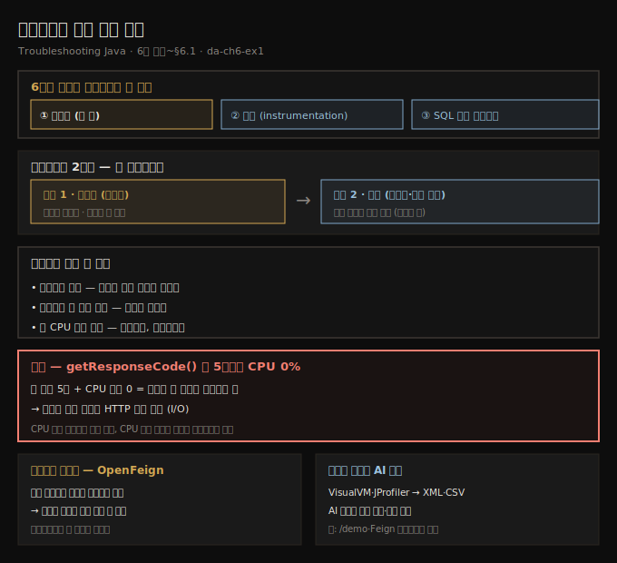
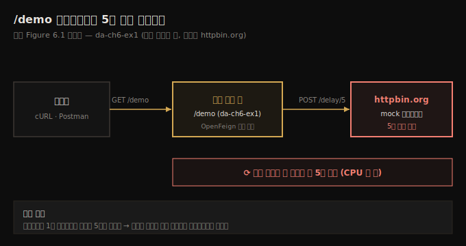
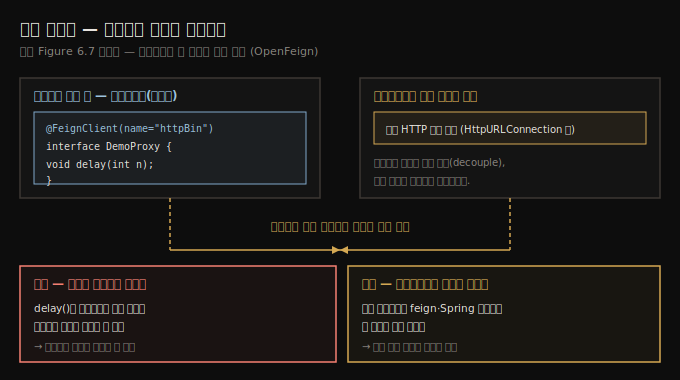

# 샘플링으로 실행 코드 관찰
---
> 샘플링은 프로파일러가 실행 중인 앱을 가볍게 가로채 "지금 무엇이 도는가"의 큰 그림을 그리는 첫 단계라, 어디를 더 파야 할지 짚어 주고, 때로는 그 자체로 충분합니다 — 한 메서드가 5초를 쓰는데 CPU 시간이 0이면 그 메서드는 일하는 게 아니라 기다리는 중입니다

이 노트는 『Troubleshooting Java』 6장의 도입부와 §6.1을 정리합니다. 5장이 프로파일러가 *왜·어디에* 유용한지와 VisualVM 설치·관찰이었다면, 6장은 프로파일러로 숨은 문제를 찾아내는 세 가지 조사 기법으로 들어갑니다 — **샘플링(sampling)**, **프로파일링/계측(profiling, instrumentation)**, 그리고 **앱이 DBMS에 보내는 SQL 쿼리 가로채기**입니다. 저자는 이 셋이 막강하면서도 많은 개발자가 낯설어하고 어렵다고 지레짐작하는 기법이라고 합니다. 이 편에서는 그 첫 갈래인 샘플링을 다룹니다 — 실행되는 코드를 식별해 어디를 더 들여다봐야 할지 정하는 기법입니다. 예제는 `da-ch6-ex1`로, `/demo` 엔드포인트가 5초나 걸리는 지연 문제를 샘플링으로 추적합니다. 계측과 SQL 쿼리 조사는 다음 편(06-02·06-03)으로 이어집니다.





## 1. 샘플링이란 무엇이고 왜 첫 단계인가
> 샘플링은 실행되는 코드를 식별하는 가벼운 기법으로, 세부는 적지만 무엇이 벌어지는지 큰 그림을 그려 주어 더 분석할 지점을 알려 줍니다 — 그래서 프로파일링은 늘 샘플링부터 시작합니다

샘플링은 프로파일링 도구를 써서 *앱이 실행하는 코드*를 식별하는 접근입니다. 실행에 대한 세부 정보를 많이 주지는 않지만, 무슨 일이 벌어지는지 큰 그림을 그려 주어 무엇을 더 분석해야 할지에 대한 값진 정보를 건넵니다. 이 때문에 샘플링은 앱을 프로파일링할 때 *늘 첫 단계*여야 하고, 많은 경우 샘플링만으로 충분합니다.

저자는 프로파일링 접근이 두 스텝이라고 정리합니다.

- **샘플링** — 어떤 코드가 실행되고 어디를 더 자세히 봐야 할지 판단하는 단계(이 편의 주제)
- **프로파일링(계측, instrumentation)** — 특정 코드 조각의 실행에 대한 더 많은 세부를 얻는 단계(06-02의 주제)

때로는 스텝 1(샘플링)만으로 문제를 이해할 수 있어 앱을 프로파일링(스텝 2)할 필요가 없습니다. 프로파일링은 필요할 때 더 많은 세부를 주지만, 먼저 코드의 *어느 부분*을 프로파일링할지 알아야 하고, 그것을 알려 주는 게 샘플링입니다.

> **왜 늘 샘플링부터인가?** 프로파일링(계측)은 자원을 많이 먹는 무거운 작업이라, 정말 강력한 시스템이 아닌 한 전부 프로파일링하면 엄청난 시간이 듭니다. 샘플링은 가볍게 큰 그림만 보여 주므로, 그것으로 *어디를* 계측할지 먼저 좁히는 것입니다.


## 2. 예제 시나리오 — /demo 엔드포인트의 5초 지연
> da-ch6-ex1은 /demo를 호출하면 httpbin.org의 mock 엔드포인트를 부르고 5초 뒤 응답하는 작은 앱으로, 우리는 이 지연의 원인이 앱인지 다른 무엇인지를 프로파일러로 조사합니다

`da-ch6-ex1`은 엔드포인트 하나(`/demo`)를 노출하는 작은 앱입니다. 누군가 cURL·Postman 같은 도구로 이 엔드포인트를 호출하면, 앱은 다시 `httpbin.org`가 노출하는 엔드포인트를 부릅니다.

저자는 예제·시연에 `httpbin.org`를 즐겨 씁니다. httpbin.org는 Python으로 작성된 오픈소스 웹 앱이자 도구로, 구현 중인 것을 테스트할 수 있는 mock 엔드포인트를 노출합니다. 여기서는 엔드포인트를 부르면 httpbin.org가 정해진 지연을 두고 응답합니다. 이 예제에서는 **5초 지연**을 써서 앱의 지연(latency) 시나리오를 흉내 내고, httpbin.org가 문제의 근본 원인 역할을 맡습니다.

문제는 이렇게 나타납니다. `/demo`를 호출하면 실행에 5초가 걸리는데, 우리는 이를 너무 길다고 봅니다. 이상적으로는 1초 미만이길 바라므로, 왜 이렇게 오래 걸리는지를 이해해야 합니다. 지연을 일으키는 게 우리 앱일까요, 다른 무엇일까요? 우리는 앱이 httpbin.org의 mock 엔드포인트를 불러 지연이 생긴다는 걸 알지만, *이 상황을 프로파일러로 조사하는 법*을 익히려는 것입니다. 그래야 실제 상황에서 같은 기법을 쓸 수 있습니다.

> **느림 조사의 첫 선택지는 프로파일러입니다.** 문제가 꼭 엔드포인트일 필요는 없습니다 — 엔드포인트 호출·프로세스 실행·특정 이벤트의 단순 메서드 호출이든, *느림*이 얽힌 어떤 상황에서도 프로파일러가 첫 선택지여야 합니다. 이 예제는 엔드포인트가 시연하기 가장 쉬워 택한 것일 뿐입니다.





## 3. VisualVM Sampler로 실행 가로채기 — 세 목적
> Sampler 탭은 활성 스레드와 스택 트레이스를 보여 주며, 실행 코드 찾기·CPU 소비 식별·메모리 소비 식별이라는 세 목적에 쓰입니다 — 지연 조사에는 CPU 샘플링을 켭니다

먼저 조사 대상 앱(da-ch6-ex1)을 시작하고, 이어 프로파일링 도구인 VisualVM을 켭니다. 5장에서 다뤘듯 VM 인자 `-Djava.rmi.server.hostname=localhost`를 더해야 VisualVM이 프로세스에 붙을 수 있습니다. 왼쪽 목록에서 프로세스를 고른 뒤 **Sampler 탭**을 선택해 실행 샘플링을 시작합니다.

실행 샘플링에는 세 목적이 있습니다.

- **어떤 코드가 실행되는지 찾기** — 샘플링은 무대 뒤에서 무엇이 도는지 보여 주어, 조사할 앱 부분을 짚는 훌륭한 방법입니다.
- **CPU 소비 식별** — 지연 문제를 조사하고 어떤 메서드들이 실행 시간을 나눠 쓰는지 이해하는 데 씁니다.
- **메모리 소비 식별** — 메모리 관련 문제를 분석할 때 씁니다. 메모리 샘플링·프로파일링은 9장에서 더 다룹니다.

지연을 조사하므로 **CPU**를 선택해 성능 데이터 샘플링을 시작합니다. VisualVM은 활성 스레드 전체와 그 스택 트레이스를 목록으로 보여 줍니다. 프로파일러가 프로세스 실행을 가로채, 호출된 모든 메서드와 대략적인 실행 시간을 표시합니다. `/demo`를 호출하면, 그 기능이 실행될 때 무대 뒤에서 벌어지는 일을 프로파일러가 드러냅니다. 목록에 새 스레드들이 나타나는데, `/demo` 호출이 앱에서 띄운 스레드들입니다. 펼치면 앱이 실행 중에 정확히 무엇을 하는지 보입니다.

> **샘플링은 디버깅 시작점을 찾는 데도 쓰입니다.** 저자는 성능·지연 문제가 아니라 *어디에 중단점을 둘지* 짐작조차 안 갈 때도 샘플링을 자주 썼다고 합니다. 2~3장에서 봤듯 디버깅하려면 어디서 실행을 멈출지(중단점 위치)를 알아야 하는데, 그걸 모르면 디버깅 자체가 불가능합니다. 깔끔한 코드 설계가 없는 앱에서 샘플링은 시작점에 빛을 비춰 줍니다.


## 4. CPU 시간 vs 총 실행 시간 — 일하는가, 기다리는가
> 스택 트레이스를 펼쳐 최대 실행 시간을 따라가면 getResponseCode()가 5초를 쓰는 게 보이지만, 그 CPU 시간은 0입니다 — 메서드가 HTTP 응답을 기다릴 뿐 CPU 자원을 쓰지 않으므로, 문제는 앱이 아니라 응답 대기입니다

무엇이 실행되는지 알고 싶을 때는, 관심 있는 앱 메서드가 보일 때까지 스택 트레이스를 펼치면 됩니다. 지연 문제를 조사할 때는 최대 실행 시간을 따라 스택을 펼칩니다. 마지막 메서드의 작은 `(+)` 버튼으로 펼쳐 가면, 약 5초가 걸린 메서드 한 곳을 찾게 됩니다 — `HttpURLConnection` 클래스의 `getResponseCode()`입니다. 이 예제에서는 단 한 메서드가 느림을 일으킵니다.

여기서 핵심은 그 메서드의 **CPU 시간(메서드가 실제로 일한 시간)이 0**이라는 점입니다. 메서드가 5초를 실행에 쓰지만 CPU 자원은 쓰지 않습니다 — HTTP 호출이 끝나 응답이 오기를 *기다리는* 중이기 때문입니다. 결론은 문제가 앱에 있지 않다는 것입니다. 앱은 자신의 HTTP 요청에 대한 응답을 기다려서 느릴 뿐입니다.

> **총 CPU 시간과 총 실행 시간을 구분하면 길이 갈립니다.** 메서드가 CPU 시간을 쓰면 그 메서드는 *일하는* 중입니다 — 이때 성능을 올리려면 보통 알고리즘을 손봐 복잡도를 낮춰야 합니다. 반대로 CPU 시간은 적은데 실행 시간이 길면, 메서드는 무언가를 *기다리는* 중입니다 — 시간은 오래 걸리지만 앱은 아무 일도 안 합니다. 이때는 앱이 *무엇을 기다리는지*를 찾아야 합니다.


## 5. 의존성 메서드까지 보인다 — OpenFeign과 동적 프록시
> 프로파일러는 앱 코드뿐 아니라 의존성(라이브러리·프레임워크) 메서드도 가로채는데, da-ch6-ex1은 OpenFeign으로 httpbin.org를 부릅니다 — 동적 프록시가 구현을 런타임에 정하므로 코드만 읽어서는 실제 HTTP 전송 구현을 짚을 수 없습니다

프로파일러가 앱 코드베이스만 가로채는 게 아니라는 점도 중요합니다. 스택 트레이스에는 앱 코드에 속하지 않는 패키지들 — 의존성의 메서드들 — 도 함께 나타납니다. 이 예제에서 앱은 **OpenFeign**이라는 의존성으로 httpbin.org 엔드포인트를 부릅니다. OpenFeign은 Spring 생태계의 프로젝트로, Spring 앱이 REST 엔드포인트를 호출하는 데 씁니다. 예제가 Spring 앱이라 스택 트레이스에 Spring 관련 기술 패키지가 보입니다. 스택의 각 부분이 무엇을 하는지 다 이해할 필요는 없습니다 — 실제 상황에서도 그렇습니다.

> **왜 의존성 메서드 관찰이 중요한가?** 어떤 의존성에서 무엇이 실행되는지를 *다른 방법으로는 거의 짚을 수 없는* 경우가 있기 때문입니다.

httpbin.org를 부르는 우리 앱 코드를 봐도 HTTP 요청을 보내는 실제 구현은 보이지 않습니다. 오늘날 많은 Java 프레임워크가 그렇듯, 의존성이 **동적 프록시(dynamic proxy)**로 구현을 분리(decouple)하기 때문입니다.

```java
// listing 6.1 — OpenFeign으로 만든 HTTP 클라이언트
@FeignClient(name = "httpBin", url = "${httpBinUrl}")
public interface DemoProxy {

  @PostMapping("/delay/{n}")
  void delay(@PathVariable int n);
}
```

동적 프록시는 앱이 메서드 구현을 *런타임에* 고르게 해 줍니다. 어떤 기능이 동적 프록시를 쓰면, 인터페이스가 선언한 메서드를 호출하면서도 실제로 어떤 구현이 런타임에 주어질지 모른 채 부를 수 있습니다. 프레임워크의 이런 능력을 쓰는 게 편하지만, 단점은 *문제를 어디서 조사할지 알기 어렵다*는 것입니다. 바로 이 지점에서 프로파일러가 코드만으로는 안 보이는 실제 실행 경로를 드러냅니다.





## 6. 샘플링 데이터를 내보내 AI로 분석하기
> 현대 프로파일링 도구는 샘플링·프로파일링 데이터를 XML·CSV 같은 텍스트로 내보낼 수 있어, 그 파일을 AI 비서에게 넘기면 호출 트리를 훑고 병목을 짚는 분석을 돕게 할 수 있습니다

현대 프로파일링 도구는 샘플링·프로파일링 데이터를 텍스트 파일(보통 XML·CSV)로 내보내는 기능을 흔히 제공합니다. 저자는 VisualVM과 JProfiler를 예로 듭니다 — GUI 생김새는 다르지만 둘 다 버튼 하나로 프로파일링 데이터를 여러 형식으로 내보냅니다. VisualVM은 CPU 샘플링 스냅숏을 저장할 수 있고, JProfiler는 프로파일링 데이터를 내보내는 선택지를 줍니다. 도구마다 내보낸 데이터의 구조가 달라도, 그 차이는 AI 비서가 어렵지 않게 다룹니다.

내보낸 데이터를 즐겨 쓰는 AI 비서와 공유하면 값진 통찰을 얻을 수 있습니다. 저자는 ChatGPT가 제공된 데이터를 분석해 `/demo` 엔드포인트의 지연 병목을 짚고, `DemoController.demo` 메서드와 Feign 클라이언트에서 문제를 부각해 주는 예를 보여 줍니다. 클릭 몇 번과 내보낸 데이터 한 줌이면, 머리를 쥐어짜던 시간을 "아하" 하는 순간으로 바꿀 수 있다는 것입니다. AI가 호출 트리를 가르고 병목을 짚는 무거운 일을 맡고, 우리는 그 결론을 활용하면 됩니다.


## 7. 면접 한 줄 정리
> 샘플링이 무엇이고 어떻게 읽는지 핵심을 한 문장으로 점검합니다

- **샘플링이란?** 프로파일러가 실행 중인 앱을 가볍게 가로채 *어떤 코드가 실행되는지*의 큰 그림을 그리는 기법입니다. 세부는 적지만 어디를 더 파야 할지 짚어 주어, 프로파일링의 *첫 단계*로 씁니다.
- **왜 늘 샘플링부터 하나?** 프로파일링(계측)은 자원을 많이 먹어 전부 계측하면 시간이 엄청 듭니다. 샘플링으로 *어디를* 계측할지 먼저 좁히는 것입니다.
- **샘플링이 주는 세 정보는?** 실행되는 코드, 메서드별 총 실행 시간, 총 CPU 실행 시간입니다.
- **CPU 시간과 총 실행 시간을 왜 구분하나?** CPU 시간을 쓰면 메서드가 *일하는* 중(알고리즘 개선 대상)이고, CPU 시간은 적은데 실행 시간이 길면 무언가를 *기다리는* 중입니다. da-ch6-ex1의 `getResponseCode()`는 5초를 쓰지만 CPU 시간이 0이라, 앱이 아니라 HTTP 응답 대기가 원인입니다.
- **프로파일러가 의존성 메서드까지 보여 주는 게 왜 중요한가?** OpenFeign처럼 **동적 프록시**로 구현을 런타임에 분리하는 프레임워크에서는 코드만 읽어서는 실제 실행 경로를 짚을 수 없는데, 프로파일러가 그 경로를 드러내기 때문입니다.
- **샘플링 데이터를 AI로 어떻게 쓰나?** XML·CSV로 내보내 AI 비서에게 넘기면 호출 트리를 훑고 병목(예: `/demo`·Feign 클라이언트)을 짚는 분석을 돕습니다.


## 관련 문서
- [이 책 인덱스 (Troubleshooting Java MOC)](./README.md) — 장별 정독 노트 진척
- [메모리 누수와 metaspace, AI 활용](./05-03.메모리%20누수와%20metaspace,%20AI%20활용.md) — 5장 마지막 편. 프로파일러로 메모리 문제를 보는 맥락, 이 편 직전
- [instrumentation과 JDBC SQL 가로채기](./06-02.instrumentation과%20JDBC%20SQL%20가로채기.md) — 샘플링으로 좁힌 지점을 계측해 호출 횟수까지 보고, JDBC로 SQL 쿼리를 가로채는 다음 편
