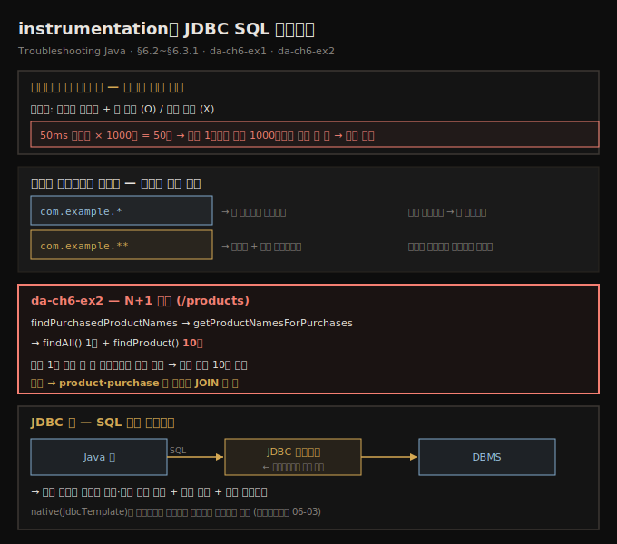
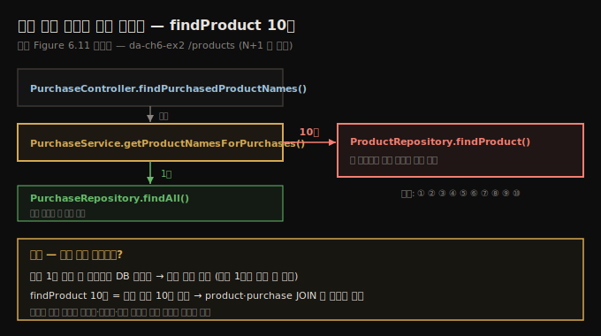
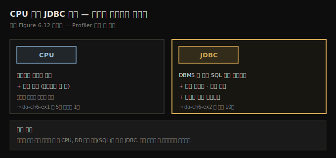
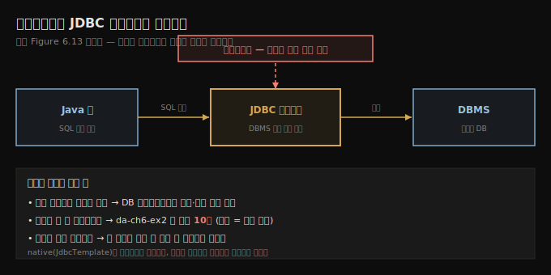
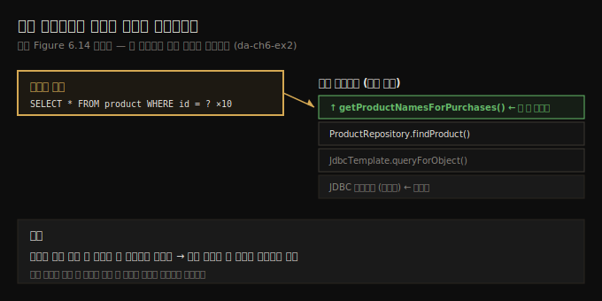

# instrumentation과 JDBC SQL 가로채기
---
> 샘플링은 메서드가 *몇 번* 불렸는지는 못 주므로, 더 깊은 세부가 필요하면 패키지를 좁혀 계측(instrumentation)합니다 — 그리고 프로파일러는 JDBC 드라이버를 가로채 앱이 DBMS에 보내는 SQL 쿼리와 그 실행 횟수까지 그대로 보여 줍니다

이 노트는 『Troubleshooting Java』 6장의 §6.2와 §6.3.1을 정리합니다. 앞 편(06-01)이 샘플링으로 실행 코드의 큰 그림을 그리는 단계였다면, 이 편은 그 다음 두 가지입니다 — 좁힌 지점을 *계측(instrumentation)*해 메서드 호출 횟수까지 얻는 일(§6.2)과, 프로파일러로 앱이 DBMS에 보내는 *SQL 쿼리를 가로채는* 일(§6.3.1)입니다. §6.2는 da-ch6-ex1을 다시 쓰고, §6.3.1은 JDBC와 native 쿼리를 직접 쓰는 da-ch6-ex2에서 N+1 문제를 잡아냅니다. 프레임워크가 생성한 쿼리와 criteria 함정은 다음 편(06-03)으로 이어집니다.





## 1. 왜 계측이 필요한가 — 샘플링이 못 주는 호출 횟수
> 무엇이 실행되는지 아는 것만으로는 부족할 때가 있는데, 샘플링은 메서드 호출 횟수를 주지 않습니다 — 50밀리초짜리 메서드라도 천 번 불리면 50초가 되므로, 정확한 행동을 이해하려면 계측으로 세부를 얻습니다

어떤 코드가 실행되는지 찾는 건 핵심이지만 충분하지 않을 때가 있습니다. 종종 특정 행동을 정확히 이해하려면 더 많은 세부가 필요합니다. 예를 들어 샘플링은 **메서드 호출 횟수**를 주지 않습니다. 어떤 메서드의 실행이 50밀리초밖에 안 걸려도, 그 메서드가 천 번 불리면 샘플링 시 총 50초가 걸립니다. 호출 횟수를 모르면 이 50초가 *느린 메서드 한 번* 때문인지 *빠른 메서드 천 번* 때문인지 구분할 수 없습니다.

이런 세부는 **프로파일링(계측, instrumentation)**으로 얻습니다. da-ch6-ex1을 그대로 쓰되, 이번에는 샘플링이 아니라 계측으로 실행의 세부를 봅니다.


## 2. 계측은 무거우므로 좁혀라 — 패키지 필터 문법
> 계측은 자원을 많이 먹어 전체 코드베이스를 다 프로파일링하는 건 거의 불가능하므로, 조사에 꼭 필요한 패키지·클래스만 골라 가로챕니다 — 무엇을 좁힐지는 먼저 한 샘플링이 알려 줍니다

앱을 프로파일링할 때 전체 코드베이스를 조사하면 안 됩니다. 조사에 필수인 부분만 걸러야 합니다. 계측은 자원을 많이 먹는 작업이라, 정말 강력한 시스템이 아닌 한 전부 프로파일링하면 시간이 엄청 듭니다. 그래서 늘 샘플링부터 시작해, 필요하면 *무엇을 더 계측할지*를 먼저 식별하는 것입니다.

이 예제에서는 앱 코드베이스(의존성 제외)는 무시하고 의존성에서 OpenFeign 클래스만 가져옵니다. Profiler 탭 오른쪽에서 가로챌 부분을 지정하는데, 여기서는 다음을 씁니다.

```text
com.example.**
feign.**
```

- `com.example.**` — `com.example`의 모든 패키지·서브패키지의 코드
- `feign.**` — `feign`의 모든 패키지·서브패키지의 코드

패키지·클래스를 거르는 문법은 규칙 몇 개뿐입니다.

- 규칙마다 한 줄씩 씁니다.
- 별표 하나(`*`)는 *한 패키지*를 가리킵니다. 예: `com.example.*`는 `com.example` 패키지의 모든 클래스를 프로파일링합니다.
- 별표 둘(`**`)은 *패키지와 그 모든 서브패키지*를 가리킵니다. 예: `com.example.**`는 `com.example` 패키지와 모든 서브패키지의 클래스를 뜻합니다.
- 특정 클래스만 프로파일링하려면 그 클래스의 전체 이름을 씁니다. 예: `com.example.controllers.DemoController`.

저자는 §6.1의 샘플링 결과를 보고 이 패키지들을 골랐습니다. 지연 문제가 있는 메서드 호출이 `feign` 패키지 클래스에서 온다는 걸 관찰했기에, 그 패키지와 서브패키지를 목록에 더해 더 많은 정보를 얻은 것입니다.

> **이 경우 호출 횟수는 문제가 아니었습니다.** 계측해 보니 5초를 일으킨 메서드는 *단 한 번* 실행됩니다. 호출 횟수가 적다는 건 불필요한 반복 실행이 없다는 뜻입니다. 만약 다른 시나리오에서 호출이 1초밖에 안 걸리는데 (나쁜 설계 탓에) 다섯 번 불렸다면, 문제는 앱 안에 있었을 테고 어디를 고칠지 알았을 것입니다. 그런 문제는 §6.3에서 분석합니다.


## 3. SQL 쿼리 조사 — 거의 모든 앱이 겪는 흔한 병목
> 거의 모든 현대 앱이 관계형 DB에 기대고, 느린 SQL 쿼리로 인한 성능 문제는 실무에서 지독히 흔합니다 — 코드가 아무리 잘 짜여도 느린 쿼리 하나가 앱 전체를 느리게·타임아웃·크래시로 몰 수 있습니다

이 절은 프로파일러로 앱이 DBMS에 보내는 SQL 쿼리를 식별하는 법을 다룹니다. 저자가 특히 아끼는 주제인데, 그럴 만한 이유가 있습니다. 거의 모든 현대 앱이 데이터를 저장·조회하려 관계형 DB에 기대고, 실무에서 느린 SQL 쿼리로 인한 성능 문제가 지독히 흔하기 때문입니다(Bonteanu & Tudose, 2024).

DB 성능은 앱이 사용자에게 얼마나 빠르고 반응성 있게 느껴지는지를 크게 좌우합니다. 코드가 잘 짜여 있어도, 잘못 짜였거나 느린 쿼리 하나가 앱 전체를 굼뜨게 하거나 타임아웃·크래시로 몰 수 있습니다. 특히 앱이 커지고 더 많은 사용자가 동시에 쓰기 시작하면 그렇습니다.

문제를 더 복잡하게 만드는 건, 많은 현대 앱이 SQL 쿼리를 직접 짜지 않는다는 점입니다. 대신 JPA·Hibernate·Spring Data 같은 라이브러리·프레임워크로 쿼리를 자동 생성합니다. 편하지만, 어떤 SQL이 DB로 보내지는지 정확히 모를 수 있다는 뜻입니다. 성능 문제가 나타나면 어디서 잘못됐는지 짐작하기 어렵습니다. 바로 여기서 프로파일러가 등장합니다 — 좋은 프로파일러는 *어떤 쿼리가 실행되고, 각각 얼마나 걸리며, 얼마나 자주 도는지*를 정확히 보여 줍니다.


## 4. da-ch6-ex2 — 프로파일러가 코드 없이 알고리즘을 드러낸다
> /products를 호출하면 프로파일러는 코드를 보지 않고도 findPurchasedProductNames→getProductNamesForPurchases→findAll·findProduct(10회)라는 호출 그래프를 그려 주어, 한 메서드가 10번 불린다는 설계 문제를 짚어 줍니다

da-ch6-ex2도 작은 앱입니다. 인메모리 DB에 두 테이블(`product`·`purchase`)을 구성하고 레코드 몇 개를 채웁니다. `/products` 엔드포인트를 호출하면 *구매된 제품* 전부를 노출합니다 — `purchase` 테이블에 구매 기록이 하나 이상 있는 제품을 말합니다. 목표는 코드를 먼저 보지 않고, 이 엔드포인트를 호출할 때 앱의 행동을 분석하는 것입니다. 프로파일러만으로 얼마나 알 수 있는지 보려는 것입니다.

이미 06-01에서 샘플링을 배웠으니 여기서는 Profiler 탭을 쓰지만, 실제 상황에서는 늘 샘플링부터입니다. 앱을 시작하고 cURL·Postman으로 `/products`를 호출하면 프로파일러가 정확히 무슨 일이 벌어지는지 보여 줍니다.

- `PurchaseController`의 `findPurchasedProductNames()`가 호출되었다.
- 이 메서드가 `PurchaseService`의 `getProductNamesForPurchases()`로 호출을 위임했다.
- `getProductNamesForPurchases()`가 `PurchaseRepository`의 `findAll()`을 호출한다.
- `getProductNamesForPurchases()`가 `ProductRepository`의 `findProduct()`를 **10번** 호출한다.

코드를 보지도 않았는데 무슨 일이 벌어지는지 이만큼 알게 됩니다 — 상자를 열지 않고 퍼즐을 푸는 셈입니다. 프로파일러가 클래스 이름·메서드 이름·그들이 어떻게 함께 도는지까지 줬으니, 이제 코드의 어디를 봐야 할지 정확히 압니다.




대부분의 일이 `PurchaseService`의 `getProductNamesForPurchases()`에서 벌어지므로, 거기를 분석합니다.

```java
// listing 6.2 — PurchaseService의 알고리즘 구현
@Service
public class PurchaseService {

  private final ProductRepository productRepository;
  private final PurchaseRepository purchaseRepository;

  // 생성자 주입 생략

  public Set<String> getProductNamesForPurchases() {
    Set<String> productNames = new HashSet<>();
    List<Purchase> purchases = purchaseRepository.findAll();   // 모든 구매 조회
    for (Purchase p : purchases) {                             // 각 구매를 순회
      Product product =
        productRepository.findProduct(p.getProduct());         // 구매된 제품 상세 조회
      productNames.add(product.getName());
    }
    return productNames;
  }
}
```

앱은 목록을 한 번에 가져온 뒤, 그것을 순회하며 DB에서 데이터를 더 가져옵니다. 이런 구현은 보통 설계 문제를 가리킵니다 — 그 많은 쿼리 실행을 대개 *하나로* 줄일 수 있기 때문입니다. 당연히 쿼리가 적을수록 앱이 효율적입니다.


## 5. JDBC 탭으로 SQL 쿼리 가로채기 — 드라이버를 엿본다
> 프로파일러는 CPU 대신 JDBC를 선택하면 앱이 JDBC 드라이버로 DBMS에 보내는 쿼리를 드라이버가 보내기 직전에 복사해 보여 주므로, 그대로 복붙해 DB 클라이언트에서 돌리거나 실행 계획을 볼 수 있습니다

작은 예제라 쿼리를 코드에서 직접 찾는 건 쉽지만, 실제 앱은 작지 않아 코드에서 쿼리를 바로 끌어내기 어려운 경우가 많습니다. 이때 프로파일러로 앱이 DBMS에 보내는 모든 SQL 쿼리를 끌어낼 수 있습니다. CPU 버튼 대신 **JDBC 버튼**을 선택해 SQL 쿼리 프로파일링을 시작합니다.




도구가 무대 뒤에서 하는 일은 단순합니다. Java 앱은 SQL 쿼리를 **JDBC 드라이버**를 통해 DBMS에 보냅니다. 프로파일러는 드라이버를 가로채, 드라이버가 DBMS로 보내기 *직전에* 쿼리를 복사합니다. 결과는 훌륭합니다 — 쿼리를 그대로 복사해 DB 클라이언트에 붙여 넣고 실행하거나 실행 계획(plan)을 조사할 수 있습니다.




프로파일러는 앱이 쿼리를 DBMS로 몇 번 보냈는지도 보여 줍니다. 이 경우 앱은 첫 쿼리를 **10번** 보냈습니다. 같은 쿼리를 여러 번 반복해 불필요한 시간·자원을 쓰는 잘못된 설계입니다. 구현한 개발자는 구매 목록을 얻은 뒤 각 구매마다 제품 상세를 가져오려 했지만, 두 테이블(`product`·`purchase`) 사이의 **JOIN** 한 방이면 한 단계로 해결됩니다. VisualVM 덕에 원인을 짚었고, 무엇을 바꿔야 할지 정확히 압니다.

각 쿼리마다 프로파일러는 실행 스택 트레이스도 줍니다. 스택을 펼치면 보통 그 쿼리를 보낸 앱 코드베이스의 첫 메서드를 찾을 수 있습니다. 원인을 짚은 뒤에는 코드를 읽어 구현을 최적화할 방법을 찾습니다 — 이 예제에선 전부 한 쿼리로 합칠 수 있었습니다. 사소한 실수처럼 보여도, 강력한 조직이 만든 큰 앱에서도 이런 경우를 만납니다.





## 6. native 쿼리도 가로챈다 — 하지만 요즘은 드물다
> da-ch6-ex2는 JDBC로 native SQL을 코드에 직접 두므로 복사가 쉬워 보이지만, 오늘날 많은 앱은 Hibernate·JOOQ 같은 프레임워크로 native 쿼리를 코드에 두지 않습니다 — 그래서 프로파일러의 가로채기가 더 값집니다

da-ch6-ex2는 JDBC로 SQL을 보내고, 쿼리를 native 형태로 Java 코드에 직접 둡니다. 그래서 코드에서 바로 복사하면 될 듯합니다.

```java
// listing 6.4 — native SQL 쿼리를 쓰는 리포지토리
@Repository
public class ProductRepository {

  private final JdbcTemplate jdbcTemplate;

  // 생성자 주입 생략

  public Product findProduct(int id) {
    String sql = "SELECT * FROM product WHERE id = ?";   // 앱이 DBMS에 보내는 native SQL
    return jdbcTemplate.queryForObject(sql, new ProductRowMapper(), id);
  }
}
```

다만 오늘날 앱에서는 native 쿼리를 코드에서 보는 일이 점점 드뭅니다. 많은 앱이 Hibernate(가장 널리 쓰이는 JPA 구현)나 JOOQ(Java Object Oriented Querying) 같은 프레임워크를 쓰고, native 쿼리는 코드에 직접 있지 않습니다. 이런 상황에서 프로파일러의 가로채기가 진가를 발휘합니다 — 기술이 무엇이든 드라이버 직전에서 쿼리를 꺼내 주기 때문입니다. 프레임워크가 생성한 쿼리를 다루는 법은 다음 편(06-03)에서 이어집니다.


## 7. 면접 한 줄 정리
> 계측과 JDBC 쿼리 가로채기의 핵심을 한 문장으로 점검합니다

- **샘플링과 계측(instrumentation)은 무엇이 다른가?** 샘플링은 가볍게 큰 그림(무엇이 도는지·총 시간)을 주지만 *호출 횟수*는 못 줍니다. 계측은 무겁지만 메서드가 몇 번 불렸는지 같은 세부를 줍니다 — 50ms짜리도 천 번 불리면 50초입니다.
- **왜 계측은 패키지를 좁히나?** 자원을 많이 먹어 전체를 계측하면 거의 불가능하므로, 샘플링으로 좁힌 패키지·클래스만 가로챕니다. `*`는 한 패키지, `**`는 패키지+서브패키지, 전체 클래스명은 그 클래스만입니다.
- **N+1 문제란?** 목록을 가져오는 초기 쿼리 1개 뒤에, 그 N개 레코드마다 별도 쿼리를 N번 더 보내는 설계입니다. da-ch6-ex2는 `findProduct()`를 10번 불러 같은 쿼리를 10번 보냅니다 — JOIN 한 방으로 줄일 수 있습니다.
- **프로파일러가 SQL을 어떻게 가로채나?** Java 앱은 JDBC 드라이버로 DBMS에 쿼리를 보내는데, 프로파일러가 드라이버를 가로채 보내기 *직전에* 쿼리를 복사합니다. CPU 대신 **JDBC**를 선택하면 쿼리·실행 횟수·스택 트레이스를 줍니다.
- **가로챈 쿼리로 무엇을 하나?** 그대로 복붙해 DB 클라이언트에서 실행하거나 실행 계획을 보고, 스택 트레이스로 그 쿼리를 보낸 앱 코드 지점을 역추적합니다.


## 관련 문서
- [이 책 인덱스 (Troubleshooting Java MOC)](./README.md) — 장별 정독 노트 진척
- [샘플링으로 실행 코드 관찰](./06-01.샘플링으로%20실행%20코드%20관찰.md) — 이 편의 전제. 샘플링으로 큰 그림을 그려 어디를 계측할지 좁히는 단계
- [프레임워크가 만든 SQL과 criteria 함정](./06-03.프레임워크가%20만든%20SQL과%20criteria%20함정.md) — JPA·Hibernate·criteria query가 생성한 쿼리를 프로파일러로 가로채는 다음 편
