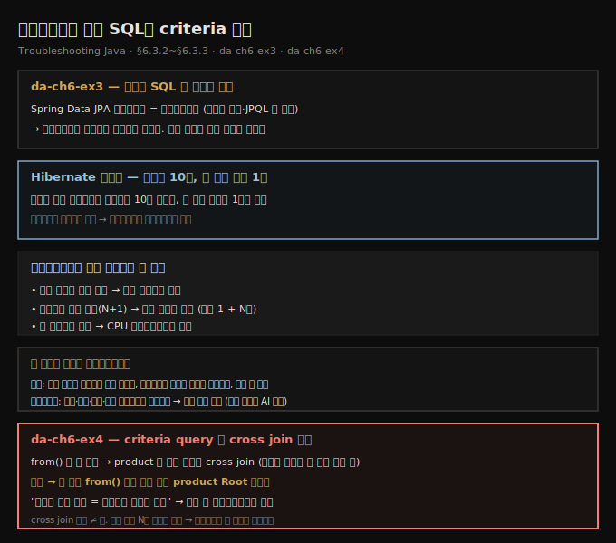
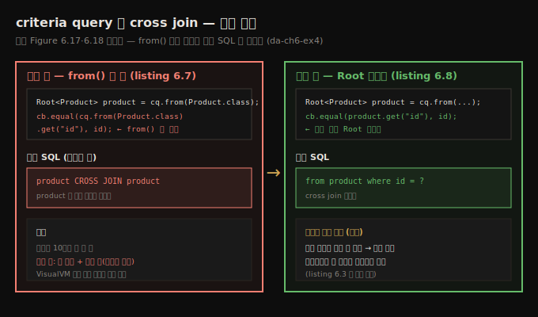

# 프레임워크가 만든 SQL과 criteria 함정
---
> 프레임워크가 무대 뒤에서 SQL을 생성하면 코드에 쿼리가 안 보이지만, 프로파일러는 드라이버 직전에서 그것을 그대로 가로챕니다 — 그래서 Hibernate의 N+1, criteria query의 잘못된 cross join 같은, 코드만 봐서는 안 보이는 함정을 눈으로 잡아낼 수 있습니다

이 노트는 『Troubleshooting Java』 6장의 §6.3.2와 §6.3.3을 정리합니다. 앞 편(06-02)이 JDBC·native 쿼리를 직접 쓰는 앱의 SQL을 가로챘다면, 이 편은 한 걸음 더 나아가 *프레임워크가 생성한* 쿼리를 다룹니다. 먼저 Spring Data JPA·Hibernate가 메서드 이름·JPQL로 만든 쿼리를 프로파일러로 끌어내고(§6.3.2), 이어 criteria query가 코드로 만든 쿼리에서 잘못된 cross join을 잡아냅니다(§6.3.3). 핵심 교훈은 같습니다 — 프레임워크가 쿼리를 투명하게 만들수록 오류가 숨기 쉬워지므로, 프로파일러로 *감사(auditing)*하는 습관이 안전장치가 됩니다.





## 1. da-ch6-ex3 — 코드에 쿼리가 없어도 프로파일러는 본다
> Spring Data JPA 리포지토리는 인터페이스일 뿐이라 SQL이 어디에도 없지만, 프로파일러는 드라이버 직전에서 쿼리를 가로채므로 앱이 실제로 어떤 쿼리를 쓰는지 정확히 보여 줍니다

더 놀라운 걸 봅니다. da-ch6-ex3은 알고리즘 관점에서 앞 예제(da-ch6-ex2)와 같은 일을 합니다 — 구매된 제품의 이름을 돌려줍니다. 비교를 쉽게 하려 로직을 일부러 똑같이 뒀습니다. 차이는 리포지토리 정의에 있습니다.

```java
// Spring Data JPA 리포지토리 — SQL이 보이지 않는다
public interface ProductRepository
    extends JpaRepository<Product, Integer> {
}
```

리포지토리는 단순한 인터페이스이고 SQL 쿼리는 어디에도 보이지 않습니다. Spring Data JPA에서 앱은 메서드 이름이나 **JPQL(Java Persistence Query Language)**이라는 객체 기반 정의 방식으로 무대 뒤에서 쿼리를 생성합니다. 어느 쪽이든 코드에서 쿼리를 복붙할 간단한 방법이 없습니다.

여기서 프로파일러가 구원자로 등장합니다. 도구가 앱이 DBMS로 보내기 *직전에* 쿼리를 가로채므로, 앱이 정확히 어떤 쿼리를 쓰는지 찾아낼 수 있습니다. da-ch6-ex3을 시작하고 앞 두 예제처럼 VisualVM으로 SQL 쿼리를 프로파일링합니다.


## 2. Hibernate가 쿼리를 줄인다 — N+1이지만 두 번째는 1회
> /products를 프로파일링하면 앱은 쿼리 2개를 보내고, 별칭이 이상한 건 프레임워크가 생성했기 때문입니다 — 로직이 같아 리포지토리 메서드를 10번 불러도 두 번째 쿼리는 Hibernate가 가능한 곳을 최적화해 단 한 번만 실행됩니다

`/products` 호출을 프로파일링하면 앱이 SQL 쿼리 **2개**를 보냅니다. 쿼리 안의 별칭(alias)에 이상한 이름이 붙는데, 쿼리가 프레임워크 생성이기 때문입니다. 그리고 서비스 로직이 같아서 앱이 리포지토리 메서드를 10번 부르는데도, **두 번째 쿼리는 단 한 번만 실행**됩니다 — Hibernate가 가능한 곳에서 실행을 최적화하기 때문입니다. 이제 필요하면 이 쿼리를 복사해 SQL 개발 클라이언트에서 조사할 수 있습니다. 느린 쿼리를 조사할 때는 SQL 클라이언트에서 직접 돌려 어느 부분이 DBMS를 힘들게 하는지 봐야 하는 경우가 많습니다.

메서드가 10번 불려도 쿼리는 한 번만 실행됩니다. 영속성 프레임워크가 으레 이런 묘기를 부립니다. 똑똑하지만, 무대 뒤 동작이 복잡성을 더하기도 합니다. 또 프레임워크를 제대로 이해하지 못한 사람이 문제를 일으키는 코드를 짤 수도 있습니다. 이것이 프로파일러로 프레임워크가 생성한 쿼리를 점검해, 앱이 기대대로 동작하는지 확인해야 하는 또 다른 이유입니다.

저자가 프레임워크에서 주로 마주치는, 조사가 필요한 문제는 셋입니다.

- **느린 쿼리로 인한 지연** — 실행 시간을 보는 프로파일러로 쉽게 짚습니다.
- **프레임워크가 생성한 불필요한 다중 쿼리(N+1 문제)** — 쿼리 실행 횟수를 보는 프로파일러로 쉽게 짚습니다.
- **나쁜 앱 설계로 인한 긴 트랜잭션 커밋** — CPU 프로파일링으로 쉽게 짚습니다.

> **N+1 쿼리 문제란?** 프레임워크가 여러 테이블의 데이터가 필요할 때, 보통은 쿼리 하나를 짜 한 번에 다 가져옵니다. 그런데 프레임워크를 잘못 쓰면, 초기 쿼리로 일부만 가져온 뒤 *처음 가져온 레코드 각각에 대해* 별도 쿼리를 돌립니다. 그래서 쿼리 하나가 아니라 *초기 쿼리 1개 + N개*(처음 N개 레코드마다 하나씩)를 보내는데, 이를 N+1 쿼리 문제라 부릅니다. 쿼리 하나로 될 일을 여러 개로 실행해 큰 지연을 일으킵니다.


## 3. 왜 로그가 아니라 프로파일러인가
> 대부분 개발자는 로그나 디버거로 이런 문제를 조사하려 하지만, 로그는 어느 쿼리가 문제인지 짚기 어렵고 파라미터가 쿼리와 분리돼 있으며 어느 코드가 쿼리를 보냈는지도 안 보입니다 — 프로파일러는 쿼리·시간·횟수를 목록으로 줘 거의 즉시 문제를 짚습니다

대부분 개발자는 이런 문제를 로그나 디버거로 조사하려 하지만, 저자 경험상 둘 다 근본 원인을 짚는 최선은 아닙니다.

로그의 첫 문제는 *어느 쿼리가 문제인지 식별하기 어렵다*는 점입니다. 실제 상황에서 앱은 수십 개의 쿼리를 보내고, 그중 일부는 여러 번이며, 대개 길고 파라미터가 많습니다. 프로파일러는 모든 쿼리를 실행 시간·실행 횟수와 함께 목록으로 보여 줘 거의 즉시 문제를 짚게 해 줍니다. 둘째 문제는, 문제 쿼리를 짐작했더라도 *그걸 그대로 가져와 돌리기가 까다롭다*는 점입니다. 로그에서는 파라미터가 쿼리와 분리돼 있습니다.

앱이 Hibernate가 생성한 쿼리를 로그에 찍게 하려면 da-ch6-ex3의 application properties에 다음을 더합니다.

```properties
spring.jpa.show-sql=true
spring.jpa.properties.hibernate.format_sql=true
logging.level.org.hibernate.type.descriptor.sql=trace
```

기술 스택에 따라 로깅 설정은 달라집니다. 책 예제는 Spring Boot와 Hibernate를 씁니다.

```text
// listing 6.5 — Hibernate가 보내는 native 쿼리를 보여 주는 로그
Hibernate:
    select
        product0_.id as id1_0_0_,
        product0_.name as name2_0_0_
    from
        product product0_
    where
        product0_.id=?

... BasicBinder : binding parameter [1] as [INTEGER] - [1]        // 입력 파라미터 값
... BasicExtractor : extracted value ([name2_0_0_] : [VARCHAR]) - [Chocolate]   // 출력 값
```

로그는 쿼리와 그 입력·출력을 보여 주지만, 쿼리를 따로 돌리려면 파라미터 값을 쿼리에 *직접 묶어야* 합니다. 여러 쿼리가 찍히면 원하는 걸 찾기가 정말 번거롭습니다. 게다가 로그는 *어느 앱 코드가 쿼리를 돌렸는지*를 안 보여 줘 조사를 더 어렵게 합니다.

> **로그를 AI로 정돈하기.** 이해하기 어려운 쿼리 로그를 마주하면 AI가 판도를 바꿉니다. AI 비서는 쿼리를 더 읽기 좋은 형태로 다듬고 필요한 파라미터를 깔끔히 묶어 줍니다. 또 파라미터 값을 바꾼 대안 쿼리를 만들어, 테스트나 다양한 시나리오 탐색에 쓸 수 있습니다.


## 4. da-ch6-ex4 — criteria query가 만든 불필요한 cross join
> criteria query는 문자열 대신 Java 코드로 쿼리를 정의해 타입 안전·유연하지만 더 장황하고 실수 여지가 큽니다 — da-ch6-ex4는 from()을 두 번 불러 product 테이블과 자기 자신 사이에 cross join을 만들고, 프로파일러가 이 생성 쿼리를 가로채 문제를 드러냅니다

마지막으로 앱이 코드로 직접 만든 쿼리를 봅니다. da-ch6-ex4는 plain SQL이나 JPQL 대신 **criteria query**를 씁니다 — 쿼리를 문자열로 쓰지 않고 Java 코드로 *무엇을 원하는지* 정의하는 더 프로그래밍적인 방식입니다. 타입 안전과 유연함이 장점이지만, 실제 SQL이 어떻게 생겼는지 보기 어렵다는 단점이 있습니다. 그래서 프로파일러가 도움이 됩니다 — 실제 실행되는 SQL을 드러내 성능 문제가 어디서 오는지 이해하게 해 줍니다.

criteria query는 더 장황하고, 더 어렵다고 여겨지며, 실수할 여지가 큽니다. da-ch6-ex4 구현에는 실수가 하나 들어 있어, 실제 앱에서 큰 성능 문제를 일으킬 수 있습니다.

```java
// listing 6.7 — cross-join 문제의 원인
public class ProductRepository {

  private final EntityManager entityManager;
  // 생성자 생략

  public Product findById(int id) {
    CriteriaBuilder cb = entityManager.getCriteriaBuilder();
    CriteriaQuery<Product> cq = cb.createQuery(Product.class);

    Root<Product> product = cq.from(Product.class);   // from() 첫 호출
    cq.select(product);

    Predicate idPredicate = cb.equal(
      cq.from(Product.class).get("id"), id);          // from() 두 번째 호출 ← 실수
    cq.where(idPredicate);

    TypedQuery<Product> query = entityManager.createQuery(cq);
    return query.getSingleResult();
  }
}
```

JDBC 프로파일링으로 쿼리를 가로채면, `product` 테이블과 *자기 자신* 사이의 **cross join**이 들어 있는 게 보입니다. 큰 문제입니다. 테이블에 레코드가 10개뿐이라 여기서는 수상한 점이 안 보이지만, 레코드가 많은 실제 앱에서는 이 cross join이 큰 지연과 끝내는 잘못된 출력(중복 행)까지 일으킵니다. VisualVM으로 쿼리를 가로채 읽기만 해도 문제가 짚입니다.

저자는 JPA 구현(예: Hibernate)에 대해 이렇게 말합니다 — "좋은 점은 쿼리 생성을 투명하게 만들어 일을 줄인다는 것이고, 나쁜 점은 쿼리 생성을 투명하게 만들어 앱을 오류에 더 취약하게 한다는 것이다." 그래서 이런 프레임워크를 쓸 때는 개발 과정에서 쿼리를 프로파일링해 이런 문제를 미리 찾으라고 권합니다. 프로파일러 사용은 문제를 *찾기*보다 *감사(auditing)* 목적에 가깝지만, 좋은 안전장치입니다.

원인은 작지만 효과가 큰 실수입니다 — `from()` 메서드를 두 번 불러 Hibernate에 cross join을 지시한 것입니다.


## 5. 수정 — Root를 재사용하되, N회 반복은 별건
> from()을 두 번째로 부르는 대신 이미 만든 product 인스턴스를 쓰면 cross join이 사라지지만, 앱이 같은 쿼리를 여러 번 돌리는 문제는 그대로 남아 알고리즘 자체를 한 쿼리로 리팩토링해야 합니다

해결은 쉽습니다 — `from()`을 두 번째로 부르는 대신 이미 만든 `product` 인스턴스를 씁니다.

```java
// listing 6.8 — cross-join 문제 수정
public Product findById(int id) {
    CriteriaBuilder cb = entityManager.getCriteriaBuilder();
    CriteriaQuery<Product> cq = cb.createQuery(Product.class);

    Root<Product> product = cq.from(Product.class);
    cq.select(product);

    Predicate idPredicate = cb.equal(product.get("id"), id);   // 이미 있는 Root 객체 재사용
    cq.where(idPredicate);

    TypedQuery<Product> query = entityManager.createQuery(cq);
    return query.getSingleResult();
}
```

이 작은 변경 뒤에는 생성된 SQL에 불필요한 cross join이 더는 들어가지 않습니다. 다만 앱은 *여전히 같은 쿼리를 여러 번 실행*하는데, 이는 최적이 아닙니다. 데이터를 가져오는 알고리즘 자체를 — 앞서 da-ch6-ex2(listing 6.3)에서 본 것처럼 — 가능하면 쿼리 하나로 리팩토링해야 합니다. cross join 제거와 N회 반복 제거는 별개의 두 문제입니다.





## 6. 면접 한 줄 정리
> 프레임워크 생성 쿼리와 criteria 함정의 핵심을 한 문장으로 점검합니다

- **코드에 쿼리가 없는데 프로파일러가 어떻게 보나?** Spring Data JPA 리포지토리는 인터페이스뿐이라 SQL이 안 보이지만, 프로파일러가 JDBC 드라이버 *직전에서* 쿼리를 가로채므로 실제 쓰는 쿼리를 그대로 봅니다. 생성 쿼리는 별칭 이름이 이상합니다.
- **메서드를 10번 부르는데 왜 두 번째 쿼리는 1회만 실행되나?** Hibernate가 가능한 곳에서 실행을 최적화하기 때문입니다. 그래서 프레임워크 동작이 기대대로인지 프로파일러로 점검해야 합니다.
- **N+1 쿼리 문제란?** 초기 쿼리 1개로 N개 레코드를 가져온 뒤, 각 레코드마다 별도 쿼리를 N번 더 보내는 것입니다. 쿼리 하나로 될 일을 1+N개로 실행해 큰 지연을 만듭니다.
- **왜 로그가 아니라 프로파일러인가?** 로그는 어느 쿼리가 문제인지 짚기 어렵고, 파라미터가 쿼리와 분리돼 그대로 돌리기 까다로우며, 어느 코드가 보냈는지도 안 보입니다. 프로파일러는 쿼리·시간·횟수·스택 트레이스를 목록으로 줍니다.
- **criteria query의 cross join은 왜 생겼나?** `from()`을 두 번 불러 Hibernate에 cross join을 지시한 실수입니다. 두 번째 `from()` 대신 이미 만든 `product` Root를 재사용하면 사라집니다.
- **cross join을 고치면 끝인가?** 아닙니다. 같은 쿼리를 N번 반복 실행하는 문제는 별건으로 남아, 알고리즘을 쿼리 하나로 리팩토링해야 합니다.


## 관련 문서
- [이 책 인덱스 (Troubleshooting Java MOC)](./README.md) — 장별 정독 노트 진척
- [instrumentation과 JDBC SQL 가로채기](./06-02.instrumentation과%20JDBC%20SQL%20가로채기.md) — 이 편의 전제. JDBC·native 쿼리를 가로채는 법과 N+1 진단
- [05_JVM 폴더 인덱스](../../README.md) — JVM 정독 노트 네 권의 상위 인덱스
