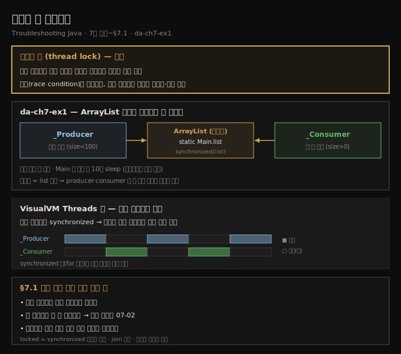
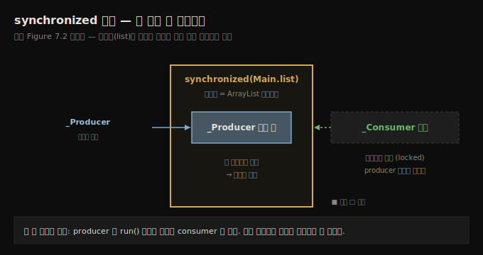

# 스레드 락 모니터링
---
> 스레드 락은 여러 스레드가 같은 자원에 동시에 접근하지 못하게 막는 장치라 충돌을 피하지만 서로를 기다리다 막히면 문제가 되고, 프로파일러의 Threads 탭은 producer-consumer가 synchronized 블록을 번갈아 점유하며 한쪽이 실행하면 다른 쪽이 대기하는 그 흐름을 색으로 드러냅니다

이 노트는 『Troubleshooting Java』 7장의 도입부와 §7.1을 정리합니다. 6장이 프로파일러로 *숨은 문제*(샘플링·SQL 쿼리)를 찾는 장이었다면, 7장은 멀티스레드 아키텍처에서 *락(lock)*을 조사하는 장입니다. 스레딩은 개발에서 가장 까다로운 부분 중 하나이고, 동작하게 만든 뒤 *성능까지* 끌어올리는 건 또 다른 차원의 고통입니다. 7장의 기법은 멀티스레드 앱의 실행에 필요한 가시성을 주어, 문제가 운영 환경의 악몽이 되기 전에 짚게 해 줍니다.

이 장을 제대로 따라가려면 Java 스레딩 기초 — 스레드 상태와 동기화 — 를 알아야 합니다(원서는 부록 D를 복습 자료로 안내합니다). 이 편에서는 락이 무엇인지 정의하고, da-ch7-ex1이라는 작은 producer-consumer 앱을 VisualVM의 Threads 탭으로 관찰해 두 스레드가 어떻게 서로를 막는지 *눈으로* 봅니다. 락을 *수치로* 분석하는 일(몇 번·얼마나)은 다음 편(07-02)으로, 대기(wait) 스레드는 그 다음 편(07-03)으로 이어집니다.





## 1. 스레드 락이란 무엇인가 — 필요하지만 실수가 많은 장치
> 스레드 락은 여러 스레드가 같은 자원에 동시에 접근하는 걸 막아 충돌을 피하는 장치이지만, 잘못 구현하면 앱이 얼어붙거나 성능이 떨어지므로 프로파일링으로 최적인지 확인해야 합니다

스레드 락은 서로 다른 스레드 동기화 방식이 만들어 내며, 보통 멀티스레드 아키텍처에서 이벤트 흐름을 통제하려고 구현합니다. 두 가지 전형적인 예가 있습니다.

- 한 스레드가 자원을 *변경하는 동안* 다른 스레드의 접근을 막고 싶을 때
- 한 스레드가 다른 스레드의 실행이 끝나거나 어느 지점에 이르기를 *기다려야* 계속할 수 있을 때

> **정의 — 스레드 락(thread lock)**: 여러 스레드가 같은 자원에 *동시에* 접근하지 못하게 막는 장치입니다. 충돌을 피하게 해 주지만, 스레드들이 서로를 기다리다 멈추면 문제를 일으킬 수도 있습니다.

락은 필요합니다 — 앱이 스레드를 통제하도록 돕습니다. 그러나 스레드 동기화 구현에는 실수의 여지가 큽니다. 잘못 구현된 락은 앱 프리즈(freeze)나 성능 문제를 부릅니다. 그래서 프로파일링 도구로 구현이 최적인지 확인하고, *락에 묶이는 시간을 최소화*해 앱을 더 효율적으로 만들어야 합니다.

§7.1에서 우리가 알고 싶은 것은 셋입니다.

- 어느 스레드가 다른 스레드를 막는가
- 한 스레드가 몇 번 막히는가
- 스레드가 실행 대신 멈춰 있는 시점은 언제인가

이 세부가 앱 실행이 최적인지, 개선 여지가 있는지를 판단하게 해 줍니다.


## 2. 예제 앱 da-ch7-ex1 — ArrayList를 공유하는 producer와 consumer
> 두 스레드가 공통 자원인 ArrayList 하나를 두고, producer는 난수를 더하고 consumer는 그 값을 빼내며, 시작 전 10초를 재워 프로파일러를 붙일 시간을 줍니다

예제 앱은 동시에 도는 두 스레드 — producer와 consumer — 를 구현합니다. producer는 난수를 만들어 리스트에 더하고, consumer는 같은 컬렉션에서 값을 빼냅니다. 둘은 공통 자원인 `ArrayList` 인스턴스 하나를 함께 바꿉니다.

`Main` 클래스가 두 스레드를 시작하는데, 시작 전 **10초**를 재웁니다. 그래야 우리가 프로파일러를 켜고 스레드들의 전체 타임라인을 관찰할 시간이 생깁니다. 스레드 이름을 `_Producer`·`_Consumer`로 줘, 프로파일러에서 쉽게 식별합니다.

```java
// listing 7.1 — 두 스레드를 시작하는 Main
public class Main {
  public static List<Integer> list = new ArrayList<>();

  public static void main(String[] args) {
    try {
      Thread.sleep(10000);              // 프로파일러를 붙일 10초 여유
      new Producer("_Producer").start();
      new Consumer("_Consumer").start();
    } catch (InterruptedException e) {
      log.severe(e.getMessage());
    }
  }
}
```

consumer는 코드 블록을 **백만 번** 순회합니다(몇 초간 돌며 통계를 낼 만큼의 횟수입니다). 매 반복에서 `Main`의 정적 `list`를 쓰는데, 리스트에 값이 있으면 첫 값을 꺼내 제거합니다. 로직 전체가 `list` 인스턴스 *자신을 모니터(monitor)로* 삼아 `synchronized`로 묶여 있습니다. 모니터는 자신이 보호하는 synchronized 블록에 여러 스레드가 동시에 들어오지 못하게 합니다.

```java
// listing 7.2 — consumer 스레드
public class Consumer extends Thread {
  public Consumer(String name) { super(name); }

  @Override
  public void run() {
    for (int i = 0; i < 1_000_000; i++) {   // 백만 번 반복
      synchronized (Main.list) {            // list를 모니터로 동기화
        if (Main.list.size() > 0) {         // 비어 있지 않을 때만 소비
          int x = Main.list.get(0);
          Main.list.remove(0);              // 첫 값을 꺼내 제거
          log.info("Consumer " + Thread.currentThread().getName() + " removed value " + x);
        }
      }
    }
  }
}
```

producer는 consumer와 거의 같습니다. 역시 백만 번 순회하며, 매 반복에서 난수를 만들어 같은 정적 `list`에 더합니다. 다만 리스트 길이가 **100 미만일 때만** 값을 더합니다. producer의 로직도 `list`를 모니터로 삼아 동기화돼, producer와 consumer 중 *한 번에 하나만* 이 리스트를 바꿀 수 있습니다.

```java
// listing 7.3 — producer 스레드
public class Producer extends Thread {
  public Producer(String name) { super(name); }

  @Override
  public void run() {
    Random r = new Random();
    for (int i = 0; i < 1_000_000; i++) {
      synchronized (Main.list) {
        if (Main.list.size() < 100) {       // 100개 미만일 때만 추가
          int x = r.nextInt();
          Main.list.add(x);
          log.info("Producer " + Thread.currentThread().getName() + " added value " + x);
        }
      }
    }
  }
}
```

모니터(리스트 인스턴스)는 한 스레드만 자기 로직에 들이고, 다른 스레드는 자기 블록 입구에서 *대기*시킵니다 — 먼저 들어간 스레드가 synchronized 블록을 끝낼 때까지입니다.





## 3. Threads 탭으로 보기 — 색이 교대하는 이유
> Threads 탭에서 두 스레드의 색이 번갈아 바뀌는 건 코드 대부분이 synchronized이기 때문이고, 보통 producer가 돌면 consumer가 대기하지만 synchronized 밖의 for 루프 같은 코드는 둘이 동시에 실행할 수 있습니다

이 앱의 동작과 실행 세부를 프로파일러로 알 수 있을까요? 그렇습니다 — 코드만 노려보며 버그가 가엾어서 제 발로 나타나길 기다리는 고대 기법을 더 좋아하는 게 아니라면요. 실제 앱에서 스레드는 상자에 욱여넣은 전구 줄처럼 얽혀, 코드만 읽어서는 무슨 일이 벌어지는지 늘 알 수는 없습니다. 그때 프로파일러가 등장합니다.

VisualVM의 **Threads 모니터링 탭**에서 보면, 두 스레드의 색(음영)이 번갈아 바뀝니다. 각 스레드의 코드 대부분이 synchronized이기 때문입니다. 대부분의 경우 producer가 돌고 consumer가 기다리거나, consumer가 돌고 producer가 기다립니다.

다만 두 스레드가 *드물게* 코드를 동시에 실행할 수도 있습니다. synchronized 블록 *밖*에 명령이 있어서입니다 — 양쪽 모두 synchronized 밖에 정의된 `for` 루프가 그런 코드입니다. 그 부분은 둘이 동시에 돌 수 있습니다.

> **락(locked)이란 어떤 상태인가?** 스레드는 ① synchronized 블록에 막히거나, ② 다른 스레드의 실행이 끝나기를 기다리거나(joining), ③ 블로킹 객체에 통제될 수 있습니다. 스레드가 막혀 실행을 이어갈 수 없는 상태를 "락에 걸렸다(locked)"고 합니다. 이 락을 *수치로* 들여다보는 일은 다음 편(07-02)의 주제입니다. (VisualVM이 아니어도 JProfiler 같은 다른 프로파일러로 같은 타임라인을 볼 수 있습니다.)


## 4. 면접 한 줄 정리
> 스레드 락의 정의와 Threads 탭이 보여 주는 것의 핵심을 한 문장으로 점검합니다

- **스레드 락이란?** 여러 스레드가 같은 자원에 *동시에* 접근하지 못하게 막는 장치입니다. 충돌(race condition)을 피하지만, 서로를 기다리다 멈추면 프리즈·성능 문제를 일으킵니다.
- **모니터(monitor)란?** synchronized 블록을 보호하는 객체입니다. da-ch7-ex1은 `ArrayList` 인스턴스 자신을 모니터로 써, producer·consumer 중 한 번에 하나만 리스트를 바꾸게 합니다.
- **§7.1에서 락에 대해 무엇을 알고 싶은가?** 어느 스레드가 어느 스레드를 막는가, 한 스레드가 몇 번 막히는가, 언제 멈춰 있는가입니다.
- **Threads 탭의 색이 왜 교대하나?** 코드 대부분이 synchronized라 한쪽이 블록을 점유하면 다른 쪽이 대기하기 때문입니다. synchronized *밖*의 코드(예: for 루프)는 둘이 동시에 실행할 수 있습니다.
- **스레드가 "locked"라는 건?** synchronized 블록에 막히거나, join 대기 중이거나, 블로킹 객체에 통제돼 실행을 이어갈 수 없는 상태입니다.


## 관련 문서
- [이 책 인덱스 (Troubleshooting Java MOC)](./README.md) — 장별 정독 노트 진척
- [프레임워크가 만든 SQL과 criteria 함정](./06-03.프레임워크가%20만든%20SQL과%20criteria%20함정.md) — 6장 마지막 편. 락 다음으로 이어지기 직전, 프로파일러의 SQL 가로채기
- [락 분석 — 자기 자신을 기다리는 스레드](./07-02.락%20분석%20—%20자기%20자신을%20기다리는%20스레드.md) — 이 락을 *수치로* 분석해 몇 번·얼마나 막히는지 보는 다음 편
- [원자 연산과 동시성 컬렉션](../../ch05_efficient-concurrency/03-02.원자%20연산과%20동시성%20컬렉션.md) — synchronized·모니터·동시성 컬렉션 기초 (이 편의 전제 지식)
