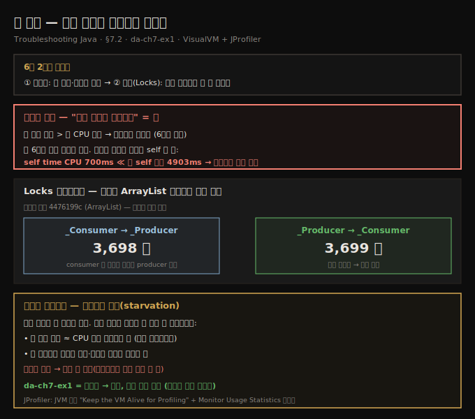
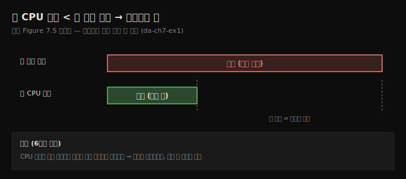
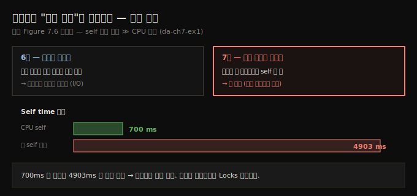
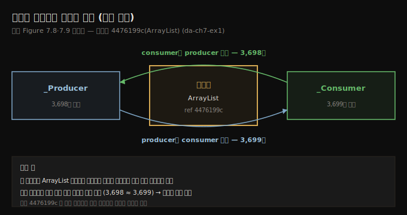

# 락 분석 — 자기 자신을 기다리는 스레드
---
> 샘플링에서 총 실행 시간이 CPU 시간보다 길면 앱이 무언가를 기다린다는 뜻인데, 6장처럼 외부를 기다리는 게 아니라 메서드가 "자기 자신을 기다리면"(self time 4903ms ≫ CPU 700ms) 그 스레드는 락에 걸린 것이고, Locks 프로파일링이 어느 모니터가 몇 번 막았는지까지 드러냅니다

이 노트는 『Troubleshooting Java』 7장의 §7.2를 정리합니다. 앞 편(07-01)이 da-ch7-ex1의 락을 Threads 탭으로 *눈으로* 봤다면, 이 편은 같은 앱을 6장에서 배운 2스텝(샘플링 → 계측)으로 *수치로* 분석합니다. 핵심은 두 가지입니다 — 샘플링에서 "자기 자신을 기다리는" 신호로 락을 의심하는 법, 그리고 Locks 프로파일링으로 어느 모니터가 어느 스레드를 *몇 번* 막았는지 정확히 읽는 법입니다. 그 수치로 두 스레드가 공정하게(fairly) 대우받는지, 실행이 최적인지를 판단합니다. wait/notify로 일부러 대기시키는 변형은 다음 편(07-03)으로 이어집니다.

## 1. 샘플링 — 총 실행 시간이 CPU 시간보다 길다
> 6장과 같은 2스텝(샘플링 → 계측)으로 시작하는데, 샘플링에서 총 실행 시간이 총 CPU 시간보다 길면 앱이 무언가를 기다린다는 신호입니다

락을 쓰는 아키텍처에서는 앱이 최적으로 구현됐는지 확인하고 싶습니다. 그러려면 락을 식별해 *몇 번* 막히고 *얼마나* 오래 막히는지, 그리고 어떤 상황이 스레드를 기다리게 하는지를 알아야 합니다. 프로파일러가 이 모든 정보를 줍니다.

6장에서 익힌 프로파일링 2스텝을 그대로 씁니다.

- **샘플링** — 실행 중 무슨 일이 벌어지는지 큰 그림을 보고 어디를 더 파야 할지 식별합니다.
- **프로파일링(계측)** — 조사하려는 특정 주제의 세부를 얻습니다.

샘플링 결과에서 실행 시간을 보면, **총 실행 시간이 총 CPU 시간보다 길다**는 걸 관찰합니다. 6장에서 같은 상황을 봤고, 그때 이것이 *앱이 무언가를 기다린다*는 뜻임을 알아냈습니다. 이제 무엇을 기다리는지, 그 시간을 줄일 수 있는지를 알아내려 합니다.

## 2. "자기 자신을 기다린다" — 락의 결정적 신호
> 6장에서는 외부 서비스를 기다렸지만, 여기서는 메서드가 외부가 아니라 자기 자신을 기다립니다 — self time이 700ms CPU인데 총 self 실행은 4903ms라, 메서드가 외부를 안 기다리는데도 길면 그 스레드는 락에 걸린 것입니다

샘플링 데이터에서 흥미로운 점이 보입니다 — 메서드가 기다리는데, *다른 무언가*를 기다리는 게 아니라 그저 *자기 자신*을 기다리는 것처럼 보입니다. "Self time" 행은 메서드가 실행에 쓴 시간을 알려 주는데, 이 메서드는 self time으로 CPU 시간은 약 **700ms**뿐인데 총 실행 self time은 훨씬 큰 **4903ms**입니다.

6장에서는 앱이 외부 서비스의 응답을 기다렸습니다 — 호출을 보내고 상대가 답하기를 기다렸으니, 기다리는 이유가 말이 됐습니다. 그런데 여기서는 상황이 묘합니다. 무엇이 이런 동작을 일으킬까요?

> **메서드가 자기 자신을 기다린다는 건 락의 신호입니다.** "메서드가 어떻게 자기를 기다리지? 실행하기가 너무 게으른가?" 싶지만, 메서드가 기다리되 *외부의 무언가*를 기다리는 게 아닌 동작을 보면 그 스레드는 십중팔구 락에 걸린 것입니다 — 다른 스레드가 막았을 수 있습니다. 무엇이 막았는지 더 알려면 계측으로 더 파야 합니다.

샘플링은 모든 질문에 답하지 못했습니다. 메서드들이 기다리는 건 보이지만 *무엇을* 기다리는지는 모릅니다. 그래서 계측(instrumentation)으로 넘어갑니다.

## 3. Locks 프로파일링 — 어느 모니터가 몇 번 막았나
> VisualVM Profiler 탭의 Locks 버튼으로 락을 계측하면 producer·consumer 각각 3,600회 넘게 락이 걸렸고, 스레드를 펼치면 어느 모니터 객체가 그 실행에 영향을 줬는지, 무엇이 막혔고 무엇이 막았는지가 드러납니다

VisualVM에서는 Profiler 탭으로 락 모니터링을 시작합니다. 락 프로파일링을 켜려면 **Locks 버튼**을 씁니다. 프로파일링 세션이 끝나면 producer·consumer 두 스레드 각각에 **3,600회가 넘는 락**이 관찰됩니다.

각 스레드는 이름 왼쪽의 작은 `(+)`로 펼쳐 세부를 봅니다. 그러면 그 스레드의 실행에 영향을 준 *모니터 객체별* 세부를 얻습니다. 프로파일러는 다른 스레드에 막힌 스레드와, *무엇이* 그 스레드를 막았는지를 보여 줍니다.

producer 스레드는 `ArrayList` 타입의 모니터 인스턴스에 막혔습니다. 객체 참조(예: `4476199c`)는 그 객체 인스턴스를 고유하게 식별해, 같은 모니터가 여러 스레드에 영향을 줬는지, 스레드와 모니터의 관계가 정확히 무엇인지 짚게 해 줍니다. 읽는 법은 이렇습니다.

- 참조 `4476199c`(`ArrayList` 인스턴스)인 모니터가 `_Producer` 스레드를 막았다.
- `_Consumer` 스레드가 모니터 `4476199c`를 획득해 `_Producer`를 **3,698번** 막았다.
- `_Producer` 스레드도 모니터 `4476199c`를 **3,699번** 보유(소유)했다 — 즉 `_Producer`가 `_Consumer`를 3,699번 막았다.

consumer 쪽으로 관점을 넓혀도 데이터가 들어맞습니다. 실행 내내 단 하나의 모니터 인스턴스(`ArrayList`)가 두 스레드 중 하나를 번갈아 막습니다. consumer는 결국 **3,699번** 막히고(producer가 ArrayList로 동기화된 블록을 실행하는 동안), producer는 **3,698번** 막힙니다(consumer가 그 모니터로 동기화된 블록을 실행하는 동안). 한 스레드가 다른 스레드를 막는 데 *같은 모니터*를 쓰니, 양쪽 횟수가 거의 대칭입니다.

## 4. JProfiler로도 같은 결론 — 그룹화로 집계 보기
> JProfiler를 붙일 때는 JVM 종료 동작을 "Keep the VM Alive for Profiling"으로 둬야 앱 종료 후에도 결과를 보고, Monitor Usage Statistics에서 락을 스레드별·모니터별로 그룹화해 어느 스레드가 더 영향받는지 집계로 봅니다

저자는 무료이고 익숙해서 VisualVM을 썼지만, 같은 접근을 JProfiler 같은 도구에도 적용할 수 있고 결과는 동일합니다. JProfiler를 프로세스에 붙인 뒤에는 JVM 종료 동작을 **"Keep the VM Alive for Profiling"**으로 설정해야, 앱이 실행을 마친 뒤에도 프로파일링 결과를 볼 수 있습니다.

JProfiler의 **Monitor History** 뷰는 앱 스레드가 겪은 모든 락의 상세 이력 — 이벤트의 정확한 시각, 지속 시간, 락을 일으킨 모니터, 관련 스레드 — 을 보여 줍니다. 대개는 이렇게까지 상세할 필요가 없어, 저자는 이벤트(락)를 스레드별로, 드물게는 모니터별로 그룹화하길 선호합니다. 왼쪽 메뉴의 **Monitor Usage Statistics**에서 관련 스레드별 또는 락을 일으킨 모니터별로 그룹화할 수 있고(모니터 객체의 *클래스*별이라는 더 색다른 옵션도 있습니다), 락을 스레드별로 묶으면 VisualVM과 비슷한 통계 — 각 스레드가 실행 중 3,600회 넘게 락에 걸린다 — 가 나옵니다.

## 5. 실행이 최적인가 — 공정성과 기아(starvation)
> 최적인지는 앱의 목적에 달렸는데, 공유 자원을 두고 동시에 못 도는 두 스레드라면 총 실행 시간이 CPU 시간들의 합에 가깝고 두 스레드가 비슷한 횟수로 막혀야 하며, 한쪽만 우대받으면 다른 쪽이 기아에 빠집니다

실행이 최적인지 답하려면 앱의 목적을 알아야 합니다. 이 앱은 단순한 시연용이라 진짜 목적이 없어 완전히 평가하긴 어렵지만, 공유 자원(리스트)에 *동시에 작업할 수 없는* 두 스레드라는 점을 고려하면 다음을 기대합니다.

- 총 실행 시간이 CPU 실행 시간들의 *합*에 대략 가까워야 합니다(두 스레드가 동시에 못 도니 서로를 배제하므로).
- 두 스레드가 비슷한 실행 시간을 할당받고 비슷한 횟수로 막혀야 합니다. 한쪽이 우대받으면 다른 쪽이 **기아(starvation)** — 불공정하게 막혀 실행 기회를 못 얻는 상태 — 에 빠질 수 있습니다.

다시 분석을 보면 두 스레드는 공정하게 대우받습니다. 실제로 비슷한 횟수로 막히고, 서로를 배제하면서도 비슷한 활성(CPU 시간) 실행을 보입니다. 이는 최적이고, 더 개선할 여지가 많지 않습니다. 다만 이것은 *앱이 무엇을 하는지*와 *우리가 실행에 기대하는 바*에 달려 있습니다.

> **다른 시나리오라면 최적이 아닐 수 있습니다.** 값을 처리하는 앱에서 producer가 값 하나를 리스트에 더하는 데 consumer가 그 값을 처리하는 것보다 더 오래 걸린다고 합시다. 실제 앱에서 스레드들이 똑같이 "힘든" 일을 할 필요는 없으니 충분히 일어날 수 있는 상황입니다. 이때는 ① consumer의 락 횟수를 줄이고 기다리게 해 producer가 더 일하게 하거나, ② producer 스레드를 더 두거나 consumer가 값을 *배치로*(여러 개씩) 읽어 처리하게 해 앱을 개선할 수 있습니다. 모든 앱에 통하는 단 하나의 공식은 없으므로, 멀티스레드 앱을 구현할 때는 프로파일러로 실행 변화를 분석하길 권합니다.

6장에서 그랬듯, 프로파일링 결과를 내보내 즐겨 쓰는 AI 비서에게 의견을 구할 수도 있습니다 — 특히 수많은 세부에 파묻힐 때, AI는 혼돈을 가르는 디지털 마체테처럼 무슨 일이 벌어지는지 해독하는 시간을 줄여 줍니다.

## 6. 면접 한 줄 정리
> 락을 수치로 분석하는 핵심을 한 문장으로 점검합니다

- **샘플링에서 락을 어떻게 의심하나?** 총 실행 시간이 총 CPU 시간보다 길면 앱이 무언가를 기다린다는 뜻이고, 6장처럼 *외부*를 기다리는 게 아니라 메서드가 "자기 자신을 기다리면"(self time ≫ CPU time) 그 스레드는 락에 걸린 것입니다.
- **self time이란?** 메서드가 실행에 쓴 시간입니다. da-ch7-ex1에서 self time CPU는 약 700ms인데 총 self 실행은 4903ms라, 그 차이가 락에 묶인 시간입니다.
- **Locks 프로파일링은 무엇을 주나?** 어느 스레드가 막혔는지, 무엇이 막았는지, 모니터 객체(참조로 식별), 막힌 횟수입니다. 두 스레드 각각 3,600회 넘게 막힙니다.
- **3,698 / 3,699는 무엇인가?** 하나의 `ArrayList` 모니터로 consumer가 producer를 3,698번, producer가 consumer를 3,699번 막은 *상호 차단* 횟수입니다 — 같은 모니터를 쓰니 거의 대칭입니다.
- **실행이 최적인지 어떻게 판단하나?** 앱 목적에 달렸지만, 공유 자원을 두고 동시에 못 도는 스레드라면 총 시간이 CPU 합에 가깝고 두 스레드가 비슷하게 막혀야 합니다. 한쪽만 우대받으면 다른 쪽이 **기아**에 빠집니다.
- **JProfiler에서 주의할 설정은?** JVM 종료 동작을 "Keep the VM Alive for Profiling"으로 둬야 앱 종료 후에도 결과를 봅니다. Monitor Usage Statistics로 스레드별·모니터별 그룹화가 됩니다.

## 관련 문서
- [이 책 인덱스 (Troubleshooting Java MOC)](./README.md) — 장별 정독 노트 진척
- [스레드 락 모니터링](./07-01.스레드%20락%20모니터링.md) — 이 편의 전제. da-ch7-ex1 구조와 Threads 탭으로 락을 눈으로 보는 단계
- [대기 스레드와 wait·notify 함정](./07-03.대기%20스레드와%20wait·notify%20함정.md) — 같은 앱을 wait/notify로 바꿨다 더 느려지는 다음 편
