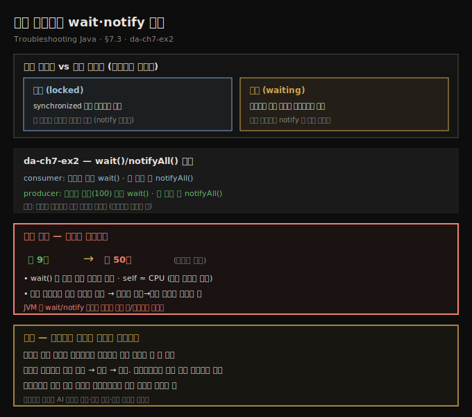
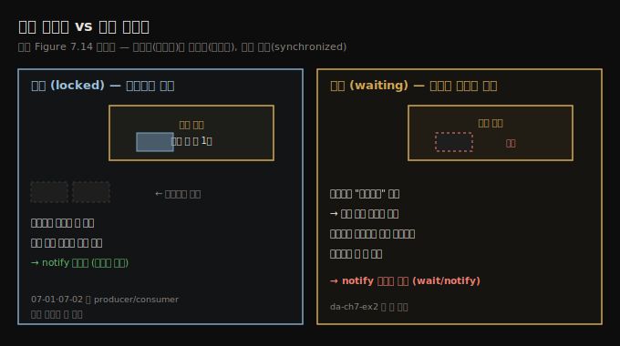
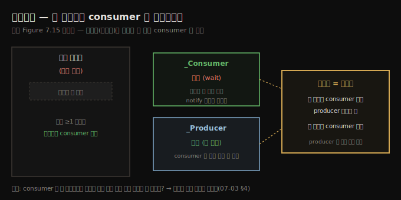
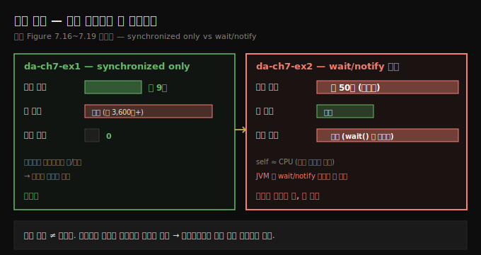

# 대기 스레드와 wait·notify 함정
---
> 락에 걸린 스레드는 synchronized 블록 입구에서 막힌 것이고, 대기(waiting) 스레드는 모니터가 명시적으로 멈춰 세워 notify가 와야 깨어나는 것이라 다릅니다 — da-ch7-ex1을 wait/notify로 "개선"하면 좋아 보이지만 실제로는 9초가 50초로 느려지므로, 들어맞아 보이는 최적화도 반드시 측정해 확인해야 합니다

이 노트는 『Troubleshooting Java』 7장의 §7.3을 정리합니다. 앞 편(07-02)이 락을 수치로 분석했다면, 이 편은 *대기(waiting)* 스레드 — notify를 받아야 깨어나는 스레드 — 를 다룹니다. 먼저 락과 대기가 어떻게 다른지 경찰관·자동차 비유로 잡고, da-ch7-ex1을 `wait()`/`notifyAll()`로 바꾼 da-ch7-ex2를 프로파일링합니다. 스포일러: 그 "개선"은 앱을 더 효율적으로 만들기는커녕 *더 느리게* 만듭니다. 이 편의 진짜 교훈은 동작이 아니라 태도입니다 — 멀티스레드에서는 이론상 좋아 보이는 아이디어가 실제로는 성능 악몽이 되곤 하니, 성공을 선언하기 전에 늘 실험하고 측정하고 분석하라는 것입니다.





## 1. 락된 스레드 vs 대기 스레드 — 경찰관과 자동차
> 모니터는 synchronized 블록 실행을 위해 스레드를 락에 거는데, 이때는 막힌 스레드에게 계속하라고 따로 알리지 않습니다 — 반면 모니터는 스레드를 무기한 기다리게 했다가 나중에 명시적으로 깨울 수도 있고, 그렇게 대기에 든 스레드는 같은 모니터의 notify가 와야 실행으로 돌아옵니다

대기 스레드는 락된 스레드와 다릅니다. 모니터는 synchronized 블록을 실행하려고 스레드를 *락*에 겁니다. 이 경우 모니터가 막힌 스레드에게 "계속하라"고 특정 동작을 해 줄 거라 기대하지 않습니다 — 앞 스레드가 블록을 끝내면 자연히 풀립니다. 그런데 모니터는 스레드를 *무기한* 기다리게 만들고, 나중에 언제 계속할지 스스로 정할 수도 있습니다. 한번 대기에 든 스레드는 *같은 모니터가 notify할 때만* 실행으로 돌아옵니다. 이 "notify받을 때까지 기다리게 하는" 능력은 스레드 통제에 큰 유연성을 주지만, 잘못 쓰면 문제를 일으킵니다.

> **경찰관과 자동차 비유.** synchronized 블록을 경찰관이 통제하는 제한 구역, 스레드를 자동차라고 합시다. 경찰관은 제한 구역(synchronized 블록)에 한 번에 한 대만 들입니다. 그래서 들어가지 못하고 멈춘 차들을 **락됐다(locked)**고 합니다. 경찰관은 *구역 안에서 달리는 차*도 통제할 수 있습니다 — 안에서 달리던 차에게 "명시적으로 계속하라 할 때까지 기다리라"고 명령할 수 있고, 이 차를 **대기 중(waiting)**이라 합니다.

정리하면, **락된 스레드**는 synchronized 블록 *입구*에서 막힌 스레드입니다 — 다른 스레드가 안에서 활발히 도는 동안 모니터가 입장을 안 시킵니다. **대기 스레드**는 모니터가 *명시적으로* 블록 상태로 set한 스레드입니다 — 모니터가 자신이 관리하는 블록 *안의* 어떤 스레드든 기다리게 할 수 있고, 그 스레드는 모니터가 명시적으로 "진행하라" 할 때만 실행을 이어갑니다.





## 2. 시나리오 — consumer가 빈 리스트에서 헛도는 걸 막을까?
> 기존 앱에서 consumer는 리스트가 비면 거짓 조건 위로 헛돌다 JVM이 대기시킬 때까지 CPU를 태우는데, 리스트에 값이 있을 때만 consumer를 돌리고 가득 찼을 때만 producer를 멈추면 더 효율적일 것 같다는 발상에서 출발합니다

같은 앱을 두고 한 개발자가 producer-consumer 아키텍처를 개선하려 합니다. 지금 consumer는 리스트가 비면 할 일이 없어, JVM이 대기시켜 producer를 돌게 할 때까지 *거짓 조건 위로 여러 번 헛돕니다*. producer도 마찬가지로, 리스트에 100개를 채우면 JVM이 consumer를 들여보낼 때까지 거짓 조건 위로 헛돕니다.

그래서 이런 발상이 나옵니다 — consumer에게 소비할 값이 없을 때 *기다리게* 하고, 리스트에 값이 최소 하나 있을 때만 돌리면 어떨까? 비슷하게 producer도 값이 너무 많으면 기다리게 하고, 더할 만할 때만 돌리면? 이러면 앱이 더 효율적이지 않을까?

겉보기엔 영리한 수처럼 보입니다 — 공유 자원에 접근 못 할 때 가만히 차례를 기다리는 게 낫지 않겠습니까? 하지만 곧 보겠지만, 이 선의의 변경은 도움이 되기는커녕 성능을 끌어내립니다.





## 3. wait/notify 구현 — da-ch7-ex2
> consumer는 리스트가 비면 wait()로 기다리고 값을 제거하면 notifyAll()로 대기 스레드를 깨우며, producer는 리스트가 가득 차면 wait()하고 값을 더하면 notifyAll()합니다

새 consumer는 리스트가 비면 소비할 게 없으니 기다립니다. 모니터가 consumer를 대기시키고, producer가 무언가를 더한 *뒤에야* 계속하라고 알립니다. 리스트가 비면 `wait()`로 consumer를 기다리게 하고, consumer가 값을 제거하면 `notifyAll()`로 대기 스레드들을 깨워 — 기다리던 producer가 있으면 리스트가 더는 가득 차지 않았음을 알게 합니다.

```java
// listing 7.4 — 리스트가 비면 기다리는 consumer (da-ch7-ex2)
@Override
public void run() {
  try {
    for (int i = 0; i < 1_000_000; i++) {
      synchronized (Main.list) {
        if (Main.list.size() > 0) {
          int x = Main.list.get(0);
          Main.list.remove(0);
          log.info("Consumer " + Thread.currentThread().getName() + " removed value " + x);
          Main.list.notifyAll();   // 소비 후 대기 스레드에 변경을 알림
        } else {
          Main.list.wait();        // 리스트가 비면 알림이 올 때까지 대기
        }
      }
    }
  } catch (InterruptedException e) {
    log.severe(e.getMessage());
  }
}
```

producer도 비슷합니다 — 리스트에 값이 너무 많으면 기다리고, consumer가 값을 소비하면 결국 producer를 깨워 다시 돌게 합니다.

```java
// listing 7.5 — 리스트가 가득 차면 기다리는 producer (da-ch7-ex2)
@Override
public void run() {
  try {
    Random r = new Random();
    for (int i = 0; i < 1_000_000; i++) {
      synchronized (Main.list) {
        if (Main.list.size() < 100) {
          int x = r.nextInt();
          Main.list.add(x);
          log.info("Producer " + Thread.currentThread().getName() + " added value " + x);
          Main.list.notifyAll();   // 추가 후 대기 스레드에 변경을 알림
        } else {
          Main.list.wait();        // 100개가 차면 알림이 올 때까지 대기
        }
      }
    }
  } catch (InterruptedException e) {
    log.severe(e.getMessage());
  }
}
```


## 4. 측정 결과 — 9초가 50초로, 대기를 옮겼을 뿐
> 샘플링부터 하면 실행이 약 9초에서 약 50초로 크게 느려졌고, 세부를 보면 wait()가 대기 시간 대부분을 차지하며, 락은 줄었지만 그게 도움이 안 됩니다 — wait/notify는 모니터의 자연스러운 락/언락보다 스레드 전환이 더 느립니다

언제나처럼 샘플링부터 시작하는데, 이미 수상합니다 — 실행이 훨씬 오래 걸립니다. §7.1에서 전체 실행이 약 **9초**였는데, 이제 약 **50초**입니다. 엄청난 차이입니다.

샘플 세부를 보면, 우리가 더한 `wait()` 메서드가 스레드 대기 시간 대부분을 일으켰습니다. self 실행 시간이 CPU 실행 시간과 아주 가까워 스레드가 *오래 락되진* 않지만, 우리 목적은 앱을 전체적으로 더 효율적으로 만드는 것이었는데 대기를 한쪽에서 다른 쪽으로 *옮겼을 뿐* 그 과정에서 앱을 더 느리게 만든 것처럼 보입니다.

계측으로 더 파면, 락은 *더 적게* 잡힙니다 — 하지만 실행이 훨씬 느리니 도움이 안 됩니다. JProfiler에서 락 이벤트를 스레드별로 묶으면 락 횟수와 대기 시간을 함께 얻는데, 앞 연습(07-02)에서는 대기 시간이 0이고 락이 훨씬 많았던 반면, 이제는 락이 적고 대기 시간이 깁니다. 이는 **JVM이 wait/notify 방식에서는 synchronized 블록의 모니터로 자연스럽게 락/언락될 때보다 스레드 사이를 더 느리게 전환한다**는 것을 알려 줍니다.




> **들어맞아 보인다고 최적화를 믿지 마라 — 늘 실제 효과를 측정하라.** 프로파일링 도구는 직감이 아니라 단단한 데이터를 줘, 변경이 진짜 개선인지 잘 차려입은 성능 킬러인지 보여 주는 가장 좋은 친구입니다. 데이터 분석이 벅차면 AI 도구가 결과 해석과 병목 식별, 더 나은 접근 제안까지 거들 수 있습니다.


## 5. 면접 한 줄 정리
> 락과 대기의 차이, wait/notify 함정의 핵심을 한 문장으로 점검합니다

- **락된 스레드와 대기 스레드는 어떻게 다른가?** 락된 스레드는 synchronized 블록 *입구*에서 막힌 것으로, 앞 스레드가 끝나면 자연히 풀립니다. 대기 스레드는 모니터가 *명시적으로* 멈춰 세운 것으로, 같은 모니터의 `notify`가 와야 깨어납니다.
- **wait()/notifyAll()은 무엇을 하나?** `wait()`는 조건이 안 맞을 때(리스트가 비거나 가득 참) 스레드를 모니터의 대기 상태로 보내고, `notifyAll()`은 상태가 바뀌었을 때 대기 스레드들을 깨웁니다.
- **da-ch7-ex2의 "개선"은 왜 실패했나?** 실행이 약 9초에서 약 50초로 느려졌습니다. 대기를 한쪽에서 다른 쪽으로 옮겼을 뿐이고, 락은 줄었지만 대기 시간이 길어졌습니다.
- **왜 wait/notify가 더 느린가?** JVM이 wait/notify 방식에서는 synchronized 모니터로 자연스럽게 락/언락될 때보다 스레드 사이 전환을 더 느리게 하기 때문입니다.
- **이 편의 진짜 교훈은?** 들어맞아 보이는 최적화도 *반드시 측정*하라는 것입니다 — 프로파일러는 직감 대신 데이터를 줘 변경이 진짜 개선인지 가립니다.


## 관련 문서
- [이 책 인덱스 (Troubleshooting Java MOC)](./README.md) — 장별 정독 노트 진척
- [락 분석 — 자기 자신을 기다리는 스레드](./07-02.락%20분석%20—%20자기%20자신을%20기다리는%20스레드.md) — 이 편의 전제. 같은 앱(da-ch7-ex1)을 락 횟수로 분석한 단계
- [원자 연산과 동시성 컬렉션](../../ch05_efficient-concurrency/03-02.원자%20연산과%20동시성%20컬렉션.md) — wait/notify·모니터·동시성 기초
- [05_JVM 폴더 인덱스](../../README.md) — JVM 정독 노트 네 권의 상위 인덱스
