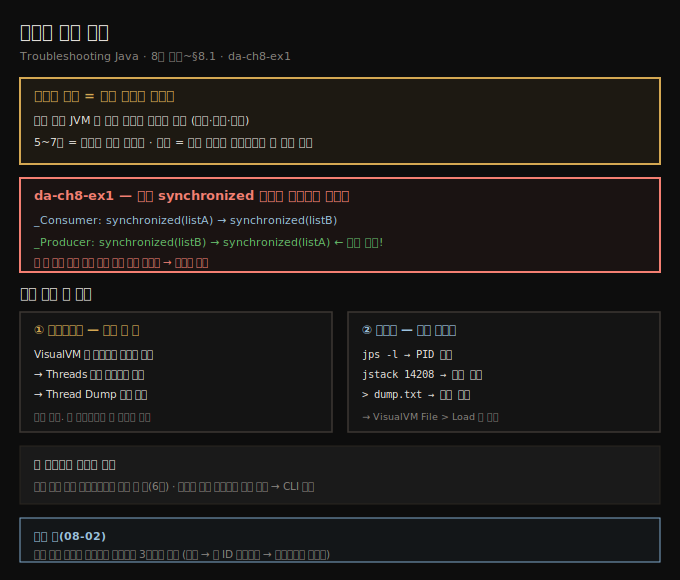
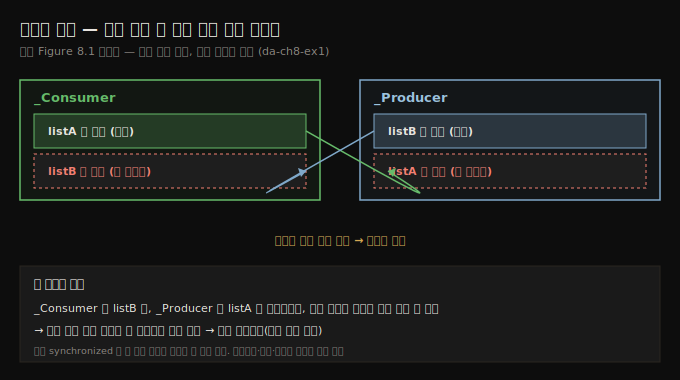
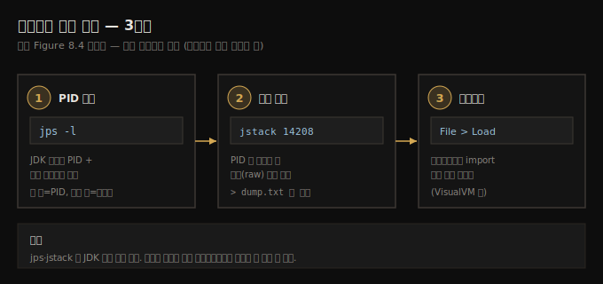

# 스레드 덤프 획득
---
> 스레드 덤프는 특정 순간 JVM 안 모든 스레드의 상태를 찍은 스냅숏이라, 5~7장의 시간 기반 샘플링과 달리 앱이 완전히 얼어붙었을 때도 한 장면을 잡아내 데드락을 진단하게 해 주며, 프로파일러의 버튼 한 번이나 명령줄의 jps→jstack으로 얻습니다

이 노트는 『Troubleshooting Java』 8장의 도입부와 §8.1을 정리합니다. 5~7장이 *시간에 걸쳐* 실행을 샘플링·프로파일링하는 기법이었다면, 8장은 앱이 *완전히 멈춘* 순간을 다룹니다. 여러 스레드가 서로를 기다리다 앱이 응답을 멈추는 **데드락(deadlock)** — 카페에서 계산대 A가 B의 결제 확인을 기다리고 B는 A의 처리를 기다려 가게 전체가 멈춰 선 상황 — 의 원인을 어떻게 짚을까요? 그 답이 **스레드 덤프(thread dump)**입니다.

스레드 덤프는 특정 순간 JVM 안 모든 스레드의 상태를 포착합니다. 어떤 스레드가 실행 중·대기 중·막혀 있는지 보여 줘 데드락, 높은 CPU 사용, 느린 성능 같은 스레딩 문제를 진단하게 해 줍니다. 시간에 걸친 샘플링에 기대는 5~7장의 프로파일링과 달리, 스레드 덤프는 *단일 시점의 스냅숏*을 줍니다 — 앱이 완전히 얼어붙었을 때 결정적입니다. 이 편에서는 데드락을 일부러 만드는 앱(da-ch8-ex1)을 멈추게 한 뒤, 프로파일러와 명령줄 두 방법으로 덤프를 얻습니다. 얻은 덤프를 *읽는* 법은 다음 편(08-02)으로 이어집니다.





## 1. 예제 앱 da-ch8-ex1 — 중첩 synchronized가 만드는 데드락
> 두 스레드가 두 리스트(listA·listB)를 두고 중첩 synchronized 블록을 쓰는데, 한 스레드는 listA를 바깥·listB를 안쪽 모니터로, 다른 스레드는 그 순서를 뒤집어 써서 데드락의 여지를 남깁니다

예제 앱은 두 스레드로 두 공유 자원(리스트 두 개)을 바꿉니다. `_Producer`는 실행 중 한 리스트나 다른 리스트에 값을 더하고, `_Consumer`는 그 리스트들에서 값을 빼냅니다. 6장에서 비슷한 앱을 봤지만, 앱 로직은 이 예제와 무관하므로 데모에 중요한 부분 — **synchronized 블록** — 만 남기고 나머지는 생략합니다.

핵심은 두 스레드가 서로 *다른 두 모니터*(`listA`·`listB`)로 **중첩 synchronized 블록**을 쓴다는 점입니다. 문제는 한 스레드가 바깥 블록에 `listA`, 안쪽에 `listB`를 쓰는데 *다른 스레드는 그 순서를 뒤집어 쓴다*는 것입니다. 이런 설계는 데드락의 여지를 남깁니다.

```java
// listing 8.1 — _Consumer: 바깥 listA, 안쪽 listB
@Override
public void run() {
  while (true) {
    synchronized (Main.listA) {       // 바깥 블록 = listA 모니터
      synchronized (Main.listB) {     // 안쪽 블록 = listB 모니터
        work();
      }
    }
  }
}
```

```java
// listing 8.2 — _Producer: 바깥 listB, 안쪽 listA (순서 반대!)
@Override
public void run() {
  Random r = new Random();
  while (true) {
    synchronized (Main.listB) {       // 바깥 블록 = listB 모니터
      synchronized (Main.listA) {     // 안쪽 블록 = listA 모니터
        work(r);
      }
    }
  }
}
```

`_Consumer`가 `listA`를 잡고 `listB`를 기다리는 *바로 그때* `_Producer`가 `listB`를 잡고 `listA`를 기다리면, 둘 다 바깥 블록엔 들어갔지만 안쪽 블록엔 못 들어간 채 서로를 영원히 기다립니다. 이것이 데드락입니다.

> **예제는 단순화돼 있습니다.** 실무에서는 보통 더 복잡하고, 잘못 쓴 synchronized만 데드락의 원인은 아닙니다 — 세마포어·래치·배리어 같은 블로킹 객체의 오용도 같은 문제를 부릅니다. 다만 *조사하는 절차는 동일*합니다.





## 2. 프로파일러로 덤프 얻기 — 버튼 한 번
> 얼어붙은 앱에서는 실행 중 락을 분석하는 게 통하지 않으므로, 락을 *시간에 걸쳐* 보는 대신 스레드 상태의 *스냅숏*을 찍는데, VisualVM은 데드락을 스스로 감지해 Threads 탭에 알리고 Thread Dump 버튼 하나로 덤프를 줍니다

얼어붙은 앱의 근본 원인을 찾고 싶을 때, 프로파일러로 실행 중 락을 분석하는 건 — 앱(또는 일부)이 *멈춰* 있으므로 — 효과를 보기 어렵습니다. 7장처럼 실행 중 락을 분석하는 대신, 앱의 스레드 상태만 *스냅숏*으로 찍습니다. 이 스냅숏(스레드 덤프)을 살펴 어느 스레드들이 서로 엮여 앱을 멈추게 했는지 짚습니다.

스레드 덤프는 프로파일링 도구(VisualVM·JProfiler)로 얻거나, JDK가 주는 도구를 명령줄로 직접 호출해 얻습니다. da-ch8-ex1을 시작하고 몇 초 기다리면 데드락에 빠집니다 — 콘솔에 메시지를 더는 쓰지 않으면(멈추면) 데드락임을 알 수 있습니다.

프로파일러로 덤프를 얻는 건 버튼 한 번이면 됩니다. VisualVM은 영리해서 일부 스레드가 데드락에 빠진 걸 스스로 알아내 **Threads 탭에 메시지로 알립니다**. 타임라인에 `_Consumer`·`_Producer` 둘 다 락 상태로 표시되고, 창 우상단의 **Thread Dump 버튼**을 누르면 덤프가 수집됩니다. 수집된 덤프는 *평문 텍스트*로, 앱 스레드들과 그 세부(생명주기 상태, 무엇이 막는지 등)를 묘사합니다.


## 3. 명령줄로 덤프 얻기 — jps → jstack → Load
> 원격 환경은 대개 명령줄로만 접근하므로(운영 환경 원격 프로파일링은 6장에서 권하지 않음) 명령줄로 덤프 얻는 법이 필요한데, jps -l로 PID를 찾고 jstack PID로 덤프를 떠 파일로 저장한 뒤 프로파일러에 Load해 읽습니다

스레드 덤프는 명령줄로도 얻을 수 있습니다. *원격 환경*에서 덤프가 필요할 때 특히 유용합니다. 대개는 환경에 설치된 앱을 원격 프로파일링할 수 없고(6장에서 봤듯 원격 프로파일링·원격 디버깅은 운영 환경에서 권장되지 않습니다), 원격 환경은 보통 명령줄로만 접근하므로 이 방법을 알아야 합니다. 세 단계입니다.

**① PID 찾기 — `jps -l`.** 지금까지는 프로세스를 이름(메인 클래스명)으로 식별했지만, 명령줄로 덤프를 얻으려면 *프로세스 ID(PID)*로 식별해야 합니다. JDK가 주는 `jps` 도구가 가장 간단합니다. `-l`(소문자 L) 옵션으로 PID에 연결된 메인 클래스명을 함께 얻어, 5~7장처럼 프로세스를 식별합니다.

```text
jps -l
```

출력 첫 열의 숫자가 PID, 둘째 열이 그 PID의 메인 클래스명입니다.

**② 덤프 수집 — `jstack <PID>`.** PID로 프로세스를 식별했으면, JDK가 주는 또 다른 도구 `jstack`으로 덤프를 생성합니다. PID만 인자로 주면 됩니다.

```text
jstack 14208
```

덤프는 평문(raw thread dump)으로 나오므로 파일에 저장해 옮기거나 도구로 불러올 수 있습니다.

**③ 파일로 저장해 프로파일러에 Load.** `jstack`의 출력을 파일로 저장하면 옮기고 보관하고 도구로 불러올 수 있습니다. 명령줄에서 출력을 파일로 보낸 뒤, VisualVM에서 **File > Load** 메뉴로 열어 읽기 좋게 만듭니다.

```text
jstack 14208 > thread-dump.txt
```





## 4. 면접 한 줄 정리
> 스레드 덤프가 무엇이고 어떻게 얻는지 핵심을 한 문장으로 점검합니다

- **스레드 덤프란?** 특정 순간 JVM 안 *모든 스레드의 상태*를 찍은 스냅숏입니다. 어떤 스레드가 실행·대기·차단 중인지 보여 줘 데드락·높은 CPU·느린 성능을 진단합니다.
- **샘플링/프로파일링과 무엇이 다른가?** 5~7장은 *시간에 걸친* 샘플링이지만, 스레드 덤프는 *단일 시점의 스냅숏*입니다 — 앱이 완전히 얼어붙어 샘플링이 통하지 않을 때 결정적입니다.
- **데드락은 왜 생기나?** da-ch8-ex1은 두 스레드가 `listA`·`listB`로 *중첩 synchronized*를 쓰되 락 획득 *순서가 반대*입니다. 한쪽이 listA를 잡고 listB를 기다릴 때 다른 쪽이 listB를 잡고 listA를 기다리면 서로 영원히 대기합니다.
- **프로파일러로 어떻게 얻나?** VisualVM은 데드락을 스스로 감지해 Threads 탭에 알리고, Thread Dump 버튼 한 번으로 평문 덤프를 줍니다.
- **명령줄로 어떻게 얻나?** `jps -l`로 PID를 찾고 → `jstack <PID>`로 덤프를 떠 → 파일로 저장 → VisualVM의 File > Load로 엽니다. 원격 환경(명령줄만 접근 가능)에서 유용합니다.


## 관련 문서
- [이 책 인덱스 (Troubleshooting Java MOC)](./README.md) — 장별 정독 노트 진척
- [대기 스레드와 wait·notify 함정](./07-03.대기%20스레드와%20wait·notify%20함정.md) — 7장 마지막 편. 락·대기를 *시간에 걸쳐* 본 맥락, 이 장의 스냅숏과 대비
- [스레드 덤프 읽기와 데드락 추적](./08-02.스레드%20덤프%20읽기와%20데드락%20추적.md) — 얻은 평문 덤프를 해부하고 데드락을 3단계로 추적하는 다음 편
