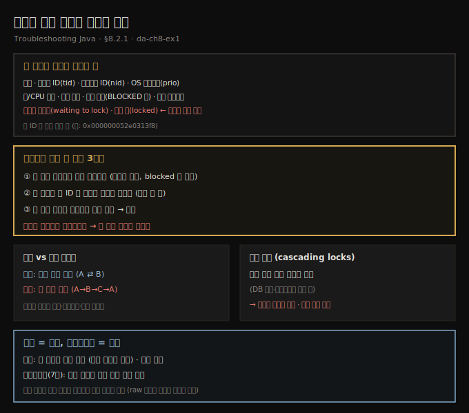
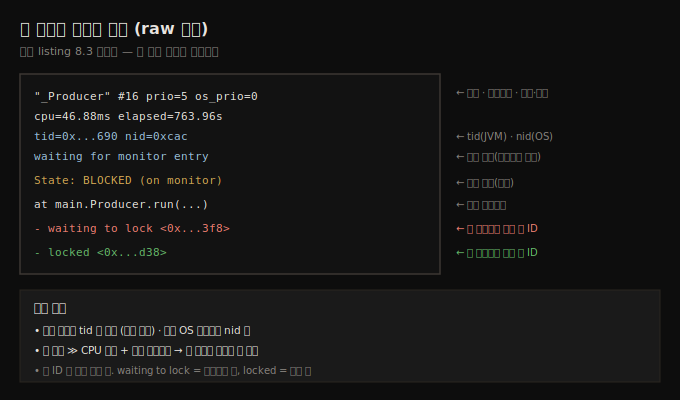
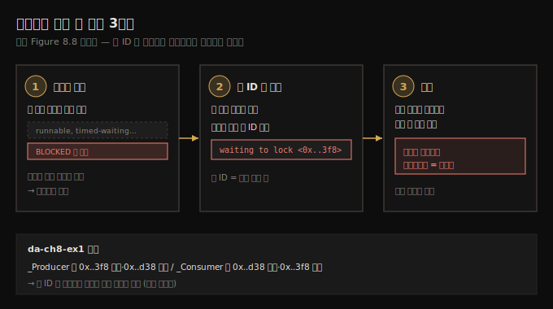
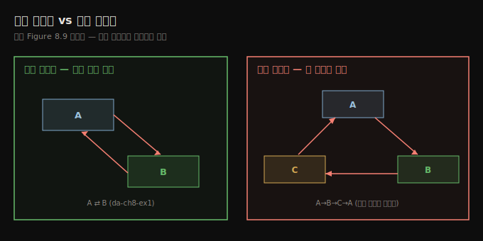
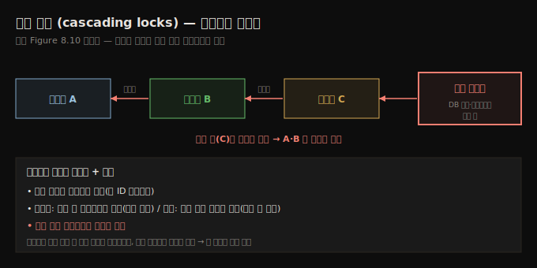

# 스레드 덤프 읽기와 데드락 추적
---
> 평문 스레드 덤프는 스레드마다 이름·ID·상태·스택 트레이스·잡은 락·기다리는 락을 적어 주는데, 데드락을 찾으려면 안 막힌 스레드를 걸러내고 한 후보부터 그 스레드를 막는 락 ID를 따라가다 시작한 스레드로 되돌아오면 그 사슬이 데드락입니다

이 노트는 『Troubleshooting Java』 8장의 §8.2.1을 정리합니다. 앞 편(08-01)이 덤프를 *얻는* 법이었다면, 이 편은 평문(raw) 덤프를 *읽는* 법입니다. 도구로 시각화할 수도 있지만(다음 편 08-03), 저자는 raw 표현을 이해하는 걸 개발자의 필수 역량으로 봅니다 — 원격 컨테이너에 붙어 콘솔만 쓸 수 있고 덤프를 환경 밖으로 못 빼낼 때, 덤프를 텍스트로 읽을 줄 알면 콘솔 하나면 충분하기 때문입니다. 먼저 한 스레드의 덤프 항목을 해부해 무엇이 적히는지 보고, 이어 데드락을 *모른 채로* 찾아내는 3단계 절차를 익힙니다.





## 1. 한 스레드의 덤프 해부 — 무엇이 적히나
> 덤프의 한 스레드 항목에는 이름·스레드 ID·네이티브 ID·OS 우선순위·총/CPU 시간·상태 설명·상태 이름·스택 트레이스·무엇이 막는지·무슨 락을 잡았는지가 적혀, 데드락과 경합을 진단할 모든 단서를 줍니다

덤프를 수집하면 스레드들의 묘사를 평문으로 얻습니다. 한 스레드 항목에 담기는 세부는 이렇습니다.

- **스레드 이름** — 로그·디버깅 도구에서 스레드를 식별하는 이름
- **스레드 ID(tid)** — JVM이 부여한 고유 식별자
- **네이티브 스레드 ID(nid)** — OS가 부여한 식별자, 저수준 디버깅에 유용
- **OS 수준 우선순위(prio/os_prio)** — OS의 스케줄링에 영향
- **총 시간과 CPU 시간** — 스레드가 살아 있던 총 시간과 실제 일한 CPU 시간
- **상태 설명** — 현재 실행 상태를 평이한 말로 설명
- **상태 이름** — runnable·waiting·blocked 같은 표준 상태
- **스택 트레이스** — 그 순간 실행 중이던 메서드 호출 스냅숏
- **무엇이 이 스레드를 막는가** — 진행을 막는 다른 스레드 정보
- **이 스레드가 잡은 락** — 현재 보유한 동기화 락 목록(데드락·경합 진단에 핵심)

```text
// listing 8.3 — 덤프 안 한 스레드 항목의 해부
"_Producer" #16 prio=5 os_prio=0 cpu=46.88ms elapsed=763.96s   ← 이름·자원·시간
tid=0x000002f964987690 nid=0xcac waiting for monitor entry [0x...]   ← tid·nid·상태 설명
   java.lang.Thread.State: BLOCKED (on object monitor)              ← 상태 이름
    at main.Producer.run(Unknown Source)                            ← 스택 트레이스
    - waiting to lock <0x000000052e0313f8> (a java.util.ArrayList)  ← 막는 락 ID + 모니터 타입
    - locked <0x000000052e049d38> (a java.util.ArrayList)           ← 이 스레드가 잡은 락 ID
```



가장 먼저 **이름**(`_Producer`)이 나옵니다. 이름은 개발자가 주므로 같은 이름이 겹칠 작은 가능성이 있는데, 그럴 땐 항상 고유한 **tid**로 식별합니다. JVM 스레드는 시스템 스레드를 감싼 래퍼라, 뒤에서 도는 OS 스레드는 **nid**로 짚습니다.

**우선순위·CPU 시간·총 시간**도 나옵니다. 저자는 우선순위를 자주 보진 않지만, 스레드가 생각보다 덜 활발하고 OS가 낮은 우선순위를 줬다면 그게 원인일 수 있습니다 — 이때 총 시간이 CPU 시간보다 훨씬 큽니다(6장: 총 시간=살아 있던 시간, CPU 시간=일한 시간).

**상태 설명**이 값집니다 — 스레드에게 무슨 일이 벌어지는지 평이한 말로 알려 줍니다. 여기서는 "waiting for monitor entry"로, synchronized 블록 *입구*에서 막혔다는 뜻입니다. "timed waiting on a monitor"였다면 정해진 시간 동안 자거나 도는 중이란 뜻이고요. **스택 트레이스**는 덤프 시점에 정확히 어느 코드를 실행 중이었는지 보여 줘, 더 디버깅할 코드나 느린 스레드의 지연 지점을 짚게 합니다. 마지막으로 락을 잡거나 락에 걸린 스레드는 *어떤 락을 잡고 어떤 락을 기다리는지*가 나오는데, 데드락 조사 때마다 이 세부를 씁니다.

> **덤프는 사진, 프로파일링은 영화입니다.** 덤프는 정상적인 락 프로파일링(7장)만큼 많은 세부를 줍니다. 프로파일링이 덤프보다 나은 한 가지는 *실행 동역학(dynamics)* — 보안 카메라 피드와 그 피드의 한 프레임의 차이입니다. 프로파일링은 사건이 어떻게 전개되는지 보여 주는 전체 영화이고, 덤프는 한 시점의 정지 화면입니다. 다만 부엌에 숨어든 너구리를 잡을 때 쿠키를 훔치는 순간의 사진 한 장이면 범인은 충분하듯, 잘 찍은 덤프 한 장으로도 문제를 현장에서 잡을 수 있고, 얻기는 전체 프로파일링보다 훨씬 쉽습니다. *어느 시점에 무슨 코드가 실행되는지*만 알면 될 때는 덤프로 충분합니다.


## 2. 데드락을 모른 채 찾기 — 3단계 추적
> 데드락이 의심되면 안 막힌 스레드를 모두 걸러 노이즈를 없애고, 첫 후보 스레드부터 꺾쇠 안 락 ID로 그 스레드를 막는 락을 찾아 그 락을 일으킨 스레드로 옮겨 가다, 이미 살펴본 스레드로 되돌아오면 그 사슬 전체가 데드락입니다

스레드들이 *어떻게 상호작용하는지*, 특히 *서로를 막는지*를 덤프로 찾아봅니다. 데드락인 줄 미리 몰랐다면 어떻게 찾을까요? 데드락이 의심되면 스레드들이 일으키는 락에 조사를 집중합니다. 세 단계입니다.

**① 안 막힌 스레드를 걸러낸다.** 덤프는 수십 개 스레드를 묘사할 수 있습니다. 노이즈를 없애고 데드락 후보 — *막힌(blocked)* 스레드 — 에만 집중합니다.

**② 첫 후보 스레드를 잡고 무엇이 막는지 찾는다.** 첫 후보부터, 스레드를 기다리게 하는 **락 ID**로 검색합니다. 락 ID는 *꺾쇠(`< >`) 안*의 값입니다 — listing 8.4에서 `_Producer`는 ID `0x000000052e0313f8`인 락을 기다립니다.

**③ 다음 스레드를 막는 것을 찾는다.** 그 락을 일으킨 스레드를 찾아 그 스레드가 무엇에 막혔는지 봅니다. 어느 순간 *이미 살펴본 스레드로 되돌아오면*, 거쳐 온 스레드 전부가 데드락입니다.

```text
// listing 8.4 — 서로를 막는 두 스레드
"_Producer" ... waiting for monitor entry
   java.lang.Thread.State: BLOCKED (on object monitor)
    - waiting to lock <0x000000052e0313f8> (a java.util.ArrayList)
    - locked <0x000000052e049d38> (a java.util.ArrayList)

"_Consumer" ... waiting for monitor entry
   java.lang.Thread.State: BLOCKED (on object monitor)
    - waiting to lock <0x000000052e049d38> (a java.util.ArrayList)   ← _Producer가 잡은 락
    - locked <0x000000052e0313f8> (a java.util.ArrayList)            ← _Producer가 기다리는 락
```

`_Producer`는 `0x...3f8`을 기다리며 `0x...d38`을 잡았고, `_Consumer`는 `0x...d38`을 기다리며 `0x...3f8`을 잡았습니다. 락 ID를 따라가면 `_Producer`가 `_Consumer`를 막고, `_Consumer`가 `_Producer`를 막는 — 서로를 막는 — 고리가 닫힙니다. 이것이 단순 데드락입니다.





## 3. 단순 데드락 vs 복합 데드락
> 두 스레드만 서로를 막으면 단순 데드락이고, A가 B를, B가 C를, C가 A를 막는 식으로 셋 이상이 얽히면 복합 데드락이라, 사슬이 길수록 찾고 이해하고 풀기가 어려워집니다

이 예제는 두 스레드가 서로를 막는 *단순 데드락*입니다. **복합 데드락**은 셋 이상이 얽힐 때입니다 — 예컨대 스레드 A가 B를, B가 C를, C가 A를 막습니다. 서로를 막는 스레드의 긴 사슬을 발견할 수도 있는데, 사슬이 길수록 데드락을 찾고 이해하고 푸는 게 어려워집니다. 추적 절차는 단순 데드락과 같습니다 — 락 ID를 따라가다 출발점으로 되돌아오는지 보면 됩니다.





## 4. 복합 데드락과 헷갈리는 것 — 연쇄 차단(cascading locks)
> 복합 데드락은 연쇄 차단과 헷갈릴 수 있는데, 연쇄 차단은 사슬 끝 스레드가 데이터 소스 읽기나 엔드포인트 호출 같은 외부 이벤트를 기다려 나머지가 줄줄이 기다리는 다른 문제이고, 보통 멀티스레드 설계가 나쁘다는 신호입니다

복합 데드락은 때로 **연쇄 차단(cascading blocked threads, cascading locks)**과 헷갈립니다. 연쇄 차단도 덤프로 짚을 수 있는데, 추적 절차는 데드락과 같지만 결과가 다릅니다 — 데드락은 사슬 안 한 스레드가 *다른 스레드*에 막히는 반면, 연쇄 차단은 한 스레드가 *외부 이벤트*(데이터 소스 읽기, 엔드포인트 호출 등)를 기다리고 그 탓에 나머지가 줄줄이 기다립니다.

연쇄 차단은 보통 멀티스레드 아키텍처 설계가 나쁘다는 신호입니다. 여러 스레드를 두는 건 동시 처리를 위해서인데, 스레드들이 서로를 기다리면 멀티스레드의 목적이 무색해집니다. 때로 스레드를 서로 기다리게 해야 할 때도 있지만, *연쇄 차단의 긴 사슬*을 정상으로 기대해선 안 됩니다.





## 5. 면접 한 줄 정리
> 덤프를 읽고 데드락을 추적하는 핵심을 한 문장으로 점검합니다

- **덤프의 한 스레드 항목에 무엇이 적히나?** 이름·tid·nid·OS 우선순위·총/CPU 시간·상태 설명·상태 이름·스택 트레이스·무엇이 막는지·잡은 락입니다.
- **"waiting for monitor entry"는 무슨 뜻인가?** synchronized 블록 *입구*에서 막혔다는 상태 설명입니다. 상태 이름은 `BLOCKED (on object monitor)`입니다.
- **락 ID는 어디서 읽나?** *꺾쇠(`< >`) 안*의 값입니다. `waiting to lock`은 기다리는 락, `locked`는 그 스레드가 잡은 락입니다.
- **데드락을 모른 채 어떻게 찾나?** ① 안 막힌 스레드를 걸러내고 → ② 첫 후보의 락 ID로 무엇이 막는지 찾고 → ③ 그 락을 일으킨 스레드로 옮겨 가다, *출발한 스레드로 되돌아오면* 그 사슬이 데드락입니다.
- **단순 vs 복합 데드락은?** 둘이 서로 막으면 단순, A→B→C→A처럼 셋 이상이 고리로 막으면 복합입니다. 사슬이 길수록 풀기 어렵습니다.
- **연쇄 차단(cascading locks)은 데드락과 어떻게 다른가?** 사슬 끝 스레드가 *외부 이벤트*(DB 읽기·엔드포인트 호출)를 기다려 나머지가 줄줄이 대기하는 것으로, 보통 나쁜 멀티스레드 설계의 신호입니다.
- **덤프와 프로파일링의 차이는?** 덤프는 한 시점의 *사진*(동역학 없음), 프로파일링은 전체 *영화*입니다. 어느 시점에 무슨 코드가 도는지만 알면 덤프로 충분합니다.


## 관련 문서
- [이 책 인덱스 (Troubleshooting Java MOC)](./README.md) — 장별 정독 노트 진척
- [스레드 덤프 획득](./08-01.스레드%20덤프%20획득.md) — 이 편의 전제. 프로파일러·명령줄로 덤프를 얻는 단계
- [fastThread와 AI로 덤프 읽기](./08-03.fastThread와%20AI로%20덤프%20읽기.md) — raw 덤프를 시각화 도구·AI로 더 쉽게 읽는 다음 편
