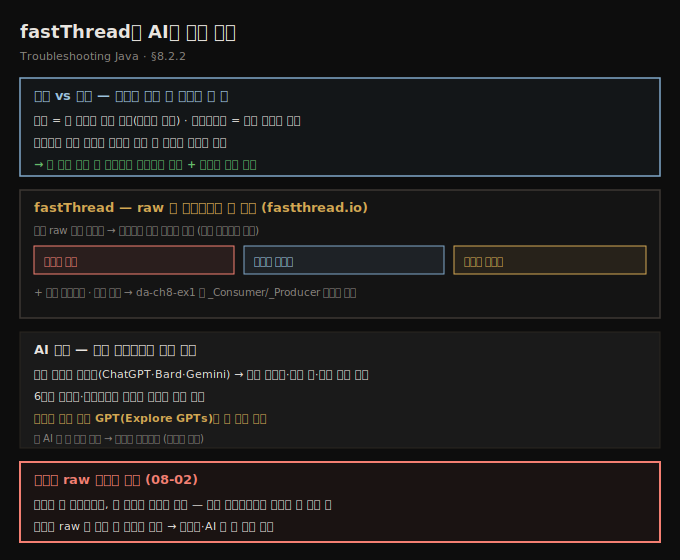
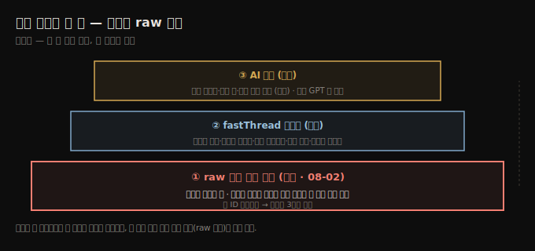

# fastThread와 AI로 덤프 읽기
---
> 평문 덤프를 손으로 읽는 건 설명서 없이 이케아 가구를 조립하는 느낌이라, fastThread 같은 도구가 데드락 감지·의존성 그래프·플레임 그래프로 시각화해 주고 AI 비서가 막힌 스레드를 짚어 주지만, 도구가 늘 맞지도 늘 있지도 않으므로 raw를 읽는 능력은 여전히 필수입니다

이 노트는 『Troubleshooting Java』 8장의 §8.2.2를 정리합니다. 앞 편(08-02)이 평문 덤프를 *손으로* 읽고 데드락을 추적하는 법이었다면, 이 편은 그 일을 *도구와 AI*로 한결 쉽게 하는 법입니다. 다만 저자의 일관된 입장은 — raw를 읽는 능력이 토대이고, 시각화 도구는 그 위의 편의라는 것입니다. 도구가 늘 정확하지도, 늘 환경에 있지도 않기 때문입니다.

## 1. raw를 읽는 능력이 토대인 이유 — 사진 한 장으로 충분할 때
> 덤프는 실행 동역학이 없는 한 시점의 사진이라 영화 같은 프로파일링보다 정보가 적지만 얻기는 훨씬 쉬워서, 부엌의 너구리를 현행범으로 잡는 사진 한 장처럼 잘 찍은 덤프 한 장이면 문제를 잡기에 충분할 때가 많습니다

평문 raw 덤프를 읽는 건 빽빽한 텍스트 벽 — 스택 트레이스, 스레드 상태, 동기화 세부 — 과 씨름하는 일이라, 설명서 없이 이케아 가구를 조립하는 느낌입니다. 정보는 다 거기 있지만 *이해하는* 건 다른 얘기입니다. 그래서 대부분 개발자는 시각화를 선호하고, 다행히 현대 도구가 돕습니다.

그렇더라도 저자는 raw 표현을 이해하는 걸 토대로 봅니다. 덤프를 생성한 환경 밖으로 *빼낼 수 없는* 상황 — 원격 컨테이너에 붙어 콘솔로만 로그를 파야 할 때 — 을 만날 수 있기 때문입니다. 덤프를 텍스트로 읽을 줄 알면 콘솔 하나면 충분합니다. 고급 도구에 접근할 수 없을 때, 덤프를 손으로 해부하는 능력이 *문제를 더 빨리 푸느냐, 얼어붙은 앱을 절망 속에 바라보느냐*를 가릅니다.

> **사진 vs 영화 — 그래도 사진 한 장이면 될 때.** 7장의 락 프로파일링은 실행 동역학(사건이 어떻게 전개되는지)을 보여 주는 전체 *영화*이고, 덤프는 한 시점의 *정지 화면*입니다. 하지만 부엌에 숨어든 너구리를 잡을 때 전체 녹화가 좋긴 해도 *쿠키를 훔치는 순간*의 사진 한 장이면 범인은 충분합니다. 잘 찍은 덤프 한 장으로도 문제를 현장에서 잡을 수 있고, 덤프는 전체 프로파일링 데이터보다 *얻기가 훨씬 쉽다*는 보너스가 있습니다.

## 2. fastThread — raw를 시각화하는 웹 도구
> fastThread는 덤프 raw 데이터 파일을 올리면 데드락 감지·의존성 그래프·스택 트레이스·자원 소비·플레임 그래프로 정리해 주는 무료/유료 웹 도구로, 저자는 환경에서 덤프를 빼내 외부에서 분석할 때 이 도구를 먼저 씁니다

가능하면 저자는 덤프를 수집한 환경에서 빼내 외부에서 분석하는데, 주로 쓰는 도구가 **fastThread**(`fastthread.io`)입니다. raw 데이터를 손으로 훑는 대신 — 똑같이 생긴 나사 47개의 올바른 자리를 찾으려 애쓰는 사람처럼 굴지 않게 — 덤프를 깔끔히 시각화해 줍니다.

fastThread는 덤프 읽기를 돕는 웹 도구로, 무료·유료 플랜이 있지만 저자에겐 무료 플랜으로 늘 충분했습니다. 덤프 raw 데이터가 담긴 파일을 올리면 도구가 필요한 세부를 추출해 이해하기 쉬운 형태로 정리합니다. 분석 결과에는 다음이 포함됩니다.

- **데드락 감지(deadlock detection)** — 어느 스레드들이 교착인지 식별·설명
- **의존성 그래프(dependency graph)** — 스레드 간 관계를 시각화
- **스택 트레이스** — 각 스레드가 실행 중이던 코드
- **자원 소비(resource consumption)** — 스레드별 자원 사용
- **플레임 그래프(flame graph)** — 실행 분포를 한눈에

저자의 덤프에서는 fastThread가 `_Consumer`와 `_Producer`가 일으킨 데드락을 식별해 그 세부를 제시합니다.

## 3. AI 비서 — 막힌 스레드를 짚는 디지털 왓슨
> AI 비서는 덤프 텍스트 파일을 올리면 막힌 스레드를 짚고 문제 락과 가능한 원인·다음 단계를 제안하며, 스레드 덤프 분석에 특화된 전용 GPT를 쓰면 더 나은 결과를 얻지만, AI가 늘 맞는 건 아니라 단서로 받아들입니다

오늘날 AI 비서는 덤프를 분석해 문제 스레드를 부각하고 데드락·성능 병목의 가능한 원인까지 제안합니다. 덤프 텍스트 파일을 ChatGPT·Bard·Gemini 같은 비서에 올리면 *어느 스레드가 막혔는지, 어느 락이 문제인지, 다음에 무엇을 할지*에 대한 통찰을 얻습니다 — 6장에서 샘플링·프로파일링 데이터로 했던 것과 같습니다. AI가 늘 맞히는 건 아니지만, 복잡한 문제를 진단할 때 값진 단서를 주고 시간을 아낍니다.

> **전용 GPT를 쓰면 더 낫습니다.** 예컨대 ChatGPT라면 Explore GPTs에서 *스레드 덤프 조사에 특화된* GPT를 찾을 수 있습니다. 이렇게 특정 작업에 맞춘 AI 비서가 더 나은 결과를 내곤 합니다.

다만 균형이 중요합니다 — AI와 시각화 도구는 훌륭하지만, 더 깊이 파야 하거나 도구를 쓸 수 없을 때를 대비해 raw 형식을 이해해 두는 게 늘 좋습니다. 정리하면, 덤프 조사에서 AI는 자바 미스터리의 닥터 왓슨 같은 조수이고, 셜록 역할은 우리 몫입니다. AI는 차와 비스킷을 요구하진 않지만, 추리 파이프 없이도 진실의 실마리를 건넵니다.

## 4. 면접 한 줄 정리
> 시각화 도구·AI로 덤프를 읽는 핵심을 한 문장으로 점검합니다

- **왜 raw 읽기가 여전히 필수인가?** 도구가 늘 정확하지도, 늘 환경에 있지도 않기 때문입니다. 원격 컨테이너에서 덤프를 빼낼 수 없을 때 콘솔로 raw를 읽을 줄 알아야 합니다.
- **덤프는 사진, 프로파일링은 영화 — 그 함의는?** 덤프엔 실행 동역학이 없지만 *어느 시점에 무슨 코드가 도는지*만 알면 충분할 때가 많고, 전체 프로파일링보다 얻기가 훨씬 쉽습니다.
- **fastThread는 무엇을 주나?** 덤프 raw 파일을 올리면 데드락 감지·의존성 그래프·스택 트레이스·자원 소비·플레임 그래프로 시각화합니다. 무료 플랜으로 대개 충분합니다.
- **AI 비서로 무엇을 하나?** 덤프 파일을 올리면 막힌 스레드, 문제 락, 가능한 원인·다음 단계를 짚어 줍니다(6장의 프로파일링 데이터 분석과 같은 방식). 스레드 덤프 전용 GPT가 더 낫습니다.
- **AI를 어떻게 받아들여야 하나?** 늘 맞는 건 아니므로 *단서*로 받아들이고, 더 깊이 파거나 도구가 없을 때를 대비해 raw 형식 이해를 토대로 둡니다.

## 관련 문서
- [이 책 인덱스 (Troubleshooting Java MOC)](./README.md) — 장별 정독 노트 진척
- [스레드 덤프 읽기와 데드락 추적](./08-02.스레드%20덤프%20읽기와%20데드락%20추적.md) — 이 편의 토대. 평문 덤프를 손으로 읽고 데드락을 3단계로 추적하는 단계
- [05_JVM 폴더 인덱스](../README.md) — JVM 정독 노트 네 권의 상위 인덱스
