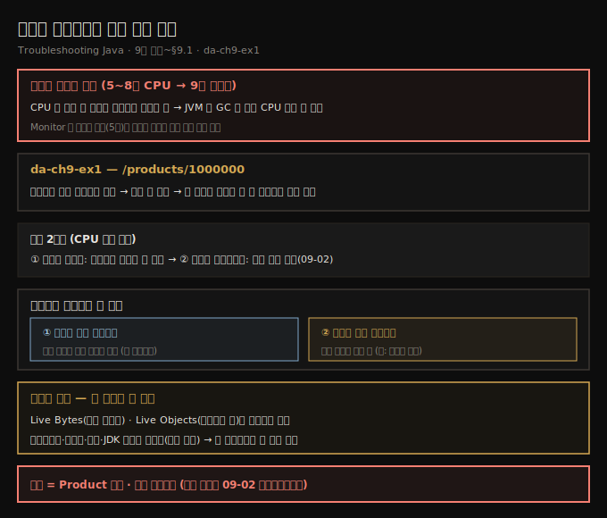
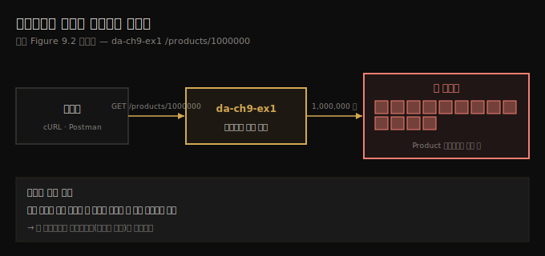
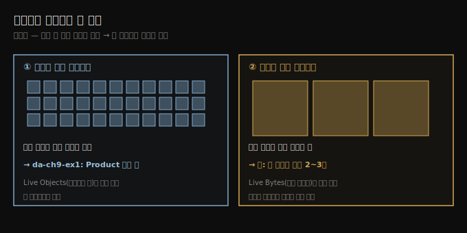

# 메모리 샘플링으로 할당 문제 찾기
---
> 앱이 CPU는 별로 안 쓰는데 메모리를 과하게 쓰면 GC가 돌며 CPU까지 잡아먹는데, 메모리 샘플링은 어떤 타입이 메모리를 채우는지 큰 그림을 줘 — 다수의 소형 인스턴스인지 소수의 대형 인스턴스인지 — Live Bytes·Live Objects로 정렬해 내 코드의 범인 타입(여기선 Product)을 짚어 줍니다

이 노트는 『Troubleshooting Java』 9장의 도입부와 §9.1을 정리합니다. 5~8장이 앱의 두 자원 중 **CPU 소비**를 다뤘다면, 9장은 나머지 절반 — **메모리 할당** — 입니다. 모든 앱은 메모리라는 작업 공간이 필요한데, 그 공간은 무한하지 않고 시스템의 모든 앱이 같은 한정된 메모리를 두고 경쟁합니다. 메모리를 잘못 다루면 앱이 느려지고, 버벅이다, 끝내 자원이 바닥나 크래시합니다. 이 편에서는 메모리를 과하게 쓰는 기능을 흉내 내는 앱(da-ch9-ex1)을 *샘플링*해 무엇이 메모리를 채우는지 큰 그림을 봅니다. 범인의 *생성 지점*을 프로파일링으로 짚는 일은 다음 편(09-02)으로 이어집니다.

> 자바 앱이 메모리를 어떻게 할당·사용하는지(힙·GC)의 기초는 원서 부록 E가 다룹니다. 이 편은 그 위에서 *조사 기법*에 집중합니다.

## 1. 메모리 문제의 신호 — CPU는 안 쓰는데 메모리를 과하게
> 어떤 기능이 느린데 5장 기법으로 보니 CPU는 별로 안 쓰면서 메모리를 많이 쓰면, JVM이 GC를 돌려 CPU까지 더 소비하므로, Monitor 탭의 메모리 위젯이 비정상적 메모리 사용 시점을 짚어 다음 조사를 안내합니다

실제 앱에서 어떤 기능이 느려, 5장 기법으로 자원 소비를 분석했더니 앱이 자주 일하진(CPU를 쓰진) 않는데 *메모리를 많이 쓴다*고 합시다. 앱이 메모리를 과하게 쓰면 JVM이 **가비지 컬렉터(GC)**를 돌릴 수 있고, GC는 다시 CPU 자원을 더 씁니다(6장). GC는 필요 없어진 데이터를 메모리에서 자동으로 비우는 메커니즘입니다.

5장에서 자원 소비를 분석할 때 VisualVM의 **Monitor 탭**으로 앱이 쓰는 자원을 관찰했습니다. 이 탭의 **메모리 위젯**으로 앱이 어느 시점에 메모리를 과하게 쓰는지 짚을 수 있습니다. Monitor 탭의 위젯(CPU·메모리 소비)은 조사를 어떻게 이어갈지 단서를 주는데, 앱이 비정상적인 양의 메모리를 쓰는 게 보이면 *메모리 프로파일링*으로 넘어가기로 결정할 수 있습니다.

## 2. 예제 앱 da-ch9-ex1 — /products/1000000이 백만 객체를 만든다
> da-ch9-ex1은 엔드포인트에 숫자를 주면 그만큼 객체 인스턴스를 만드는 웹 앱으로, 백만 개를 요청해 한 기능이 앱 메모리의 큰 몫을 잡아먹는 실제 상황을 흉내 냅니다

9장의 앱은 da-ch9-ex1입니다. 엔드포인트 하나를 노출하는 작은 웹 앱으로, 호출 시 숫자를 주면 그만큼 객체 인스턴스를 만듭니다. **백만 개**(실험에 충분히 큰 수)를 요청하고, 그 요청 실행을 프로파일러가 어떻게 보고하는지 봅니다. 이 실행은 실제 앱에서 어떤 기능이 앱 메모리 자원의 큰 몫을 잡아먹는 상황을 흉내 냅니다.

절차는 이렇습니다 — da-ch9-ex1을 시작하고 → VisualVM을 켜 그 프로세스를 고르고 → **Monitor 탭**으로 가 → `/products/1000000` 엔드포인트를 호출하고 → 메모리 위젯을 관찰합니다. 위젯을 보면 앱이 메모리 자원을 많이 쓰는 게 보입니다. 어떤 기능이 메모리를 최적으로 안 쓴다고 의심될 때, 조사는 두 스텝입니다.

- **메모리 샘플링** — 앱이 저장하는 객체 인스턴스에 대한 세부를 얻습니다(이 편의 주제).
- **메모리 프로파일링(계측)** — 실행 중 특정 코드 부분에 대한 추가 세부를 얻습니다(09-02).

5~8장의 CPU 자원 소비와 같은 접근입니다 — 샘플링으로 큰 그림부터 봅니다.

## 3. 메모리 샘플링 — 무엇이 메모리를 차지하나
> Sampler 탭의 Memory 버튼으로 샘플링하면 앱이 할당한 객체가 뜨는데, 우리가 찾는 건 메모리를 가장 많이 차지하는 것이고, 보통 다수의 소형 인스턴스가 채우거나 소수지만 각각 큰 인스턴스인 두 상황 중 하나입니다

메모리 사용을 샘플링하려면 VisualVM의 **Sampler 탭**을 고르고 **Memory 버튼**을 눌러 샘플링 세션을 시작합니다. 엔드포인트를 호출하고 실행이 끝나길 기다리면, VisualVM 화면에 앱이 할당한 객체들이 표시됩니다.

우리가 찾는 건 *메모리를 가장 많이 차지하는 것*입니다. 대개 다음 두 상황 중 하나입니다.

- **특정 타입의 인스턴스가 다수** 생성돼 메모리를 채운다(이 시나리오가 그렇습니다).
- 특정 타입의 인스턴스가 많진 않은데 **각 인스턴스가 덩치로 메모리를 차지한다**.

다수가 메모리를 채우는 건 이해되지만, 소수가 어떻게 그럴까요? 앱이 큰 비디오 파일을 처리한다고 합시다. 한 번에 두세 개만 로드해도 파일이 커서 메모리를 채웁니다. 이때 개발자는 그 기능을 최적화할 수 있는지 — 전체 파일이 아니라 *조각만* 메모리에 두면 되는지 — 분석합니다. 이런 부족 패턴은 GC 로그에도 특정 형태로 나타나는데, 11장에서 다룹니다.

## 4. 정렬과 필터 — 내 코드의 첫 타입을 찾는다
> 조사 시작 때는 어느 상황인지 모르므로 차지한 메모리(Live Bytes)와 인스턴스 수(Live Objects)로 각각 내림차순 정렬하고, 프리미티브·문자열·배열·JDK 객체는 부수 효과로 위에 오니 건너뛰어 내 코드베이스의 첫 타입을 찾는데, 여기선 Product가 백만 인스턴스로 범인입니다

조사를 시작할 땐 어느 상황에 빠질지 모릅니다. 저자는 보통 **차지한 메모리로 내림차순** 정렬한 뒤 **인스턴스 수로** 정렬합니다. VisualVM은 샘플링된 타입마다 쓴 메모리(**Live Bytes**)와 인스턴스 수(**Live Objects**)를 보여 주니, 표의 둘째·셋째 열로 내림차순 정렬합니다.

차지한 메모리로 내림차순 정렬한 뒤, 표에서 *내 앱 코드베이스에 속한 첫 타입*을 찾습니다. **프리미티브·문자열·프리미티브 배열·문자열 배열은 건너뜁니다** — 부수 효과로 생성돼 보통 맨 위에 오지만, 문제의 단서는 거의 주지 않습니다. 정렬해 보면 `Product` 타입이 말썽임이 드러납니다 — 할당된 메모리의 큰 몫을 차지하고, Live Objects 열을 보면 앱이 이 타입을 **백만 개** 만들었습니다.

> **차지 공간만으로는 부족할 수 있어, 인스턴스 수로도 정렬합니다.** 이 예제는 명백하지만 실제 앱은 *인스턴스가 많은 문제*인지 *각 인스턴스가 큰 문제*인지 가려야 합니다. 그래서 저자는 인스턴스 수로도 내림차순 정렬해 확인하길 권하는데, 그래도 `Product`가 맨 위입니다. 한편 실행 *전체에 걸쳐 생성된 인스턴스 총수*가 필요하면 샘플링이 아니라 *프로파일링(계측)*을 써야 합니다 — 09-02에서 합니다.

## 5. 면접 한 줄 정리
> 메모리 샘플링의 핵심을 한 문장으로 점검합니다

- **메모리 문제의 신호는?** CPU는 별로 안 쓰는데 메모리를 과하게 쓰는 것입니다. JVM이 GC를 돌려 CPU까지 더 소비하므로, Monitor 탭 메모리 위젯이 비정상 시점을 짚어 줍니다.
- **메모리 조사 2스텝은?** ① 메모리 샘플링으로 앱이 저장하는 객체의 큰 그림 → ② 메모리 프로파일링으로 특정 코드의 세부. CPU 때와 같은 순서입니다.
- **메모리 샘플링은 어떻게 시작하나?** VisualVM Sampler 탭 → Memory 버튼 → 엔드포인트 호출 → 할당된 객체 목록 확인입니다.
- **메모리를 차지하는 두 상황은?** ① 다수의 소형 인스턴스가 채움, ② 소수지만 각각 큰 인스턴스(예: 비디오 파일). 시작 땐 어느 쪽인지 모릅니다.
- **무엇으로 정렬하고 무엇을 건너뛰나?** Live Bytes(차지 메모리)·Live Objects(인스턴스 수)로 내림차순 정렬하고, 프리미티브·문자열·배열·JDK 객체는 건너뛰어 *내 코드베이스의 첫 타입*을 찾습니다. da-ch9-ex1에선 `Product`가 백만 인스턴스로 범인입니다.

## 관련 문서
- [이 책 인덱스 (Troubleshooting Java MOC)](./README.md) — 장별 정독 노트 진척
- [fastThread와 AI로 덤프 읽기](./08-03.fastThread와%20AI로%20덤프%20읽기.md) — 8장 마지막 편. CPU·스레드 쪽 마무리, 이 장은 메모리 쪽으로 전환
- [프로파일링으로 범인 찾기](./09-02.프로파일링으로%20범인%20찾기.md) — 샘플링으로 좁힌 Product의 *생성 지점*을 프로파일링으로 짚는 다음 편
- [메모리 누수와 metaspace, AI 활용](./05-03.메모리%20누수와%20metaspace,%20AI%20활용.md) — 5장의 메모리 누수 도입. 이 장의 할당 조사와 이어지는 맥락
