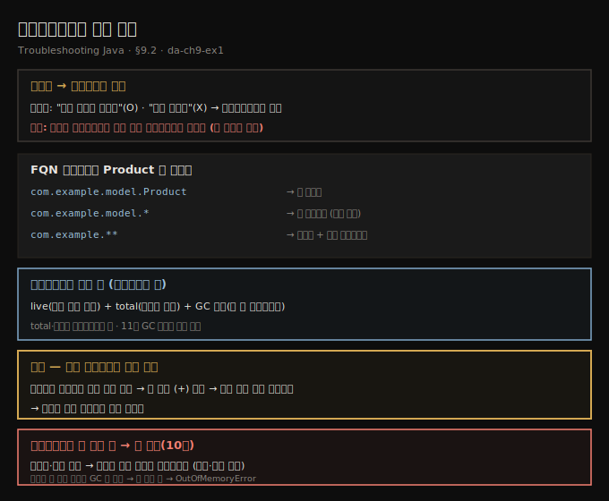
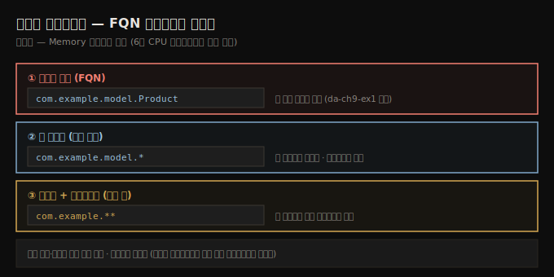
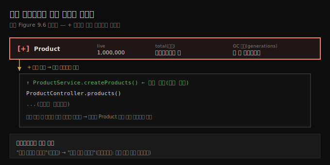

# 프로파일링으로 범인 찾기
---
> 샘플링이 어느 타입이 메모리를 채우는지는 보여 줘도 *누가 그 객체를 만드는지*는 못 줄 때, FQN 표현식으로 그 타입(Product)만 좁혀 프로파일링하면 live·total 인스턴스·GC 세대와 함께 *생성 지점의 스택 트레이스*를 줘 근본 원인으로 곧장 데려갑니다

이 노트는 『Troubleshooting Java』 9장의 §9.2를 정리합니다. 앞 편(09-01)이 메모리 샘플링으로 `Product`가 메모리를 채우는 범인임을 *큰 그림*으로 짚었다면, 이 편은 *누가 그 객체를 만드는지*를 프로파일링으로 좁혀 들어갑니다. 샘플링은 멀리서 가끔 메모를 남기지만, 프로파일링(계측)은 바짝 붙어 모든 걸 지켜봐 *어느 코드가 그 객체를 얼마나 자주 만드는지* 정확히 알려 줍니다. 마지막으로, 프로파일러조차 못 붙는 상황(크래시·운영 환경)을 위한 **힙 덤프(10장)**를 예고합니다.

## 1. 샘플링으로 부족할 때 — 프로파일링으로 전환
> 샘플링만으로 충분할 때도 많지만 "누가 이 객체를 만드나"를 모를 땐 프로파일링으로 전환하는데, 프로파일링은 무거워 느려지고 데이터가 넘치므로 "무엇을 프로파일할지 알기 전엔 프로파일하지 않는다"는 규칙을 지킵니다

샘플링만으로 무엇이 잘못됐는지 짚기에 충분할 때가 많습니다 — 빠르고 가볍고 종종 문제를 분명히 가리킵니다. 하지만 그렇지 못하면? 앱의 *어느 부분*이 그 객체를 다 만드는지 여전히 모른다면? 결과를 보며 "좋아… 그런데 *누가* 실제로 이걸 하지?" 싶을 때, 프로파일링(계측)으로 기어를 바꿉니다. 샘플링이 멀리서 가끔 지켜본다면, 프로파일링은 바짝 붙어 모든 걸 지켜봐 *어느 코드가 그 객체를 만들고 얼마나 자주 만드는지* 정확히 말해 줍니다.

> **"무엇을 프로파일할지 알기 전엔 프로파일하지 않는다."** 프로파일링은 공짜가 아닙니다 — 느려지고 데이터가 너무 많아집니다. 그래서 늘 한 규칙을 지킵니다: 전부 프로파일하면 시간을 낭비하고 상황을 더 나쁘게 만들 수 있으니, *늘 샘플링으로 먼저 좁힌 뒤* 어디가 문제일지 감이 오면 그제야 프로파일링으로 줌인합니다. 09-01에서 샘플링으로 `Product`가 문제임을 좁혔으니, 이제 `Product`만 프로파일합니다.

## 2. FQN 표현식으로 좁히기 — Product만 프로파일
> 6장 CPU 프로파일링처럼 어느 부분을 프로파일할지 표현식으로 지정하는데, Memory 설정란에 클래스의 완전한 이름(FQN)을 넣어 Product만 좁히고, *·**로 패키지·서브패키지 단위로도 넓힐 수 있습니다

문제가 `Product` 타입임을 아니 그것을 프로파일합니다. 5~8장처럼 *어느 부분을 프로파일할지* 표현식으로 지정해야 합니다. 창 오른쪽의 **Memory 설정란**에 클래스의 **완전한 이름(FQN, 패키지+클래스명)**을 넣어 `Product`만 프로파일하고, **Memory 버튼**을 눌러 시작합니다.

6장 CPU 프로파일링처럼 여러 타입을 한 번에, 또는 패키지 전체를 지정할 수도 있습니다. 자주 쓰는 표현식은 셋입니다.

- **엄격한 타입, FQN** (예: `com.example.model.Product`) — 그 특정 타입만 검색
- **한 패키지의 타입** (예: `com.example.model.*`) — `com.example.model` 패키지에 선언된 타입만, *서브패키지는 제외*
- **한 패키지와 그 서브패키지** (예: `com.example.**`) — 그 패키지와 *모든 서브패키지*를 검색

## 3. 프로파일링이 주는 것 — live·total 인스턴스와 GC 세대
> 프로파일링은 메모리에 살아 있는 인스턴스(live)뿐 아니라 앱이 *생성한 총 인스턴스 수*, 그리고 그 인스턴스들이 GC를 몇 번 살아남았는지(세대, generations)를 줘, 11장의 GC 로그 조사와 엮어 GC 활동의 추가 세부를 얻습니다

프로파일링은 샘플링보다 많은 세부를 줍니다. 그 타입의 **live 객체**(아직 메모리에 존재하는 인스턴스)에 더해, 앱이 *생성한 그 타입의 총 인스턴스 수*도 받습니다. 게다가 그 인스턴스들이 **GC를 얼마나 자주 살아남았는지**(우리가 *세대, generations*라 부르는 것)도 봅니다. 11장에서 보겠지만, 이를 GC 로그 조사와 섞으면 GC 활동에 대한 추가 세부를 얻습니다.

> **샘플링과 프로파일링의 인스턴스 수 차이.** 샘플링은 *지금 살아 있는*(live) 인스턴스 수를 주지만, 실행 *전체에 걸쳐 생성된 총수*가 필요하면 프로파일링을 써야 합니다(09-01에서 예고한 부분). live는 GC가 치우고 남은 현재값이고, total은 누적값이라 둘이 다릅니다.

## 4. 핵심 — 스택 트레이스로 생성 지점을 짚는다
> 이 모든 세부가 값지지만 가장 유용한 건 어느 코드가 그 객체를 만드는지 찾는 것인데, 프로파일러는 프로파일한 타입마다 인스턴스가 *생성된 위치*를 보여 줘, 줄 왼쪽의 + 버튼을 누르면 문제의 근본 원인으로 곧장 데려갑니다

이 세부들이 다 값지지만, *어느 코드가 그 객체를 만드는지* 찾는 게 종종 더 유용합니다. 프로파일러는 프로파일한 타입마다 인스턴스가 *생성된 위치*를 표시합니다. 표에서 줄 왼쪽의 **`(+)` 버튼**을 누르면 그 인스턴스를 만든 코드의 **스택 트레이스**가 펼쳐져, 문제의 근본 원인으로 빠르게 데려갑니다. 이렇게 앱의 *어느 부분*이 말썽인 인스턴스를 만들었는지 손쉽게 짚습니다.

## 5. 프로파일러도 못 붙을 때 — 힙 덤프 예고(10장)
> 프로파일링은 앱이 살아서 협조할 때만 통하는데, 프로파일러를 켜기 전에 크래시하거나 운영 환경이라 붙일 수 없으면, 메모리 상태 전체를 한 장면으로 찍는 힙 덤프가 — 범행 현장의 정지 화면처럼 — 객체와 참조를 분석하게 해 줍니다

여기까지면 메모리 사용을 샘플링·프로파일링해 할당 패턴의 말썽 지점을 짚는 법을 탄탄히 익힌 셈입니다. 하지만 프로파일링은 앱이 *실제로 돌고 협조할 때만* 통합니다.

앱이 성질을 부려 프로파일러를 켜기도 전에 크래시하면? 더 나쁘게는, 문제가 *운영 환경에서만* 생겨 프로파일러를 마음대로 붙일 수 없다면? 그때 **힙 덤프(heap dump)**가 등장합니다. 메모리를 실시간으로 지켜보는 대신, 앱이 죽는 순간 붙들고 있던 모든 것을 *메모리 상태 전체의 스냅숏*으로 찍습니다 — 발자국과 지문 대신 *객체와 참조*를 분석하는 범행 현장의 정지 화면입니다. 프로파일링이 빈손으로 끝나도, 10장에서 힙 덤프로 메모리 누수를 현행범으로 잡는 법을 다룹니다.

> **데이터가 쌓이는데 참조가 안 풀리면 OOM입니다.** 객체 인스턴스가 *역참조(dereference)되지 않은 채* 계속 쌓이면 GC가 메모리를 비우지 못해, 끝내 힙이 가득 차 `OutOfMemoryError`와 앱 실패로 이어집니다. 효율적 메모리 관리는 생존만이 아니라 *성능*의 문제이고, 올바른 도구·기법으로 이런 치명적 문제를 피할 수 있습니다.

## 6. 면접 한 줄 정리
> 메모리 프로파일링의 핵심을 한 문장으로 점검합니다

- **언제 샘플링에서 프로파일링으로 넘어가나?** 어느 타입이 메모리를 채우는지는 알지만 *누가 그 객체를 만드는지* 모를 때입니다. "무엇을 프로파일할지 알기 전엔 프로파일하지 않는다" — 늘 샘플링으로 먼저 좁힙니다.
- **프로파일할 타입을 어떻게 지정하나?** Memory 설정란에 FQN을 넣습니다. `com.example.model.Product`(그 타입만), `com.example.model.*`(그 패키지만), `com.example.**`(패키지+서브패키지)입니다.
- **프로파일링이 샘플링보다 더 주는 것은?** live 객체에 더해 *생성된 총 인스턴스 수*와 *GC 세대(generations)*입니다. 11장 GC 로그와 엮어 활용합니다.
- **근본 원인을 어떻게 짚나?** 프로파일러가 타입마다 인스턴스 *생성 위치*를 보여 줍니다. 줄 왼쪽 `(+)`를 누르면 생성 코드의 스택 트레이스가 펼쳐져 근본 원인으로 데려갑니다.
- **프로파일러를 못 붙이면?** 앱이 크래시하거나 운영 환경이면 **힙 덤프(10장)**로 메모리 상태 전체를 스냅숏으로 찍어 객체·참조를 분석합니다.
- **OOM은 왜 생기나?** 인스턴스가 *역참조되지 않은 채* 쌓이면 GC가 못 비워 힙이 가득 차고 `OutOfMemoryError`가 납니다.

## 관련 문서
- [이 책 인덱스 (Troubleshooting Java MOC)](./README.md) — 장별 정독 노트 진척
- [메모리 샘플링으로 할당 문제 찾기](./09-01.메모리%20샘플링으로%20할당%20문제%20찾기.md) — 이 편의 전제. 샘플링으로 Product가 범인임을 큰 그림으로 짚은 단계
- [instrumentation과 JDBC SQL 가로채기](./06-02.instrumentation과%20JDBC%20SQL%20가로채기.md) — 6장 CPU 프로파일링. FQN 표현식(`*`/`**`)과 같은 필터 문법
- [05_JVM 폴더 인덱스](../../README.md) — JVM 정독 노트 네 권의 상위 인덱스
