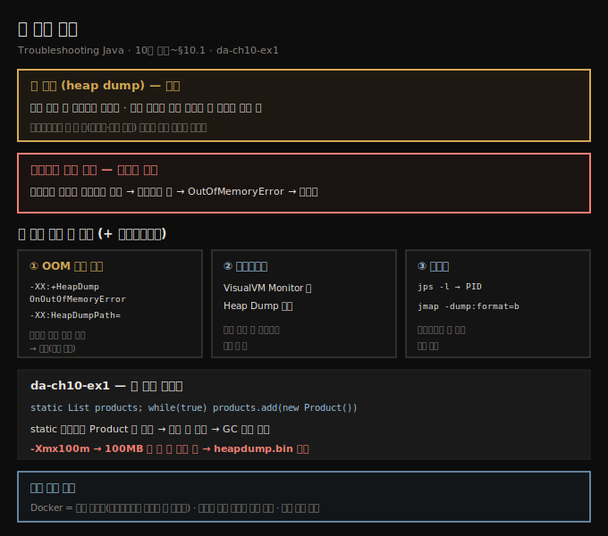
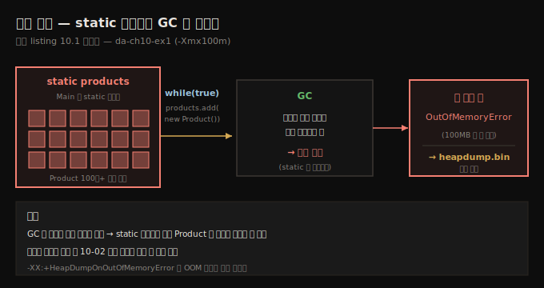

# 힙 덤프 획득
---
> 힙 덤프는 특정 순간 앱 메모리에 저장된 모든 객체와 그 관계를 찍은 스냅숏이라, 앱이 크래시해 프로파일러를 못 붙일 때도 메모리 문제를 조사하게 해 주며 — OOM 자동 생성·VisualVM 버튼·jmap 명령줄 세 방법으로 얻습니다

이 노트는 『Troubleshooting Java』 10장의 도입부와 §10.1을 정리합니다. 9장에서 메모리를 샘플링·프로파일링하는 법을 익혔지만, 프로파일링은 앱이 *살아서 협조할 때만* 통합니다. 앱이 프로파일러를 들기도 전에 화려하게 크래시한다면? 크래시의 흔한 원인은 메모리 할당 문제, 그중에서도 **메모리 누수(memory leak)** — 더는 쓸모없는 객체를 호더처럼 붙들어 메모리가 차다 끝내 `OutOfMemoryError`로 무너지는 것 — 입니다. 프로파일링이 불가능하고 앱이 이미 메모리 발작을 일으켰을 때, 그 순간을 얼려 붙드는 게 **힙 덤프(heap dump)**입니다. 이 편에서는 힙 덤프를 *얻는* 세 방법을 봅니다. 얻은 덤프를 *읽는* 법은 다음 편(10-02), OQL로 쿼리하는 법은 그 다음 편(10-03)으로 이어집니다.

> **정의 — 힙 덤프**: 특정 순간 앱 메모리의 스냅숏으로, 힙에 저장된 모든 객체와 그 관계를 보여 줍니다.





## 1. 세 가지 획득 방법 — 한눈에
> 힙 덤프는 OOM 시 자동 생성하도록 앱을 설정하거나, VisualVM 같은 프로파일러 버튼으로 얻거나, jmap·jcmd 같은 명령줄 도구로 얻으며, 프레임워크로 프로그래밍적으로 생성할 수도 있습니다

힙 덤프를 쓰기 전에 얻는 법부터 알아야 합니다. 세 가지가 있습니다.

- **OOM 시 자동 생성** — 메모리 문제로 크래시할 때 지정한 위치에 자동으로 떨구도록 앱을 설정
- **프로파일러** — VisualVM 같은 도구의 버튼으로 실행 중 프로세스의 덤프를 획득
- **명령줄** — `jmap`·`jcmd` 같은 JDK 도구로 획득

프레임워크 기능으로 *프로그래밍적으로* 생성할 수도 있어, 앱 모니터링 도구에 통합하기도 합니다.


## 2. OOM 시 자동 생성 — da-ch10-ex1
> 크래시 조사용이라 앱이 메모리 문제로 멈출 때 자동으로 덤프를 떨구게 설정하는 게 정석인데, -XX:+HeapDumpOnOutOfMemoryError와 -XX:HeapDumpPath 두 인자만 더하면 되고, da-ch10-ex1은 static 리스트에 Product를 무한히 더해 몇 초 만에 힙을 채웁니다

개발자는 메모리 할당이 의심될 때 크래시를 조사하려 힙 덤프를 자주 씁니다. 그래서 앱은 *크래시 순간의 메모리 모습*을 덤프로 남기도록 설정하는 게 가장 흔합니다 — 메모리 할당 문제로 멈출 때 덤프를 생성하도록 **항상** 설정해 두는 게 좋습니다. 설정은 쉽습니다. 시작 시 JVM 인자 둘만 더합니다.

```text
-XX:+HeapDumpOnOutOfMemoryError    ← OOM(힙이 가득 참) 만나면 덤프 생성
-XX:HeapDumpPath=heapdump.bin      ← 덤프를 저장할 파일시스템 경로
```

첫 인자는 `OutOfMemoryError`를 만나면 덤프를 생성하게 하고, 둘째 인자는 저장 경로(여기선 상대 경로라 클래스패스 루트 근처에 `heapdump.bin`)를 지정합니다. 그 경로에 *쓰기 권한*이 있어야 합니다.

```text
java -jar -XX:+HeapDumpOnOutOfMemoryError -XX:HeapDumpPath=heapdump.bin app.jar
```

> **비휘발성 위치에 떨구도록 설정하세요.** Docker 컨테이너에서 돌린다면 클래스패스에 두지 마세요 — 컨테이너 재시작 때 자동으로 사라집니다. *영속 볼륨(persistent volume)*에 저장해 분석용으로 남기고, 덤프가 클 수 있으니 디스크에 충분한 공간이 있는지도 확인합니다.

데모 앱 `da-ch10-ex1`은 메모리가 찰 때까지 `Product` 인스턴스를 리스트에 끝없이 더합니다.

```java
// listing 10.1 — 회수할 수 없는 인스턴스를 대량 생성
public class Main {
  private static List<Product> products = new ArrayList<>();   // static 리스트

  public static void main(String[] args) {
    Random r = new Random();
    while (true) {                       // 영원히 반복
      Product p = new Product();
      p.setName("Product " + r.nextInt());
      products.add(p);                   // 메모리가 찰 때까지 인스턴스를 더함
    }
  }
}
```

`Product`는 `name` 필드 하나뿐인 단순한 타입입니다. 이름에 *난수*를 붙이는 이유는 10-02에서 덤프를 읽을 때 필요하기 때문이고, 지금은 이 앱이 왜 몇 초 만에 힙을 채우는지 조사할 덤프를 얻는 데만 관심을 둡니다. IDE(예: IntelliJ Run/Debug Configurations)에서 위 인자를 설정하고, 덤프 파일을 작게·예제를 쉽게 만들려 **`-Xmx100m`**로 힙을 100MB로 제한합니다. 실행하면 100MB가 몇 초 만에 차 앱이 크래시하고, 프로젝트 폴더에 `heapdump.bin`이 생깁니다. VisualVM의 **Load** 버튼으로 이 파일을 열어 분석합니다.





## 3. 프로파일러·명령줄로 얻기
> 로컬에서 실행 중인 프로세스의 덤프는 VisualVM Monitor 탭의 Heap Dump 버튼 하나로 얻고, 프로파일러를 못 붙이는 원격 환경에서는 jps로 PID를 찾아 jmap -dump:format=b로 바이너리 덤프를 파일에 저장합니다

**프로파일러 (로컬 실행 중 프로세스).** 로컬 머신에서 도는 프로세스의 덤프가 필요하면 VisualVM이 가장 쉽습니다 — **Monitor 탭의 Heap Dump 버튼** 하나면 됩니다. VisualVM이 덤프를 탭으로 열어 주고, 더 조사하거나 원하는 곳에 저장할 수 있습니다.

**명령줄 (원격 환경).** 프로파일러를 못 붙이는 환경에 배포됐어도 당황하지 마세요 — JDK가 주는 `jmap`이 있습니다. 두 단계입니다.

```text
# ① jps -l 로 PID 찾기 (8장과 같음)
jps -l
25320 main.Main
...

# ② jmap 으로 바이너리 덤프를 파일에 저장 (-dump:format=b 필수)
jmap -dump:format=b,file=C:/DA/heapdump.bin 25320
```

`jmap`에는 PID와 저장 경로를 주고, 출력이 바이너리 파일임을 `-dump:format=b`로 명시합니다. 저장한 파일을 VisualVM에서 열어 조사합니다.


## 4. 면접 한 줄 정리
> 힙 덤프 획득의 핵심을 한 문장으로 점검합니다

- **힙 덤프란?** 특정 순간 앱 메모리의 스냅숏으로, 힙에 저장된 *모든 객체와 그 관계*를 보여 줍니다. 정의상 스레드 덤프(스레드 상태)와 다릅니다.
- **언제 가장 유용한가?** 프로파일링을 못 할 때 — 앱이 크래시했거나 프로세스에 접근할 수 없을 때 메모리 할당 문제를 조사하는 데 결정적입니다.
- **OOM 시 자동 생성은 어떻게?** `-XX:+HeapDumpOnOutOfMemoryError`(OOM 시 생성) + `-XX:HeapDumpPath=...`(저장 경로) 두 JVM 인자입니다. **항상 설정해 두길** 권합니다.
- **Docker에서 주의할 점은?** 클래스패스에 두면 컨테이너 재시작 때 사라지니 *영속 볼륨*에 저장하고, 덤프가 크니 디스크 공간을 확인합니다.
- **프로파일러·명령줄로는?** VisualVM Monitor 탭의 Heap Dump 버튼 / 또는 `jps -l`로 PID를 찾아 `jmap -dump:format=b,file=... <PID>`입니다.
- **da-ch10-ex1은 왜 힙을 채우나?** `Main`의 **static 리스트**에 `Product`를 무한 루프로 더해, 참조가 안 풀려 GC가 회수 못 하고 100MB(`-Xmx100m`)가 몇 초 만에 찹니다.


## 관련 문서
- [이 책 인덱스 (Troubleshooting Java MOC)](./README.md) — 장별 정독 노트 진척
- [프로파일링으로 범인 찾기](./09-02.프로파일링으로%20범인%20찾기.md) — 9장 마지막 편. "프로파일러를 못 붙일 때 힙 덤프(10장)"라고 예고한 그 지점
- [힙 덤프 읽기 — referrers와 누수](./10-02.힙%20덤프%20읽기%20—%20referrers와%20누수.md) — 얻은 덤프를 VisualVM으로 읽어 static 리스트 누수를 짚는 다음 편
