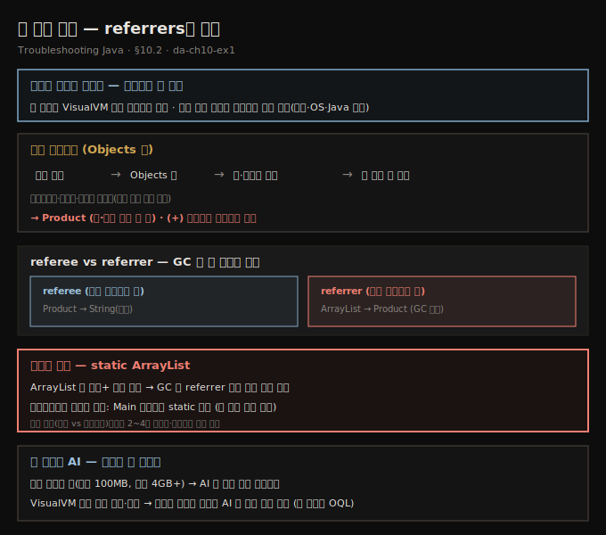
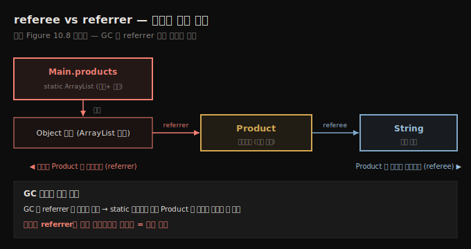

# 힙 덤프 읽기 — referrers와 누수
---
> 힙 덤프는 스레드 덤프와 달리 평문으로 못 읽고 VisualVM으로 봐야 하는데, Objects 뷰에서 인스턴스 수·차지 메모리로 정렬해 내 코드의 첫 타입(Product)을 찾고, 그 인스턴스를 *무엇이 참조하는지(referrer)* 따라가면 — 백만 참조를 쥔 static 리스트가 — GC를 막는 누수의 정체를 드러냅니다

이 노트는 『Troubleshooting Java』 10장의 §10.2를 정리합니다. 앞 편(10-01)이 힙 덤프를 *얻는* 법이었다면, 이 편은 그 덤프를 *읽어* `OutOfMemoryError`의 근본 원인을 찾는 법입니다. 힙 덤프는 메모리 할당 문제를 파헤치는 가장 강력한 도구 중 하나 — 특정 순간 메모리를 얼린 정지 화면 — 으로, *어떤 객체가 메모리를 차지했는지*뿐 아니라 *왜 회수되지 않았는지*까지 보여 줍니다. 고전적 누수인지, 통제 불능으로 자라는 컬렉션인지, 데이터를 용처럼 쌓아 둔 잊힌 캐시인지 — 답은 다 덤프 안에 있고, 보는 법만 알면 됩니다. 더 정밀한 OQL 쿼리는 다음 편(10-03)으로 이어집니다.

## 1. 평문으로 못 읽는다 — VisualVM의 요약과 Objects 뷰
> 스레드 덤프와 달리 힙 덤프는 평문으로 분석할 수 없어 VisualVM 같은 도구가 필요한데, 열면 요약 뷰(파일 크기·클래스/인스턴스 총수)로 올바른 덤프인지 먼저 확인하고, 조사는 Objects 뷰에서 시작합니다

8장의 스레드 덤프와 달리, 힙 덤프는 *평문으로 분석할 수 없습니다*. VisualVM(또는 프로파일링 도구)으로 봐야 합니다. da-ch10-ex1에서 생성한 덤프를 VisualVM으로 열어 봅니다.

덤프를 열면 VisualVM이 **요약 뷰**를 보여 줍니다 — 파일 크기, 클래스 총수, 인스턴스 총수 같은 빠른 정보입니다. 이걸로 *올바른 덤프인지* 확인할 수 있습니다(내가 추출한 게 아니라면 특히).

> **요약으로 올바른 파일인지 먼저 확인하세요.** 저자는 환경에 접근할 수 없어 지원팀이 떠 준 덤프를 받아 조사한 적이 여러 번인데, *엉뚱한 덤프*를 받은 적도 한두 번이 아니었습니다. 덤프 크기를 프로세스에 설정된 최댓값과 비교하거나, OS·Java 버전을 검토해 그 오류를 잡았습니다. 요약 페이지를 빠르게 훑어 올바른 파일인지 확인하길 권합니다.

요약 페이지에도 메모리를 많이 차지하는 타입이 보이지만, 저자는 보통 그 요약에 기대지 않고 곧장 **Objects 뷰**(왼쪽 상단 드롭다운에서 선택)로 가 조사를 시작합니다 — 대개 요약만으로는 결론을 못 내기 때문입니다.

## 2. 정렬과 필터 — 내 코드의 Product를 찾는다
> 메모리 샘플링·프로파일링처럼 가장 메모리를 쓰는 타입을 찾는데, 인스턴스 수와 차지 메모리로 내림차순 정렬하고 프리미티브·문자열·배열은 건너뛰어 내 코드베이스의 첫 타입을 찾으면, da-ch10-ex1에선 Product가 두 기준 모두 맨 위입니다

Objects 뷰에서는 메모리 샘플링·프로파일링(9장)과 똑같이 *가장 메모리를 쓰는 타입*을 찾습니다. 가장 좋은 방법은 **인스턴스 수**와 **차지 메모리** 둘 다로 내림차순 정렬하고, *내 앱 코드베이스에 속한 첫 타입*을 찾는 것입니다. 프리미티브·문자열·프리미티브/문자열 배열은 건너뜁니다 — 대개 수가 많지만 문제의 단서를 주지 않습니다.

정렬하면 `Product` 타입이 문제에 얽혀 보입니다 — 인스턴스 수로도 크기로도 목록의 첫 타입이고 메모리의 큰 몫을 씁니다. 이제 두 가지를 알아내야 합니다.

- 코드의 *어느 부분*이 그 인스턴스를 만드는가
- *왜 GC가 그것들을 제때 제거하지 못해* 앱 실패를 막지 못하는가

줄 왼쪽의 `(+)`를 누르면 그 타입의 모든 인스턴스 세부를 얻습니다. `Product` 인스턴스가 백만 개 넘는 건 이미 압니다 — 이제 *왜 안 치워지는지*를 찾을 차례입니다.

## 3. referees vs referrers — GC가 못 치우는 이유를 좇다
> 각 인스턴스가 *무엇을 참조하는지(referee)*와 *무엇이 그것을 참조하는지(referrer)*를 볼 수 있는데, GC는 참조하는 것(referrer)이 없어야 인스턴스를 회수하므로, referrer를 좇아 그게 처리 맥락에 아직 필요한지 아니면 앱이 참조를 안 지운 건지 가립니다

힙 덤프에서는 각 인스턴스가 *무엇을 참조하는지*(필드를 통해)와 *무엇이 그 인스턴스를 참조하는지*를 볼 수 있습니다. GC는 인스턴스에 *참조하는 것(referrer)이 없어야* 메모리에서 회수합니다. 그래서 우리는 그 인스턴스를 *참조하는 것*을 좇아, 처리 맥락에 아직 필요한지 아니면 앱이 *참조를 지우는 걸 잊은 건지* 봅니다.

한 `Product` 인스턴스의 세부를 펼쳐 보면 — 그 인스턴스는 `String`(제품 이름)을 참조하고(referee), 그것의 참조는 `ArrayList` 인스턴스에 속한 `Object` 배열에 보관돼 있습니다(referrer). 게다가 그 `ArrayList`는 **백만 개 넘는 참조**를 쥐고 있습니다. 보통 좋은 신호가 아닙니다 — 앱이 최적화 안 된 기능을 구현했거나, 우리가 *메모리 누수*를 찾은 것입니다.

> **어느 쪽인지는 코드를 봐야 가립니다 — 그런데 프로파일러가 위치를 짚어 줍니다.** 어느 경우인지 가리려면 2~4장의 디버깅·로깅으로 코드를 조사해야 합니다. 다행히 프로파일러가 리스트가 코드의 *어디*에 있는지 정확히 가리킵니다. 우리 경우, 그 리스트는 `Main` 클래스의 **static 변수**로 선언돼 있습니다. static이라 앱이 도는 내내 살아 있고, 거기 담긴 백만 `Product`의 참조가 안 풀려 GC가 못 치웁니다 — 전형적인 누수입니다.

## 4. 힙 덤프와 AI — 통째로 맡기지 않는다
> 힙 덤프는 실무에서 너무 커(여기 100MB, 실제 4GB+) AI에 통째로 맡기긴 비현실적이라, 먼저 VisualVM으로 인스턴스를 크기·수로 정렬해 조사하고, 필요한 일부만 추출해 AI에 막힌 지점을 묻되 전체 파일은 절대 맡기지 않습니다

AI 비서로 힙 덤프를 조사할 수 있을까요? 가능하지만, 스레드 덤프나 프로파일링 데이터보다 *훨씬 까다롭습니다* — 실무 힙 덤프의 *크기* 때문입니다. 이 예제 덤프도 100MB가 조금 넘는데, Gemini·ChatGPT에 먹여 보면 처리에 상당한 시간이 들고 즉각적 통찰을 못 줄 수 있습니다. 실무의 4GB 이상 덤프라면 대부분의 AI 비서에 비현실적입니다.

그래서 저자는 다른 접근을 씁니다.

- **먼저 VisualVM 같은 전용 도구로 조사한다** — 인스턴스를 크기·수로 정렬합니다. 이게 조사 데이터를 준비하는 가장 중요한 부분으로, 인스턴스가 적은 타입은 볼 필요가 거의 없습니다.
- **필요한 일부만 추출해 AI에 묻는다** — 아이디어를 얻거나 막힌 지점을 넘기 위해서지, *전체 덤프 파일을 통째로 맡기지는 않습니다*.
- **덤프가 크고 복잡하면 OQL을 쓴다** — 관계형 DB처럼 정밀하게 필터링해 가장 관련 있는 객체에만 집중합니다(10-03).

## 5. 면접 한 줄 정리
> 힙 덤프 읽기의 핵심을 한 문장으로 점검합니다

- **힙 덤프는 평문으로 읽나?** 아닙니다 — 스레드 덤프와 달리 평문 분석이 안 되고 VisualVM 같은 도구가 필요합니다.
- **조사를 어디서 시작하나?** 요약 뷰로 *올바른 덤프인지* 먼저 확인(크기·OS·Java 버전 대조)한 뒤, **Objects 뷰**로 가 시작합니다.
- **무엇으로 정렬하고 무엇을 건너뛰나?** 인스턴스 수와 차지 메모리로 내림차순 정렬하고, 프리미티브·문자열·배열은 건너뛰어 *내 코드베이스의 첫 타입*(여기선 `Product`)을 찾습니다.
- **referee와 referrer는?** referee는 그 인스턴스가 *참조하는* 것, referrer는 *그 인스턴스를 참조하는* 것입니다. GC는 referrer가 없어야 회수하므로, referrer를 좇아 누수를 가립니다.
- **da-ch10-ex1의 누수 정체는?** `Main`의 **static `ArrayList`**가 백만 `Product` 참조를 쥐어, 참조가 안 풀려 GC가 못 치우는 것입니다. 프로파일러가 그 리스트의 코드 위치(static 변수)를 짚어 줍니다.
- **AI를 힙 덤프에 어떻게 쓰나?** 실무 덤프는 너무 커(4GB+) 통째로 못 맡깁니다. VisualVM으로 먼저 정렬·조사하고, *필요한 일부만* 추출해 AI에 막힌 지점을 묻습니다.

## 관련 문서
- [이 책 인덱스 (Troubleshooting Java MOC)](./README.md) — 장별 정독 노트 진척
- [힙 덤프 획득](./10-01.힙%20덤프%20획득.md) — 이 편의 전제. da-ch10-ex1의 덤프를 OOM 자동 생성·VisualVM·jmap으로 얻는 단계
- [OQL로 힙 덤프 쿼리하기](./10-03.OQL로%20힙%20덤프%20쿼리하기.md) — referrers를 SQL처럼 쿼리해 누수를 정밀하게 짚는 다음 편
- [스레드 덤프 읽기와 데드락 추적](./08-02.스레드%20덤프%20읽기와%20데드락%20추적.md) — 8장. 스레드 덤프는 평문으로 읽지만 힙 덤프는 못 읽는 대비
