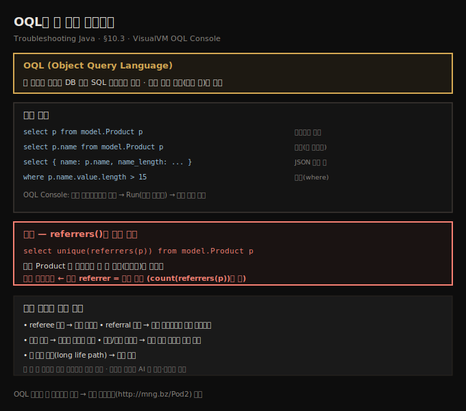
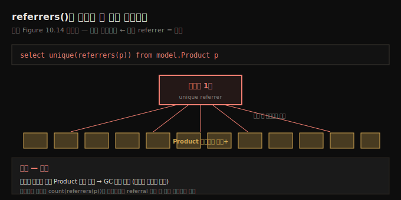

# OQL로 힙 덤프 쿼리하기
---
> OQL은 힙 덤프를 관계형 DB처럼 SQL 비슷한 문법으로 쿼리하는 언어라, 인스턴스를 끝없이 스크롤하는 대신 정확히 필요한 것만 뽑고 — 특히 referrers()로 *소수의 referrer가 다수 인스턴스를 붙드는* 누수 패턴을 한 줄로 드러냅니다

이 노트는 『Troubleshooting Java』 10장의 §10.3을 정리합니다. 앞 편(10-02)이 인스턴스를 정렬하고 눈으로 크기를 가늠하는 *손맛 방식*이었다면, 이 편은 SQL 비슷한 쿼리 언어로 덤프에서 세부를 *정밀하게* 뽑는 법입니다. 10-02의 기본 기법도 메모리 문제를 식별하기엔 충분하지만, *여러 덤프를 비교*해야 할 때 — 예컨대 앱의 서로 다른 버전 — 부족합니다. 두 소설을 나란히 펴 놓고 읽으며 차이를 찾는 격이니까요. **OQL(Object Query Language)**은 무거운 일을 대신 해 주는 쿼리를 쓰게 해 줍니다. VisualVM에서 왼쪽 상단 드롭다운의 **OQL Console**로 전환해 씁니다.





## 1. 기본 — 인스턴스와 속성 선택
> SQL의 select * from product에 대응해 OQL은 select p from model.Product p로 한 타입의 인스턴스를 모두 뽑고, 점 연산자로 속성(p.name)도 골라낼 수 있습니다

가장 단순한 예부터 봅니다 — 한 타입의 인스턴스를 모두 뽑기입니다. SQL로 테이블의 모든 product 레코드를 가져오면 `select * from product`인데, OQL로 힙 덤프의 모든 `Product` 인스턴스를 가져오면 이렇습니다.

```sql
select p from model.Product p
```

쿼리한 인스턴스를 아무거나 고르면 그 세부 — 무엇이 그것을 참조하는지(referrer), 그것이 무엇을 참조하는지(referee), 그 값 — 를 볼 수 있습니다. 인스턴스가 아니라 *속성*을 뽑을 수도 있습니다. 제품 인스턴스 대신 제품 이름만 원하면, Java처럼 표준 *점 연산자*로 속성을 가리킵니다.

```sql
select p.name from model.Product p
```

> **OQL Console 사용법.** 창 하단 텍스트박스에 쿼리를 쓰고 왼쪽의 **Run(초록 화살표)**을 누르면 결과가 위에 나타납니다. 쿼리한 인스턴스를 클릭해 세부(referrer·referee·값)를 봅니다. OQL 문법은 이 편이 다루는 예제보다 복잡하니, 함수 레퍼런스(`http://mng.bz/Pod2`)를 참고합니다.


## 2. JSON 프로젝션과 조건 — 여러 값을 한 번에
> 중괄호로 JSON 형식을 만들면 한 쿼리로 여러 값(이름·이름 길이)을 동시에 뽑을 수 있고, where 절로 조건(이름 길이 15 초과)을 걸어 좁힐 수 있습니다

OQL로 여러 값을 *동시에* 뽑으려면 **JSON 형식**으로 묶습니다.

```sql
-- listing 10.2 — JSON 프로젝션
select {
   name: p.name,                        -- 제품 이름
   name_length: p.name.value.length     -- 이름의 문자 수
}
from model.Product p
```

여기에 **조건(where 절)**을 더할 수 있습니다. 예컨대 이름이 15자보다 긴 인스턴스만 뽑으려면 이렇게 씁니다. (이름에 난수를 붙인 이유가 여기서 드러납니다 — 길이로 거를 거리가 생깁니다.)

```sql
select { name: p.name, name_length: p.name.value.length }
from model.Product p
where p.name.value.length > 15
```


## 3. referrers()로 누수 탐지 — 핵심 쿼리
> 메모리 문제 조사에서 자주 쓰는 referrers()는 특정 타입을 *참조하는* 객체를 뽑는데, unique(referrers(p))로 모든 Product를 참조하는 게 단 하나(리스트)임이 드러나면 — 다수 인스턴스를 소수가 붙드는 — 전형적인 누수입니다

저자가 메모리 문제 조사에 자주 쓰는 쿼리는 **`referrers()`** 함수로 특정 타입의 인스턴스를 *참조하는* 객체를 뽑는 것입니다. 이런 내장 함수로 여러 유용한 일을 합니다 — 그중 핵심이 누수 탐지입니다. `Product` 인스턴스의 *고유한* referrer를 모두 뽑으려면 이렇게 씁니다.

```sql
select unique(referrers(p)) from model.Product p
```

결과를 보면, 모든 `Product` 인스턴스가 *단 하나의 객체* — 리스트 — 에 참조됩니다. 보통 **다수의 인스턴스가 소수의 referrer에 참조되면 누수 신호**입니다. 우리 경우, 리스트 하나가 모든 `Product`의 참조를 쥐어 GC가 못 치웁니다.

결과가 고유하지 않으면, 인스턴스별로 referral 수를 세 누수에 얽힌 인스턴스를 찾습니다.

```sql
select { product: p.name, count: count(referrers(p)) } from model.Product p
```

한 번 쓴 쿼리는 필요한 만큼, 그리고 *다른 덤프에도* 돌릴 수 있습니다 — 버전 간 비교가 쉬워집니다.





## 4. OQL 내장 함수의 다섯 용도
> referrers 같은 내장 함수로 referee·referral·중복·하위/상위 클래스·긴 생명 경로를 쿼리할 수 있어, 누수 탐지·최적화 여지·소스 없는 클래스 설계 파악까지 합니다

`referrers` 같은 내장 함수로 할 수 있는 일은 다섯 갈래입니다.

- **인스턴스 referee 찾기·쿼리** — 앱에 메모리 누수가 있는지 알려 줍니다
- **인스턴스 referral 찾기·쿼리** — 특정 인스턴스가 누수의 원인인지 알려 줍니다
- **인스턴스 중복 찾기** — 특정 기능을 더 적은 메모리로 최적화할 수 있는지 알려 줍니다
- **하위·상위 클래스 찾기** — 소스 코드 없이도 앱의 클래스 설계를 들여다봅니다
- **긴 생명 경로(long life path) 식별** — 메모리 누수를 짚는 데 돕습니다

> **AI로 쿼리를 짓고 다듬기.** 일부 OQL 쿼리는 꽤 복잡해질 수 있고, 매일 쓰는 언어도 아니라 모든 세부의 전문가가 될 필요는 없습니다. 쿼리 생성·필터 조정·결과 설명 같은 잡일을 AI 비서에 넘기면 분석이 한결 단순해집니다 — 다만 공은 AI에게 다 넘기지 마세요.


## 5. 면접 한 줄 정리
> OQL로 힙 덤프를 쿼리하는 핵심을 한 문장으로 점검합니다

- **OQL이란?** 힙 덤프를 관계형 DB처럼 SQL 비슷한 문법으로 쿼리하는 언어(Object Query Language)입니다. 인스턴스를 끝없이 스크롤하는 대신 정확히 필요한 것만 뽑습니다.
- **OQL이 기본 기법보다 나은 때는?** *여러 덤프를 비교*할 때입니다(예: 앱 버전 간). 한 번 쓴 쿼리를 다른 덤프에도 돌릴 수 있습니다.
- **인스턴스·속성·여러 값을 어떻게 뽑나?** `select p from model.Product p`(인스턴스), `select p.name from ...`(속성, 점 연산자), JSON 중괄호로 여러 값(`{name: ..., name_length: ...}`), `where`로 조건(`> 15`)입니다.
- **누수를 어떻게 탐지하나?** `select unique(referrers(p)) from model.Product p` — 다수 인스턴스를 참조하는 게 *소수*(여기선 리스트 하나)면 누수 신호입니다. `count(referrers(p))`로 referral 수를 셉니다.
- **내장 함수의 다섯 용도는?** referee·referral·중복·하위/상위 클래스·긴 생명 경로 — 누수 탐지, 최적화 여지, 소스 없는 클래스 설계 파악입니다.
- **AI는 어떻게 돕나?** 복잡한 OQL 쿼리를 생성·다듬고 결과를 설명해 줍니다. 언어의 모든 세부를 외울 필요는 없습니다.


## 관련 문서
- [이 책 인덱스 (Troubleshooting Java MOC)](./README.md) — 장별 정독 노트 진척
- [힙 덤프 읽기 — referrers와 누수](./10-02.힙%20덤프%20읽기%20—%20referrers와%20누수.md) — 이 편의 전제. 정렬·눈으로 읽는 기본 기법과 referrer 개념
- [05_JVM 폴더 인덱스](../README.md) — JVM 정독 노트 네 권의 상위 인덱스
