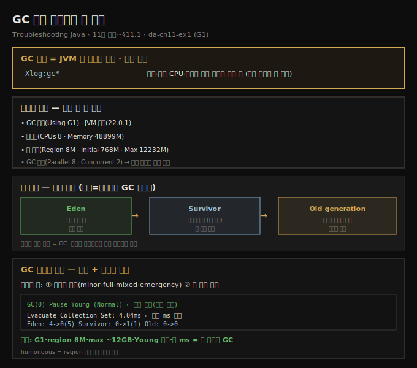
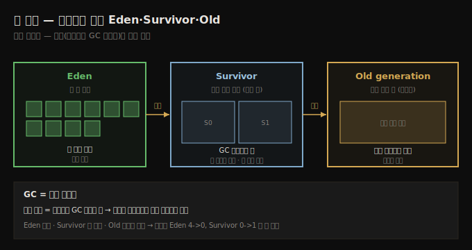
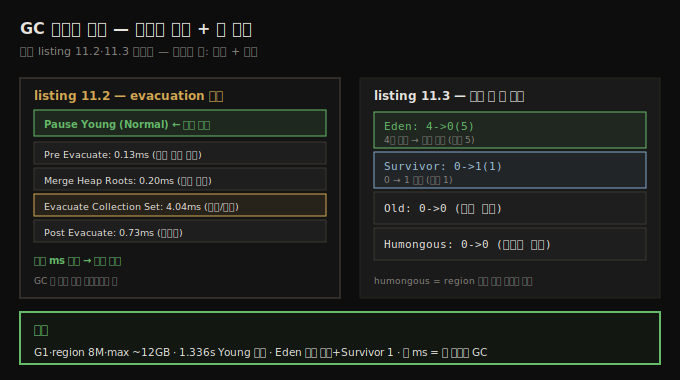

# GC 로그 활성화와 힙 구조
---
> GC 로그는 JVM의 메모리 일기라 모든 수집 이벤트를 기록하는데, 기본은 꺼져 있어 `-Xlog:gc*`로 켜고, 초기화 로그(GC 종류·JVM 버전·시스템·힙 할당)와 이벤트 로그(타입·단계별 시간)를 읽으면 Eden·Survivor·Old로 나뉜 힙에서 무슨 일이 벌어지는지 보입니다

이 노트는 『Troubleshooting Java』 11장의 도입부와 §11.1을 정리합니다. 5~10장이 디버거·로그·프로파일러·덤프로 문제를 조사했다면, 11장은 JVM의 메모리 관리 자체를 들여다보는 **GC 로그**를 다룹니다. 저자는 한 개발자가 금요일 배포 뒤 주말 내내 느려진 사이트(메모리 스파이크·CPU 99%·좀비 스레드)를 GC 로그로 — 잘못 튜닝된 힙이 일으킨 과도한 full GC·stop-the-world를 짚어 — 해결한 일화로 장을 엽니다. GC 로그는 JVM의 *메모리 일기*로, minor 수집부터 전면 정리까지 모든 GC 이벤트를 기록합니다. 이 편에서는 로그를 *켜고* 그 구조(초기화 로그·이벤트 로그)와 힙 구조(Eden·Survivor·Old)를 읽습니다. 파일 저장·로테이션은 다음 편(11-02), 실전 진단은 그 다음 편(11-03)으로 이어집니다.

> **정의 — 가비지 컬렉션(GC)**: 자바가 더는 쓰지 않는 객체를 메모리에서 자동으로 찾아 제거해 공간을 비우는 과정입니다.





## 1. GC 로그 켜기 — 기본은 꺼져 있다
> GC 로그는 크고 앱을 느리게 할 수 있어 기본으로 꺼져 있으니 느림·높은 CPU·메모리 문제를 조사할 때만 -Xlog:gc*로 켜는데, IDE Run 설정이나 java 명령에 VM 인자로 더합니다

GC는 자바 앱 성능에 핵심이지만, 그 동작은 가시성이 없으면 파악하기 어렵습니다. GC 로그는 메모리 할당·수집 멈춤·전체 힙 관리에 대한 통찰을 줘 병목을 진단하고 JVM을 튜닝하게 합니다.

기본적으로 GC 로깅은 *꺼져* 있습니다. 로그가 꽤 커서 앱을 느리게 하고 로그 파일을 군더더기로 채울 수 있기 때문입니다. 그래서 필요할 때만 — 느린 성능, 높은 CPU, 메모리 문제를 조사할 때 — 켜는 게 좋습니다. 켜는 VM 인자는 이것입니다.

```text
-Xlog:gc*
```

IDE에서 돌리면 Run 설정에 이 VM 옵션을 더하고, 콘솔(보통 Docker 컨테이너 같은 실환경)에서 돌리면 명령에 더합니다.

```text
java -Xlog:gc* -jar app.jar
```

예제 `da-ch11-ex1`은 5장과 비슷한 producer-consumer 멀티스레드 구조인데, GC 로그에 집중하도록 다른 앱 로그를 다 뺐습니다.


## 2. 초기화 로그 — 조사 전 첫 한눈
> 초기화 로그는 GC 종류(G1)·JVM 버전·시스템 자원(CPU·메모리)·힙 할당(region/min/initial/max)·GC 병렬 설정을 드러내, 문제를 더 파기 전 현재 실행의 기본 구성을 잡아 줍니다

앱을 켜면 먼저 **초기화 로그(initialization logs)**가 뜹니다 — GC 초기화의 핵심 파라미터를 드러냅니다.

```text
// listing 11.1 — 초기화 GC 로그(발췌)
[0.059s][info][gc     ] Using G1                 ← 어떤 GC 를 쓰는가
[0.065s][info][gc,init] Version: 22.0.1+8        ← JVM 버전
[0.065s][info][gc,init] CPUs: 8 total, 8 available   ← 시스템 자원
[0.065s][info][gc,init] Memory: 48899M
[0.065s][info][gc,init] Heap Region Size: 8M     ← 힙 할당 정보
[0.065s][info][gc,init] Heap Initial Capacity: 768M
[0.065s][info][gc,init] Heap Max Capacity: 12232M
[0.065s][info][gc,init] Parallel Workers: 8      ← GC 병렬 설정
[0.065s][info][gc,init] Concurrent Workers: 2
```

이 첫 개요가 문제를 더 파기 전 현재 실행의 기본 구성을 잡아 줍니다.

- **GC 종류·JVM 버전** — 메모리가 어떻게 관리될지 기대를 정합니다. 버전마다 할당·저장이 개선되고, GC 종류마다 객체 이동(evacuation) 방식이 달라, 지연·예기치 못한 동작을 미리 짐작하게 합니다.
- **시스템 정보** — 앱이 쓸 자원이 얼마인지 알려 줍니다. CPU·메모리가 부족하면 느려지거나 멈춤이 길어지거나 예측 불가하게 굽니다.
- **힙 정보** — 성능·메모리 문제 조사에 핵심입니다. 힙에 적은 메모리만 할당됐다면 GC 성능·메모리 문제를 의심하는 첫 단서입니다.

> **자원이 적을 때만 나오는 버그가 있습니다.** 저자는 멀티스레드 앱의 무작위 버그를 한참 좇다, CPU가 제한된 가상 환경에서 더 자주 터진다는 걸 깨달았습니다 — 멀티스레딩 로직이 생각만큼 똑똑하지 않았고, 낮은 처리력이 결함을 드러낸 것입니다. 힙 설정을 조이는 건 성능 개선뿐 아니라 앱의 회복력을 시험하는 방법이기도 합니다.


## 3. 힙 구조 — 옷장의 Eden·Survivor·Old
> 힙은 옷장처럼 데이터가 머무는 기간에 따라 구역이 나뉘는데, 새 객체는 Eden(새 옷)에서 시작해 GC 사이클을 살아남으면 Survivor(자주 입는 옷)로, 더 오래 살아남으면 Old(오래 간직하는 즐겨 입는 옷)로 승격됩니다

GC 로그를 더 파기 전에 메모리 구조를 짚습니다. JVM 힙을 옷을 넣는 옷장이라 상상하면, 막 던져 넣는 대신 옷이 머무는 기간에 따라 정리하는 체계가 있습니다.

- **Eden(새 옷 구역)** — 막 산 새 옷을 두는 곳입니다. 오래 둘지 금방 버릴지 아직 모릅니다. 자바 프로그램의 새 객체가 여기서 시작합니다.
- **Survivor(아직 쓰는 구역)** — Eden의 옷 중 자주 입는 건 Survivor로 옮깁니다. 몇 번 입고도(자바에선 GC 사이클 몇 번을 살아남고도) 여전히 쓸모 있으면 여기로 옵니다. Survivor엔 작은 영역 둘이 있어, 더 영구적인 곳으로 가기 전 그 사이를 오갑니다.
- **Old generation(클래식)** — 늘 입어 몇 년씩 옷장에 남는 즐겨 입는 옷입니다. Survivor에서 충분히 오래 살아남은 객체가 장기적으로 필요해 여기로 옵니다.

옷장이 너무 차면 비워야 합니다 — 이게 GC입니다. Eden은 새 게 많이 드나들어 자주 청소하고, Survivor는 덜 자주, Old는 중요한 걸 담아 드물게 청소합니다. 객체의 *나이*(살아남은 GC 사이클 수)에 따라 한 구역에서 다음 구역으로 승격(promote)됩니다.





## 4. GC 이벤트 로그 — 타입과 단계별 시간
> GC 이벤트 로그에서 가장 중요한 둘은 이벤트 타입(minor·full·mixed·emergency)과 각 단계에 쓴 시간이고, listing 11.2는 Pause Young (Normal)으로 evacuation 단계들이 모두 ms 단위라 잘 튜닝된 정상 수집이며, listing 11.3은 Eden 4→0·Survivor 0→1로 비워진 변화를 보여 줍니다

GC 이벤트는 성능 문제 조사에 결정적입니다. 가장 중요한 둘에 집중합니다.

- **GC 이벤트 타입** — minor·full·mixed·emergency 중 무엇인지 알려 줍니다. 각각 메모리 정리에 다른 목적을 가집니다.
- **각 단계에 쓴 시간** — 총 GC 시간이 길거나 특정 단계가 유독 길면 병목의 강한 신호입니다.

```text
// listing 11.2 — 메모리 수집 GC 이벤트
[1.336s][gc,start] GC(0) Pause Young (Normal)(G1 Evacuation Pause)   ← 수집 시작·타입
[1.337s][gc,task]  GC(0) Using 8 workers of 8 for evacuation         ← GC 스레드 수
[1.342s][gc,phases] GC(0) Pre Evacuate Collection Set: 0.13ms        ← 회수 대상 식별
[1.342s][gc,phases] GC(0) Merge Heap Roots: 0.20ms                   ← 참조 정렬
[1.342s][gc,phases] GC(0) Evacuate Collection Set: 4.04ms            ← 이동/제거
[1.342s][gc,phases] GC(0) Post Evacuate Collection Set: 0.73ms       ← 마무리 정리
```

여기엔 걱정거리가 없습니다 — 타입이 `Normal`이라 메모리 압박이나 긴급 조건이 아닌 *일상적* 수집이고, 모든 단계 시간이 ms 단위라 짧아 문제를 배제합니다. GC가 눈에 띄는 지연 없이 효율적으로 돈다는 뜻입니다.

```text
// listing 11.3 — 수집 후 변화
[1.342s][gc,heap] GC(0) Eden regions: 4->0(5)        ← Eden 4개 사용 → 모두 비움 (가용 5)
[1.342s][gc,heap] GC(0) Survivor regions: 0->1(1)    ← Survivor 0 → 1 사용 (가용 1)
[1.342s][gc,heap] GC(0) Old regions: 0->0            ← Old 로 승격 없음
[1.342s][gc,heap] GC(0) Humongous regions: 0->0      ← 큰 객체(humongous) 수집 없음
```

> **세 listing의 결론.** ① G1 GC를 쓰고 힙 region은 8MB·최대 힙 약 12GB, ② 1.336s에 Young Generation 수집이 트리거됨, ③ Eden 전부 비우고 Survivor 1개 사용, ④ GC 멈춤이 몇 ms뿐이라 *잘 튜닝된* GC입니다. (humongous = region 절반 넘게 차지하는 초대형 객체)





## 5. 면접 한 줄 정리
> GC 로그 활성화와 힙 구조의 핵심을 한 문장으로 점검합니다

- **GC 로그를 왜 기본으로 끄나?** 로그가 크고 앱을 느리게 할 수 있어, 느림·높은 CPU·메모리 문제를 조사할 때만 `-Xlog:gc*`로 켭니다.
- **초기화 로그가 주는 첫 단서는?** GC 종류(G1)·JVM 버전·시스템 자원·힙 할당(region/min/initial/max)·GC 병렬 설정 — 현재 실행의 기본 구성입니다.
- **힙의 세 구역은?** Eden(새 객체 시작), Survivor(GC 사이클 살아남은 것, 영역 둘), Old(오래 살아남아 승격된 것). Eden은 자주, Old는 드물게 청소합니다.
- **객체 나이란?** 살아남은 GC 사이클 수입니다. 충분히 살아남으면 Eden→Survivor→Old로 승격됩니다.
- **GC 이벤트에서 무엇을 보나?** 이벤트 타입(minor·full·mixed·emergency)과 각 단계 시간입니다. listing 11.2는 `Normal`+ms 단위라 잘 튜닝된 정상 수집입니다.
- **listing 11.3의 `Eden 4->0(5)`는?** 수집 전 Eden 4개 사용 → 모두 비움, 가용 5개라는 뜻입니다. Old `0->0`은 승격 없음입니다.


## 관련 문서
- [이 책 인덱스 (Troubleshooting Java MOC)](./README.md) — 장별 정독 노트 진척
- [OQL로 힙 덤프 쿼리하기](./10-03.OQL로%20힙%20덤프%20쿼리하기.md) — 10장 마지막 편. 힙 덤프(스냅숏)에 이어 GC 로그(시간에 걸친 일기)로 전환
- [GC 로그 파일 저장과 로테이션](./11-02.GC%20로그%20파일%20저장과%20로테이션.md) — 콘솔 대신 파일로 저장하고 로테이션·레벨로 관리하는 다음 편
