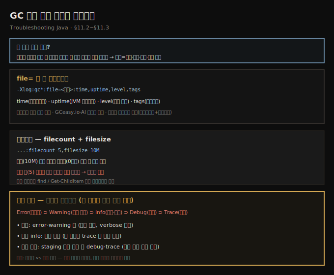
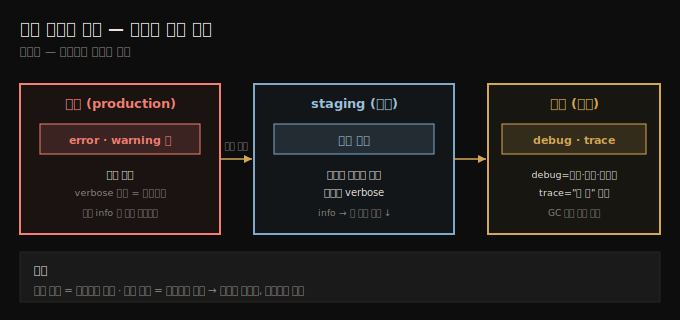

# GC 로그 파일 저장과 로테이션
---
> 콘솔 GC 로그는 학습용일 뿐 실환경에선 다른 로그와 섞이고 너무 커서, `file=`로 파일에 저장하고 time·uptime·level·tags 데코레이터로 형식을 갖춘 뒤, filecount·filesize로 로테이션하고 레벨(error~trace)을 골라 양을 조절합니다

이 노트는 『Troubleshooting Java』 11장의 §11.2와 §11.3을 정리합니다. 앞 편(11-01)이 GC 로그를 *켜고* 구조를 읽는 법이었다면, 이 편은 그 로그를 *파일에 저장하고 관리하는* 법입니다 — 실환경 트러블슈팅과 AI·GCeasy 같은 도구 분석의 토대입니다. 콘솔 로깅은 학습·빠른 디버깅엔 좋아도 실환경엔 멀어, 라이브 콘솔에서 다른 앱 로그와 섞이고 양이 많아 실시간 분석이 어렵습니다. 실전 진단 네 시나리오는 다음 편(11-03)으로 이어집니다.





## 1. 파일로 저장 — file=과 네 데코레이터
> GC 로그를 파일로 보내려면 -Xlog:gc*:file=<경로>:time,uptime,level,tags를 쓰는데, 네 데코레이터는 타임스탬프·JVM 가동시간·로그 레벨·태그를 메시지 형식에 더하며, JVM 프로세스에 그 디렉토리 쓰기 권한이 있어야 합니다

GC 로그를 특정 파일로 보내는 VM 인자는 이것입니다(JVM 프로세스에 그 디렉토리 *쓰기 권한*이 있어야 합니다).

```text
-Xlog:gc*:file=<file_path>:time,uptime,level,tags
```

`time`·`uptime`·`level`·`tags`는 로그 메시지 형식에 더할 데이터로, 보통 이 넷이 가장 유용하고 자주 쓰입니다.

- **time** — 각 항목에 타임스탬프를 더합니다.
- **uptime** — GC 이벤트가 일어난 JVM 가동 시간(초/ms)을 기록합니다.
- **level** — 로그 레벨(info·debug·trace 등)을 넣습니다(4장 로깅 레벨 참고).
- **tags** — 각 메시지에 연결된 태그(카테고리)를 보여 줍니다.

명령줄이나 IDE Run 설정에 더합니다.

```text
java -Xlog:gc*:file=gc.log:time,uptime,level,tags -jar yourApp.jar
```

파일로 저장하면 보관·공유가 쉬울 뿐 아니라 전용 도구로 깊이 분석할 수 있습니다 — 저자는 파일을 **GCeasy.io**(GC 로그 조사 도구)에 올리거나, ChatGPT·Gemini 같은 AI 비서로 내용을 분석해 통찰과 트러블슈팅 전략을 얻습니다.

> **재시작 때 덮어쓰기 함정.** 한 주니어 개발자가 `/var/logs/gc.log`에 저장하도록 설정했는데, 로그 파일이 *재시작마다 덮어써져* 사라졌습니다. 파일명 끝에 타임스탬프를 더해 해결했지만 — *옛 로그*는 로테이션을 안 켜 영영 사라졌습니다. 교훈: 늘 로테이션을 설정하세요.


## 2. 로그 로테이션 — filecount과 filesize
> 모든 로그를 한 파일에 쓰면 수 GB가 돼 다루기 힘드니, filecount로 최대 파일 수를, filesize로 파일별 크기 한도를 정해 로테이션하면, 한도에 닿을 때마다 인덱스가 붙은 새 파일을 만들고 최대 수에 이르면 가장 오래된 파일을 덮어씁니다

GC는 로그를 많이 만들어, 한 파일이 수 GB가 되면 저장·전송·분석이 번거롭습니다. 로그를 여러 파일로 쪼개 한 파일이 무한정 자라는 걸 막습니다 — **`filecount`**로 최대 파일 수를, **`filesize`**로 파일별 크기 한도를 정합니다.

```text
java -Xlog:gc*:file=logs.txt:time,uptime,level,tags:filecount=5,filesize=10M -jar app.jar
```

이러면 현재 파일이 한도(여기선 10M)에 닿을 때마다 GC가 자동으로 새 파일을 만듭니다. 각 새 파일엔 0부터 인덱스가 붙고, 최대 수(5)에 이르면 *가장 오래된 파일을 덮어써* 과도한 디스크 사용 없이 관리합니다. 특정 시간대 로그가 필요하면 생성·수정 타임스탬프로 파일을 거를 수 있습니다 — Linux `find`나 Windows PowerShell `Get-ChildItem`으로요. 관련 파일만 모아 GCeasy·AI 분석에 넘기면 조사가 효율적입니다.


## 3. 로그 레벨 — error부터 trace까지
> GC 로그는 4장의 표준 레벨(error·warning·info·debug·trace, 위험도 내림차순)을 쓰고 각 레벨은 더 위험한 상위를 자동 포함하는데, 운영은 error·warning만, info가 기본이고, 더 깊은 조사는 staging에서 debug·trace로 재현합니다

로그 양을 줄이는 또 한 방법은 특정 *심각도 레벨*만 저장하는 것입니다. GC 로그는 4장에서 다룬 표준 레벨을 쓰며, 위험도 내림차순은 이렇습니다.

- **Error** — 앱 안정성에 영향을 주는 치명적 실패만
- **Warning** — 오류로 이어질 수 있는 잠재 문제
- **Info** — GC 과정의 일반 운영 세부
- **Debug** — 트러블슈팅에 유용한 추가 진단 정보
- **Trace** — 가장 상세한 로그, GC 활동을 깊이 포착

레벨은 GC 로깅 인자에 원하는 레벨을 넣어 고릅니다. 예컨대 error만:

```text
java -Xlog:gc=error:file=gc.log:filecount=5,filesize=10M -jar app.jar
```

> **각 레벨은 더 위험한 상위를 자동 포함합니다.** `warning`을 켜면 더 높은 우선순위인 `error`도 함께 잡힙니다.

```text
java -Xlog:gc=warning:file=gc.log:filecount=5,filesize=10M -jar app.jar
```

**어느 레벨이 최선인가?** 무엇을 조사하느냐에 달렸습니다.

- **운영 환경** — 늘 error·warning만. 운영은 성능에 민감해 과도한 GC 로깅이 오버헤드를 줍니다.
- **더 상세한 로그가 필요하면** — 운영을 verbose 로그로 채우지 말고 *staging에서 재현*합니다. 대개 **info**가 모니터링·기본 트러블슈팅에 충분합니다 — 그래서 info가 기본 레벨입니다(앞 예제에서 trace가 안 보인 이유).
- **info로 문제는 알았지만 단서가 부족하면** — `debug`(GC 동작·멈춤 시간·최적화 통찰)와 `trace`("다 줘" 모드, 모든 세부)로 파고듭니다. 저자는 개발 모드에서 GC 성능을 미세 조정하거나 절박할 때 이 레벨을 씁니다.

핵심은 *상세함과 성능의 균형* — 너무 적으면 깜깜이로 날고, 너무 많으면 데이터의 바다에 빠집니다.





## 4. 면접 한 줄 정리
> GC 로그 파일 저장·로테이션·레벨의 핵심을 한 문장으로 점검합니다

- **왜 콘솔 대신 파일에 저장하나?** 실환경 콘솔에선 다른 앱 로그와 섞이고 양이 많아 실시간 분석이 어렵기 때문입니다. 파일은 수집·필터·분석이 쉽고 GCeasy·AI에 넘기기 좋습니다.
- **파일 저장 인자와 네 데코레이터는?** `-Xlog:gc*:file=<경로>:time,uptime,level,tags`입니다 — time(타임스탬프)·uptime(JVM 가동시간)·level(로그 레벨)·tags(카테고리). 디렉토리 쓰기 권한이 필요합니다.
- **로테이션은 어떻게?** `filecount`(최대 파일 수)·`filesize`(파일별 크기 한도)입니다. 한도에 닿으면 인덱스 붙은 새 파일을 만들고, 최대 수에 이르면 가장 오래된 파일을 덮어씁니다.
- **로그 레벨 다섯과 포함 관계는?** error·warning·info·debug·trace(위험도 내림차순). 각 레벨은 *더 위험한 상위를 자동 포함*합니다(warning 켜면 error도 잡힘).
- **환경별 권장 레벨은?** 운영=error·warning(성능 민감), 기본=info(대개 충분), 깊은 조사=staging에서 debug·trace로 재현입니다.
- **재시작 덮어쓰기 함정은?** 같은 파일명이면 재시작마다 덮어써집니다 → 파일명에 타임스탬프 + 로테이션을 설정합니다.


## 관련 문서
- [이 책 인덱스 (Troubleshooting Java MOC)](./README.md) — 장별 정독 노트 진척
- [GC 로그 활성화와 힙 구조](./11-01.GC%20로그%20활성화와%20힙%20구조.md) — 이 편의 전제. `-Xlog:gc*`로 켜고 초기화 로그·힙 구조를 읽는 단계
- [GC 로그로 문제 진단 네 시나리오](./11-03.GC%20로그로%20문제%20진단%20네%20시나리오.md) — 저장한 로그로 멈춤·누수·메모리 부족·병렬을 진단하는 다음 편
- [로그 영속화와 로깅 레벨](./04-02.로그%20영속화와%20로깅%20레벨.md) — 4장. GC 로그가 쓰는 표준 로깅 레벨의 원래 설명
