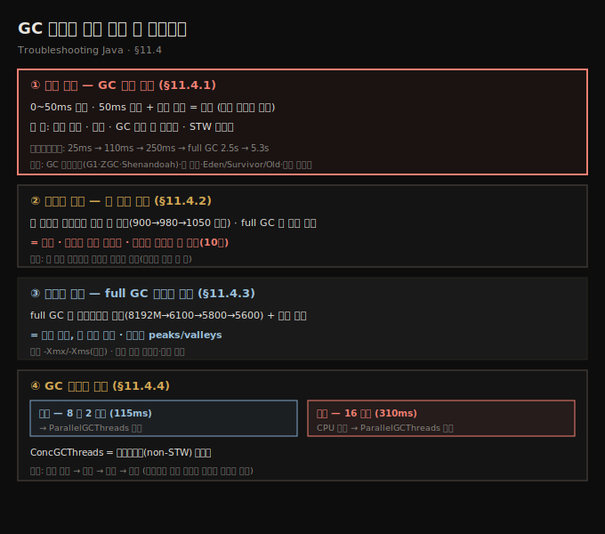
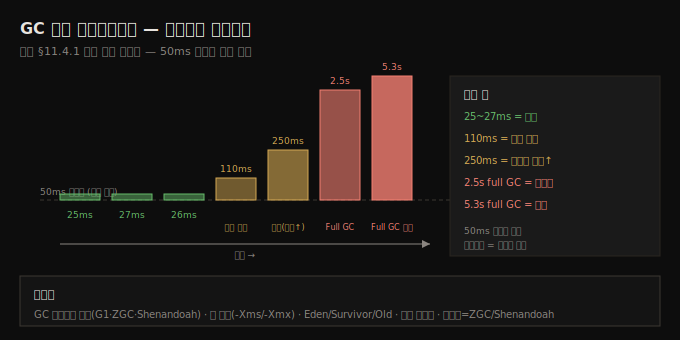
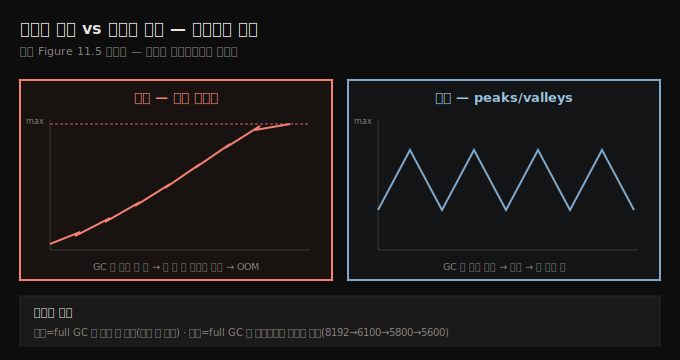
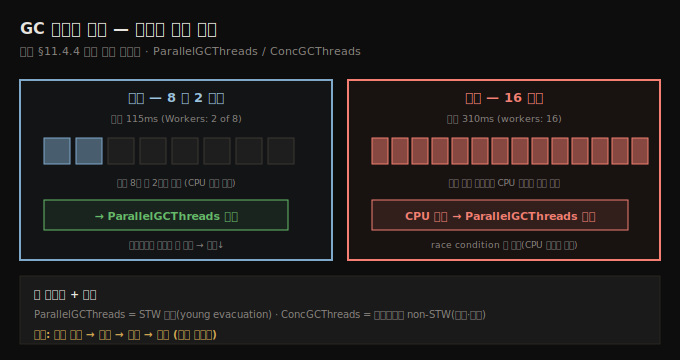

# GC 로그로 문제 진단 네 시나리오
---
> GC 로그는 네 실전 문제를 짚어 주는데 — 50ms 넘는 잦은 멈춤(성능 저하), full GC가 메모리를 거의 못 비움(누수), full GC가 잦지만 비우긴 함(메모리 부족), 워커 스레드 과소/과다(병렬 튜닝) — 각 패턴의 *멈춤 시간·빈도·회수량·STW*를 함께 읽어야 진짜 문제인지 가립니다

이 노트는 『Troubleshooting Java』 11장의 §11.4를 정리합니다. 앞 두 편이 GC 로그를 *켜고·저장하는* 법이었다면, 이 편은 그 로그로 *실전 문제를 진단하는* 네 시나리오입니다. 로그가 있는 것만으로는 부족하고, 효과적으로 검색해 드러나는 문제를 짚을 줄 알아야 합니다. 네 시나리오는 ① GC 멈춤으로 인한 성능 저하, ② 힙 사용 로그로 메모리 누수 식별, ③ full GC로 메모리 부족 식별, ④ GC 병렬성 튜닝입니다.





## 1. 성능 저하 — GC 멈춤 시간
> GC 멈춤이 0~50ms면 정상이지만 50ms를 넘고 *잦으면* 성능 문제 신호인데, 멈춤 시간·빈도·GC 전후 힙 사용량·STW 넷을 함께 보고, 한두 예외가 아니라 일관되게 높은 멈춤이 반복돼야 진짜 문제로 봅니다

GC는 메모리 관리에 필수지만, 과도하거나 긴 멈춤은 성능을 크게 해쳐 눈에 띄는 지연을 만듭니다. 증상은 응답 시간 증가, 실제 일은 적은데 높은 CPU(5장 프로파일러로 관찰), 주기적 프리즈·지연 스파이크입니다. 멈춤 문제를 조사할 때 GC 로그에서 볼 핵심 넷입니다.

- **GC 멈춤 시간** — 각 GC 사이클이 쓴 시간
- **GC 빈도** — 짧은 간격의 잦은 minor·full GC는 누수나 나쁜 튜닝 신호
- **GC 전후 힙 사용량** — full GC가 메모리를 거의 못 비우면 객체가 예상보다 오래 머무는 것
- **Stop-the-world(STW) 이벤트** — 긴 STW는 GC가 앱 성능을 방해한다는 신호

> **0~50ms는 정상, 50ms 초과는 조사 대상 — 단 반복 패턴이어야.** 멈춤이 50ms를 넘으면 잠재 문제일 수 있지만, 여러 항목을 봐 *반복 패턴*인지 확인해야 합니다. 1,000개 메시지 중 한두 예외는 문제가 아닐 수 있습니다. 진짜 문제로 결론지으려면 *일관되게 높은 멈춤*이 잦은 GC와 함께 나타나야 하며, 이는 보통 메모리 압박을 뜻합니다.

다음은 멈춤이 점점 악화되는 예입니다 — 처음 몇은 25~27ms로 정상이지만, 12:00:10에 110ms로 뛰며 성능 저하의 초기 경고가 나타나고, 12:00:20에 250ms로 악화, 12:00:35에 **2.5초짜리 full GC**라는 큰 적신호, 12:01:10에 또 **5.3초 full GC**로 심각한 메모리 관리 문제를 알립니다.

```text
GC(45) Pause Young (G1 Evacuation Pause) 0.025s   ← 정상
GC(46) Pause Young (G1 Evacuation Pause) 0.027s   ← 정상
GC(48) Pause Young (G1 Evacuation Pause) 0.110s   ← 초기 경고
GC(49) Pause Young (G1 Evacuation Pause) 0.250s   ← 악화(메모리 압박↑)
GC(50) Pause Full (System.gc())        2.567s     ← 적신호(full GC)
GC(52) Pause Full (Allocation Failure) 5.321s     ← 심각
```

멈춤이 성능을 해치면 조정안은 — GC 알고리즘 실험(G1GC·ZGC·Shenandoah), 힙 크기(`-Xms`·`-Xmx`) 조정, Eden·Survivor·Old 크기 최적화, 객체 생성 최소화·재사용으로 앱 설계 변경, 저지연이 필요하면 멈춤을 최소화하는 ZGC·Shenandoah입니다.





## 2. 메모리 누수 — 힙 사용 로그
> 힙 사용 로그는 시간에 걸친 메모리 소비를 보여 줘 점진적 증가 패턴으로 누수를 드러내는데, GC가 매 사이클 메모리를 점점 *덜* 비우고 full GC조차 거의 효과 없으면 누수이며, 정확한 원인은 힙 덤프(10장)로 짚습니다

메모리 누수는 미묘하지만 치명적이라 성능 저하·과도한 GC·끝내 OOM 크래시로 이어집니다. VisualVM·Eclipse MAT 같은 프로파일러도 강력하지만, 더 가볍고 연속적인 접근이 필요할 때 **힙 사용 로그**가 등장합니다 — 시간에 걸친 메모리 소비의 역사적 관점을 줘 누수를 가리키는 점진적 증가 패턴을 잡아냅니다.

저자가 든 일화에서, 한 엔지니어가 Kubernetes 파드가 계속 재시작하는 새벽에 GC 로그를 열어 이런 항목을 봅니다.

```text
[GC (Allocation Failure) [PSYoungGen: 512M->128M(1024M)] 1024M->900M(2048M), 0.250s]
[GC (Allocation Failure) [PSYoungGen: 640M->200M(1024M)] 1100M->980M(2048M), 0.270s]
[GC (Allocation Failure) [PSYoungGen: 700M->250M(1024M)] 1200M->1050M(2048M), 0.280s]
[Full GC (Ergonomics) ... 2048M->1148M(2048M), 1.200s]
```

"메모리 사용이 계속 자란다 — 첫 GC는 900MB가 남았고, 둘째는 980MB, 셋째는 1050MB. 공간을 더 회수하기는커녕 매 사이클이 *더 많은 메모리를 남긴다*. 그러다 GC가 당황해 full 수집을 했지만 그조차 거의 차이가 없다. 이건 정상 사용이 아니라 누수다." 그는 누수를 짚어, 비워지지 않는 컬렉션에 세션 참조가 머무는 걸 — 몇 시간 전 배포가 들여온 문제임을 — 찾고 릴리스를 롤백합니다.

> **GC가 메모리를 못 비우는 게 핵심 경고입니다.** 로그를 열어 여러 GC 이벤트가 공간 회수에 거의 진전이 없으면 누수가 의심됩니다. *full GC조차 효과가 미미하면* 누수 의심을 더 굳힙니다. 정확한 원인은 **힙 덤프(10장)**로 짚고, 프로파일러가 있으면 메모리 할당 그래프(5장)로 확인합니다 — 정상은 peaks/valleys, 누수는 *계속 차오름*입니다.


## 3. 메모리 부족 — full GC가 잦지만 비우긴 함
> 메모리 부족은 누수와 다른데, full GC가 메모리를 *효과적으로 비우고* 힙이 꾸준히 안 차오르지만 *빈도가 높고 full GC가 섞이면*, 누수(참조 잔류)가 아니라 워크로드에 비해 힙이 과소 할당된 것이라, -Xmx/-Xms는 단기책이고 설계 최적화·수평 확장이 근본책입니다

메모리 부족은 *누수와 같지 않습니다*. 누수는 앱 로직 결함으로 객체가 계속 할당되되 *제대로 해제되지 않아*, 충분한 메모리가 있어도 참조가 무한정 머물러 힙이 고갈됩니다. 반면 메모리 부족은 앱이 워크로드를 처리할 메모리가 *그냥 모자란* 것입니다 — 부적절히 보유된 게 아니라 *할당 자체가 부족*합니다.

둘 다 GC 로그에 집중적인 GC 활동을 보여 구별이 까다롭지만, 원인이 다릅니다. 다음 예를 봅니다.

```text
[GC pause (G1 Evacuation Pause) (mixed), 0.015s]
[Full GC (Allocation Failure) 8192M->6100M(8192M), 2.345s]
[GC pause (G1 Evacuation Pause) (mixed), 0.019s]
[Full GC (Allocation Failure) 8192M->5800M(8192M), 2.678s]
[Full GC (Allocation Failure) 8192M->5600M(8192M), 2.789s]
```

여기선 GC가 잦지만 멈춤이 과도하게 길지 않고, 모두 메모리 회수에 *어느 정도 효과적*입니다(8192M→6100M→5800M→5600M로 비움). 11-03 §2의 누수와 달리 GC가 메모리를 성공적으로 비우고 힙 사용이 꾸준히 증가하지 않습니다 — 즉 객체가 무한정 보유되지 않고 결국 수집되므로 *누수가 아닙니다*. 다만 *높은 빈도 + full GC*는 여전히 걱정스러운 패턴으로, 할당된 힙이 워크로드에 *부족*함을 가리킵니다.

확인은 메모리 소비 그래프로도 합니다 — 누수면 힙이 꽉 찰 때까지 *꾸준히 증가*, 메모리 부족이면 GC가 능동적으로 회수해 *peaks/valleys*를 보입니다. 다만 할당이 최대에 너무 가까우면 성능이 저하되고 OOM 위험이 커집니다.

> **-Xmx/-Xms는 단기 완화, 근본책은 따로입니다.** 힙을 키우면 GC 트리거 전 더 많은 객체를 다뤄 즉각 완화되지만, 수직 확장(힙 키우기)만으론 임시방편입니다. 근본적으로는 불필요한 할당을 줄이고 객체를 제대로 해제하도록 *로직을 최적화*하고, 길게는 *수평 확장*(워크로드를 여러 인스턴스에 분산)으로 갑니다.





## 4. GC 병렬성 튜닝 — 워커 스레드 과소/과다
> GC가 8개 중 2개 워커만 쓰면 CPU 과소 활용으로 멈춤이 길어지니 -XX:ParallelGCThreads를 늘리고, 반대로 16개를 써 CPU 경합(스레드가 CPU를 두고 다툼)이 생기면 줄이며, ConcGCThreads는 백그라운드(non-STW) 단계를 조절합니다

현대 GC는 여러 스레드로 정리를 빠르게 하지만, 잘못 튜닝하면 너무 열심히(CPU 낭비) 또는 너무 적게(메모리 방치) 일합니다. 최근 자바 기본인 G1 GC를 중심으로 두 JVM 설정 — `-XX:ParallelGCThreads`·`-XX:ConcGCThreads` — 이 GC가 쓸 스레드 수를 조절합니다.

**과소 활용 — 8개 중 2개만.** 다음 로그는 멈춤이 115ms로 길고, 가용 8개 중 *2개* 워커만 정리에 씁니다. GC가 CPU를 과소 활용해 비효율·긴 멈춤을 부를 수 있습니다.

```text
[GC pause (G1 Evacuation Pause) (young), 0.124s]
   Parallel Time: 115.2 ms, Workers: 2 (out of 8 available)
```

병렬 GC 스레드를 늘려 워크로드를 CPU 코어에 더 분산합니다.

```text
-XX:ParallelGCThreads=6     ← STW 단계(예: young 세대 evacuation) 스레드 수
-XX:ConcGCThreads=4         ← 동시(백그라운드, non-STW) 단계 스레드 수
```

- `ParallelGCThreads` — 너무 낮으면 CPU 과소 활용으로 멈춤이 길고, 너무 높으면 다른 작업에 필요한 CPU를 먹어 앱을 느리게 합니다.
- `ConcGCThreads` — 너무 낮으면 동시 단계가 못 따라가 잦은 STW를, 너무 높으면 CPU를 과소비합니다. G1 로그에 긴 동시 단계가 보이면 이 값을 늘려 백그라운드 GC를 빠르게 합니다.

**과다 — 16개로 CPU 경합.** 다음 로그는 멈춤이 약 310ms로 길고 워커가 16개입니다. 너무 많은 스레드가 CPU를 두고 경쟁하는 **CPU 경합(contention)**으로, race condition과 비슷하되 *공유 메모리가 아니라 CPU 시간*을 두고 GC 스레드가 다툽니다.

```text
[GC (Allocation Failure) [ParallelGC (workers: 16)] 1536M->768M(3072M), 0.310s]
```

이때는 `-XX:ParallelGCThreads`로 워커 수를 *줄여* 경합을 낮춥니다.

> **GC 튜닝은 정밀 과학이 아닙니다.** 시간에 걸쳐 동작을 관찰해야 하고, 모니터링 없이 바꾸면 예기치 못한 문제가 납니다. 핵심은 **작게 시작 → 관찰 → 조정 → 반복**입니다. 스레드를 무작정 더 던지지 마세요 — CPU가 녹아내리는 걸 즐기는 게 아니라면.





## 5. 면접 한 줄 정리
> GC 로그 진단 네 시나리오의 핵심을 한 문장으로 점검합니다

- **GC 멈춤은 얼마부터 문제인가?** 0~50ms는 정상, *50ms 초과 + 잦은 반복*이면 성능 문제입니다. 멈춤 시간·빈도·GC 전후 힙·STW 넷을 함께 봅니다. 한두 예외는 문제 아닙니다.
- **누수를 GC 로그에서 어떻게 아나?** GC가 매 사이클 메모리를 점점 *덜* 비우고(900→980→1050 남김) full GC조차 거의 효과 없으면 누수입니다. 그래프는 *계속 차오름*, 정확한 원인은 힙 덤프(10장)로.
- **메모리 부족과 누수는 어떻게 구별하나?** 부족은 full GC가 *효과적으로 비우되* 빈도가 높은 것(under-provisioned heap)이고, 누수는 *거의 못 비우는* 것입니다. 그래프는 부족=peaks/valleys, 누수=꾸준한 증가.
- **메모리 부족의 단기책과 근본책은?** 단기는 `-Xmx`/`-Xms`로 힙 키우기(수직 확장), 근본은 할당 최적화·객체 해제·수평 확장입니다.
- **GC 병렬성은 어떻게 튜닝하나?** 8개 중 2개만 쓰면(과소) `-XX:ParallelGCThreads`를 늘리고, 16개로 CPU 경합이면 줄입니다. `-XX:ConcGCThreads`는 백그라운드(non-STW) 단계용입니다.
- **GC 튜닝의 원칙은?** 작게 시작 → 관찰 → 조정 → 반복. 모니터링 없이 스레드를 무작정 늘리지 않습니다.


## 관련 문서
- [이 책 인덱스 (Troubleshooting Java MOC)](./README.md) — 장별 정독 노트 진척
- [GC 로그 파일 저장과 로테이션](./11-02.GC%20로그%20파일%20저장과%20로테이션.md) — 이 편의 전제. 진단할 로그를 파일로 저장·관리하는 단계
- [힙 덤프 읽기 — referrers와 누수](./10-02.힙%20덤프%20읽기%20—%20referrers와%20누수.md) — 10장. 누수의 *정확한 원인*을 힙 덤프로 짚는 법(이 편 §2가 가리키는 곳)
- [05_JVM 폴더 인덱스](../../README.md) — JVM 정독 노트 네 권의 상위 인덱스
