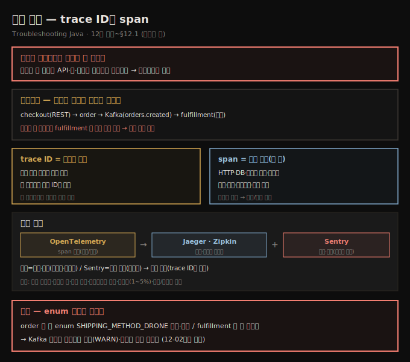
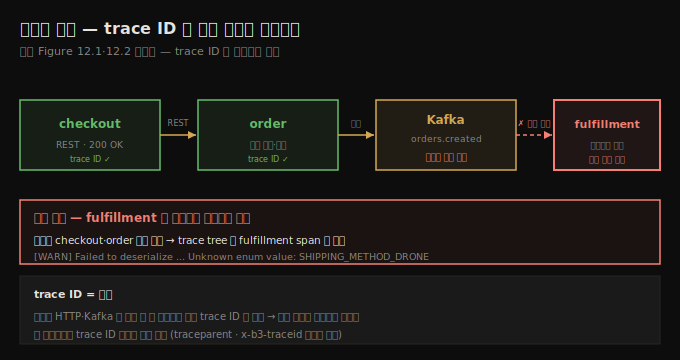
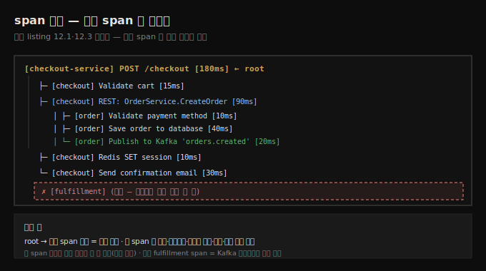

# 분산 추적 — trace ID와 span
---
> 서비스가 여러 개인 시스템에서 장애는 한곳에 머물지 않고 API·큐·무관한 서비스로 메아리치는데, 요청에 부여된 trace ID가 서비스 경계를 넘으며 찍히는 여권처럼 따라다녀, Jaeger·Zipkin이 같은 trace ID의 span들을 묶어 어디서 멈췄는지·끊겼는지를 한 타임라인으로 보여 줍니다

이 노트는 『Troubleshooting Java』 12장의 도입부와 §12.1을 정리합니다. 11장까지가 단일 JVM 안의 조사였다면, 12장은 *여러 서비스가 통신하는 시스템*의 실패를 다룹니다 — 책의 마무리 장입니다. 서비스 시스템에서 장애는 팀 스포츠라, 한 서비스가 타임아웃 나면 다른 서비스가 맹렬히 재시도하고, 어느새 무관한 모듈의 에러가 로그를 채웁니다. 문제는 좀처럼 *로컬에 머물지 않고* 시스템을 따라 메아리칩니다. 이 편에서는 그 메아리를 따라가는 두 도구 — **trace ID**와 **span** — 와, 그것을 묶어 보여 주는 OpenTelemetry·Jaeger·Zipkin·Sentry를 다룹니다. 직렬화·버전 불일치는 다음 편(12-02), 시스템 장애 모드는 그 다음 편(12-03)으로 이어집니다.





## 1. 시나리오 — 결제는 됐는데 주문이 사라졌다
> 자바 마이크로서비스 e-커머스에서 체크아웃은 되고 결제·확인 메일도 가는데 주문이 관리자 대시보드에 안 보이는 상황으로, checkout(REST)→order→Kafka→fulfillment 흐름을 로그로 좇지만 fulfillment엔 주문 흔적이 없습니다

자바 마이크로서비스로 만든 e-커머스 플랫폼을 운영한다고 합시다. 어느 날 고객 지원팀이 — 일부 사용자가 체크아웃을 끝냈는데 *주문이 관리자 대시보드에 안 나타난다*고 보고합니다. 결제는 처리되고 확인 메일도 갔는데, 정작 주문은 사라졌습니다. 시스템 구조는 이렇습니다.

- **Checkout 서비스(REST)** → Order 서비스를 호출
- **Order 서비스** → Kafka에 이벤트를 발행
- **Fulfillment 서비스** → Kafka에서 소비해 주문을 저장

먼저 로그를 뒤집니다. Checkout 로그는 Order로의 REST 호출이 성공(trace ID 존재·응답 200·페이로드 정상)했음을 보입니다. Order 로그는 요청을 받아 주문 객체를 만들고 Kafka에 이벤트를 발행합니다 — 에러도 예외도 없습니다. 그런데도 fulfillment엔 주문 흔적이 *없습니다*. 로그가 전체 그림을 안 줄 때, 문제가 여러 서비스에 걸쳐 있다고 의심되면 접근을 바꿔야 합니다 — *분산 추적*이 등장할 때입니다.





## 2. trace ID — 요청에 찍히는 여권
> trace ID는 시스템에 들어오는 요청에 부여된 고유 식별자로, 서비스 경계를 넘을 때마다 찍히는 여권처럼 따라다니며 각 서비스가 같은 trace ID로 로그·텔레메트리를 태깅해, 한 요청의 전체 이야기를 시스템 경계 너머로 꿰맞추게 해 줍니다

단일 자바 앱에서는 스택 트레이스나 로그 파일로 충분하지만, 한 요청이 열두 서비스를 오가는 분산 시스템에선 전통적 도구가 금세 부족합니다. 그때 **trace ID**가 등장합니다.

> **정의 — trace ID**: 시스템에 들어오는 요청에 부여된 고유 식별자입니다.

trace ID는 요청과 함께 다니며 *건너는 모든 국경에서 도장 찍히는 여권*이라 생각하면 됩니다. 요청이 HTTP·gRPC·메시지 큐로 여러 서비스를 흐를 때, 참여하는 각 서비스가 자기 여정을 같은 trace ID로 태깅해, 한 요청의 전체 이야기를 시스템 경계 너머로 꿰맞추게 해 줍니다.

trace ID는 Jaeger·Zipkin 같은 분산 추적 시스템(또는 Datadog·Honeycomb 같은 상용 플랫폼)의 핵심입니다. 이 도구들이 **span**(각 서비스가 한 작업 단위)을 모아 같은 trace ID로 묶어, 각 단계가 얼마나 걸렸고·무슨 에러가 났고·지연이 어디서 시작됐는지의 완전한 그림을 만듭니다.

> **trace ID는 한 서비스만 떨궈도 사슬이 끊깁니다.** 실무에서 trace ID는 보통 HTTP 헤더(`traceparent`·`x-b3-traceid`)나 메시지 페이로드 메타데이터로 전파됩니다. 모든 서비스에서 *일관된 전파*가 결정적입니다 — 한 서비스라도 trace ID를 떨구면 사슬이 끊겨, 완전한 그림 대신 파편만 남습니다.


## 3. span — 추적의 기본 단위
> span은 분산 추적의 기본 단위로 한 서비스 안의 한 작업 단위(HTTP 처리·DB 쿼리·다른 서비스 호출·메시지 처리)를 나타내며, 이름·시작시각·소요·서비스명·태그·로그·부모 span 참조를 담고 중첩돼 트리를 이뤄 어디가 느렸는지·실패했는지를 보여 줍니다

**span**은 분산 추적의 기본 단위로, 한 서비스 안에서 이뤄진 *한 작업 단위* — HTTP 요청 처리, DB 쿼리, 다른 서비스 호출, 메시지 처리 — 를 나타냅니다. 추적이 요청의 전체 이야기라면 각 span은 그 이야기의 한 장(章)입니다. span에 담기는 것은 이름, 시작 시각·소요, 생산한 서비스명, 태그(상태 코드·에러 메시지 등 메타데이터), 생명 중 일어난 로그·이벤트, 그리고 (더 큰 작업의 일부라면) 부모 span 참조입니다.

Jaeger는 trace ID로 정보를 모아 각 단계를 타임라인(트리)으로 보여 줍니다.

```text
// listing 12.1 — 트레이스 타임라인(trace tree)
Trace ID: 6f98c1e2b3a24f59
└── [api-gateway] POST /checkout                  [950ms]
    ├── [checkout-service] Validate cart          [40ms]
    ├── [checkout-service] Call OrderService       [780ms]
    │   └── [order-service] Create order record    [100ms]
    │       ├── [order-service] Check inventory     [60ms]
    │       └── [order-service] Save to database    [30ms]
    ├── [checkout-service] Call PaymentService      [100ms]
    │   └── [payment-service] Process payment       [90ms]
    └── [checkout-service] Send confirmation email  [30ms]
```

한 span의 상세 뷰는 trace ID·span ID·부모 span ID·span 이름·서비스명·시작/종료 시각·소요·상태·계측 라이브러리(예: OpenTelemetry Java SDK)를 담습니다.

```text
// listing 12.2 — span 상세
Trace ID        bf12ec184a2b48d0a28a1f07c748f6e3   ← 호출 트리 디버깅용
Span ID         d6f0fdee62ef3c6a
Parent Span ID  null (root span)
Span Name       GET /products                      ← 코드의 어느 작업인지
Service Name    api-gateway                         ← span 실행 서비스
Duration        42ms                                ← 성능 문제 조사용
Instrumentation OpenTelemetry Java SDK 1.30.0       ← 계측 라이브러리
```

span은 중첩돼 트리를 이뤄, 정확히 어느 부분이 느리거나 실패했는지 보여 줍니다. 우리 시나리오의 트리(listing 12.3)에는 order와 order 서비스 내부 처리는 있는데 *fulfillment가 없습니다* — 메시지를 끝내 소비하지 않은 것입니다.




> **범인은 enum 스키마 불일치.** Kafka UI로 `orders.created` 토픽을 보니 이벤트가 *소비 안 된 채* 토픽에 앉아 있습니다. fulfillment 로그의 무해한 info 사이에 숨어 있던 한 줄 — `[WARN] Failed to deserialize message from topic orders.created - Unknown enum value: SHIPPING_METHOD_DRONE`. 어제 order 서비스에 새 enum 값 `SHIPPING_METHOD_DRONE`이 추가·배포됐는데, fulfillment는 *업데이트 안 돼 옛 스키마*를 써 역직렬화에 실패한 것입니다. (이 직렬화 불일치는 12-02에서 더 다룹니다.)


## 4. 추적 스택 — OpenTelemetry·Jaeger·Zipkin·Sentry
> 추적의 핵심은 텔레메트리를 생성하는 OpenTelemetry(수동/자동 계측)이고, 생성된 span은 Jaeger·Zipkin이 모아 웹 UI로 보여 주며, 추적이 못 잡는 실패의 세부는 예외·스택 트레이스를 모으는 Sentry가 보완합니다

분산 추적을 실제 시스템에서 굴리려면 런타임 환경에 여러 구성요소를 통합해야 합니다 — 개발자 도구가 아니라 *시스템 규모 관찰가능성을 떠받치는 인프라*입니다.

- **OpenTelemetry** — 자바 서비스에서 텔레메트리를 생성하는 핵심입니다. *수동 계측*(span 만드는 코드 작성)이나 *자동 계측*(Java agent를 시작 시 붙이면 Spring·gRPC·JDBC·HTTP 클라이언트의 span을 코드 수정 없이 잡음)으로 더합니다.
- **Jaeger·Zipkin** — 생성된 span을 모아 시각화하는 관찰가능성 백엔드입니다. 보통 같은 K8s 클러스터·Docker로 배포하고, 서비스가 OTLP·gRPC로 추적 데이터를 보내면 웹 UI로 탐색하게 해 줍니다.

추적 도구는 버그 추적을 넘어 *시스템 규모 관찰가능성의 토대*입니다 — 성능 최적화(어느 호출이 느린가), 의존성 맵(서비스 간 통신·과부하), 에러 격리(어느 서비스·작업이 실패했나), 콜드 스타트·자원 스파이크 감지(느린/막힌 span으로 콜드 스타트·긴 GC·스레드 풀 기아 포착), 샘플링·추세 분석(1~5%만 샘플링해도 통찰), 로그·메트릭 결합에 씁니다.

> **Sentry — 추적이 못 잡는 "무엇이"를 보완.** Jaeger·Zipkin은 *어디서·얼마나*(타임라인·지연)는 주지만 요청 실패 시 *무엇이 잘못됐는지*를 늘 잡진 못합니다. **Sentry**는 처리 안 된 예외·스택 트레이스·런타임 에러를 실시간으로 모으고, 실패한 코드 줄·사용자 식별자·HTTP 요청 세부·코드 버전 태그까지 자동 포착합니다. 우리 시나리오에서 fulfillment가 enum 역직렬화로 *조용히* 실패(크래시 없이)했는데, Sentry가 있었다면 그 예외와 페이로드 메타데이터·발생 빈도를 잡아 스키마/버전 불일치를 로그 grep 없이 빨리 짚었을 것입니다. 추적은 *흐름*을, Sentry는 *실패의 전모*를 보여 줘 — 둘은 대체가 아니라 보완이고, Sentry 에러에 trace ID가 실리면 두 도구를 오가며 추적합니다.


## 5. 면접 한 줄 정리
> 분산 추적의 핵심을 한 문장으로 점검합니다

- **trace ID란?** 시스템에 들어오는 요청에 부여된 고유 식별자입니다. 서비스 경계마다 찍히는 *여권*처럼 따라다녀, 한 요청의 전체 이야기를 경계 너머로 꿰맞춥니다. 한 서비스라도 떨구면 사슬이 끊깁니다(보통 `traceparent`·`x-b3-traceid` 헤더로 전파).
- **span이란?** 분산 추적의 기본 단위로, 한 서비스 안의 한 작업 단위(HTTP 처리·DB 쿼리·서비스 호출·메시지 처리)입니다. 이름·시작/소요·서비스명·태그·부모 span 참조를 담고, 중첩돼 트리를 이뤄 어디가 느렸는지·실패했는지를 보여 줍니다.
- **trace와 span의 관계는?** trace는 요청의 전체 이야기, span은 그 한 장입니다. 같은 trace ID로 span들이 묶입니다.
- **OpenTelemetry·Jaeger·Zipkin의 역할은?** OpenTelemetry가 텔레메트리(span)를 *생성*(자동 계측은 agent로 코드 수정 없이), Jaeger·Zipkin이 *수집·시각화*하는 백엔드입니다.
- **Sentry는 추적과 어떻게 다른가?** 추적은 *흐름·지연*(어디서·얼마나), Sentry는 *예외·스택 트레이스*(무엇이 실패했나)입니다. 대체가 아니라 보완 — trace ID로 연결됩니다.
- **시나리오의 누락 주문 원인은?** order에 새 enum `SHIPPING_METHOD_DRONE`이 추가됐는데 fulfillment가 옛 스키마라 Kafka 메시지 역직렬화에 *조용히* 실패한 것입니다.


## 관련 문서
- [이 책 인덱스 (Troubleshooting Java MOC)](./README.md) — 장별 정독 노트 진척
- [GC 로그로 문제 진단 네 시나리오](./11-03.GC%20로그로%20문제%20진단%20네%20시나리오.md) — 11장 마지막 편. 단일 JVM 조사의 끝, 이 장은 다중 서비스로 전환
- [직렬화·버전 불일치](./12-02.직렬화·버전%20불일치.md) — 이 편의 enum 불일치를 Protobuf·스키마 검증으로 파고드는 다음 편
