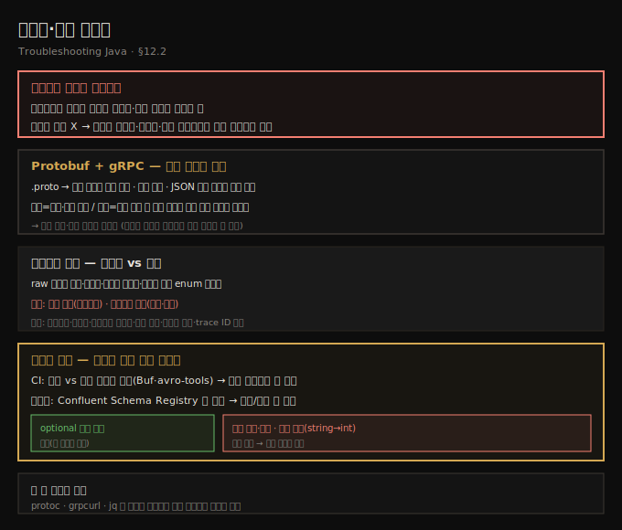
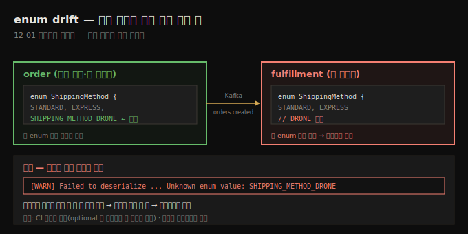
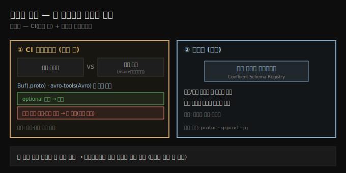

# 직렬화·버전 불일치
---
> 두 서비스가 데이터를 주고받으려면 프로토콜뿐 아니라 데이터를 *구조화·해석하는 방식*도 같아야 하는데, 직렬화는 조용히 어긋나기 쉬운 지점이라 — 필드 추가·enum 이름 변경·타입 변경이 드롭된 데이터·기본값·역직렬화 에러를 특정 상황에서만 일으키므로 — CI 스키마 검증과 전/후방 호환으로 서비스가 독립적으로 진화하게 만듭니다

이 노트는 『Troubleshooting Java』 12장의 §12.2를 정리합니다. 앞 편(12-01)의 누락 주문 시나리오가 `SHIPPING_METHOD_DRONE` enum 불일치로 끝났는데, 이 편은 그 *직렬화·버전 문제*를 파고듭니다. 두 서비스가 데이터를 주고받으려면 프로토콜(HTTP·gRPC) 수준뿐 아니라 데이터를 *어떻게 구조화·해석하는지*도 같아야 합니다 — 그게 **직렬화(serialization)**: 메모리 안 객체를 바이트 스트림으로 바꿔 보내고 받는 쪽에서 되돌리는 일입니다. 시스템 장애 모드는 다음 편(12-03)으로 이어집니다.





## 1. 직렬화는 조용히 어긋난다
> 한 서비스가 JSON에 필드를 더했는데 옛 모델 쓰는 다른 서비스가 조용히 무시하거나, Protobuf enum을 이름 바꾸거나 optional 안 만들거나, 같은 객체를 다른 클래스로 역직렬화하면 — 명백한 실패가 아니라 드롭된 데이터·기본값·특정 상황에서만 나는 에러가 됩니다

직렬화는 *조용히 잘못되기* 가장 쉬운 지점입니다. 한 서비스가 JSON 페이로드에 새 필드를 더했는데 — 옛 모델을 쓰는 다른 서비스가 조용히 무시하면? 누군가 Protobuf enum 이름을 바꾸거나 필드를 optional로 안 만들면? 자바 객체를 특정 버전 UID로 직렬화했는데 *전혀 다른 클래스*로 역직렬화하면?

이런 불일치는 늘 명백한 실패를 일으키진 않습니다. 때로는 드롭된 데이터, 기본값, 또는 *특정 상황에서만* 나타나는 역직렬화 에러로 끝납니다 — 12-01의 enum 불일치처럼요. 이 편에서는 직렬화·버전 문제가 실제 시스템에서 어떻게 나타나고, 데이터 계약을 진화시킬 때 무엇을 살피며, *전방·후방 호환*을 어떻게 세워 서비스가 서로를 깨지 않고 독립적으로 진화하게 하는지 봅니다.


## 2. Protobuf와 gRPC — 강한 계약의 양날
> Protobuf는 .proto로 구조를 정의해 자바 클래스를 자동 생성하는 언어 중립 직렬화 포맷으로 JSON보다 빠르고 작고 엄격하지만, 서비스가 독립 진화할 때 한쪽이 필드 추가·enum 변경하고 다른 쪽이 모르면 불일치가 나, 버전 규율과 호환 보장이 결정적입니다

**Protocol Buffers(Protobuf)**는 구글이 만든 언어·플랫폼 중립 직렬화 포맷입니다. 구조화 데이터를 정의하고 서비스 간 통신·저장용으로 효율적으로 직렬화합니다 — JSON·XML보다 빠르고 작고 더 엄격하게 타입을 잡습니다. `.proto` 파일에 선언적 문법으로 구조를 정의합니다.

```protobuf
message Order {
  int64 id = 1;
  string customer_id = 2;
  repeated string items = 3;
  optional string notes = 4;
}
```

이 스키마에서 Protobuf가 직렬화(객체→컴팩트 바이너리)·역직렬화(되읽기)를 처리하는 자바(또는 다른 언어) 클래스를 자동 생성합니다. Protobuf는 고성능·강한 계약이 필요한 시스템에서 — 특히 요청/응답 메시지와 서비스 API를 Protobuf로 정의하는 **gRPC**와 함께 — 흔히 쓰입니다.

> **효율·스키마 기반은 강점이자, 독립 진화 시 함정입니다.** 한 서비스가 새 필드를 더하거나 enum을 바꿨는데 다른 서비스가 그 변경을 모르면 불일치가 생깁니다. 그래서 *버전 규율과 호환 보장*이 결정적입니다 — 특히 엄격한 타입과 역직렬화 동작을 가진 자바에서는 작은 변경이 큰 문제로 번질 수 있습니다.





## 3. 페이로드 로깅 — 가시성과 안전의 균형
> 직렬화 문제는 실제 주고받은 데이터를 봐야 하는데, raw 페이로드 로깅은 필드 누락·기본값·인코딩 불일치·예기치 못한 enum을 드러내지만 로그 폭주·민감정보 노출 위험이 있어, 디코딩된 페이로드만·샘플링·민감필드 마스킹·크기 제한·구조화 로깅으로 균형을 잡습니다

직렬화 문제를 디버깅할 때는 *서비스 간 실제 주고받은 데이터*를 보는 것만 한 게 없습니다. raw 페이로드 로깅은 필드가 누락됐는지·기본값됐는지·형식이 틀렸는지 확인하게 해 주고, 끝의 null 바이트·인코딩 불일치·예기치 못한 enum 값 같은 미묘한 문제도 드러냅니다.

> **다만 raw 페이로드 로깅엔 실제 위험이 따릅니다.** 페이로드가 클 수 있어 — 특히 Protobuf·Avro 같은 바이너리 — 통째로 덤프하면 로그를 폭주시키고 수집 시스템을 압도하고 디스크를 과소비합니다. 더 나쁘게는, 많은 페이로드에 *민감정보*(사용자 데이터·인증 토큰·결제 정보)가 담겨, 특히 운영에서 평문 로그에 절대 나와선 안 됩니다.

균형이 핵심입니다 — *가시성과 안전*. 개발·staging에선 raw 바이너리 대신 *디코딩된 페이로드*만 로깅해도 충분할 때가 많습니다. 운영에선 다음을 고려합니다.

- 요청의 *일부만 샘플링*
- 로깅 전 *민감 필드 필터·마스킹*
- 로깅 내용 *크기 제한*(앞 N자·필드)
- 통째 덤프 대신 *구조화 로깅*으로 필드를 메타데이터와 함께

Logback의 JSON 출력 같은 구조화 로그 appender(4장 참고)가 필요한 것만 내보내게 돕고, *항상 trace ID로 로그를 태깅*해 최소 페이로드도 전체 트레이스와 상관지을 수 있게 합니다.


## 4. 스키마 검증 — CI와 런타임에서 계약을 강제
> 직렬화·버전 문제를 막는 가장 효과적인 길은 스키마가 운영에 닿기 전에 검증하는 것으로, CI에서 현재 스키마를 이전 버전과 비교(Buf·avro-tools)해 깨는 변경을 잡고, 런타임에선 중앙 레지스트리(Confluent Schema Registry)에 등록해 발행/소비 때마다 검증합니다

직렬화·버전 문제를 막는 가장 효과적인 방법은 스키마가 운영에 닿기 *전에* 검증하는 것입니다. 서비스가 독립 진화하는 분산 시스템에선 팀들이 조율 없이 변경하면 스키마 불일치가 쉽게 납니다. 자동 스키마 검증 — 서비스 시작 시나 CI 파이프라인에서 — 이 안전망이 됩니다.

**CI 파이프라인.** 현재 스키마(`.proto`·Avro·JSON Schema)를 *이전 버전*(보통 main 브랜치나 공유 레지스트리)과 비교합니다. **Buf**(Protobuf)·**avro-tools**(Avro) 같은 도구로 호환성을 검사해, 깨는 변경이면 CI 잡이 실패해 일찍 알립니다. 목표는 후방·전방 호환 강제입니다.

- **optional 필드 추가** — 보통 안전(옛 클라이언트는 무시)
- **필드 이름 변경·제거** — 기존 소비자를 깰 수 있음
- **필드 타입 변경**(string→int 등) — 거의 항상 깨는 변경

**런타임.** 일부 시스템은 더 나아가 스키마를 중앙 레지스트리(예: Kafka용 **Confluent Schema Registry**)에 등록하고 발행/소비 때마다 각 메시지를 검증합니다 — 버전 어긋남으로 인한 직렬화 문제를 잡지만, 약간의 지연·복잡도가 따릅니다.

CI든 런타임이든, 스키마 검증은 서비스 간 *계약*을 강제합니다 — 크래시 방지뿐 아니라, 진화하면서도 예측 가능한 통신을 보장합니다. 무언가 잘못되면 — 특히 구조화·바이너리 페이로드 — *실제로 무엇이 오갔는지*를 이해해야 하니, `protoc`·`grpcurl`·`jq`로 앱 코드와 무관하게 메시지를 검사할 수 있습니다.





## 5. 면접 한 줄 정리
> 직렬화·버전 불일치의 핵심을 한 문장으로 점검합니다

- **직렬화 불일치가 왜 위험한가?** 명백한 실패가 아니라 *조용히* — 드롭된 데이터·기본값·특정 상황에서만 나는 역직렬화 에러 — 로 나타나기 때문입니다. 필드 추가/이름 변경, enum 변경, 다른 클래스로 역직렬화가 원인입니다.
- **Protobuf/gRPC의 강점과 함정은?** `.proto`로 구조를 정의해 자바 클래스를 자동 생성하고 JSON보다 빠르고 엄격합니다. 다만 서비스가 독립 진화할 때 한쪽 변경을 다른 쪽이 모르면 불일치가 나, 버전 규율이 결정적입니다.
- **어떤 변경이 안전/위험한가?** optional 필드 추가는 보통 안전(옛 클라이언트가 무시), 필드 이름 변경·제거·타입 변경(string→int)은 거의 항상 깨는 변경입니다.
- **페이로드 로깅의 위험과 대처는?** 로그 폭주·민감정보 노출입니다. 디코딩된 페이로드만·샘플링·민감 필드 마스킹·크기 제한·구조화 로깅으로 균형을 잡고, trace ID로 태깅합니다.
- **스키마 검증은 어디서 하나?** CI에서 현재 vs 이전 스키마 비교(Buf·avro-tools로 깨는 변경 차단), 런타임에서 중앙 레지스트리(Confluent Schema Registry)에 등록해 발행/소비 때 검증합니다.
- **앱 밖에서 메시지를 검사하는 도구는?** `protoc`·`grpcurl`·`jq`로 코드와 무관하게 실제 주고받은 데이터를 봅니다.


## 관련 문서
- [이 책 인덱스 (Troubleshooting Java MOC)](./README.md) — 장별 정독 노트 진척
- [분산 추적 — trace ID와 span](./12-01.분산%20추적%20—%20trace%20ID와%20span.md) — 이 편의 전제. `SHIPPING_METHOD_DRONE` enum 불일치를 추적으로 발견한 시나리오
- [시스템 장애 모드 — cascading·retry·timeout](./12-03.시스템%20장애%20모드%20—%20cascading·retry·timeout.md) — 통신·직렬화를 넘어 시스템 전체로 번지는 장애를 다루는 다음 편
