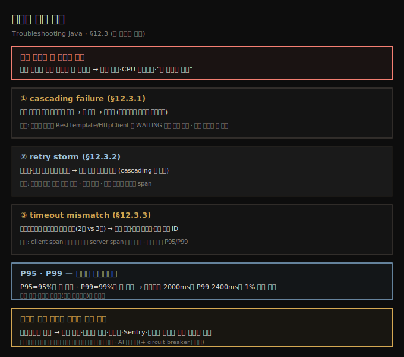
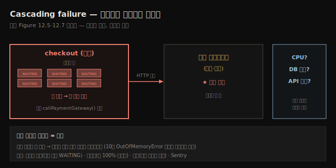
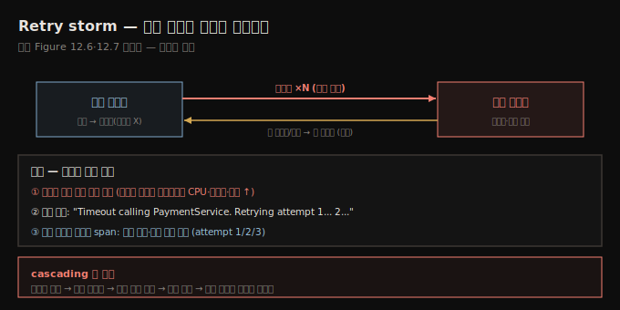
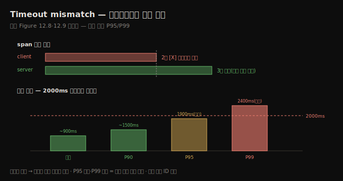

# 시스템 장애 모드 — cascading·retry·timeout
---
> 분산 시스템에서 작은 문제는 큰 문제가 되는데 — 느린 서비스가 상류의 스레드를 막아 도미노로 무너지는 cascading failure, 조율 없는 재시도가 부하를 증폭하는 retry storm, 클라이언트가 서버보다 먼저 포기하는 timeout mismatch — 스레드 덤프·분산 추적·메트릭(P95/P99)으로 *시스템 수준 사고*를 해야 보입니다

이 노트는 『Troubleshooting Java』 12장의 §12.3을 정리합니다 — 책의 마지막 본문입니다. 앞 두 편이 *통신*과 *직렬화*였다면, 이 편은 작은 문제가 시스템 전체로 번지는 **시스템 장애 모드**입니다. 이는 로컬 자바 스택 트레이스의 예외와 달리 또렷이 드러나지 않습니다 — 높아진 지연, CPU 스파이크, 늘어난 에러율, 또는 *겉보기엔 다 도는데 그저 느린* 상태입니다. 네 모드를 봅니다: **cascading failure**(과부하 서비스가 상류를 막음), **retry storm**(동시 재시도가 부하 증폭), **timeout mismatch**(설정 어긋남), **circuit breaker 오작동**(너무 일찍/늦게 작동하거나 회복 못 함).





## 1. Cascading failure — 도미노로 무너진다
> 한 서비스가 느려지면 상류 서비스가 막힌 스레드를 쌓고 연결 풀을 채우다 끝내 크래시하는데 — 망가져서가 아니라 *기다려서* — 스레드 덤프에서 RestTemplate·HttpClient 호출에 WAITING으로 몰린 동일 스택이 스레드 풀 고갈을 가리킵니다

한 서비스가 느려지거나 무응답이면, 상류 서비스가 *막힌 스레드*를 쌓고 연결 풀을 채우다 끝내 크래시합니다 — *망가져서가 아니라 기다려서*입니다. 이것이 cascading failure: 국소 문제가 시스템 전역 장애로 번지는 것입니다.

가장 또렷한 신호는 **스레드 풀 고갈(thread pool exhaustion)**입니다. 스레드 풀은 요청 처리·작업 실행·I/O를 다루는 미리 만든 워커 스레드 모음으로, 매 작업마다 새 스레드를 만드는 비용·위험을 피하고 동시 작업 수를 제한해 시스템을 보호합니다. 그런데 풀의 모든 스레드가 바쁜데 새 작업이 계속 오면 풀이 고갈돼, 들어오는 작업이 막히거나 큐잉되거나 버려져 지연·타임아웃·cascading failure로 이어집니다.

자바 앱(특히 서블릿 컨테이너·블로킹 I/O)은 요청마다 스레드를 점유합니다. 하류 호출이 막히거나 느리면 그 스레드들이 쌓여 기다립니다. **스레드 덤프(8장)**로 감지하는데, 보통 수십~수백 스레드가 같은 HTTP 클라이언트·소켓 읽기·원격 호출에 막혀 `WAITING`·`TIMED_WAITING` 상태입니다. `HttpClient.send()`·`RestTemplate.exchange()`·`WebClient.retrieve()`·gRPC stub 호출 같은 *반복되는 스택 트레이스*를 찾습니다.

```text
// listing 12.4 — cascading 진행 중인 스레드 덤프(발췌)
"http-nio-8080-exec-134" ... java.lang.Thread.State: WAITING (parking)
  - parking to wait for <0x...f0123456> (a java.util.concurrent.CompletableFuture)
  at java.util.concurrent.CompletableFuture.get(...)        ← HTTP 응답 대기
  at org.springframework.web.client.RestTemplate.exchange(...)
  at com.example.service.PaymentService.callPaymentGateway(...)   ← 결제 게이트웨이 호출

"http-nio-8080-exec-135" ... WAITING (parking)   ← 같은 일을 하는 또 다른 스레드
  at ...PaymentService.callPaymentGateway(...)
```

여러 스레드가 *같은 일*(`callPaymentGateway()` 호출)을 하며 HTTP 응답을 기다립니다. 하나의 느린 하류 서비스(결제 게이트웨이)에 다수 상류 스레드가 막히고, 끝내 스레드 풀이 포화돼 — 근본 문제는 하류인데 — 우리 서비스가 실패합니다.

> **에러를 던지는 서비스는 대개 전령일 뿐입니다.** 이는 10장의 `OutOfMemoryError`를 던지는 스레드와 비슷합니다 — 진짜 문제는 더 하류에 있고, *처음 쓰러진 도미노*를 찾을 때까지 사슬을 따라가는 게 일입니다. 메트릭(스레드 풀 사용률 100% 근접·요청 큐 크기·아웃바운드 호출 지연/타임아웃·건강한 서비스의 에러율 급증)과 분산 추적(빠른 서비스에서 시작해 느린 서비스 대기에 시간 대부분을 쓰는 트레이스)이 그림을 완성합니다. Sentry는 첫 경고(예: `SQLTransientConnectionException`·`TimeoutException`)를 실시간으로 띄워 줍니다.





## 2. Retry storm — 회복 장치가 부하를 증폭한다
> 재시도는 복원력을 더하려는 것이지만 백오프·조율 없이 여러 서비스가 같은 실패를 동시에 재시도하면 이미 힘든 서비스를 압도해 피드백 루프를 만드는데 — 트래픽 증가 없는 부하 급증·반복 로그·짧고 촘촘한 재시도 span이 신호입니다

재시도는 일시적 실패(네트워크 결함·일시 무응답)에서 복원을 돕지만, 조심하지 않으면 상황을 악화시킵니다. 여러 클라이언트가 실패한 요청을 — 특히 조율·지연 없이 — 동시에 재시도하면, 이미 힘들어하는 서비스를 압도합니다. 이것이 **retry storm**: 복원력을 높이려던 장치가 전면 장애를 일으키는 피드백 루프입니다.

retry storm은 종종 눈앞에 숨어 있습니다 — 밖에서 보면 높은 부하·예기치 못한 실패 같지만, 안에서는 수백~수천 재시도에 두들겨 맞는 중입니다. 신호와 추적 단서는:

- **트래픽 증가 없는 부하 급증** — 가장 확실한 증상. 사용자 트래픽은 그대로인데 CPU·요청량·지연이 급증하면 내부 서비스가 재시도 중입니다. 메트릭 대시보드(Prometheus/Grafana·Datadog)로 서비스 간 CPU·요청률·에러율을 상관지어, 한 서비스가 실패하는데 다른 서비스가 5배 트래픽 스파이크면 재시도를 처리하는 것입니다.
- **반복 로그** — 동일/유사 페이로드가 짧은 간격으로 반복(`Timeout calling PaymentService. Retrying attempt 1... 2...`).
- **짧은 재시도 span** — 분산 추적에서 *같은 부모·같은 작업*을 반복 호출하는 여러 span이 짧고 촘촘하게 보입니다.

```text
└── [checkout-service] POST /checkout [600ms]
    ├── Call PaymentService attempt 1 [200ms]
    ├── Call PaymentService attempt 2 [180ms]
    └── Call PaymentService attempt 3 [220ms]
```

> **cascading과 retry storm은 결합해 서로를 증폭합니다.** 하류 서비스가 무응답이면 상류가 과하게 재시도하고, 그게 시스템 전역 부하를 증폭해 자원을 고갈시켜 국소 장애를 광범위 장애로 키웁니다. 잘못 설정된 시스템에서 이 둘은 원 문제를 키우는 피드백 루프가 됩니다.





## 3. Timeout mismatch — 클라이언트가 먼저 포기한다
> 클라이언트가 2초 만에 포기하는데 서버는 3초 만에 끝내면 — 서버는 제대로 동작하는데 — 거짓 실패와 낭비 재시도가 나고, 트레이스의 client span은 타임아웃으로 끝나도 server span은 성공으로 계속되며, 평균이 아니라 P95/P99 지연으로 가려야 합니다

클라이언트·서버 간 어긋난 타임아웃 설정은 흔하고 보이지 않는 실패 원천입니다. 클라이언트가 2초 뒤 포기하는데 서버는 3초까지 처리하지 않으면, *거짓 실패*와 낭비 재시도가 납니다. 로그·에러에 또렷이 안 떠 — 일부 요청은 실패하고 일부는 되고, 무작위로 깨지고, *각 서비스는 멀쩡한데 "아무것도 안 됐다"*는 느낌입니다.

분산 추적에서 span 소요를 보면 잡힙니다 — 클라이언트 타임아웃이 2초인데 하류가 ~3초에 응답하면, client span은 2초에 에러/타임아웃으로 끝나는데 server span은 계속 돌아 *성공하지만 들을 사람이 없습니다*.

```text
└── [frontend-service] Call OrderService [2,000ms] [X]   ← 타임아웃 도달
    └── [order-service] ProcessOrder [3,000ms]            ← 성공으로 끝남(아무도 안 들음)
```

확인할 곳은 코드가 아니라 *설정*일 때가 많습니다 — 클라이언트 타임아웃(HTTP/gRPC 클라이언트·DB 연결), 서버 처리 타임아웃(서블릿 컨테이너·컨트롤러·비즈니스 로직 지연). 자바에선 `RestTemplate`/`WebClient` 타임아웃, gRPC `Deadline.after(...)`, Tomcat/Jetty/Spring Boot 서버 타임아웃, 서드파티 API 한도·프록시 설정이 흔합니다. 비동기 메시징(Kafka·RabbitMQ)에선 타임아웃 불일치가 메시지를 큐에 되넣어 *큐가 자라는데*, 이는 높은 트래픽이 아니라 재시도 루프·낡은 요청 처리 낭비를 뜻합니다.

> **평균은 거짓말을 합니다 — P95/P99로 봐야 합니다.** 대부분 빠른데 일부가 극히 느리면 평균이 고통을 숨깁니다. **P95**=95%가 이 시간 이하(나머지 5%는 더 김), **P99**=99%가 이보다 빠름(1%만 느림). 클라이언트 타임아웃이 2000ms인데 P95가 1900ms면 5%가 이미 타임아웃에 부딪고, P99가 2400ms면 1%는 *확정 실패*입니다 — 평균은 멀쩡해 보여도요. P95 급증은 부하에 스케일 못 함(스레드 풀 고갈·느린 쿼리), 배포 후 P99 증가는 특정 코드 경로 회귀, GC 멈춤과 상관된 높은 tail latency는 JVM 튜닝 문제를 가리킵니다.

또 하나의 미묘한 증상은 **중복 요청 ID**입니다 — 클라이언트가 타임아웃됐지만 서버가 계속 일하면, 클라이언트가 같은 요청을 재시도해 같은 작업(같은 `orderId`·`paymentId`)을 여러 번 처리합니다. 타임아웃 전용 에러 메트릭이 5xx 급증 없이 늘면, 서비스는 멀쩡한데 *타임아웃이 너무 공격적*이라는 명확한 신호입니다.





## 4. 시스템 수준 문제엔 시스템 수준 사고
> 분산 시스템 장애는 한곳에서 시작해 다른 곳에 드러나 증상과 근본 원인이 떨어져 있어 로그만으론 부족하고, 분산 추적·구조화 로그·서비스 메트릭·스키마 검증이 기본 진단 도구 세트이며 한 완벽한 도구가 아니라 여러 렌즈로 봐야 합니다

분산 시스템의 트러블슈팅은 좀처럼 단순하지 않습니다. 장애는 한곳에서 시작해 다른 곳에 드러나, 증상이 근본 원인과 동떨어집니다. 이 장에서 본 느린 응답·막힌 스레드·버전 불일치·어긋난 타임아웃이 조용히 서비스를 가로질러 메아리치며 시스템을 망가뜨립니다.

핵심은 **시스템 수준 문제엔 시스템 수준 사고가 필요하다**는 것입니다. 로그만으로는 더 이상 충분치 않습니다. 서비스가 어떻게 통신하는지, 데이터가 큐를 어떻게 흐르는지, 각 작업이 맥락 속에서 얼마나 걸리는지를 이해해야 합니다. 분산 추적·구조화 로그·서비스 메트릭·스키마 검증은 도구일 뿐 아니라 이 규모의 *기본 진단 도구 세트*입니다. 어느 단일 도구도 전체 이야기를 못 합니다 — Jaeger·Zipkin은 요청 경로·병목을, 메트릭은 추세·이상을, 로그는 raw 세부를, Sentry는 예외·런타임 에러를 줍니다. *함께* 쓸 때 흐름·인프라 건강·장애 영향을 잇는 완전한 그림이 됩니다. 트러블슈팅은 한 완벽한 도구가 아니라 *문제를 모든 각도에서 보는 올바른 렌즈 세트*를 갖는 일입니다.

> **AI는 렌즈를 보완합니다.** 현대 지원 시스템은 진화해, AI 비서가 로그 패턴을 짚고(4장) 트레이스 이상을 부각하고 놓친 설정 옵션을 설명할 수 있습니다. 경험을 대체하진 않지만 — 특히 압박 속 복잡한 문제를 헤쳐 나갈 때 — 보완합니다. 시스템이 점점 연결될수록 가시성·관찰가능성·구조화된 조사의 중요성은 계속 커집니다.


## 5. 면접 한 줄 정리
> 시스템 장애 모드의 핵심을 한 문장으로 점검합니다

- **cascading failure란?** 한 서비스가 느려지면 상류가 막힌 스레드를 쌓고 연결 풀을 채우다 — *망가져서가 아니라 기다려서* — 크래시하는 것입니다. 스레드 덤프에서 RestTemplate·HttpClient 호출에 `WAITING`으로 몰린 동일 스택(스레드 풀 고갈)이 신호입니다.
- **에러를 던지는 서비스가 범인인가?** 대개 *전령*입니다. 진짜 문제는 더 하류에 있어, 처음 쓰러진 도미노까지 사슬을 따라갑니다.
- **retry storm이란?** 백오프·조율 없는 동시 재시도가 이미 힘든 서비스를 압도하는 피드백 루프입니다. *트래픽 증가 없는 부하 급증*·반복 로그·짧고 촘촘한 재시도 span이 신호입니다.
- **timeout mismatch란?** 클라이언트가 서버보다 먼저 포기하는 것(2초 vs 3초)입니다. client span은 타임아웃으로 끝나도 server span은 성공으로 계속되고, 중복 요청 ID가 따라옵니다.
- **왜 평균이 아니라 P95/P99인가?** 평균은 소수의 극단을 숨깁니다. P95=95%가 이 이하, P99=99%가 이 이하. 타임아웃 2000ms에 P99가 2400ms면 1%는 확정 실패입니다.
- **시스템 수준 트러블슈팅의 핵심은?** 한 완벽한 도구가 아니라 분산 추적·메트릭·로그·Sentry를 *함께* 쓰는 여러 렌즈입니다. AI는 그 렌즈를 보완합니다.


## 관련 문서
- [이 책 인덱스 (Troubleshooting Java MOC)](./README.md) — 장별 정독 노트 진척
- [직렬화·버전 불일치](./12-02.직렬화·버전%20불일치.md) — 이 편의 전제. 통신·직렬화 문제가 시스템 장애로 번지기 직전
- [스레드 덤프 읽기와 데드락 추적](./08-02.스레드%20덤프%20읽기와%20데드락%20추적.md) — 8장. cascading failure의 스레드 풀 고갈을 스레드 덤프로 읽는 법
- [05_JVM 폴더 인덱스](../README.md) — JVM 정독 노트 네 권의 상위 인덱스
