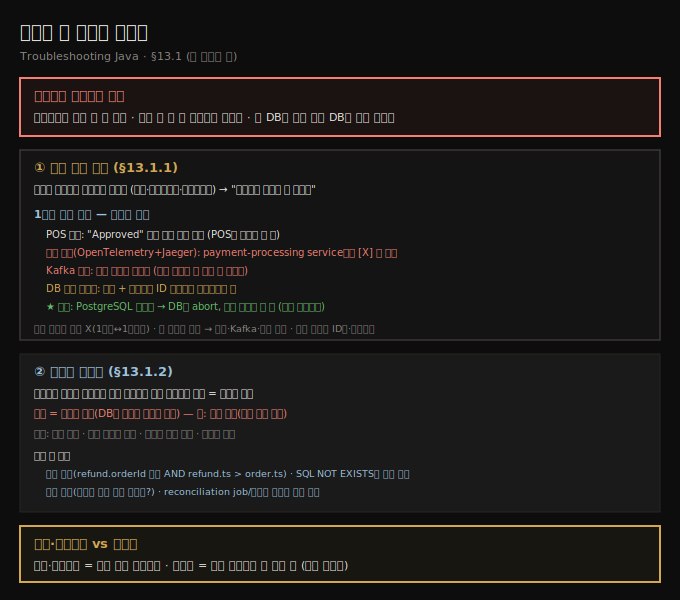
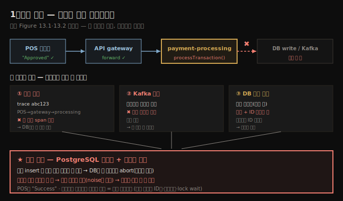

# 서비스 간 데이터 불일치 — 시간 이상과 도메인 불변식
---
> 분산 환경에서 일관성은 움직이는 표적이라 — 주문은 결제됐는데 배송되지 않거나, 한 DB엔 있는데 다른 DB엔 없는 레코드가 *조용히* 생기는데 — 시간 기반 이상(요청은 성공했는데 효과가 안 나타남)과 도메인 불변식(절대 일어나선 안 되는 일)이라는 두 렌즈로 잡습니다

이 노트는 『Troubleshooting Java』 13장의 §13.1을 정리합니다. 12장이 *한 요청*이 서비스를 가로지를 때의 통신·직렬화·장애 모드였다면, 13장은 그 요청들이 남긴 **데이터가 서비스 사이에서 어긋나는** 문제입니다. 완벽한 시스템에선 모든 서비스가 같은 상태를 보고 갱신이 원자적으로 일어나지만, 현실은 그렇지 않습니다 — 서비스는 네트워크로 통신하고 상태를 독립적으로 저장하며, 가끔 트랜잭션에 서로를 초대하는 걸 잊습니다. 그 결과 결제됐는데 배송 안 된 주문, 저장된 적 없는 걸 확인하는 이메일, 한 DB엔 있고 다른 DB엔 없는 레코드가 생깁니다. 이런 버그는 미묘하고 재현하기 어려우며, 종종 새벽 2시에만 나타납니다. 이 편은 그 불일치가 어떻게 *수면 위로* 드러나는지 — 누락 레코드·잘못된 상태 — 와, 시간 기반 이벤트 흐름 분석·도메인 수준 불변식으로 어떻게 진단하는지를 봅니다.





## 1. 시간 기반 이상 — 1유로의 행방
> 요청은 "성공"이라 떴는데 그 효과가 기대한 시간 안에 나타나지 않으면 시간 기반 이상인데 — 파리 화장실의 1유로 결제 누락 사건처럼 — 분산 추적이 끊긴 지점·Kafka 토픽 미발행·DB ID 시퀀스의 의심스러운 갭을 따라가면 조용히 중단된 PostgreSQL 데드락과 재시도 누락에 닿습니다

시간 기반 이상(time-based anomaly)은 이벤트의 *타이밍*이 시스템의 기대 동작·순서에서 벗어나는 것입니다 — 지연, 순서 뒤바뀜, 중복 재시도, 서비스 간 타임스탬프 불일치. 즉시 예외를 던지진 않지만, 더 깊은 조율·일관성 문제의 신호입니다. 분산 시스템에서 시간은 조율 도구이자 혼란의 원천입니다. 서비스는 타임스탬프로 작업 순서를 매기고 지연을 감지하고 상태를 가정하는데, 그 가정이 깨질 때 — 요청은 성공한 듯한데 그 효과가 기대 시간 창 안에 *구현되지 않을* 때 — 십중팔구 시간 기반 이상입니다.

이런 문제를 트러블슈팅할 때 염두에 둘 원칙들이 있고, 저자는 그것이 적용된 한 조사 사례를 들려줍니다.

> **낮은 가치의 이상이라도 절대 무시하지 않습니다.** 불일치가 존재한다면, 같은 실패 모드가 더 높은 가치·미션 크리티컬한 작업에도 닥칠 수 있습니다. 시스템이 1유로를 조용히 잃을 수 있다면 1만 유로도 마찬가지로 잃을 수 있습니다.

사례는 저자의 친구(결제 업계 엔지니어)가 그해 가장 사소해 보이는 티켓을 배정받으며 시작됩니다 — **"누락 트랜잭션 조사. 1유로 누락."** 파리의 어느 공중화장실에서 발생한 1유로 결제였습니다. 농담거리였지만, 경험은 가르칩니다 — 무시하고 싶은 유혹을 이겨야 합니다.

추적은 이렇게 흘렀습니다.

- **POS 단말기 로그** — 고객에게 "Payment Approved"를 보여 줬고, 결제 처리기로 인증 요청을 실제로 보냈습니다. POS는 거짓말하지 않았고, 결제 요청은 *만들어졌습니다*.
- **백엔드 결제 서비스 추적** — 정상이라면 모든 트랜잭션 요청은 처리 큐와 결제 감사 테이블에 레코드를 남깁니다. 그런데 흔적이 *전혀* 없었습니다 — 요청이 POS를 떠난 직후 삼켜진 듯했습니다.

> 이 책에 나오는 시스템 설계는 가공이거나 극도로 단순화한 것입니다. 목적은 소프트웨어 아키텍처 실천을 가르치는 게 아니라 — 트러블슈팅 교육을 단순화할 그림을 주는 것입니다(원문 Figure 13.1: POS가 트랜잭션을 시작하면 감사 후 다른 시스템으로 실행이 넘어가는 흐름).

첫 단계는 **분산 추적**(12장에서 본 OpenTelemetry + Jaeger 기반)이었습니다. POS 요청의 trace ID를 검색했는데, 건강한 트랜잭션이라면 `POS → API gateway → payment processing service → database write`의 전체 트레이스가 보여야 합니다. 그런데 이 경우 트레이스는 **payment-processing service에서 뚝 끊겼고**, 그 아래(downstream) span이 하나도 기록되지 않았습니다.

```text
TraceID: abc123

└── [POS Device] - initiatePayment()      (client send)
    └── [API Gateway] - forwardPayment()   (server receive / client send)
        └── [Payment Processing Service] - processTransaction()
             ✖ No further spans recorded     ← 여기서 끊김
```

교차 검증으로 **Kafka 토픽**을 확인했습니다. payment processing service는 평소 트랜잭션 이벤트를 Kafka 토픽에 발행합니다(Kafka는 분산 이벤트 스트리밍 플랫폼으로, 내구성 있고 파티션 내 순서가 보장되며 확장 가능한 메시지 버스입니다). 그런데 누락된 trace ID에 대응하는 메시지가 *없었습니다*. 이벤트는 단지 지연된 게 아니라 — **메시지 큐에 닿기도 전에 어딘가에서 사라진** 것이었습니다.

> **하나의 도구만으로는 좀처럼 전체 그림이 안 나옵니다.** 추적 데이터·Kafka 토픽 검사·애플리케이션 로그를 *결합*해야 메시지가 시스템을 통과했는지 확인됩니다(원문 Figure 13.2: POS 로그→Kafka 토픽 순으로 확인한 단서들이 문제가 *감사 서비스 쪽*일 가능성을 드러냄). 개별로는 답을 못 주지만 함께 보면 — 요청은 들어와 처리를 시작했으나, 무엇도 영속하거나 큐잉할 만큼 멀리 가지 못했다는 — 분명한 이야기가 됩니다.





span 트리가 payment-processing service 안에서 끝났으니, 다음 볼 곳은 **데이터베이스 계층** — 트랜잭션을 결제 원장에 기록했어야 할 서비스였습니다.

- **감사 테이블 직접 쿼리** — POS 이벤트 타임스탬프 전후의 시간 창으로 조회했습니다. 예상대로 누락 트랜잭션의 엔트리는 없었습니다. 그런데 이상한 게 있었습니다 — **자동 증가 트랜잭션 ID 시퀀스에 의심스러운 갭**이 있었습니다.
- **DB 데드락 로그** — DBA와 협력해 PostgreSQL 로그를 켜고 수집했습니다. 누락 트랜잭션 타임스탬프와 맞아떨어지는 게 나왔습니다:

```text
ERROR:  deadlock detected
DETAIL:  Process 12345 waits for ShareLock on transaction 6789; blocked by process 9876.
         Process 9876 waits for ShareLock on transaction 1234; blocked by process 12345.
HINT:  See server log for query details.
```

같은 테이블에 동시 insert 두 개가 공유 인덱스의 락을 두고 경합한 데드락이었습니다. 데이터베이스는 한 트랜잭션을 중단(abort)해 데드락을 올바르게 해소했지만 — **애플리케이션이 그것을 재시도하지 않았습니다.** 결제 서비스는 DB 실패를 일반 경고(production noise에 쉽게 묻히는)로 로깅했고, 재시도 로직이 없어 데이터를 영속하지도, 에러를 하류에 드러내지도 못했습니다. POS는 "Success"를 봤는데 백엔드는 트랜잭션을 통째로 잃었습니다 — *전형적인 조율 사각지대(coordination blind spot)*입니다.

> **SQL은 어떤 기술의 전문가든 필수 기술입니다.** 어떤 종류의 개발자든 SQL을 배워 두면 좋은 쓸모를 찾습니다 — 이 사례에서 감사 테이블을 직접 쿼리한 것처럼요.

그런데 만약 **데드락 로그가 없었거나 이미 로테이션돼 사라졌다면**? 많은 실무 환경(공격적 보존 정책·제한된 관찰가능성)에선 과거 데드락 추적에 접근 못 합니다. 그럴 땐 *간접 증거*가 핵심이 됩니다 — 자동 증가 ID 시퀀스의 의심스러운 갭이 동시성 문제를 가리키는 첫 단서였고, 동시 insert로 부하를 걸어 재현하면 같은 락 패턴이 드러나며, lock wait time·트랜잭션 롤백 수·트레이스 샘플링 이상 같은 메트릭이 힌트를 줍니다. 로그가 없을 땐 추론·시뮬레이션·남은 부스러기를 조합해 가설을 검증합니다.

이 조사는 사소해 보이는 불일치로 시작했지만 합당한 엄밀함으로 다뤄졌습니다 — 추적·로그·큐 검사·직접 SQL을 결합해 이벤트 흐름을 서비스 경계 너머 DB 계층까지 따라갔고, 첫 누락 레코드에서 멈추지 않고 보이지 않는 데드락을 찾아 *통제된 재현*으로 근본 원인을 검증했습니다. 실무에선 부분 로그·누락 트레이스·지연된 데이터 접근 등 환경이 주는 것으로 일해야 하며 — 핵심은 적응하고, 상관짓고, 끈질긴 것입니다. **효과적 트러블슈팅은 도구만큼이나 임기응변(resourcefulness)의 문제입니다.**


## 2. 도메인 불변식 — 절대 일어나선 안 되는 일
> 바에서 −1잔의 맥주를 주문하는 일처럼 비즈니스 시스템엔 결코 일어나선 안 되는 규칙이 있는데 — 이를 어기면 단순 버그가 아니라 *망가진 비즈니스 현실*이라 — 불변식을 명시(`refund.orderId가 존재 AND refund.timestamp > order.timestamp`)하고 SQL `NOT EXISTS`로 위반을 쿼리하고 reconciliation job으로 주기 스캔합니다

저자는 QA 농담으로 엽니다. QA 엔지니어가 바에 들어가 맥주 1잔을, 0잔을, −1잔을, 99999999잔을, 도마뱀을 주문하고, 돈 안 내고 나가려 합니다. 그러고 *진짜 손님*이 들어와 "여기 영업하나요?"라고 묻자 — 바가 크래시합니다. 비즈니스 시스템엔 −1잔 주문처럼 *결코 일어나선 안 되는* 일이 있습니다(QA 엔지니어에겐 완벽히 유효한 테스트 입력이지만요).

**도메인 불변식(domain invariant)**은 시스템이 아무리 혼란스럽거나 분산돼도 *항상 참이어야 하는 근본 규칙*입니다. 비즈니스 로직의 중력 같은 것으로, 서비스가 크래시하거나 재시도가 일어나거나 메시지가 순서 뒤바뀌어 도착해도 일관되게 유지돼야 하는 비즈니스 진실입니다. 불변식이 깨지면 **잘못된 상태(invalid state)** — DB엔 기술적으로 존재할 수 있지만 현실에선 말이 안 되는 조건 — 가 됩니다. 결제가 주문 없이 완료되거나, 미래 생년월일을 가진 사용자처럼요. 분산 시스템을 비행기에 비유하면, 매 비행 전 엔지니어가 연료·엔진 센서·기내 압력 같은 모든 컴포넌트 상태를 체크리스트로 확인하는데 — 불변식이 그 역할입니다. 다만 항공과 달리 분산 시스템에선 *이미 이륙한 뒤에야* 뭔가 빠진 걸 알게 될 수 있습니다.

불변식 위반은 보통 **경쟁 조건(race condition)**, **최종 일관성(eventual consistency) 지연**, 또는 서비스 로직의 **방어적 검사 부족**에서 옵니다. 분산 시스템에선 데이터가 항상 기대 순서로 도착하지 않습니다 — 메시지가 지연·재시도·순서 뒤바뀜으로 처리됩니다. 예를 들어 환불 이벤트가 *참조하는 주문이 DB에 기록되기 전에* 처리될 수 있습니다 — 단지 한 메시지 큐가 일시적으로 더 빨랐다는 이유로요. 또 다른 원인은 **서비스 경계를 넘는 트랜잭션 보장 부족**입니다 — 여러 서비스/DB에 걸친 작업은 부분 완료 상태에 빠지기 쉽고, 한 서비스가 메시지 발행 후 자기 상태 커밋 전에 실패하면 소비자가 불완전한 맥락으로 진행합니다. 약한 에러 처리·멱등성(idempotency) 제어 부재가 더해지면 고아 엔티티·잘못된 참조·모순된 상태가 나옵니다.

저자가 드는 고전적 예는 **유령 환불**입니다 — DB상 *존재한 적 없는* 주문에 환불이 발행됩니다. 결제 레코드도 주문 레코드도 없이, 환불만 시스템에 유령처럼 떠다닙니다. "환불은 항상 유효하고 완료된 주문에 연결돼야 한다"는 불변식 위반입니다. 환불 마이크로서비스가 큐에서 이벤트를 독립적으로 소비하는데, 주문 생성이 완전히 영속되기 전에 — 지연·재시도·순서 뒤바뀜으로 — 환불 이벤트가 먼저 수신되면 환불이 그냥 처리돼 불변식을 깹니다.

저자가 권하는 대응은:

- **불변식을 명시적으로 정의** — 도메인 모델이나 모니터링 계층에 `refund.orderId must exist AND refund.timestamp > order.timestamp`처럼 적습니다. 무엇을 찾는지 분명히 알게 됩니다.
- **DB에서 위반을 쿼리** — DB를 데이터의 단일 진실 원천으로 취급해 의심 사례를 SQL로 찾습니다:

```sql
SELECT * FROM refunds r
WHERE NOT EXISTS (
  SELECT 1 FROM orders o WHERE o.id = r.order_id
);
```

- **추적 상관**(12장) — 환불 흐름이 대응 주문 흐름이 완료되기 *전에* 트리거됐는지 봅니다. 누락·어긋난 span이 큰 단서입니다.
- **reconciliation job·일관성 체커** — 주문 없는 환불 같은 깨진 관계를 정기 스캔하는 배치 프로세스나 경량 검증 서비스를 둡니다.

> **도메인 불변식은 검증 규칙 이상입니다.** 로그·트레이스가 *무슨 일이 일어났는지* 말한다면, 불변식은 *결코 일어나선 안 되는 것*을 말합니다. 이 규칙을 시스템에 인코딩하고 위반을 능동적으로 스캔하면, 그러지 않으면 묻혔을 숨은 불일치를 잡는 강력한 도구가 됩니다. 분산 아키텍처에선 이벤트 순서나 서비스 간 원자성을 항상 통제할 순 없지만 — 비즈니스를 정의하는 규칙의 *선은 지킬 수 있습니다*.


## 3. 면접 한 줄 정리
> 서비스 간 불일치 진단의 핵심을 한 문장으로 점검합니다

- **시간 기반 이상이란?** 이벤트 타이밍이 기대에서 벗어나는 것(지연·순서 뒤바뀜·중복 재시도·타임스탬프 불일치)입니다. 즉시 예외는 안 나도 — 요청은 "성공"인데 효과가 기대 시간에 안 나타나면 — 더 깊은 조율 문제의 신호입니다.
- **1유로 사건에서 무엇을 배우나?** 낮은 가치 이상도 무시하지 않습니다(1유로를 잃으면 1만 유로도 잃습니다). 트레이스 끊김·Kafka 미발행·DB ID 시퀀스 갭을 따라가 *재시도 없이 조용히 중단된 PostgreSQL 데드락*에 닿았습니다.
- **로그가 로테이션돼 사라졌으면?** 간접 증거로 갑니다 — ID 시퀀스 갭, 동시 insert 부하 재현, lock wait time·롤백 수 메트릭. 추론·시뮬레이션·남은 부스러기를 조합합니다.
- **도메인 불변식이란?** 시스템이 아무리 분산돼도 항상 참이어야 하는 비즈니스 규칙("환불은 항상 유효한 주문에 연결")입니다. 위반=잘못된 상태(DB엔 있지만 현실엔 없는).
- **불변식 위반은 왜 생기나?** 경쟁 조건·최종 일관성 지연·방어적 검사 부족입니다 — 환불 이벤트가 주문 영속 전에 처리되는 식으로요.
- **어떻게 잡나?** 불변식을 명시 정의 → SQL `NOT EXISTS`로 위반 쿼리 → 추적 상관으로 순서 확인 → reconciliation job으로 주기 스캔.


## 관련 문서
- [이 책 인덱스 (Troubleshooting Java MOC)](./README.md) — 장별 정독 노트 진척
- [분산 추적 — trace ID와 span](./12-01.분산%20추적%20—%20trace%20ID와%20span.md) — 12장. 이 편의 추적 끊김·span 상관의 토대
- [다단계 트랜잭션 추적 — 감사 로그와 이벤트 재생](./13-02.다단계%20트랜잭션%20추적%20—%20감사%20로그와%20이벤트%20재생.md) — 다음 편. 불일치를 *재구성*하는 감사 로그·이벤트 재생
- [05_JVM 폴더 인덱스](../README.md) — JVM 정독 노트 네 권의 상위 인덱스
