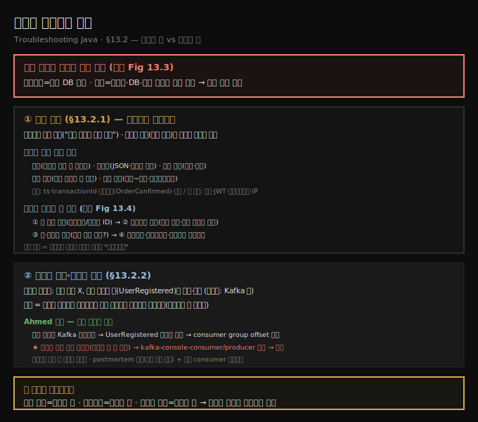
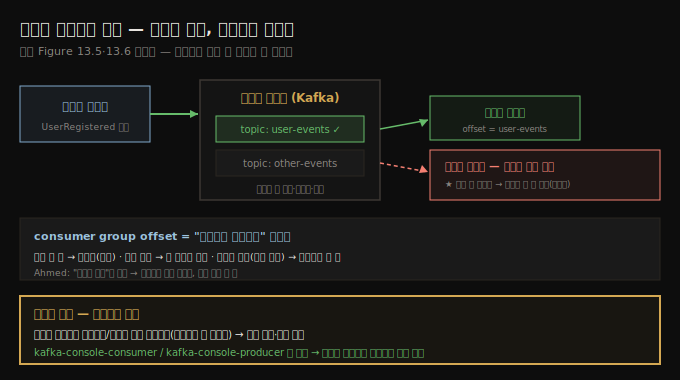

# 다단계 트랜잭션 추적 — 감사 로그와 이벤트 재생
---
> 모놀리스의 트랜잭션은 보통 단일 DB 커밋이지만 분산 시스템에선 수십 단계가 서비스·DB·큐에 걸쳐 흩어지는데 — 트레이스·로그·이벤트·감사 레코드를 *이어 붙여* 전체 그림을 복원합니다 — *기록된 것*을 말하는 감사 로그와 *소통된 것*을 말하는 이벤트 로그라는 두 렌즈로 잡습니다

이 노트는 『Troubleshooting Java』 13장의 §13.2를 정리합니다. 앞 편(§13.1)이 불일치가 *어떻게 드러나는지*를 봤다면, 이 편은 그 불일치를 일으킨 **다단계 트랜잭션을 사후에 재구성**하는 포렌식 디버깅입니다. 다단계 트랜잭션을 추적·상관(track and correlate)한다는 것은, 하나의 논리적 비즈니스 활동을 이루는 개별 작업들이 여러 서비스·DB·메시지 큐에 걸쳐 있어도 그것들을 관찰하고 식별하고 연결하는 일입니다. 모놀리스에선 트랜잭션이 종종 단일 DB 커밋이지만, 분산 시스템에선 느슨히 연결된 컴포넌트들에 걸친 수십 단계일 수 있습니다(원문 Figure 13.3: 단일 프로세스 트랜잭션 vs 분산 트랜잭션 — 후자가 불일치·도메인 불변식 위반으로 이어짐). 그 단계들을 상관지으려면 트레이스·로그·이벤트·감사 레코드를 이어 붙여 *무슨 일이 어디서 잘못됐는지*를 재현해야 합니다. 두 가지 핵심 렌즈를 봅니다 — 각 단계에서 *무엇이 기록됐는지*를 보는 감사 로그 검토, 그리고 단계가 건너뛰거나 지연·손상됐는지를 보는 이벤트 로그 분석입니다.





## 1. 감사 로그로 트랜잭션 단계 재구성
> 감사 로그는 "결제 승인"·"주문 확정"처럼 시스템이 취한 *중요한 비즈니스 동작*을 기록한 구조화된 레코드인데 — 4장의 디버그 로그가 "자기 자신과의 대화"라면 감사 로그는 "나는 무엇을 언제 했다"는 바깥을 향한 기록이라 — 불변·구조화·쿼리 가능·중앙 저장·장기 보존의 다섯 성질을 갖춰 다단계 워크플로의 이야기를 재구성합니다

감사 로그(audit log)는 "payment authorized"·"order confirmed"·"user account created"처럼 시스템이 취한 의미 있는 동작의 구조화된 레코드입니다. 디버그/트레이스 로그와 달리 *비즈니스 중심*입니다 — 무엇이, 언제, 어떤 데이터로 일어났는지에 답하려는 것입니다. 규제 산업이나 고무결성 시스템에서 특히 값집니다. 트랜잭션을 재구성하려면 이 감사 엔트리들을 살펴 서비스에 걸친 정확한 단계 순서를 짜 맞춥니다 — 열쇠를 잃고 들렀던 방을 하나씩 되짚는 것처럼요.

4장에서 좋은 로깅을 *체스 기보*에 비유했습니다 — 진지한 체스 선수는 매 수를 적어, 일어난 일을 증명할 뿐 아니라 배우고 분석하고 나중에 설명합니다. 감사 로깅이 바로 그것입니다 — 시스템이 line-by-line 디버깅이 아니라 *큰 그림*을 위해 자기 "수"를 적어 두는 것입니다. 4장이 다룬 **디버그 로그가 "자기 자신과의 대화"**(로컬 로직·에러·실행 경로를 따져 보는)라면, **감사 로그는 바깥을 향한 기록**입니다 — "내가 한 일은 이것이고, 한 시각은 이때다."

> **감사 로그가 "충분히 좋으려면" 다섯 성질을 갖춥니다.** 핵심 비즈니스 동작을 잡되 저수준 구현 노이즈는 빼고, 좋은 엔트리는 타임스탬프·고유 트랜잭션/비즈니스 ID·명확한 동작 라벨(예: `OrderConfirmed`)·결과(success/failed/rejected)를 담습니다.
>
> - **불변(immutable)** — 한번 쓰면 절대 변경·삭제하지 않습니다(회의록을 사후에 고치지 않듯). 수정이 필요하면 원본을 참조하는 *새 엔트리*로 기록합니다.
> - **구조화(structured)** — 일관된 기계 판독 형식(보통 JSON·로그 스키마)을 따라, `userId`·`transactionId`·`status` 같은 필드로 거르게 합니다(취약한 텍스트 매칭에 기대지 않고).
> - **쿼리 가능(queryable)** — 효율적 검색·필터·집계가 되게 저장합니다("오늘 발행된 환불 수"·"12:00~12:15 사이 실패한 트랜잭션"에 수동 스캔 없이 답).
> - **중앙 저장(stored centrally)** — 개별 서비스 인스턴스·로컬 머신에만 두지 않고 중앙 플랫폼에 모읍니다 — 노드가 죽어도 잃지 않고, 멀티서비스 워크플로를 재구성하고, 타임스탬프·트랜잭션 ID로 상관짓게요.
> - **장기 보존(retained long-term)** — 즉시 트러블슈팅만이 아니라 지연된 실패·고객 분쟁·컴플라이언스를 위해 디버그 로그보다 훨씬 오래(수주~수년) 보관합니다(조사 중에 보안 카메라 영상을 태우지 않듯).

감사 로그는 *다른 누군가가 나중에 이걸 의지해 무슨 일이 있었는지 이해할 것*이라 가정하고 씁니다. 모범 사례를 따른 예(원문 listing 13.1):

```json
// listing 13.1 — 모범 사례를 따른 감사 로그
{
  "timestamp": "2025-04-28T13:12:04Z",
  "event": "OrderPlaced",
  "transactionId": "TXN-324791",
  "orderId": "ORD-98231",
  "userId": "USR-49384",
  "status": "success",
  "totalAmount": 129.90,
  "currency": "EUR",
  "source": "checkout-service"
}
```

때로는 유용한 맥락을 주면서도 민감 데이터는 마스킹·생략해 보안·프라이버시 표준(GDPR·PCI-DSS 등)을 지켜야 합니다(원문 listing 13.2: 카드 번호 일부를 `XXXX XXXX XXXX 4821`로 가려 보안상 제거). 반대로 *이렇게는 하지 말라*는 예(원문 listing 13.3)도 짚어 둡니다 — 비밀번호 평문(`"password": "hunter2"`), 재사용 가능한 JWT 토큰, 네트워킹 내부를 드러낼 IP 주소, 감사를 오염시키는 스택 트레이스, 비구조화 텍스트(`"notes": "User logged in using Chrome on Windows 10"`)를 담는 것입니다.

**이야기를 재구성하는 네 단계**(원문 Figure 13.4)는 이렇습니다.

1. **첫 동작 검색** — 트랜잭션/사용자 ID로 감사 로그를 찾아, 사건과 관련된 *첫 알려진 동작*(결제 시도·주문 생성·로그인 요청)을 봅니다.
2. **타임라인 추적** — 감사 로그는 주요 결정 지점(요청 수신·결제 승인·레코드 영속·이메일 발송)에 쓰입니다 — 어느 단계가 시도됐고 성공했는지 고수준 뷰를 줍니다(보안 카메라처럼). 분산 시스템에선 클럭이 완벽히 동기화 안 돼 타임스탬프가 약간 어긋날 수 있음에 유의합니다.
3. **갭·불일치 찾기** — 대응 구매 없는 환불이 발행됐나? 배송 전 재고 예약처럼 *항상 일어나야 할* 단계를 건너뛰었나? 깨진 워크플로·경쟁 조건·누락 이벤트의 신호로, 고객이 알아채기 한참 전에 드러냅니다.
4. **다른 신호와 교차 검증** — 이벤트 로그·분산 트레이스·시스템 메트릭과 대조합니다. 감사 로그는 내부 스택 트레이스·메모리 에러는 안 보여 주지만 — *시스템이 자기가 무엇을 하고 있다고 생각했는지*를 말해 주며, 조용한 실패를 쫓을 때 그게 가장 중요한 단서일 때가 많습니다.

> **감사 로그는 시스템의 블랙박스입니다.** 잃은 트랜잭션을 추적하든, 불완전한 워크플로를 디버깅하든, 시스템이 기대대로 동작하는지 검증하든 — 가장 신뢰할 수 있는 진실 원천 중 하나입니다. 비행 기록 장치처럼 다룹니다 — 크래시만을 위한 게 아니라, 길이 분명하지 않을 때 복잡성을 이해하기 위한 것입니다.


## 2. 이벤트 재생과 이벤트 로그 — 누락 메시지 추적
> 이벤트 드리븐 아키텍처에선 서비스가 서로를 직접 호출하지 않고 이미 일어난 일을 나타내는 이벤트를 발행·반응하는데 — 로그가 *한 서비스가 한 일*을 말한다면 이벤트 로그는 *시스템이 소통한 것*을 말하라 — 기록된 메시지를 다시 흘려보내는 이벤트 재생과 consumer group offset 검사로, Ahmed가 잘못된 토픽을 듣던 이메일 서비스를 잡아냅니다

많은 경우 **이벤트 드리븐 아키텍처(event-driven architecture)**를 다룹니다 — 서비스가 서로를 직접 호출하지 않고 이벤트를 발행·반응해 통신합니다. 이벤트(event)는 이미 *일어난 일*을 나타내는 메시지입니다(`UserRegistered`·`PaymentProcessed`·`InventoryReserved`). 보통 Kafka·RabbitMQ·AWS SQS 같은 메시지 브로커로 보내지고 다른 서비스가 집어 반응합니다(원문 Figure 13.5: 브로커가 여러 서비스가 교환하는 메시지를 관리). 이 맥락에서 메시지(message)는 이벤트를 실어 나르는 실제 데이터 패킷으로, 보통 JSON 같은 구조화 형식이며 타임스탬프·ID·토픽 이름 같은 메타데이터를 포함합니다. **로그가 *개별 서비스가 무엇을 했는지*를 말한다면, 이벤트 로그는 *시스템이 무엇을 소통했고* 서비스가 그에 어떻게 반응했는지를 말합니다.**

**이벤트 재생(replaying events)**(원문 Figure 13.6: 개발자가 특정 시나리오를 트러블슈팅하려 이벤트를 재생)은 이벤트 로그에 이미 기록된 메시지를 시스템에 다시 흘려보내는 것입니다 — 보통 스테이징·테스트 환경으로 — 워크플로를 재트리거하려고요. 누락·순서 뒤바뀜 동작을 디버깅하는 데 큰 도움이 됩니다. 예를 들어 어떤 서비스가 확인 이메일을 못 보냈으면, `UserRegistered` 이벤트를 재생해 문제가 재현되는지, 이메일 서비스가 올바르게 소비하는지 봅니다. 재생은 *실제 사용자·데이터를 건드리지 않고* 가정을 검증하고 실패 시나리오를 격리하게 합니다. 이벤트 로그를 검사하면 다음을 식별할 수 있습니다 — 이벤트가 *애초에* 발행됐는지, 언제·어느 서비스가 발행했는지, 소비됐다면 누가 언제 했는지, 처리 실패로 드롭·지연·dead-letter됐는지.

저자는 **Ahmed의 사건**을 들려줍니다. 사용자 온보딩 팀의 개발자 Ahmed가 당혹스러운 버그를 조사합니다 — 여러 사용자가 계정 가입에 성공했는데 환영 이메일을 받지 못했습니다. `UserRegistered` 이벤트는 감사 로그에 떴고 사용자는 DB에 존재하는데, 이메일 서비스가 트리거되지 않았습니다.

- **코드로 바로 뛰어들지 않고 Kafka 이벤트 로그부터** — `user-events` 토픽을 관련 사용자 ID로 필터해, `UserRegistered` 이벤트가 올바른 데이터로 *발행됐음*을 확인했습니다. 여기까지 정상이었습니다 — 이벤트는 보내졌는데 그 *아래에서* 뭔가 잘못된 것입니다.
- **consumer group offset 확인** — consumer group offset은 Kafka에서 소비자가 토픽을 어디까지 진행했는지 가리키는 포인터입니다. 서비스가 토픽에서 메시지를 읽을 때 *consumer group*(같은 스트림을 함께 처리하는 소비자 집합)의 일부로 읽고, Kafka가 각 소비자에 토픽 일부(파티션)를 배정하며, 메시지를 읽을 때마다 소비자가 offset(="#12345까지 처리했다"는 책갈피)을 갱신합니다. offset이 갱신 안 되면 메시지를 재처리(로직에 따라 득실), 너무 앞서면 앞 메시지를 놓치고, 완전히 틀리면(다른 토픽/파티션을 가리키면) *아무것도 못 봅니다*.

Ahmed는 그 서비스가 *최근 배포 중 잘못된 Kafka 토픽을 듣도록 잘못 설정*돼 이벤트를 *전혀 본 적이 없음*을 알아냈습니다. 메시지는 잃은 게 아니라 — 그냥 소비되지 않은 채 거기 있었던 것입니다. Ahmed는 올바른 토픽 설정으로 로컬 테스트 환경을 꾸려 문제를 안전하게 검증·수정하고, Kafka 로그에서 놓친 이벤트를 *재생*했습니다 — `kafka-console-consumer`와 `kafka-console-producer` 도구를 써서요. 이메일 서비스가 기대대로 집어 이메일을 올바르게 보냈습니다. 문제 확인, 수정 검증 완료. Ahmed는 문제와 재생 과정을 설명하는 **postmortem**을 쓰고, 앞으로 지연·유휴 consumer group을 모니터링할 대시보드 메트릭을 추가했습니다.

> **postmortem은 무엇이 잘못됐고 어떻게 고쳤고 재발 방지로 무엇을 할지 적은 사건 요약입니다** — *비난 보고서가 아니라 학습 도구*입니다.

> **특정 기술은 트러블슈팅을 단순화할 내장 도구를 함께 줍니다.** 기술을 배우고 그것이 제공하는 검사·테스트·디버깅 도구에 익숙해지는 게 모범 사례입니다. Kafka의 `kafka-console-producer`·`kafka-console-consumer`는 이벤트 재생·메시지 검사·소비자 동작 검증에 값집니다. Ahmed에게 배울 점은 — 코드로 너무 일찍 뛰어들면 막연한 추측이 되니 *관찰 가능한 증거(감사/이벤트 로그)부터*, 이벤트 로그는 메시지가 보내졌는지·언제·어떤 데이터로인지를 애플리케이션 로그보다 안정적으로 확인, 스테이징/로컬로 *라이브 데이터를 안 건드리고* 재현·수정 확인, Kafka 같은 기술의 CLI 도구로 코드 추가 없이 토픽 검사·이벤트 재생, 그리고 이론에 멈추지 말고 *재생해 결과가 기대대로인지* 확인하는 것입니다.





## 3. 면접 한 줄 정리
> 다단계 트랜잭션 추적의 핵심을 한 문장으로 점검합니다

- **다단계 트랜잭션 추적·상관이란?** 하나의 논리적 비즈니스 활동을 이루는 작업들이 여러 서비스·DB·큐에 걸쳐도 관찰·식별·연결하는 것입니다. 모놀리스의 단일 DB 커밋과 달리, 트레이스·로그·이벤트·감사 레코드를 이어 붙여 복원합니다.
- **감사 로그 vs 디버그 로그?** 디버그 로그는 "자기 자신과의 대화"(로컬 로직)이고, 감사 로그는 바깥을 향한 비즈니스 기록("나는 무엇을 언제 했다")입니다 — 시스템의 블랙박스.
- **좋은 감사 로그의 다섯 성질은?** 불변·구조화(JSON)·쿼리 가능·중앙 저장·장기 보존. 타임스탬프·트랜잭션 ID·동작 라벨·결과를 담고, 비밀번호·토큰·스택 트레이스는 담지 않습니다.
- **이야기 재구성 네 단계는?** 첫 동작 검색 → 타임라인 추적 → 갭·불일치 찾기 → 다른 신호(이벤트 로그·트레이스·메트릭)와 교차 검증.
- **로그 vs 트레이스 vs 이벤트 로그?** 감사 로그=무엇이 *기록됐나*, 트레이스=무엇이 *실행됐나*, 이벤트 로그=무엇이 *소통됐나*. 셋을 상관지어 의도와 효과의 불일치를 잡습니다.
- **이벤트 재생이란?** 기록된 메시지를 스테이징/로컬에 다시 흘려보내 워크플로를 재트리거하는 것입니다. Ahmed는 `kafka-console-consumer`/`producer`로 재생해, 잘못된 토픽을 듣던 이메일 서비스(consumer offset이 엉뚱한 곳)를 잡았습니다.


## 관련 문서
- [이 책 인덱스 (Troubleshooting Java MOC)](./README.md) — 장별 정독 노트 진척
- [서비스 간 데이터 불일치 — 시간 이상과 도메인 불변식](./13-01.서비스%20간%20데이터%20불일치%20—%20시간%20이상과%20도메인%20불변식.md) — 앞 편. 이 편이 재구성하는 *불일치*가 어떻게 드러나는지
- [일관성 측정 — 체크섬·해시와 reconciliation](./13-03.일관성%20측정%20—%20체크섬·해시와%20reconciliation.md) — 다음 편. 재구성을 넘어 *지속적 측정*으로
- [로그로 조사하기](./04-01.로그로%20조사하기.md) — 4장. 디버그 로그의 토대(체스 기보 비유·과거vs현재)
- [05_JVM 폴더 인덱스](../README.md) — JVM 정독 노트 네 권의 상위 인덱스
