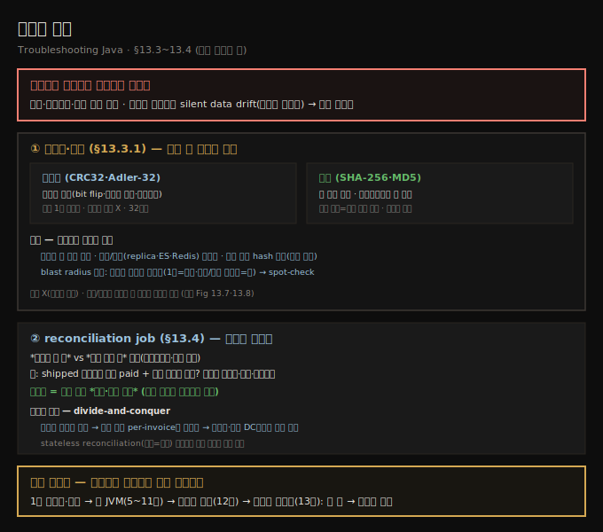
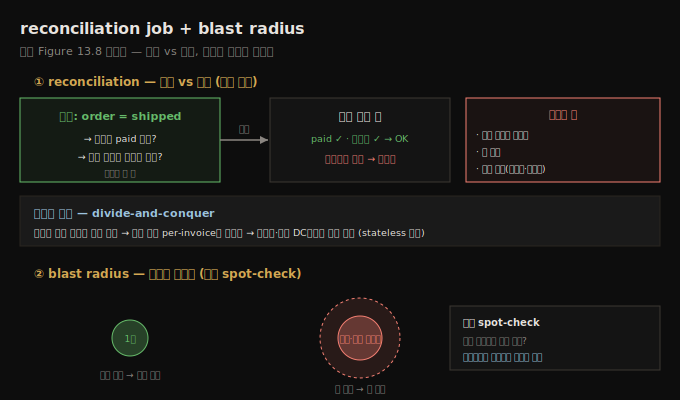

# 일관성 측정 — 체크섬·해시와 reconciliation
---
> 분산 시스템에서 일관성은 기본으로 보장되지 않아 — 겉보기엔 건강해도 동기화돼야 할 레코드가 서서히 어긋나는 *silent drift*가 일어나므로 — 측정·모니터링·능동 강제해야 하는데, 전체 데이터를 옮기지 않고 체크섬·해시로 무결성을 검증하고 reconciliation job으로 기대 상태와 실제 상태를 주기 비교합니다

이 노트는 『Troubleshooting Java』 13장의 §13.3과 §13.4를 정리합니다 — **이 책의 마지막 절**입니다. 앞 두 편이 이미 일어난 불일치를 *진단·재구성*했다면, 이 편은 불일치가 조용히 자라기 전에 *지속적으로 측정·모니터링*하는 장기 가시성입니다. 일관성(consistency)은 시스템의 모든 부분이 같은 데이터에 동시에 동의하는 것입니다 — 한곳을 갱신하면 그 갱신이 곧바로 다른 모든 곳에 나타나야 합니다(누락·낡음·모순 없이). 한 계좌에서 다른 계좌로 송금하면 양쪽 잔액이 즉시 변화를 반영해야 하며, 한쪽만 새 금액을 보이면 일관성 문제입니다(원문 Figure 13.7: 계좌 잔액이 올바른 금액을 반영하지 못함). **분산 시스템에서 일관성은 기본으로 절대 보장되지 않습니다** — 측정하고 모니터링하고 능동적으로 강제해야 합니다. 겉보기엔 건강해도 *silent data drift* — 동기화돼야 할 레코드가 서비스·DB에 걸쳐 서서히 어긋나는 것 — 를 겪을 수 있습니다. 대부분의 production 환경은 이 불일치를 자동으로 드러내도록 설계돼 있지 않아, 데이터 불일치·누락 관계·최종 일관성 지연을 *실제 비즈니스 문제가 되기 전에* 감지하는 *자기만의 안전망*을 만들어야 합니다.





## 1. 체크섬·해시로 데이터 무결성 검증
> 데이터 무결성은 생성부터 삭제까지 데이터가 정확·일관·신뢰 가능하게 유지되는 것인데 — 전체 데이터를 옮기거나 행마다 비교하지 않고 검증하려면 — 우발적 오류를 빠르게 잡는 체크섬(CRC32·Adler-32)과 한 방향 함수로 더 강하게 비교하는 해시(SHA-256·MD5)를 써, 양쪽에서 계산해 비교하면 무엇이 어디서 바뀌었는지 빠르게 짚습니다

데이터 무결성(data integrity)은 데이터가 *생애 주기 전체*(생성부터 삭제·아카이브까지)에 걸쳐 정확·일관·신뢰 가능하게 유지되는 것입니다. 분산 시스템에선 서비스·DB·환경에 걸쳐 저장·전송된 데이터가 손상 없이 완전하게, 진실 원천과 동기화돼 유지되는 것입니다. 이를 효율적으로(특히 시스템 경계를 넘어) 검증하는 한 방법이 **체크섬(checksum)·해시(hash)**입니다.

**체크섬**은 특정 알고리즘으로 더 큰 데이터 블록에서 계산한 작은 고정 크기 값입니다. 주 목적은 저장·전송·처리 중 일어날 수 있는 *우발적 오류·손상*을 감지하는 것입니다. 암호학적 해시와 달리 의도적 변조에 안전하도록 설계되진 않았고 — bit flip·불완전 쓰기·네트워크 결함 같은 *비의도적* 문제를 잡는 빠르고 효율적인 도구입니다. 흔한 알고리즘은 **CRC32(Cyclic Redundancy Check)**·**Adler-32**로, 원본 데이터의 작은 수치 표현(보통 32비트)을 만듭니다. 단순하고 성능에 최적화돼 실시간 시스템·파일 형식·네트워크 프로토콜에 이상적입니다.

기본 아이디어는 — 데이터를 처음 생성·전송할 때 체크섬을 계산해 데이터와 함께 저장·전송하고, 나중에 읽거나 받을 때 다시 계산해 원본과 비교합니다. 값이 맞으면 데이터가 온전하다고 가정하고, 안 맞으면 변경·손상됐다는 신호입니다. 파일 다운로드 사이트에서 흔히 봅니다:

```text
File: file.exe
CRC32 Checksum: A12F3B4C
```

다운로드 후 받은 파일의 CRC32를 다시 계산해 `A12F3B4C`와 맞으면 올바르게 받은 것이고, 안 맞으면 네트워크 결함·디스크 에러 등으로 뭔가 잘못됐으니 버리거나 다시 받습니다. 완벽하진 않지만(드물게 다른 데이터가 같은 체크섬을 낼 수 있음) — *우발적* 무결성 문제에 대한 빠른 1차 방어선입니다.

**해시**는 암호학적으로 더 강한 변형입니다. 임의 입력(레코드·페이로드)을 고정 크기 문자열(SHA-256·MD5 다이제스트)로 바꾸는 *한 방향(one-way) 함수*입니다. 두 시스템이 같은 입력에 같은 해시를 내면 데이터가 동일하다는 강한 표시이고, 해시가 다르면 — 무엇이 바뀌었는지는 아직 몰라도 — 뭔가 바뀌었음을 압니다.

서비스·시스템 간 일관성 문제를 트러블슈팅할 때, 체크섬·해시는 전체 페이로드를 비교하거나 모든 행을 수동 검사하지 않고 *무엇이 어디서 잘못됐는지* 빠르게 짚게 합니다. 쓰임은:

- **서비스 간 전송 검증** — 결제 처리기에서 회계 시스템으로 데이터가 옮겨질 때, 양쪽에서 해시를 계산해 비교하면 전송 중 변했는지 빠르게 감지합니다(모든 필드를 수동 검사 못 해도). 크고 민감한 데이터셋에 특히 유용합니다.
- **복제·캐싱 계층 일관성** — read replica·Elasticsearch 인덱스·Redis 캐시는 주 데이터 원천과 쉽게 어긋납니다. 양 끝에서 해시를 계산하면 읽히는 것이 쓰인 것과 맞는지 *싸고 빠르게* 확인합니다.
- **감사 로그·메타데이터에 해시 포함** — 레코드를 처음 쓸 때 핵심 비즈니스 필드의 해시를 로깅해 두면, 나중에 디버깅·포렌식에서 다시 계산해 데이터가 도중에 우발적으로 변경됐는지 — *민감/대용량 데이터를 로깅하지 않고도* — 확인합니다:

```json
// §13.3.1 — 감사 로그 메시지에 핵심 필드 해시를 포함
{
  "timestamp": "2025-04-28T15:03:41Z",
  "event": "InvoiceCreated",
  "invoiceId": "INV-842001",
  "userId": "USR-33991",
  "amount": 249.99,
  "currency": "USD",
  "hash": "f9a8d6c35d2a4e0caa8f410bcf4e7a91a18ec50b2…",
  "source": "billing-service"
}
```

누군가 나중에 다른 곳(하류 시스템·지원 DB)에서 충돌하는 invoice 레코드를 찾으면, 그 버전을 해시해 원본 감사 로그와 비교하면 됩니다 — 전체 필드를 노출·비교하지 않고요. 변조·예기치 못한 변경이 있으면 해시 불일치가 명확한 신호가 됩니다.

마지막으로 사건 대응 시 해시는 데이터 문제의 **blast radius**(폭발 반경)를 가늠하게 합니다(원문 Figure 13.8: 문제가 시스템 전체에 미친 영향을 보는 방법). blast radius는 "이 문제가 얼마나 나쁘고 얼마나 퍼졌나"를 묻는 방식입니다 — 작은 버그가 DB의 한 레코드를 손상시키면 작은 반경, 같은 버그가 수천 레코드·여러 시스템에 미치면 훨씬 큰 반경입니다. 사건 중 반경을 파악하면 심각도를 판단합니다 — 한 항목의 빠른 수정인가, 시스템 전체의 큰 복구인가. 다른 레코드도 같은 문제인지 해시로 확인하면, 일회성인지 도처에 있는지 빠르게 봅니다. 불일치가 단일 불량 레코드인지 시스템적 실패인지 모를 때, 시스템 간 해시를 *spot-check*하면 문제가 격리됐는지 광범위한지 빠르게 드러나 — 어디를 볼지, 얼마나 급히 대응할지 안내합니다.


## 2. Reconciliation job — 기대 vs 실제 상태 비교
> reconciliation job은 *있어야 할 것*과 *실제 있는 것*을 비교하는 백그라운드 프로세스인데 — 배송된 모든 주문에 청구 시스템의 대응 항목이 있는지처럼 — 일관성을 가정이 아니라 *지속적으로 측정·검증할 대상*으로 다루는 마지막 방어선이며, 계층적·청크 해시의 divide-and-conquer로 수백만 레코드에서도 성능을 유지합니다

**reconciliation job**은 시스템에 *있어야 할 것*과 *실제 있는 것*을 비교하는 백그라운드 프로세스입니다. 두 관련 시스템이 동의하는지 검사합니다 — 배송된 모든 주문이 청구 시스템에 대응 항목을 갖는지, 처리된 모든 결제가 대응 invoice를 갖는지처럼요. 불일치를 발견하면 수동 검토용으로 플래그하거나, 팀에 알리거나, 자동 교정을 트리거할 수 있습니다. 이 접근은 **일관성을 늘 유지되리라 *가정*하지 않고 *측정·검증할 대상*으로 다룹니다.** reconciliation job은 silent data loss·drift·중복에 맞서는 *마지막 방어선*입니다.

예를 들어 e-commerce 플랫폼에서 야간 reconciliation job이 — 물류 서비스에서 "shipped"로 표시된 모든 주문에 대해 청구 서비스의 대응 "paid" 트랜잭션과 고객 서비스 플랫폼의 레코드가 있는지 — 보장하려 매일 밤 돕니다. 하나라도 없으면 일시적 실패·잃은 메시지·워크플로 버그를 가리킬 수 있습니다. 불일치를 감지하면 수동 조사용 플래그, 관련 팀 알림, 또는 (어떤 경우엔) 자동 교정 — 이벤트 재전송·누락 레코드 재생성·실패 단계 재시도 — 을 시도합니다. 관찰가능성 도구가 즉시 드러내지 못하고 전통적 검증이 놓치는 문제를 잡아내, *최종 일관성에 기대는 시스템*(어느 단일 시점에도 "올바른 상태"를 가정 못 하는)에서 특히 값집니다.

reconciliation job을 효율적·확장 가능하게 만들려고 많은 시스템이 **해싱**에 기댑니다 — 모든 개별 레코드를 전송·스캔하지 않고 큰 데이터 집합을 비교하려고요. 행/문서를 필드별로 비교하는 대신, 각 레코드(또는 데이터 *파티션 전체*)의 해시(SHA-256 등)를 계산해 해시 값만 비교합니다. 해시가 맞으면 동일하다고 가정하고, 안 맞으면 *더 깊은 비교*를 트리거해 정확한 차이를 찾습니다.

예를 들어 어떤 reconciliation job이 특정 날짜의 모든 invoice 엔트리 해시를 청구·회계 시스템 양쪽에서 계산합니다. 해시가 다르면 더 고운 입도(per-invoice 수준)로 파고들어 불일치를 격리합니다. 이 **divide-and-conquer**(계층적·청크 해시) 전략은 reconciliation job이 수백만 레코드나 지리적으로 분산된 데이터 센터에 걸쳐서도 성능을 유지하게 합니다. 해싱은 또 **stateless reconciliation**을 가능케 합니다 — 해시 자체가 현재 데이터의 지문(fingerprint) 역할을 해, 시스템이 이전 상태를 명시적으로 추적할 필요가 없습니다. 다만 서로 다른 입력이 잘못 같아 보이지 않도록 *안정적이고 충돌 저항성 있는(collision-resistant)* 해시 함수를 쓰는 게 중요합니다.





## 3. 책을 닫으며 — 13장이 13권을 마무리하는 자리
> 1장의 디버거·로그에서 13장의 분산 일관성까지, 책은 *한 줄 코드*에서 *시스템 전체*로 시야를 넓혀 왔습니다

이 절은 『Troubleshooting Java』의 마지막 본문입니다. 책은 단일 메서드의 디버거·로그(1~4장)에서 한 JVM의 리소스·메모리·GC(5~11장)를 거쳐, 서비스 사이의 통신·장애(12장)와 마침내 *데이터 자체의 일관성*(13장)으로 시야를 단계적으로 넓혀 왔습니다. 13장의 메시지는 앞 장들과 한 줄로 이어집니다 — **불일치는 가정하지 말고 측정하라.** 시간 기반 이상과 도메인 불변식으로 불일치를 *드러내고*(§13.1), 감사 로그와 이벤트 재생으로 *재구성하고*(§13.2), 체크섬·해시와 reconciliation job으로 *지속적으로 검증한다*(§13.3~13.4)는 세 단계가 분산 상태의 어수선한 현실을 항해하는 구조화된 접근입니다. 무엇이 잘못됐는지 찾는 데서 그치지 않고 — 그것이 다시 조용히 일어나는 것을 막는 데까지 — 가는 것이 이 책 전체를 관통하는 태도입니다.


## 4. 면접 한 줄 정리
> 일관성 측정의 핵심을 한 문장으로 점검합니다

- **분산 시스템에서 일관성은 기본 보장되나?** 아닙니다 — 측정·모니터링·능동 강제해야 합니다. 겉보기엔 건강해도 *silent data drift*(서서히 어긋나는 레코드)가 일어나, 자기만의 안전망을 만들어야 합니다.
- **체크섬 vs 해시?** 체크섬(CRC32·Adler-32)은 *우발적* 오류(bit flip·불완전 쓰기)를 빠르게 잡는 1차 방어선이고, 해시(SHA-256·MD5)는 한 방향 함수로 암호학적으로 더 강합니다. 둘 다 양쪽에서 계산해 비교합니다.
- **해시를 어디에 쓰나?** 서비스 간 전송 검증·복제/캐시 일관성·감사 로그 hash 필드(민감 데이터 안 남기고 변조 확인)·blast radius 가늠(spot-check로 일회성인지 도처인지)에 씁니다.
- **blast radius란?** 문제가 얼마나 나쁘고 얼마나 퍼졌나입니다 — 한 레코드면 작은 반경, 수천·여러 시스템이면 큰 반경. 해시로 다른 레코드도 같은지 확인해 심각도·대응 규모를 판단합니다.
- **reconciliation job이란?** *있어야 할 것* vs *실제 있는 것*을 비교하는 백그라운드 프로세스(야간 배치 등)입니다. 일관성을 가정 아닌 측정 대상으로 다루는 마지막 방어선으로, 최종 일관성 시스템에 특히 값집니다.
- **수백만 레코드를 어떻게 효율적으로 비교하나?** 레코드/파티션의 해시만 비교해, 다를 때만 더 고운 입도로 파고드는 divide-and-conquer입니다. stateless reconciliation도 가능하되 충돌 저항성 해시를 써야 합니다.


## 관련 문서
- [이 책 인덱스 (Troubleshooting Java MOC)](./README.md) — 장별 정독 노트 진척 (이 편으로 책 전체 완독)
- [다단계 트랜잭션 추적 — 감사 로그와 이벤트 재생](./13-02.다단계%20트랜잭션%20추적%20—%20감사%20로그와%20이벤트%20재생.md) — 앞 편. 재구성을 넘어 *지속적 측정*으로 이어짐
- [서비스 간 데이터 불일치 — 시간 이상과 도메인 불변식](./13-01.서비스%20간%20데이터%20불일치%20—%20시간%20이상과%20도메인%20불변식.md) — 13장 첫 편. reconciliation job·불변식 검사가 처음 등장
- [05_JVM 폴더 인덱스](../../README.md) — JVM 정독 노트 네 권의 상위 인덱스
