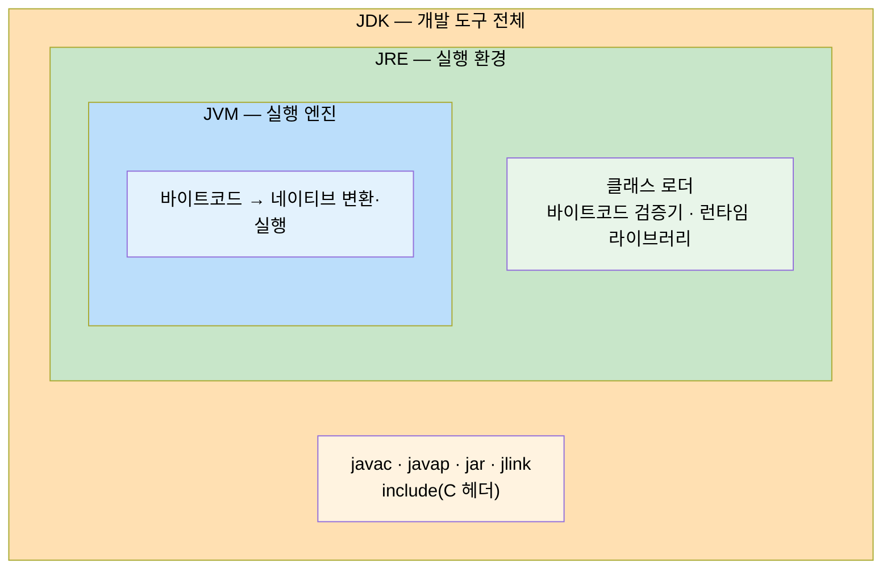
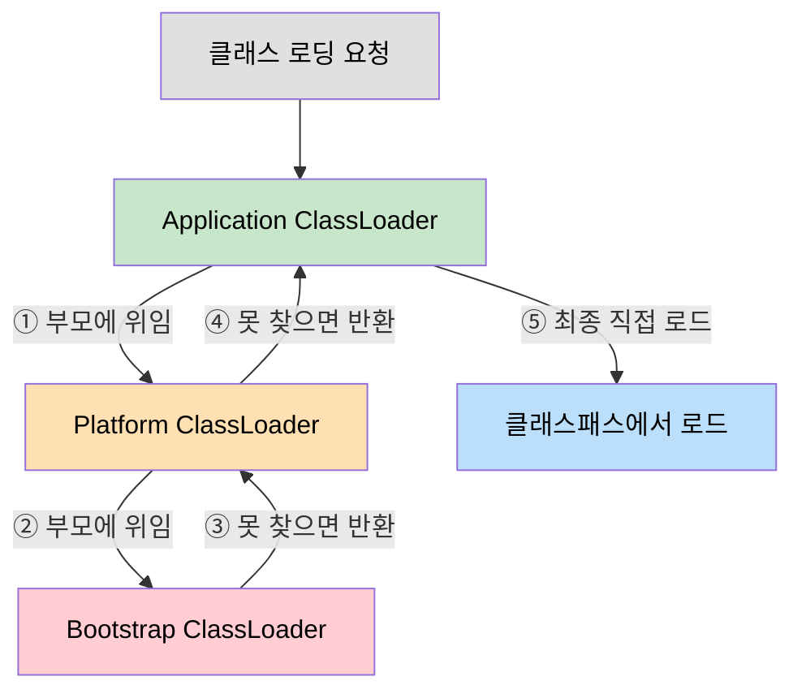
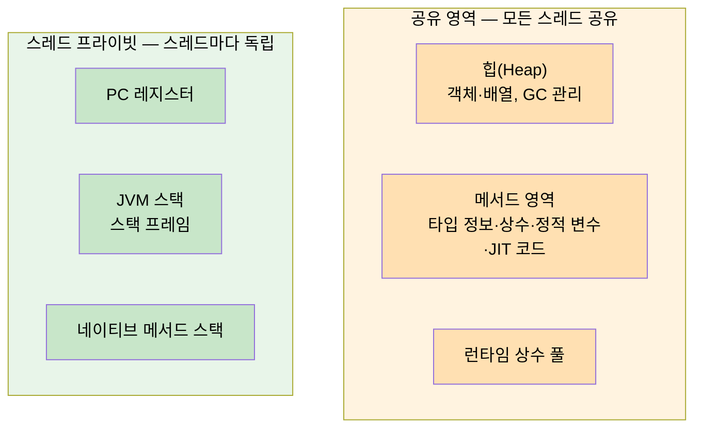

# JDK 구조와 바이트코드
---
> Java 소스 코드가 플랫폼 독립적 바이트코드로 변환되고 JVM 안에서 실행되기까지의 전체 흐름을 이해한다. JDK/JRE/JVM 계층 구조, 클래스 파일 포맷, 바이트코드 명령어, 클래스 로딩 메커니즘, 런타임 데이터 영역을 다룬다. 본 요약을 한 줄로 압축하면 — **JDK는 명세(JVM Spec) + 구현(HotSpot 등) + 도구(`javac`·`java`·`javap`)의 합이며, 그 사이를 잇는 표준이 클래스 파일 포맷**이다. 절 단위 정독은 `ch01_java-tech/` 4편이 §1.5~§1.7을 다룬다.

## 1. JDK/JRE/JVM 계층 구조

**JDK**(Java Development Kit)는 Java 개발에 필요한 모든 도구를 포함하는 최상위 패키지다. 설치 디렉토리의 `bin` 폴더에는 `javac`(컴파일러), `java`(실행기), `javap`(역어셈블러), `jar`, `jlink` 등이 있고, `include` 폴더에는 네이티브 코드 개발용 C 헤더 파일, `lib` 폴더에는 실행 시간 라이브러리 클래스가 있다.

**JRE**(Java Runtime Environment)는 JDK 안에 포함되며, 이미 컴파일된 애플리케이션을 실행하는 환경을 제공한다. JRE의 핵심은 *클래스 로더*와 *바이트코드 검증기*로, 실행 시점에 클래스를 동적으로 로드하고 안전성을 확인한다.

**JVM**(Java Virtual Machine)은 바이트코드를 각 플랫폼의 네이티브 코드로 변환하여 실행하는 가상 머신이다. "Write Once, Run Anywhere"의 핵심이 JVM이며, Java뿐 아니라 Kotlin, Groovy, Clojure, JRuby 등 바이트코드를 생성하는 모든 언어를 실행할 수 있다. 세 계층의 포함 관계는 JVM ⊂ JRE ⊂ JDK다.

세 계층이 어떻게 서로를 감싸는지 그림으로 보면 다음과 같다. 바깥일수록 더 많은 도구를 품으며, 가장 안쪽 JVM이 실제 실행을 담당한다.



## 2. 클래스 파일 구조

클래스 파일은 바이트를 단위로 하는 이진 스트림이며, 구분 기호 없이 정해진 순서대로 데이터 항목이 나열된다. 클래스 파일 하나는 클래스 또는 인터페이스 하나를 정의하며, 디스크 파일이 아닌 네트워크나 메모리에서 동적으로 생성된 것도 포함한다.

의사 구조에는 부호 없는 숫자(u1, u2, u4, u8)와 테이블 두 가지 데이터 타입만 존재한다. 주요 필드는 다음과 같다.

- **매직 넘버**: 처음 4바이트가 `0xCAFEBABE`로, JVM이 유효한 클래스 파일인지 식별한다
- **버전 정보**: 마이너/메이저 버전 (Java 21 = 65, Java 17 = 61)
- **상수 풀**: 리터럴과 심벌 참조(클래스명, 메서드명, 필드명, 타입 서술자)를 저장하는 자원 창고
- **접근 플래그**: `ACC_PUBLIC`, `ACC_SUPER` 등 접근 제어 정보
- **클래스/부모 클래스/인터페이스 인덱스**: 상속 관계를 상수 풀 인덱스로 참조
- **필드/메서드 테이블**: 접근 플래그, 이름, 서술자, 바이트코드(Code 속성) 포함
- **속성 테이블**: Code, ConstantValue, Signature 등 부가 정보

`javac`로 컴파일할 때는 링크 단계가 없다. 필드와 메서드의 실제 메모리 주소는 클래스 파일에 저장되지 않으며, JVM이 클래스 로드 시점에 상수 풀의 심벌 참조를 실제 주소로 동적 변환한다. 이 구조 덕분에 Java 애플리케이션은 구현 클래스를 실행 시점까지 미룰 수 있는 높은 확장성을 얻는다.

## 3. 바이트코드 명령어와 스택 머신

바이트코드는 소스 코드와 기계어의 중간 단계로, 단일 바이트 단위 명령어로 구성된다. `javac`가 생성하는 바이트코드는 최적화 수준이 높지 않은데, JVM 설계진이 성능 최적화를 런타임 JIT 컴파일러에 집중하기 때문이다. `javap -c` 명령어로 클래스 파일을 역어셈블하면 바이트코드를 직접 확인할 수 있다.

```java
public class StaticExample {
    static int staticVar = 100;

    public static void main(String[] args) {
        int a = 10;
        int b = 20;
        int sum = a + b + staticVar;
        System.out.println("Sum: " + sum);
    }
}
```

```
public static void main(java.lang.String[]);
  Code:
     0: bipush        10    // 정수 10을 오퍼랜드 스택에 push
     2: istore_1            // 스택 top을 로컬 변수 1번(a)에 저장
     3: bipush        20    // 정수 20을 스택에 push
     5: istore_2            // 스택 top을 로컬 변수 2번(b)에 저장
     6: iload_1             // 로컬 변수 1번(a)을 스택에 load
     7: iload_2             // 로컬 변수 2번(b)을 스택에 load
     8: iadd                // 스택 top 두 값을 더함 → 결과 push
     9: istore_3            // 결과를 로컬 변수 3번에 저장
    10: getstatic     #7    // System.out 필드값을 스택에 load
    13: iload_3             // sum을 스택에 load
    14: invokedynamic #13,0 // makeConcatWithConstants 동적 호출
    19: invokevirtual #17   // println 호출
    22: return
```

JVM은 레지스터 기반이 아닌 **스택 기반**으로 동작한다. 모든 연산은 *오퍼랜드 스택*(평가 스택)에 값을 push/pop하는 방식으로 수행한다. 스택 기반 구조는 레지스터 할당이라는 복잡한 로직 없이 다양한 하드웨어에서 이식성 높은 실행 환경을 제공한다.

JVM에는 평가 스택(메서드 내 연산 처리)과 호출 스택(호출된 메서드 실행 정보 기록) 두 가지 스택이 존재한다. 메서드가 반환되면 반환값이 호출자의 평가 스택으로 push된다.

주요 오퍼레이션 코드를 목적별로 분류하면 다음과 같다.

- **로드/저장**: `iload`, `istore`, `ldc`, `getfield`, `putfield`, `getstatic`, `putstatic`
- **산술**: `iadd`, `isub`, `imul`, `idiv`, 타입 캐스트 명령어
- **실행 제어**: `if<cond>`, `goto`, `tableswitch`, `lookupswitch`
- **메서드 호출**: `invokestatic`, `invokevirtual`, `invokeinterface`, `invokespecial`, `invokedynamic`
- **객체/동기화**: `new`, `monitorenter`, `monitorexit`

## 4. 클래스 로딩 메커니즘

클래스 로딩은 클래스 파일의 바이너리 데이터를 JVM 메모리로 읽어들이고, 검증·변환·초기화를 거쳐 사용 가능한 Java 타입을 만드는 전체 과정이다. 로딩·링킹·초기화가 모두 프로그램 실행 중에 이루어지는 덕분에 Java는 높은 확장성과 유연성을 제공하지만, AOT 컴파일에는 제약이 생기는 트레이드오프가 있다.


- **로딩**: 클래스 파일 바이너리 스트림을 메모리로 읽어들임 (디스크, 네트워크, 메모리 모두 가능)
- **검증**: 바이트코드가 JVM 명세를 준수하는지 안전성 확인
- **준비**: 정적 필드에 기본값(0, null 등) 할당
- **해석**: 상수 풀의 심벌 참조를 실제 메모리 주소로 변환 (동적 바인딩을 위해 초기화 이후로 미룰 수 있음)
- **초기화**: `static` 블록과 정적 변수 초기화 코드 실행

### 4-1. 클래스 로더 위임 모델

JVM은 세 계층의 클래스 로더를 **부모 위임 모델**로 연결한다. 클래스 로딩 요청을 항상 상위 로더에 먼저 위임하고, 상위 로더가 로드하지 못할 때만 자신이 직접 로드한다.

| 클래스 로더 | 구현 | 로드 대상 |
|---|---|---|
| **Bootstrap ClassLoader** | 네이티브(C++) | `java.lang.*` 등 핵심 클래스 |
| **Platform ClassLoader** | Java (Java 9+) | `java.se.*`, `java.xml.*` 등 확장 모듈 |
| **Application ClassLoader** | Java | 개발자가 작성한 클래스패스의 클래스 |

로딩 요청이 위로 위임되고 실패 시 아래로 내려오는 흐름은 다음과 같다. 요청은 항상 위로 올라가고, 상위가 못 찾을 때만 한 단계씩 아래로 책임이 돌아온다.



이 구조 덕분에 `java.lang.String` 같은 핵심 클래스를 악의적으로 교체하는 공격을 방지하고, 동일 클래스가 중복 로딩되는 문제를 예방한다.

### 4-2. 클래스 초기화 촉발 조건

JVM 명세는 클래스 초기화를 즉시 시작해야 하는 능동 참조 상황 6가지를 규정한다.

- `new`, `getstatic`, `putstatic`, `invokestatic` 바이트코드 실행 시
- 리플렉션 API로 타입에 접근 시
- 클래스 초기화 전 부모 클래스가 미초기화된 경우
- JVM 구동 직후 `main` 메서드 실행 시
- `invokedynamic` 명령어의 메서드 핸들 사용 시
- 인터페이스 디폴트 메서드를 구현한 클래스가 초기화될 때

## 5. 런타임 데이터 영역

JVM은 실행에 필요한 메모리를 스레드 프라이빗 영역과 공유 영역으로 구분한다.

두 영역이 무엇을 담고 어디까지 공유되는지 그림으로 보면 다음과 같다. 왼쪽은 스레드마다 복제되고, 오른쪽은 모든 스레드가 함께 쓴다.



**스레드 프라이빗 영역** (스레드마다 독립):

- **PC 레지스터**: 현재 실행 중인 바이트코드 줄 번호 표시기. 멀티스레딩에서 스레드 전환 후 실행 지점을 정확히 복원하기 위해 스레드마다 독립적으로 존재한다.
- **JVM 스택**: 메서드 호출 시마다 *스택 프레임*을 생성하여 로컬 변수 테이블, 오퍼랜드 스택, 동적 링킹 정보, 메서드 반환값을 저장한다. 스택 깊이 초과 시 `StackOverflowError`, 메모리 부족 시 `OutOfMemoryError`가 발생한다.
- **네이티브 메서드 스택**: JVM 스택과 동일한 역할이지만, 네이티브(C/C++) 메서드 실행 시 사용한다. HotSpot은 두 스택을 구분하지 않고 `-Xss`로 함께 설정한다.

**공유 영역** (모든 스레드 공유):

- **힙(Heap)**: 가장 큰 메모리 영역으로 `new`로 생성한 객체와 배열이 저장된다. GC가 관리하며 `-Xms`(초기), `-Xmx`(최대)로 크기를 조정한다.
- **메서드 영역**: JVM이 로드한 타입 정보, 상수, 정적 변수, JIT 컴파일 코드 캐시를 저장한다. Java 8부터 영구 세대(PermGen)가 제거되고 네이티브 메모리를 사용하는 **메타스페이스**로 대체되어, `-XX:MaxMetaspaceSize`로 제한한다.
- **런타임 상수 풀**: 메서드 영역의 일부로 클래스 파일 상수 풀 정보를 런타임에 저장하며, `String.intern()` 등으로 동적 추가도 가능하다.

```java
// 힙 오버플로우 재현 예제
// JVM 옵션: -Xms20m -Xmx20m -XX:+HeapDumpOnOutOfMemoryError
public class HeapOOM {
    static class OOMObject {}

    public static void main(String[] args) {
        var list = new ArrayList<OOMObject>();
        while (true) {
            list.add(new OOMObject()); // OutOfMemoryError: Java heap space
        }
    }
}
```

객체 생성 시 JVM은 힙에 메모리를 할당하고 0으로 초기화한 뒤, 객체 헤더(마크 워드, 클래스 워드)를 설정한다. 그 다음 `invokespecial`로 생성자(`<init>`)가 호출되어야 비로소 Java 프로그램 관점에서 객체가 완성된다. HotSpot은 *다이렉트 포인터* 방식으로 힙 객체에 접근하여, 핸들 방식에 비해 참조 속도가 빠르다.


## 관련 문서

- [`./02-01.자바 기술의 미래 — 언어 독립과 차세대 JIT.md`](./02-01.자바%20기술의%20미래%20—%20언어%20독립과%20차세대%20JIT.md) — 1부 §1.5~§1.7 정독 노트 4편 (본 흡수본의 형제 갈래)
- [`../ch02_memory-area/01-01.런타임 데이터 영역.md`](../ch02_memory-area/01-01.런타임%20데이터%20영역.md) — 본 요약이 다룬 7개 메모리 영역의 정독
- [`../ch03_gc/01-01.GC 운영 — 로그와 튜닝.md`](../ch03_gc/01-01.GC%20운영%20—%20로그와%20튜닝.md) — 본 요약 이후의 GC 큰 그림 (옛 02-01 흡수처)
- [`../README.md`](../README.md) — 05_JVM 학습 인덱스, 부 요약 흡수 이력과 정독 폴더 매핑
