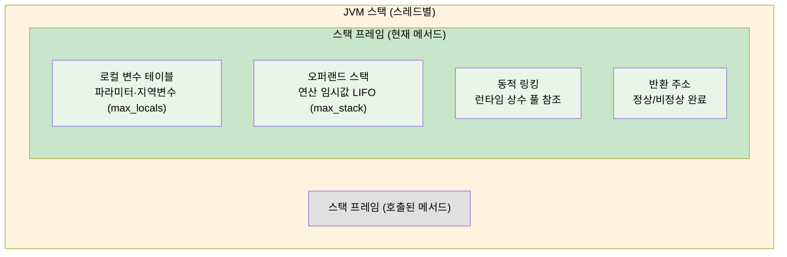

# 가상 머신 실행 서브시스템
---
> JVM이 메서드를 어떻게 호출하고 실행하는지 이해한다. 스택 프레임의 내부 구조, 다섯 가지 invoke 명령어의 차이, 정적 디스패치와 동적 디스패치의 원리, invokedynamic과 메서드 핸들을 다룬다. 본 요약을 한 줄로 압축하면 — **자바 메서드 호출은 스택 프레임 push/pop과 다섯 invoke 명령어의 분기로 정의되며, `invokedynamic`이 그 결정 시점을 *컴파일 타임에서 첫 호출 시점으로* 늦춰 람다·동적 언어 지원의 기반이 됐다**.

## 1. 스택 프레임 구조

*스택 프레임*(Stack Frame)은 JVM 스택에서 메서드 호출과 실행의 기본 단위다. 메서드가 호출될 때마다 새 스택 프레임이 생성되어 JVM 스택에 push되고, 메서드가 반환되면 pop된다. 컴파일 시점에 스택 프레임 크기가 이미 결정되므로, 런타임에 동적으로 크기가 변하지 않는다.

스택 프레임은 네 가지 구성요소로 이루어진다. JVM 스택은 메서드 호출마다 프레임을 쌓고, 각 프레임 안에 다음 네 영역이 들어 있다.



### 1-1. 로컬 변수 테이블

*로컬 변수 테이블*(Local Variable Table)은 메서드 파라미터와 메서드 내 지역 변수를 저장하는 공간이다. 저장 단위는 *변수 슬롯*(Variable Slot)이며, `boolean`, `byte`, `char`, `short`, `int`, `float`, `reference` 타입은 슬롯 하나를 사용하고, `long`과 `double`은 슬롯 두 개를 사용한다.

인스턴스 메서드에서 슬롯 0번은 항상 현재 객체 참조 `this`로 예약된다. 컴파일러는 슬롯 개수를 `max_locals`에 기록하여, JVM이 스택 프레임 생성 시 미리 공간을 확보할 수 있게 한다.

```java
// javap -v로 확인하면 max_locals 값을 볼 수 있다
public int calculate(int x, int y) {
    int result = x + y;  // 슬롯 0: this, 1: x, 2: y, 3: result
    return result;
}
```

### 1-2. 오퍼랜드 스택

*오퍼랜드 스택*(Operand Stack)은 메서드 실행 중 연산에 사용하는 값을 임시 저장하는 LIFO 스택이다. 바이트코드 명령어는 오퍼랜드 스택에서 값을 pop하여 연산하고 결과를 다시 push한다. 컴파일러가 계산한 최대 스택 깊이가 `max_stack`에 기록된다.

```
// int sum = a + b 연산 과정
iload_1     → 스택: [a]
iload_2     → 스택: [a, b]
iadd        → 스택: [a+b]
istore_3    → 스택: []     로컬 변수 3번에 저장
```

### 1-3. 동적 링킹

*동적 링킹*(Dynamic Linking)은 현재 메서드가 속한 클래스의 런타임 상수 풀을 가리키는 참조다. 바이트코드의 심벌 참조(메서드명, 클래스명 등)를 런타임에 실제 메모리 주소로 변환하는 과정을 지원하기 위해 존재한다. 클래스 로드 시점에 변환되는 정적 해석과 달리, 동적 링킹은 실제 호출 시점까지 변환을 미룬다.

### 1-4. 반환 주소

메서드가 완료되면 다음 두 가지 방법 중 하나로 반환된다. **정상 완료**는 `return` 계열 명령어(`ireturn`, `areturn`, `return` 등)를 실행하는 경우로, 반환값이 있으면 호출자의 오퍼랜드 스택으로 push된다. **비정상 완료**는 예외가 발생하여 해당 메서드 안에서 처리되지 못한 경우로, 반환값이 호출자에게 전달되지 않는다.

## 2. 메서드 호출 명령어

JVM은 메서드 호출 방식에 따라 다섯 가지 invoke 명령어를 제공한다.

| 명령어 | 호출 대상 | 특징 |
|---|---|---|
| `invokestatic` | `static` 메서드 | 컴파일 타임에 확정, 가장 빠름 |
| `invokespecial` | 생성자, `private` 메서드, 부모 클래스 메서드 | 컴파일 타임에 확정 |
| `invokevirtual` | 인스턴스 메서드 (일반) | 런타임 실제 타입으로 디스패치 |
| `invokeinterface` | 인터페이스 메서드 | 런타임에 구현 클래스 검색 |
| `invokedynamic` | 동적으로 결정되는 호출 | 부트스트랩 메서드로 CallSite 결정 |

`invokestatic`과 `invokespecial`은 호출할 메서드를 **컴파일 타임에 확정**할 수 있다. 이 두 명령어와 `final` 수식어가 붙은 인스턴스 메서드를 *비가상 메서드*라 한다. 나머지는 런타임에 실제 객체 타입을 확인해야 하는 *가상 메서드*다.

## 3. 정적 디스패치와 동적 디스패치

### 3-1. 정적 디스패치

*정적 디스패치*(Static Dispatch)는 컴파일 타임에 메서드 버전을 결정하는 방식이다. Java의 메서드 오버로딩이 대표적인 예다.

```java
public class StaticDispatch {
    static abstract class Human {}
    static class Man extends Human {}
    static class Woman extends Human {}

    public void sayHello(Human guy) {
        System.out.println("hello, human");
    }

    public void sayHello(Man guy) {
        System.out.println("hello, man");
    }

    public void sayHello(Woman guy) {
        System.out.println("hello, woman");
    }

    public static void main(String[] args) {
        Human man = new Man();
        Human woman = new Woman();
        var sd = new StaticDispatch();
        sd.sayHello(man);    // "hello, human" — 정적 타입(Human)으로 결정
        sd.sayHello(woman);  // "hello, human" — 정적 타입(Human)으로 결정
    }
}
```

`Human man = new Man()`에서 컴파일러가 보는 것은 선언 타입인 `Human`(정적 타입)이다. 실제 타입인 `Man`(동적 타입)은 런타임에서만 알 수 있으므로, 오버로딩 해석은 정적 타입 기준으로 컴파일 타임에 결정된다.

### 3-2. 동적 디스패치

*동적 디스패치*(Dynamic Dispatch)는 런타임에 실제 타입을 확인하여 메서드 버전을 결정하는 방식이다. Java의 메서드 오버라이딩이 대표적인 예이며, `invokevirtual` 명령어가 이를 구현한다.

```java
public class DynamicDispatch {
    static abstract class Human {
        protected abstract void sayHello();
    }

    static class Man extends Human {
        @Override
        protected void sayHello() { System.out.println("man say hello"); }
    }

    static class Woman extends Human {
        @Override
        protected void sayHello() { System.out.println("woman say hello"); }
    }

    public static void main(String[] args) {
        Human man = new Man();
        Human woman = new Woman();
        man.sayHello();    // "man say hello"
        woman.sayHello();  // "woman say hello"
        man = new Woman();
        man.sayHello();    // "woman say hello"
    }
}
```

`invokevirtual`은 런타임에 수신 객체의 실제 타입을 확인하고, 해당 타입의 메서드 테이블에서 메서드를 찾는다. 해당 타입에 없으면 부모 클래스로 거슬러 올라가 탐색한다. HotSpot은 *가상 메서드 테이블*(vtable)로 이 과정을 최적화하여, 매번 메서드 탐색을 반복하는 비용을 줄인다.

### 3-3. 단일 디스패치와 다중 디스패치

Java의 정적 메서드 선택은 수신 객체 타입과 파라미터 타입, 두 가지 기준을 사용하므로 **다중 디스패치**다. 반면 런타임 동적 디스패치는 수신 객체 타입 하나만 기준으로 삼으므로 **단일 디스패치**다. Java는 컴파일 타임에 다중 디스패치, 런타임에 단일 디스패치를 사용하는 언어다.

두 디스패치가 *언제* 메서드 버전을 정하는지 갈림길로 보면 차이가 분명해진다. 정적 디스패치는 컴파일러가 선언 타입으로 미리 정하고, 동적 디스패치는 런타임에 실제 객체 타입을 보고 정한다.

```mermaid
flowchart TB
    call["메서드 호출"] --> q{"오버로딩인가<br>오버라이딩인가?"}
    q -->|"오버로딩"| sd["정적 디스패치<br>(컴파일 타임)"]
    q -->|"오버라이딩"| dd["동적 디스패치<br>(런타임)"]
    sd --> sdk["선언 타입(정적 타입)으로<br>메서드 버전 확정"]
    dd --> ddk["실제 객체 타입(동적 타입)으로<br>vtable 탐색 — invokevirtual"]

    style call fill:#E0E0E0,color:#000
    style q fill:#FFF3E0,color:#000
    style sd fill:#BBDEFB,color:#000
    style dd fill:#C8E6C9,color:#000
    style sdk fill:#E3F2FD,color:#000
    style ddk fill:#E8F5E9,color:#000
```

## 4. invokedynamic과 메서드 핸들

`invokedynamic`은 Java 7에서 도입된 명령어로, 메서드 호출 대상을 런타임에 완전히 동적으로 결정한다. 처음 호출 시 *부트스트랩 메서드*(Bootstrap Method)를 실행하여 `CallSite` 객체를 생성하고, `CallSite`가 가리키는 *메서드 핸들*을 통해 실제 메서드를 호출한다.

*메서드 핸들*(Method Handle)은 특정 메서드나 필드, 생성자를 가리키는 타입 안전한 실행 참조다. 리플렉션의 `Method` 객체와 달리 JVM이 직접 최적화할 수 있으며, 람다 표현식과 메서드 참조가 내부적으로 `invokedynamic`과 메서드 핸들로 구현된다.

```java
import java.lang.invoke.MethodHandles;
import java.lang.invoke.MethodType;

public class MethodHandleExample {
    static void greet(String name) {
        System.out.println("Hello, " + name);
    }

    public static void main(String[] args) throws Throwable {
        var lookup = MethodHandles.lookup();
        var mt = MethodType.methodType(void.class, String.class);
        var mh = lookup.findStatic(MethodHandleExample.class, "greet", mt);
        mh.invoke("World");  // "Hello, World"
    }
}
```

람다 표현식이 `invokedynamic`으로 컴파일되는 이유는 미래 최적화 여지를 남기기 위해서다. 익명 클래스로 고정하면 JVM이 추가 최적화를 적용하기 어렵지만, `invokedynamic`은 JVM이 런타임 상황에 맞게 최적의 구현을 선택할 수 있다.

## 5. 클래스 파일 구조와 실행의 연결

클래스 파일의 메서드 테이블에는 메서드 바이트코드가 `Code` 속성으로 저장된다. `Code` 속성의 `max_stack`과 `max_locals` 값은 컴파일러가 정적으로 계산하여 기록한다. JVM은 메서드 호출 시 이 값을 이용해 스택 프레임 크기를 미리 결정하므로, 런타임에 스택 크기를 동적으로 조정할 필요가 없어 성능이 향상된다.

```
public int inc();
  Code:
    stack=2, locals=1, args_size=1   // max_stack, max_locals
       0: aload_0                    // this를 스택에 push
       1: getfield  #7               // 필드 m을 스택에 push
       4: iconst_1                   // 상수 1을 스택에 push
       5: iadd                       // 두 값을 더함
       6: ireturn                    // 결과 반환
```

`synchronized` 메서드는 `ACC_SYNCHRONIZED` 플래그를 설정하고, JVM이 메서드 진입/퇴장 시 자동으로 `monitorenter`/`monitorexit`를 수행한다. `synchronized` 블록은 바이트코드에 `monitorenter`/`monitorexit` 명령어가 명시적으로 삽입된다.


## 관련 문서

- [`./01-01.JDK 구조와 바이트코드.md`](./01-01.JDK%20구조와%20바이트코드.md) — 본 요약의 전제, 클래스 파일과 바이트코드 명령어
- [`./01-03.컴파일과 최적화.md`](./01-03.컴파일과%20최적화.md) — 본 요약 다음 단계, JIT가 어떻게 인보크 비용을 줄이는지
- [`../README.md`](../README.md) — 05_JVM 학습 인덱스
