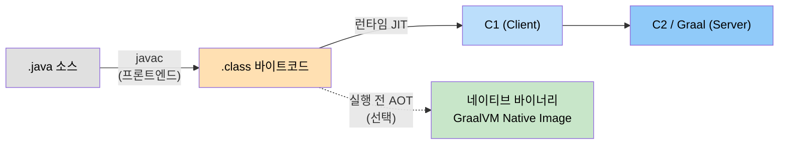
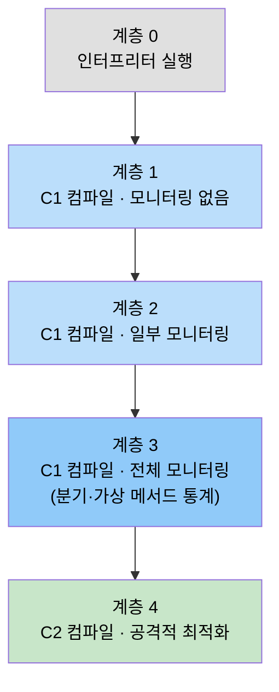
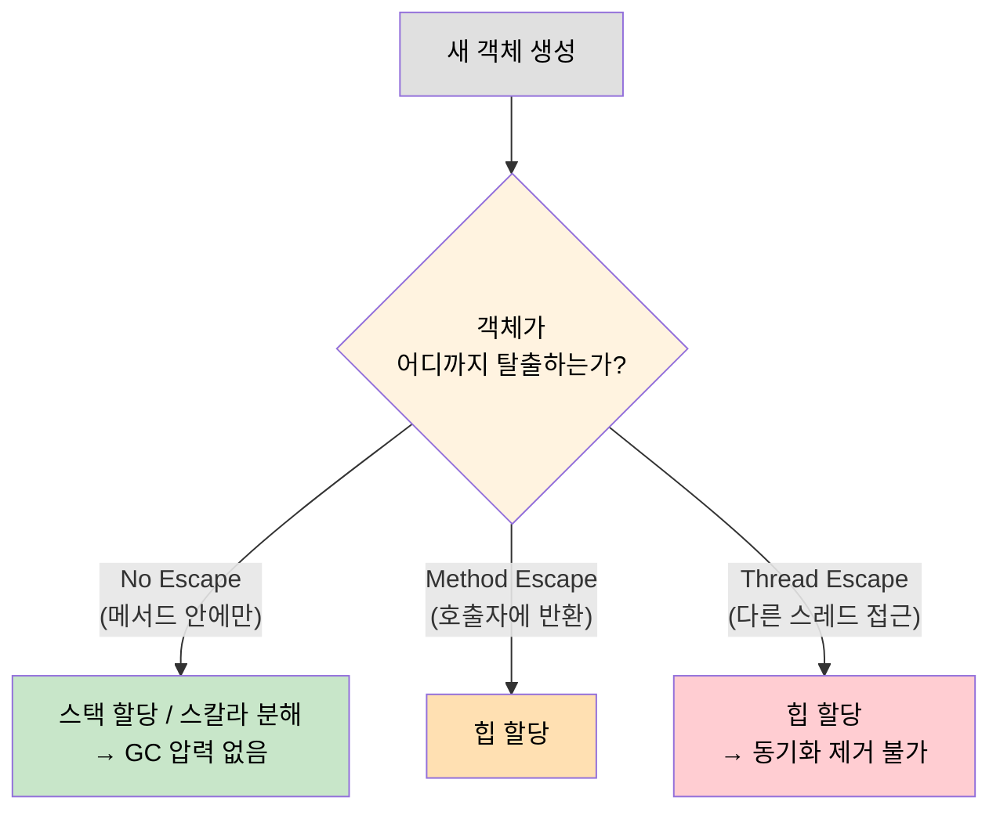

# 컴파일과 최적화
---
> Java 코드가 실행 가능한 네이티브 코드로 변환되는 전체 과정을 이해한다. 프론트엔드 컴파일(javac)의 역할, JIT 컴파일러의 계층 구조와 핫스팟 탐지 원리, 주요 최적화 기법(인라이닝, 탈출 분석, 루프 최적화), AOT 컴파일과 GraalVM Native Image를 다룬다. 본 요약을 한 줄로 압축하면 — **Java의 "컴파일"은 한 단계가 아닌 *javac → C1 → C2/Graal → (선택) AOT* 의 4단 파이프라인**이며, 어느 단계를 어디까지 돌릴지가 시작 시간·정점 처리량·메모리의 트레이드오프를 만든다.

## 1. 컴파일 단계 구분

"컴파일"이라는 단어는 Java에서 세 가지 다른 단계를 가리킬 수 있다. 이를 명확히 구분하는 것이 JVM을 이해하는 출발점이다.

- **프론트엔드 컴파일**: `javac`가 `.java` 파일을 `.class` 바이트코드로 변환하는 과정
- **JIT 컴파일**: 런타임에 HotSpot의 C1/C2 컴파일러가 바이트코드를 네이티브 코드로 변환하는 과정
- **AOT 컴파일**: 실행 전에 전체 애플리케이션을 네이티브 바이너리로 변환하는 과정 (GraalVM Native Image)

`javac`는 코드 실행 효율 측면의 최적화는 거의 하지 않는다. JVM 설계진이 성능 최적화를 런타임 JIT 컴파일러에 집중하기 때문이며, 이 덕분에 Kotlin이나 Groovy 등 다른 JVM 언어도 JIT 최적화를 공통으로 누릴 수 있다.

세 단계가 하나의 파이프라인으로 어떻게 이어지는지 보면 다음과 같다. 앞쪽은 실행 전, 뒤쪽은 런타임에 일어나며, AOT는 JIT 경로를 통째로 대체하는 선택지다.



## 2. 프론트엔드 컴파일(javac)

`javac`는 C++이나 C로 구현된 HotSpot JVM과 달리, 순수 Java로 작성되어 있다. `javac`의 컴파일 과정은 1개의 준비 단계와 3개의 처리 단계로 이루어진다.

1. **준비**: 플러그인 애너테이션 처리기 초기화
2. **구문 분석 및 심벌 테이블 채우기**: 소스 코드를 AST(Abstract Syntax Tree)로 변환
3. **애너테이션 처리**: Lombok 같은 컴파일러 플러그인이 이 단계에서 코드를 생성/변환한다
4. **의미 분석 및 바이트코드 생성**: 특성 검사, 데이터 흐름 분석, 편의 문법 제거, 바이트코드 생성

`javac`가 수행하는 최적화는 주로 **편의 문법(Sugar Syntax) 제거**다. 제네릭 타입 소거, 오토박싱/언박싱, 개선된 for문 변환, 람다를 `invokedynamic`으로 변환하는 작업이 여기서 이루어진다.

## 3. JIT 컴파일러

JIT(Just-In-Time) 컴파일러는 자주 실행되는 메서드(핫 코드)를 발견하면 해당 바이트코드를 네이티브 코드로 컴파일하고 다양한 최적화를 적용한다. HotSpot이라는 이름 자체가 이 핫 코드 감지 기술에서 유래한다.

### 3-1. 인터프리터와 JIT의 협력

HotSpot은 인터프리터와 JIT 컴파일러를 함께 사용한다. 인터프리터는 프로그램을 빠르게 시작하기 위해 컴파일 없이 즉시 실행하고, JIT는 시간이 지나면서 많은 코드를 네이티브 코드로 변환하여 성능을 높인다. 메모리가 부족해지면 JIT가 최적화를 취소하고 다시 인터프리터 실행으로 되돌아갈 수도 있다.

### 3-2. C1/C2 컴파일러와 계층형 컴파일

HotSpot에는 두 가지 JIT 컴파일러가 내장되어 있다.

| 컴파일러 | 특징 | 컴파일 임계값 |
|---|---|---|
| **C1 (Client)** | 빠른 컴파일, 기본적인 최적화, GUI/데스크톱 앱에서 유래 | 약 1,500회 호출 |
| **C2 (Server)** | 느린 컴파일, 공격적 최적화, 최고 성능 네이티브 코드 생성 | 약 10,000회 호출 |

Java 7부터 도입된 **계층형 컴파일**(Tiered Compilation)은 C1과 C2를 단계별로 조합한다. Java 9부터는 기본이 서버 모드이므로 계층형 컴파일이 항상 활성화된다.



### 3-3. 핫스팟 탐지

JIT 컴파일을 촉발할지 판단하는 동작을 *핫스팟 탐지*라 한다. HotSpot은 각 메서드에 **호출 카운터**와 **백 에지 카운터**를 유지한다. 백 에지는 순환문 경계에서 루프 처음으로 점프하는 것을 의미하며, 루프 본문도 핫 코드로 탐지하기 위해 별도로 카운트한다.

```java
// 핫 코드 예시: 메서드 호출 카운터와 백 에지 카운터 모두 증가
public void hotMethod() {
    for (int i = 0; i < 10_000; i++) { // 백 에지 카운터
        doWork(i);  // 호출 카운터
    }
}
```

JIT 컴파일은 백그라운드 스레드에서 진행되므로, 컴파일이 완료될 때까지 인터프리터가 계속 실행을 이어간다.

## 4. 주요 최적화 기법

### 4-1. 메서드 인라이닝

*인라이닝*(Inlining)은 메서드 호출을 호출 지점에 메서드 본문으로 대체하는 최적화다. 메서드 호출로 인한 스택 프레임 생성 비용을 없애며, 이후 다른 최적화(상수 전파, 죽은 코드 제거 등)를 위한 기반을 만들어 주어 "최적화의 어머니"라 불린다.

```java
// 인라이닝 전
public int add(int a, int b) { return a + b; }
int result = add(3, 4);

// 인라이닝 후 (JIT가 내부적으로 수행)
int result = 3 + 4;  // 스택 프레임 생성 비용 제거
```

Java는 객체지향 언어라 가상 메서드(오버라이딩)가 많아 인라이닝이 어렵다. JIT는 런타임 프로파일링으로 실제 호출 타입을 파악하고 인라인 캐시, 타입 프로파일을 활용한 *투기적 인라이닝*을 수행한다. `final` 또는 `private` 메서드는 가상 메서드가 아니므로 항상 인라이닝 가능하다.

### 4-2. 탈출 분석

*탈출 분석*(Escape Analysis)은 새로 생성한 객체가 메서드 범위를 벗어나는지 분석하여 힙 할당 여부를 결정하는 기술이다. JVM은 탈출하지 않는 객체를 힙 대신 스택에 할당하거나 아예 레지스터에 스칼라로 분해할 수 있다.

```java
// No Escape: 메서드 범위를 벗어나지 않으므로 스택 할당 가능
public int noEscapeExample() {
    var point = new Point(3, 4);  // 힙이 아닌 스택에 할당 가능
    return point.x + point.y;
}

// Method Escape: 호출자에게 반환되므로 힙 할당 필요
public Point methodEscape() {
    return new Point(3, 4);  // 힙 할당 필요
}

// Thread Escape: 다른 스레드에서도 접근 가능하므로 힙 할당 필요
public void threadEscape() {
    new Thread(() -> {
        var point = new Point(3, 4);
        System.out.println(point.x);
    }).start();
}
```

객체의 탈출 범위에 따라 할당 위치가 어떻게 갈리는지 보면 다음과 같다. 탈출하지 않을수록 더 싼 자리(스택·레지스터)에 놓을 수 있다.



탈출하지 않는 객체가 충분히 많을 때 탈출 분석의 효과가 크다. 탈출 분석 결과로 GC 압력을 줄이는 *스택 할당*과, 락이 필요 없음을 증명하는 *동기화 제거*가 가능해진다.

### 4-3. 인라이닝 후 최적화 연쇄

JIT 최적화는 연쇄적으로 작동하는 경우가 많다. 인라이닝이 이루어지면 컴파일러가 더 많은 컨텍스트를 볼 수 있어 추가 최적화를 적용할 수 있다.

```java
// 초기 코드
B b = new B();
b.value = 10;
int y = b.get();   // get()은 return value; 한 줄짜리 메서드
int z = b.get();
int sum = y + z;

// 1단계: 메서드 인라이닝 → b.get() 제거
int y = b.value;
int z = b.value;

// 2단계: 중복 저장 제거 (b.value는 변하지 않으므로)
int y = b.value;
int sum = y + y;

// 3단계: 복사 전파 → 중간 변수 제거
int sum = b.value + b.value;

// 4단계: 상수 폴딩 (b.value = 10이 확정되면)
int sum = 20;
```

### 4-4. 루프 최적화

루프는 핫 코드의 핵심이므로 JIT가 집중적으로 최적화한다. 주요 기법으로는 *루프 언롤링*(Loop Unrolling, 루프 반복 횟수를 줄이고 본문을 펼침), *루프 벡터화*(SIMD 명령어 활용), *루프 불변식 끌어올리기*(Loop Invariant Code Motion, 루프 바깥으로 이동)가 있다.

### 4-5. 공통 부분식 제거 — C2의 GVN

*공통 부분식 제거*(Common Subexpression Elimination, CSE)는 같은 값을 계산하는 표현식이 여러 번 등장할 때 한 번만 계산하고 결과를 재사용하는 최적화다. HotSpot C2는 이를 **Global Value Numbering**(GVN) 으로 구현한다. GVN은 모든 표현식에 *값 번호*를 부여하고 같은 값을 만드는 것들을 같은 합동 클래스(congruence class)로 묶어, 두 번째 등장부터는 첫 번째 결과로 치환한다. 기본 블록 내부에서만 동작하는 *지역 CSE*와 달리 GVN은 제어 흐름을 따라 블록 경계를 넘어 동작하므로 더 많은 중복을 잡아낸다.

```java
// CSE 전
int a = (x + y) * 2;
int b = (x + y) * 3;   // (x + y) 가 다시 계산됨

// CSE/GVN 후 — C2가 sea-of-nodes IR에서 같은 노드로 합침
int tmp = x + y;       // 한 번만 계산
int a = tmp * 2;
int b = tmp * 3;
```

C2는 sea-of-nodes IR 위에서 같은 입력을 가진 노드를 자동으로 한 노드로 합치므로(`Node::Identity`, `Node::Ideal` 메서드 계열), 사용자가 보기에는 CSE가 IR 구조 자체에 내장돼 있다. 핵심 검증 지점은 OpenJDK 소스의 `src/hotspot/share/opto/` 디렉토리다.

### 4-6. 명령어 스케줄링 — LCM과 GCM

*명령어 스케줄링*(Instruction Scheduling)은 의존성을 위반하지 않는 선에서 명령어 순서를 재배치하여 CPU 파이프라인 스톨과 캐시 미스를 줄이는 최적화다. HotSpot C2는 두 단계 스케줄러를 운영한다.

| 단계 | 약칭 | 동작 |
|---|---|---|
| **Global Code Motion** | GCM | 어느 *블록*에 명령어를 배치할지 결정. 루프 밖으로 옮길 수 있는 불변식은 끌어올리고, 자주 안 쓰이는 쪽은 콜드 블록으로 내림 |
| **Local Code Motion** | LCM | 같은 블록 *안에서* 어떤 *순서*로 명령어를 발행할지 결정. 의존성 그래프 위에서 list scheduling |

두 단계 모두 sea-of-nodes IR 위에서 동작하며, 진단용 플래그 `-XX:+UnlockDiagnosticVMOptions -XX:+StressGCM -XX:+StressLCM`을 켜면 스케줄링을 무작위로 흔들어 의존성 누락을 검증할 수 있다 (OpenJDK `c2_globals.hpp` 정의, JDK-8156803로 product diagnostic 플래그가 됨). 이 무작위화로도 깨지지 않으면 스케줄러가 만든 어떤 순서든 의미가 보존된다고 본다.

자바 메모리 모델(JMM)이 정의한 *happens-before* 가 깨지는 재정렬은 LCM/GCM이 만들지 않는다 — `volatile` 읽기/쓰기, `synchronized` 진입/탈출, `final` 필드 초기화 같은 동기화 경계가 IR 의존성 엣지로 강제되기 때문이다. 멀티스레드 가시성을 끊으려면 JMM 경계를 직접 명시해야 한다는 점은 [`../03-02.메모리 가시성과 동기화.md`](../03-02.메모리%20가시성과%20동기화.md) 와 [`../05-01.Java Memory Model 심화.md`](../05-01.Java%20Memory%20Model%20심화.md) 에서 다룬다.

### 4-7. 예외 경로 최적화 — Implicit Null Check

`null` 참조 역참조마다 `if (ref == null) throw NPE` 를 명시적으로 끼우면 핫 패스의 분기 수가 폭증한다. HotSpot은 이를 **implicit null check** 로 처리한다 — *체크를 안 적고* 그냥 메모리에 접근하고, NPE가 거의 발생하지 않는다는 가정 위에서 동작한다. 실제로 `null` 포인터를 역참조하면 OS가 **SIGSEGV** 시그널을 발생시키고, HotSpot이 등록해 둔 시그널 핸들러가 이를 가로채 자바 레벨의 `NullPointerException` 으로 변환한다.

```java
// 자바 코드
String s = obj.getName();
int len = s.length();   // s가 null이면 NPE

// JIT가 생성하는 의사 코드 (implicit null check 적용)
ldr  r0, [obj + offset_of_name]   ; s 로드 — obj가 null이면 여기서 SIGSEGV
ldr  r1, [r0 + offset_of_length]  ; s.length() — s가 null이면 여기서 SIGSEGV
; if-체크 자체가 없다
```

이 기법이 성립하려면 두 조건이 필요하다. 첫째 NPE가 *드물어야* 한다 — 자주 발생하면 시그널 처리 비용이 if-체크보다 비싸진다. 둘째 시그널 핸들러가 *어느 메모리 접근이 NPE 후보였는지* 역추적할 수 있어야 한다 — HotSpot은 `OopMap` 과 인스트럭션 메타데이터로 SIGSEGV가 발생한 PC를 NPE bytecode 위치로 매핑한다.

핫스팟 탐지가 *너무 자주 같은 위치에서 NPE를 보면* 컴파일러는 implicit null check를 포기하고 명시적 if-체크를 도로 끼워 시그널 비용을 피한다 — 이게 자바 어플리케이션을 오래 돌릴수록 NPE 핫 패스가 *느려지지 않는* 이유다 (deoptimization + recompilation). 같은 종류의 *드문 사건 가정* 위의 최적화로 `ArrayIndexOutOfBoundsException` 도 implicit bound check + SIGSEGV가 아닌 컴파일러가 삽입한 *trap* 명령으로 처리된다. OopMap·Safepoint와의 연결은 [`../ch02_automatic-memory-management/02-05.핫스팟 알고리즘 상세 구현.md`](../ch02_automatic-memory-management/02-05.핫스팟%20알고리즘%20상세%20구현.md) 에서 다룬다.

## 5. AOT 컴파일과 GraalVM

### 5-1. AOT의 등장 배경

마이크로서비스 아키텍처에서 Java의 구동 시간(JVM 초기화 + JIT 예열)과 높은 메모리 사용량은 단점이 된다. 서버리스 환경(AWS Lambda 최장 15분 실행 제한)에서는 JIT 컴파일이 충분히 이루어지기 전에 함수가 종료될 수 있다. AOT(Ahead-Of-Time) 컴파일은 이 문제를 해결하기 위해 실행 전에 전체 코드를 네이티브 바이너리로 변환한다.

### 5-2. GraalVM Native Image

GraalVM은 Oracle이 HotSpot을 기반으로 만든 고성능 폴리글랏 가상 머신이다. Native Image 기능은 Java 애플리케이션을 플랫폼별 네이티브 실행 파일로 컴파일하며, JVM 없이도 실행된다.

| 특징 | HotSpot JIT | GraalVM Native Image |
|---|---|---|
| **시작 시간** | 수백 ms ~ 수 초 | 수 ms |
| **메모리 사용량** | 상대적으로 높음 | 한 자릿수 MB 수준 |
| **최고 성능 도달** | JIT 예열 후 (수 초~수 분) | 즉시 (정적 최적화) |
| **런타임 최적화** | 실행 중 동적 최적화 가능 | 불가능 |
| **리플렉션** | 완전 지원 | 제한적 (설정 필요) |

```bash
# GraalVM Native Image 빌드 예시
native-image -jar myapp.jar --no-fallback myapp
# JVM 없이 바로 실행 가능한 네이티브 바이너리 생성
```

### 5-3. JIT의 반격: AOT 대비 JIT의 장점

AOT가 시작 시간과 메모리에서 유리하지만, JIT는 세 가지 근본적인 장점을 유지한다. 첫째, **프로파일 기반 최적화**로 실제 실행 패턴을 수집해 데이터에 기반한 최적화를 수행한다. 둘째, **투기적 최적화**로 100% 정확하지 않아도 가능성이 높은 시나리오를 최적화하고, 가정이 틀리면 취소(deoptimization)한다. 셋째, 런타임 정보를 활용한 **링크타임 최적화**를 수행한다. 장기 실행 서버 애플리케이션에서는 JIT가 AOT보다 최종 처리량에서 우세할 수 있다.

GraalVM 컴파일러 자체는 Java로 작성되어 있어 C++로 구현된 기존 C2 컴파일러보다 확장과 실험이 쉽다. GraalVM은 Truffle 프레임워크를 통해 JavaScript, Python, Ruby, R 등 다른 언어도 실행할 수 있는 폴리글랏 런타임으로 발전하고 있다.


## 관련 문서

- [`./01-01.JDK 구조와 바이트코드.md`](./01-01.JDK%20구조와%20바이트코드.md) — 본 요약의 *전단계*, `javac`이 만든 바이트코드 위에서 JIT가 도는 구조
- [`../_temp/01-04.효율적 동시성.md`](../_temp/01-04.효율적%20동시성.md) — JIT의 탈출 분석이 락 제거에 기여하는 방식
- [`./ch01_java-tech/02-01.자바 기술의 미래 — 언어 독립과 차세대 JIT.md`](./ch01_java-tech/02-01.자바%20기술의%20미래%20—%20언어%20독립과%20차세대%20JIT.md) — 본 요약의 정독 — Graal 차세대 JIT의 운영적 의미
- [`./ch01_java-tech/02-03.실전 — OpenJDK 빌드하기.md`](./ch01_java-tech/02-03.실전%20—%20OpenJDK%20빌드하기.md) — slowdebug 바이너리로 JIT 컴파일 분기를 직접 디버깅하는 발판
- [`../README.md`](../README.md) — 05_JVM 학습 인덱스
