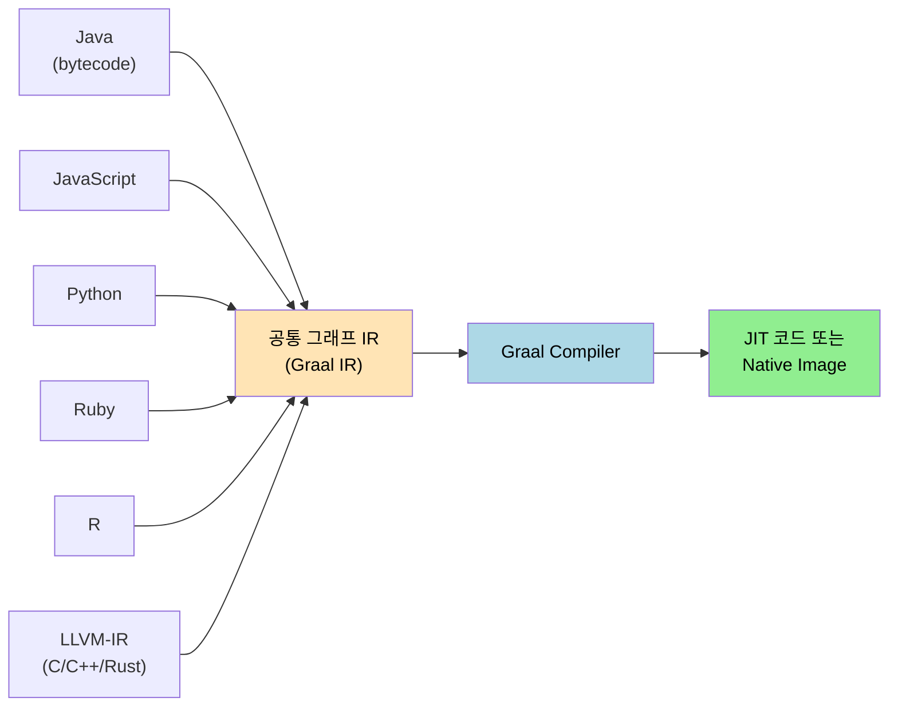

# 자바 기술의 미래 — 언어 독립과 차세대 JIT
---
> 책 1장 후반 §1.5는 자바 생태계가 다음 10년 동안 어디로 향하는지를 다섯 갈래로 정리한다. 본 노트는 그 가운데 §1.5.1 언어 독립과 §1.5.2 차세대 JIT 컴파일러를 한 묶음으로 다룬다. 두 절을 묶는 공통 키워드는 **그랄(Graal)** 이다. Graal은 JVM을 자바 전용 실행기에서 다국어 실행 기반으로 확장하는 동시에, 기존 C2 컴파일러의 약점을 보완하는 차세대 JIT로도 쓰인다.

## 1. §1.5 들어가며 — 미래를 정하는 다섯 갈래

> 자바의 미래가 어느 축으로 움직이는지 먼저 합의해 두면 다음 절을 일관된 시야로 읽을 수 있다.

저우즈밍은 자바의 미래를 다섯 흐름으로 정리한다. 언어 독립(다국어 실행), 차세대 JIT, 가상화 친화성, 함수형 패러다임 흡수, 모던 자바 문법 진화다. 이 다섯은 서로 독립이 아니다. 차세대 JIT인 Graal은 언어 독립의 백엔드이기도 하고, 가상화 친화성은 차세대 JIT가 AOT까지 다룰 수 있다는 전제 위에서 성립한다. 그래서 본 노트는 결합도가 가장 높은 §1.5.1과 §1.5.2를 한 자리에서 다루고, 나머지 세 흐름은 다음 노트(01-02)로 미룬다.

다섯 흐름을 한 줄로 압축하면 다음과 같다. 자바는 한 언어의 실행기에서 **그래프 IR 위에서 여러 언어를 다루는 실행 기반**으로 옮겨 가고 있으며, 그 변화의 추진력은 클라우드 네이티브 운영 환경의 압박에서 온다.

## 2. §1.5.1 언어 독립 — JVM이 다국어 실행기로 진화하는 이유

> 자바 가상 머신은 처음부터 자바 한 언어만을 위한 가상 머신이 아니었다. 클래스 파일 포맷이 곧 인터페이스라서, 다른 언어도 클래스 파일만 생성하면 같은 JVM에서 실행된다.

이미 JVM 위에는 Scala, Kotlin, Groovy, Clojure, JRuby, Jython 같은 언어가 자리잡았다. 그러나 이 방식에는 두 가지 한계가 있다. 첫째, 각 언어의 의미를 자바 바이트코드로 압축하는 과정에서 손실이 생긴다. 동적 타입 언어를 정적 타입 바이트코드로 옮기려면 invokedynamic 같은 별도 명령어가 필요했고, 그래도 호출 비용이 자바보다 컸다. 둘째, 각 언어 런타임이 자기만의 표준 라이브러리·인터프리터를 따로 가져오므로 JVM 안에 비슷한 기능이 중복으로 적재된다.

Graal이 등장하면서 두 한계가 한 번에 풀린다. Graal은 LLVM과 비슷하게 **언어 프런트엔드 → 공통 그래프 IR → 백엔드** 구조를 채택했다. 그 결과 JVM은 자바 바이트코드뿐 아니라 LLVM 비트코드, JavaScript, Python, Ruby, R도 같은 IR 위에서 컴파일·실행할 수 있는 다국어 런타임이 된다. 책의 그림 1-6이 도식화한 구조를 Mermaid로 재현하면 다음과 같다.

이 구조가 단순히 "여러 언어 실행" 이상의 가치를 갖는 까닭은 **상호 운용성**에 있다. 한 프로세스 안에서 자바 클래스가 JavaScript 객체를 그대로 받아 쓰고, Python에서 자바 라이브러리를 호출하는 시나리오가 JNI 같은 무거운 다리 없이 가능해진다. 책은 GraalVM의 폴리글랏 API 예시로 이 점을 짚는다.

### 2.1 자바 자체에 미치는 영향

> 폴리글랏은 자바 입장에서도 남 이야기가 아니다.

자바 코드가 점점 더 많은 외부 코드를 호출해야 하는 흐름에서, 같은 IR 위에서 직접 호출 가능한 환경은 운영 비용을 낮춘다. 데이터 분석 파이프라인이 자바 서비스 안에 R 스크립트를 끼워 호출하거나, 머신러닝 추론 코드를 Python 그대로 임베드하는 패턴이 책에서 든 사례다. JNI라면 타입 마샬링·메모리 안전·예외 전파를 손수 챙겨야 했지만, Graal의 폴리글랏 컨텍스트는 같은 IR 위에 두 언어가 올라가 있으므로 이런 가시밭길을 상당 부분 우회한다.

## 3. §1.5.2 차세대 JIT 컴파일러 — Graal과 C2의 교체 시점

> §1.5.1이 "Graal이 무엇을 가능하게 하나"였다면, §1.5.2는 "Graal이 기존 자바 성능에 어떤 영향을 주나"다.

핫스팟 가상 머신은 두 단계 JIT를 오래 운영해 왔다. C1은 빠르게 컴파일해 워밍업을 줄이고, C2는 더 적극적인 최적화로 정점 성능을 끌어올린다. C2는 십수 년 동안 자바 성능을 떠받쳐 왔지만 코드베이스가 무겁고, 최신 최적화 기법(partial escape analysis, polymorphic inline cache 확장 등)을 더하기 어려운 상태에 도달했다. C2를 자바로 다시 쓴 결과물이 **Graal Compiler**다. 자바로 작성한 컴파일러를 자기 자신이 컴파일하는 부트스트랩 구조가 가능한 이유는, Graal이 JIT만이 아니라 AOT(Native Image)까지 함께 노린 설계이기 때문이다.

책이 보여 주는 비교는 두 축이다. **컴파일 결과 성능**은 일부 벤치마크에서 Graal이 C2를 앞지른다. 특히 인라이닝과 escape analysis가 잘 도는 코드에서 그렇다. **컴파일 자체의 효율**은 코드 캐시 사용량과 컴파일 시간에서 Graal이 더 좋다. 그래프 IR 표현이 더 컴팩트하고, 동일 최적화를 표현하는 데 노드가 덜 든다.

### 3.1 왜 지금 교체 논의가 활발한가

> 단순 성능 우위만으로는 컴파일러 교체가 정당화되지 않는다. 결정타는 운영적 이유다.

C2는 자바와는 다른 언어(주로 C++)로 작성되어 있어 기능 추가·디버깅의 진입 장벽이 높다. OpenJDK 컨트리뷰터 풀에서 C++ 컴파일러 코드를 손볼 수 있는 사람은 자바 코드를 손볼 수 있는 사람보다 훨씬 적다. 반면 Graal은 자바라 자바 개발자가 직접 손본다. 클라우드 네이티브 환경에서 JIT가 일으키는 워밍업 지연을 줄이려면 새 최적화를 빨리 도입해야 하는데, C2 코드베이스로는 그 속도를 못 따라간다. 그래서 OpenJDK 진영은 Graal을 옵션 → 기본 후보 → 차세대 표준 후보로 단계적으로 끌어올리는 경로를 검토해 왔다.

다만 책은 다음을 분명히 한다. Graal 채택은 "C2를 즉시 폐기"가 아니라, *워크로드별로 더 잘 맞는 컴파일러를 선택*하는 다단계 전환이다. 짧은 수명 프로세스에는 Native Image, 긴 수명 서버에는 Graal JIT나 C2가 적합한 식이다. 이 사고방식은 §1.5.3 가상화 친화성과 §1.5.4 함수형 패러다임 흡수와 한 묶음으로 굴러간다.

## 4. 핵심 정리

자바 기술의 미래에서 §1.5.1과 §1.5.2가 던지는 메시지는 한 문장이다. JVM은 "자바 실행기"에서 "**언어 독립 그래프 IR 실행기**"로 확장되고 있으며, 그 변화를 가능하게 하는 핵심 부품이 그랄(Graal)이다. 그랄은 한쪽으로는 폴리글랏 API의 백엔드, 다른 한쪽으로는 JIT와 AOT 컴파일러로 동시에 작동한다.

다음 노트([01-02](./02-02.가상화%20친화성과%20함수형%20패러다임%2C%20모던%20자바.md))는 이 흐름이 클라우드 네이티브 환경의 가상화 친화성·함수형 패러다임·모던 자바 문법과 어떻게 맞물리는지를 다룬다.

## 5. 실습 연결

실습 측면에서 본 절에 직접 대응하는 코드는 [`_practice/ch01/`](../_practice/ch01/)의 `JavaTechSystemDemo` 한 편이다. 현재 가동 중인 JVM의 벤더·이름·버전을 시스템 속성으로 출력해 본인이 어느 JVM 계열(Temurin, GraalVM, Liberica 등) 위에서 실행하고 있는지 확인한다. GraalVM Native Image 빌드 자체는 환경 의존도가 커서 §1.6 OpenJDK 빌드 노트([01-03](./02-03.실전%20—%20OpenJDK%20빌드하기.md))의 부록으로 묶었다.

## 관련 문서

- [02-02.가상화 친화성과 함수형 패러다임, 모던 자바](./02-02.가상화%20친화성과%20함수형%20패러다임%2C%20모던%20자바.md) — 본 노트가 다룬 두 흐름의 나머지 세 갈래 (§1.5.3~§1.5.5)
- [02-03.실전 — OpenJDK 빌드하기](./02-03.실전%20—%20OpenJDK%20빌드하기.md) — Graal/GraalVM을 직접 만져 보는 발판
- [`./01-03.컴파일과 최적화.md`](./01-03.컴파일과%20최적화.md) — 같은 폴더 내 4부 부 요약 흡수본, Graal과 C2의 JIT 흐름을 더 넓은 시야로
- [`../_practice/ch01/`](../_practice/ch01/) — JVM 메타정보 데모와 OpenJDK 빌드 스크립트 박제
