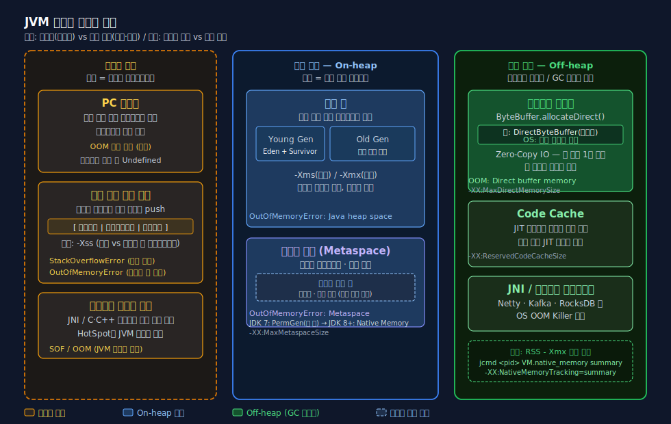
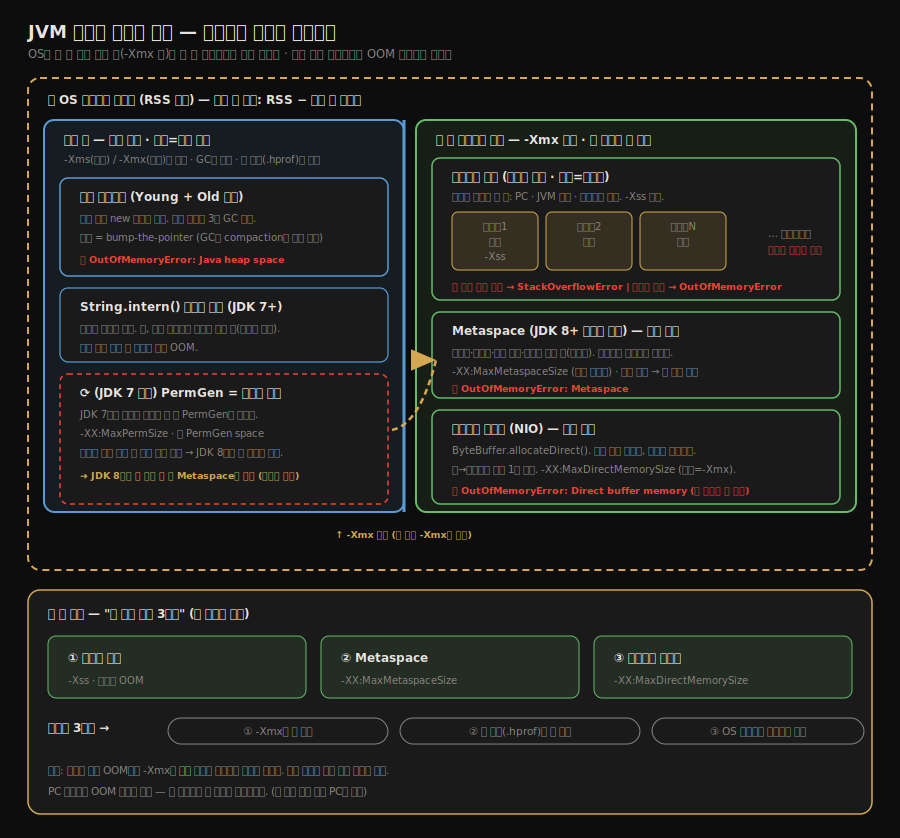
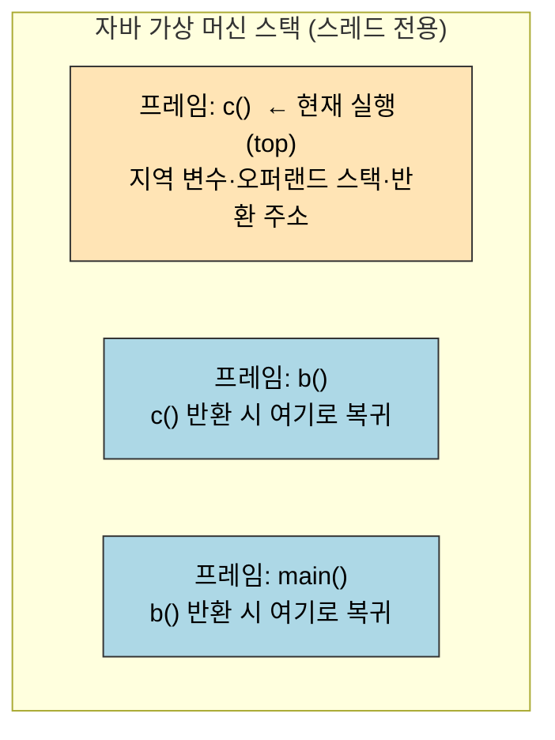
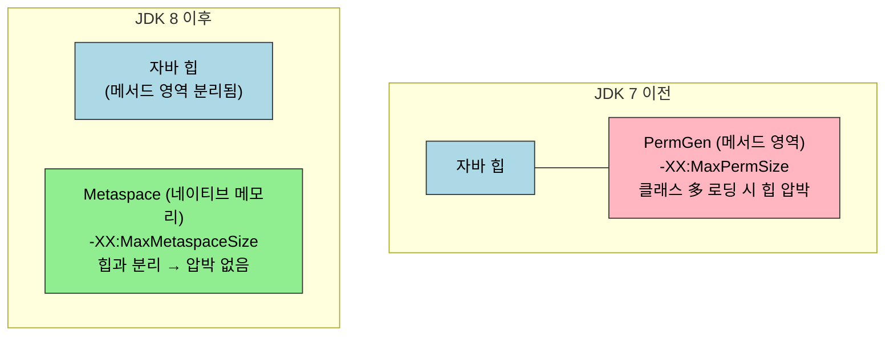

# 런타임 데이터 영역
---
> 자바 가상 머신은 실행 중에 메모리를 7개의 영역으로 나눠 관리한다. 영역마다 *수명*과 *공유 범위*가 다르며, 같은 "메모리 부족"이라도 어느 영역이 부족한지에 따라 원인과 처방이 달라진다. 
>
> 본 노트는 7개 영역(프로그램 카운터·자바 가상 머신 스택·네이티브 메서드 스택·자바 힙·메서드 영역·런타임 상수 풀·다이렉트 메모리)을 한 자리에 정리하고, 이후 노트에서 다룰 객체 레이아웃(01-02)과 OOM 재현(01-03)을 읽기 위한 좌표를 잡는다. 
>
> **자바 메모리는 '공유 범위 × 수명'의 2축으로 7개 칸으로 쪼개진 격자**이며, 어느 칸이 깨지느냐가 OOM 메시지를 가른다.


## 1. 들어가며 — 메모리 관리의 책임이 옮겨 간 이유

> C·C++ 개발자는 메모리를 자기 손으로 *지키고* 해제해야 한다. 자바 개발자는 그 책임을 가상 머신에 넘겼다.

C·C++에서는 한 객체의 수명이 *개발자의 의지*에 달려 있다. 잘 풀리면 빠르지만, `free`를 빠뜨리면 누수가 나고, 이미 해제한 메모리를 또 쓰면 use-after-free 사고가 난다. 자바는 이 책임을 가상 머신에 넘기는 *대가*로 두 가지를 얻었다. 

1. 첫째, 메모리 누수와 use-after-free 사고가 *언어 차원에서 거의 사라진다*. 
2. 둘째, GC가 동작 시점에 메모리 레이아웃을 재배치할 수 있으므로 *할당 자체의 비용이 한 자릿수 사이클 수준*까지 떨어진다 (포인터를 한 칸 미는 것으로 끝나는 경우가 많다).

대신 잃은 것도 있다. 

- 한 번 누수가 발생하면 *어느 객체가 살아 있어서 누수인지* 추적이 까다롭다. GC가 알아서 해 주리라는 믿음 때문에 개발자가 메모리 모델을 잘 모르는 상태에서도 코드가 돌아가는데, 그 상태에서 OOM이 나면 가장 곤란하다. 
- 그 신뢰를 *근거 있는 신뢰*로 바꾸기 위해 자바 가상 머신의 메모리 영역을 한 층씩 벗긴다.


## 2. 런타임 데이터 영역 — 7개 영역의 지도

> 자바 가상 머신은 메모리를 하나의 평지가 아니라 *역할이 다른 일곱 개의 구획*으로 본다.

영역은 두 축으로 나뉜다. **공유 범위**는 그 영역이 모든 스레드가 공유하는 메모리인가, 아니면 스레드마다 따로 가지는 메모리인가다. **수명**은 가상 머신 프로세스와 같이 가는가, 스레드의 라이프사이클과 묶이는가다.

| 영역 | 공유 범위 | 수명 | OOM 종류 |
|------|---------|------|----------|
| 프로그램 카운터(PC) | 스레드 전용 | 스레드 | (유일하게 OOM 명세가 없는 영역) |
| 자바 가상 머신 스택 | 스레드 전용 | 스레드 | `StackOverflowError` / `OutOfMemoryError` |
| 네이티브 메서드 스택 | 스레드 전용 | 스레드 | `StackOverflowError` / `OutOfMemoryError` |
| 자바 힙 | 전체 공유 | 가상 머신 | `OutOfMemoryError: Java heap space` |
| 메서드 영역 (HotSpot 8+ Metaspace) | 전체 공유 | 가상 머신 | `OutOfMemoryError: Metaspace` |
| 런타임 상수 풀 (메서드 영역의 일부) | 전체 공유 | 가상 머신 | 메서드 영역과 함께 발생 |
| 다이렉트 메모리 | 전체 공유 (JVM 힙 외부) | 가상 머신 | `OutOfMemoryError: Direct buffer memory` |

같은 정보를 '공유 범위 × 수명' 격자로 다시 그리면 7개 영역이 어디로 모이는지 한눈에 보인다.





위 칸 셋(베이지)은 *스레드 단위로 만들었다 지웠다* 한다. 아래 칸 넷(파스텔 블루·그린)은 *가상 머신이 시작될 때 잡혀서 끝날 때까지* 살아 있다. 다이렉트 메모리만 *JVM 힙 외부의 네이티브 메모리*라 색을 따로 칠해 구분했다 — `-Xmx`로 조절되지 않는 유일한 영역이다.

표만 봐도 01-03의 OOM 예제가 *왜 7개 종류로 나뉘는지* 짐작된다. 영역마다 한계가 다르고, 한계에 부딪히는 방식도 다르기 때문이다.

### 2.1 프로그램 카운터 (PC 레지스터)

> 가장 작고 가장 단순한 영역이지만, *멀티 스레드 자바*의 정체성이 이 영역에 들어 있다.

프로그램 카운터는 현재 실행 중인 바이트코드 명령어의 주소를 가리킨다. 자바 코드를 한 줄씩 따라갈 때 *다음에 어느 명령을 실행할지* 가리키는 포인터다. 분기·점프·메서드 호출·예외 처리 같은 흐름 제어 명령은 모두 이 카운터를 갱신해서 동작한다.

스레드마다 따로 가지는 이유는 분명하다. 두 스레드가 동시에 자바 코드를 실행하려면 각 스레드가 *자기가 어디까지 갔는지*를 따로 기억해야 한다. 자바 가상 머신의 멀티스레드는 한 시점에 한 코어가 한 스레드만 실행하는 *시분할* 방식이라, 스레드가 전환될 때 *이전에 어디까지 갔는지*를 복원해야 다음 명령을 정확히 이을 수 있다. 이 복원 정보가 곧 프로그램 카운터다.

네이티브 메서드를 실행 중일 때 이 카운터 값은 정의되지 않는다(`Undefined`). 자바 바이트코드가 아닌 OS 네이티브 코드를 도는 동안에는 자바 가상 머신이 명령어 단위로 관여하지 않기 때문이다.

이 영역은 자바 가상 머신 명세에서 *OOM 조건이 명시되지 않은 유일한 영역*이다. 한 스레드의 카운터 한 칸이면 충분하므로 메모리가 부족할 일이 없다.

### 2.2 자바 가상 머신 스택

> 자바 메서드 실행의 메모리 모델 그 자체다.

각 자바 메서드는 호출 시점에 **스택 프레임**(Stack Frame)을 하나 만들어 자바 가상 머신 스택에 푸시한다. 프레임에는 그 메서드가 쓰는 *지역 변수 테이블*, *오퍼랜드 스택*, *동적 링크 정보*, *메서드 반환 주소*가 들어 있다. 메서드가 호출되면 프레임이 푸시되고, 반환되면 팝된다. 이 push/pop의 누적이 곧 콜 스택이다.

메서드 호출이 깊어질수록 프레임이 어떻게 쌓이는지 보면 다음과 같다. 가장 최근에 호출된 메서드의 프레임이 스택 맨 위에 있고, 반환되면 그 프레임부터 팝된다.



지역 변수 테이블은 컴파일 시점에 *슬롯 수가 확정*된다. 각 슬롯은 `long`·`double`을 제외하면 32비트다. 그래서 `int`, `boolean`, `short`, `char`, `byte`, `float`, 그리고 객체 참조(`reference`)는 한 슬롯, `long`·`double`은 두 슬롯을 차지한다. 슬롯 수가 미리 정해진다는 점이 중요한데, 컴파일 시점에 *이 메서드의 스택 프레임이 몇 바이트인가*가 결정된다.

스택은 두 가지 OOM 명세를 갖는다. 한 스레드가 너무 깊게 재귀해서 *허용된 최대 깊이*를 넘어서면 `StackOverflowError`가 발생한다. 한 가상 머신이 너무 많은 스레드를 만들려 하는데 *각 스레드의 스택을 위한 메모리*가 부족하면 `OutOfMemoryError`가 발생한다. 둘 다 01-03 OOM 재현에서 코드로 재현한다.

스택 깊이를 결정하는 옵션은 `-Xss`다. `-Xss128k`처럼 스레드당 스택 크기를 작게 잡으면, 재귀 호출이 얕은 깊이에서 곧장 `StackOverflowError`로 떨어진다. 반대로 스택 크기를 키우면 한 스레드는 더 깊이 재귀할 수 있지만, 그만큼 같은 총 메모리로 만들 수 있는 스레드 수가 줄어든다. *깊이와 폭의 트레이드오프*다.

### 2.3 네이티브 메서드 스택

> JNI 등으로 호출되는 *네이티브* 메서드를 위한 별도 스택이다.

기능은 자바 가상 머신 스택과 동일하다. 다른 점은 *어떤 코드를 위한 스택인가*다. 자바 가상 머신 스택은 자바 바이트코드 메서드를, 네이티브 메서드 스택은 C/C++ 같은 네이티브 코드(JNI 함수)를 위한 호출 정보를 담는다. 어떤 가상 머신 구현은 두 영역을 *합쳐서* 운영한다 — HotSpot이 그 예다. 두 OOM 명세는 자바 스택과 동일하다.

### 2.4 자바 힙

> 자바에서 가장 큰 메모리 영역이자, GC의 무대다.

거의 모든 객체 인스턴스가 여기에 만들어진다. *모든 스레드가 공유*하고 가상 머신 시작 시 만들어져 종료될 때까지 살아 있다. 자바 힙은 *물리적으로 연속*일 필요는 없다 — 논리적으로 연속이면 충분하다. 디스크의 가상 메모리처럼 가상 머신이 운영체제에 *조각난 메모리*를 요청해 합쳐 쓰는 식이다.

자바 힙은 *세대(generation)* 로 나눌 수 있다. 신세대(Young), 구세대(Old), 그리고 자바 8 이전에는 영구 세대(PermGen)였다가 8부터 Metaspace로 옮긴 메서드 영역까지. 세대 분리는 이 절의 핵심이 아니라 3장 GC 알고리즘(02-xx)의 주제이므로 본 노트에서는 *영역의 존재*까지만 짚는다.

힙 크기는 `-Xms`(시작), `-Xmx`(최대)로 조정한다. 두 값을 같게 설정하면 가상 머신이 *시작 시점에 최대 크기를 미리 잡아 둔다* — 운영 환경에서 GC로 인한 일시 정지를 예측 가능하게 만들기 위한 정착된 기법이다.

힙이 가득 차서 더 할당할 수 없고 GC로도 회수할 수 없으면 `OutOfMemoryError: Java heap space`가 발생한다 (01-03 OOM 재현에서 재현).

### 2.5 메서드 영역

> 클래스 정보, 메서드 코드, 정적 변수, 상수 풀이 사는 곳이다.

자바 가상 머신 명세는 *논리적 개념*으로 메서드 영역을 정의하고, 어떤 구현이 어디에 둘지는 구현 자유에 맡긴다. HotSpot의 역사가 흥미롭다. JDK 7까지는 메서드 영역이 *영구 세대(PermGen)* 라는 이름으로 자바 힙 안에 있었다. JDK 8부터는 영구 세대가 사라지고 **Metaspace** 라는 새 영역이 *네이티브 메모리*에 만들어졌다. 두 변화의 의미는 다음 두 가지다.

| 항목 | JDK 7 이전 (PermGen) | JDK 8 이후 (Metaspace) |
|------|--------------------|----------------------|
| 위치 | 자바 힙 내부 | 네이티브 메모리 (OS 힙) |
| 최대 크기 | `-XX:MaxPermSize` | `-XX:MaxMetaspaceSize` (기본 무제한) |
| OOM 메시지 | `PermGen space` | `Metaspace` |
| 영향 | 클래스 다수 로딩 시 자바 힙 압박 | 자바 힙과 분리되어 압박 없음 |
| String.intern() 위치 | 영구 세대 | 자바 힙 (JDK 7부터 이미 이동) |

메서드 영역이 어디에 사느냐가 JDK 8을 기준으로 바뀐다. 위치가 자바 힙 *안*에서 *밖*(네이티브 메모리)으로 옮겨 간 것이 핵심이며, 이 때문에 한계 옵션과 OOM 메시지가 모두 달라진다.



이 변화 때문에 01-03의 메서드 영역 OOM 재현 코드는 **JDK 8 미만이면 PermGen, 8 이상이면 Metaspace** 라는 두 시나리오를 구분해야 한다. JDK 21 환경이면 `-XX:MaxMetaspaceSize=10m` 같은 옵션을 줘서 인위적으로 한계를 만들어야 OOM이 재현된다.

### 2.6 런타임 상수 풀

> 클래스 파일의 상수 풀이 *런타임 메모리*로 올라온 영역이다.

`.class` 파일 안에는 클래스 버전·필드·메서드 같은 메타데이터와 함께 *상수 풀(Constant Pool)* 이 들어 있다. 상수 풀은 컴파일 시점에 만들어진 *리터럴*과 *심벌 참조*(클래스명·메서드명·필드명·서술자)를 담는다. 클래스가 로드되면 이 상수 풀이 메서드 영역의 한 부분인 **런타임 상수 풀**로 옮겨진다.

런타임 상수 풀은 *동적*이라는 점이 클래스 파일 상수 풀과 다르다. `String.intern()` 같은 메서드로 *런타임에 새 상수*를 추가할 수 있다. 이 동적 추가가 무한히 일어나면 메서드 영역 OOM이 발생한다 (01-03 OOM 재현에서 재현). JDK 7부터는 `intern()`이 추가하는 문자열의 *실체*가 자바 힙으로 이동했지만, *참조 등록부*는 여전히 런타임 상수 풀이라는 점이 헷갈리기 쉽다.

### 2.7 다이렉트 메모리와 Off-heap

> 자바 가상 머신 명세에는 *없는* 영역이지만, 실무에서 OOM의 주범이 되는 영역이다.

다이렉트 메모리는 자바 힙도 메서드 영역도 아닌 *순수 네이티브 메모리*다. NIO의 `ByteBuffer.allocateDirect()` 가 호출되면 JVM은 OS에 직접 메모리를 요청해 받은 버퍼를 자바 힙 안에는 *참조 객체(DirectByteBuffer)* 만 두고 실제 데이터는 네이티브 메모리에 둔다. 그 결과 OS 파일 IO·소켓 IO에서 *자바 힙 → 네이티브 메모리* 복사를 한 번 줄일 수 있다 — 그게 다이렉트 메모리의 존재 이유다.

여기서 *왜 복사가 생기고, 왜 다이렉트 메모리는 그것을 생략하는가*를 한 단계 더 들어가야 한다. 핵심은 **OS의 파일·소켓 IO는 네이티브 메모리에서만 일어나고, 자바 힙 객체는 GC가 *움직인다*는 두 사실의 충돌**이다.

- 일반 힙 `ByteBuffer`로 IO를 하면, OS가 그 데이터를 읽는 도중에 GC가 그 버퍼를 *다른 자리로 옮겨* 버릴 수 있다(컴팩션). 그러면 OS가 보던 주소가 깨진다. 그래서 JVM은 안전하게 *힙 데이터를 네이티브 임시 버퍼로 한 번 복사*한 뒤, 그 고정된 네이티브 주소로 IO를 한다. 이 복사가 매 IO마다 붙는다.
- 다이렉트 메모리는 데이터가 *처음부터 네이티브에 있고 GC가 건드리지 않으므로* 주소가 고정이다. OS가 그 자리에서 바로 IO 하면 되니, 위의 복사 단계가 통째로 사라진다. 이것이 **Zero-Copy**이고, IO 집약 라이브러리(Netty·Kafka 등)가 다이렉트 메모리를 적극 쓰는 이유다.

즉 "C라서 따로 둔다"가 아니라 — *OS IO가 일어나는 네이티브 자리에 데이터를 미리 놓아, GC 이동으로 인한 복사를 없애려고* 네이티브에 두는 것이다. 부가 효과로 GC 대상이 아니라 stop-the-world 영향도 받지 않고, 수 GB 버퍼도 GC 부담 없이 다룰 수 있다(§On-heap vs Off-heap에서 정리).

문제는 이 영역이 *자바 가상 머신의 OOM 명세에 들어 있지 않다*는 점이다. `-Xmx`로 자바 힙을 줄여도 다이렉트 메모리는 그 한계와 무관하다. 한계는 `-XX:MaxDirectMemorySize`로 설정하며, 설정하지 않으면 기본값이 `-Xmx`와 같다. 한계를 넘으면 `OutOfMemoryError: Direct buffer memory`가 발생한다 (01-03 OOM 재현에서 재현).

운영 환경에서 다이렉트 메모리 OOM이 까다로운 이유는 *힙 덤프(`.hprof`)에는 잡히지 않는다*는 점이다. 자바 힙이 충분히 여유로운 상태에서도 다이렉트 메모리가 차서 OOM이 날 수 있으며, 힙 덤프를 분석하면 "메모리가 충분한데 왜 죽었지?"라는 인상을 받는다. 진단할 때는 *프로세스 RSS와 자바 힙 사용량의 차이*를 보는 게 첫 단서다.

#### On-heap vs Off-heap 전체 지도

다이렉트 메모리는 더 넓은 **Off-heap(네이티브 메모리)** 의 일부다. JVM 프로세스가 점유하는 메모리를 전체 조망하면 다음과 같다.

| 구분 | 영역 | 조정 옵션 | OOM 메시지 |
|------|------|----------|-----------|
| **On-heap** | 자바 힙 (Young + Old) | `-Xms` / `-Xmx` | `Java heap space` |
| **Off-heap** | Metaspace (클래스 메타데이터) | `-XX:MaxMetaspaceSize` | `Metaspace` |
| **Off-heap** | Direct Memory (`ByteBuffer.allocateDirect`) | `-XX:MaxDirectMemorySize` | `Direct buffer memory` |
| **Off-heap** | Code Cache (JIT 기계어) | `-XX:ReservedCodeCacheSize` | (드묾, 컴파일 중단) |
| **Off-heap** | JNI / 네이티브 라이브러리 | OS 레벨 | (OS OOM Killer) |

```
OS Native Memory
├── Direct Memory       ← ByteBuffer.allocateDirect()
├── Metaspace           ← 클래스 메타데이터 (Java 8+)
├── Code Cache          ← JIT 컴파일된 기계어
├── JNI / Native Libs   ← Netty, RocksDB, Kafka 등
└── JVM 내부 자료구조

Java Heap (On-heap)
├── Young Gen
└── Old Gen
```

Off-heap을 쓰는 이유는 세 가지다. 첫째, **GC 회피** — 힙 객체는 GC stop-the-world에 걸리지만 Off-heap 데이터는 GC 대상이 아니라 영향을 받지 않는다. 둘째, **Zero-Copy** — OS 소켓·파일 IO와 데이터를 주고받을 때 힙 복사 단계를 생략할 수 있다. 셋째, **대용량** — 수 GB~수십 GB 버퍼를 GC 부담 없이 다룰 수 있어 Netty·Kafka·RocksDB 같은 라이브러리가 적극 활용한다.

#### Off-heap 해제와 누수

Off-heap 메모리는 **GC가 직접 회수하지 않는다.** `DirectByteBuffer` 참조 객체가 GC로 수거될 때 `Cleaner`(PhantomReference 기반)가 연결된 네이티브 메모리를 해제하는 방식이다. 따라서 힙 GC가 늦게 일어나면 네이티브 메모리 해제도 늦어져 누수처럼 보이는 상황이 생긴다.

누수가 의심될 때 진단 순서:
1. 프로세스 RSS와 `-Xmx` 차이 확인 — RSS가 훨씬 크면 Off-heap 쪽 문제
2. `jcmd <pid> VM.native_memory summary` — Direct/Metaspace/Code Cache 사용량 출력
3. `-XX:NativeMemoryTracking=summary` JVM 옵션으로 상세 추적 활성화

## 3. 7개 영역 한 줄 요약

영역의 정체성을 한 줄씩 잡아 두면 01-02(객체 레이아웃)·01-03(OOM 재현)·02-xx(GC)를 읽을 때 좌표가 흔들리지 않는다.

- **PC 카운터**: 이 스레드가 *어디까지 실행했는지*. 항상 작다.
- **자바 가상 머신 스택**: 이 스레드의 *메서드 호출 누적*. 깊이 vs 폭 트레이드오프.
- **네이티브 메서드 스택**: 같은 역할의 *네이티브* 버전. HotSpot은 자바 스택과 합침.
- **자바 힙**: 모든 객체의 집. GC의 무대. `-Xms` / `-Xmx`.
- **메서드 영역**: 클래스·메서드·정적 변수. 8부터 Metaspace로 이동.
- **런타임 상수 풀**: 메서드 영역의 일부. 동적으로 자라남.
- **다이렉트 메모리**: JVM 힙 밖. NIO 영역. 힙 덤프에 안 잡힘.

## 4. 다음 노트로의 연결

01-02는 *객체 하나가 자바 힙 안에서 어떤 모양으로 존재하는지*를 다룬다. 01-03은 *각 영역이 어떻게 깨지는지*를 코드로 재현한다. 본 노트는 두 다음 노트를 읽기 위한 *지도* 역할이다.

## 5. 실습 연결

| 실습 | 위치 | 다루는 것 |
|------|------|---------|
| 영역별 OOM 재현 (7개 서브모듈) | `_practice/ch02-memory-area/{heap,jvm-stack,native-stack,method-area,constant-pool,direct-memory}/` | 01-03의 각 OOM 종류를 격리된 모듈에서 재현 |
| 객체 메모리 레이아웃 출력 | `_practice/ch02-memory-area/layout/` | JOL로 객체 헤더·인스턴스·패딩 바이트 출력 |

자세한 코드 박제는 01-02와 01-03 노트에서 다룬다.


## 관련 문서

- [01-02.핫스팟의 객체 들여다보기](./01-02.%ED%95%AB%EC%8A%A4%ED%8C%9F%EC%9D%98%20%EA%B0%9D%EC%B2%B4%20%EB%93%A4%EC%97%AC%EB%8B%A4%EB%B3%B4%EA%B8%B0.md) — 본 노트가 잡은 자바 힙 위에서 객체 하나가 어떤 모양으로 존재하는지
- [01-03.실전 — OutOfMemoryError 재현](./01-03.%EC%8B%A4%EC%A0%84%20%E2%80%94%20OutOfMemoryError%20%EC%9E%AC%ED%98%84.md) — 본 노트의 영역별 한계를 코드로 깨뜨리는 실습
- [02-12.마치며](./02-12.마치며.md) — 2장이 3장 GC에 거는 토대 정리
- [`../_practice/ch02-memory-area/`](../_practice/ch02-memory-area/) — 7개 영역 OOM 재현 모듈 + JOL 레이아웃 출력
