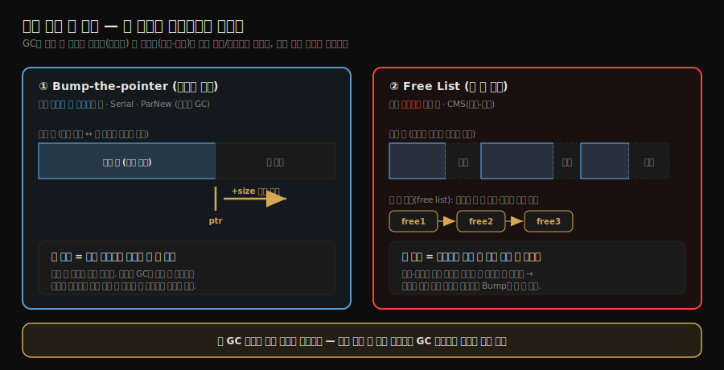
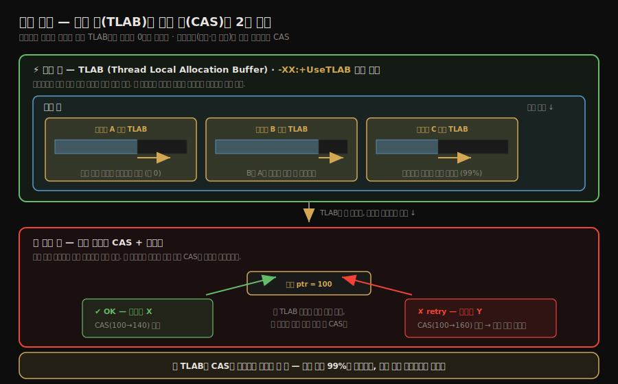
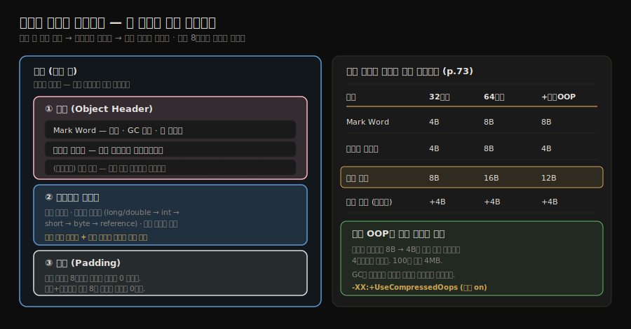
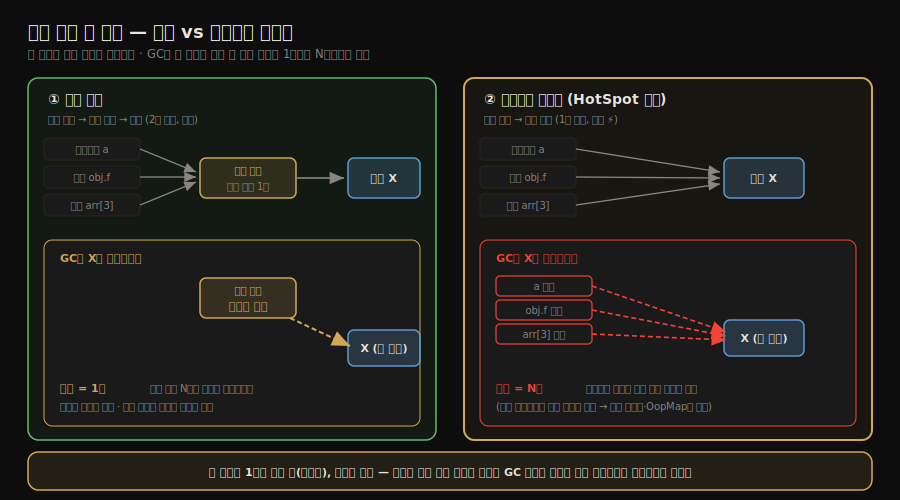
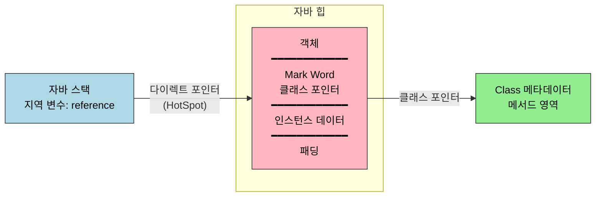

# 핫스팟의 객체 들여다보기
---
> 앞 노트(01-01)에서 본 7개 메모리 영역 중 자바 힙은 *객체의 집*이다. 객체 하나는 그 집 안에서 어떻게 만들어지고, 어떤 모양으로 자리 잡고, 외부에서 어떻게 접근되는가. 
>
> - 이 노트는 그 세 질문을 **핫스팟 가상 머신 기준**으로 한 번에 다룬다. 객체 생성, 객체의 메모리 레이아웃, 객체 접근 위치를 차례대로 정리한다. 
> - 세 절을 한 줄로 압축하면 — **객체는 생성·레이아웃·접근의 삼각으로 정의되며**, 자바 코드 한 줄 `Foo f = new Foo()`가 세 단계 모두를 동시에 작동시킨다.

## 1. 객체 생성 — `new` 한 줄 뒤에서 일어나는 일

> 자바에서 `new Foo()` 한 줄은 JVM 입장에서 *최소 여섯 단계의 작업*이다.

객체 생성은 다음 순서로 진행된다.

| 단계 | 하는 일 |
|------|--------|
| 1 | 클래스 로딩 점검 — 상수 풀에서 클래스의 심벌 참조를 찾아, 클래스가 로드·연결·초기화됐는지 확인. 안 됐으면 먼저 클래스 로딩 수행 |
| 2 | 메모리 크기 결정 — 클래스 로딩이 끝난 시점에 객체의 메모리 크기가 *완전히 확정*된다 |
| 3 | 메모리 할당 — 자바 힙에서 그 크기만큼을 떼어 낸다 |
| 4 | 0 초기화 — 할당된 메모리를 0(또는 null/false 등)로 채운다. 인스턴스 필드 기본값이 *언어 차원에서 보장*되는 근거 |
| 5 | 객체 헤더 설정 — Mark Word, 클래스 포인터, GC 정보를 헤더에 기록 |
| 6 | `<init>` 호출 — 생성자 본문 실행. 이 시점부터 *진짜 객체*가 된다 |

여섯 단계가 어떤 순서로 이어지는지 보면 다음과 같다. 앞 단계가 끝나야 다음으로 넘어가며, 마지막 `<init>` 이 실행되기 전까지는 필드가 0/null 인 *미완성 객체*다.


### 1.1 메모리 할당 — 두 가지 방식

> 자바 힙이 어떻게 정리돼 있는지에 따라 할당 알고리즘이 갈린다.

**Bump-the-pointer**(포인터 밀기) 방식은 자바 힙이 *연속된 공간*일 때 쓴다. 사용된 영역과 빈 영역이 명확히 나뉘어 있고, 그 경계를 가리키는 포인터를 단순히 *옆으로 밀기만* 하면 새 객체 공간이 생긴다. Serial·ParNew처럼 *압축형* GC가 도는 영역에서 쓴다.

**Free List**(빈 공간 목록) 방식은 자바 힙이 *조각조각* 사용 중일 때 쓴다. 어디가 비었는지를 별도 목록으로 관리하다가, 새 객체에 맞는 빈 칸을 찾아 그 위치를 할당한다. CMS처럼 *마크-스윕*이 도는 영역에서 쓴다.

GC가 어떤 종류인가에 따라 할당 방식이 결정된다는 점이 핵심이다. 즉 *객체 생성 코드 한 줄의 비용*조차 GC 알고리즘 선택의 영향을 받는다.

### 갈림길은 "지운 다음 *압축하느냐*"다

두 방식 다 죽은 객체를 *지우는* 것은 같다. 갈리는 지점은 *지운 다음에 무엇을 하느냐*다 — **빈 자리를 한쪽으로 몰아붙여 연속으로 만드느냐(압축), 그냥 구멍인 채로 두느냐**.

```bash
# 초기 힙:  [A][B][C][D][E]      (B·D가 죽음)

# ━━ 압축형 GC → Bump-the-pointer ━━
1. 지움:   [A][ ][C][ ][E]
2. 압축:   [A][C][E][________]   ← 살아있는 걸 한쪽으로 몰아붙임
                     ↑ 빈 공간이 "한 덩어리로 연속"
   할당:   경계 포인터를 옆으로 한 번 밀면 끝  (탐색 없음)

# ━━ 마크-스윕 GC → Free List ━━
1. 지움:   [A][ ][C][ ][E]
2. 그냥 둠: [A][구멍][C][구멍][E]   ← 압축 안 함, 구멍이 흩어진 채
   할당:   "이 구멍에 새 객체가 들어갈까?" 목록을 뒤져 맞는 칸을 탐색
```

여기서 *속도와 트레이드오프*가 흔히 거꾸로 외워지기 쉬우므로 못박는다.

- **Bump-the-pointer가 더 빠르다.** 빈 공간이 한 덩어리라 "어디 넣지?"라는 탐색이 없고 경계만 민다. 대신 그 연속 상태를 만들려고 *GC 때 압축(살아남은 객체 이사)* 비용을 낸다.
- **Free List는 더 느리다.** 새 객체마다 맞는 구멍을 *탐색*해야 한다. 대신 GC가 압축을 안 하니 *그 순간의* GC 부담은 가볍다 — 그 대가로 파편화가 쌓여 "큰 객체가 들어갈 연속 공간이 없는" 문제가 누적된다.

즉 *할당이 빠른 쪽(Bump)은 GC 압축 비용을, GC가 가벼운 쪽(Free List)은 할당 탐색 비용을* 낸다. 공짜로 빠른 쪽은 없다. 그리고 힙을 *연속으로 둘지 파편인 채 둘지*를 정하는 것이 GC이므로, **회수(GC)와 할당은 동전의 양면**이다 — 회수 방식이 곧 할당 방식을 정한다.

두 방식이 힙 위에서 어떻게 다른지 그림으로 보면 다음과 같다. 왼쪽 Bump-the-pointer는 사용 영역과 빈 영역이 경계 하나로 깔끔히 나뉘어 그 경계만 밀면 되고, 오른쪽 Free List는 죽은 객체가 남긴 구멍을 따로 목록으로 들고 다니며 맞는 칸을 찾아야 한다.



### 1.2 동시성 보장 — CAS vs TLAB

> 한 가상 머신 안에서 여러 스레드가 *동시에* 자바 힙에 객체를 만들 때 어떻게 안전하게 할당할까.

핫스팟은 두 가지 방식을 동시에 갖췄다.

- **CAS + 재시도**: 할당 포인터를 *원자적*으로 옮긴다. 두 스레드가 같은 포인터를 동시에 밀려 하면 CAS가 한 쪽만 통과시키고, 실패한 쪽은 재시도한다.
- **TLAB (Thread Local Allocation Buffer)**: 스레드마다 자바 힙의 *작은 조각*을 미리 받아 둔다. 그 조각 안에서의 할당은 *스레드 전용*이므로 동기화가 필요 없다. 조각이 다 차야만 새 TLAB을 요청하면서 한 번 동기화한다. 옵션 `-XX:+UseTLAB`로 켜고 끄며, 기본 켜짐.

TLAB는 *동시성 비용을 거의 0으로 만드는* 핵심 트릭이다. 다중 스레드 환경에서 자바의 객체 생성이 빠른 이유의 절반이 TLAB에 있다.

여기서 오해하기 쉬운 점이 하나 있다. CAS와 TLAB은 *둘 중 하나를 고르는* 경쟁 관계가 아니라, **빠른 길과 느린 길로 이어지는 2단 계층**이다. 

- 평소 할당은 거의 전부 TLAB이라는 빠른 길에서 동기화 없이 끝난다. 그런데 TLAB은 *작은 조각*이라 두 군데서 결국 공유 영역과 만난다. 하나는 조각을 다 써서 *새 TLAB 한 조각을 받아 와야 할 때*고, 다른 하나는 *조각보다 큰 객체*라 애초에 TLAB에 안 들어갈 때다. 
- 이 두 경우에만 공유 힙으로 내려가 CAS로 처리한다. 그래서 CAS는 TLAB을 대체하는 게 아니라, TLAB이 더는 감당 못 하는 가장자리를 받쳐 주는 안전망이다 — CAS가 없으면 새 TLAB 조각을 떼어 줄 방법 자체가 없다.

### TLAB을 둘러싼 세 가지 오해

TLAB은 이름과 직관 때문에 세 군데서 자주 헷갈린다. 하나씩 못박는다.

1. **동기화는 "객체마다"가 아니라 "조각 경계에서만" 일어난다.** TLAB *안에서의* 할당은 절대 동기화하지 않는다. 동기화(CAS)는 위 두 경우 — *조각을 다 써서 새 조각을 받을 때*, *조각보다 큰 객체라 공유 힙에 직접 놓을 때* — 즉 *공유 힙과 만나는 순간*에만 친다. 조각 하나에 객체 수백~수천 개가 들어가므로, 동기화 빈도가 "객체마다"에서 "조각마다"로 *수백~수천 분의 1*로 떨어진다. 이것이 "동시성 비용을 거의 0으로"의 정확한 뜻이다(0이 아니라 *조각 경계에서만*).

2. **TLAB은 힙의 일부다. 객체는 처음부터 끝까지 힙에 있고, 이동은 없다.** TLAB은 *힙 밖의 다른 저장소*가 아니라, 힙의 한 구역에 "이 범위는 A 스레드 전용"이라고 *예약 딱지*를 붙인 것이다. `new Foo()`를 하면 객체는 *그 자리(= A의 TLAB = 힙)* 에서 바로 태어난다. "조각을 떼온다"도 메모리를 어디론가 복사하는 게 아니라 *힙의 이 범위를 내 전용으로 찜한다*는 소유권 표시일 뿐이다. 그래서 목적지는 "TLAB이냐 힙이냐"가 아니라 *힙의 내 예약분이냐 공유분이냐*의 차이다 — 둘 다 힙이다.

3. **TLAB의 "전용"은 *할당*에만 적용된다. *접근*은 누구나 한다.** "Thread-Local"이라는 이름 때문에 그 안의 객체도 만든 스레드만 쓸 수 있다고 오해하기 쉽지만, 만들어진 객체는 *그냥 평범한 힙 객체*다. A의 TLAB에서 태어났다는 꼬리표는 남지 않는다. 그래서 A가 만든 객체를 B 스레드가 받아 읽고 쓰는 것은 *전혀 문제없다*(생산자–소비자 패턴이 매번 하는 일이다). 다만 여러 스레드가 그 객체를 *동시에 수정*하는 것은 TLAB과 무관한 별개의 *동시성(가시성·원자성)* 문제이고, 그것은 `volatile`·`synchronized`·`Atomic*`이 푸는 JMM 영역이다(할당 위치를 정하는 TLAB의 책임이 아니다).

> 한 줄 정리: **TLAB은 *장소*가 아니라 "힙 어디에 *놓을지* 정하는 규칙"이다.** 전용은 *만드는 순간*에만, 만들어진 객체는 공유 힙 객체. 동기화는 조각 경계에서만.

이 두 길의 갈림을 그림으로 보면 다음과 같다. 위쪽 빠른 길에서는 스레드마다 자기 TLAB 안에서 포인터만 밀고(경쟁 0), 아래쪽 느린 길에서는 두 스레드가 같은 공유 포인터를 밀다가 CAS가 한쪽만 통과시키고 다른 쪽은 재시도한다.



### 1.3 책의 HotSpot 발췌 코드

> 책은 핫스팟 C++ 소스의 *fastpath 할당 코드*를 직접 박제했다.

p.71의 `instanceKlass::allocate_instance` 발췌가 그것이다. 발췌의 핵심 흐름은 다음과 같다.

```cpp
// 핫스팟 instanceKlass.cpp 일부 (책 p.71 발췌 단순화)
instanceOop instanceKlass::allocate_instance(TRAPS) {
    int size = size_helper();                  // 1. 크기 결정
    KlassHandle h_k(THREAD, as_klassOop());
    instanceOop i;
    i = (instanceOop)CollectedHeap::obj_allocate(h_k, size, CHECK_NULL);
    if (has_finalizer_flag) {
        // finalize() 등록
    }
    return i;
}
```

- `obj_allocate` 가 내부에서 *TLAB이 있는가 → 있으면 그 안에서 bump pointer, 없으면 자바 힙 공유 영역에서 CAS*로 분기한다. 
- 이 분기를 직접 따라가 보고 싶다면 1챕터 노트(01-03)의 OpenJDK 빌드 방법으로 slowdebug 바이너리를 만들고, `instanceKlass::allocate_instance`에 브레이크포인트를 거는 게 가장 빠르다.


## 2. 객체의 메모리 레이아웃 — 한 객체는 어떤 모양인가

> 객체 하나는 세 부분으로 구성된다. *헤더*, *인스턴스 데이터*, *패딩*이다.

세 부분이 메모리에서 어떤 순서로 놓이는지 보면 다음과 같다. 헤더가 맨 앞, 그다음 실제 필드, 마지막에 8바이트 정렬을 맞추는 패딩이 붙는다. 오른쪽 표는 헤더 크기가 32비트·64비트·압축 OOP에 따라 어떻게 달라지는지를 함께 보여 준다.



### 2.1 객체 헤더

객체 헤더는 두 부분으로 나뉜다.

**Mark Word** — 객체 자체에 관한 *런타임 메타데이터*를 담는 한 워드 (32비트 JVM에선 4바이트, 64비트 JVM에선 8바이트). 다음 정보가 비트 단위로 *압축 인코딩*된다:

- 해시 코드 (객체 `hashCode()`)
- GC 세대 나이 (4비트)
- 락 플래그 (가벼운 락, 무거운 락, 편향 락 등)
- 편향 락의 경우 락을 잡은 스레드 ID

같은 워드에 *상충될 수 없는* 정보들을 모아 두는 설계다. 락이 걸려 있으면 해시 코드 영역이 락 정보로 덮이고, GC 나이가 어느 값 이상이면 다른 의미로 해석된다. 한 워드를 *상태 기반으로 재해석*하는 트릭이라 책에서도 표를 통해 비트 배치를 보여 준다.

**클래스 포인터** — 이 객체가 *어느 클래스의 인스턴스인가*를 가리키는 포인터. 64비트 JVM에서는 *압축 OOP*(`-XX:+UseCompressedOops`, 기본 켜짐) 옵션으로 8바이트 대신 4바이트로 줄인다. 압축 OOP는 객체 주소를 *8바이트 단위*로 인덱싱한다는 가정 위에서 32비트로 표현하는 기법이다.

배열 객체의 경우 헤더에 *길이 필드*가 추가로 들어간다. 일반 객체는 클래스 정보로 *크기*를 알 수 있지만, 배열은 *원소 수*가 객체마다 다르므로 따로 들고 있어야 한다.

### 2.2 인스턴스 데이터

객체의 진짜 내용물 — 인스턴스 필드들이다. 필드의 크기에 따라 자동으로 정렬된다. HotSpot의 기본 *필드 재배치(field reordering)* 규칙은 다음과 같다.

1. 같은 너비끼리 묶는다 (longs/doubles → ints/floats → shorts/chars → bytes/booleans → references).
2. 부모 클래스의 필드가 자식 클래스 필드보다 *먼저* 배치된다.
3. `-XX:+CompactFields` (기본 켜짐) 옵션 아래에서, 자식 클래스의 작은 필드는 부모 필드 사이에 *끼워 넣어* 정렬 패딩을 줄일 수 있다.

이 규칙은 *캐시 라인 친화성*과 *공간 효율*을 동시에 노린 결과다.

### 2.3 패딩

객체 전체 크기가 *8바이트의 배수*가 되도록 끝에 0 바이트를 채운다 (HotSpot은 8바이트 정렬). 헤더와 인스턴스 데이터 합이 정확히 8의 배수면 패딩은 0이다.

> **헤더가 12바이트인데 왜 8배수가 아닌가?** 8바이트 정렬은 *객체 전체*(헤더+인스턴스 데이터+패딩)에만 적용된다. 헤더 *혼자서* 8배수일 필요는 없다. 12바이트 헤더는 객체를 이루는 *부품 크기*일 뿐이고, 부족분은 인스턴스 데이터와 패딩이 마저 채워 *최종 객체 크기*만 8배수로 맞춘다.
>
> ```text
> 헤더12 + int 1개(4)      = 16  → 이미 8배수, 패딩 0
> 헤더12 + 필드 없음        = 12  → 8배수 아님 → 패딩 4 → 16
> 헤더12 + long 1개(8)     = 20  → 패딩 4 → 24
> ```
>
> 그래서 필드 없는 `new Object()`도 헤더 12 + 패딩 4 = **16바이트**가 된다. *8배수는 객체 전체에만, 헤더는 그 안의 부품*이라는 구분이 핵심이다.

p.73의 표를 단순화하면 다음과 같다.

| 구성 | 32비트 JVM | 64비트 JVM | 64비트 + 압축 OOP |
|------|-----------|-----------|-----------------|
| Mark Word | 4바이트 | 8바이트 | 8바이트 |
| 클래스 포인터 | 4바이트 | 8바이트 | 4바이트 |
| 헤더 합계 | 8바이트 | 16바이트 | 12바이트 |
| 배열 길이 (배열만) | +4바이트 | +4바이트 | +4바이트 |

- 압축 OOP가 *기본 활성*인 이유는 이 표를 보면 분명하다. 모든 객체의 헤더에서 4바이트씩 절약된다. 
- 100만 개 객체면 4MB, GC 시점에 *살아남은 객체를 옮기는 비용*까지 줄여 준다.

JOL로 위 레이아웃을 직접 출력해 볼 수 있다 (`_practice/ch02-memory-area/layout/`):

```java
import org.openjdk.jol.info.ClassLayout;

public class ObjectLayoutDemo {
    public static void main(String[] args) {
        System.out.println(ClassLayout.parseClass(Object.class).toPrintable());
        System.out.println(ClassLayout.parseClass(int[].class).toPrintable());
    }
}
```

### 2.4 Compact Object Headers — 헤더를 한 워드로 (JDK 24+)

위 표가 보여 주듯 64비트 JVM에서 헤더는 압축 OOP를 켜도 12바이트, 안 켜면 16바이트다. 데이터가 큰 객체에는 이 비용이 묻히지만, 작은 객체에는 헤더가 본체보다 크다. 

- 예컨대 `Integer`의 페이로드는 `int` 4바이트뿐인데 헤더가 12~16바이트라, 객체 하나가 16~24바이트로 부푼다. 
- 이런 작은 객체가 수억 개 쌓이는 워크로드에서는 헤더 자체가 heap의 큰 몫을 차지한다.

이를 줄이려는 것이 OpenJDK Project Lilliput의 **Compact Object Headers**다. Mark Word와 클래스 포인터를 따로 두는 대신, 클래스 포인터를 Mark Word 안에 압축 인코딩해 두 워드를 **한 워드(8바이트)로 합친다**. 

- 64비트 아키텍처에서 헤더가 96~128비트에서 64비트로 줄어, 작은 객체가 많을수록 메모리 절감이 크다. 
- 도입 경로는 JEP 450(JDK 24, experimental)에서 시작해 JEP 519(JDK 25)로 정식 기능이 됐고, 기본 활성화는 JEP 534(JDK 26 목표)로 추진 중이다.

켜는 옵션은 `-XX:+UseCompactObjectHeaders`다(JDK 24에서는 `-XX:+UnlockExperimentalVMOptions`를 함께 줘야 한다). 

- OpenJDK가 보고한 벤치마크(SPECjbb2015 등)에서는 heap 사용량과 GC 횟수가 줄었다(한 측정에서 heap 약 22% 감소, G1·Parallel GC 횟수 약 15% 감소). 
- 헤더 다만 클래스 포인터를 헤더 안에서 디코딩해야 하므로 GC 힙 순회 등에 약간의 연산이 더해진다.

헤더가 한 워드로 합쳐지면 락도 영향을 받는다. 기존 경량 락은 Mark Word를 스택의 락 레코드 포인터로 덮어써서 그동안 클래스 정보 접근이 막혔는데, compact 레이아웃은 클래스 정보를 헤더에 유지하는 방향으로 설계된다. 경량 락이 Mark Word를 어떻게 쓰는지는 [락 최적화](../ch05_efficient-concurrency/02-03.락%20최적화%20—%20스핀·제거·굵게·경량·편향.md)에서 다룬다.


## 3. 객체 접근 위치 — 핸들 vs 다이렉트 포인터

> 자바 가상 머신 명세는 "객체에 접근한다"라고만 적어 두고, 어떻게 가리킬지는 구현 자유다. 핫스팟은 두 방식 중 *다이렉트 포인터*를 택했다.

### 3.1 핸들 방식

자바 스택의 *지역 변수 참조*는 자바 힙 안의 **핸들 풀**의 한 슬롯을 가리킨다. 슬롯에는 두 포인터가 들어 있다. 그 둘이 각각 자바 힙의 인스턴스와 메서드 영역의 클래스 정보를 가리킨다.

1. *인스턴스 데이터 포인터*
2. *클래스 메타데이터 포인터*.

이중 간접 참조라 *느리지만*, 강점이 있다. GC가 객체를 *옮길 때* 핸들 슬롯 안의 인스턴스 포인터만 갱신하면 된다. 자바 스택과 다른 객체들이 가진 *모든 참조*는 핸들 슬롯을 가리키므로, 본체 위치가 바뀌어도 *외부 참조는 그대로 유지*된다.

### 3.2 다이렉트 포인터 방식 (HotSpot 채택)

자바 스택의 참조가 자바 힙 안의 *객체 본체*를 직접 가리킨다. 객체 헤더 안의 클래스 포인터를 통해 메서드 영역의 클래스 정보에 접근한다.

- 장점은 *한 번의 포인터 디리퍼런스*면 객체에 접근할 수 있다는 점이다. 자바 코드의 객체 접근은 가장 빈번한 동작이므로, 이 한 단계 차이가 누적되면 큰 성능 차이가 된다.
- 단점은 GC가 객체를 옮길 때 ***그 객체를 가리키는 모든 참조를 다 찾아 갱신***해야 한다는 점이다. 핫스팟은 이 비용을 *카드 테이블·OopMap·세대별 GC*로 줄였다. 그 결과 다이렉트 포인터 방식이 *총 비용*에서 핸들 방식보다 우세하다.

### 3.3 비교

두 방식의 GC 갱신 비용 차이를 정확히 짚으면 *갱신할 곳의 개수*다. 두 방식 다 객체가 이사 가면 주소를 고치긴 하는데, 고칠 자리가 몇 군데냐가 다르다. 

- 객체 하나를 여러 곳(지역 변수·필드·배열 원소 등)이 동시에 가리키는 게 보통인데, 다이렉트 포인터에서는 그 *모든* 참조가 본체 주소를 직접 들고 있으므로 객체가 이사 가면 N개를 전부 찾아 N개를 다 고쳐야 한다. 
- 핸들 방식에서는 본체 주소가 *핸들 슬롯 한 군데*에만 적혀 있고 바깥 참조들은 그 슬롯을 가리키므로, 슬롯 안 주소 *하나*만 고치면 바깥 N개는 손대지 않아도 된다. 게다가 "모든 참조를 다 찾아"라는 말에는 *어디에 그 참조들이 흩어져 있는지 스캔하는 비용*까지 들어간다 — 핸들은 그 스캔조차 필요 없다.

그런데도 핫스팟이 다이렉트를 택한 이유는 *빈도*다. 

- 객체 접근은 1초에 수억 번 일어나는 핫패스이고, 객체 이사(GC)는 가끔 일어난다. 자주 일어나는 접근을 한 번의 디리퍼런스로 빠르게 하고, 가끔 드는 GC 갱신 비용은 카드 테이블·OopMap으로 "참조를 빠르게 찾아내는" 기술로 깎는 쪽이 *총 비용*에서 이긴다. 
- 자주 쓰는 길을 빠르게, 가끔 쓰는 길의 비용은 도구로 상쇄하는 전형적인 트레이드오프다.

JVM이 다이렉트 포인터를 채택한 결정은 자바 가상 머신 명세에는 강제되지 않은 *구현 선택*이다. 명세 → 구현이 1:1이 아니라는 점을 보여 주는 좋은 예다.

두 방식을 나란히 그림으로 보면 갱신 비용 차이가 분명해진다. 왼쪽 핸들은 여러 참조가 슬롯 하나로 모여 GC 이사 때 슬롯 주소 1곳만 고치면 되고, 오른쪽 다이렉트는 본체를 직접 가리키는 참조 N개를 모두 찾아 고쳐야 한다. 그런데도 접근이 1번 점프로 끝나는 빠름을 택한 게 핫스팟의 선택이다.




## 4. 핵심 정리

이 노트를 한 그림으로 압축하면 다음과 같다.



- 자바 코드 한 줄(`Foo f = new Foo()`)이 만드는 효과를 메모리 레벨로 옮기면, 자바 스택의 `f` 슬롯이 자바 힙의 객체 본체를 가리키고, 그 객체는 헤더의 클래스 포인터로 메서드 영역의 `Foo.class` 정보를 가리킨다. 이 삼각 관계가 자바 객체 모델의 골격이다.


## 5. 실습 연결

| 실습 | 위치 | 다루는 것 |
|------|------|---------|
| 객체 레이아웃 출력 | `_practice/ch02-memory-area/layout/` — `ObjectLayoutDemo` | JOL로 `Object`, 원시 필드 배열, 커스텀 클래스의 헤더·인스턴스·패딩 출력 |

JOL 출력을 책 p.73 표와 비교하면, *압축 OOP가 켜져 있는지* 한눈에 확인할 수 있다. 헤더가 12바이트면 압축 켜짐, 16바이트면 꺼짐이다.


## 관련 문서

- [01-01.런타임 데이터 영역](./01-01.%EB%9F%B0%ED%83%80%EC%9E%84%20%EB%8D%B0%EC%9D%B4%ED%84%B0%20%EC%98%81%EC%97%AD.md) — 본 노트의 무대인 자바 힙·메서드 영역이 어떻게 7개 영역 안에 자리 잡는지
- [01-03.실전 — OutOfMemoryError 재현](./01-03.%EC%8B%A4%EC%A0%84%20%E2%80%94%20OutOfMemoryError%20%EC%9E%AC%ED%98%84.md) — 본 노트의 객체 레이아웃 위에서 영역별 OOM이 어떻게 발생하는지
- [02-12.마치며](./02-12.마치며.md) — 2장이 3장 GC에 거는 토대 정리
- [`../_practice/ch02-memory-area/layout/`](../_practice/ch02-memory-area/layout/) — JOL로 객체 헤더·인스턴스·패딩을 직접 출력하는 실습 모듈
