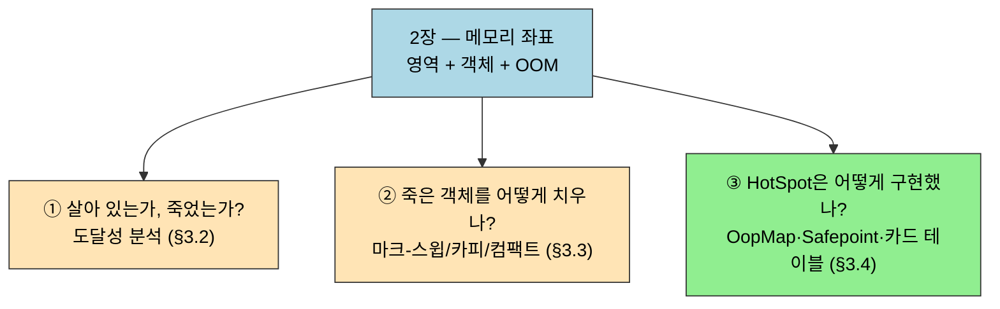

# 마치며 — 2장이 3장 GC에 거는 토대
---
> 2장의 마지막 §2.5는 짧다. 책 전체에서 2장이 어디에 자리하는지를 한 번 더 정리하고, 3장 가비지 컬렉터로 넘어가기 위한 시야를 잡는다. 2장 전체를 한 줄로 압축하면 다음과 같다 — **자바 메모리는 수명·소유·가시성의 세 축 위에 설계되어 있으며, 3장 GC는 그중 수명 축을 다루는 곡**이다. 3장의 모든 알고리즘은 "어느 객체가 아직 살아 있는가"라는 수명 판정 문제에서 출발한다.

## 1. 2장이 정의한 좌표

> 2장은 "메모리 영역이 무엇이고(지도), 객체가 어떻게 생겼으며, 각 영역이 어떻게 깨지는가"를 한 묶음으로 답했다.

§2.2가 *지도*였다면, §2.3은 *지도 위 한 점(객체)의 모양*이었고, §2.4는 *각 영역이 어떻게 깨지는가*였다. 세 절은 한 묶음으로 *자바 가상 머신의 메모리는 무엇이고, 어떻게 깨지는가*에 답한다.

이 답이 3장 가비지 컬렉터의 *전제*다. GC는 *어느 영역에서, 어떤 객체가 살아 있는가/죽었는가*를 판단하는 알고리즘이다. 그 알고리즘을 이해하려면 먼저 *영역*과 *객체*를 알아야 한다.

| 2장에서 정착시킨 것 | 3장에서 활용하는 방식 |
|-------------------|--------------------|
| 자바 힙은 *공유*되고 *가상 머신 수명* | 신세대/구세대 GC의 무대 |
| 객체 헤더의 Mark Word | GC 나이, 락 정보 인코딩 |
| 객체 헤더의 클래스 포인터 | 도달성 분석의 시작점 |
| TLAB | 신세대 빠른 할당 |
| 다이렉트 메모리는 GC 무대 밖 | GC 튜닝으로 해결 불가, NMT로 진단 |

2장이 깔아 둔 좌표가 3장 GC 의 세 질문으로 어떻게 이어지는지 보면 다음과 같다. 영역·객체·OOM 의 정의 위에서만 GC 의 수명 판정 알고리즘이 의미를 가진다.

## 2. 3장으로 가져갈 세 가지 질문

> 메모리 지도를 손에 쥔 채, 3장 가비지 컬렉션으로 넘어가며 답할 세 가지 질문을 미리 세운다.

2장을 마무리하면서 들고 갈 질문 세 가지다.

1. **이 객체는 살아 있는가, 죽었는가?** 도달성 분석(Reachability Analysis)이 답한다. §3.2의 주제.
2. **죽은 객체를 어떻게 치울 것인가?** 마크-스윕, 마크-카피, 마크-컴팩트 세 알고리즘이 답한다. §3.3의 주제.
3. **HotSpot은 이 두 답을 *어떻게* 구현했는가?** OopMap, 안전 지점(Safepoint), 안전 영역(Safe Region), 카드 테이블이 답한다. §3.4의 주제.

세 질문은 모두 *2장에서 정착시킨 객체와 영역의 정의 위에서만 의미가 있다*. 본 저장소 05_JVM에는 이 세 질문에 답하는 정독 노트가 [`./`](./)에 8편으로 이미 작성돼 있으며, [02-03.대상이 죽었는가](./02-03.대상이%20죽었는가.md)부터 시작한다. 실습 코드는 [`../_practice/ch03-gc/`](../_practice/ch03-gc/)에 컬렉터별 Gradle 모듈로 분리돼 있어, Serial·G1·ZGC·Shenandoah 등을 *옵션만 바꿔* 비교 실행할 수 있다.

## 3. 2장 노트 요약 인덱스

| 노트 | 핵심 |
|------|------|
| [01-01.런타임 데이터 영역](./01-01.%EB%9F%B0%ED%83%80%EC%9E%84%20%EB%8D%B0%EC%9D%B4%ED%84%B0%20%EC%98%81%EC%97%AD.md) | 7개 영역의 공유 범위·수명·OOM 종류 지도 |
| [01-02.핫스팟의 객체 들여다보기](./01-02.%ED%95%AB%EC%8A%A4%ED%8C%9F%EC%9D%98%20%EA%B0%9D%EC%B2%B4%20%EB%93%A4%EC%97%AC%EB%8B%A4%EB%B3%B4%EA%B8%B0.md) | 객체 생성 6단계, Mark Word·클래스 포인터·인스턴스·패딩, 다이렉트 포인터 접근 |
| [01-03.실전 — OutOfMemoryError 재현](./01-03.%EC%8B%A4%EC%A0%84%20%E2%80%94%20OutOfMemoryError%20%EC%9E%AC%ED%98%84.md) | 영역별 7개 OOM을 격리된 모듈에서 재현 |

## 4. 실습 정리

`_practice/ch02-memory-area/` 아래 7개 서브모듈이 §2.4의 7개 OOM을 격리한다. 각 모듈은 *해당 영역의 OOM만* 발생시키므로, 어느 영역이 부족했는지를 메시지로 정확히 가른다. 운영 환경에서 OOM 진단의 첫 단계는 *어느 영역의 OOM인가*를 가리는 일이며, 본 실습이 그 감각을 만든다.

## 관련 문서

- [01-01](./01-01.%EB%9F%B0%ED%83%80%EC%9E%84%20%EB%8D%B0%EC%9D%B4%ED%84%B0%20%EC%98%81%EC%97%AD.md) · [01-02](./01-02.%ED%95%AB%EC%8A%A4%ED%8C%9F%EC%9D%98%20%EA%B0%9D%EC%B2%B4%20%EB%93%A4%EC%97%AC%EB%8B%A4%EB%B3%B4%EA%B8%B0.md) · [01-03](./01-03.%EC%8B%A4%EC%A0%84%20%E2%80%94%20OutOfMemoryError%20%EC%9E%AC%ED%98%84.md) — 본 마치며가 묶는 2장의 세 정독 노트
- [`./02-03.대상이 죽었는가.md`](./02-03.대상이%20죽었는가.md) — 2장이 깔아 놓은 좌표 위에서 시작하는 3장의 첫 노트(도달성 분석)
- [`../_practice/ch02-memory-area/`](../_practice/ch02-memory-area/) — 본 장 7개 OOM 재현 모듈
- [`../_practice/ch03-gc/`](../_practice/ch03-gc/) — 3장 GC 컬렉터별 비교 실행 모듈, 본 장 실습을 마친 직후 옮겨 갈 자리
