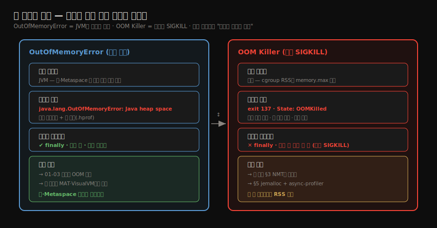
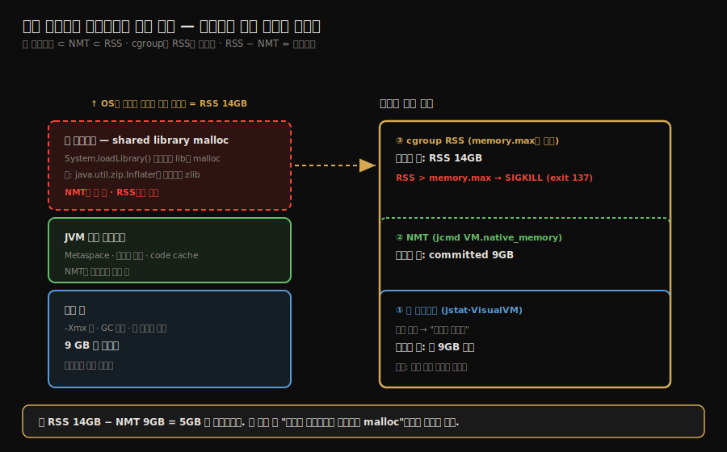
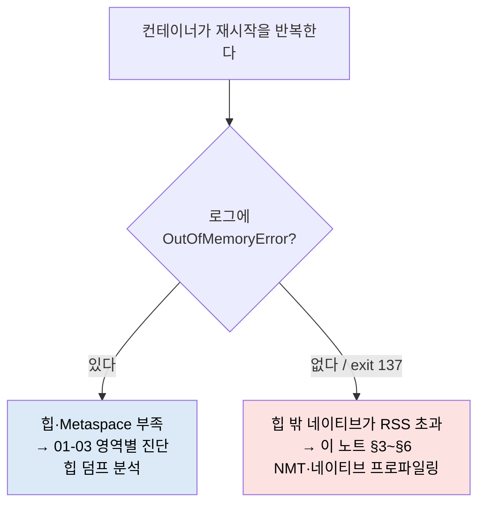
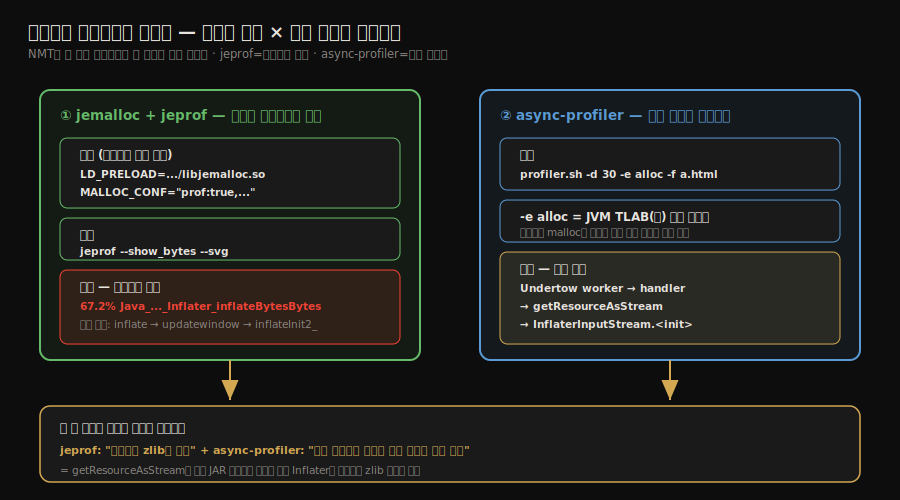

# 실전 — Docker 컨테이너 네이티브 메모리와 OOMKilled
---
> 01-03에서는 JVM이 영역별로 *어떤 OutOfMemoryError를 던지는가*를 재현했다. 이 노트는 그 대칭점을 다룬다 — **JVM이 아무 예외도 던지지 않고 컨테이너가 죽는** OOM이다. 힙은 한도 안에서 멀쩡한데 Docker/K8s가 Pod를 SIGKILL로 강제 종료하고 exit code 137만 남긴다. 원인은 단 하나의 사실에 있다: **개발자가 보는 메모리(힙)와 cgroup이 보는 메모리(RSS)는 다르다.** 이 노트는 Philip Park의 Docker 네이티브 메모리 삽질기 2부작을 단서 → 가설 → 증거 → 범인 → 해결 순서로 따라가며, 힙 밖 네이티브 누수를 컨테이너 안에서 실제로 잡아내는 진단 루프를 정리한다.


## 1. 힙 밖의 메모리 — JVM 메모리는 힙만이 아니다

> `-Xmx`로 힙을 잡았다고 JVM 메모리를 다 잡은 게 아니다. 힙 밖 네이티브 영역이 RSS를 밀어 올린다.

01-01에서 자바 메모리를 7개 런타임 데이터 영역으로 나눴다. 그 지도를 *컨테이너 관점*으로 다시 접으면 두 덩어리가 된다. 하나는 GC가 관리하고 `-Xmx`가 한도를 정하는 **힙**이고, 다른 하나는 OS `malloc`/`mmap`으로 잡히고 GC가 손대지 않는 **네이티브(off-heap)** 다. 힙이 아무리 건강해도 네이티브가 부풀면 프로세스가 실제로 점유하는 물리 메모리는 계속 커진다.

네이티브 영역이 위험한 이유는 자동 회수가 없다는 점이다. 힙은 GC가 도달 불가 객체를 걷어내지만, 네이티브 메모리는 해당 자원을 명시적으로 닫거나 `Cleaner`가 뒤늦게 정리할 때까지 남는다. 그래서 네이티브가 고갈되면 자바는 `OutOfMemoryError`를 던지는 게 아니라, OS의 OOM Killer에게 먼저 죽는 일이 흔하다.

컨테이너 관점에서 힙 밖 네이티브를 구성하는 항목과 한도 옵션은 다음과 같다. 각 항목이 *RSS로 잡히는 실제 물리 메모리* 라는 점이 핵심이다.

| 영역 | 무엇을 담나 | 한도 옵션 | 왜 커지나 |
|------|------------|-----------|-----------|
| Metaspace | 클래스 메타데이터 | `-XX:MaxMetaspaceSize` | 동적 클래스 생성·클래스로더 누수 |
| Thread Stack | 스레드별 호출 스택 | `-Xss` (기본 ~1MB) | 스레드 수 × 스택 크기 |
| Code Cache | JIT 컴파일된 기계어 | `-XX:ReservedCodeCacheSize` | 핫 메서드 누적 |
| GC 구조 | 카드 테이블·마킹 비트맵 | (GC 종류에 따름) | G1이 serial보다 많이 예약 |
| Direct ByteBuffer | NIO off-heap 버퍼 | `-XX:MaxDirectMemorySize` | `allocateDirect()` 미회수·재사용 실패 |
| Symbol Table | 문자열·상수 풀 | `-XX:StringTableSize` | intern 남용 |
| JNI 네이티브 라이브러리 | `System.loadLibrary()` 로드 lib | (직접 한도 없음) | 라이브러리 내부 `malloc` |

이 표에서 마지막 두 줄, 특히 **JNI 네이티브 라이브러리**가 이 노트의 사고와 직결된다. JVM이 직접 관리하지 않는 이 영역이 뒤에서 조용히 자라 컨테이너를 터뜨린다. 각 영역의 원리와 OOM 재현은 01-01·01-03에 있으므로 여기서는 반복하지 않고, "그래서 컨테이너에서 어떻게 터지는가"로 바로 넘어간다.


## 2. cgroup은 RSS를 본다 — OOM Killer vs OutOfMemoryError

> JVM은 힙과 자기가 추적하는 네이티브만 본다. cgroup은 RSS 전체를 보고, RSS가 한도를 넘으면 예외 없이 SIGKILL한다.

Docker와 쿠버네티스는 Linux cgroup으로 메모리를 제한한다. 문제는 JVM과 cgroup이 *다른 것을 센다*는 데 있다. JVM은 힙과 자기가 추적하는 네이티브 할당만 인지하고, cgroup은 프로세스가 실제로 점유한 물리 메모리 전체, 즉 **RSS(Resident Set Size)** 를 감시한다. RSS에는 힙뿐 아니라 §1의 모든 네이티브 영역과 JVM이 못 보는 라이브러리 `malloc`까지 전부 포함된다.

RSS가 cgroup `memory.max`를 넘으면 커널은 "Memory cgroup out of memory" 신호를 받아 프로세스를 SIGKILL로 즉시 죽인다. 이때 자바 코드에는 어떤 기회도 주어지지 않는다. `try-finally`도, 종료 훅도, 로그 한 줄도 남기지 못하고 프로세스가 사라진다. 컨테이너는 exit code 137(128 + 9, SIGKILL)로 종료되고 K8s는 `OOMKilled` 상태를 찍는다.

이 두 종류의 죽음을 구별하는 것이 진단의 출발점이다.

- **OutOfMemoryError**: JVM이 힙·Metaspace 등 *자기가 관리하는* 영역이 부족하다고 던지는 자바 예외다. 스택 트레이스가 찍히고, `-XX:+HeapDumpOnOutOfMemoryError`로 힙 덤프도 남긴다.
- **OOM Killer(SIGKILL)**: cgroup RSS 초과로 *커널이* 프로세스를 죽이는 것이다. 자바 예외도 힙 덤프도 없고, exit 137과 `OOMKilled`만 남는다.





증상만 봐도 갈래가 갈린다. 로그에 `java.lang.OutOfMemoryError`가 찍혔으면 힙/Metaspace 문제이므로 01-03의 영역별 진단으로 간다. 반대로 로그에는 아무것도 없는데 컨테이너가 exit 137로 재시작을 반복하면, 그것은 힙 밖 네이티브가 RSS를 밀어 올린 것이다. 이 노트는 후자를 추적한다.




## 3. NMT로 좁히기 — 그리고 NMT의 한계

> NMT는 JVM 내부 네이티브 할당을 영역별로 보여 준다. 그러나 shared library 할당은 못 봐, RSS와 NMT committed 사이 갭이 곧 사각지대다.

exit 137을 만났으면 먼저 힙 밖 어디가 부푸는지 좁혀야 한다. 첫 도구는 Native Memory Tracking이다. `-XX:NativeMemoryTracking=detail`(또는 `summary`)로 JVM을 띄우면, `jcmd`로 언제든 영역별 네이티브 사용량을 조회할 수 있다. 오버헤드는 5~10% 수준이다.

시간에 따른 변화를 보려면 baseline을 잡고 diff를 뜬다.

```bash
# 기준점 수립
jcmd <pid> VM.native_memory baseline

# 일정 시간 뒤 변화량 비교
jcmd <pid> VM.native_memory summary.diff
```

여기까지는 유용하지만, NMT에는 결정적 한계가 있다. NMT는 HotSpot(바이트코드를 실행하는 C++ 엔진)의 일부라, **JVM 자신이 할당한 네이티브만** 추적한다. `System.loadLibrary()`로 로드된 shared library — 서드파티 확장이든 JDK가 함께 배포하는 네이티브 라이브러리든 — 가 내부에서 부르는 `malloc`은 NMT의 시야 밖이다.

그래서 무한히 자라는 네이티브 누수는 보통 NMT로 안 잡힌다. 이 사고에서도 그랬다. NMT는 committed 약 9GB를 보고했는데 컨테이너 RSS는 약 14GB였다. **5GB가 NMT에 안 잡히는 사각지대**였고, 이 갭 자체가 "범인은 라이브러리 `malloc`이다"라는 결정적 단서였다. NMT 이론의 상세 — 영역별 reserved/committed 해석, shared library 불가시성의 구조적 이유 — 는 정독 노트 08-02에 있으므로 거기로 위임하고, 여기서는 "NMT committed ≪ RSS면 라이브러리 네이티브를 의심한다"는 진단 규칙만 챙긴다.

> RSS와 NMT committed의 갭을 진단 신호로 쓴다. working set 14GB인데 NMT가 9GB만 committed라 하면, 나머지 5GB는 JVM이 아니라 네이티브 라이브러리가 쓰는 것이다.


## 4. 범인 — 암묵적 Inflater와 네이티브 zlib 누수

> 스트림을 닫지 않은 게 화근이었다. 압축된 JAR 엔트리를 읽으면 암묵적으로 Inflater가 생기고, 그게 네이티브 zlib 버퍼를 잡는다.

사각지대의 정체는 평범한 코드에 있었다. 리소스를 읽고 스트림을 닫지 않은, 어디서나 보는 패턴이다.

```java
// 문제 코드 — in.close()가 없다
InputStream in = getClass().getResourceAsStream("/leak-payload.bin");
byte[] buf = new byte[8192];
while (in.read(buf) != -1) {
    // ... 소비 ...
}
// in.close() 미호출
```

핵심은 JAR 엔트리가 DEFLATE로 압축돼 있을 때다. 이 경우 `getResourceAsStream`은 내부적으로 `java.util.zip.Inflater`를 만들고, 그 `Inflater`는 플랫폼 네이티브 zlib 버퍼를 할당한다. 스트림을 닫지 않으면 이 네이티브 버퍼가 `Inflater` 객체가 GC될 때까지 살아남는다. `Inflater` 객체 자체는 아주 작아서 큰 힙에서는 old 영역으로 승급돼 full GC 전까지 수시간 머문다. 그동안 네이티브 zlib 버퍼는 계속 쌓인다.

기술적으로는 영구 누수가 아니다(언젠가 `Cleaner`가 정리한다). 그러나 **누수의 모든 외양**을 갖는다 — 힙은 멀쩡한데 RSS만 끝없이 오른다. 그리고 결과는 exit code 137, `OOMKilled=true`, 그런데 `OutOfMemoryError` 메시지는 0건이다. §2에서 예고한 정확히 그 죽음이다.


## 5. 네이티브 프로파일링 — jemalloc/jeprof와 async-profiler 이중창

> NMT가 못 보는 네이티브를 두 도구로 좁힌다. jemalloc은 "무엇이 네이티브를 쓰나"를, async-profiler는 "어느 자바 코드가 유발했나"를 짚는다.

NMT가 못 보는 영역이니, 네이티브 층까지 내려가는 도구가 필요하다. 두 도구를 겹쳐 쓰면 서로의 사각을 메운다.

### 5.1 jemalloc + jeprof — 무엇이 네이티브를 쓰나

`jemalloc`을 `LD_PRELOAD`로 끼워 넣으면 `malloc` 호출을 가로채 힙 프로파일을 남긴다. 컨테이너에서는 환경 변수로 설정한다.

```dockerfile
ENV LD_PRELOAD=/opt/jemalloc/lib/libjemalloc.so
ENV MALLOC_CONF="prof:true,lg_prof_interval:24,prof_prefix:/app/jeprof/jeprof"
```

수집된 프로파일을 `jeprof`로 렌더한다.

```bash
jeprof --show_bytes --svg $(which java) /app/jeprof/jeprof.*.heap > graph.svg
```

이 사고의 결과는 명확했다. 샘플 약 390MB 중 67.2%가 `Java_java_util_zip_Inflater_inflateBytesBytes`, 16.1%가 `Java_java_util_zip_Inflater_init`에 몰렸고, 호출 사슬은 `inflate → updatewindow → inflateInit2_`였다. §4에서 지목한 네이티브 zlib이 정확히 범인으로 찍혔다. 단, jeprof는 C 레벨 심볼은 보여 줘도 JIT 컴파일된 자바 프레임은 16진수 주소로만 나온다 — "어느 자바 코드가 이걸 불렀나"는 답하지 못한다.

### 5.2 async-profiler — 어느 자바 코드가 유발했나

그 빈칸을 async-profiler가 메운다.

```bash
./profiler.sh -d 30 -e alloc -f alloc.html <pid>
```

`-e alloc`은 네이티브 `malloc`을 직접 재는 게 아니라 JVM TLAB(힙) 할당을 샘플링한다. 목적이 다르다 — "어느 자바 코드 경로가 `Inflater`를 생성했나"를 찾는 것이다. 플레임 그래프의 스택은 `Undertow worker → handler → getResourceAsStream → InflaterInputStream.<init> → byte[] 할당`으로 이어졌다. §4의 문제 코드가 그대로 스택에 박혀 있었다.

### 5.3 두 도구의 역할 분담

이 사고에서 배울 핵심은 도구 하나로는 부족하다는 점이다. jeprof는 "네이티브 zlib이 범인"이라고 말하고, async-profiler `-e alloc`은 "우리 핸들러의 리소스 읽기 코드가 그걸 유발했다"고 말한다. 둘을 이어야 네이티브 층의 증상과 자바 층의 원인이 하나의 인과로 연결된다.




## 6. 해결과 완화 실측

> 근본 해결은 try-with-resources로 스트림을 닫는 것이다. 코드를 못 고칠 땐 할당자 튜닝으로 완화하되, 무설정 jemalloc은 오히려 악화될 수 있다.

### 6.1 근본 해결 — 자원 닫기

범인이 미회수 `Inflater`였으니 처방은 스트림을 확실히 닫는 것이다. try-with-resources를 쓰면 블록을 빠져나갈 때 `close()`가 호출되고, 그 안에서 `Inflater.end()`가 네이티브 버퍼를 즉시 푼다.

```java
try (InputStream in = getClass().getResourceAsStream("/resource")) {
    // 읽기 연산
}
// 암묵적 close() — Inflater와 네이티브 버퍼를 즉시 해제
```

이 한 줄 구조 변경만으로 피크 RSS가 1,328MB에서 516MB로 떨어졌다.

### 6.2 완화 — 코드를 못 고칠 때

원인 코드가 서드파티에 있어 손댈 수 없을 때는 할당자 수준에서 완화한다. glibc `malloc`은 스레드마다 arena를 만들어 lock 경합을 줄이지만, 네이티브 메모리는 compaction되지 않아 단편화로 RSS가 부푼다. arena 수를 줄이면 단편화가 완화된다.

```bash
# glibc arena 수 제한
MALLOC_ARENA_MAX=1

# jemalloc 튜닝 — dirty page를 즉시 반환
MALLOC_CONF="narenas:2,dirty_decay_ms:0"
```

`MALLOC_ARENA_MAX`의 원리와 대형 시스템에서 단편화가 코어 수에 비례하는 이유는 08-02에 있으므로 그쪽을 참조한다.

### 6.3 실측 비교표

같은 부하에서 완화안별 피크 RSS를 재면 다음과 같다. 컨테이너 한도가 1GB라면 어느 설정이 OOM을 넘기고 어느 설정이 안전한지가 숫자로 갈린다.

| 설정 | 피크 RSS | 비고 |
|------|----------|------|
| 누수 해결 (close 호출) | 516 MB | 근본 해결 후 기준선 |
| jemalloc `narenas:2,dirty_decay_ms:0` | 1,158 MB | 할당자 튜닝으로 완화 |
| glibc `MALLOC_ARENA_MAX=1` | 1,272 MB | 환경 변수 한 줄 완화 |
| glibc 기본 | 1,292 MB | 1GB 한도에서 OOM |
| 원래 누수 (완화 없음) | 1,328 MB | 기준 문제 상태 |
| jemalloc 무설정 | 1,713 MB | 튜닝 없으면 오히려 악화 |

여기서 반직관적인 교훈이 나온다. **jemalloc을 그냥 끼우기만 하면 dirty page를 붙들고 있어 RSS가 되레 늘 수 있다.** `dirty_decay_ms:0` 같은 decay 튜닝을 함께 줘야 효과가 난다. 완화안은 워크로드마다 효과가 다르므로 추측하지 말고 실측으로 고른다.


## 7. 반드시 닫아야 하는 자원 체크리스트

> 압축 스트림은 암묵적으로 네이티브 버퍼를 잡는다. 오래 도는 서비스에서 이걸 안 닫으면 조용히 쌓인다.

이 사고의 재발 방지는 결국 자원 닫기 습관이다. 특히 압축 계열은 겉보기에 순수 자바처럼 보여도 뒤에서 네이티브를 잡는다. 다음은 명시적으로 닫아야 하는 자원이다.

- `InputStream` / `OutputStream` — 특히 `getResourceAsStream`이 돌려주는 스트림
- `Inflater` / `Deflater` — `end()` 또는 스트림 `close()`로 네이티브 zlib 해제
- `ZipFile` — 내부 네이티브 핸들 보유
- NIO `ByteBuffer.allocateDirect()` 버퍼 — 재사용·풀링으로 관리

원칙은 단순하다. 모든 스트림과 압축 객체를 try-with-resources로 감싼다. 오래 도는 서비스에서 암묵적 네이티브 할당은 소리 없이 누적되기 때문이다.


## 자주 받는 오해

**"힙이 한도 안이면 컨테이너는 안전하다"** — cgroup은 힙이 아니라 RSS를 본다. RSS = 힙 + 힙 밖 네이티브(Metaspace·스레드 스택·direct buffer·라이브러리 `malloc`)다. 힙이 `-Xmx` 안이어도 네이티브가 부풀면 RSS가 한도를 넘어 OOMKilled가 난다.

**"OOM이면 OutOfMemoryError가 찍힌다"** — cgroup RSS 초과는 커널이 SIGKILL로 죽이는 것이라 자바 예외가 없다. exit 137·`OOMKilled`만 남고 로그·힙 덤프가 없으면 힙 밖 네이티브를 의심한다.

**"NMT를 켜면 JVM 네이티브를 다 본다"** — NMT는 HotSpot 일부라 JVM 내부 할당만 본다. `System.loadLibrary()` shared library(zlib 포함)의 `malloc`은 못 본다. RSS ≫ NMT committed면 그 갭이 라이브러리 네이티브다.

**"jemalloc을 끼우면 메모리가 준다"** — 무설정 jemalloc은 dirty page를 붙들어 RSS가 오히려 늘 수 있다(실측 1,713MB). `dirty_decay_ms:0` 같은 decay 튜닝을 함께 줘야 효과가 난다.

**"Inflater를 안 닫으면 영구 누수다"** — `Cleaner`가 GC 시 `end()`를 불러 결국 해제한다. 다만 객체가 작아 old로 승급되면 full GC까지 수시간 걸려 *누수처럼 보인다*.


## 면접에서 받을 만한 질문

**Q. 힙은 한도 안인데 K8s Pod가 OOMKilled로 계속 재시작합니다. 어떻게 진단하나요?**
cgroup은 힙이 아니라 RSS를 본다. 먼저 로그에 `OutOfMemoryError`가 있는지 본다 — 없고 exit 137이면 힙 밖 네이티브 문제다. NMT(`-XX:NativeMemoryTracking`)로 JVM 네이티브를 좁히되, NMT committed가 RSS보다 한참 작으면 그 갭이 라이브러리 `malloc`이므로 jemalloc/jeprof로 네이티브 프로파일을, async-profiler `-e alloc`으로 유발 자바 코드를 찾는다.

**Q. OOM Killer와 OutOfMemoryError의 차이는?**
OutOfMemoryError는 JVM이 힙·Metaspace 등 *자기 관리* 영역 부족으로 던지는 자바 예외로, 스택 트레이스·힙 덤프가 남는다. OOM Killer는 cgroup RSS가 `memory.max`를 넘어 *커널이* SIGKILL하는 것으로, 자바 예외 없이 exit 137·`OOMKilled`만 남는다. 후자는 graceful shutdown도 로그도 없다.

**Q. 네이티브 메모리 누수를 컨테이너에서 어떻게 잡나요?**
NMT로는 안 잡히는 경우가 많다(shared library 불가시성). RSS와 NMT committed의 갭으로 라이브러리 네이티브를 의심하고, jemalloc을 `LD_PRELOAD`로 끼워 `MALLOC_CONF="prof:true"`로 힙 프로파일을 뜬 뒤 `jeprof`로 어떤 네이티브 함수가 쓰는지 본다. 흔한 원인은 압축 스트림(`Inflater`/`Deflater`) 미회수와 NIO direct buffer다. 처방은 try-with-resources, 코드를 못 고치면 `MALLOC_ARENA_MAX`·jemalloc decay 튜닝으로 완화한다.


## 관련 문서

- [`01-01.런타임 데이터 영역`](./01-01.런타임%20데이터%20영역.md) — 힙 밖 네이티브를 포함한 7개 메모리 영역 지도
- [`01-03.실전 — OutOfMemoryError 재현`](./01-03.실전%20—%20OutOfMemoryError%20재현.md) — JVM이 던지는 영역별 OOM(이 노트의 대칭점)
- [`03-01.기본 문제 해결 도구 — 명령줄 도구`](./03-01.기본%20문제%20해결%20도구%20—%20명령줄%20도구.md) — `jcmd`·`jstat` 등 진단 명령줄 도구
- [`08-02.Native Memory Tracking — NMT와 shared library 한계`](../book/jpf_java-performance/08-02.Native%20Memory%20Tracking%20—%20NMT와%20shared%20library%20한계.md) — NMT 영역별 해석·`MALLOC_ARENA_MAX` 원리·Inflater/direct buffer 이론
- [`01-06.cgroup 사례 — Endowus OOMKilled`](../../../../02_os/kernel/01-06.cgroup%20사례%20—%20Endowus%20OOMKilled.md) — RSS vs 힙·`MaxRAMPercentage`로 Pod limit 산정하는 cgroup 사례
