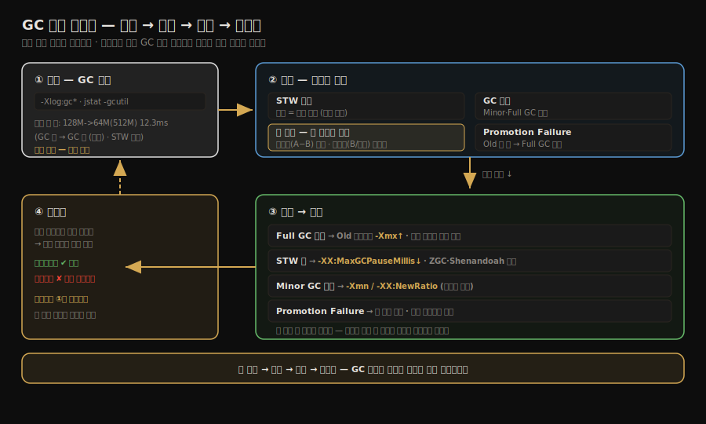

# GC 운영 — 로그 분석과 튜닝 파라미터
---
> 본 노트는 GC *알고리즘*이 아니라 GC *운영*을 다룬다. 정독 노트 02-01~02-07이 "어떤 알고리즘이 어떤 트레이드오프를 갖는가"를 정리했다면, 본 노트는 **운영 시점에 GC가 무엇을 말하는지를 읽는 법**(GC 로그)과 **그 결과로 무엇을 돌릴 수 있는지**(튜닝 파라미터)를 다룬다. 
>
> 본 절을 한 줄로 압축하면 — **GC 튜닝의 첫 단계는 알고리즘을 아는 일이고, 두 번째 단계는 GC 로그가 그것을 어떻게 보여 주는지를 읽는 일**이다.

## 0. 전제 — 로그를 읽기 전에 아는 개념

본 노트는 *운영*에 집중하므로 GC 개념은 한 줄씩만 짚는다. **자세한 동작은 옆 칸의 정독 노트가 SSOT다.**

| 용어 | 한 줄 정의 | 자세히 |
|------|----------|--------|
| Young / Old 세대 | 갓 만든 객체는 Young, 오래 살아남으면 Old로 | [02-03](./02-03.%EB%8C%80%EC%83%81%EC%9D%B4%20%EC%A3%BD%EC%97%88%EB%8A%94%EA%B0%80.md) |
| Minor GC / Full GC | Young만 청소 = Minor(짧음), Old까지 = Full(무거움) | [02-04](./02-04.%EA%B0%80%EB%B9%84%EC%A7%80%20%EC%BB%AC%EB%A0%89%EC%85%98%20%EC%95%8C%EA%B3%A0%EB%A6%AC%EC%A6%98.md) |
| 승격 (Promotion) | Young에서 살아남은 객체를 Old로 옮기는 것 | [02-04](./02-04.%EA%B0%80%EB%B9%84%EC%A7%80%20%EC%BB%AC%EB%A0%89%EC%85%98%20%EC%95%8C%EA%B3%A0%EB%A6%AC%EC%A6%98.md) |
| Promotion Failure | 승격하려는데 Old가 꽉 차 실패 → Full GC 유발 | [02-09](./02-09.%EC%8B%A4%EC%A0%84%20%E2%80%94%20%EB%A9%94%EB%AA%A8%EB%A6%AC%20%ED%95%A0%EB%8B%B9%EA%B3%BC%20%ED%9A%8C%EC%88%98%20%EC%A0%84%EB%9E%B5.md) |
| GC 종류 (G1·ZGC·Shenandoah 등) | 위 일을 어떤 알고리즘으로 하느냐의 차이 | [02-06](./02-06.%ED%81%B4%EB%9E%98%EC%8B%9D%20%EA%B0%80%EB%B9%84%EC%A7%80%20%EC%BB%AC%EB%A0%89%ED%84%B0.md)·[02-07](./02-07.%EC%A0%80%EC%A7%80%EC%97%B0%20%EA%B0%80%EB%B9%84%EC%A7%80%20%EC%BB%AC%EB%A0%89%ED%84%B0.md)·[02-08](./02-08.GC%20%EC%84%A0%ED%83%9D%ED%95%98%EA%B8%B0.md) |

> STW(Stop-The-World)는 §1 로그 예시 직후에 정의한다 — 로그의 마지막 숫자가 바로 STW 시간이라 그 자리에서 보는 게 자연스럽다.


## 1. GC 로그 분석

GC 문제를 진단하려면 GC 로그를 분석해야 한다. Java 9+에서는 `-Xlog:gc*` 옵션으로 통합된 로깅을 사용한다.

```bash
# GC 로그 활성화
java -Xlog:gc*:file=gc.log:time,uptime:filecount=10,filesize=10m -jar myapp.jar

# 주요 로그 항목 예시
[2.135s][info][gc] GC(0) Pause Young (Normal) (G1 Evacuation Pause) 128M->64M(512M) 12.345ms
# 의미: 2.135초 시점, Young GC, 128MB → 64MB (전체 힙 512MB), 12.345ms STW
```

위 로그의 `12.345ms STW`에서 **STW(Stop-The-World)**란 GC가 도는 동안 애플리케이션의 *모든 스레드를 잠시 멈추는 것*을 말한다. 

- 멈추는 이유는, GC가 살아 있는 객체를 식별하고 새 위치로 옮기는 사이에 애플리케이션이 그 객체를 동시에 건드리면 참조가 깨지기 때문이다. 
- 그래서 GC는 "세상을 멈춘 채" 안전하게 정리한 뒤 다시 애플리케이션을 깨운다. 이 멈춤이 곧 사용자가 체감하는 *응답 지연*이므로, STW 시간은 GC 튜닝에서 가장 먼저 보는 지표가 된다. ZGC·Shenandoah 같은 저지연 컬렉터가 노리는 것도 바로 이 STW를 서브밀리초로 줄이는 일이다.

GC 로그에서 주목해야 할 지표는 다음과 같다.

- **일시 정지 시간**: STW 지속 시간 (목표치 초과 여부)
- **GC 빈도**: Minor GC와 Full GC의 발생 간격
- **힙 사용량 변화**: GC 전후 힙 사용량으로 회수 효율 파악
- **Promotion Failure**: Old Generation 공간 부족으로 Survivor 객체 이동 실패

```bash
# jstat으로 실시간 GC 통계 확인
jstat -gcutil <pid> 1000 10  # 1초 간격으로 10회 출력

# 출력 예시
S0     S1     E      O      M      CCS    YGC    YGCT    FGC    FGCT    CGC    CGCT    GCT
 0.00  45.23  72.13  68.92  95.12  92.34     15    0.312     1    0.521     3    0.043    0.876
```

> 각 컬럼의 의미(`S0/S1`=Survivor, `E`=Eden, `O`=Old 점유율, `YGC/FGC`=Young/Full GC 횟수 등)는 [02-02.Java 성능 — JMH와 측정 방법론](./02-02.Java%20%EC%84%B1%EB%8A%A5%20%E2%80%94%20JMH%EC%99%80%20%EC%B8%A1%EC%A0%95%20%EB%B0%A9%EB%B2%95%EB%A1%A0.md) §4-2가 자세히 다룬다. 본 노트는 이 출력을 *진단에 어떻게 쓰는지*에 집중한다.


## 2. GC 튜닝 파라미터

**GC 튜닝의 기본 원칙은 측정 → 분석 → 조정의 순서를 지키는 것이다.** 

먼저 GC 로그와 프로파일링으로 문제를 정확히 파악한 뒤 파라미터를 조정한다. 이 노트 전체를 한 장으로 묶으면, §1의 로그 관측에서 시작해 지표를 읽고 증상을 진단해 처방을 적용한 뒤 다시 로그로 재측정하는 *닫힌 사이클*이 된다.



### 2.1 힙 크기 설정

```bash
# 기본 힙 크기 설정
java -Xms2g -Xmx2g -jar myapp.jar

# -Xms: 초기 힙 크기 (Xmx와 동일하게 설정하면 동적 조정 오버헤드 제거)
# -Xmx: 최대 힙 크기 (물리 메모리의 50~75% 권장)
```

- `-Xms`와 `-Xmx`를 동일하게 설정하면 힙 크기 조정에 따른 GC 오버헤드를 줄일 수 있다. 둘을 다르게 두면 JVM이 실행 중에 힙을 *늘렸다 줄였다*(동적 조정) 하는데, 늘리는 순간 OS에 메모리를 다시 요청하고 그 판단이 보통 Full GC와 함께 일어난다. 
- 어차피 최대치까지 쓰는 서버라면, 처음부터 같게 잡아 이 신축 자체를 없애는 편이 낫다. 반대로 가끔 켜는 데스크톱 앱은 안 쓸 메모리를 미리 점유하지 않도록 `-Xms`를 작게 둔다.
- 컨테이너 환경에서는 `-XX:MaxRAMPercentage`로 JVM이 컨테이너 메모리 제한을 인식하게 하는 것이 중요하다.

> **Spring 부트 앱도 같다.** 이 튜닝 옵션은 결국 `java -jar app.jar`로 뜨는 JVM에 거는 것이라, Spring 부트 실행 프로세스에 그대로 적용된다 — 보통 컨테이너로 배포하므로 `-XX:MaxRAMPercentage`로 Pod 메모리 한도를 인식시키고, 트래픽이 정상 상태에서 힙을 다 쓰는 서버 특성상 `-Xms`와 `-Xmx`를 같게 잡는 게 정석이다. 다만 *어느 객체가 GC를 압박하는가*는 순수 JVM 관점만으로는 안 보인다 — Spring 빈·세션·캐시·커넥션 풀이 흔한 출처라, 힙 덤프 분석은 [02-02.Java 성능](./02-02.Java%20%EC%84%B1%EB%8A%A5%20%E2%80%94%20JMH%EC%99%80%20%EC%B8%A1%EC%A0%95%20%EB%B0%A9%EB%B2%95%EB%A1%A0.md) §4의 도구와 함께 본다.

### 2.2 GC 선택과 주요 옵션

```bash
# G1GC 사용 (Java 9+ 기본)
java -XX:+UseG1GC \
     -Xms2g -Xmx2g \
     -XX:MaxGCPauseMillis=200 \      # 목표 최대 STW 시간 (ms)
     -XX:G1HeapRegionSize=8m \       # Region 크기 (1~32MB, 2의 거듭제곱)
     -XX:InitiatingHeapOccupancyPercent=45 \ # Concurrent Marking 시작 임계값
     -jar myapp.jar

# ZGC 사용 (저지연 요구 시)
java -XX:+UseZGC \
     -Xms4g -Xmx4g \
     -XX:MaxGCPauseMillis=10 \       # ZGC는 서브밀리초 목표 가능
     -jar myapp.jar

# GC 로그 포함
java -XX:+UseG1GC \
     -Xlog:gc*:file=gc.log:time,uptime \
     -jar myapp.jar
```

### 2.3 튜닝 체크리스트

- **Full GC 빈도가 높다**: Old Generation 크기 부족 → `-Xmx` 증가 또는 메모리 누수 확인
- **STW가 길다**: `-XX:MaxGCPauseMillis` 목표 낮추기, ZGC/Shenandoah 고려
- **Minor GC가 너무 잦다**: Young Generation이 너무 작음 → `-Xmn` 또는 `-XX:NewRatio` 조정
- **Promotion Failure**: Old Generation 공간 부족, 객체 생존율이 너무 높음 → 힙 크기 조정 또는 코드 레벨 객체 생명주기 검토

위 두 증상(Full GC 잦음·Promotion Failure)은 처방이 *힙 늘리기*와 *코드 검토*로 갈리는데, 둘을 가르는 신호는 **GC 후 저점(GC 직후 힙 사용량)이 수렴하는가**다. 

- 여러 번의 GC에 걸쳐 저점이 어느 선에서 *평평해지면* 그건 이 애플리케이션의 정상 기준 메모리(캐시·커넥션 풀처럼 오래 사는 게 당연한 객체)이므로, 힙이 그보다 작을 때 `-Xmx`를 늘리면 해결된다. 
- 반대로 저점이 *평평해질 기미 없이 계속 우상향하면* 안 쓰는 객체의 참조가 안 끊기는 **메모리 누수**이므로, 힙을 늘려도 터지는 시점만 미뤄질 뿐이다. 이때는 힙 덤프(`.hprof`)를 떠서 무엇이 회수되지 않는지 분석해야 한다. 
- 즉 *오래 사는 객체*가 곧 누수는 아니며, **수렴하면 정상·발산하면 누수**가 판단 기준이다.

GC 로그에서 본 증상이 어떤 처방으로 이어지는지 흐름으로 보면 위의 운영 사이클과 같다. 증상을 먼저 분류하고, 옵션을 바꾼 뒤, 같은 로그 지표로 다시 측정해야 한다.

## 관련 문서

- [02-06.클래식 가비지 컬렉터.md](./02-06.%ED%81%B4%EB%9E%98%EC%8B%9D%20%EA%B0%80%EB%B9%84%EC%A7%80%20%EC%BB%AC%EB%A0%89%ED%84%B0.md) — Serial/Parallel/CMS/G1 등 컬렉터별 동작
- [02-07.저지연 가비지 컬렉터.md](./02-07.%EC%A0%80%EC%A7%80%EC%97%B0%20%EA%B0%80%EB%B9%84%EC%A7%80%20%EC%BB%AC%EB%A0%89%ED%84%B0.md) — Shenandoah/ZGC의 저지연 설계
- [02-08.GC 선택하기.md](./02-08.GC%20%EC%84%A0%ED%83%9D%ED%95%98%EA%B8%B0.md) — 워크로드별 GC 선택
- [02-10.마치며.md](./02-10.마치며.md) — 3장 전체 요약과 GC 구현체 비교표
