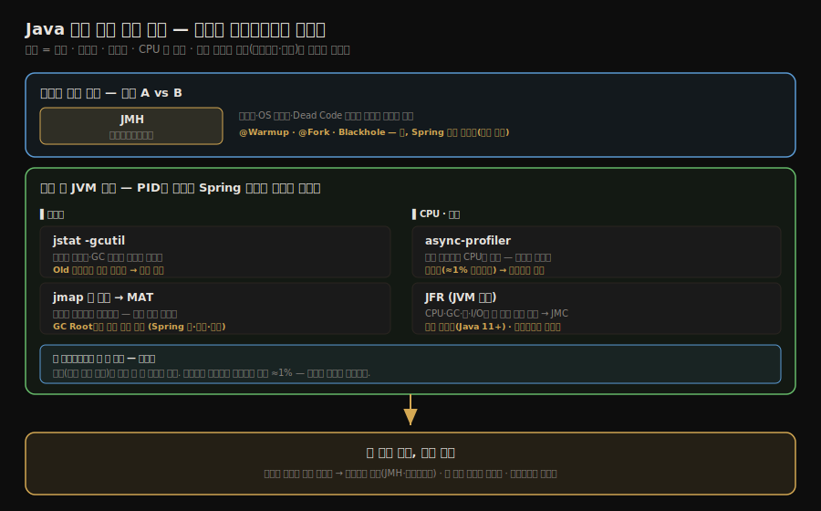

# Java 성능
---
> 성능 문제를 과학적으로 측정하고 개선하는 방법론을 이해한다.
>
> 올바른 벤치마크 작성(JMH), JVM 워밍업의 영향, 메모리/CPU 프로파일링 도구, 흔한 성능 안티패턴, 실무 최적화 체크리스트를 다룬다.
>
> **JVM에서 "성능"이라는 단어는 "*측정 가능한 단일 수치가 아니라 처리량·지연·메모리 풋프린트의 합성*"이며, 그 합성을 가르는 첫 변수는 *측정 도구를 제대로 골랐는가*다**. JMH·JFR·async-profiler 세 도구가 그 출발점이다.


## 1. 성능 측정 방법론

> 성능 개선의 첫 번째 규칙은 측정 없이 최적화하지 않는 것이다. 막연한 직감으로 최적화하면 실제 병목이 아닌 곳에 시간을 낭비하거나, 오히려 성능을 악화시키는 변경을 만든다.
>
> 명확한 성능 목표를 먼저 정의한 뒤, **측정 → 프로파일링 → 최적화 → 재측정의 사이클을 반복하는 것이 올바른 접근이다.**

성능 목표 예시:
- "동시 사용자 10명에서 end-to-end 지연시간 200ms 이하"
- "초당 요청 1,000건 처리 시 CPU 사용률 70% 미만"
- "JVM 힙 2GB에서 Full GC 발생 없이 24시간 운영"

성능 측정의 주요 지표:

- **지연시간(Latency)**: 단일 요청의 응답 시간 (평균, P95, P99)
- **처리량(Throughput)**: 단위 시간당 처리 요청 수 (TPS, RPS)
- **활용도(Utilization)**: CPU, 메모리, I/O 자원 사용률
- **확장성(Scalability)**: 부하 증가에 따른 성능 저하 곡선

이 지표들을 *무엇으로* 측정하느냐에 따라 이 노트에 나오는 도구가 갈린다. 메서드 단위 비교는 JMH, 메모리·CPU·전체는 실행 중 JVM에 붙는 도구들로 나뉘는데, 그 지도를 한 장으로 보면 다음과 같다.




## 2. JMH 마이크로벤치마크

> `System.currentTimeMillis()`로 직접 시간을 측정하는 방식은 <u>JIT 컴파일 영향, JVM 워밍업, OS 스케줄러 노이즈</u> 등을 제어하지 못해 신뢰하기 어렵다.
>
> - **JMH(Java Microbenchmark Harness)**는 OpenJDK 팀이 만든 마이크로벤치마크 프레임워크로, JVM의 동적 컴파일 특성을 고려한 정확한 측정을 제공한다.

```xml
<!-- Maven 의존성 -->
<dependency>
    <groupId>org.openjdk.jmh</groupId>
    <artifactId>jmh-core</artifactId>
    <version>1.37</version>
</dependency>
```

```java
import org.openjdk.jmh.annotations.*;
import java.util.concurrent.TimeUnit;

@BenchmarkMode(Mode.AverageTime)         // 평균 실행 시간 측정
@OutputTimeUnit(TimeUnit.NANOSECONDS)    // 나노초 단위 출력
@State(Scope.Benchmark)                  // 벤치마크 상태 공유 범위
@Warmup(iterations = 5, time = 1)        // 5회 워밍업 (각 1초)
@Measurement(iterations = 10, time = 1)  // 10회 측정 (각 1초)
@Fork(2)                                 // JVM 프로세스 2개로 격리 측정
public class StringConcatBenchmark {

    private String s1 = "Hello";
    private String s2 = "World";

    @Benchmark
    public String stringConcat() {
        return s1 + s2;  // 문자열 연결 (+)
    }

    @Benchmark
    public String stringBuilderConcat() {
        return new StringBuilder()
                .append(s1)
                .append(s2)
                .toString();
    }
}
```

JMH의 핵심 기능:

- **워밍업 분리**: 측정 전 JIT 컴파일이 충분히 이루어지도록 워밍업 단계를 별도로 실행
- **Dead Code 제거 방지**: JVM이 결과를 사용하지 않는다고 판단하여 코드를 제거하지 않도록 `Blackhole`을 사용
- **포크 격리**: 여러 JVM 프로세스로 실행하여 JVM 상태 오염 방지
- **통계**: 평균, 표준편차, 신뢰구간을 자동으로 계산


## 3. JVM 워밍업과 JIT 영향

> Java 애플리케이션은 시작 직후보다 시간이 지난 뒤 훨씬 빠르게 동작한다. 이 현상의 원인은 JIT 컴파일러의 계층형 컴파일 과정 때문이다.
>
> - 인터프리터로 시작하여 C1 컴파일, C2 컴파일 순서로 점진적으로 최적화되며, C2 컴파일러가 완전히 최적화된 코드를 생성하기까지 수십만 번의 메서드 호출이 필요할 수 있다.

워밍업은 보통 `인터프리터 실행 → C1 컴파일 → C2 컴파일` 순서로 진행된다. 그래서 벤치마크는 **첫 실행 시간을 버리고, 충분한 warmup iteration 뒤의 steady state를 비교해야 한다**. JMH가 warmup과 measurement 단계를 분리하는 이유가 여기에 있다.

프로덕션에서 워밍업 문제를 해결하는 방법:

- **트래픽 워밍업**: 로드밸런서에서 새 인스턴스에 트래픽을 서서히 증가 (캐너리 배포)
- **더미 요청 워밍업**: 배포 직후 내부에서 대표적인 요청을 미리 실행
- **GraalVM Native Image**: AOT 컴파일로 워밍업 없이 즉시 최고 성능 달성 (단, 동적 최적화 불가)
- **CDS(Class Data Sharing)**: `-Xshare:dump`로 클래스 로딩 결과를 아카이브에 저장하여 재사용

네 방법은 접근 층위가 다르다.

- 트래픽·더미 워밍업은 JIT를 *전제로 두고* C2까지 올라갈 **시간을 버는** 쪽이고, GraalVM은 동적 컴파일 자체를 버려 **워밍업을 없애는** 쪽이다(대신 런타임 동적 최적화를 포기하므로 충분히 달궈진 JIT보다 *피크 성능*은 낮을 수 있다 빠른 시작과 높은 피크의 트레이드오프).
- CDS는 JIT 워밍업이 아니라 *클래스 로딩* 단계를 줄이는 보조 수단이다. 따라서 "갓 뜬 인스턴스를 로드밸런서에 붙이자마자 풀 트래픽이 쏟아져 느려지는" 전형적 사고를 *직접* 막는 것은 **트래픽 워밍업 + 더미 요청 워밍업**이다
- 둘 다 트래픽을 받기 전에 핫패스가 C2로 컴파일될 여유를 만든다. JIT 계층 컴파일의 이론적 배경은 [02-01.JIT 컴파일러 — 인터프리터와 계층형 컴파일](../ch04_compilation-optimization/02-01.JIT%20컴파일러%20—%20인터프리터와%20계층형%20컴파일.md)이 다룬다.


## 4. 메모리 프로파일링

> 메모리 문제는 크게 **메모리 누수**(GC 루트에서 참조가 계속 남아있어 회수 불가), **과도한 GC 압력**(객체가 너무 빠르게 생성/소멸), **힙 크기 부족** 세 가지로 나뉜다.

### 4-1. jmap과 힙 덤프

```bash
# 실행 중인 JVM의 힙 덤프 생성
jmap -dump:format=b,file=heapdump.hprof <pid>

# OOM 발생 시 자동으로 힙 덤프 생성
java -XX:+HeapDumpOnOutOfMemoryError \
     -XX:HeapDumpPath=/var/log/heapdump.hprof \
     -jar myapp.jar

# 힙 사용량 요약 확인
jmap -histo <pid> | head -30
```

힙 덤프는 Eclipse MAT(Memory Analyzer Tool) 또는 VisualVM으로 분석한다. 메모리 누수는 "가장 많은 메모리를 점유한 객체"와 "GC 루트까지의 참조 경로"를 함께 분석하여 찾는다.

### 4-2. jstat으로 GC 통계 모니터링

```bash
# 1초 간격으로 GC 통계 출력
jstat -gcutil <pid> 1000

# 출력 컬럼 설명
# S0/S1: Survivor 공간 사용률 (%)
# E: Eden 사용률 (%)
# O: Old Generation 사용률 (%)
# YGC/YGCT: Young GC 횟수/총 시간
# FGC/FGCT: Full GC 횟수/총 시간
```

Old Generation 사용률이 계속 증가한다면 메모리 누수를 의심한다. Young GC가 초당 수 회 이상으로 잦다면 객체 생성 속도가 너무 빠르거나 Young 영역이 너무 작은 것이다.


## 5. CPU 프로파일링

> CPU 병목은 특정 메서드에 실행 시간이 집중되는 현상으로 나타난다. **CPU 프로파일링 도구는 어느 메서드가 CPU 시간을 가장 많이 소비하는지 보여준다.**

### 5-1. async-profiler

async-profiler는 JVM의 `AsyncGetCallTrace` API를 사용하는 저오버헤드 프로파일러다. **샘플링 기반**이므로 애플리케이션 성능에 영향을 거의 주지 않아 프로덕션에서도 사용 가능하다.

저오버헤드의 이유는 *샘플링*과 *계측*의 차이에 있다.

- 옛 프로파일러가 쓰던 **계측(instrumentation)** 방식은 모든 메서드의 진입·종료에 측정 코드를 심어 호출을 일일이 센다 — 정확하지만 메서드가 수억 번 불리면 그만큼 느려져 프로덕션엔 못 쓴다.
- 반면 **샘플링(sampling)** 은 짧은 주기(예: 10ms)마다 *지금 어느 메서드가 실행 중인지* 만 슬쩍 엿본다. 모든 호출이 아니라 간헐적 스냅샷이라 오버헤드가 1% 안팎이다.
  - 그래도 부정확하지 않은 건, CPU를 많이 먹는 메서드일수록 스냅샷에 자주 잡히고 가끔 도는 메서드는 덜 잡히므로
  - 샘플을 모으면 시간이 어디에 쏠리는지가 통계적으로 드러나기 때문이다. JFR도 같은 샘플링 방식이라 가볍다.

비용 격차가 *왜 그렇게 큰지*는 "무엇에 비례하는가"로 보면 분명하다. **계측의 비용은 *호출 횟수*에 비례하고, 샘플링의 비용은 *시간*에 비례한다(호출 횟수와 무관).**

- **계측**: 메서드가 1초에 1억 번 불리면 진입·종료마다 카운트하므로 *1초에 2억 번*의 측정 코드가 더 돈다. 핫패스일수록 비용이 폭증해, 측정 코드가 원래 코드보다 무거워지기도 한다. 게다가 측정 코드가 끼면 *JIT 인라이닝이 깨져* 원래 최적화까지 망가진다 — 측정 행위가 측정 대상을 바꾼다.
- **샘플링**: 10ms마다 스택을 한 장 뜨므로 *1초에 100번*(스레드당)으로 고정이다. 메서드가 1억 번 불리든 10번 불리든 *샘플링 횟수는 똑같이 100번*이다. 코드를 건드리지 않고 밖에서 엿보므로 JIT 최적화도 그대로 둔다.

| | 계측 | 샘플링 |
|---|------|--------|
| 비용 기준 | **호출 횟수**에 비례 | **시간**에 비례 (호출 횟수 무관) |
| 1억 번 도는 핫패스 | 2억 번 측정 | 그래도 100번/초 |
| JIT 최적화 | 측정 코드가 인라이닝 깸 | 코드 안 건드림(밖에서 엿봄) |

즉 *바쁜 메서드일수록 계측은 더 무거워지지만, 샘플링은 아무리 바빠도 시간당 고정 횟수*라 1% 안팎에 머문다.

```bash
# async-profiler 실행 (30초간 CPU 프로파일링)
./profiler.sh -d 30 -f flamegraph.html <pid>

# JVM 옵션으로 시작부터 프로파일링
java -agentpath:/path/to/libasyncProfiler.so=start,event=cpu,file=profile.html \
     -jar myapp.jar
```

- 결과는 **플레임 그래프**(Flame Graph)로 시각화된다. 세로 축은 호출 스택 깊이, 가로 폭은 CPU 시간 비율을 나타낸다.
- 가장 넓은 상단 프레임이 CPU를 가장 많이 소비하는 메서드다.

### 5-2. JFR (Java Flight Recorder)

JFR은 Java 11부터 무료로 제공되는 내장 프로파일링 도구다. CPU, 메모리, GC, 스레드, I/O 등 JVM 전반의 이벤트를 저오버헤드로 기록한다.

```bash
# JFR 기록 시작 (60초)
jcmd <pid> JFR.start duration=60s filename=recording.jfr

# 또는 JVM 시작 시 활성화
java -XX:StartFlightRecording=duration=60s,filename=recording.jfr \
     -jar myapp.jar
```

- JFR 파일은 JDK Mission Control(JMC)으로 분석한다. CPU 프로파일, GC 이벤트, 락 경합, 힙 통계를 GUI로 확인할 수 있다.

> **Spring 앱에서도 그대로 쓴다.**
>
> - 위 도구(jstat·jmap·async-profiler·JFR)는 *실행 중인 JVM 프로세스*를 보는 것이라 PID만 있으면 Spring 부트 앱에도 똑같이 붙는다.
> - 힙 덤프로 안 죽는 빈·세션·캐시를 찾고, async-profiler로 어느 컨트롤러·서비스 메서드가 CPU를 먹는지 본다.
> - 반면 JMH는 메서드 하나를 격리해 재는 마이크로벤치마크라, DI·프록시·트랜잭션이 얽힌 Spring 빈에는 잘 맞지 않는다.
> - 서비스 지연·처리량을 *상시 모니터링*하는 Spring Boot Actuator·Micrometer는 별도 주제이므로 11_spring 카테고리가 다룬다.


## 6. 흔한 성능 이슈

> 메모리 누수·과도한 GC·잘못된 자료구조 선택 등, 측정에서 반복해서 잡히는 성능 이슈들을 유형별로 본다.

### 6-1. 메모리 누수

메모리 누수는 더 이상 필요하지 않은 객체의 참조가 GC 루트에서 끊어지지 않아 힙이 계속 증가하는 현상이다.

누수가 의심될 때 진단이 어떤 순서로 진행되는지 보면 다음과 같다. 증상 확인부터 누수 패턴 식별까지가 한 갈래다.

누수 진단 순서는 `증상 확인 → 힙 덤프 수집 → MAT·VisualVM 분석 → GC Root 참조 체인 확인 → 누수 패턴 제거`다. 중요한 기준은 Full GC 이후에도 힙 저점이 계속 올라가는지다. 저점이 수렴하면 정상 live set일 수 있지만, 저점이 계속 우상향하면 참조가 끊기지 않는 누수를 의심해야 한다.

```java
// 흔한 메모리 누수 패턴 1: static 컬렉션에 계속 추가
public class LeakyCache {
    private static final Map<String, Object> cache = new HashMap<>();

    public void put(String key, Object value) {
        cache.put(key, value);  // 제거 로직 없음 → 힙이 계속 증가
    }
}

// 해결: WeakHashMap 또는 만료 정책이 있는 캐시 사용
private static final Map<String, Object> cache =
        Collections.synchronizedMap(new WeakHashMap<>());
```

```java
// 흔한 메모리 누수 패턴 2: 리스너/콜백 미제거
public class EventSource {
    private final List<EventListener> listeners = new ArrayList<>();

    public void addListener(EventListener listener) {
        listeners.add(listener);
    }

    // removeListener가 없으면 등록된 리스너 객체가 영구적으로 참조됨
}
```

### 6-2. 불필요한 객체 생성 (GC 압력)

```java
// 나쁜 예: 루프에서 매번 새 객체 생성
public String formatAll(List<Integer> numbers) {
    var result = "";
    for (var n : numbers) {
        result += n + ", ";  // 매 반복마다 String 객체 생성
    }
    return result;
}

// 좋은 예: StringBuilder 재사용
public String formatAll(List<Integer> numbers) {
    var sb = new StringBuilder();
    for (var n : numbers) {
        sb.append(n).append(", ");
    }
    return sb.toString();
}
```

### 6-3. 락 경합

```java
// 나쁜 예: 넓은 동기화 범위
public synchronized void processAll(List<Item> items) {
    for (var item : items) {
        expensiveIO(item);   // I/O 작업 중에도 락을 유지
        updateSharedState(); // 실제로 락이 필요한 부분은 여기뿐
    }
}

// 좋은 예: 최소 동기화 범위
public void processAll(List<Item> items) {
    for (var item : items) {
        expensiveIO(item);       // 락 없이 실행
        synchronized (this) {
            updateSharedState(); // 꼭 필요한 부분만 동기화
        }
    }
}
```

### 6-4. 캐시 미스와 메모리 지역성

```java
// 캐시 미스 영향 시연: 접근 패턴에 따라 성능이 크게 다름
public class CacheTester {
    private static final int SIZE = 2 * 1024 * 1024;
    private final int[] arr = new int[SIZE];

    // 순차 접근: L1 캐시 라인(64바이트) 효율적 활용
    public void touchEveryElement() {
        for (var i = 0; i < arr.length; i++) {
            arr[i]++;
        }
    }

    // 건너뛰기 접근: 매번 새 캐시 라인 로드, 실제 처리 원소는 1/16이지만
    // 성능 차이는 16배보다 훨씬 적음 (캐시 라인 단위 로드 때문)
    public void touchEveryLine() {
        for (var i = 0; i < arr.length; i += 16) {
            arr[i]++;
        }
    }
}
```


## 7. 성능 최적화 체크리스트

> "측정 먼저, 추측 금지"를 원칙으로, 성능 문제를 체계적으로 좁혀 가는 단계별 체크리스트다.

성능 문제를 체계적으로 접근하기 위한 단계별 체크리스트다.

**1단계: 측정 및 기준 확립**
- [ ] 명확한 성능 목표(지연시간/처리량/자원 사용률)를 수치로 정의했는가
- [ ] 워밍업 후 안정 상태에서 측정했는가
- [ ] 프로덕션과 유사한 데이터셋과 부하 패턴으로 측정했는가

**2단계: 프로파일링으로 병목 확인**
- [ ] GC 로그를 분석하여 GC 패턴을 파악했는가
- [ ] CPU 프로파일(async-profiler/JFR)로 핫 메서드를 찾았는가
- [ ] 메모리 프로파일(jmap/힙 덤프)로 큰 객체와 누수를 확인했는가
- [ ] 스레드 덤프(`jstack`)로 락 경합과 데드락을 확인했는가

**3단계: 코드 레벨 최적화**
- [ ] 불필요한 객체 생성을 줄였는가 (String 연결, 박싱/언박싱)
- [ ] 컬렉션 초기 용량을 사전에 설정했는가 (`new ArrayList<>(expectedSize)`)
- [ ] 동기화 범위를 최소화했는가
- [ ] 캐시 가능한 결과를 반복 계산하고 있지 않은가

**4단계: JVM 튜닝**
- [ ] 힙 크기가 적절한가 (`-Xms`, `-Xmx`)
- [ ] 워크로드에 맞는 GC를 선택했는가 (저지연 → ZGC, 처리량 → G1/Parallel)
- [ ] GC 일시 정지 목표를 설정했는가 (`-XX:MaxGCPauseMillis`)
- [ ] 컨테이너 메모리 제한을 JVM이 인식하는가 (`-XX:MaxRAMPercentage`)

**5단계: 검증**
- [ ] 변경 후 동일한 조건으로 재측정했는가
- [ ] 최적화가 실제로 목표 지표를 개선했는가
- [ ] 최적화가 다른 지표(정확성, 안정성)를 희생하지 않았는가


## 관련 문서

- [`./02-01.GC 운영 — 로그와 튜닝.md`](./02-01.GC%20%EC%9A%B4%EC%98%81%20%E2%80%94%20%EB%A1%9C%EA%B7%B8%EC%99%80%20%ED%8A%9C%EB%8B%9D.md) — 성능 문제 진단의 가장 흔한 출발점, GC 로그·jstat·튜닝 옵션
- [`../ch04_compilation-optimization/02-01.JIT 컴파일러 — 인터프리터와 계층형 컴파일.md`](../ch04_compilation-optimization/02-01.JIT%20컴파일러%20—%20인터프리터와%20계층형%20컴파일.md) — JIT 워밍업 시간이 벤치마크 결과에 미치는 영향의 이론적 배경
- [`./01-03.실전 — OutOfMemoryError 재현.md`](./01-03.%EC%8B%A4%EC%A0%84%20%E2%80%94%20OutOfMemoryError%20%EC%9E%AC%ED%98%84.md) — 메모리 누수 진단과 NMT 활용
- [`../book/tsj_troubleshooting-java/05-01.프로파일러는 어디에 유용한가.md`](../book/tsj_troubleshooting-java/05-01.프로파일러는%20어디에%20유용한가.md) — 같은 sampling↔instrumentation 트레이드오프를 도구 관점에서 도입한 편 (이 노트 5절이 비용 비례까지 정밀화)
- [`../README.md`](../README.md) — 05_JVM 학습 인덱스
