# 핫스팟 알고리즘 상세 구현
---
> 이 노트는 "그 알고리즘을 핫스팟이 어떻게 실제로 돌리느냐"를 다룬다. GC의 정확성과 성능을 동시에 잡기 위한 다섯 가지 부품이 등장한다.
>
> OopMap, 안전 지점, 안전 영역, 기억 집합과 카드 테이블, 쓰기 장벽이다. 다섯 부품은 따로 동작하지 않고 서로를 전제로 한다.
>
> 한 줄로 압축하면, **GC 알고리즘이 "무엇을 해야 하는가"라면 이 다섯 부품은 "어떻게 효율적으로 그것을 할 것인가"의 답**이다. 다섯 모두가 정확성과 성능을 동시에 잡으려는 트레이드오프 위에 있다.


## 1. OopMap(Ordinary object pointer Map) — 빠르고 정확한 루트 열거

> 어디에 객체 참조가 있는지 알아야 GC가 그 참조를 따라간다. 그런데 자바 스택의 슬롯 한 칸이 `int`인지 `reference`인지 어떻게 구분하는가?

가장 단순한 방법은 전수 조사다.

- 자바 스택의 모든 슬롯을 값만 보고 객체 참조인지 추측하는 것. 보수적(conservative) GC라고 부른다.
- C 언어의 BoehmGC가 이 방식이다. 단점은 정확도가 떨어진다는 점이다. `int` 값이 우연히 객체 주소처럼 보이면 살아 있지 않은 객체를 살아 있다고 잘못 판정해서 못 회수한다.

핫스팟은 정확한 GC를 위해 **OopMap**을 쓴다. OpenJDK 용어로는 **JIT가 내보내는 GC map에 가깝다.** 이 지도는 모든 명령어 위치마다 존재하지 않는다. safepoint가 될 수 있는 코드 위치마다 "이 시점의 스택 슬롯과 레지스터 중 어느 곳에 oop가 있는가"를 기록한다.

```text
# 의사 표현: 컴파일된 메서드 m()의 safepoint offset 142 시점 GC map
# "스택 슬롯 1, 3번과 rbx 레지스터가 oop, 나머지는 primitive 또는 non-oop"
m@142: oop_slots = [1, 3], oop_registers = [rbx]
```

GC가 스택을 훑을 때 OopMap만 보면 어디를 따라가야 하는지 정확히 안다. 보수적 GC의 추측이 사라진다.

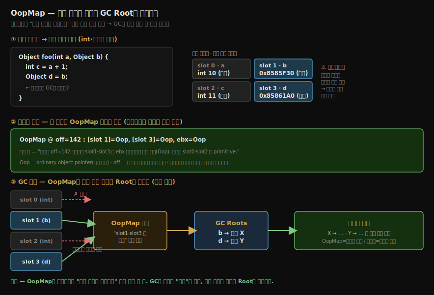

- OopMap은 객체 그래프 자체가 아니라 **현재 스택·레지스터 중 어느 칸이 객체 참조인지** 알려 주는 지도다.
- GC는 OopMap으로 GC Root 후보를 정확히 찾고, 그 뒤에 힙 객체의 필드를 따라 도달성 분석을 진행한다. 즉 OopMap은 “출발점 식별”이고, 도달성 분석은 “출발점에서 그래프를 따라가는 작업”이다.

문제는 OopMap이 모든 명령어 위치마다 만들어질 수는 없다는 점이다. 메모리 비용이 비대해진다. 그래서 핫스팟은 특정 위치에만 OopMap을 저장하고, 그 위치를 **안전 지점**이라고 부른다.

### 자바 코드 한 줄이 OopMap이 되기까지

OopMap이 추상적으로 느껴지는 이유는 *실제 자바 코드와 어떻게 연결되는지*가 안 보여서다. 메서드 하나를 끝까지 따라가면 정체가 분명해진다.

#### 자바 메서드와 지역 변수 슬롯

다음 메서드를 보자.

```java
Object foo(int a, Object b) {
    int c = a + 1;
    Object d = b;
    // 바로 이 줄에서 GC가 돈다면, 스택에 무엇이 있나?
}
```

이 메서드가 실행되면 [스택 프레임의 지역 변수 테이블](../ch03_class-loading-mechanism/03-01.런타임%20스택%20프레임%20구조.md)에 변수가 슬롯 단위로 깔린다. 인자도 지역 변수다.

| 슬롯 | 변수 | 타입 | 들어 있는 값 |
|------|------|------|-------------|
| slot 0 | `a` | `int` | 그냥 숫자 (예: 10) |
| slot 1 | `b` | `Object` | **힙 객체의 주소** (참조) |
| slot 2 | `c` | `int` | 그냥 숫자 (예: 11) |
| slot 3 | `d` | `Object` | **힙 객체의 주소** (참조) |

- 문제는 메모리에서 보면 slot 0의 숫자 10도, slot 1의 주소 `0x...`도 똑같은 비트 패턴이라는 것이다. ch03 03-01에서 본 슬롯 구조 그대로다.
- 슬롯만 들여다봐선 "이게 숫자인가 주소인가"를 구분할 수 없다. 보수적 GC가 추측에 의존하는 이유가 이것이다.

#### JIT가 safepoint별 OopMap을 만든다

그런데 컴파일러는 이미 안다. `b`와 `d`는 `Object` 타입으로 선언됐으니 참조고, `a`와 `c`는 `int`니 숫자다. 그래서 JIT는 safepoint마다 "이 위치에서 어느 슬롯·레지스터가 참조인가"를 표로 박아 둔다. 실제 핫스팟 OopMap 레코드는 대략 이런 모양이다.

```bash
OopMap @ off=142 :  [slot 1]=Oop,  [slot 3]=Oop,  rbx=Oop
                     b             d              레지스터에 올라간 참조
# 읽는 법: "기계어 off=142 위치에서 slot1·slot3과 rbx 레지스터가 객체 참조(Oop),
#          나머지(slot0·slot2)는 primitive다"
```

- `Oop`는 ordinary object pointer, 즉 객체 참조다. `off=142`는 이 맵이 유효한 기계어 위치이고, `rbx`는 그 시점 참조가 올라가 있는 CPU 레지스터다.
- 핵심은 이 표가 "GC가 시작된 뒤 슬롯 값을 보고 추측한 결과"가 아니라, JIT가 컴파일된 코드에 붙여 둔 메타데이터라는 점이다.

인터프리터로 실행 중인 frame도 같은 문제가 있다. 다만 그 경우에는 JIT의 `nmethod`가 아니라 인터프리터의 정해진 frame layout과 메서드 메타데이터를 이용해 oop 위치를 찾는다. 학습할 때는 "compiled frame은 OopMap, interpreted frame은 VM이 아는 고정 레이아웃"으로 나눠 기억하면 된다.

#### GC가 OopMap만 보고 Root를 뽑는다

GC가 돌 때 흐름은 이렇다.

1. GC가 "멈춰라" 플래그를 켠다.
2. 각 스레드가 *가장 가까운 안전 지점까지 진행한 뒤* 스스로 멈춘다(자발적 중단, 2절).
3. GC가 멈춘 스레드의 *그 위치 OopMap*을 읽는다 — `[slot1]=Oop, [slot3]=Oop, rbx=Oop`.
4. **slot 1·slot 3·rbx 값만 GC Root로 꺼낸다.** slot 0·slot 2는 *주소처럼 보여도 거들떠보지 않는다* — OopMap이 "저긴 숫자"라고 명시했으니까.
5. 그렇게 뽑은 Root(`b`가 가리킨 객체, `d`가 가리킨 객체)에서 힙 필드를 따라 도달성 분석을 시작한다.

바이트코드를 다시 해석하지도, 슬롯 값을 추측하지도 않는다. 미리 붙어 있는 표를 읽을 뿐이다. 이 다섯 단계를 흐름으로 보면 다음과 같다.

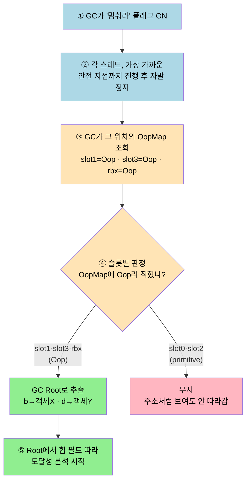

- 핵심은 ④ 판정에 추측이 없다는 점이다. OopMap이라는 답안지가 "slot1·slot3은 참조, slot0·slot2는 숫자"라고 미리 적어 줬으므로, GC는 그 표대로 참조 슬롯만 통과시키고 숫자 슬롯은 거른다.

> **한 줄로 못박기** — **OopMap은 safepoint 위치에서 stack/register 안의 oop 위치를 알려 주는 지도다.** 
>
> GC는 런타임에 추측하는 대신 그 표를 읽어, 참조 슬롯만 정확히 Root로 집어낸다. "추측"을 "조회"로 바꾼 게 OopMap의 전부다.

### 1.2 "Root를 뽑는다"는 게 무슨 뜻인가 — Root는 매번 새로 읽는다

흔한 오해 하나를 풀어 둔다. "GC Root"라고 하면 *어딘가 고정돼 있는 목록*처럼 들리지만, GC가 매 사이클에 하는 **루트 열거(Root Enumeration)** 는 *그 고정 목록을 다시 읽어 오는* 작업이다.

- **Root의 *종류*는 고정**이다 — 스택 지역변수·static·상수·JNI([02-03](./02-03.%EB%8C%80%EC%83%81%EC%9D%B4%20%EC%A3%BD%EC%97%88%EB%8A%94%EA%B0%80.md)에서 본 그것). 이건 안 바뀐다.
- 그러나 **그 슬롯이 *지금 가리키는 실제 값*은 실행 중 계속 바뀐다.**

```java
void m() {
    Object a = new Foo();   // 이 순간 스택 slot0 = Foo 주소
    a = new Bar();          // 이 순간 slot0 = Bar 주소 (바뀜!)
    // GC가 여기서 돈다면 slot0 이 가리키는 건 Bar
}
```

- 그래서 *Root 뽑기 = GC가 멈춘 그 시점에, 스택의 어느 슬롯이 *지금* 무슨 객체를 가리키는지 현재 값을 읽어내는 것*이다. 종류는 고정이라도 *현재 참조값*은 매번 다르니, **GC가 돌 때마다 새로 읽어야** 한다.
-  그 "지금 스택에서 참조 슬롯만 골라 읽기"에 OopMap이 필요한 것이다 — 어느 슬롯이 참조인지 알아야 그 값을 읽을 테니까. (지갑에 카드가 든 건 고정이지만, *지금 어떤 카드가 들었나*는 매번 확인해야 하는 것과 같다.)


## 2. 안전 지점 (Safepoint) — 언제 GC를 시작하는가

> 모든 애플리케이션 스레드가 동시에 멈춰야 GC가 일관된 상태에서 동작한다. 어디서 멈추느냐가 안전 지점의 문제다.

안전 지점은 OopMap이 정확히 정의된 지점이다. 핫스팟은 다음 위치에 안전 지점을 둔다.

- **메서드 호출**
- **루프 백 엣지** (긴 루프 안에서 GC가 무한히 기다리지 않게)
- **예외 처리 분기**
- **JIT가 컴파일한 코드의 다른 분기**

스레드가 GC 요청을 받으면 가까운 안전 지점까지 진행한 뒤 멈춘다. 이 동기화를 어떻게 구현하느냐가 두 갈래다.

### 2.1 선점형 중단 (Preemptive Suspension) — 폐기됨

GC가 모든 스레드를 강제로 일시 정지한 뒤, 안전 지점이 아닌 스레드는 깨워서 안전 지점까지 진행하고 다시 멈추게 한다. 

- 구현은 단순하지만 복잡한 동기화가 필요하고, 모든 사례에서 작동한다고 보장하기 어렵다. 핫스팟이 일찍 폐기했다.

### 2.2 자발적 중단 (Voluntary Suspension) — 핫스팟의 채택

**각 안전 지점에 체크 명령을 컴파일 시점**에 박는다. 

- 전통적인 설명에서는 **JIT 코드에 메모리 페이지 한 곳을 읽는 명령이 들어가고, VM이 그 페이지를 접근 불가로 표시하면 스레드가 트랩에 빠진다.** 
- 트랩 핸들러는 이 위치를 safepoint poll로 해석하고 스레드를 멈춘다.

```bash
# 의사 코드 — JIT가 안전 지점마다 박는 폴링
movq <safepoint_polling_address>, <scratch>  // 페이지 한 곳 읽기

# GC가 페이지를 접근 불가로 만들면 여기서 SIGSEGV → trap handler
```

여기서 *페이지(page)*가 무엇인지 짚어야 한다.

- **페이지는 OS가 메모리를 관리하는 단위(보통 4KB짜리 메모리 한 조각)** 다. 핫스팟은 그중 *특별한 한 장*을 만들어 두는데, 이를 **safepoint polling page**라 부른다. 
- JIT가 안전 지점마다 박은 명령은 단지 *그 페이지를 한 번 읽는* 것이다.

- **평소** — 그 페이지는 읽기 가능하니 명령이 그냥 통과한다(거의 공짜).
- **GC 시작** — GC가 *그 페이지 한 장을 "접근 불가"로 막으면*, 스레드가 다음 안전 지점에서 그 페이지를 읽으려는 순간 *접근 위반 → SIGSEGV(트랩)* 에 빠지고, 트랩 핸들러가 그 안전 지점에서 스레드를 멈춘다.

핵심 트릭은 *GC가 스레드를 하나하나 멈추라 명령하지 않는다*는 것이다

- **페이지 한 장만 막으면, 실행 중인 모든 스레드가 다음 안전 지점에서 그 페이지를 읽다 *스스로* 트랩에 걸려 멈춘다.** 
- 즉 폴링은 "GC 끝났나 확인"이 아니라 *"지금 멈춰야 하나?"를 안전 지점마다 묻는 행위*이고, GC는 그 물음의 답(페이지)을 막아 멈춤을 유도한다.

> **왜 이름이 "폴링(polling)"인가.** 폴링은 *반복해서 물어보기/확인하기*를 뜻하는 일반 용어다("메일 왔나? 1초마다 확인" 같은 것). 
>
> - 스레드는 안전 지점에 닿을 때마다(메서드 호출·루프마다 깔려 있으니 *계속*) 그 페이지를 읽어 "지금 멈춰야 하나?"를 묻는다.
> - 이 *반복 확인*이 폴링이고, 그래서 그 페이지가 safepoint *polling* page다.
>
> 대비되는 방식은 *인터럽트(interrupt)* 다 — 외부(GC)가 스레드를 *강제로 찔러* 멈추는 것(폐기된 선점형 중단, 2.1절). 핫스팟은 *스레드가 스스로 묻게 하는* 폴링을 택했고, 그 "묻기"의 구현이 페이지 읽기다.
>
> 그래서 스레드 N개가 있으면 — *GC가 N번 명령하는 게 아니라*, 페이지 한 장만 막으면 **N개 스레드가 각자 자기 다음 안전 지점에서 그 페이지를 읽다 트랩에 걸려 멈춘다.** 
>
> - 단, 안전 지점 도달 시점이 스레드마다 조금씩 달라(누구는 긴 루프 중), GC는 *마지막 스레드까지 다 멈출 때까지* 기다린 뒤 시작한다. 
> - 이 "다 멈추길 기다리는 시간"이 STW 지연의 일부이고, 그래서 안전 지점을 *루프 백 엣지*에도 박아 한 스레드가 너무 오래 안 멈추는 것을 막는다.

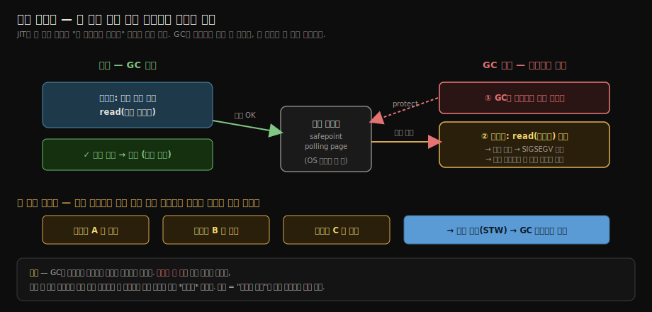

- 페이지 한 번 읽기는 정상 동작 시 비용이 작고, GC가 필요할 때만 trap으로 멈춤이 발동한다. 다만 이것은 safepoint polling이지, 객체 참조를 읽을 때마다 실행되는 ZGC식 load barrier와 같은 개념은 아니다. 
- 둘 다 "읽기 경로에 붙은 검사"처럼 보이지만, 하나는 스레드를 멈추기 위한 폴링이고 다른 하나는 객체 참조를 고치거나 확인하기 위한 GC 장벽이다.

JDK 10 이후에는 thread-local handshake도 중요한 축이다. 전통적인 safepoint는 모든 Java thread가 한꺼번에 멈춰야 하지만, handshake는 특정 thread 또는 각 thread가 자기 callback만 처리하고 곧바로 계속 실행하게 만든다. biased lock revocation, stack trace sampling, 일부 barrier 최적화처럼 전역 정지가 필요 없는 작업은 이 방식으로 전체 지연을 줄인다.

GC 요청부터 모든 스레드가 멈출 때까지의 흐름은 안전 영역 흐름도와 함께 보면 이해하기 쉽다. GC는 직접 스레드를 멈추지 않고 폴링 지점과 VM runtime state를 이용해 스레드가 스스로 가까운 안전 지점에서 멈추게 유도한다.

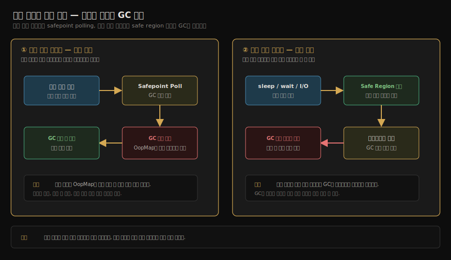


## 3. 안전 영역 (Safe Region) — 기다리는 스레드를 위한 확장

> **안전 지점은 실행 중인 스레드**에 적합하지만, **Sleep·Block 중인 스레드는 안전 지점에 도달할 수 없다.**

`Thread.sleep()`으로 잠든 스레드, `wait()`으로 대기 중인 스레드, IO 블로킹 중인 스레드는 명령을 실행하지 않으므로 안전 지점 폴링도 못 한다.

여기서 자연스러운 의문이 든다 — *"그럼 자는 스레드는 누가 폴링해 주나?"* 답은 **아무도 안 한다. 그리고 그게 정답이다.** 모순처럼 보이는 이 지점이 안전 영역의 존재 이유다.

- 폴링은 *스레드가 명령을 실행해야* 가능한데(페이지를 읽는 명령이니까), 자는 스레드는 명령을 안 도니 *폴링 자체가 불가능*하다.
- 그런데 발상을 뒤집으면 — 자는 스레드는 *어차피 멈춰 있고*, 멈춰 있는 동안 *객체 참조를 바꾸지 않는다*(코드를 안 도니까). GC 입장에선 **이미 "안전하게 멈춘 상태"** 다.

그래서 안전 영역은 *폴링을 대신 해 주는 게 아니라, 폴링 자체를 건너뛰게* 한다. 스레드가 `sleep()`/IO에 들어가기 전에 "안전 영역 플래그 ON"을 켜 두면, GC는 그 스레드를 *폴링으로 멈추려 하지 않고* "이미 멈춘 것"으로 간주하고 자기 일을 진행한다. 스레드는 *깨어나 안전 영역을 나가려는 시점*에 "GC 끝났나?"를 한 번 확인해, 진행 중이면 *끝날 때까지 블록(대기)* 했다가 GC가 깨워 주면 나간다.

- 그래서 깨어난 스레드는 *폴링(반복 확인)을 하지 않는다*. 폴링은 "실행 중 스레드를 멈추려고" 쓰는 것이고, 안전 영역 탈출은 *이미 멈춘 채 끝나길 기다리는* 별개의 메커니즘이다.

해결책은 **안전 영역**이라는 개념이다. 한 범위의 코드 전체가 GC와 호환 가능한 상태를 유지하면, 그 안에서는 언제 멈춰도 안전하다고 선언한다. 

스레드는 안전 영역에 들어갈 때 플래그를 켜고, 나갈 때 GC가 끝났는지 확인한다. GC가 진행 중이면 대기한다. 그 동안 GC는 그 스레드를 이미 멈춘 것으로 취급하고 자기 일을 한다.

| 상황 | 안전 지점 vs 안전 영역 |
|------|---------------------|
| 자바 코드 실행 중 | 안전 지점 폴링 |
| Native 메서드 호출 중 | 진입할 때 안전 영역 진입, 나올 때 GC 대기 |
| `Thread.sleep()` / `wait()` | 진입할 때 안전 영역 진입, 깨어날 때 GC 대기 |

안전 영역에 든 스레드가 *진입 → 멈춤 간주 → 깨어날 때 GC 확인 → 탈출*까지 거치는 생명주기를 흐름으로 보면 다음과 같다.

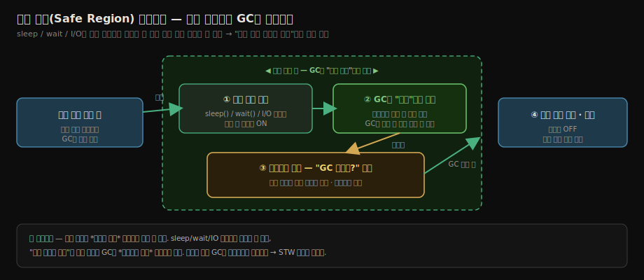


## 4. 기억 집합과 카드 테이블 — 부분 GC를 가능하게 하는 자료구조

> Minor GC가 신세대만 보려면, 구세대에서 신세대로 가는 참조를 별도로 추적해야 한다.

구세대→신세대 참조는 카드 테이블이 dirty 카드로 추려 준다. Minor GC는 구세대 전체가 아니라 dirty 카드만 스캔해 신세대 객체의 생존을 판정한다.

기억 집합은 “다른 영역에서 이 영역을 참조하는 정보를 기억한다”는 추상 개념이고, 카드 테이블은 그 기억 집합을 바이트 배열에 가까운 구조로 구현한 방식이다. 구세대 객체가 신세대 객체를 참조하는데 이 정보를 모르면, Minor GC가 신세대만 훑다가 살아 있는 신세대 객체를 죽었다고 오판할 수 있다.

### 4.1 기억 집합 (Remembered Set)

기억 집합은 논리적 개념이다. 영역 A의 객체 중 영역 B를 참조하는 객체들의 집합을 뜻한다. Minor GC가 신세대를 회수할 때 구세대의 기억 집합만 추가로 스캔하면 된다.

#### 기억 집합은 "Minor GC의 추가 Root"다

기억 집합이 왜 필요한지는 Root 열거(1절)와 묶어 보면 분명해진다. 일반적인 GC Root는 다음이었다(02-03 대상이 죽었는가에서 다룸).

```text
일반 GC Root  =  스택 지역 변수 + static 필드 + 상수 + JNI 핸들
```

그런데 Minor GC는 신세대만 회수하면서도 정확성을 지켜야 한다. 여기서 문제가 생긴다 — **구세대에 있는 살아 있는 객체가 신세대 객체를 참조**하고 있으면, 그 신세대 객체는 죽이면 안 된다(구세대 객체가 아직 붙잡고 있으니까). 그런데 Minor GC는 구세대를 스캔하지 않으니 그 참조를 모른다.

그래서 dirty 카드 안의 구세대 객체를 **Minor GC 동안만 임시 Root로 합류**시킨다.

```text
Minor GC의 Root  =  일반 GC Root  +  dirty 카드 안의 구세대 객체들
                                     └─ "기억 집합"이 가리키는 것
```

dirty 카드만 보는 이유는 명확하다. clean 카드(구세대→신세대 참조 없음)는 신세대를 안 붙잡으니 Root에 넣을 필요가 없다. dirty 카드만 "여기 신세대 가리키는 놈이 있다"고 표시돼 있으므로, **그 카드 안의 객체만 추가 Root로 스캔**하면 정확성이 유지된다. 구세대 전체(살아남은 객체가 많아 비싸다)를 훑지 않고도 누락 없이 신세대 생존을 판정하는 것이 부분 GC의 핵심이다.

#### 왜 객체 단위가 아니라 카드(512B) 단위인가 — 공간 비용

"구세대→신세대 참조"를 객체 하나하나 단위로 기억하려면, 객체마다 참조 포인터 리스트를 들고 있어야 한다. 객체가 수백만 개면 그 자료구조가 힙만큼 커진다. 카드 단위는 이 비용을 극단적으로 줄인다.

| 기억 방식 | 메타데이터 크기 | 정확도 |
|-----------|----------------|--------|
| 객체 단위 리스트 | 객체 수에 비례(매우 큼) | 정확(객체 1개 특정) |
| 카드 단위 플래그(512B당 1바이트) | 힙의 약 1/512 (1GB 힙 → ≈2MB) | 카드 1장 안 여러 객체를 같이 스캔(over-scan) |

카드 하나는 512바이트 범위에 들어오는 **여러 객체를 통째로 묶는 단위**다. 카드가 dirty면 그 안의 객체 전부가 "신세대 가리킬 후보"로 함께 스캔된다 — 실제로는 그중 하나만 신세대를 가리켜도 나머지까지 훑는 약간의 over-scan이 생긴다. 그 손해를 감수하는 대신, 메타데이터가 힙의 1/512로 작아지고 쓰기 장벽(5절)이 분기 없는 단순 쓰기 한 줄로 끝난다. 이 트레이드오프가 카드 테이블이 객체 단위 대신 카드 단위를 택한 이유다.

### 4.2 카드 테이블 (Card Table) — 기억 집합의 구현

기억 집합을 객체 단위 리스트로 들고 있으면 너무 비싸다. 핫스팟의 전통적인 카드 테이블은 메모리를 기본 512바이트 카드로 나누고, 카드마다 1바이트 플래그를 둔다. 현대 OpenJDK 내부에서는 카드 크기와 shift 값을 초기화해 쓰므로, 학습용으로는 "주소를 카드 단위로 나눠 바이트 배열에 표시한다"가 핵심이다.

```text
구세대를 카드로 나눔:
[Card 0][Card 1][Card 2][Card 3]...   (기본 512바이트)

카드 테이블:
[0][1][0][1]...   (1 = dirty, 0 = clean)
```

카드 안의 어떤 객체가 어떤 신세대 객체를 참조하면 그 카드 전체가 dirty로 표시된다. Minor GC는 dirty 카드 전체를 스캔한다. 정확도는 객체 단위보다 떨어지지만, 필요한 메타데이터와 갱신 비용이 훨씬 낮다.

카드가 dirty로 추려져 Minor GC가 그것만 스캔하는 전체 그림은 다음과 같다(02-04와 공유하는 그림이다). 여기서는 그 카드를 *무엇이 dirty로 찍는가*(쓰기 장벽, 5절)에 집중한다.


### 4.3 핫스팟의 카드 자료구조

핫스팟은 개념적으로 `BYTE CARD_TABLE[]` 같은 1차원 배열을 쓴다. 기본 512바이트 카드를 기준으로 보면 메모리 주소를 9비트(`2^9 = 512`) 오른쪽 시프트하면 카드 인덱스가 된다.

```text
card_index = (object_address >> 9)
```

힙 객체의 필드나 배열 원소에 참조를 저장할 때마다, 이 인덱스의 바이트를 dirty 값으로 덮어쓴다. 특정 숫자 자체보다 중요한 것은 clean 값과 dirty 값을 구분한다는 점이다. 기본 post-write barrier는 이미 dirty인지 확인하지 않고 쓰기 때문에 분기 비용이 없다.


## 5. 쓰기 장벽 (Write Barrier) — 카드 dirty 마크의 유지

> 카드 테이블이 정확하려면 힙 객체 필드에 참조를 저장할 때 카드를 dirty로 표시해야 한다. 그 표시를 대입 명령 주변에 자동으로 끼워 넣는 것이 쓰기 장벽이다.

```c
// 의사 코드: 힙 객체 필드에 참조를 저장한 뒤 실행되는 post-write barrier
obj.field = value;                            // 원래 참조 저장
CARD_TABLE[address_of(obj) >> CARD_SHIFT] = DIRTY;  // 카드 dirty 마크
```

이 코드는 JIT가 자동으로 넣어 준다. 자바 소스에서는 보이지 않지만, 힙 객체 필드나 객체 배열 원소에 참조를 저장하는 경로에는 barrier가 붙는다. 지역 변수에 참조를 대입하는 경우까지 카드 테이블을 더럽히지는 않는다. 카드 테이블은 힙 안의 객체가 다른 영역 객체를 가리키는지를 기억하기 위한 구조이기 때문이다.

여기서 헷갈리기 쉬운 점 하나 — **쓰기 장벽은 카드가 *이미 dirty인지 확인하는* 코드가 아니라 카드를 *dirty로 찍는(쓰는)* 코드다.** 방향이 반대다. "참조 대입이 일어났다 → 그 카드를 무조건 dirty로 마크"다.

자바 소스 한 줄이 JIT를 거쳐 어떻게 카드 dirty 표시까지 이어지는지 흐름으로 보면 다음과 같다.

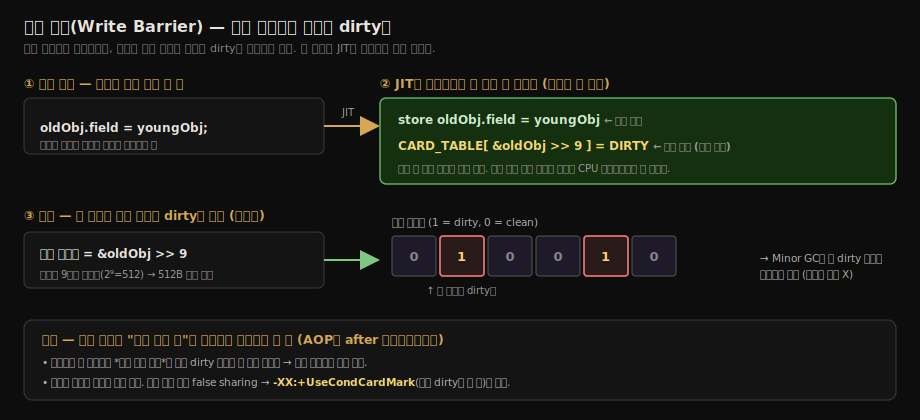

#### 왜 "확인 없이 무조건 쓰기"가 더 빠른가 — 분기 예측

> **먼저 오해 하나를 푼다 — "무조건"은 *모든 카드*에 찍는 게 아니다.** 참조 대입이 *실제로 일어난 그 카드 한 장*에만 찍는다.

`CARD_TABLE[i] = DIRTY`에서 핵심은 `i`다. `i`는 *방금 참조 대입이 일어난 객체의 카드 번호 하나*다. `oldObj.field = youngObj`가 실행되면 → `oldObj`가 속한 **카드 `i` 한 장만** dirty가 된다. 다른 카드는 손도 안 댄다.

- 그래서 "무조건 찍으면 모든 카드가 dirty가 돼서 결국 전체 탐색하는 것 아닌가?"는 걱정할 필요가 없다. dirty가 되는 카드 수 = *실제로 일어난 세대 간 참조 수*만큼이고, 참조가 안 생긴 카드는 그대로 clean이다. 
- 카드가 많이 dirty해지는 건 카드 테이블 탓이 아니라 *프로그램이 그만큼 참조를 많이 만든* 것이다.

그러면 "무조건(unconditional)"이 뜻하는 건 무엇인가? *어느 카드에 찍느냐*가 아니라, **그 한 장(`i`)이 이미 dirty여도 확인 없이 또 쓰느냐**다. 아래 두 방식 모두 대상은 *카드 `i` 한 장*으로 똑같고, 차이는 "그 한 장에 또 쓸까 말까"뿐이다.

```c
// 방식 A — 확인하고 쓰기 (분기 있음)
if (CARD_TABLE[i] != DIRTY)   // ← 카드 i가 이미 dirty면?
    CARD_TABLE[i] = DIRTY;     //     안 씀 (이미 dirty니까 생략)

// 방식 B — 무조건 쓰기 (핫스팟 기본)
CARD_TABLE[i] = DIRTY;        // ← 카드 i가 이미 dirty여도 그냥 또 씀 (값은 그대로 dirty)
```

- 카드 `i`가 **clean이었다면** → A·B 둘 다 dirty로 만든다(결과 동일).
- 카드 `i`가 **이미 dirty였다면** → A는 생략, B는 dirty→dirty 재기록(값은 안 바뀜). **B가 또 써도 결과는 똑같이 dirty 한 장이다. clean 카드가 dirty로 번지지 않는다.**

현대 CPU는 파이프라인으로 명령을 미리 당겨 실행한다. `if` 같은 분기를 만나면 "어느 쪽으로 갈지" 예측해 미리 실행하는데, **예측이 틀리면** 미리 한 작업을 전부 버리고 다시 한다(파이프라인 플러시 = 수십 사이클 손해).

- 쓰기 장벽은 *모든 참조 대입마다* 실행되니 호출 빈도가 극도로 높다. 여기에 `if`를 넣으면 분기 예측 실패가 누적돼 느려진다.
- 그래서 기본은 **분기 없이 메모리 쓰기 한 번** — 항상 일정한 비용, 예측 실패 0. "이미 dirty여도 또 쓰는" 약간의 낭비를 감수하고 분기를 없앤 것이다. 단일 스레드에서는 이게 거의 항상 이득이다.

### 5.1 위장 공유 (False Sharing) 문제

방금 본 "무조건 쓰기"는 단일 스레드에선 빠르지만, 멀티코어에선 부작용이 있다. 카드 테이블이 너무 자주 쓰이면 여러 CPU 코어가 같은 캐시 라인을 두고 다투는 **false sharing**이 발생한다.

먼저 false sharing이 *무슨 상황인지*부터 그림으로 본다.

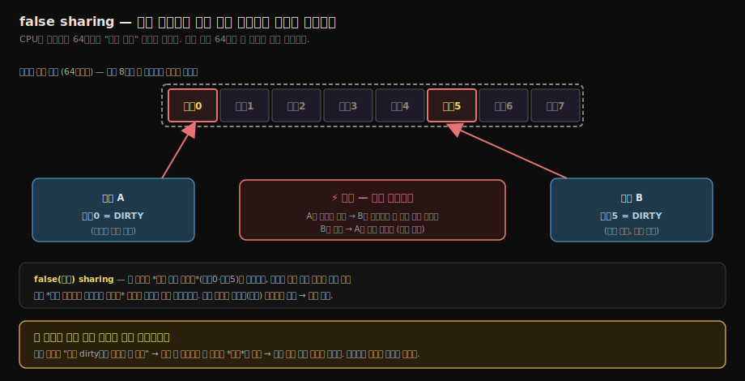

- CPU는 메모리를 **캐시 라인**(보통 64바이트) 단위로 캐시에 올린다. 카드 테이블에서 *인접한 카드 64개*가 한 캐시 라인에 같이 올라간다.
- 그래서 **코어 A가 카드 0을, 코어 B가 카드 5를** dirty로 찍으면 — 둘은 서로 다른 카드(다른 데이터)인데 *우연히 같은 캐시 라인*에 들어 있다.
- 한 코어가 그 라인에 쓰면, 캐시 일관성 프로토콜이 *다른 코어 캐시의 그 라인 전체를 무효화*한다. 서로 안 겹치는 데이터인데 캐시가 서로를 계속 깨뜨리는 핑퐁이 일어난다 — 이게 *false(거짓) sharing*이다. 진짜로 같은 데이터를 공유하는 게 아닌데(거짓) 공유하는 것처럼 동작해 성능이 떨어진다.
- "무조건 쓰기"가 이걸 악화시킨다. 값이 안 바뀌어도(이미 dirty여도) 매번 그 라인에 *쓰기*가 발생하니, 불필요한 무효화가 늘어난다.

#### -XX:+UseCondCardMark — 조건을 붙여 false sharing 완화

JDK 7부터 `-XX:+UseCondCardMark` 옵션이 추가됐다. 카드가 이미 dirty면 다시 쓰지 않는 **조건(Cond) 분기**를 더한다.

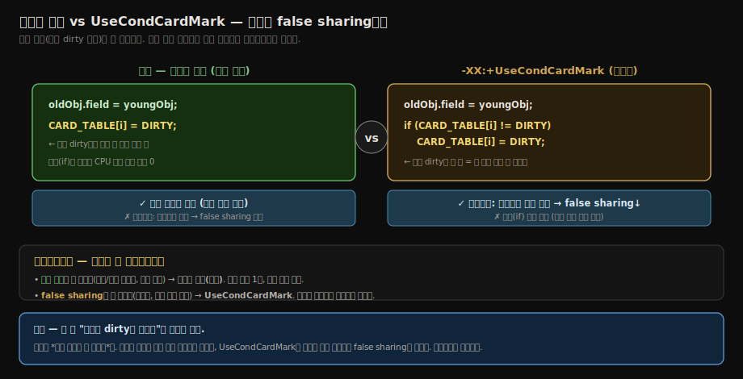

```c
// UseCondCardMark — 이미 dirty면 안 씀
if (CARD_TABLE[i] != DIRTY)
    CARD_TABLE[i] = DIRTY;   // 이미 dirty면 이 쓰기를 건너뜀
```

- 이미 dirty인 카드엔 *재기록을 안 하니* 그 캐시 라인을 안 건드린다 → false sharing 무효화 핑퐁이 줄어든다.
- 대신 `if` 분기가 생기니 분기 예측 실패 비용이 추가된다. 정확히 5.0절에서 무조건 쓰기가 *피하려던* 그 비용이다.
- 그래서 **트레이드오프**다. 분기 비용이 더 무서우면(단일·소수 스레드, 쓰기 잦음) 기본 무조건 쓰기, false sharing이 더 무서우면(다코어가 같은 카드 영역을 경쟁적으로 더럽힘) `UseCondCardMark`. 워크로드가 결정한다.

### 5.2 장벽은 하나가 아니다

쓰기 장벽이라고 하면 카드 테이블만 떠올리기 쉽지만, 핫스팟의 barrier는 목적에 따라 갈라진다. 같은 "참조를 저장했다"는 사건을 보더라도 어떤 GC는 세대 간 참조를 기억하려 하고, 어떤 GC는 동시 마킹 중 사라질 참조를 붙잡으려 한다.

학습할 때는 다음 네 갈래로 나누면 헷갈리지 않는다:

- **post-write barrier**는 참조 저장 뒤에 실행된다. 카드 테이블과 remembered set을 갱신해 old-to-young 같은 영역 간 참조를 추적한다.
- **pre-write barrier**는 참조 저장 전의 이전 값을 본다. SATB 방식에서 지워지는 참조를 기록해 마크 시작 시점의 객체 그래프를 보존한다.
- **load barrier**는 참조를 읽을 때 실행된다. ZGC처럼 객체 이동과 포인터 갱신을 애플리케이션 실행 중에 처리하는 collector에서 중요하다.
- **store barrier**는 참조 저장 경로를 더 정교하게 처리한다. Generational ZGC는 store barrier로 remembered set과 SATB marking을 함께 다루며, colored pointer 메타데이터로 fast path와 slow path를 나눈다.

그래서 5절의 카드 테이블 barrier는 "쓰기 장벽의 대표 예"이지 전부가 아니다. 이 구분을 해 두면 02-07의 ZGC·Shenandoah에서 load barrier와 colored pointer가 왜 갑자기 등장하는지 덜 낯설다.


## 6. 동시 마킹 확장 — 애플리케이션이 도는 중에 마크가 가능한가

> 동시 마킹은 앞의 다섯 부품 위에 barrier를 더 얹는 확장이다. 애플리케이션이 객체 그래프를 바꾸는 동안 GC가 같은 그래프를 읽기 때문에, 지워지는 참조와 새로 생긴 참조를 어떻게 볼지가 핵심이다.

CMS·G1·ZGC·Shenandoah 같은 동시 GC는 애플리케이션 스레드와 동시에 마크 단계를 돈다. 그러나 애플리케이션이 객체 그래프를 바꾸는 중에 마크하면 살아 있는 객체를 놓치거나 죽은 객체를 살아 있다고 표시하는 사고가 난다.

이 사고는 *동시 마킹*에서만 난다 — 앱을 멈추는 STW 마킹이면 그래프가 안 변해 사고 자체가 없다. STW 마킹과 동시 마킹의 구분, 그리고 "마킹 중 그래프가 변하면 왜 깨지는가"는 [02-03 대상이 죽었는가](./02-03.%EB%8C%80%EC%83%81%EC%9D%B4%20%EC%A3%BD%EC%97%88%EB%8A%94%EA%B0%80.md)에서 다룬다. 여기서는 그 동시 마킹이 *어떤 장벽으로* 사고를 막는지에 집중한다.

**3색 마킹**(Tri-color Marking)이 해결의 출발점이다.

| 색 | 의미 |
|----|------|
| 흰색 | 아직 보지 않음 (회수 후보) |
| 회색 | 본 적 있지만 *자식*은 아직 보지 않음 |
| 검은색 | 자기 자신과 *모든 자식*을 다 본 |

> **혼동 주의 — 색은 "세대"가 아니라 "이번 마킹의 진행 상태"다.** 검은색은 구세대를 뜻하지 않는다. 
>
> - *지금 도는 이 마킹 사이클에서 GC가 그 객체의 자식 포인터를 이미 다 따라가 봤다*는 뜻이다. 검은 객체가 구세대든 신세대든 무관하다. 
> - 4·5절의 카드 테이블이 *구세대→신세대*(세대 축)를 다뤘다면, 3색 마킹은 *검은→흰*(마킹 색 축)을 다룬다 — **두 축은 별개다.** "검은=다 봤으니 재방문 안 함, 흰=아직 안 봐서 회수 후보"만 기억하면 된다.

마크가 진행되는 동안 검은 객체가 새로 흰 객체를 가리키게 되면 그 흰 객체가 누락될 수 있다.

### 객체 소실은 "두 조건이 *동시에*" 충족돼야만 일어난다

이 사고를 막연히 "검은 게 흰 걸 가리키면 위험"으로 외우면 방어 전략(증분 갱신·SATB)이 왜 둘로 갈리는지 안 보인다. 

- 핵심은 — 살아있는 흰 객체 Y가 잘못 회수되는 사고는 **두 조건이 동시에** 성립해야만 터진다는 것이다(Wilson, 1994).

| 조건 | 코드 | 뜻 |
|------|------|-----|
| **①** | `X.field = Y` | 검은 객체 X가 흰 객체 Y를 *새로* 가리킴. 검은 X는 GC가 재방문 안 하니 이 참조를 놓침 |
| **②** | `someGray.ref = null` | Y를 가리키던 *모든 회색 경로가 끊김*. Y로 가는 다른 길이 사라짐 |

- ①만 있으면(②없음) 회색 경로가 살아있어 GC가 그쪽으로 Y를 발견하니 안전하다. 
- ②만 있으면(①없음) Y를 가리키는 검은 참조가 없으니 Y는 진짜 쓰레기라 회수해도 맞다. 
- **둘이 겹칠 때만** Y가 살아있는데(X가 가리킴) GC는 못 보는(검은 X 재방문 안 함 + 회색 경로 끊김) 객체 소실이 난다. 힙 메모리 위에서 보면 이렇다.

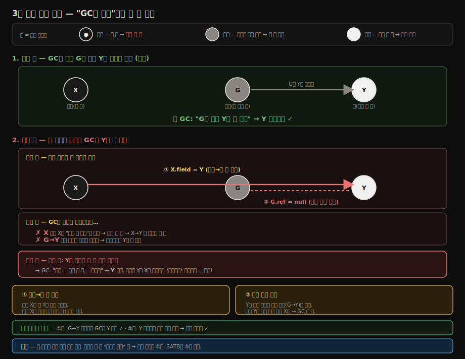

### 방어는 두 조건 중 *하나만* 깨면 된다

두 조건이 *모두* 있어야 사고이므로, 둘 중 하나만 깨도 사고가 안 난다. 그래서 방어가 두 갈래로 갈린다.

- **증분 갱신 (Incremental Update)**은 **조건 ①을 깬다**. 검은 객체가 흰 객체를 가리키게 되면 그 검은 객체를 다시 회색으로 표시해, GC가 재방문하며 새 자식을 발견하게 한다. CMS가 대표 사례다.

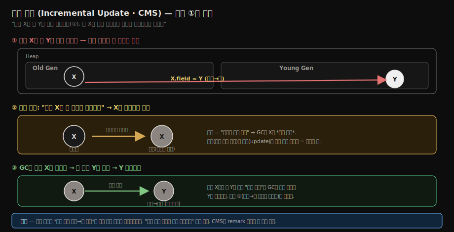

- **시작 시 스냅샷 (Snapshot at the Beginning, SATB)**은 **조건 ②를 깬다**. 마크 시작 시점의 객체 그래프를 기준으로 회수한다. 참조가 끊기기 직전 pre-write 장벽이 끊기는 옛 대상을 큐에 기록해, 마크 도중 지워진 참조가 있어도 그 객체는 살아 있다고 본다. G1과 Generational ZGC가 이 설명에 잘 맞는다.

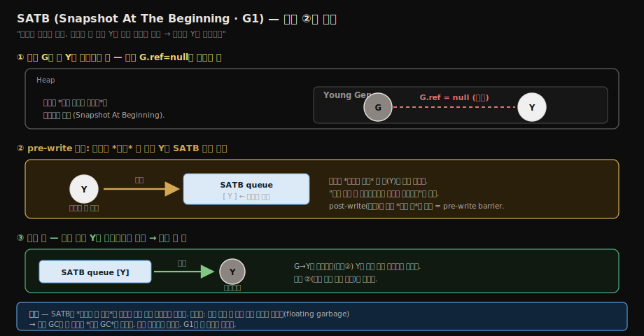

> SATB의 대가는 *floating garbage*다. 마크 시작 후 진짜로 죽은 객체도 "시작 땐 살아있었다"고 살려두니, 이번 GC엔 못 죽이고 다음 GC로 미룬다. 대신 안전하고 빠르다 — G1이 이 트레이드오프를 택했다.

두 방어 모두 barrier를 통해 구현된다. 5절의 카드 테이블 쓰기 장벽이 세대 간 참조를 잡았다면, 동시 마킹의 barrier는 동시 마크의 정확성을 잡는다. Collector마다 세부 구현은 다르므로 "G1, ZGC, Shenandoah가 모두 같은 barrier를 쓴다"고 외우면 틀린다.

정리하면, 이 절은 02-07로 넘어가기 위한 연결부다. CMS는 incremental update 계열로 이해하고, G1은 SATB pre-write barrier를 중심으로 이해하면 된다. ZGC는 load barrier와 colored pointer가 본체이고, Generational ZGC에서는 store barrier가 remembered set과 SATB marking까지 맡는다. Shenandoah도 load/reference barrier 계열을 써서 동시 이동과 참조 갱신을 처리한다.


## 7. 한 줄로 정리

> 다섯 부품은 각자 따로 외우는 항목이 아니라, "정확한 위치에서 멈추고, 정확한 참조만 따라가며, 부분 GC와 동시 GC의 누락을 막는 장치"로 이어진다.

이 노트를 묶으면 핫스팟이 정확한 GC와 짧은 일시 정지를 동시에 달성하기 위한 다섯 부품의 합이다.

1. **OopMap** — 어디에 객체 참조가 있는지 미리 알기 (정확성)
2. **안전 지점** — 어디서 멈춰야 OopMap이 정확한지 정의 (정확성 + 빠른 동기화)
3. **안전 영역** — 멈춰 있는 스레드도 GC에 협력하게 만들기 (완전성)
4. **카드 테이블** — Minor GC가 구세대를 전수 조사 안 해도 되게 (속도)
5. **쓰기 장벽** — 카드 테이블·SATB·remembered set 같은 보조 정보를 자동으로 유지 (자동화)

여기에 동시 마킹 collector는 pre-write barrier, post-write barrier, load barrier, store barrier를 조합한다. 그래서 "쓰기 장벽 하나로 모든 GC를 설명한다"가 아니라 "어떤 barrier가 어떤 불변식을 지키는가"를 묻는 습관이 필요하다.

다음 노트(02-06)는 이 부품을 조합한 클래식 가비지 컬렉터들(Serial, ParNew, Parallel, CMS, G1)을 다룬다.


## 8. 실습 연결

> 이론을 확인할 때는 예전 `Print*` 옵션보다 JDK 9 이후의 통합 로깅(`-Xlog`)을 우선 쓴다.

| 실습 | 위치 | 다루는 것 |
|------|------|---------|
| Safepoint 폴링 관찰 | `_practice/ch03-gc/common/` (예정) | `-Xlog:safepoint=trace` 로 안전 지점 진입 시간 측정 |
| 쓰기 장벽 비용 측정 | `_practice/ch03-gc/common/` (예정) | 같은 코드를 `-XX:+UseG1GC` vs `-XX:+UseParallelGC` 로 돌려 비교 |


## 9. 관련 문서

> 앞뒤 문서를 함께 읽으면 "회수 알고리즘 → HotSpot 구현 부품 → collector 조합" 흐름이 이어진다.

- [02-04.가비지 컬렉션 알고리즘](./02-04.%EA%B0%80%EB%B9%84%EC%A7%80%20%EC%BB%AC%EB%A0%89%EC%85%98%20%EC%95%8C%EA%B3%A0%EB%A6%AC%EC%A6%98.md) — 본 노트의 다섯 부품이 *어떤 알고리즘*을 효율화하기 위함인지의 전제
- [02-06.클래식 가비지 컬렉터](./02-06.%ED%81%B4%EB%9E%98%EC%8B%9D%20%EA%B0%80%EB%B9%84%EC%A7%80%20%EC%BB%AC%EB%A0%89%ED%84%B0.md) — 다섯 부품을 조합한 6+1종 컬렉터의 실체
- [02-07.저지연 가비지 컬렉터](./02-07.%EC%A0%80%EC%A7%80%EC%97%B0%20%EA%B0%80%EB%B9%84%EC%A7%80%20%EC%BB%AC%EB%A0%89%ED%84%B0.md) — 쓰기 장벽 + 로드 장벽으로 *동시 이동*까지 풀어낸 확장
