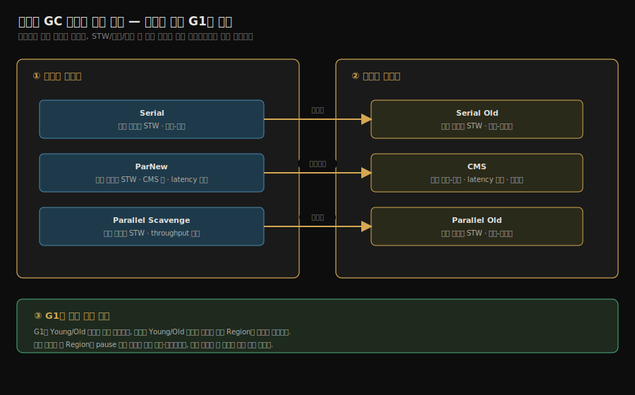
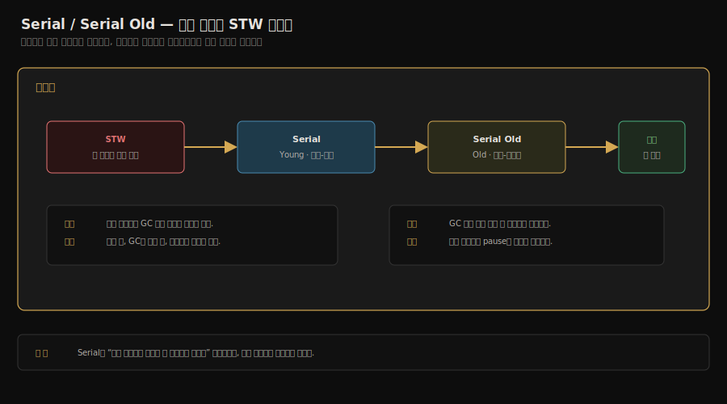
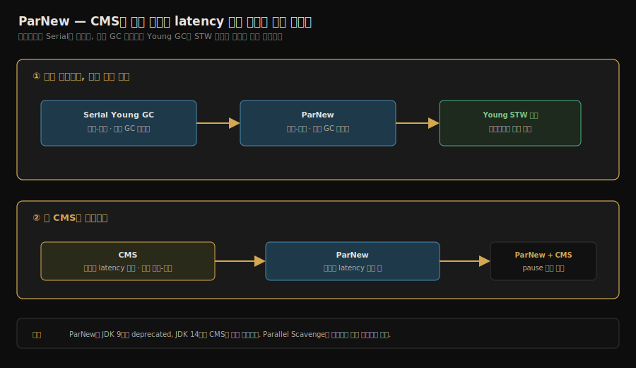
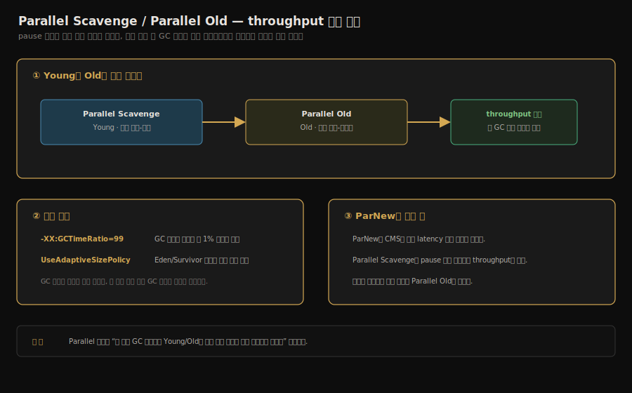
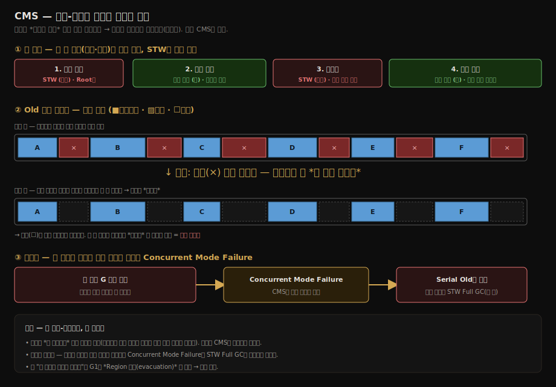

# 클래식 가비지 컬렉터
---
> §3.4의 다섯 부품(OopMap·Safepoint·Safe Region·카드 테이블·쓰기 장벽)이 *조각*이었다면, §3.5의 컬렉터들은 *완성된 제품*이다. 같은 알고리즘 위에서 *어디에 무엇을 두느냐*가 컬렉터의 정체성을 만든다. 본 노트는 클래식 6종 — Serial, ParNew, Parallel Scavenge, Serial Old, Parallel Old, CMS — 과 *세대를 흐리는 첫 시도*인 G1을 다룬다. 본 절을 한 줄로 압축하면 — **컬렉터의 진화 방향은 STW를 줄이는 일과 처리량을 지키는 일 사이의 줄다리기**이며, G1이 그 줄다리기를 *영역(Region) 단위*로 다시 설계하면서 클래식 시대를 닫았다.

## 1. 컬렉터의 분류 좌표

> 컬렉터를 두 축으로 본다. *어느 세대를 다루는가*와 *애플리케이션과의 관계*다.

| 컬렉터 | 신세대 | 구세대 | 동시성 | 알고리즘 |
|--------|------|------|------|--------|
| Serial | ○ | | 단일 스레드 STW | 마크-카피 |
| ParNew | ○ | | 다중 스레드 STW | 마크-카피 |
| Parallel Scavenge | ○ | | 다중 스레드 STW | 마크-카피 |
| Serial Old | | ○ | 단일 스레드 STW | 마크-컴팩트 |
| Parallel Old | | ○ | 다중 스레드 STW | 마크-컴팩트 |
| CMS | | ○ | 동시 (대부분) | 마크-스윕 |
| G1 | ○ | ○ | 동시 (대부분) | 마크-컴팩트 (영역별) |

핫스팟의 GC는 *신세대 + 구세대 컬렉터를 짝지어* 동작한다. 책 그림 3-6의 점선이 그 짝의 후보를 보여 준다. 예를 들어 Serial + Serial Old, ParNew + CMS, Parallel + Parallel Old 처럼.

같은 정보를 다이어그램으로 그리면 *어느 신세대 컬렉터가 어느 구세대 컬렉터와 짝을 이루는지*가 한눈에 보인다. G1만 좌표에서 떨어져 있는데, 신세대·구세대를 *한 컬렉터가 모두 다루기* 때문이다.



실선이 *주된 짝*, 점선이 *fallback 짝*(예: CMS가 Concurrent Mode Failure에 빠지면 Serial Old로 떨어진다). G1만 파스텔 그린으로 격리한 이유는 *세대 경계를 흐리는 첫 시도*라 위 격자 위에 올라가지 않기 때문이다.

## 2. Serial / Serial Old — *기본형의 기본*

> 단일 스레드, 단순함, STW. 작은 힙·클라이언트 모드에 적합.

Serial은 신세대를 *한 스레드*가 마크-카피로 돌린다. GC가 도는 동안 *모든 애플리케이션 스레드 STW*. 작은 데스크탑 앱이나 *마이크로서비스의 사이드카*처럼 *힙이 작고 GC가 드문* 환경에 적합. 책의 그림 3-7은 Serial이 도는 동안 모든 자바 스레드가 멈춘 상태를 보여 준다.

장점은 *단순함*이다. 단일 스레드라 스레드 간 동기화 비용이 없다. 작은 힙에서는 *멀티스레드 GC보다 빨리 끝난다*.

Serial Old는 같은 정신의 구세대 컬렉터다. 마크-컴팩트 단일 스레드.



JDK 9부터 `-XX:+UseSerialGC` 로 두 컬렉터 짝을 명시한다.

## 3. ParNew — *Serial의 다중 스레드 판*

> 신세대만 멀티스레드로 돌리는 것. *CMS와 한 짝*으로만 쓰는 게 사실상 표준이었다.

ParNew는 Serial과 *알고리즘은 같다* — 마크-카피. 다른 점은 *GC 스레드를 여러 개 띄워 병렬*로 돌린다는 것뿐. 멀티코어 머신에서 STW 시간을 줄인다.

ParNew의 존재 이유는 *CMS의 신세대 짝이 필요했기 때문*이다. Parallel Scavenge는 *throughput 우선* 철학이 CMS의 *latency 우선*과 맞지 않아 짝지을 수 없었다.

JDK 9부터 ParNew는 *deprecated*가 됐고, JDK 14에서 *CMS와 함께 제거*됐다. JDK 21에서는 더 이상 쓸 수 없다.



## 4. Parallel Scavenge / Parallel Old — *throughput 우선*

> 단위 시간당 *얼마나 많은 일을 하느냐*가 목표. 일시 정지 *시간*은 그 다음.

Parallel Scavenge는 ParNew와 *알고리즘도 같고 멀티스레드도 같다*. 그러나 철학이 다르다.

- **CMS·ParNew**: *최대 일시 정지 시간*을 짧게 (latency 우선)
- **Parallel Scavenge**: *총 GC 시간 비율*을 낮게 (throughput 우선)

Parallel Scavenge가 노출하는 두 옵션이 그 철학을 드러낸다.

| 옵션 | 의미 |
|------|------|
| `-XX:MaxGCPauseMillis=<ms>` | 한 번의 일시 정지가 이 시간을 넘지 않게 *유도*. 강제 아님 |
| `-XX:GCTimeRatio=<n>` | (1/(1+n)) 비율 이하로 GC 시간 유지. n=99면 GC가 전체의 1% 이하 |

`-XX:+UseAdaptiveSizePolicy` (기본 켜짐)을 켜면 Parallel Scavenge가 *Eden/Survivor 크기와 비율*을 *런타임에 자동 조정*한다. *튜닝을 자동화*하는 게 이 컬렉터의 차별점.

Parallel Old는 같은 정신의 구세대 컬렉터. 마크-컴팩트 멀티스레드. Parallel Scavenge와 한 짝.

JDK 8까지 *서버 모드 디폴트*였다 (`-XX:+UseParallelGC`).



## 5. CMS — *Concurrent Mark Sweep*

> *일시 정지 시간을 줄이려는 첫 본격적 시도*. 마크와 스윕 *대부분*을 애플리케이션과 동시에 돌린다.

CMS는 네 단계로 진행된다.

| 단계 | STW | 하는 일 |
|------|-----|--------|
| 1. **초기 마크** | ○ | GC Root 와 직접 연결된 객체만 마크 — 보통 수 ms 이내 |
| 2. **동시 마크** | × | 애플리케이션과 동시에 마크 그래프 탐색 |
| 3. **재마크** | ○ | 동시 마크 중 변한 부분 보정 (증분 갱신) |
| 4. **동시 스윕** | × | 애플리케이션과 동시에 죽은 객체 회수 |

핵심은 *긴 단계 두 개를 동시*에 돌린다는 점이다. STW는 1·3 단계뿐이고 둘 다 *짧다*.

CMS의 세 한계가 결국 그 자리를 G1에 넘기게 만들었다.

1. **CPU 자원 소비** — 동시 마크 중 *GC 스레드도 같이 도므로* 애플리케이션 CPU가 줄어든다. throughput이 떨어진다.
2. **부유 가비지** — 동시 마크·스윕 중 새로 죽은 객체는 *다음 GC*까지 회수되지 않는다.
3. **단편화** — 마크-스윕이라 *컴팩트하지 않는다*. 결국 *Concurrent Mode Failure* 가 나서 *Serial Old로 폴백*하면 *수 초 STW*. 한 번 폴백하면 *체감 latency가 무너진다*.

> **Concurrent Mode Failure는 언제 나는가.** 두 가지 경로가 있다. 
>
> 1. 단편화로 Old 영역에 *연속된 빈 공간*이 부족해 객체를 못 넣는 경우다. 
> 2. 애플리케이션이 객체를 Old로 승격시키는 속도가 CMS의 *동시 회수 속도*를 앞질러, 동시 스윕이 끝나기 전에 Old가 먼저 가득 차는 경우다. 
>
> 어느 쪽이든 CMS는 동시 회수를 *포기*하고 Serial Old(단일 스레드 마크-컴팩트)로 폴백해 *전체 STW Full GC*를 돈다. 동시성으로 줄여 둔 일시 정지가 이 순간 한꺼번에 터지므로, GC 로그에 `concurrent mode failure`가 찍히면 *운영 사고 신호*로 본다.

CMS는 JDK 9 deprecated, **JDK 14에서 제거**됐다. JDK 21에서 `-XX:+UseConcMarkSweepGC` 옵션은 *에러로 종료*하거나 *경고 후 G1 대체*된다.




## 6. G1 — *Garbage First*, 세대를 흐리다

> 자바 힙을 *고정된 세대*가 아니라 *균등한 영역(Region)* 으로 나눈다. 각 영역이 *그 순간* Eden·Survivor·Old·Humongous 중 하나의 역할을 한다.

### 6.1 Region 기반 힙

```
힙 전체 — N개의 Region (보통 1~32MB)
[E][E][S][O][O][H][_][_][E][O][S][_]...
E=Eden, S=Survivor, O=Old, H=Humongous, _=Free
```

Region 크기는 JVM이 시작할 때 힙 크기에 맞춰 자동으로 정한다 (`-XX:G1HeapRegionSize`, 최소 1MB·최대 32MB). Oracle 튜토리얼 기준으로 JVM은 *약 2,000개의 Region*을 목표로 잡는다. 기존 컬렉터의 세대가 *연속된 주소 공간*이었다면, G1의 Eden·Survivor·Old는 *Region 집합에 붙는 논리적 역할*일 뿐이라 연속일 필요가 없다.

Humongous는 *Region 크기의 50%를 넘는 큰 객체* 전용. 일반 Region에 넣지 못해 *연속된 Region 집합*에 별도로 담는다. 튜토리얼 시점(JDK 7) 기준 Humongous 회수는 최적화되지 않은 상태였고, Oracle은 *이 크기의 객체 생성 자체를 피하라*고 권고했다.

Region 기반의 강점:
- *어느 Region이 가장 회수 가치가 큰지* 미리 계산. *가장 가치 큰 Region부터* 회수 (이름이 Garbage First).
- *전체 힙을 매번 보지 않는다*. *대상 Region만* 본다.
- 사용자가 *최대 일시 정지 시간*(`-XX:MaxGCPauseMillis`, 기본 200ms)을 *목표*로 설정 — G1이 그 목표를 맞추기 위해 *Region 수를 조절*한다.

### 6.2 Region이 풀어낸 것 — 처리량이 아니라 지연시간의 예측 가능성

Region 분할이 처리량과 지연시간 중 무엇을 해결했는지 물으면, 답은 *지연시간* — 정확히는 *지연시간의 예측 가능성*이다. Oracle 튜토리얼은 G1을 설명하기 전에 튜닝의 두 목표 축부터 구분한다.

- **응답성(responsiveness)** — 요청 하나가 얼마나 빨리 돌아오는가. 긴 일시 정지를 허용하지 못한다.
- **처리량(throughput)** — 단위 시간에 얼마나 많은 일을 하는가. 정지가 길어도 총량이 크면 된다.

Parallel Scavenge가 처리량 축(§4)을, CMS가 응답성 축(§5)을 각각 잡았다. 문제는 CMS가 응답성을 잡는 방식이 불안정했다는 점이다. 평소엔 짧은 정지를 주다가 단편화가 누적되면 Concurrent Mode Failure로 수 초 STW가 터진다 — 평균은 좋은데 *최악이 예측 불가능*한 컬렉터였다.

G1의 설계 목표는 Oracle 문서 표현 그대로 "일시 정지 시간 목표를 높은 확률로 충족하면서, 높은 처리량을 달성"하는 것이다. 우선순위가 분명하다. *예측 가능한 일시 정지가 1차 목표*고, 처리량은 "크게 희생하지 않는다"는 제약 조건이다. Region이 이걸 가능하게 만든 메커니즘은 세 가지다.

1. **회수 범위가 조절 변수가 된다** — 기존 컬렉터의 정지 시간은 *세대 전체 크기의 함수*라 사용자가 손댈 수 없었다. G1은 한 번의 정지에서 *선택한 Region 집합(CSet)만* 회수하므로, Region 수를 줄이면 정지가 짧아진다.
2. **일시 정지 예측 모델(pause prediction model)** — 이전 회수들의 통계로 Region 하나를 회수하는 비용을 추정하고, `MaxGCPauseMillis` 목표 안에 몇 개를 회수할 수 있는지 역산해 CSet 크기를 정한다.
3. **증분 컴팩션** — 회수가 곧 evacuation(살아 있는 객체를 다른 Region으로 복사)이라 매 GC가 단편화를 조금씩 해소한다. CMS의 "컴팩션 없음"과 Parallel Old의 "전체 힙 컴팩션 = 긴 정지"라는 양 극단 사이의 절충이다.

단, G1은 *real-time 컬렉터가 아니다*. 목표는 soft goal — 높은 확률로 맞추지만 보장하지 않는다. 예측 모델이 통계 기반이라 할당 패턴이 급변하면 빗나간다.

처리량 관점에서는 오히려 비용을 *지불*했다 — RSet 유지, 더 복잡한 쓰기 장벽, 동시 마킹 스레드의 CPU 점유 (§6.5). 그래서 한 줄 답은 이렇다. **Region은 처리량을 올린 장치가 아니라, 정지 시간을 "힙 크기의 함수"에서 "회수할 Region 수의 함수"로 바꿔 지연시간을 사용자 목표에 묶을 수 있게 만든 장치다.**

### 6.3 Young GC — 비연속 세대가 만드는 자동 크기 조절

G1의 Young GC도 *전체 STW*라는 점은 클래식 컬렉터와 같다. Eden·Survivor의 살아 있는 객체를 멀티스레드 병렬로 하나 이상의 Survivor/Old Region에 evacuate하고, *매 Young GC가 끝날 때마다 다음 Eden·Survivor 크기를 다시 계산*한다. 이 계산에 일시 정지 목표가 들어간다 — 직전 정지가 목표보다 길었다면 다음 Eden을 줄이는 식이다.

이 재계산이 싸게 되는 이유가 비연속 Region이다. 세대가 연속 주소 공간이면 크기 변경이 곧 메모리 재배치지만, G1은 Region의 논리 역할만 바꾸면 끝난다.

여기서 Oracle의 베스트 프랙티스가 나온다 — **`-Xmn`으로 신세대 크기를 고정하지 말 것.** 고정하는 순간 G1은 Eden을 늘리고 줄일 수 없게 되고, 일시 정지 목표는 사실상 무력화된다.

### 6.4 동시 마킹 사이클과 Mixed GC

책(§3.5)은 G1의 동작을 네 단계로 요약한다.

| 단계 | STW | 하는 일 |
|------|-----|--------|
| 1. **초기 마크** | ○ | GC Root 와 직접 연결 마크. Young GC와 함께 |
| 2. **동시 마크** | × | 마크 그래프 탐색 |
| 3. **재마크** | ○ | SATB 큐로 변한 참조 처리 |
| 4. **선별 회수** | ○ | 가장 가치 큰 Region들을 *선별*하여 마크-컴팩트 |

네 단계가 STW(전체 정지)와 동시(concurrent) 구간으로 어떻게 갈리는지 보면 다음과 같다. 가장 무거운 그래프 탐색을 동시 구간으로 빼서 정지 시간을 줄이는 것이 핵심이다.


Oracle 튜토리얼은 같은 사이클을 여섯 단계로 더 쪼갠다. 책의 "재마크"와 "선별 회수" 사이에 무엇이 숨어 있는지가 보인다.

| 단계 | STW | 하는 일 |
|------|-----|--------|
| 1. **초기 마크** | ○ | Young GC에 *편승(piggyback)*. Old를 참조할 수 있는 Survivor Region(root region)을 마크 |
| 2. **루트 Region 스캔** | × | Survivor에서 Old로 들어가는 참조를 스캔. 다음 Young GC 전에 반드시 완료 |
| 3. **동시 마크** | × | 힙 전체의 살아 있는 객체 탐색. Young GC에 중단될 수 있음 |
| 4. **재마크** | ○ | SATB로 마킹 완결 — CMS의 증분 갱신보다 빠르다. *완전히 빈 Region은 즉시 회수* |
| 5. **정리(Cleanup)** | ○/× | Region별 생존량(liveness) 집계와 RSet 정리는 STW, 빈 Region의 free list 반환은 동시 |
| 6. **복사(Copying)** | ○ | liveness 낮은 Old Region들을 Young GC에 끼워 함께 evacuate — 로그의 `[GC pause (mixed)]` |

마지막 단계의 이름이 회수의 정체를 드러낸다. 마킹 사이클 자체는 빈 Region 즉시 회수를 빼면 *아무것도 회수하지 않고* "어느 Region이 얼마나 비었는지"만 계산한다. 실제 회수는 그 뒤의 Young GC 몇 번에 Old Region을 섞어 넣는 **Mixed GC**가 맡는다. CMS 같은 별도 스윕 단계가 없는 이유다 — 회수가 곧 evacuation이고, evacuation은 Young GC 인프라를 그대로 쓴다.

사이클 시작 조건도 CMS와 다르다. CMS가 *Old 세대 점유율*로 시동을 걸었다면, G1은 `-XX:InitiatingHeapOccupancyPercent`(기본 45) — *힙 전체* 점유율 기준으로 동시 사이클을 시작한다.

G1은 CMS와 달리 *마크-컴팩트*다 — Region 전체를 *다른 Region으로 복사*하므로 단편화가 누적되지 않는다.

### 6.5 G1이 받아들인 비용과 운영 손잡이

- **Remembered Set 비용** — Region마다 *자기를 가리키는 외부 참조 목록*(RSet)을 하나씩 들고 있어야 한다. RSet이 있어야 Region 하나를 *힙 전체를 스캔하지 않고* 독립적으로 회수할 수 있다 — Region 모델의 열쇠이자 청구서다. Oracle 측정으로 RSet은 힙의 5% 미만, CSet은 1% 미만.
- **카드 테이블 비용** — 쓰기 장벽이 다른 컬렉터보다 *복잡*하다.

G1의 메모리 오버헤드는 *힙의 약 10%*. 작은 힙(<6GB)에서는 비용 대비 효과가 크지 않아 *Parallel*이 여전히 우세하기도 했다. 큰 힙(>6GB)에서 G1의 가치가 본격적으로 보인다. Oracle이 제시한 G1의 표적도 같은 그림이다 — *6GB 이상의 힙에서 0.5초 미만의 안정적이고 예측 가능한 정지*가 필요한 애플리케이션.

비용이 가장 아프게 드러나는 순간이 **Evacuation Failure**다. evacuate하려는데 복사해 갈 빈 Region이 없는 상황 — 로그에 `to-space overflow`로 찍힌다. CMS의 Concurrent Mode Failure에 대응하는 G1의 실패 모드로, 복사하지 못한 객체를 제자리에서 승격 처리하고 CSet에 든 Region들의 RSet을 다시 만들어야 해서 비싸다. 예방책은 세 방향이다:

- 힙 자체를 키운다
- `-XX:G1ReservePercent`(기본 10)를 올린다 — to-space 예비분으로 남겨 두는 *거짓 천장(false ceiling)*
- 마킹 사이클을 일찍 시작하거나(`InitiatingHeapOccupancyPercent` 하향) `-XX:ConcGCThreads`로 마킹 스레드를 늘린다

운영에서 자주 만지는 손잡이는 네 개다.

| 옵션 | 기본값 | 의미 |
|------|-------|------|
| `-XX:MaxGCPauseMillis` | 200 | 일시 정지 목표. *soft goal* — 최선을 다하지만 보장하지 않음 |
| `-XX:InitiatingHeapOccupancyPercent` | 45 | 동시 마킹 사이클 시작 임계치 (*힙 전체* 점유율 기준) |
| `-XX:G1ReservePercent` | 10 | Evacuation Failure 방지용 예비 공간 비율 |
| `-XX:G1HeapRegionSize` | 힙 크기 기반 자동 | Region 크기. 최소 1MB, 최대 32MB |

일시 정지 목표는 *평균 응답 시간이 아니라 90% 이상이 충족할 값*으로 잡는다. 평균으로 잡으면 상당수 요청이 목표를 넘는 정지를 겪는다. Oracle이 CMS·Parallel Old 사용자에게 제시한 전환 신호는 세 가지 — Full GC가 너무 길거나 잦다, 할당·승격 속도의 변동이 크다, 0.5~1초를 넘는 정지가 있다. 반대로 *현재 컬렉터로 문제가 없으면 바꿀 이유도 없다*고 명시한다. 워크로드별 선택 기준은 [02-09](./02-09.GC%20%EC%84%A0%ED%83%9D%ED%95%98%EA%B8%B0.md)에서 이어진다.

JDK 9부터 *서버 디폴트*가 Parallel → G1 으로 바뀌었다 (`-XX:+UseG1GC`).

> Oracle 튜토리얼은 JDK 7 시절 문서다. 위 수치(Region 약 2,000개 목표, RSet <5% 등)는 그 시점의 측정이고, 튜토리얼의 로깅 옵션(`-XX:+PrintGCDetails` 등)은 JDK 9부터 `-Xlog:gc*` 통합 로깅으로 대체됐다.


## 7. 한 줄로 정리

§3.5는 컬렉터의 *역사적 흐름*을 정리한다.

- *단순함*에서 시작 (Serial)
- *멀티스레드*로 throughput 확보 (Parallel)
- *동시성*으로 latency 단축 시도 (CMS — 단편화·CPU 비용으로 실패)
- *Region 단위*로 세대를 흐리고 *목표 시간*을 사용자에게 노출 (G1 — 현재 표준)

CMS의 실패가 ZGC·Shenandoah로 가는 길을 열었다. 다음 노트(02-07)는 *저지연 가비지 컬렉터* — 일시 정지를 *10ms 이하*로 끌어내린 ZGC와 Shenandoah — 를 다룬다.

## 8. 실습 연결

| 실습 | 위치 | 다루는 것 |
|------|------|---------|
| Serial GC 로그 | `_practice/ch03-gc/serial/` | `-XX:+UseSerialGC` + `-Xlog:gc*` 로 단일 스레드 STW 시간 측정 |
| Parallel GC throughput | `_practice/ch03-gc/parallel/` | `-XX:+UseParallelGC` + `-XX:GCTimeRatio=99` |
| G1 일시 정지 목표 | `_practice/ch03-gc/g1/` | `-XX:+UseG1GC -XX:MaxGCPauseMillis=100` 로 일시 정지 분포 측정 |
| CMS 박제 | `_practice/ch03-gc/cms/` | JDK 14에서 제거됨. JDK 21에서 실행하면 G1로 대체되는 동작 확인 |


## 관련 문서

- [02-05.핫스팟 알고리즘 상세 구현](./02-05.%ED%95%AB%EC%8A%A4%ED%8C%9F%20%EC%95%8C%EA%B3%A0%EB%A6%AC%EC%A6%98%20%EC%83%81%EC%84%B8%20%EA%B5%AC%ED%98%84.md) — 본 컬렉터들이 공유하는 다섯 부품의 정의
- [02-07.저지연 가비지 컬렉터](./02-07.%EC%A0%80%EC%A7%80%EC%97%B0%20%EA%B0%80%EB%B9%84%EC%A7%80%20%EC%BB%AC%EB%A0%89%ED%84%B0.md) — G1의 영역 모델을 더 끌어내려 *동시 이동*까지 푼 ZGC·Shenandoah
- [02-09.GC 선택하기](./02-09.GC%20%EC%84%A0%ED%83%9D%ED%95%98%EA%B8%B0.md) — 본 노트의 6+1종을 워크로드별로 *어느 컬렉터를 고를지*의 의사결정 트리
