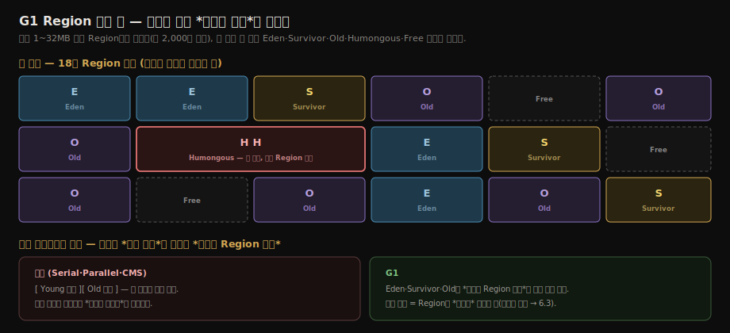
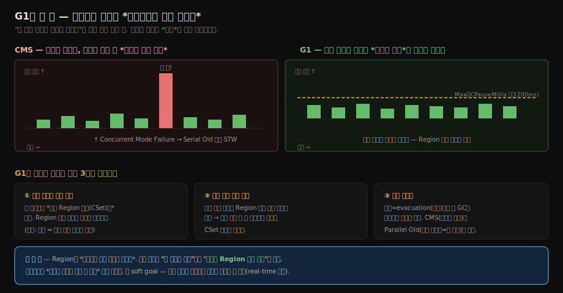
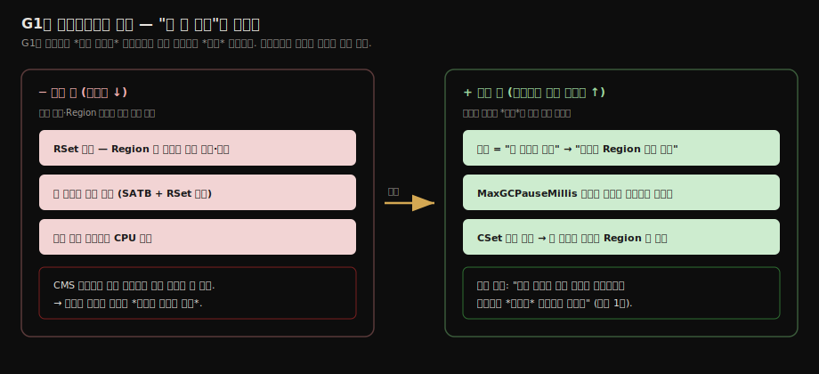
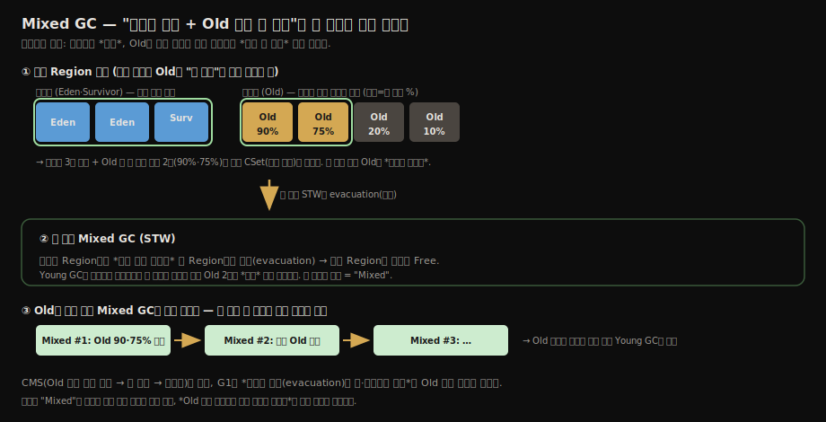
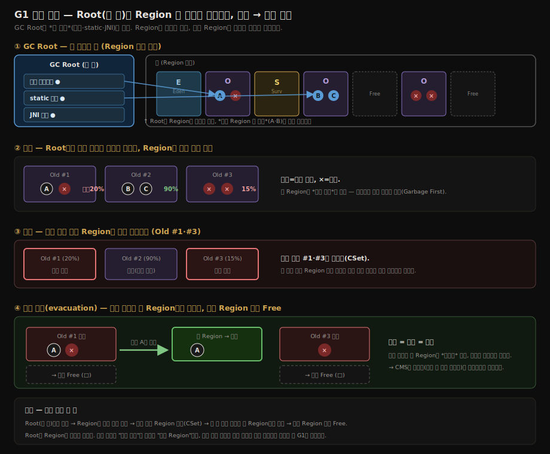

# G1 — Garbage First, 세대를 흐리다
---
> 자바 힙을 *고정된 세대*가 아니라 *균등한 영역(Region)* 으로 나눈다. 각 영역이 *그 순간* Eden·Survivor·Old·Humongous 중 하나의 역할을 한다.
>
> 한 줄로 압축하면 — **G1은 정지 시간을 "힙 크기의 함수"에서 "회수할 Region 수의 함수"로 바꿔, 사용자가 일시 정지 목표를 *설정*할 수 있게 만든 전환점**이다. 클래식 컬렉터(→ [02-06](./02-06.%ED%81%B4%EB%9E%98%EC%8B%9D%20%EA%B0%80%EB%B9%84%EC%A7%80%20%EC%BB%AC%EB%A0%89%ED%84%B0.md))가 STW를 줄여 온 역사의 끝이자, 저지연 GC(→ [02-08](./02-08.%EC%A0%80%EC%A7%80%EC%97%B0%20%EA%B0%80%EB%B9%84%EC%A7%80%20%EC%BB%AC%EB%A0%89%ED%84%B0.md))로 가는 다리다.

앞의 클래식 컬렉터들을 한 문단 프로필로 끝낸 것과 달리 G1만 한 편을 따로 두는 데는 이유가 있다. G1은 *기존 컬렉터의 변형*이 아니라 **힙 구조 자체를 다시 설계한 전환점**이라, 세대·회수 단위·일시 정지 모델이 한꺼번에 바뀐다.

클래식 시대를 닫고 02-08의 저지연 GC(ZGC·Shenandoah)로 가는 다리이기도 해서, 여기서 Region 모델을 제대로 잡아야 다음 노트가 수월하다. 단, *운영 옵션과 실패 모드의 상세 튜닝*은 이 노트의 범위(구조 전환 이해)를 넘으므로 [02-10 GC 선택하기](./02-10.GC%20%EC%84%A0%ED%83%9D%ED%95%98%EA%B8%B0.md)로 넘기고, 여기서는 *구조가 무엇을 바꿨는지*에 집중한다.

> G1을 읽기 전에 클래식 6종(Serial·ParNew·Parallel·CMS)을 [02-06](./02-06.%ED%81%B4%EB%9E%98%EC%8B%9D%20%EA%B0%80%EB%B9%84%EC%A7%80%20%EC%BB%AC%EB%A0%89%ED%84%B0.md)에서 먼저 보면, G1이 *무엇을 이어받고 무엇을 버렸는지*가 분명해진다. 특히 CMS(동시 마킹·마크-스윕·Concurrent Mode Failure)와의 대비가 이 편 전체를 관통한다.

## 1. Region 기반 힙

```
힙 전체 — N개의 Region (보통 1~32MB)
[E][E][S][O][O][H][_][_][E][O][S][_]...
E=Eden, S=Survivor, O=Old, H=Humongous, _=Free
```

- Region 크기는 JVM이 시작할 때 힙 크기에 맞춰 자동으로 정한다 (`-XX:G1HeapRegionSize`, 최소 1MB·최대 32MB). 
- Oracle 튜토리얼 기준으로 JVM은 *약 2,000개의 Region*을 목표로 잡는다. 기존 컬렉터의 세대가 *연속된 주소 공간*이었다면, G1의 Eden·Survivor·Old는 *Region 집합에 붙는 논리적 역할*일 뿐이라 연속일 필요가 없다.



- Humongous는 *Region 크기의 50%를 넘는 큰 객체* 전용. 일반 Region에 넣지 못해 *연속된 Region 집합*에 별도로 담는다. 
- 튜토리얼 시점(JDK 7) 기준 Humongous 회수는 최적화되지 않은 상태였고, Oracle은 *이 크기의 객체 생성 자체를 피하라*고 권고했다.

#### Region 기반의 강점:

- *어느 Region이 가장 회수 가치가 큰지* 미리 계산. *가장 가치 큰 Region부터* 회수 (이름이 Garbage First).
- *전체 힙을 매번 보지 않는다*. *대상 Region만* 본다.
- 사용자가 *최대 일시 정지 시간*(`-XX:MaxGCPauseMillis`, 기본 200ms)을 *목표*로 설정 — G1이 그 목표를 맞추기 위해 *Region 수를 조절*한다.

## 2. Region이 풀어낸 것 — 처리량이 아니라 지연시간의 예측 가능성

Region 분할이 처리량과 지연시간 중 무엇을 해결했는지 물으면, **답은 *지연시간* — 정확히는 *지연시간의 예측 가능성*이다.** Oracle 튜토리얼은 G1을 설명하기 전에 튜닝의 두 목표 축부터 구분한다.

- **응답성(responsiveness)** — 요청 하나가 얼마나 빨리 돌아오는가. 긴 일시 정지를 허용하지 못한다.
- **처리량(throughput)** — 단위 시간에 얼마나 많은 일을 하는가. 정지가 길어도 총량이 크면 된다.

Parallel Scavenge가 처리량 축을, CMS가 응답성 축을 각각 잡았다(둘 다 [02-06](./02-06.%ED%81%B4%EB%9E%98%EC%8B%9D%20%EA%B0%80%EB%B9%84%EC%A7%80%20%EC%BB%AC%EB%A0%89%ED%84%B0.md)). 문제는 CMS가 응답성을 잡는 방식이 불안정했다는 점이다. 평소엔 짧은 정지를 주다가 단편화가 누적되면 Concurrent Mode Failure로 수 초 STW가 터진다 — 평균은 좋은데 *최악이 예측 불가능*한 컬렉터였다.

G1의 설계 목표는 Oracle 문서 표현 그대로 **"일시 정지 시간 목표를 높은 확률로 충족하면서, 높은 처리량을 달성"**하는 것이다. 우선순위가 분명하다. *예측 가능한 일시 정지가 1차 목표*고, 처리량은 "크게 희생하지 않는다"는 제약 조건이다. Region이 이걸 가능하게 만든 메커니즘은 세 가지다.

1. **회수 범위가 조절 변수가 된다** — 기존 컬렉터의 정지 시간은 *세대 전체 크기의 함수*라 사용자가 손댈 수 없었다. G1은 한 번의 정지에서 *선택한 Region 집합(CSet)만* 회수하므로, Region 수를 줄이면 정지가 짧아진다.
2. **일시 정지 예측 모델(pause prediction model)** — 이전 회수들의 통계로 Region 하나를 회수하는 비용을 추정하고, `MaxGCPauseMillis` 목표 안에 몇 개를 회수할 수 있는지 역산해 CSet 크기를 정한다.
3. **증분 컴팩션** — 회수가 곧 evacuation(살아 있는 객체를 다른 Region으로 복사)이라 매 GC가 단편화를 조금씩 해소한다. CMS의 "컴팩션 없음"과 Parallel Old의 "전체 힙 컴팩션 = 긴 정지"라는 양 극단 사이의 절충이다.

단, G1은 *real-time 컬렉터가 아니다*. 목표는 soft goal — 높은 확률로 맞추지만 보장하지 않는다. 예측 모델이 통계 기반이라 할당 패턴이 급변하면 빗나간다.

> **혼동 주의 — "G1은 처리량과 지연시간을 둘 다 잡은 컬렉터"가 아니다.** 흔히 "둘 다 고려, 주는 처리량"이라 답하기 쉬운데 *우선순위가 거꾸로*다. 
>
> - Region이 푼 것은 **지연시간(의 예측 가능성)** 한 축이고, 처리량은 오히려 *비용을 지불*한 쪽이다(RSet·쓰기 장벽·동시 마킹 CPU). 
>
> 한 줄로 고정하면 — **"정지 시간을 *힙 크기의 함수*에서 *회수할 Region 수의 함수*로 바꿔, 사용자가 `MaxGCPauseMillis`로 목표를 묶을 수 있게 한 것"** 이 G1이 푼 단 하나의 문제다. "둘 다 잘함"이 아니라 "지연시간 목표를 1차로 두되 처리량을 *크게는* 희생하지 않음"이 정확한 표현이다.

처리량 관점에서는 오히려 비용을 *지불*했다.

- RSet 유지, 더 복잡한 쓰기 장벽, 동시 마킹 스레드의 CPU 점유 (5절). 
- 그래서 한 줄 답은 이렇다. **Region은 처리량을 올린 장치가 아니라, 정지 시간을 "힙 크기의 함수"에서 "회수할 Region 수의 함수"로 바꿔 지연시간을 사용자 목표에 묶을 수 있게 만든 장치다.**



위 그래프가 "어떻게 정지를 목표선 아래로 묶는가"를 보여 준다면, 아래 그림은 그 한 발 앞 — **무엇을 내주고 무엇을 얻었는가**, 그 교환의 방향을 한눈에 정리한다. 처리량을 *약간 내주고*(왼쪽) 지연시간의 예측 가능성을 *얻는*(오른쪽) 것이지, 둘 다 잡은 게 아니다.



## 3. Young GC — 비연속 세대가 만드는 자동 크기 조절

G1의 Young GC도 *전체 STW*라는 점은 클래식 컬렉터와 같다. Eden·Survivor의 살아 있는 객체를 멀티스레드 병렬로 하나 이상의 Survivor/Old Region에 evacuate하고, *매 Young GC가 끝날 때마다 다음 Eden·Survivor 크기를 다시 계산*한다. 이 계산에 일시 정지 목표가 들어간다 — 직전 정지가 목표보다 길었다면 다음 Eden을 줄이는 식이다.

이 재계산이 싸게 되는 이유가 비연속 Region이다. 세대가 연속 주소 공간이면 크기 변경이 곧 메모리 재배치지만, G1은 Region의 논리 역할만 바꾸면 끝난다.

여기서 Oracle의 베스트 프랙티스가 나온다 — **`-Xmn`으로 신세대 크기를 고정하지 말 것.** 고정하는 순간 G1은 Eden을 늘리고 줄일 수 없게 되고, 일시 정지 목표는 사실상 무력화된다.


> **헷갈리기 쉬운 점** — *객체를 옮기는 것(evacuate)* 자체는 G1이든 기존 마크-카피든 똑같이 한다(생존 수에 비례하는 비용). G1에서 싸진 것은 **세대 *크기를 바꾸는* 일**이다. 연속 영역은 Eden 경계를 옮기면 객체를 물리적으로 재배치해야 해 비싸지만, 비연속 Region은 *역할 꼬리표만* `Eden→Free`로 바꾸면 끝이라 거의 공짜다. 그래서 G1은 매 GC마다 크기를 정지 목표에 맞춰 미세 조정할 수 있다.

## 4. 동시 마킹 사이클과 Mixed GC

G1에는 청소가 *두 종류*다. 하나는 3절의 **Young GC** — 신세대(Eden·Survivor)만 비우는 *일상적인 청소*다. 자주 돌고, 매번 짧은 STW로 끝난다. 다른 하나가 이 절의 **동시 마킹 사이클** — 구세대까지 *힙 전체*를 훑어 "어디에 쓰레기가 많은지"를 조사하는 작업이다. 매번 돌지 않고, 힙이 어느 정도(기본 45%, 옵션 `InitiatingHeapOccupancyPercent`) 차오를 때만 *가끔* 시동을 건다. 일상 청소(Young)와 가끔 하는 대청소 준비(동시 마킹)로 나뉜다고 보면 된다.

여기서 한 가지가 중요하다. **동시 마킹 사이클은 정작 쓰레기를 치우지 않는다.** 힙 전체를 마킹하지만, 그 결과로 하는 일은 "어느 Old Region이 얼마나 비었나"를 *계산해 적어두는 것*뿐이다(완전히 빈 Region만 그 자리에서 회수한다). 실제로 Old의 쓰레기를 치우는 건 그다음에 오는 **Mixed GC**다.

#### "Mixed"는 무엇과 무엇을 섞는가

Mixed GC는 **신세대 전부(Eden+Survivor)에 더해, 구세대(Old) Region 몇 개를 끼워 넣어 한 번의 STW에 같이 비우는 것**이다. 이름의 "Mixed(섞음)"가 바로 이 *신세대 + 구세대 일부*의 혼합을 가리킨다.

핵심은 **비대칭**이다. 신세대는 *전부* 비우지만, 구세대는 *쓰레기가 많은 가치 큰 Region 몇 개만* 골라 넣는다. Old 전체를 한 번에 비우려 들면 정지가 길어지니까, 동시 마킹이 적어둔 "비어 있는 정도" 순위를 보고 **여러 번의 Young GC에 Old Region을 조금씩 나눠 끼우는** 것이다. 그래서 매 정지는 짧게 유지된다. 청소차가 동네 전체를 한 번에 돌지 않고, 평소 다니는 코스(신세대)에 쓰레기 많은 골목(Old Region) 몇 개씩만 매번 더 들르는 셈이다.

#### 왜 굳이 "섞는" 구조인가 — CMS와의 차이

이 "섞음"이 단순한 구현 디테일이 아니라 G1 설계의 핵심이다. CMS를 떠올려 보자. CMS는 Old를 치우려고 *Old 전용 청소 단계(동시 스윕)*를 따로 돌렸다. 그런데 그 스윕이 객체를 옮기지 않아 단편화가 쌓였고, 결국 Concurrent Mode Failure로 이어졌다.

G1에는 그런 **Old 전용 회수 단계가 아예 없다.** 대신 신세대를 비울 때 쓰는 동작 — 살아 있는 객체를 다른 Region으로 복사해 옮기고 원래 Region을 통째로 비우는 **evacuation(이주)** — 을 그대로 재사용한다. 이 이주 동작은 신세대든 구세대든 가리지 않는다(이 절 끝에서 다시 본다 — "어느 세대든 다른 Region으로 복사 하나로 통일"). 그러니 새 인프라를 만들 필요 없이, Young GC가 신세대를 이주시키는 김에 Old Region 몇 개를 *끼워 넣어 같이 이주*시키면 그만이다. 그래서 "섞어서(Mixed)" 처리한다. 한 줄로 — **"Mixed"는 Old 회수 전용 장치를 따로 두지 않고 Young GC 인프라에 Old Region을 얹는다는 G1의 설계를 드러내는 이름**이다.



책(§3.5)은 G1의 동작을 네 단계로 요약한다.

| 단계 | STW | 하는 일 |
|------|-----|--------|
| 1. **초기 마크** | ○ | GC Root 와 직접 연결 마크. Young GC와 함께 |
| 2. **동시 마크** | × | 마크 그래프 탐색 |
| 3. **재마크** | ○ | SATB 큐로 변한 참조 처리 |
| 4. **선별 회수** | ○ | 가장 가치 큰 Region들을 *선별*하여 마크-컴팩트 |

네 단계가 STW(전체 정지)와 동시(concurrent) 구간으로 어떻게 갈리는지 보면 다음과 같다. 가장 무거운 그래프 탐색을 동시 구간으로 빼서 정지 시간을 줄이는 것이 핵심이다.



G1 쪽도 같은 방식으로 재생해 볼 수 있다 — 동시 마크 도중 *회색 경로가 끊기는* 사건을 SATB가 큐에 기록해 살려두는 과정, 그리고 회수가 생존 객체를 다른 Region으로 복사(evacuation)하는 모습까지: [G1 마킹 + SATB (인터랙티브)](_assets/02-07-g1-phases.html). CMS의 증분 갱신(검은→흰 *새 참조*를 잡음)과 G1의 SATB(끊기는 *옛 참조*를 잡음)를 나란히 보면, 같은 객체 소실을 *반대 방향*에서 막는 두 전략이 분명해진다.

Oracle 튜토리얼은 같은 사이클을 여섯 단계로 더 쪼갠다. 책의 "재마크"와 "선별 회수" 사이에 무엇이 숨어 있는지가 보인다.

| 단계 | STW | 하는 일 |
|------|-----|--------|
| 1. **초기 마크** | ○ | Young GC에 *편승(piggyback)*. Old를 참조할 수 있는 Survivor Region(root region)을 마크 |
| 2. **루트 Region 스캔** | × | Survivor에서 Old로 들어가는 참조를 스캔. 다음 Young GC 전에 반드시 완료 |
| 3. **동시 마크** | × | 힙 전체의 살아 있는 객체 탐색. Young GC에 중단될 수 있음 |
| 4. **재마크** | ○ | SATB로 마킹 완결 — CMS의 증분 갱신보다 빠르다. *완전히 빈 Region은 즉시 회수* |
| 5. **정리(Cleanup)** | ○/× | Region별 생존량(liveness) 집계와 RSet 정리는 STW, 빈 Region의 free list 반환은 동시 |
| 6. **복사(Copying)** | ○ | liveness 낮은 Old Region들을 Young GC에 끼워 함께 evacuate — 로그의 `[GC pause (mixed)]` |

마지막 단계의 이름이 회수의 정체를 드러낸다. 마킹 사이클 자체는 빈 Region 즉시 회수를 빼면 *아무것도 회수하지 않고* "어느 Region이 얼마나 비었는지"만 계산한다. 실제 회수는 그 뒤의 Young GC 몇 번에 Old Region을 섞어 넣는 **Mixed GC**가 맡는다. CMS 같은 별도 스윕 단계가 없는 이유다 — 회수가 곧 evacuation이고, evacuation은 Young GC 인프라를 그대로 쓴다.

사이클 시작 조건도 CMS와 다르다. CMS가 *Old 세대 점유율*로 시동을 걸었다면, G1은 `-XX:InitiatingHeapOccupancyPercent`(기본 45) — *힙 전체* 점유율 기준으로 동시 사이클을 시작한다.

#### "복사하는데 왜 마크-컴팩트인가" — 동작과 분류는 다르다

여기서 헷갈리기 쉽다. G1의 회수는 *동작*만 보면 살아 있는 객체를 **다른 Region으로 복사**하니 마크-카피처럼 보인다. 그런데 클래식 분류표([02-06](./02-06.%ED%81%B4%EB%9E%98%EC%8B%9D%20%EA%B0%80%EB%B9%84%EC%A7%80%20%EC%BB%AC%EB%A0%89%ED%84%B0.md) §1)에는 *마크-컴팩트(영역별)*로 적혀 있다. 둘 다 맞다 — **동작은 복사, 분류는 컴팩트**다.

세 알고리즘을 한 줄로 구분하면 차이가 분명하다.

- **마크-카피** — 살아 있는 걸 *별도로 예약한 빈 절반(To 영역)*으로 복사. 항상 **50%를 비워 둬야** 한다. (G1은 이 50% 예약을 안 한다)
- **마크-컴팩트** — 살아 있는 걸 *모아* 단편화를 없앤다. (G1은 압축 효과를 낸다)
- **G1** — Region 단위로 살아 있는 객체를 *다른 Region으로 복사*하면, 원래 Region이 통째로 비고 생존 객체는 새 Region에 *빽빽이* 모인다. **복사라는 동작으로 압축이라는 효과를 낸다.**

그래서 G1은 *클래식 마크-카피의 50% 예약*도, *클래식 마크-컴팩트의 전체 힙 한 번에 압축*도 아니다. **Region 단위 복사가 모여 단편화를 조금씩 해소하는 절충** — 이게 2절의 *증분 컴팩션*이다. CMS(컴팩션 없음 → 단편화)와 Parallel Old(전체 압축 → 긴 정지)의 중간이다.

> **"CMS는 안 옮겨 최적화, G1은 옮겨 최적화 — 모순 아닌가?"** 두 컬렉터의 *최적화 목표가 다르다*. CMS의 "안 옮김"은 **동시 실행을 위한 선택**이었다 — 앱과 *동시에* 도는 중 객체 주소가 바뀌면 앱의 참조가 일제히 깨지므로, 안 옮기는 스윕을 택했다(대가는 단편화 → Concurrent Mode Failure). 반면 **G1의 evacuation(옮김)은 STW 구간 *안에서* 일어난다** — 옮기는 순간엔 앱이 멈춰 있어 참조가 깨질 걱정이 없다. 대신 그 STW를 *Region 몇 개만 처리하도록 잘게 끊어* 짧게 유지한다. 정리하면 — CMS는 "동시성으로 정지를 줄이되 안 옮긴다(→단편화)", G1은 "**옮기되 정지를 Region 단위로 잘게 끊어 짧게**(→단편화도 해소)". G1은 CMS의 두 약점(단편화·예측 불가 정지)을 *옮기는 시점을 STW 안으로 가두고 그 STW를 잘게 쪼개는* 한 수로 동시에 우회했다.

> 한 가지 더 — 회수 대상 Region에서도 두 경우가 갈린다. 마킹 결과 *생존 0*인 Region은 복사할 게 없어 **즉시 Free**(재마크 단계의 "완전히 빈 Region 즉시 회수")가 되고, *일부 생존* Region만 생존 객체를 복사한 뒤 Free가 된다. 즉 "Region이 비어 Free가 된다"의 비우는 과정이 곧 *evacuation(복사)*다 — 알아서 비는 게 아니다.


이 evacuation 동작은 신세대·구세대를 가리지 않는다. CMS가 신세대(마크-카피)·구세대(마크-스윕)를 다른 알고리즘으로 회수한 것과 달리, **G1은 어느 세대든 "다른 Region으로 복사" 하나로 통일**돼 있다. Young GC의 evacuate(3절)와 Mixed GC의 Old Region 회수가 같은 동작인 이유다.

## 5. G1이 받아들인 비용 — Region 모델의 청구서

Region 모델이 공짜는 아니다. 구조가 바꾼 비용을 한 가지만 짚으면 **Remembered Set(RSet)** 이다. Region마다 *자기를 가리키는 외부 참조 목록*을 하나씩 들고 있어야 한다 — RSet이 있어야 Region 하나를 *힙 전체를 스캔하지 않고* 독립적으로 회수할 수 있다. 즉 RSet은 *Region 모델의 열쇠이자 청구서*다. 여기에 쓰기 장벽도 다른 컬렉터보다 복잡해진다.


이 비용의 합이 G1의 성격을 정한다. 메모리 오버헤드는 *힙의 약 10%*라, 작은 힙(<6GB)에서는 비용 대비 효과가 적어 Parallel이 우세하기도 했다. **큰 힙(>6GB)에서 0.5초 미만의 예측 가능한 정지**가 필요할 때 G1의 가치가 본격적으로 드러난다 — Oracle이 제시한 표적도 정확히 그 그림이다.

> 비용이 가장 아프게 드러나는 실패 모드가 **Evacuation Failure**(로그의 `to-space overflow`)다. CMS의 Concurrent Mode Failure에 대응하는 G1의 실패 모드로, evacuate할 빈 Region이 없을 때 터진다. 이 실패의 예방책·운영 옵션(`MaxGCPauseMillis`·`G1ReservePercent` 등)·전환 신호 같은 *튜닝 상세*는 워크로드별 선택과 함께 [02-10 GC 선택하기](./02-10.GC%20%EC%84%A0%ED%83%9D%ED%95%98%EA%B8%B0.md)에서 다룬다.

JDK 9부터 *서버 디폴트*가 Parallel → G1 으로 바뀌었다 (`-XX:+UseG1GC`).

> Oracle 튜토리얼은 JDK 7 시절 문서다. 위 수치(Region 약 2,000개 목표, RSet <5% 등)는 그 시점의 측정이고, 튜토리얼의 로깅 옵션(`-XX:+PrintGCDetails` 등)은 JDK 9부터 `-Xlog:gc*` 통합 로깅으로 대체됐다.

## 6. 마치며

G1은 한 가지 질문을 다르게 물어서 풀었다. 이전 컬렉터가 "어떻게 더 빨리 다 치울까"를 물었다면, G1은 "**주어진 시간 안에 *얼마나* 치울까**"를 물었다. 그러려면 회수 단위를 힙 전체나 세대 전체가 아니라 *고를 수 있는 작은 조각*으로 쪼개야 했고, 그게 Region이다. Region 위에서 비로소 — 쓰레기 많은 곳부터 고르고(Garbage First), 시간 예산에 맞춰 몇 개를 회수할지 역산하고(예측 모델), 복사하는 김에 단편화도 해소하는(증분 컴팩션) 세 가지가 한꺼번에 가능해졌다.

이 편의 개념을 세 줄로 묶으면 이렇다.

- **Region** — 세대를 연속 주소 공간에서 *역할 꼬리표가 붙는 조각*으로 바꿨다. 그래서 정지 시간이 "힙 크기의 함수"에서 "회수할 Region 수의 함수"로 바뀌었다.
- **Mixed GC** — Old 전용 회수 단계를 만들지 않고, Young GC의 evacuation 인프라에 Old Region 일부를 *끼워* 같이 비운다. CMS의 별도 스윕(→ 단편화)을 구조적으로 없앤 선택이다.
- **RSet과 쓰기 장벽** — Region을 독립 회수하기 위한 *청구서*. 처리량을 약간 내주고 지연시간 예측 가능성을 산 대가다.

하지만 G1도 *정리(copy/compact)는 STW로* 한다. 마크는 동시에 돌리지만, 객체를 실제로 옮기는 순간엔 앱을 멈춘다. 큰 힙에서 그 STW가 회수할 Region 수에 비례해 길어지는 것이 G1의 마지막 한계다. 이 한계 — **"옮기는 동안에도 앱을 멈추지 않을 수 없을까"** — 를 정면으로 푼 것이 다음 편의 저지연 GC다.

다음 노트 [02-08 저지연 가비지 컬렉터](./02-08.%EC%A0%80%EC%A7%80%EC%97%B0%20%EA%B0%80%EB%B9%84%EC%A7%80%20%EC%BB%AC%EB%A0%89%ED%84%B0.md)는 ZGC와 Shenandoah가 *정리·이동마저 동시에* 돌려 일시 정지를 10ms 이하로 끌어내린 방법 — colored 포인터와 읽기 장벽 — 을 다룬다. G1의 Region 모델은 그 출발점이다.

## 관련 문서

- [02-06.클래식 가비지 컬렉터](./02-06.%ED%81%B4%EB%9E%98%EC%8B%9D%20%EA%B0%80%EB%B9%84%EC%A7%80%20%EC%BB%AC%EB%A0%89%ED%84%B0.md) — G1이 이어받고 버린 출발점. 특히 CMS(동시 마킹·마크-스윕·CMF)와의 대비
- [02-05.핫스팟 알고리즘 상세 구현](./02-05.%ED%95%AB%EC%8A%A4%ED%8C%9F%20%EC%95%8C%EA%B3%A0%EB%A6%AC%EC%A6%98%20%EC%83%81%EC%84%B8%20%EA%B5%AC%ED%98%84.md) — 3색 마킹·SATB·쓰기 장벽 등 G1이 쓰는 부품의 정의
- [02-08.저지연 가비지 컬렉터](./02-08.%EC%A0%80%EC%A7%80%EC%97%B0%20%EA%B0%80%EB%B9%84%EC%A7%80%20%EC%BB%AC%EB%A0%89%ED%84%B0.md) — G1의 영역 모델을 더 끌어내려 *동시 이동*까지 푼 ZGC·Shenandoah
- [02-10.GC 선택하기](./02-10.GC%20%EC%84%A0%ED%83%9D%ED%95%98%EA%B8%B0.md) — G1의 운영 옵션·Evacuation Failure 대응·워크로드별 선택
