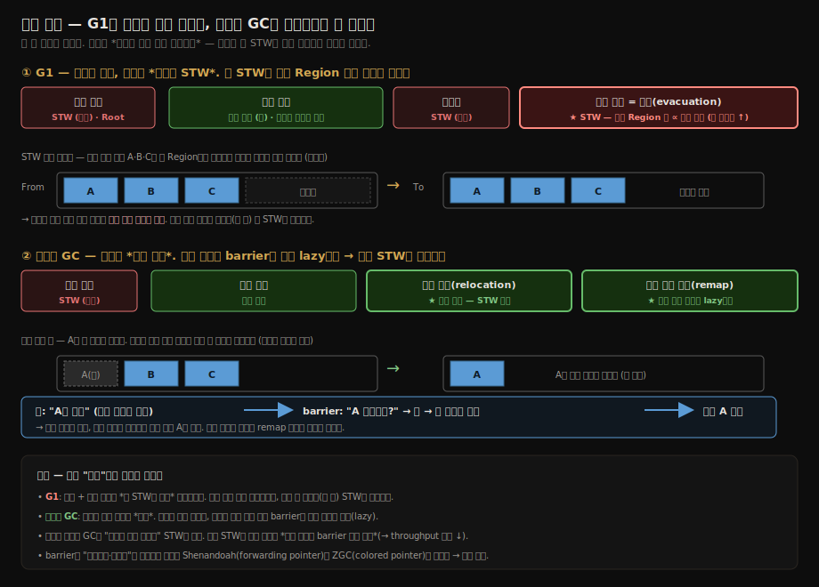
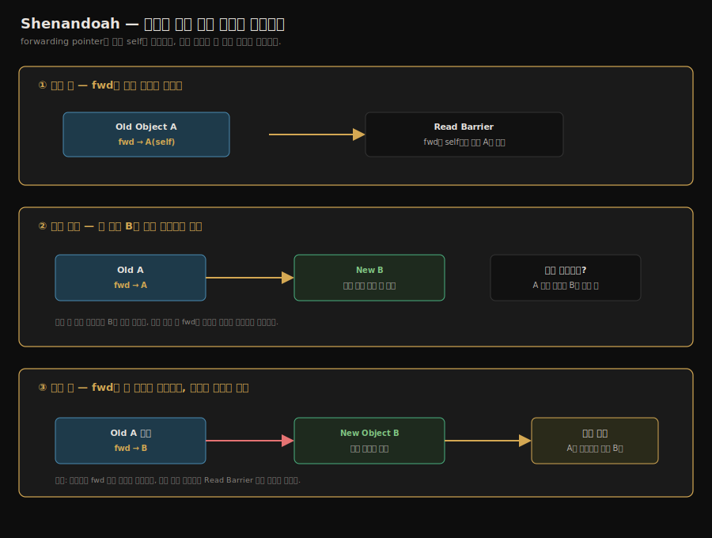
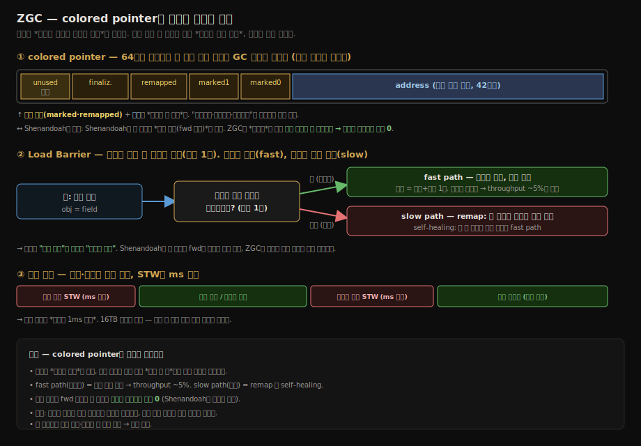
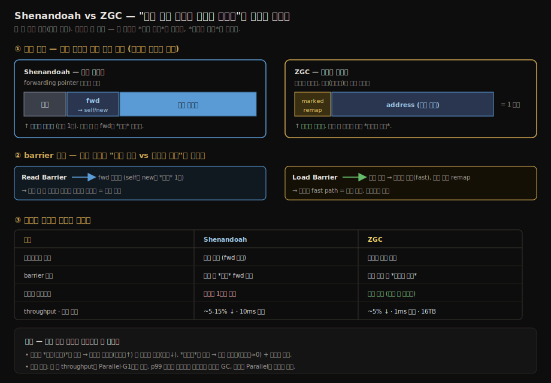

# 저지연 가비지 컬렉터
---
> **Shenandoah**와 **ZGC**는 그 한계를 *10ms 이하*로 끌어내린다. 둘은 다른 회사(Red Hat / Oracle)가 다른 길로 풀어낸 같은 문제 — *동시 마킹*뿐 아니라 *동시 정리·동시 이동*까지 가능하게 만들기 — 의 답이다. 
>
> 본 절을 한 줄로 압축하면 **저지연 GC의 본질은 "객체를 옮기는 동안에도 애플리케이션이 그 객체에 안전하게 접근하게 하는" 트릭**이며, Shenandoah는 *Brooks 포인터*로, ZGC는 *colored 포인터*로 같은 문제를 다르게 풀었다.


## 1. 일시 정지 시간의 끝나지 않은 싸움

> CMS와 G1은 *마크는 동시에, 정리는 STW로* 했다. 저지연 GC는 *정리도 동시에* 하려 한다.

GC 단계 중 *오래 걸리는 것*은 마크와 정리(copy/compact)다. CMS는 마크를 동시에 돌렸지만 *컴팩트를 안 했고*, G1은 컴팩트를 *Region별 STW*로 돌렸다. G1의 STW는 *대상 Region 수에 비례*하므로 큰 힙에서 길어진다.

저지연 GC의 야심은 *컴팩트조차 동시에* 돌리는 것이다. 그러려면 *애플리케이션이 객체에 접근하는 동안* GC가 *그 객체를 옮길 수 있어야* 한다. 정상적으로는 데이터 정합성이 깨진다. 두 컬렉터는 그 정합성을 *읽기 시점 장벽*으로 보장한다 — Shenandoah는 *Read Barrier*, ZGC는 *Load Barrier*로 이름과 구현은 다르지만(§4에서 대비) 역할은 같다.



핵심은 *객체 이동*과 *참조 갱신*을 분리하는 것이다. GC는 먼저 객체를 새 위치로 옮기고, 애플리케이션이 읽을 때는 barrier가 최신 위치를 찾아 준다. 이후 참조 갱신이 천천히 따라오므로 긴 STW 없이도 이동과 압축을 진행할 수 있다.

### 왜 "분리"가 동시 이동의 열쇠인가 — STW로 남은 단계의 정체

직전 편([02-07 G1](./02-07.G1%20%E2%80%94%20Garbage%20First.md))의 한계를 한 줄로 짚으면 — **G1은 마크는 동시에 했지만, *객체를 실제로 옮기는 단계(evacuation/compact)는 STW 안에서* 했다.** 옮기는 순간 앱을 멈춘 건 우연이 아니라 *필연*이었다. 객체를 새 주소로 옮기면 그 객체를 가리키던 *모든 참조가 한순간에 낡은 주소를 가리키게* 되는데, 앱이 그 사이 낡은 참조로 객체를 읽으면 *엉뚱한 메모리*를 보게 된다. 그래서 "옮기기 + 그 객체를 가리키는 참조 전부 고치기"를 *한 STW 안에 묶어* 원자적으로 끝냈다. 그 STW가 회수할 Region 수에 비례해, 큰 힙에서 길어진 것이다.

저지연 GC는 이 묶음을 **둘로 쪼갠다.**

1. **이동(relocation)** — GC가 객체를 새 위치로 옮긴다. 이때 참조는 *아직 안 고친다*. 낡은 참조가 그대로 남아 있다.
2. **참조 갱신(remapping)** — 낡은 참조들을 새 주소로 고치는 일. *이동과 따로, 앱과 동시에, 천천히* 진행한다.

문제는 ①과 ② 사이 — *참조는 낡았는데 객체는 이미 옮겨진* 그 틈에 앱이 그 참조로 객체를 읽으면? 여기서 **barrier**가 등장한다. 앱이 참조를 읽는 *그 순간* barrier가 끼어들어 "이 참조가 가리키는 객체가 옮겨졌나?"를 확인하고, 옮겨졌으면 *읽는 김에 최신 위치로 안내*한다. 즉 **참조 갱신을 한 번에 STW로 몰아서 하지 않고, 앱이 그 참조를 읽을 때마다 하나씩 lazy하게** 처리하는 것이다.

정리하면 — **STW로 남아 있던 단계는 "객체 이동 + 그에 따른 참조 갱신"이고, 저지연 GC는 둘을 분리해 이동은 동시에 하고 참조 갱신은 barrier로 미뤄 lazy하게 한다.** 이 한 수가 "옮기는 동안 앱을 멈춰야 한다"는 G1까지의 전제를 깬다. Shenandoah와 ZGC는 *이 barrier를 어떻게 구현하느냐*만 다를 뿐, 큰 그림은 똑같다.


## 2. Shenandoah — Red Hat의 길

> *Forwarding Pointer* 와 *Read Barrier* 로 동시 이동을 가능하게 한다.

### 2.1 Forwarding Pointer

각 객체 헤더에 *추가 워드*를 둔다. 이 워드는 평소에는 *자기 자신*을 가리키지만, *GC가 객체를 옮기는 중*에는 *새 위치*를 가리킨다.

```
원본 객체:           [헤더][fwd→self][필드들...]
GC가 이동 시작:      [헤더][fwd→new][필드들...]   (원본 자리에 forwarding pointer만)
이동 완료 후:        새 위치의 객체로 모든 참조가 갱신됨
```

애플리케이션이 객체를 읽을 때 *forwarding pointer를 따라간다*. 객체가 이동 중이라도 *최신 위치*에서 데이터를 본다.

### 2.2 Read Barrier

객체에서 *필드를 읽기 전마다* 자동 삽입되는 코드. forwarding pointer를 한 번 따라간다.

```
// 의사 코드 — Shenandoah가 모든 객체 읽기 전 자동 삽입
Object actual = ReadBarrier(obj);  // forwarding pointer 따라감
return actual.field;
```

애플리케이션이 이동 중인 객체를 읽을 때 forwarding pointer 를 거쳐 항상 최신 위치를 보는 흐름은 다음과 같다. 이동이 동시에 일어나도 읽기가 옛 위치를 보지 않는 이유가 여기에 있다.



이 한 번의 추가 디리퍼런스가 Shenandoah의 *런타임 비용*이다. *모든 객체 읽기*에 한 단계가 더 붙는다.

### 2.3 Shenandoah 단계

| 단계 | STW | 하는 일 |
|------|-----|--------|
| 1. 초기 마크 | ○ (짧음) | GC Root 마크 |
| 2. 동시 마크 | × | 마크 그래프 탐색 |
| 3. 최종 마크 | ○ (짧음) | 마크 마무리 + 회수 영역 결정 |
| 4. **동시 정리** | × | *애플리케이션이 도는 중에* 객체를 새 영역으로 복사 |
| 5. 초기 참조 갱신 | ○ (짧음) | 참조 갱신 시작 |
| 6. **동시 참조 갱신** | × | 모든 참조를 새 위치로 갱신 |
| 7. 최종 참조 갱신 | ○ (짧음) | 마무리 |

STW가 *모든 단계에서 짧다*. 큰 힙(수십 GB)에서도 일시 정지가 *10ms 이하*에 머문다.

### 2.4 Shenandoah의 한계

- **Read Barrier 비용** — 모든 객체 읽기에 *한 단계 추가*. throughput이 약 5~15% 줄어들 수 있다.
- **메모리 오버헤드** — forwarding pointer를 위한 *객체당 1워드*가 추가.

JDK 12부터 도입, *Oracle JDK에는 기본 미포함* (Temurin 등 OpenJDK 빌드에는 포함). `-XX:+UseShenandoahGC`로 활성화.


## 3. ZGC — Oracle의 길

> *컬러 포인터* (Colored Pointer) 로 객체 *마크 상태*를 포인터 자체에 인코딩한다.

### 3.1 컬러 포인터의 핵심 아이디어

64비트 포인터의 *상위 비트*는 실제로 *사용되지 않는다* (x86-64는 48비트만 유효). ZGC는 *상위 4비트*에 메타데이터를 넣는다.

```
[reserved][finalizable][remapped][marked1][marked0][address_42_bits]
```

이 비트들이 *그 객체의 GC 상태*를 표현한다. *마크됐는가*, *이동됐는가*, *주소가 최신인가* 같은 정보가 *포인터 한 워드에* 담긴다.

### 3.2 Load Barrier — 모든 참조 읽기에 자동 검사

객체 참조를 *읽어 올 때마다* 컬러 포인터의 상태 비트를 검사한다.

```
// 의사 코드
Object obj = field;             // 원본 읽기
if (obj 의 컬러가 stale) {        // Load Barrier
    obj = remap(obj);            // 최신 주소로 갱신
}
```

참조를 읽을 때 컬러 포인터의 상태 비트로 최신 여부를 판정하고, 낡았을 때만 remap 하는 흐름은 다음과 같다. 대부분은 fast path 로 빠져 비용이 거의 없다.



이 검사 자체는 *비교 한 번 + 분기 한 번*이라 빠르다. 대부분의 경우 분기가 *fast path*로 가서 비용이 거의 없다.

### 3.3 ZGC 단계

| 단계 | STW | 하는 일 |
|------|-----|--------|
| 1. 일시 정지 마크 시작 | ○ (짧음) | Root 마크, ms 미만 |
| 2. 동시 마크 / 재배치 | × | 마크 + 재배치 결정 |
| 3. 일시 정지 재배치 시작 | ○ (짧음) | 재배치 시작 |
| 4. 동시 재배치 | × | 객체 이동 |

ZGC의 일시 정지는 *언제나 1ms 이하*를 목표로 한다. 그러나 throughput은 약 5% 정도 떨어진다.

### 3.4 ZGC의 강점

- **거대한 힙** — 16TB까지 지원. ZGC가 *가장 큰 힙을 가장 짧은 일시 정지로* 다룬다.
- **메모리 오버헤드** — Shenandoah의 forwarding pointer가 없다. 객체 헤더가 변하지 않는다.

JDK 11에서 실험적, **JDK 15에서 stable**. JDK 21부터 *Generational ZGC*가 stable이 되어 신세대/구세대 구분 도입.


## 4. Shenandoah vs ZGC — 같은 목표, 다른 길



두 barrier는 이름이 비슷해 헷갈리지만 *동작이 다르다*. 차이는 **"객체에 도달하기까지 매번 우회를 거치느냐"** 다.

- **Shenandoah의 Read Barrier** — 객체를 읽을 때마다 **무조건 forwarding pointer를 한 번 따라간다.** 객체가 이동 중이든 아니든(평소엔 자기 자신을 가리킴) 디리퍼런스가 *항상* 한 단계 더 붙는다. 그래서 throughput 비용이 ZGC보다 크다(~5-15%). "참조가 가리키는 *객체의 헤더*를 거쳐 실제 위치로" 가는 방식이다.
- **ZGC의 Load Barrier** — 참조를 읽을 때 **포인터의 컬러 비트만 검사한다(비교+분기 1회).** 비트가 "최신"이면 *그대로 통과*(fast path) — 우회가 없다. "낡음"으로 찍힌 드문 경우에만 remap한다. 대부분의 읽기가 fast path라 비용이 작다(~5%). "참조 *자체에 박힌 상태 비트*를 보고 필요할 때만" 고치는 방식이다.

한 줄로 — **Shenandoah는 객체 헤더를 거쳐 *항상* 우회(느리지만 단순), ZGC는 포인터 비트를 보고 *대부분 통과*(빠르지만 포인터 트릭 필요).** 메타데이터를 *객체 헤더에 두느냐(Shenandoah) 포인터에 두느냐(ZGC)*의 차이가 이 동작 차이로 이어진다.

| 항목 | Shenandoah | ZGC |
|------|-----------|------|
| 추가 메타데이터 위치 | 객체 헤더 (forwarding pointer) | 포인터 상위 비트 |
| Barrier 종류 | Read Barrier (읽을 때 *항상* fwd 포인터 우회) | Load Barrier (비트 검사 후 *대부분 통과*) |
| Throughput 비용 | ~5-15% | ~5% |
| 메모리 오버헤드 | 객체당 1워드 추가 | 거의 없음 |
| 최대 일시 정지 목표 | 10ms 이하 | 1ms 이하 |
| 최대 힙 크기 | 수 TB | 16TB |
| JDK 21 기본 포함 | Temurin·OpenJDK 일부 | 모든 OpenJDK 빌드 |
| Generational 지원 | JDK 21+ | JDK 21+ (stable) |

두 컬렉터의 *공통 한계*는 *낮은 throughput*이다. Parallel·G1보다 *총 GC 시간*이 더 길다. 그래서 *처리량이 최우선*인 배치 작업에는 Parallel이 여전히 우세하고, *응답 시간이 최우선*인 서비스에는 ZGC/Shenandoah가 좋은 선택이다.


## 5. 한 줄로 정리

§3.6은 GC 역사의 *현재*다. *마크는 물론 정리도 동시에* 돌리는 두 컬렉터가 일시 정지의 한계를 *밀리초 미만*까지 끌어내렸다. Shenandoah는 *forwarding pointer + read barrier*의 길로, ZGC는 *colored pointer + load barrier*의 길로 같은 목표에 도달했다. 둘은 *throughput을 일정 부분 양보하는 대가*로 *latency를 얻는다*.

다음 노트([02-09 GC 스레드 구성과 graceful degradation](./02-09.GC%20%EC%8A%A4%EB%A0%88%EB%93%9C%20%EA%B5%AC%EC%84%B1%EA%B3%BC%20graceful%20degradation.md))는 *GC 스레드 구성*을 다룬다. 저지연 컬렉터가 애플리케이션과 동시에 도는 만큼, parallel·concurrent 스레드 수와 *losing the race*(앱이 할당하는 속도가 GC의 동시 회수 속도를 앞지르는 경우)가 다음 질문이 된다.


## 6. 실습 연결

| 실습 | 위치 | 다루는 것 |
|------|------|---------|
| ZGC 일시 정지 측정 | `_practice/ch03-gc/zgc/` | `-XX:+UseZGC` + 큰 힙(`-Xmx4g`) + GC 로그에서 *Pause* 시간 추출 |
| Shenandoah 일시 정지 측정 | `_practice/ch03-gc/shenandoah/` | `-XX:+UseShenandoahGC` 동일 방식 |
| Throughput 비교 | `_practice/ch03-gc/common/` | 같은 워크로드를 Parallel vs G1 vs ZGC 로 돌려 *총 시간*과 *일시 정지* 비교 |


## 관련 문서

- [02-06.클래식 가비지 컬렉터](./02-06.%ED%81%B4%EB%9E%98%EC%8B%9D%20%EA%B0%80%EB%B9%84%EC%A7%80%20%EC%BB%AC%EB%A0%89%ED%84%B0.md) — Shenandoah·ZGC가 *극복하려 한* 클래식 컬렉터들의 일시 정지 한계
- [02-10.GC 선택하기](./02-10.GC%20%EC%84%A0%ED%83%9D%ED%95%98%EA%B8%B0.md) — 저지연 GC가 적합한 워크로드와 그렇지 않은 워크로드의 의사결정
- [02-11.실전 — 메모리 할당과 회수 전략](./02-11.%EC%8B%A4%EC%A0%84%20%E2%80%94%20%EB%A9%94%EB%AA%A8%EB%A6%AC%20%ED%95%A0%EB%8B%B9%EA%B3%BC%20%ED%9A%8C%EC%88%98%20%EC%A0%84%EB%9E%B5.md) — 동시 이동이 가능한 GC에서 *할당 위치*가 갖는 의미
