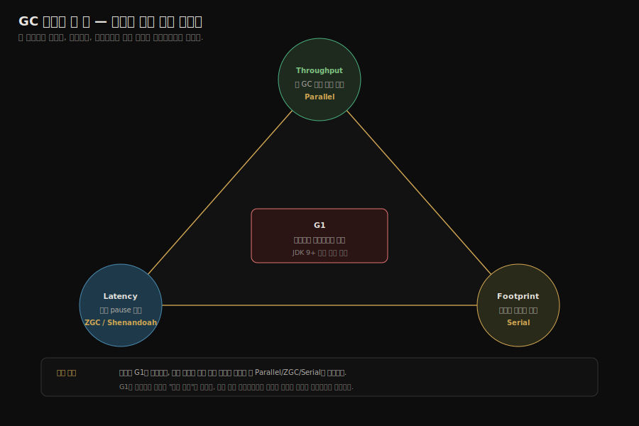
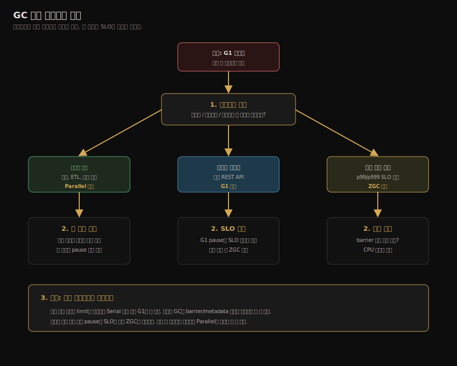
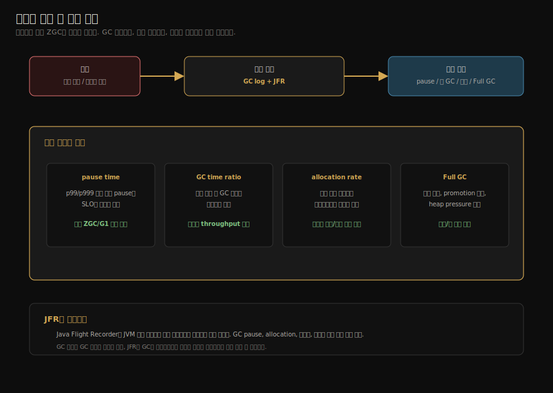

# GC 선택하기
---
> 컬렉터 7종을 알았다면 다음 질문은 *어느 워크로드에 어떤 컬렉터를 쓰느냐*다. §3.7은 그 결정의 좌표를 잡는다. 본 노트는 책의 기준 + JDK 21 시점의 보정으로, *세 가지 우선순위*와 *워크로드별 의사결정 트리*를 정리한다. 본 절을 한 줄로 압축하면 — **GC 선택은 처리량·지연·풋프린트 세 지표 중 *어느 둘을 포기할지*의 문제이며, JDK 디폴트의 변천이 그 우선순위의 *시대적 합의*를 보여 준다**.

## 1. 선택의 세 가지 우선순위

GC 선택은 *어느 지표를 우선시할지*로 갈린다.

| 우선순위 | 핵심 지표 | 적합한 컬렉터 |
|---------|---------|--------------|
| Throughput (처리량) | 전체 GC 시간 비율 최소 | Parallel |
| Latency (응답 시간) | 한 번의 일시 정지 최대 길이 | ZGC, Shenandoah |
| Footprint (메모리) | 힙 + GC 메타데이터 총합 | Serial |

세 지표는 *서로 트레이드오프*다. ZGC가 응답 시간을 1ms로 끌어내리는 대신 throughput을 5% 양보한다. Serial은 메모리를 최소화하지만 일시 정지가 길다.

같은 관계를 삼각으로 그리면 *어느 둘을 잡으려면 나머지 하나를 어디까지 양보해야 하는지*가 한눈에 보인다.

위쪽 세 지표가 *목표*, 아래쪽 네 컬렉터가 *그 목표에 가까운 답*이다. G1만 두 지표(처리량과 응답 시간) 사이에 *동시에* 걸쳐 있어 핑크로 격리했다 — JDK 9부터의 디폴트가 G1이 된 이유가 이 위치에 있다.

## 2. JDK 버전별 디폴트 — *언제 무엇이 표준이었나*

| JDK 버전 | 서버 디폴트 | 비고 |
|---------|------------|------|
| JDK 1.4 ~ 8 | Parallel | throughput 우선 |
| JDK 9 ~ 현재 | **G1** | 균형 (latency + throughput) |
| JDK 21+ | G1 (디폴트 유지) | ZGC가 Generational stable, 옵션으로 쉽게 전환 |

디폴트가 G1이 된 후 *대부분의 서비스는 옵션을 건드리지 않고 G1*을 쓴다. 옵션 변경의 정당화는 *측정 후*에야 한다 — "이 워크로드에서 G1 일시 정지가 X ms이고 SLO가 Y ms라 ZGC로 전환" 같은 근거.

## 3. 워크로드별 의사결정 트리

세 가지 의사결정 포인트.

1. **힙 크기** — 작으면 단순한 GC가 빠르고, 크면 동시 GC가 가치 있다
2. **워크로드 성격** — 배치 작업(throughput 우선) vs 실시간 응답(latency 우선)
3. **SLO** — p99 응답 시간 목표가 *얼마나 엄격한지*

SLO(Service Level Objective)는 “서비스가 지켜야 하는 측정 가능한 목표”다. 예를 들어 `p99 응답 시간 200ms 이하`, `월 가용성 99.9% 이상`처럼 숫자로 표현한다. GC 선택에서는 특히 p95·p99 지연 시간이 중요하다. 평균 응답은 괜찮아도 GC로 한 번 길게 멈추면 p99가 바로 망가질 수 있기 때문이다.

워크로드는 애플리케이션이 실제로 수행하는 일의 성격이다. 배치처럼 긴 계산을 많이 하는지, 웹 API처럼 짧은 요청을 많이 받는지, 게임·거래처럼 지연에 민감한지, 캐시처럼 큰 힙을 오래 유지하는지에 따라 같은 GC라도 결과가 달라진다.

## 4. 워크로드별 권장 — 실무 예시

### 4.1 배치 처리 / 빅데이터 작업

- *총 처리량이 핵심*. 일시 정지는 길어도 *총 처리 시간이 짧으면 OK*
- **Parallel** 권장. `-XX:+UseParallelGC -XX:GCTimeRatio=99`
- 예: Spark Executor, MapReduce Worker, 배치 ETL

### 4.2 일반 웹 서비스 (REST API)

- *p99 응답 시간*이 SLO. 보통 200~500ms 허용
- **G1** (디폴트) 권장. `-XX:+UseG1GC -XX:MaxGCPauseMillis=100`
- 예: Spring Boot 서비스, 사내 API

### 4.3 실시간성 높은 서비스 (Trading, 채팅, 게임)

- *p99가 10ms 미만*. 한 번이라도 멈추면 안 됨
- **ZGC** 권장. `-XX:+UseZGC -XX:+UseDynamicNumberOfGCThreads`
- 예: 주문 매칭 엔진, 실시간 푸시, 멀티플레이 서버

### 4.4 대규모 캐시 / 인메모리 데이터베이스

- *힙이 수십~수백 GB로 크다*. 일시 정지가 길면 *그 사이 들어오는 모든 요청이 stall*
- **ZGC** 권장. `-XX:+UseZGC -Xmx64g`
- 예: 인메모리 캐시 서버, JVM 기반 RDB

### 4.5 컨테이너 / 마이크로서비스 (작은 힙)

- 힙이 작고(< 512MB) *시작 시간*과 *메모리 풋프린트*가 중요
- **Serial** 또는 **G1** (디폴트로 둠)
- 예: Knative function, K8s 사이드카

## 5. 책 §3.7의 추가 고려 사항

저우즈밍이 강조하는 *컬렉터 외적 선택 변수* 두 가지.

### 5.1 *JDK 배포판*에 따라 가용 컬렉터가 다르다

| 배포판 | Serial | Parallel | G1 | ZGC | Shenandoah |
|--------|------|--------|------|------|-----------|
| Oracle JDK | ○ | ○ | ○ | ○ | × |
| Temurin (Eclipse) | ○ | ○ | ○ | ○ | ○ |
| Amazon Corretto | ○ | ○ | ○ | ○ | ○ |
| Azul Zing | ○ | ○ | ○ | ○ (C4) | ○ |

본 저장소 실습은 **Temurin 21**이라 Shenandoah까지 모두 가용.

### 5.2 *애플리케이션 외 비용*을 측정해야 한다

GC 일시 정지는 *직접 비용*이다. 그러나 GC를 *피하기 위해* 코드를 비틀면 *간접 비용*이 든다. 두 비용을 비교해야 한다.

- *객체 풀링*으로 할당을 줄이는 코드는 *복잡도가 늘고 버그 위험이 커진다*
- *오프힙 데이터 구조*는 GC를 피하지만 *직렬화·역직렬화* 비용이 든다

저우즈밍의 권고는 *먼저 측정하고, 그 다음 결정*이다. *GC가 진짜 병목인지*는 GC 로그·JFR·`jstat`로 검증한 뒤 컬렉터 변경을 시도한다.

## 6. 한 줄로 정리

§3.7은 세 가지 명제로 압축된다.

1. *대부분의 워크로드는 G1로 충분*하다. 디폴트를 안 건드리는 게 첫 선택이다.
2. *처리량이 명확히 우선*이면 Parallel, *응답 시간이 명확히 우선*이면 ZGC로 옮긴다.
3. *컬렉터 변경 전에 측정*한다. GC 로그·JFR로 *진짜 병목*이 GC인지 확인한다.

다음 노트(02-07)는 §3.8 실전 — *메모리 할당과 회수 전략*을 코드로 따라간다. Eden→Survivor→Old 흐름, Pretenure 임계, age 임계의 *실측*이 그 주제다.

## 7. 실습 연결

| 실습 | 위치 | 다루는 것 |
|------|------|---------|
| GC 4종 동일 워크로드 비교 | `_practice/ch03-gc/common/` + 각 컬렉터 모듈 | 같은 워크로드를 Serial / Parallel / G1 / ZGC 로 돌려 *총 시간*과 *최대 일시 정지* 비교 |
| 의사결정 트리 검증 | `_practice/ch03-gc/` | 본 노트의 트리에 따라 실제 측정 결과가 일치하는지 확인 |

## 관련 문서

- [02-06.클래식 가비지 컬렉터](./02-06.%ED%81%B4%EB%9E%98%EC%8B%9D%20%EA%B0%80%EB%B9%84%EC%A7%80%20%EC%BB%AC%EB%A0%89%ED%84%B0.md) — 본 노트의 의사결정 트리에서 *처리량 우선* 가지가 가리키는 컬렉터들
- [02-07.저지연 가비지 컬렉터](./02-07.%EC%A0%80%EC%A7%80%EC%97%B0%20%EA%B0%80%EB%B9%84%EC%A7%80%20%EC%BB%AC%EB%A0%89%ED%84%B0.md) — *지연 우선* 가지가 가리키는 ZGC·Shenandoah
- [02-10.실전 — 메모리 할당과 회수 전략](./02-10.%EC%8B%A4%EC%A0%84%20%E2%80%94%20%EB%A9%94%EB%AA%A8%EB%A6%AC%20%ED%95%A0%EB%8B%B9%EA%B3%BC%20%ED%9A%8C%EC%88%98%20%EC%A0%84%EB%9E%B5.md) — 컬렉터 선택 후 *할당 전략*을 코드로 검증하는 다음 단계
