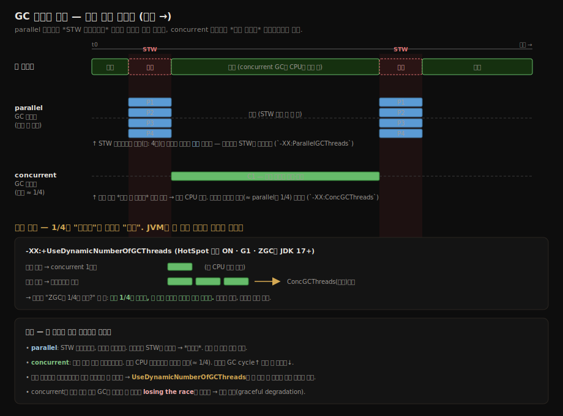
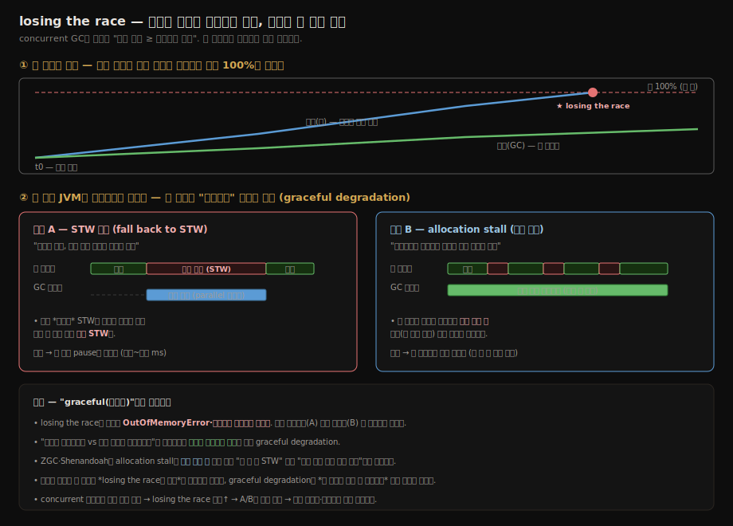

# GC 스레드 구성과 graceful degradation
---
> GC 스레드 수는 처리량·일시 정지·CPU 점유의 삼각 균형을 가르는 손잡이다. parallel 스레드와 concurrent 스레드는 서로 다른 단계를 맡고, 조정 방향이 반대로 작동한다. 
>
> 그리고 concurrent 컬렉터가 할당 속도를 못 따라가는 순간 — GC가 "losing the race"라 부르는 상황 — JVM은 graceful degradation으로 STW에 기대거나 애플리케이션의 할당을 늦춘다. 
>
> **GC 스레드 수는 처리량과 CPU 경쟁 사이의 trade-off이고, 그 균형이 깨지는 한계 지점을 막는 안전장치가 graceful degradation이다.**

> 출처 메모 — 본 노트는 《JVM Performance Engineering》(Beckwith) 1장의 GC 스레드 구성 단락을 ch02(《밑바닥까지 파헤치기》 2부) 운영 갈래로 흡수한 것이다. 두 책 출처가 섞이지 않도록 `source` 필드에 흡수 출처를 명시한다.

## 1. 두 종류의 GC 스레드

> parallel 스레드는 STW 구간을 *여럿이 나눠* 빨리 끝내고, concurrent 스레드는 애플리케이션과 *동시에* 백그라운드로 돈다. 맡는 단계가 다르므로 옵션도 따로 있다.

GC가 일하는 방식은 두 갈래다. 핫스팟은 이 둘을 별개 옵션으로 조정한다.

1. 하나는 애플리케이션을 멈춰 세운 STW 구간을 여러 스레드가 분담해 빨리 끝내는 방식
2. 애플리케이션이 도는 동안 백그라운드 스레드가 마킹·정리를 동시에 진행하는 방식

| 옵션 | 대상 단계 | 기본값 |
|------|----------|--------|
| `-XX:ParallelGCThreads=<n>` | **STW 구간을 나눠 처리하는 parallel 스레드** | start-up 시 코어 수의 일부로 자동 계산 |
| `-XX:ConcGCThreads=<n>` | **애플리케이션과 동시에 도는 concurrent 스레드** | 보통 parallel 스레드 수의 1/4 |

- parallel 스레드 수는 Java 프로세스가 start-up 시점에 인식한 코어 수를 기준으로 자동 계산된다. concurrent phase를 쓰는 컬렉터(CMS·G1·ZGC·Shenandoah)는 그 위에 concurrent 스레드를 따로 둔다. 
- 왜 1/4이 기본인가 — concurrent 스레드는 애플리케이션 스레드와 *같은 시간에* CPU를 쓰므로, parallel과 같은 수로 띄우면 애플리케이션이 쓸 CPU를 GC가 절반 가까이 빼앗는다. 기본값을 낮게 잡아 동시 실행 중에도 애플리케이션이 충분한 CPU를 갖도록 한다.

두 종류의 스레드가 시간축 위에서 실제로 언제 도는지를 보면 차이가 분명하다. parallel 스레드는 STW 구간에서만 여럿이 한꺼번에 깨어나 짧게 일하고 사라지고, concurrent 스레드는 앱이 도는 내내 백그라운드로 함께 돈다.

### 1.1 동적 조절 — 1/4은 고정값이 아니라 상한이다

지금까지 1/4을 *기본값*이라 불렀지만, 현대 컬렉터에서는 이 값이 고정된 상수가 아니다. `-XX:+UseDynamicNumberOfGCThreads`를 켜면 JVM이 힙 사용률·현재 GC 부하를 보고 **매 GC 주기마다 실제로 쓸 스레드 수를 늘렸다 줄였다** 한다. 이때 `ParallelGCThreads`·`ConcGCThreads`는 *고정값*이 아니라 *상한(cap)* 으로 작동한다. 즉 유휴 상태에서는 적게 써서 애플리케이션 CPU를 최대한 보존하고, 할당이 폭주하는 순간에는 상한까지 순간적으로 스레드를 늘려 회수를 따라잡는다.

이 플래그는 HotSpot에서 **기본 ON**이고 G1은 오래전부터 이를 따른다. ZGC는 **JDK 17부터** 이 플래그를 존중한다 — 그 전에는 고정 스레드 수를 쓰며 무시했다. 그래서 "ZGC도 concurrent 스레드를 parallel의 1/4만 쓰는가?"라는 질문의 정확한 답은 이렇다 — JDK 17+ ZGC는 1/4을 *고정으로* 박아 쓰는 게 아니라, 이 동적 조절로 최소한의 스레드만 쓰되 *생성 속도를 따라잡기에 충분한 만큼* 늘린다. 손수 고정값을 박으면 워크로드마다 다른 최적점을 못 맞추지만, 동적 조절은 상황을 보고 스스로 맞추므로 다음 절에서 볼 losing the race를 애초에 덜 만든다.

> 근거 — `UseDynamicNumberOfGCThreads`는 HotSpot 기본 ON([Per Liden, ZGC in JDK 17](https://malloc.se/blog/zgc-jdk17)), G1의 동적 스레드 사이징은 [JEP 308](https://openjdk.org/jeps/308). ZGC는 JDK 17부터 이 플래그를 존중한다(그 이전 버전은 고정 스레드). ZGC 튜닝 상세는 [05-02](./05-02.ZGC%20%EC%8B%AC%ED%99%94%EC%99%80%20%EC%9B%8C%ED%81%AC%EB%A1%9C%EB%93%9C%EB%B3%84%20GC%20%EC%84%A0%ED%83%9D.md)가 SSOT다.

## 2. 스레드 수 조정의 trade-off

> parallel을 늘리면 STW가 짧아지지만 자원을 더 먹고, concurrent를 늘리면 GC cycle이 빨라지지만 애플리케이션과 CPU를 두고 경쟁한다. 두 손잡이는 반대 방향의 비용을 부른다.

parallel 스레드를 늘린다면? 

- STW 구간을 더 잘게 나눠 처리하므로 일시 정지가 짧아지고 GC 처리량이 오른다. 그만큼 애플리케이션 처리량도 높아질 수 있다. 
- 다만 스레드가 많아지면 그 스레드들이 점유하는 CPU·메모리 자원도 늘어나므로, 시스템 자원을 과도하게 빨아들이지 않도록 주의해야 한다.

concurrent 스레드를 늘린다면? 

- GC cycle이 빨리 끝나는 대신 CPU 사용량이 올라가고, 그 CPU를 애플리케이션 스레드와 직접 경쟁한다. 
- 반대로 줄이면 CPU 사용은 낮아지지만 GC가 천천히 돌아 일시 정지가 길어질 수 있다. 그래서 parallel·concurrent 스레드 수와 애플리케이션 성능 사이의 균형점은 책상에서 정하는 값이 아니라 성능 테스트와 모니터링으로 찾아야 하는 값이다.

## 3. losing the race와 graceful degradation

> concurrent 컬렉터가 할당 속도를 못 따라가는 순간이 한계 지점이다. 
>
> 이때 JVM은 STW로 떨어지거나 애플리케이션의 할당을 늦춰 정합성을 지킨다 — 이것이 graceful degradation이다.

concurrent 컬렉터의 전제는 *"청소하는 속도 ≥ 더럽히는 속도"* 라는 부등호다. concurrent 컬렉터는 애플리케이션이 객체를 할당하는 *그 와중에* 회수를 진행하는데, 애플리케이션의 할당 속도가 GC의 회수 속도를 앞지르면 이 부등호가 뒤집힌다. 회수가 끝나기 전에 힙이 차 버리는 것이다. GC는 이 상황을 "losing the race"(경주에서 진다)라 부른다. CMS 시절에는 같은 상황에 concurrent mode failure라는 이름이 붙었다.

이때 작동하는 안전장치가 graceful degradation이다. 두 방향으로 나타난다. 어느 쪽이든 losing the race가 곧바로 `OutOfMemoryError`나 크래시로 직행하지 않고, 정합성은 지키되 성능을 *우아하게* 떨어뜨린다는 점에서 "graceful"이다.

1. STW 모드로 fallback해 애플리케이션을 멈춰 세운 뒤 회수를 따라잡는다. 이때의 STW는 스케줄에 따라 *계획된* 정지가 아니라, 공간이 없어 어쩔 수 없이 세운 **응급 STW**라는 점이 다르다. 저지연 목표를 잠깐 포기하고 처리량 모드로 후퇴하는 셈이다.
2. 새 할당을 요청한 애플리케이션 스레드를 잠깐씩 멈춰 세워 할당 속도 자체를 억제한다. 이 개별 할당의 지연을 **allocation stall**이라 부른다. 앱 전체를 세우는 게 아니라 *할당하려는 스레드만* 짧게 붙잡아 GC가 따라올 여유를 주는 것이다.

ZGC·Shenandoah는 이 allocation stall을 짧게 여러 번 나눠 걸어, "긴 한 방 STW" 대신 "짧은 여러 번의 미세 지연"으로 분산한다. 저지연 컬렉터의 낮은 최대 정지 시간은 이런 완충을 잘게 쪼갠 결과이기도 하다.

graceful degradation은 [02-08](./02-08.%EC%A0%80%EC%A7%80%EC%97%B0%20%EA%B0%80%EB%B9%84%EC%A7%80%20%EC%BB%AC%EB%A0%89%ED%84%B0.md)에서 본 저지연 컬렉터(ZGC·Shenandoah)와도 맞닿는다. 

- 저지연 컬렉터는 애플리케이션 스레드가 GC를 돕게 만들거나 반대로 back off하게 만드는 방식으로 같은 한계 상황을 흡수한다. 
- 결국 스레드 수 튜닝은 *losing the race가 일어나는 빈도*를 조절하는 일이고, graceful degradation은 *그 순간이 와도 무너지지 않게* 하는 마지막 방어선이다.

## 4. 세 성능 축과의 연결

> GC 스레드 튜닝은 추상적인 값 맞추기가 아니라, 응답성·처리량·발자국 중 무엇을 우선하느냐의 표현이다.

GC는 세 가지 성능 축을 동시에 노린다. 응답성(responsiveness)은 자극을 보낸 뒤 응답을 받기까지의 시간이고, 처리량(throughput)은 초당 수행 가능한 연산 수이며, 발자국(footprint)은 같은 데이터를 더 작은 공간에 담는 정도다. 스레드 수 조정은 이 세 축 위의 위치를 옮기는 일이다 — parallel을 늘려 STW를 줄이면 응답성에 무게가 실리고, concurrent를 줄여 CPU를 아끼면 애플리케이션 처리량에 무게가 실린다. 어느 축을 우선할지는 02-10(GC 선택하기)의 의사결정과 한 흐름으로 이어진다.

## 5. 한 줄로 정리

> 두 손잡이(parallel·concurrent 스레드)와 한 안전장치(graceful degradation). 셋 다 측정으로 균형점을 찾는 값이다.

GC 스레드 구성은 두 손잡이와 한 안전장치로 요약된다.

1. *parallel 스레드*(`-XX:ParallelGCThreads`) — STW 구간을 나눠 일시 정지를 줄인다. 코어 수 기반 자동 계산.
2. *concurrent 스레드*(`-XX:ConcGCThreads`) — 애플리케이션과 동시에 돌며, 기본은 parallel의 1/4. 늘리면 빠르되 CPU 경쟁.
3. *동적 조절*(`-XX:+UseDynamicNumberOfGCThreads`) — 위 두 값을 고정이 아니라 상한으로 두고 JVM이 매 주기 스스로 조절. G1·ZGC·Shenandoah 기본 ON.
4. *graceful degradation* — concurrent 컬렉터가 losing the race에 빠지면 응급 STW fallback이나 allocation stall로 정합성을 지킨다.

세 항목 모두 *책상에서 정하는 값이 아니라 측정으로 찾는 값*이라는 점이 핵심이다.

## 관련 문서

- [02-06.클래식 가비지 컬렉터](./02-06.%ED%81%B4%EB%9E%98%EC%8B%9D%20%EA%B0%80%EB%B9%84%EC%A7%80%20%EC%BB%AC%EB%A0%89%ED%84%B0.md) — parallel 스레드를 쓰는 STW 컬렉터들의 실체
- [02-08.저지연 가비지 컬렉터](./02-08.%EC%A0%80%EC%A7%80%EC%97%B0%20%EA%B0%80%EB%B9%84%EC%A7%80%20%EC%BB%AC%EB%A0%89%ED%84%B0.md) — concurrent 스레드로 동시 정리·이동을 하는 ZGC·Shenandoah, graceful degradation의 무대
- [02-10.GC 선택하기](./02-10.GC%20%EC%84%A0%ED%83%9D%ED%95%98%EA%B8%B0.md) — 응답성·처리량·발자국 중 무엇을 우선할지의 의사결정
