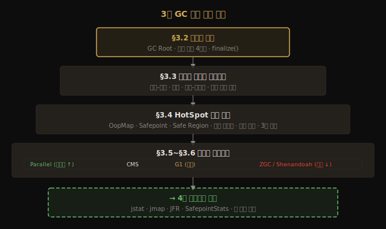

# 마치며 — 3장이 4장 GC 모니터링 도구에 거는 토대
---
> 3장의 마지막 §3.9는 한 페이지로 짧습니다. 그러나 책 전체에서 3장이 어디에 자리하는지를 한 번 더 정리하고, 4장 *GC 모니터링과 문제 해결 도구*로 넘어가기 위한 시야를 잡습니다. 3장 전체를 한 줄로 압축하면 — **GC는 "어느 객체가 죽었는가"라는 도달성 판정 위에 세 알고리즘과 7+2종 컬렉터를 쌓아 올린 곡**이며, 4장은 그 곡이 *지금 내 JVM에서 어떤 박자로 도는지*를 측정합니다.

## 0. 3장 지식 계층 한눈에 — 챕터 핵심 요약

> 도달성 판정이 최상위 전제이고, 알고리즘·HotSpot 구현·컬렉터가 그 위에 층층이 쌓이며, 4장 모니터링은 이 탑 전체를 측정 대상으로 삼습니다.

## 1. 3장이 정의한 좌표

> §3.2~§3.8의 각 절은 독립적인 주제가 아니라 *한 층씩 쌓이는 전제 관계*입니다. 아래층 어휘를 모르면 윗층이 설명이 아닌 암기가 됩니다. 그리고 이 모든 층이 4장 측정의 *전제*입니다.

§3.2가 *어떤 객체가 죽었는가*에 답했고, §3.3은 *어떻게 회수할 것인가*의 세 알고리즘을 정의했습니다. 

§3.4는 HotSpot이 그 알고리즘을 *어떻게 실제로* 돌리는지(OopMap·Safepoint·카드 테이블·쓰기 장벽) 보여 줬고, §3.5와 §3.6은 그 부품을 조합한 *완성된 컬렉터 7종*을 다뤘습니다. 

§3.7은 *어느 컬렉터를 언제 쓰는지*의 의사결정 트리를, §3.8은 *객체 일생의 다섯 규칙*을 코드로 따라갔습니다.

이 모든 답이 4장의 *전제*입니다. 4장은 *지금 내 JVM이 어떤 GC 패턴을 보이고 있는지* 측정하는 법을 다룹니다. 측정의 의미를 알려면 3장에서 정의한 *영역, 알고리즘, 컬렉터, 일생*의 어휘를 먼저 알아야 합니다.

예를 들어 `jstat -gc`가 내뿜는 `S0C`, `EU`, `OC` 같은 컬럼은 Eden·Survivor·Old 영역 이름을 그대로 씁니다. §3.8에서 따라갔던 *객체 일생의 다섯 규칙*을 이해하지 않으면 숫자가 올라가는 방향이 "좋은 것인지 나쁜 것인지"를 판단할 수 없습니다. Concurrent Mode Failure라는 로그 메시지도 §3.5의 CMS 동작 원리를 알아야 비로소 "Old 영역이 동시 회수보다 빠르게 차고 있다"는 신호로 읽힙니다.

| 3장에서 정착시킨 어휘 | 4장에서 활용하는 방식 |
|---------------------|--------------------|
| 도달성·약한 세대 가설 | GC 로그 해석의 기본 |
| 마크-스윕/카피/컴팩트 | 컬렉터별 STW 시간 차이 이해 |
| Safepoint·OopMap | `-XX:+PrintSafepointStatistics` 로 측정 |
| 카드 테이블·쓰기 장벽 | GC 오버헤드 분석 |
| Eden→Survivor→Old | `jstat -gc` 로 영역별 사용량 추적 |
| Pretenure·Tenuring | GC 로그의 `age 분포` 해석 |
| Concurrent Mode Failure | 운영 사고의 신호 |

## 2. 4장으로 가져갈 세 가지 질문

> 세 질문 모두 3장 어휘 위에서만 의미가 생깁니다. 4장의 도구들은 이 질문에 대한 측정 수단이고, 3장은 그 측정값을 해석하는 언어입니다.

3장을 마무리하면서 들고 갈 질문 세 가지입니다.

1. **GC가 *언제* 그리고 *얼마나* 도는가?** GC 로그의 첫 번째 답입니다. 4장의 `jstat`, `-Xlog:gc*`, JFR이 이 질문에 답합니다. Minor GC가 초당 몇 번 발생하는지, Full GC 주기가 얼마나 되는지를 수치로 확인할 수 있습니다.
2. **GC가 *어느 영역*에서 무엇을 회수하는가?** 4장의 `jmap`, 힙 덤프, MAT 분석이 답합니다. 어떤 클래스의 인스턴스가 Old 영역을 차지하고 있는지, 누수가 어디서 비롯됐는지를 추적할 수 있습니다.
3. **GC가 *왜 길어졌는가*?** 4장의 안전 지점 로그, 쓰기 장벽 비용 측정, `-XX:+PrintReferenceGC` 가 답합니다. STW가 예상보다 긴 원인이 Safepoint 진입 지연인지, Reference 처리인지, 카드 테이블 스캔 비용인지를 구분할 수 있습니다.

세 질문은 *3장에서 정착시킨 어휘 위에서만 의미가 있습니다*. 본 저장소에서는 4장 진단 도구 노트를 같은 폴더의 `03-NN`으로 이어 붙였습니다. 명령줄 도구는 `03-01`, 시각화 도구는 `03-02`, 통합 JVM 로깅은 `03-03`에서 확인합니다.

## 3. 3장 노트 요약 인덱스

> 8편 노트 각각이 한 질문에 하나씩 답합니다. 이 표는 "어느 편을 다시 봐야 하는가"를 판단하는 탐색 지도입니다.

| 노트 | 핵심 |
|------|------|
| [02-03.대상이 죽었는가](./02-03.%EB%8C%80%EC%83%81%EC%9D%B4%20%EC%A3%BD%EC%97%88%EB%8A%94%EA%B0%80.md) | 도달성 분석·GC Root·약한 참조 4단계·`finalize()` |
| [02-04.가비지 컬렉션 알고리즘](./02-04.%EA%B0%80%EB%B9%84%EC%A7%80%20%EC%BB%AC%EB%A0%89%EC%85%98%20%EC%95%8C%EA%B3%A0%EB%A6%AC%EC%A6%98.md) | 마크-스윕/카피/컴팩트, 약한 세대 가설, 카드 테이블 입문 |
| [02-05.핫스팟 알고리즘 상세 구현](./02-05.%ED%95%AB%EC%8A%A4%ED%8C%9F%20%EC%95%8C%EA%B3%A0%EB%A6%AC%EC%A6%98%20%EC%83%81%EC%84%B8%20%EA%B5%AC%ED%98%84.md) | OopMap·Safepoint·Safe Region·카드 테이블·쓰기 장벽·3색 마킹 |
| [02-06.클래식 가비지 컬렉터](./02-06.%ED%81%B4%EB%9E%98%EC%8B%9D%20%EA%B0%80%EB%B9%84%EC%A7%80%20%EC%BB%AC%EB%A0%89%ED%84%B0.md) | Serial·ParNew·Parallel·CMS·G1, *세대를 흐리다* |
| [02-08.저지연 가비지 컬렉터](./02-08.%EC%A0%80%EC%A7%80%EC%97%B0%20%EA%B0%80%EB%B9%84%EC%A7%80%20%EC%BB%AC%EB%A0%89%ED%84%B0.md) | Shenandoah·ZGC, forwarding pointer vs colored pointer |
| [02-09.GC 스레드 구성과 graceful degradation](./02-09.GC%20스레드%20구성과%20graceful%20degradation.md) | parallel/concurrent GC 스레드 수·trade-off·losing the race·graceful degradation |
| [02-10.GC 선택하기](./02-10.GC%20%EC%84%A0%ED%83%9D%ED%95%98%EA%B8%B0.md) | 세 가지 우선순위·JDK 디폴트 변천·워크로드별 의사결정 트리 |
| [02-11.실전 — 메모리 할당과 회수 전략](./02-11.%EC%8B%A4%EC%A0%84%20%E2%80%94%20%EB%A9%94%EB%AA%A8%EB%A6%AC%20%ED%95%A0%EB%8B%B9%EA%B3%BC%20%ED%9A%8C%EC%88%98%20%EC%A0%84%EB%9E%B5.md) | 다섯 할당 규칙 + TLAB |
| [02-01.GC 운영 — 로그와 튜닝](./02-01.GC%20%EC%9A%B4%EC%98%81%20%E2%80%94%20%EB%A1%9C%EA%B7%B8%EC%99%80%20%ED%8A%9C%EB%8B%9D.md) | `-Xlog:gc*` 로그 해석·`jstat`·힙/GC 옵션·튜닝 체크리스트 |

## 3a. GC 구현체 한눈 비교

> 3장 7개 절을 한 표로 압축합니다. 같은 축(목표·알고리즘·STW·채택 버전)으로 7개 컬렉터를 나란히 보는 것 자체가 §3.7 선택 트레이드오프를 몸에 익히는 방법입니다.

| GC | 목표 | 기본 알고리즘 | STW 특성 | 기본 채택 버전 |
|---|---|---|---|---|
| **Serial GC** | 단순, 단일 스레드 | Mark-Compact | 전체 STW | - |
| **Parallel GC** | 처리량 최대화 | 병렬 Mark-Compact | Young/Old 모두 STW | Java 8 기본 |
| **CMS** | 낮은 지연 | 동시 Mark-Sweep | Old 단계별 일부 동시 | Deprecated |
| **G1 GC** | 예측 가능한 지연 | Region 기반 | 짧고 예측 가능한 STW | Java 9+ 기본 |
| **ZGC** | 서브밀리초 지연 | 컬러드 포인터 + 로드 배리어 | 거의 동시 (< 1ms) | Java 21+ 기본 |
| **Shenandoah** | 낮은 지연 | Brooks 간접 포인터 | 거의 동시 | OpenJDK 12+ |

같은 컬렉터들을 *처리량 ↔ 저지연* 한 축에 늘어놓으면 선택의 트레이드오프가 한눈에 보입니다. 왼쪽 끝에는 처리량을 우선하는 Parallel, 가운데에는 균형과 예측 가능성을 노리는 G1, 오른쪽 끝에는 짧은 일시 정지를 우선하는 ZGC·Shenandoah가 놓입니다.

## 4. 실습 정리

> `_practice/ch03-gc/` 의 8개 서브모듈은 같은 워크로드를 컬렉터별로 돌려 *총 처리 시간*과 *최대 일시 정지*가 얼마나 달라지는지를 직접 측정합니다. 이 두 수치가 §3.7 선택 트레이드오프의 실측 근거입니다.

`_practice/ch03-gc/` 아래 8개 서브모듈(공통 워크로드 + Serial·Parallel·CMS·G1·ZGC·Shenandoah + 할당 데모)이 3장의 핵심 결정 — *컬렉터 선택과 메모리 할당 전략* — 을 직접 손으로 확인하게 합니다. 같은 워크로드를 다른 컬렉터로 돌렸을 때 *총 시간*과 *최대 일시 정지*가 어떻게 달라지는지가 핵심 측정점입니다.

측정 결과를 볼 때 중요한 점이 있습니다. 처리량 중심 워크로드에서는 Parallel GC가 전체 실행 시간이 가장 짧게 나오는 경우가 많습니다. 반면 최대 일시 정지만 놓고 보면 ZGC가 압도적으로 짧습니다. 어느 수치가 "더 좋다"는 정해진 답이 없고, §3.7에서 정의한 워크로드 우선순위(처리량·지연·메모리 점유)에 따라 다른 컬렉터가 승리합니다. 실습의 목적은 그 트레이드오프를 숫자로 몸에 새기는 것입니다.

## 관련 문서

> 3장의 각 편은 위 §3 인덱스로, 운영 실무는 01-01로, 직전 챕터 맥락은 ch02 마치며로 연결됩니다.

- [02-01](./02-01.GC%20%EC%9A%B4%EC%98%81%20%E2%80%94%20%EB%A1%9C%EA%B7%B8%EC%99%80%20%ED%8A%9C%EB%8B%9D.md) — `-Xlog:gc*` 해석·`jstat`·튜닝 옵션 (운영 갈래)
- [02-03](./02-03.대상이%20죽었는가.md) · [02-04](./02-04.가비지%20컬렉션%20알고리즘.md) · [02-05](./02-05.핫스팟%20알고리즘%20상세%20구현.md) · [02-06](./02-06.클래식%20가비지%20컬렉터.md) · [02-07](./02-08.저지연%20가비지%20컬렉터.md) · [02-08](./02-09.GC%20스레드%20구성과%20graceful%20degradation.md) · [02-09](./02-10.GC%20선택하기.md) · [02-10](./02-11.실전%20—%20메모리%20할당과%20회수%20전략.md) — 본 마치며가 묶는 3장의 여덟 정독 노트
- [`./01-04.마치며.md`](./01-04.마치며.md) — 직전 챕터의 마치며 (2장이 3장에 거는 토대 → 본 노트로 자연 연결)
- [`../_practice/ch03-gc/`](../_practice/ch03-gc/) — 8개 서브모듈 (allocation·common·serial·parallel·cms·g1·zgc·shenandoah)
