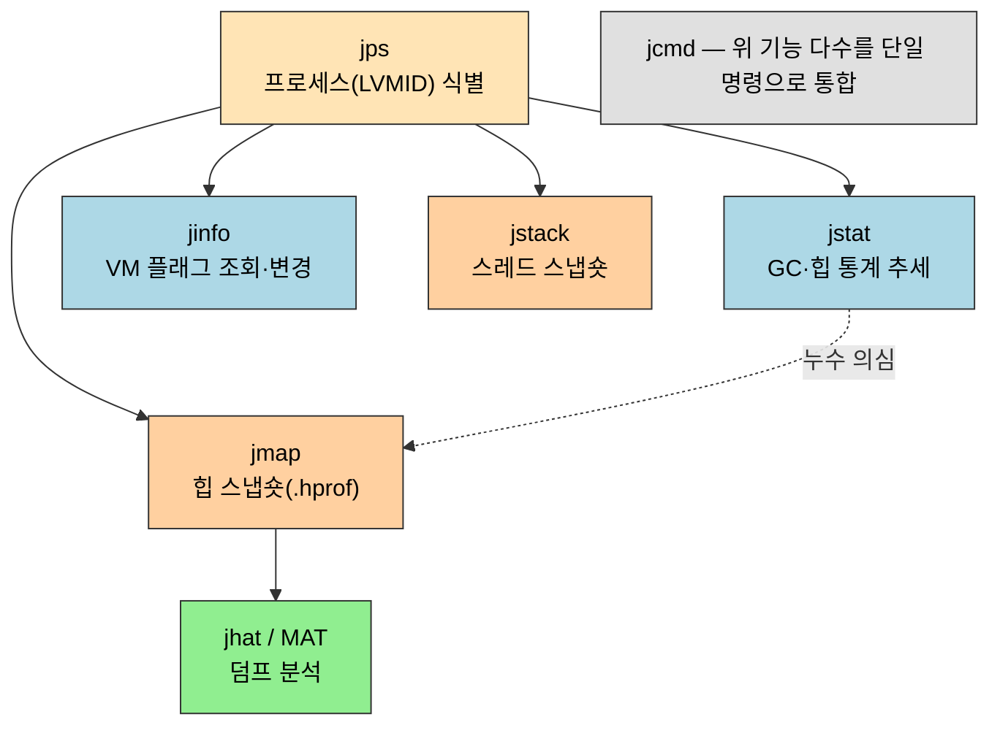
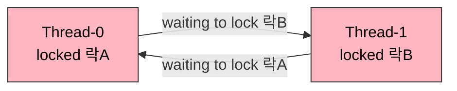

# 기본 문제 해결 도구 — 명령줄 도구
---
> §4.1~§4.2는 *운영 데이터를 어떻게 모으고 읽는가*를 다룹니다. 시스템 장애의 단서는 예외 스택·GC 로그·스레드 스냅숏·힙 덤프 네 곳에 흩어져 있고, JDK가 기본 제공하는 작은 명령줄 도구들이 이 데이터를 뽑아냅니다. 본 절을 한 줄로 압축하면 — **jps로 프로세스를 찾고, jstat로 흐름을 관찰하다 이상이 보이면 jmap으로 힙을, jstack으로 스레드를 한 시점에 떠서 분석한다**. 도구 하나하나가 아니라 *어떤 데이터를 왜 그 시점에 뜨는가*가 핵심입니다.

이 글을 읽고 나면 운영 중인 JVM에서 프로세스를 식별하고, GC 통계를 실시간으로 읽어 메모리 누수를 의심하고, 힙 덤프와 스레드 덤프를 떠서 데드락·OOM의 원인을 명령줄만으로 좁혀 들어갈 수 있습니다.


## 1. 들어가며 — 데이터가 먼저, 도구는 그다음

> 도구를 외우기 전에 *무엇을 뜨려는가*를 먼저 잡습니다. 도구는 네 종류 데이터를 뽑는 수단일 뿐입니다.

이 개념은 이미 아는 `ps`·`top` 같은 OS 프로세스 진단의 발상을 JVM 내부로 좁힌 것입니다. OS 도구는 프로세스의 CPU·메모리 *총량*만 보지만, JDK 도구는 그 안의 힙 세대 구성·GC 횟수·스레드 상태까지 들여다봅니다.

시스템에 문제가 생겼을 때 분석의 바탕이 되는 데이터는 네 종류입니다. 각 데이터가 어느 명령줄 도구로 나오는지 먼저 지도를 그립니다.



| 데이터 | 무엇을 말하는가 | 뜨는 도구 |
|--------|----------------|-----------|
| 예외 스택 트레이스 | 코드 어느 줄에서 무엇이 터졌는가 | (애플리케이션 로그) |
| GC 로그 | 힙이 언제·얼마나 회수되는가, STW가 긴가 | `jstat`, `-Xlog:gc*` |
| 스레드 스냅숏 (thread dump) | 스레드가 무엇을 하다 멈췄는가, 데드락인가 | `jstack` |
| 힙 스냅숏 (heap dump) | 어떤 객체가 힙을 차지하는가, 누수인가 | `jmap` |

> 이 도구들은 JDK `bin` 디렉터리에 들어 있는 수백 KB짜리 작은 실행 파일입니다. 대부분은 JDK 안의 `tools.jar`(`sun.tools.*`) 클래스를 감싼 얇은 래퍼라, 같은 일을 코드에서 직접 호출할 수도 있습니다. 무겁게 설치하는 별도 도구가 아니라 *이미 깔려 있는* 진단 수단이라는 점이 1순위로 손이 가는 이유입니다.


## 2. jps — 가상 머신 프로세스 상태 도구

> §4.2.1. 다른 도구가 대상 VM을 지정하려면 프로세스 ID가 필요합니다. jps는 그 ID를 알려주는 출발점입니다.

`jps`(JVM Process Status)는 OS의 `ps`에 대응합니다. 실행 중인 가상 머신 프로세스의 *LVMID*(Local VM ID, 보통 OS의 PID와 같음)를 나열합니다. 다른 모든 도구가 `vmid`를 인자로 받으므로, 진단은 거의 항상 `jps`로 시작합니다.

```bash
# 옵션 없이 — LVMID + 메인 클래스(또는 jar) 이름
jps
# 예: 22232 Jps   22168 RemoteRegistry

# -l : 메인 클래스의 풀 패키지명 또는 jar 경로까지
jps -l
# 예: 2388 sun.tools.jconsole.JConsole
#     2972 com.sun.tools.hat.Main      ← 풀 클래스명이라 무슨 프로세스인지 명확
```

자주 쓰는 옵션은 네 가지입니다. 무엇을 더 보고 싶은가로 고릅니다.

| 옵션 | 추가로 보여주는 것 |
|------|--------------------|
| `-q` | LVMID만 (클래스명 생략) |
| `-l` | 메인 클래스 풀네임 또는 jar 경로 |
| `-m` | `main()`에 전달된 인자 |
| `-v` | VM에 넘긴 JVM 옵션 (`-Xms` 등) |

`-l`을 붙이는 이유는 옵션 없는 출력의 `Jps`·`RemoteRegistry` 같은 짧은 이름만으로는 *어느* 자바 프로세스인지 구분이 안 되기 때문입니다. 운영 서버에 자바 프로세스가 여러 개 떠 있으면 풀 클래스명이 식별의 결정타가 됩니다.


## 3. jstat — 가상 머신 통계 정보 모니터링 도구

> §4.2.2. GUI 없는 서버 콘솔에서 *실시간으로* 힙·GC·클래스로딩·JIT 컴파일 통계를 흘려보는 도구. 메모리 누수를 *추세*로 잡습니다.

`jstat`(JVM Statistics Monitoring Tool)은 한 시점의 스냅숏이 아니라 *일정 간격으로 반복 출력*해 시간에 따른 변화를 봅니다. 그래서 "Old 영역이 계속 차오르기만 하고 Full GC 후에도 안 줄어든다" 같은 *누수 추세*를 콘솔만으로 읽어낼 수 있습니다.

호출 형식은 `jstat -<옵션> <vmid> <조회 간격(ms)> <조회 횟수>`입니다.

```bash
# 5484 프로세스의 GC 이용률을, 250ms 간격으로 20번 조회
jstat -gcutil 5484 250 20
```

쓸 수 있는 옵션은 조회 대상에 따라 갈립니다. 자주 쓰는 묶음만 추립니다.

| 옵션 | 조회 대상 |
|------|-----------|
| `-class` | 클래스 로딩·언로딩 수, 점유 공간, 로딩 시간 |
| `-gc` | 힙 각 영역(Eden·Survivor·Old·Metaspace)의 용량과 사용량, GC 누적 시간 |
| `-gccapacity` | 각 영역의 최소·최대 용량 |
| `-gcutil` | 각 영역 사용률(%)과 GC 누적 시간 — 가장 자주 씀 |
| `-gccause` | `-gcutil` + 직전/이번 GC가 *왜* 일어났는지 원인 |
| `-gcnew` / `-gcold` | 신세대 / 구세대 GC 상태 |
| `-compiler` | JIT 컴파일러가 컴파일한 메서드 수·시간 |
| `-printcompilation` | JIT가 컴파일한 메서드 목록 |

`-gcutil`의 출력 컬럼은 영역과 GC 횟수·시간으로 나뉩니다. 한 줄을 읽을 줄 알면 누수가 보입니다.

```
  S0     S1     E      O      M     CCS    YGC   YGCT    FGC   FGCT    GCT
  0.00  66.55  31.15  16.20  ...   ...      6    0.673    0    0.000  0.673
```

- `S0`·`S1` — 두 Survivor 영역 사용률(%). 한쪽은 보통 0이다(Survivor는 한 번에 하나만 쓴다).
- `E`·`O` — Eden·Old 영역 사용률(%).
- `M`·`CCS` — Metaspace·압축 클래스 공간 사용률(%).
- `YGC`·`YGCT` — Young GC 횟수와 누적 시간(초).
- `FGC`·`FGCT` — Full GC 횟수와 누적 시간(초). `FGC`가 빠르게 늘면 위험 신호.
- `GCT` — 전체 GC 누적 시간(초).

예를 들어 `-gcutil`을 250ms 간격으로 흘려보는데 `O`가 천천히 100%로 차오르고 `FGC`가 한 번씩 올라가는데도 `O`가 안 줄면, Old에 회수 안 되는 객체가 쌓이는 메모리 누수를 의심하고 다음 단계인 `jmap` 힙 덤프로 넘어갑니다. GUI(JConsole·VisualVM)가 없는 원격 서버 콘솔에서 이 추세 관찰이 `jstat`의 존재 이유입니다.


## 4. jinfo — 자바 설정 정보 도구

> §4.2.3. 실행 중인 VM이 *실제로 적용한* 파라미터를 조회하고, 일부는 *재시작 없이* 실시간으로 바꿉니다.

`jinfo`(Configuration Info for Java)는 두 가지를 합니다. 첫째, VM이 적용한 파라미터를 조회합니다 — `java -version`으로는 안 보이는, 기본값으로 자동 설정된 옵션까지 `-flag`로 확인할 수 있습니다. 둘째, 일부 *관리 가능(manageable)* 플래그는 실행 중에 값을 바꿉니다.

```bash
# 특정 플래그의 현재 값 조회
jinfo -flag CMSInitiatingOccupancyFraction 1444

# 부울 플래그 켜기/끄기 (실행 중 변경)
jinfo -flag +HeapDumpOnOutOfMemoryError 1444
jinfo -flag -PrintGCDetails 1444

# 값 지정 변경
jinfo -flag MaxHeapFreeRatio=70 1444

# 시스템 프로퍼티 전체 (System.getProperties() 와 동등)
jinfo -sysprops 1444
```

실행 중 변경이 되는 플래그는 *manageable*로 분류된 일부뿐입니다. `-Xmx` 같은 힙 크기는 시작 시점에 고정되므로 `jinfo`로 못 바꿉니다 — 바꿀 수 있는 건 GC 로깅 토글이나 일부 임계값처럼 *런타임에 영향이 닫혀 있는* 플래그로 한정됩니다. 재시작 비용이 큰 운영 프로세스에서 GC 로그를 잠깐 켜 관찰하고 다시 끄는 용도로 씁니다.


## 5. jmap / jhat — 힙 덤프 생성과 분석

> §4.2.4~§4.2.5. jmap은 힙의 *스냅숏 사진*을 파일로 떠내고, jhat은 그 사진을 읽어 분석합니다. 누수의 *범인 객체*를 찾는 경로입니다.

`jmap`(Memory Map for Java)은 힙 덤프(heap dump, `.hprof`)를 파일로 생성합니다. 덤프는 그 시점 힙에 살아 있는 *모든 객체의 사진*이라, 어떤 클래스의 인스턴스가 몇 개·몇 바이트를 차지하는지 사후에 분석할 수 있습니다.

```bash
# 바이너리 포맷(format=b)으로 15596 프로세스의 힙을 eclipse.bin 파일에 덤프
jmap -dump:format=b,file=eclipse.bin 15596
# 예: Dumping heap to C:\Users\...\eclipse.bin ...   Heap dump file created
```

`jmap`의 주요 옵션은 *무엇을* 뜨느냐로 갈립니다.

| 옵션 | 뜨는 것 |
|------|---------|
| `-dump:[live,]format=b,file=<f>` | 힙 스냅숏을 파일로. `live`를 붙이면 살아 있는(도달 가능한) 객체만 |
| `-heap` | 힙 상세 — 사용 중인 GC, 각 영역 용량·사용량 |
| `-histo` | 클래스별 인스턴스 수·점유 바이트 히스토그램 (덤프 없이 빠르게) |
| `-finalizerinfo` | F-Queue에서 finalize 대기 중인 객체 |
| `-F` | 프로세스가 응답 없을 때 강제로 덤프 (`-dump`/`-histo`와 함께) |

뜬 덤프 파일은 `jhat`(JVM Heap Analysis Tool)으로 분석합니다. `jhat`은 덤프를 읽어 *내장 HTTP 서버*를 띄우고 브라우저로 결과를 보여줍니다.

```bash
jhat eclipse.bin
# Reading from eclipse.bin...
# Snapshot read, resolving...
# Snapshot resolved.
# Started HTTP server on port 7000
# Server is ready.
#  → 브라우저에서 http://localhost:7000/ 열어 All Classes 등 조회
```

다만 `jhat`은 분석 기능이 단순하고, 분석을 *덤프를 뜬 서버 자체에서* 돌려야 해 운영 장비에 부담을 줍니다. 실무에서는 덤프 파일만 떠서 별도 장비로 가져간 뒤 VisualVM이나 Eclipse MAT(Memory Analyzer Tool) 같은 전용 분석기로 여는 쪽을 책도 권합니다. `jhat`은 "급할 때 쓰는 최소 분석기" 정도의 자리입니다.


## 6. jstack — 자바 스택 추적 도구

> §4.2.6. *지금 이 순간* 모든 스레드가 무엇을 하고 있는지 한 장의 사진으로 뜹니다. 데드락·무한 대기의 범인을 찾습니다.

`jstack`(Stack Trace for Java)은 그 시점 모든 스레드의 호출 스택(thread dump)을 출력합니다. 스레드가 오래 멈춰 있거나(요청이 응답을 안 줌), 두 스레드가 서로의 락을 기다리며 영영 못 나아가는 데드락 상황에서 *각 스레드가 어느 코드 줄에서 무엇을 기다리는가*를 한눈에 보여줍니다.

```bash
jstack [option] vmid
```

| 옵션 | 추가로 보여주는 것 |
|------|--------------------|
| `-F` | 정상 출력이 안 될 때 강제로 |
| `-l` | 락에 대한 부가 정보 (소유·대기 관계) |
| `-m` | 자바 + 네이티브(C/C++) 스택까지 혼합 |

출력에서 가장 먼저 보는 건 데드락 탐지 블록입니다. JVM이 *스스로* 순환 대기를 찾아 박아줍니다.

```
"Thread-1" #11 prio=5 ... waiting for monitor entry [...]
   java.lang.Thread.State: BLOCKED (on object monitor)
        at ...DeadLockTest.run(...)
        - waiting to lock <0x...> (a java.lang.Integer)   ← B가 쥔 락 대기
        - locked <0x...> (a java.lang.Integer)            ← A가 이미 쥔 락

Found one Java-level deadlock:
=============================
"Thread-1": waiting to lock monitor ..., which is held by "Thread-0"
"Thread-0": waiting to lock monitor ..., which is held by "Thread-1"
```

데드락의 본질은 두 스레드가 서로 쥔 락을 마주 기다리는 *순환 대기*입니다. 스택만 봐서는 안 보이는 이 순환을 JVM이 그려줍니다.



`java.lang.Thread.State`가 `BLOCKED`이고 `waiting to lock`과 `locked`이 두 스레드 사이에서 *교차*하면 전형적인 데드락입니다. `Found one Java-level deadlock` 한 줄이 결정적 증거입니다 — 이 줄이 나오면 코드에서 두 락의 획득 순서를 통일하는 쪽으로 수정 방향을 잡습니다. JConsole·VisualVM의 데드락 탐지 버튼도 내부적으로 이 같은 스레드 덤프 분석을 GUI로 감싼 것입니다(상세는 [03-02 §2](#))。


## 7. jcmd — 통합 진단 명령

> §4.2.7. 위 도구들의 기능 상당수를 *하나의 명령*으로 묶은 다목적 진단 도구. JDK 7에서 등장했습니다.

`jcmd`(JVM Command)는 앞서 본 `jstat`·`jmap`·`jstack`·`jinfo`의 기능 다수를 한 명령으로 통합합니다. 여러 도구를 외워 갈아끼우는 대신, `jcmd <pid> <명령>` 한 형태로 GC 통계·힙 덤프·스레드 덤프·VM 플래그를 모두 뽑습니다.

```bash
# 한 프로세스에서 쓸 수 있는 진단 명령 목록
jcmd <pid> help

# 자주 쓰는 명령
jcmd <pid> Thread.print                      # = jstack
jcmd <pid> GC.heap_dump <파일경로>            # = jmap -dump
jcmd <pid> GC.class_histogram                # = jmap -histo
jcmd <pid> VM.flags                          # = jinfo -flags
jcmd <pid> VM.system_properties              # = jinfo -sysprops
```

`jcmd`로 통합된 이유는 도구가 흩어져 있으면 *어떤 일에 어떤 명령을 쓰는지* 기억 비용이 늘기 때문입니다. 단일 진입점 하나에 `help`로 가능한 명령을 물어볼 수 있으니, 운영 중 급히 진단할 때 "이 기능이 어느 도구였더라"를 헤매지 않습니다. 다만 개별 도구(`jstat`의 반복 흘려보기 등)가 더 손에 익은 흐름도 있어, 책은 둘을 *상황에 맞춰 병행*하는 쪽으로 봅니다.


## 8. 면접 대비 요약

> 명령줄 도구 6종을 *데이터 종류 → 도구* 한 줄로 묶어 말할 수 있으면 합격선입니다.

### 한 줄 정의

명령줄 문제 해결 도구란 *운영 중인 JVM에서 GC 통계·힙·스레드·설정 데이터를 GUI 없이 뽑아내는, JDK 내장 경량 진단 도구 모음*입니다.

### 핵심 포인트 3가지

1. 진단은 `jps`로 LVMID를 찾는 데서 시작합니다. 다른 모든 도구가 `vmid`를 인자로 받기 때문입니다.
2. `jstat`는 *추세*를, `jmap`/`jstack`은 *한 시점의 스냅숏*을 뜹니다. 누수를 `jstat`로 의심하고 `jmap` 덤프로 범인 객체를 확정하는 순서가 자연스럽습니다.
3. `jcmd`는 이들 기능 다수를 단일 명령으로 통합한 다목적 도구입니다. 다만 개별 도구가 사라진 건 아니라 병행합니다.

### 면접에서 받을 만한 질문

1. 운영 서버에서 OOM이 의심됩니다. GUI 없이 어떤 순서로 진단하는가?
2. `jstat -gcutil` 출력에서 `FGC`와 `O`가 어떻게 움직이면 누수를 의심하는가?
3. `jhat`을 운영 장비에서 직접 돌리지 말라는 이유는?
4. 데드락을 `jstack` 출력의 어느 줄로 판정하는가?

> 위 4개 질문에 *먼저 스스로 답해 보고* 아래 §정답으로 내려갑니다. 자답 없이 먼저 읽으면 학습 효과가 0입니다.


## 정답 (자답 후 펼치기)

> 위 §면접에서 받을 만한 질문 의 4개에 *먼저 자답한 뒤* 아래를 읽습니다.

### 정답 1 — GUI 없는 OOM 진단 순서

`jps -l`로 대상 LVMID를 찾고, `jstat -gcutil <pid> 1000`으로 GC 추세를 흘려봅니다. Old 영역이 차오르기만 하면 누수를 의심하고 `jmap -dump:live,format=b,file=...`로 힙 덤프를 떠 별도 장비의 Eclipse MAT로 분석합니다. 왜 이 순서인가 하면, `jstat`는 가볍게 추세만 보고 무거운 덤프는 *의심이 굳은 뒤에만* 뜨는 게 운영 부담을 최소화하기 때문입니다.

### 정답 2 — 누수를 의심하는 jstat 패턴

`FGC`(Full GC 횟수)가 짧은 간격으로 계속 늘어나는데도 `O`(Old 사용률)가 100% 근처에서 안 내려오면 누수 신호입니다. 정상이라면 Full GC 후 `O`가 떨어져야 하는데, 회수되지 않는(도달 가능한) 객체가 쌓이면 GC가 돌아도 못 비웁니다.

### 정답 3 — jhat을 운영 장비에서 돌리지 않는 이유

`jhat`은 덤프를 읽어 메모리에 올린 뒤 HTTP 서버까지 띄우므로, 가뜩이나 메모리가 빠듯한 *그 운영 장비*에서 돌리면 부담을 가중해 장애를 키웁니다. 덤프 파일만 떠서 분석은 별도 장비에서 합니다.

### 정답 4 — 데드락 판정 줄

`jstack` 출력에 `Found one Java-level deadlock:`이 나오고, 두 스레드가 `waiting to lock`/`held by`로 서로를 가리키며 상태가 `BLOCKED`이면 데드락입니다. JVM이 순환 대기를 스스로 탐지해 이 블록을 박아줍니다.


## 관련 문서

> 명령줄로 데이터를 떴다면, 같은 데이터를 GUI로 보는 시각화 도구가 다음 단계입니다. GC 통계의 깊은 운영·튜닝은 GC 운영 노트로 이어집니다.

- [03-02. 시각화 문제 해결 도구](03-02.%EC%8B%9C%EA%B0%81%ED%99%94%20%EB%AC%B8%EC%A0%9C%20%ED%95%B4%EA%B2%B0%20%EB%8F%84%EA%B5%AC.md) § "JConsole" — `jstack`이 콘솔로 뜨는 데드락·스레드 상태를 GUI로 보는 짝
- [02-01. GC 운영 — 로그와 튜닝](./02-01.GC%20운영%20—%20로그와%20튜닝.md) — `jstat`로 본 GC 추세를 로그·튜닝 옵션으로 깊이 다루는 운영 갈래
- [01-03. 실전 — OutOfMemoryError 재현](./01-03.%EC%8B%A4%EC%A0%84%20%E2%80%94%20OutOfMemoryError%20%EC%9E%AC%ED%98%84.md) — `jmap` 힙 덤프로 분석할 OOM을 코드로 재현하는 실습
