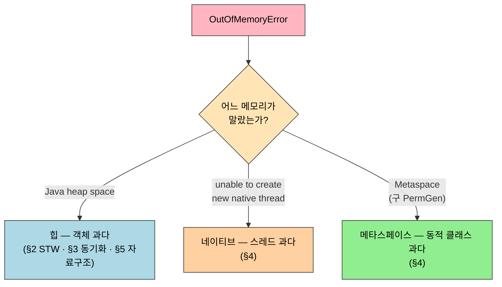
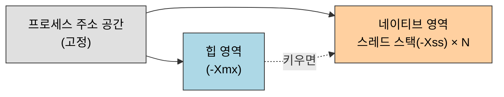

# 최적화 사례 분석
---
> §5.1~§5.2는 2~4장에서 쌓은 *이론·도구*를 실제 장애 사례에 부딪쳐 봅니다. 본 절을 한 줄로 압축하면 — **메모리 문제는 "힙을 키우면 해결"이 아니라, 큰 힙은 Full GC STW를, 작은 힙은 잦은 GC를, 힙 밖(스택·네이티브·메타스페이스)은 또 다른 한계를 부른다는 트레이드오프의 연속**입니다. 사례마다 *어느 메모리가 마르는가*를 먼저 짚고 [4장 진단 도구](03-01.%EA%B8%B0%EB%B3%B8%20%EB%AC%B8%EC%A0%9C%20%ED%95%B4%EA%B2%B0%20%EB%8F%84%EA%B5%AC%20%E2%80%94%20%EB%AA%85%EB%A0%B9%EC%A4%84%20%EB%8F%84%EA%B5%AC.md)로 범인을 좁힙니다.

이 글을 읽고 나면 대용량 힙의 Full GC STW 트레이드오프를 설명하고 "힙은 남는데 OutOfMemoryError"가 나는 native thread·메타스페이스 고갈을 구분해 진단하며 자료구조 선택이 GC 효율을 어떻게 바꾸는지 예측할 수 있습니다.


## 1. 들어가며 — 이론을 실제 장애로 검증한다

> 규칙을 외운 것과 장애를 푸는 것은 다릅니다. 사례 분석은 *추상 규칙이 실제로 어떻게 깨지는가*를 보여줍니다.

이 절은 이미 배운 [GC 알고리즘](./02-04.가비지%20컬렉션%20알고리즘.md)·[할당 전략](./02-11.실전%20—%20메모리%20할당과%20회수%20전략.md)·[진단 도구](03-01.%EA%B8%B0%EB%B3%B8%20%EB%AC%B8%EC%A0%9C%20%ED%95%B4%EA%B2%B0%20%EB%8F%84%EA%B5%AC%20%E2%80%94%20%EB%AA%85%EB%A0%B9%EC%A4%84%20%EB%8F%84%EA%B5%AC.md)를 *실전에 적용*하는 단계입니다. 책의 사례는 대부분 *해결책이 또 다른 비용을 부르는* 구조라, "정답 하나"가 아니라 *상황에 맞는 트레이드오프 선택*을 가르칩니다.

사례를 메모리 영역으로 묶으면 진단의 첫 갈래가 보입니다. OutOfMemoryError 한 줄을 봤을 때 *어느 영역이 말랐는가*부터 가릅니다.




## 2. 대용량 메모리 기기와 Full GC 장시간 STW

> §5.2.1. "힙을 키우면 GC가 덜 일어난다"는 절반만 맞습니다. 큰 힙은 *한 번의 Full GC가 오래 멈추는* 새 문제를 부릅니다.

책의 사례는 64비트 장비에 대용량 힙을 단일 JVM으로 띄운 사이트입니다. 평소엔 잘 돌지만 Full GC가 한 번 돌면 *수 초 이상의 긴 일시정지*가 생겨 응답이 끊겼습니다. 힙이 클수록 GC가 훑어야 할 객체 그래프도 커져, 회수 한 번의 STW가 비례해 길어지기 때문입니다.

해결은 두 갈래이고 *각각 새 비용*이 따릅니다. 어느 쪽도 공짜가 아닙니다.

| 배치 전략 | 장점 | 따라오는 비용 |
|-----------|------|---------------|
| 단일 큰 힙 (한 JVM) | 관리 단순, 노드 간 통신 없음 | Full GC STW가 길다, 64비트 포인터 오버헤드, 거대 힙 덤프 분석 난이도 |
| 여러 작은 인스턴스 (논리 클러스터) | STW가 인스턴스당 짧다 | 노드 간 디스크·네트워크 자원 경합, connection pool 중복 낭비, 분산 캐시 동기화 부담 |

- 책은 후자(여러 작은 노드)로 풀되, *그 선택이 부른 분산 동기화 문제*가 다음 사례(§3)로 이어집니다. 큰 힙을 쓸 수밖에 없다면 STW가 짧은 [저지연 GC(ZGC·Shenandoah)](./02-08.저지연%20가비지%20컬렉터.md)로 바꾸는 게 현대적 답이지만 책의 사례 시점엔 그 선택지가 좁았습니다.


## 3. 클러스터 간 동기화로 인한 메모리 오버플로

> §5.2.2. 큰 힙을 피하려 여러 노드로 쪼갰더니, *노드 간 동기화 자료구조*가 거꾸로 힙을 잠식했습니다. 해결책이 부른 새 문제입니다.

§2의 "여러 작은 인스턴스" 선택을 따르면 노드끼리 상태를 공유해야 합니다. 책의 사례는 노드 간 동기화에 쓰는 `Map`·`BlockingQueue` 같은 자료구조가 RMI로 전파되는 데이터를 계속 쌓아, 동기화 트래픽이 커질수록 힙이 차오른 경우입니다. 노드를 늘려 STW를 줄였더니 *동기화 비용이 메모리로 되돌아온* 셈입니다.

핵심 교훈은 *분산은 메모리 문제를 없애는 게 아니라 이동시킨다*는 점입니다. 

- 단일 힙의 STW를 노드 분할로 피하면, 그 대가로 노드 간 동기화 상태가 각 노드의 힙에 새로 자리 잡습니다. 동기화 자료구조에 *상한(크기 제한·만료)*을 두지 않으면 OOM으로 되돌아옵니다.


## 4. 힙은 멀쩡한데 터지는 OOM — native thread·메타스페이스

> §5.2.x. `OutOfMemoryError`가 항상 힙 부족은 아닙니다. 힙을 키우는 게 오히려 *네이티브 메모리를 더 좁혀* 문제를 키우기도 합니다.

### native thread OOM

`unable to create new native thread`는 *힙이 아니라 네이티브 메모리* 고갈 신호입니다. 스레드 하나가 설 때 JVM 힙 밖에 네이티브 스택을 잡는데, 한 프로세스가 쓸 수 있는 주소 공간·OS 스레드 한도는 정해져 있습니다. 그래서 *힙을 키울수록* 같은 주소 공간에서 네이티브 스택에 남는 자리가 줄어, 스레드 생성이 오히려 더 빨리 막힙니다.

한 프로세스의 주소 공간은 고정 파이라, 힙이 키운 만큼 네이티브 몫이 줄어드는 *제로섬*입니다.



```
Exception in thread "main" java.lang.OutOfMemoryError: unable to create new native thread
        at java.lang.Thread.start0(Native Method)
        at java.lang.Thread.start(Thread.java:...)
```

- 진단·완화는 힙을 *줄이거나* 스레드당 스택 크기(`-Xss`)를 줄여 네이티브에 자리를 내주는 방향입니다. 
- 힙을 키우는 본능과 정반대라, 스택 트레이스의 `unable to create new native thread` 한 줄을 *힙 부족과 구분*하는 게 진단의 핵심입니다.

### 메타스페이스(구 PermGen) OOM

`OutOfMemoryError: Metaspace`(JDK 7 이하 `PermGen space`)는 *클래스 메타데이터*가 넘친 신호입니다. CGLib 동적 프록시·런타임 바이트코드 생성처럼 클래스를 끝없이 만들어 내는 코드가 있으면, 힙이 아니라 메타스페이스가 찹니다. 힙 덤프를 아무리 봐도 누수가 안 보이는데 OOM이 나면 *로딩된 클래스 수*를 의심합니다([03-01 §3](03-01.%EA%B8%B0%EB%B3%B8%20%EB%AC%B8%EC%A0%9C%20%ED%95%B4%EA%B2%B0%20%EB%8F%84%EA%B5%AC%20%E2%80%94%20%EB%AA%85%EB%A0%B9%EC%A4%84%20%EB%8F%84%EA%B5%AC.md)의 `jstat -class`로 클래스 수 추세 관찰).

> 책 §5.2는 직접 메모리(Direct Memory) 오버플로(§5.2.3) 등 다른 영역 사례도 함께 다룹니다. 공통 교훈은 *OOM 메시지의 영역 표기를 먼저 읽으라*는 것 — `Java heap space`·`Metaspace`·`unable to create new native thread`·`Direct buffer memory`가 각각 다른 영역을 가리킵니다.


## 5. 부적절한 자료구조로 인한 메모리 과소비

> §5.2.6. 같은 데이터라도 *어떤 자료구조에 담느냐*가 GC 효율을 가릅니다. 대용량 임시 데이터가 신세대 구성과 어긋나 GC를 헛돌게 한 사례입니다.

책의 사례는 큰 데이터 집합을 메모리에 올려 처리하는데, 이 데이터가 *신세대를 통째로 거쳐 가도록* 신세대(Eden·Survivor) 비율이 잡혀 있어 Minor GC가 과하게 일어난 경우입니다. 짧게 살다 죽을 대용량 임시 데이터인데 Survivor가 작아 곧장 Old로 승격되거나, Eden을 넘쳐 비효율적으로 회수됐습니다.

여기서 터지는 GC가 *Full GC가 아니라 Minor GC*라는 점이 핵심입니다 — 흔히 "임시 데이터가 많으면 Full GC가 잦겠지"라고 오해하기 쉽지만 실제 비효율은 두 갈래로 나타납니다. 하나는 Eden이 데이터를 다 못 담아 *금세 차고 넘쳐 Minor GC가 빈발*하는 것이고 다른 하나는 그 데이터 중 일부가 작은 Survivor에 못 들어가 *아직 살아 있는데 억지로 Old로 승격*되는 것입니다. 곧 죽을 데이터가 Old에 올라가면 나중에 Full GC가 와야 회수되니, *신세대에서 죽었어야 할 객체를 구세대까지 끌고 가는* 이중 낭비가 됩니다. 그래서 처방의 목표는 "Full GC를 줄이자"가 아니라 *대용량 임시 데이터가 신세대 안에서 태어나 신세대 안에서 죽게* 자리를 넓혀 주는 것입니다.

조정은 데이터 수명에 맞춰 신세대 크기·비율을 손보는 것입니다. `-Xmn`으로 신세대를 키우거나 `-XX:SurvivorRatio`를 조절해 *대용량 임시 데이터가 신세대 안에서 살다 죽도록* 맞춥니다. 여기서 `-Xmn`은 *신세대(Young) 전체* 크기를 정하는 플래그이지, 스레드 스택 크기(`-Xss`)나 스레드별 할당 버퍼(TLAB)와는 다릅니다 — 이름이 비슷해 헷갈리기 쉽지만 `-Xss`는 한 스레드가 호출 깊이를 쌓는 네이티브 스택(§4의 native thread OOM이 마르는 그 영역)이고 TLAB는 Eden 안에서 스레드마다 떼어 받는 할당 구역일 뿐입니다. 임시 데이터가 신세대에 머물 자리를 넓히는 손잡이는 신세대 전체를 키우는 `-Xmn`과 Eden:Survivor 비율을 바꾸는 `-XX:SurvivorRatio` 둘입니다. [할당 전략 노트](./02-11.실전%20—%20메모리%20할당과%20회수%20전략.md)의 다섯 규칙이 *왜* 이렇게 조정하는지의 근거입니다. 자료구조 자체를 더 조밀한 형태(원시 타입 배열 등)로 바꿔 점유를 줄이는 방향도 있습니다.


## 6. 면접 대비 요약

> 사례 5종을 *어느 메모리가 마르는가*로 갈라 말할 수 있으면 합격선입니다 — 힙 STW / 분산 동기화 / 네이티브 스레드 / 메타스페이스 / 자료구조.

### 한 줄 정의

최적화 사례 분석이란 *2~4장의 이론·도구를 실제 장애에 적용해, 메모리 문제 해결이 늘 새 트레이드오프를 부른다는 것을 익히는* 단계입니다.

### 핵심 포인트 3가지

1. 힙을 키우면 Full GC STW가 길어집니다. "큰 힙 하나"와 "작은 힙 여럿"은 각각 STW와 분산 동기화 비용을 맞바꿉니다.
2. OOM이 항상 힙 부족은 아닙니다. `unable to create new native thread`는 네이티브 메모리, `Metaspace`는 클래스 메타데이터 고갈이라, *힙을 키우면 오히려 악화*되기도 합니다.
3. 같은 데이터도 자료구조·신세대 구성에 따라 GC 효율이 갈립니다. 수명에 맞춰 `-Xmn`·`-XX:SurvivorRatio`를 조정합니다.

### 면접에서 받을 만한 질문

1. 힙을 크게 키웠더니 응답이 가끔 수 초씩 멈춥니다. 원인과 두 가지 해결 방향은?
2. 힙 사용률은 60%인데 `OutOfMemoryError`가 납니다. 무엇을 의심하는가?
3. 분산으로 노드를 쪼갰더니 각 노드가 OOM이 납니다. 왜 그런가?
4. 동적 프록시를 많이 쓰는 앱에서 힙 덤프엔 누수가 없는데 OOM이 납니다. 어디를 보는가?

> 위 4개 질문에 *먼저 스스로 답해 보고* 아래 §정답으로 내려갑니다. 자답 없이 먼저 읽으면 학습 효과가 0입니다.


## 정답 (자답 후 펼치기)

> 위 §면접에서 받을 만한 질문 의 4개에 *먼저 자답한 뒤* 아래를 읽습니다.

### 정답 1 — 대용량 힙의 긴 STW

원인은 힙이 클수록 Full GC가 훑을 객체 그래프가 커져 STW가 비례해 길어지기 때문입니다. 해결은 (1) 저지연 GC(ZGC·Shenandoah)로 바꿔 STW 자체를 줄이거나, (2) 큰 힙 하나를 작은 힙 여러 인스턴스로 쪼개 인스턴스당 STW를 줄입니다. 단 (2)는 노드 간 자원 경합·동기화 비용을 새로 떠안습니다.

### 정답 2 — 힙은 남는데 OOM

힙 밖이 마른 것입니다. 스택 트레이스에 `unable to create new native thread`면 네이티브 메모리(스레드 과다), `Metaspace`면 클래스 메타데이터 고갈입니다. 특히 힙을 키워 둔 상태면 같은 주소 공간에서 네이티브에 남는 자리가 줄어 스레드 생성이 더 빨리 막힙니다 — 이 경우 힙을 *줄이거나* `-Xss`를 줄여야 합니다.

### 정답 3 — 노드를 쪼갰는데 OOM

단일 힙의 STW를 피하려 노드를 쪼개면, 노드 간 상태 동기화에 쓰는 자료구조(`Map`·`BlockingQueue` 등)가 각 노드 힙에 새로 쌓입니다. 메모리 문제가 사라진 게 아니라 *동기화 비용으로 이동*한 것입니다. 동기화 자료구조에 크기 상한·만료를 두지 않으면 OOM으로 되돌아옵니다.

### 정답 4 — 누수 없는 OOM, 동적 프록시

메타스페이스(구 PermGen)를 봅니다. CGLib·런타임 바이트코드 생성이 클래스를 끝없이 만들면 힙이 아니라 클래스 메타데이터 영역이 찹니다. `jstat -class`로 로딩된 클래스 수가 계속 느는지 확인합니다.


## 관련 문서

> 사례에서 본 진단은 4장 도구로 실행합니다. 자료구조·신세대 조정의 근거는 3장 할당 전략이고 다음 §실전은 이 사례 접근을 Eclipse에 직접 적용합니다.

- [04-02. 실전 — Eclipse IDE 튜닝](04-02.%EC%8B%A4%EC%A0%84%20%E2%80%94%20Eclipse%20IDE%20%ED%8A%9C%EB%8B%9D.md) — 본 사례 접근을 *내가 쓰는 IDE*에 직접 적용하는 실전
- [03-01. 기본 문제 해결 도구 — 명령줄 도구](03-01.%EA%B8%B0%EB%B3%B8%20%EB%AC%B8%EC%A0%9C%20%ED%95%B4%EA%B2%B0%20%EB%8F%84%EA%B5%AC%20%E2%80%94%20%EB%AA%85%EB%A0%B9%EC%A4%84%20%EB%8F%84%EA%B5%AC.md) § "jstat" — 사례 진단에 쓰는 GC·클래스 통계 도구
- [02-10. 실전 — 메모리 할당과 회수 전략](./02-11.실전%20—%20메모리%20할당과%20회수%20전략.md) — §5 자료구조 조정(`-Xmn`·`SurvivorRatio`)의 근거가 되는 다섯 할당 규칙
- [01-03. 실전 — OutOfMemoryError 재현](./01-03.%EC%8B%A4%EC%A0%84%20%E2%80%94%20OutOfMemoryError%20%EC%9E%AC%ED%98%84.md) — 영역별 OOM을 코드로 재현하는 짝 실습
