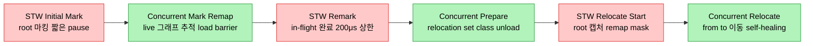
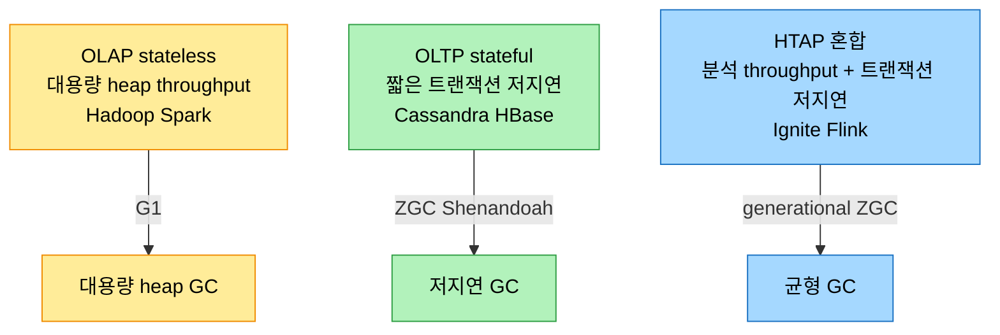

# ZGC 심화와 워크로드별 GC 선택

## 1. 들어가며 — pause time을 heap 크기에서 떼어내다

> G1이 region으로 pause를 예측 가능하게 만들었다면, ZGC는 한 발 더 나아가 pause time을 heap 크기와 LDS에서 거의 떼어낸다. colored pointer·load barrier·off-heap forwarding table·thread-local handshake가 그 비결이다.

ZGC(Z Garbage Collector)는 실시간 응답성을 노리고 도입된 컬렉터로, concurrent compaction, colored pointer, off-heap forwarding table, load barrier를 무기로 한다. JDK 11에서 실험적으로 들어와 JDK 15에서 production 준비가 됐고, JDK 16의 concurrent thread stack processing으로 pause time을 LDS·heap 크기와 무관하게 1밀리초 아래로 보장하게 됐다. 8MB에서 16TB까지 넓은 heap 범위를 다뤄 경량 마이크로서비스부터 빅데이터·머신러닝·그래픽스까지 아우른다.

## 2. ZGC의 핵심 개념

> ZGC의 저지연은 네 가지 장치가 받친다. 포인터에 상태를 새기는 colored pointer, 스레드 단위로 멈추는 handshake, 여섯 phase 중 STW를 짧게 가두는 설계, 그리고 heap 밖 forwarding table과 동적 ZPage다.

### colored pointer

ZGC의 핵심 혁신은 colored pointer다. 포인터 안에 메타데이터를 직접 저장하는 태깅으로, x86-64와 aarch64에서 multi-mapping(virtual address mapping)으로 구현한다. 포인터는 객체가 marked인지, relocation set을 가리키는지, Finalizer로만 도달 가능한지 같은 상태를 담는다. 이 태깅 덕에 ZGC는 concurrent marking과 relocation을 애플리케이션을 멈추지 않고 처리해 pause time을 줄인다.

### thread-local handshake

thread-local handshake는 global STW pause 없이 개별 스레드에 액션을 실행하는 메커니즘이다(JEP 312). 전통적인 STW 기법과 달리 스레드 단위로 GC 작업을 수행해 STW 이벤트의 영향을 줄이고, ZGC가 저지연을 달성하게 한다. concurrent 처리는 max throughput에 영향을 줄 수 있지만 ZGC는 그 저하를 허용 범위 안에서 균형 잡는다.

### phase와 concurrent 활동

ZGC는 tracing collector이면서 concurrent marking과 compaction을 모두 한다. heap을 ZPages(메모리 사용 패턴 기반으로 동적 크기를 갖는 region)로 정제하고, concurrent marking을 logical stripe로 나눠 각 GC 스레드가 자기 stripe를 맡아 contention과 동기화 오버헤드를 줄인다.

phase는 여섯이다. STW Initial Mark는 root 객체를 마킹하는 짧은 pause로, thread-stack scanning을 concurrent로 옮겨 단축됐다. Concurrent Mark/Remap은 live 그래프를 추적하며 non-root를 마킹하고 load barrier로 unmarked 포인터 로드를 돕는다. STW Remark는 concurrent phase 동안 in-flight였던 객체의 마킹을 끝내는 짧은 pause로, JDK 16부터 mark work가 200마이크로초를 넘으면 concurrent로 계속한다. Concurrent Prepare for Relocation은 relocation set을 식별하고 weak root와 class unloading을 처리한다. STW Relocate Start는 남은 metadata·nmethod를 unload하고 remap mask(pointer forwarding)를 준비하며 root를 캡처한다. Concurrent Relocate는 live 객체를 "from"에서 "to"로 옮기는데, 애플리케이션 스레드가 relocate 대상 객체를 만나면 직접 돕는 self-healing으로 STW 작업을 줄인다.

### off-heap forwarding table와 ZPage

off-heap forwarding table은 relocate된 객체의 새 위치를 저장하는 자료구조다. heap 밖에 두므로 forwarding table이 heap 공간을 잡아먹지 않고, virtual·physical 메모리를 즉시 반환·재사용하며, table 크기가 heap 크기에 제약되지 않아 더 큰 heap을 다룬다. ZPage는 heap 안의 연속 메모리 chunk로 small·medium·large 세 종류다. small은 작은 객체에, medium은 중간 객체에, large는 small/medium에 안 맞는 큰 객체에 쓰이며 large page는 객체 하나가 page 전체를 점유한다. region 크기는 고정이지만 ZPage는 동적이라 할당 요청 크기에 따라 여러 region에 걸칠 수 있고, 빈 page를 빠르게 회수해 단편화를 줄인다.

## 3. ZGC 트리거 — 언제 GC를 시작하는가

> ZGC는 단일 조건이 아니라 여러 adaptive 트리거로 cycle을 시작한다. 각 트리거는 로그에 이유를 남기므로, 로그를 읽으면 애플리케이션의 메모리 패턴에 맞춰 튜닝할 수 있다.

ZGC는 단일 임계가 아니라 여섯 가지 트리거로 cycle을 시작한다. 앞쪽은 예방적(시간·점유율 기반), 뒤쪽은 반응적(할당이 실제로 막힘)으로 갈린다:

1. Timer. `-XX:ZCollectionInterval=<sec>`로 정한 간격마다 GC를 검사한다. 기본값 0은 비활성이라, 시간 기반 강제 수집이 필요할 때만 켠다.
2. Warm-up. ramp-up 단계에서 heap occupancy가 soft_max_capacity의 10%·20%·30%에 닿으면 트리거해 GC를 미리 준비시킨다(`-XX:SoftMaxHeapSize`로 조정). 초기에 통계가 부족한 구간을 메우는 용도다.
3. High Allocation Rate. 할당률과 free 메모리로 OOM까지의 시간을 추정해, 그것이 GC cycle 예상 시간보다 짧으면 트리거한다. `UseDynamicNumberOfGCThreads`에 따라 worker 수를 동적 계산하거나(Dynamic) headroom을 둔 채 고정한다(Static).
4. Allocation Stall. 공간 부족으로 할당이 실제로 막혀 stall이 관측되면 반응적으로 트리거하고 SoftReference를 비운다. 예방 트리거가 놓친 상황의 안전망이다.
5. High Usage. free 메모리가 5% 이하로 떨어지면 예방적으로 트리거한다. 할당률이 낮아 allocation rate rule이 발동하지 않는데도 천천히 차오르는 경우에 유용하다.
6. Proactive. heap에 여유가 있어도 heuristic상 이득이면 GC를 미리 돌린다(`-XX:+ZProactive`, 기본 활성). pause가 짧은 ZGC라 선제 수집의 비용이 작다는 전제다.

각 트리거는 `GC(N) Garbage Collection (Timer)`처럼 로그에 이유를 남기므로, 어떤 규칙이 cycle을 시작했는지 읽어 메모리 패턴에 맞춰 튜닝할 수 있다.

ZGC는 JDK 11 실험적 도입 이후 꾸준히 발전했다. JDK 12에 concurrent class unloading(STW 없이 클래스 unload), JDK 13에 더 빠른 메모리 uncommit, JDK 14에 Windows·macOS 지원, JDK 15에 production 준비·compressed class pointer·NUMA-awareness, JDK 16에 concurrent thread stack processing, JDK 17에 dynamic GC threads와 더 빠른 종료, mark stack 메모리 절감이 더해졌다.

## 4. 미래 GC 트렌드

> GC의 다음 과제는 하드웨어와의 조화와 클라우드의 power·footprint 효율이다. 작업을 tunable 단위로 쪼개고, 머신러닝으로 패턴을 학습해 튜닝을 자동화하는 방향으로 간다.

런타임에서 메모리 관리 단위는 하드웨어와의 조화를 가장 크게 흔드는 요소다. GC가 live 객체를 relocate하면 CPU cache 상태가 교란되고, TLAB의 bump 할당은 효율적이지만 GC가 시작될 때 그 대비되는 성질 때문에 교란이 생기며, concurrent work는 maintenance barrier 때문에 오버헤드를 더한다. 클라우드 시대에는 power·footprint 효율이 핵심 과제가 되어, incremental marking과 region이 concurrent work를 효율화하는 전략으로 쓰인다.

떠오르는 트렌드 하나가 "tunable work units", 곧 GC 과정을 작은 tunable 단위로 쪼개 partial compaction·maintenance barrier·concurrent work를 정밀 제어하는 것이다. GC가 하드웨어와 소프트웨어 패턴을 인식해 CPU·cache를 효율적으로 쓰고, 할당 크기·패턴·GC pressure를 이해하면 적응성이 높아진다. 머신러닝 같은 외재적 도구는 애플리케이션 행동과 메모리 패턴을 분석해 GC 튜닝을 자동화하고 power 사용까지 최적화할 수 있다. 저지연 컬렉터(ZGC·Shenandoah)의 개선과 마이크로서비스·빅데이터·ML의 부상이 GC 발전을 이끌고, ZGC와 Shenandoah가 generational GC로 가는 씨앗이 뿌려졌다.

## 5. 워크로드별 GC 선택 — OLAP·OLTP·HTAP

> 최적의 GC는 워크로드의 성질에 달려 있다. 상태 유지 여부, 트랜잭션 길이, heap 요구가 GC 선택을 가른다.

in-memory 데이터베이스와의 트랜잭션 상호작용에 따라 워크로드를 셋으로 나눈다.

| 유형 | 성격 | 데이터 | 적합 GC |
|------|------|--------|---------|
| Analytics (OLAP) | 복잡·장시간 쿼리, stateless | transient·높은 할당률·대용량 heap | G1(대용량 heap·throughput) |
| Operational (OLTP) | 짧은 atomic 트랜잭션, stateful | 높은 할당률·중기 데이터 | ZGC·Shenandoah(저지연) |
| Hybrid (HTAP) | OLAP+OLTP, 실시간 분석+트랜잭션 | throughput+저지연 동시 | optimized generational ZGC |

OLAP은 비즈니스 인텔리전스·데이터 마이닝을 위한 복잡하고 오래 도는 쿼리로, 각 요청-응답이 독립적인 stateless 상호작용이며 높은 throughput과 큰 heap을 요구한다. Apache Hadoop·Spark가 예로, 대용량 heap을 효율적으로 다루는 G1 같은 GC가 맞는다. OLTP는 DB 업데이트 같은 짧고 atomic한 트랜잭션을 많이 처리하며 작은 데이터에 빠르고 저지연하게 접근하는 stateful 상호작용이다. Apache Cassandra·HBase 같은 NoSQL이 예로, pause time을 최소화하는 ZGC·Shenandoah가 트랜잭션 latency에 직결돼 적합하다. HTAP는 OLAP과 OLTP를 합쳐 운영 데이터에 실시간 분석을 하는 비교적 새로운 워크로드로, Apache Ignite(in-memory)나 Apache Flink(stream)가 예이며, 분석의 throughput과 실시간 트랜잭션의 저지연을 함께 노리는 optimized generational ZGC가 이상적이다.

### Live Data Set pressure

LDS(live data set)는 heap에 있는 live 데이터의 양으로, 아직 사용 중이라 회수 대상이 아닌 객체들이다. 전통 GC에서는 LDS가 클수록 처리할 데이터가 많아 pause가 길어지지만, 모든 GC가 그렇지는 않다. 데이터는 수명에 따라 minor GC 전에 수집되는 transient, 몇 minor GC를 사는 short-lived, old로 승격되는 medium-lived, 앱 수명 상당 기간 남는 long-lived로 나뉜다. G1은 일관된 pause를 노리지만 medium·short-lived 데이터가 minor GC를 살아남아 occupancy를 올리면 성능에 압력을 준다. 반면 ZGC는 pause가 heap 크기·LDS와 대체로 무관한데, high memory pressure에서는 할당률을 throttling하는 load-shedding으로 저지연을 지키되 극한 pressure는 여전히 영향을 준다. 그래서 transient/short-lived가 많은 앱은 young aging으로 minor GC를 최적화하고, long-lived가 많은 앱은 incremental old collection으로 큰 LDS를 다루는 식으로 데이터 수명 패턴에 맞춰 튜닝한다.

## 6. 면접 대비 요약

> colored pointer와 concurrent relocation, thread-local handshake와 짧은 STW phase, 그리고 워크로드(OLAP·OLTP·HTAP)가 GC를 정한다는 점 — 이 셋을 설명할 수 있으면 이 장은 끝이다.

### 한 줄 정의

ZGC는 colored pointer·load barrier·off-heap forwarding table·thread-local handshake로 marking과 relocation을 concurrent로 수행해 pause time을 heap 크기·LDS에서 떼어낸 저지연 컬렉터이며, GC 선택은 OLAP·OLTP·HTAP라는 워크로드 성격에 달려 있다.

### 핵심 포인트 3가지

1. **colored pointer와 concurrent relocation** — 포인터에 marked·relocation set 같은 상태를 태깅해 애플리케이션을 멈추지 않고 marking·relocation을 한다. off-heap forwarding table로 새 위치를 heap 밖에 저장해 큰 heap을 다룬다.
2. **thread-local handshake와 짧은 phase** — global STW 대신 스레드 단위 handshake를 쓰고, STW phase(Initial Mark·Remark·Relocate Start)를 짧게 유지하며 나머지는 concurrent로 처리한다. Remark는 JDK 16부터 200μs 상한이다.
3. **워크로드가 GC를 정한다** — stateless·대용량인 OLAP은 G1, stateful·저지연인 OLTP는 ZGC/Shenandoah, 둘을 합친 HTAP는 generational ZGC가 맞는다. 데이터 수명 패턴(transient~long-lived)이 튜닝을 가른다.

### 면접에서 받을 만한 질문

1. colored pointer가 무엇이고 ZGC에서 어떤 역할을 하는가?
2. thread-local handshake가 global STW와 다른 점은?
3. ZGC의 STW phase 세 가지와 concurrent phase를 구분하라.
4. off-heap forwarding table을 heap 밖에 두는 이유는?
5. OLAP·OLTP·HTAP 각각에 어떤 GC가 적합하고 왜인가?

## 정답 (자답 후 펼치기)

### 정답 1 — colored pointer

colored pointer는 포인터 안에 메타데이터를 직접 저장하는 태깅으로, x86-64·aarch64에서 multi-mapping으로 구현한다. 객체가 marked인지, relocation set을 가리키는지, Finalizer로만 도달 가능한지 같은 상태를 포인터 자체에 담는다. 덕분에 ZGC는 별도 자료구조 조회 없이 객체 상태를 알아 concurrent marking·relocation을 애플리케이션을 멈추지 않고 수행한다.

### 정답 2 — thread-local handshake vs global STW

global STW는 모든 애플리케이션 스레드를 한꺼번에 멈춰 GC 작업을 한다. thread-local handshake는 개별 스레드에 대해 그 스레드만 잠깐 멈춰 액션을 실행하므로, 전역 정지 없이 스레드 단위로 GC 작업을 수행한다. 그래서 STW 이벤트의 영향이 작고, 큰 heap과 엄격한 latency 요구를 가진 애플리케이션에 ZGC가 적합해진다.

### 정답 3 — ZGC phase 구분

STW phase는 셋이다. Initial Mark(root 마킹), Remark(in-flight 객체 마킹 완료, 200μs 상한), Relocate Start(root 캡처·remap mask 준비)다. concurrent phase는 Concurrent Mark/Remap(live 그래프 추적, load barrier), Concurrent Prepare for Relocation(relocation set 식별·class unloading), Concurrent Relocate(객체 이동, self-healing)다. STW는 짧고 드물며 대부분의 작업이 concurrent로 진행된다.

### 정답 4 — off-heap forwarding table

forwarding table은 relocate된 객체의 새 위치를 저장한다. 이를 heap 밖에 두면 table이 애플리케이션용 heap 공간을 잡아먹지 않고, relocate가 끝난 virtual·physical 메모리를 즉시 반환·재사용할 수 있다. 또 table 크기가 heap 크기에 제약되지 않아 더 큰 heap을 다룰 수 있다.

### 정답 5 — 워크로드별 GC

OLAP은 stateless하고 높은 throughput과 큰 heap을 요구하므로, 대용량 heap을 효율적으로 다루는 G1이 맞는다. OLTP는 stateful하고 짧은 트랜잭션의 저지연이 중요하므로, pause를 최소화하는 ZGC·Shenandoah가 트랜잭션 latency에 직결돼 적합하다. HTAP는 둘을 합쳐 분석의 throughput과 트랜잭션의 저지연을 함께 노리므로, generational로 최적화된 ZGC가 이상적이다.

## 관련 문서

- [`./05-01.TLAB·PLAB·NUMA-aware GC와 G1 심화`](./05-01.TLAB·PLAB·NUMA-aware%20GC와%20G1%20심화.md) — 같은 장 전반부: TLAB/PLAB·NUMA·G1
- [`../ch14_jpe-evolution/01-01.Java와 JVM의 성능 진화사`](../ch14_jpe-evolution/01-01.Java와%20JVM의%20성능%20진화사.md) — ZGC·Shenandoah·STW 도입 연대기
- [`../ch02_automatic-memory-management/02-07.저지연 가비지 컬렉터`](./02-07.저지연%20가비지%20컬렉터.md) — 《밑바닥》 쪽 저지연 GC(ZGC·Shenandoah)
- [`../ch02_automatic-memory-management/02-08.GC 선택하기`](./02-08.GC%20선택하기.md) — 《밑바닥》 쪽 GC 선택 기준
- [`../README`](../README.md) — JVM 학습 인덱스
