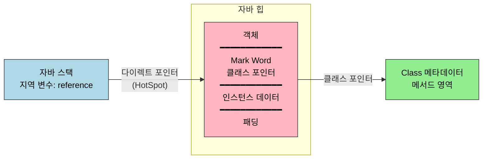

# 핫스팟의 객체 들여다보기
---
> 앞 노트(01-01)에서 본 7개 메모리 영역 중 자바 힙은 *객체의 집*이다. 객체 하나는 그 집 안에서 어떻게 만들어지고, 어떤 모양으로 자리 잡고, 외부에서 어떻게 접근되는가. §2.3은 그 세 질문을 핫스팟 가상 머신 기준으로 한 번에 다룬다. 본 노트는 §2.3.1 객체 생성, §2.3.2 객체의 메모리 레이아웃, §2.3.3 객체 접근 위치를 차례대로 정리한다. 세 절을 한 줄로 압축하면 — **객체는 생성·레이아웃·접근의 삼각으로 정의되며**, 자바 코드 한 줄 `Foo f = new Foo()`가 세 단계 모두를 동시에 작동시킨다.

## 1. §2.3.1 객체 생성 — `new` 한 줄 뒤에서 일어나는 일

> 자바에서 `new Foo()` 한 줄은 JVM 입장에서 *최소 여섯 단계의 작업*이다.

객체 생성은 다음 순서로 진행된다.

| 단계 | 하는 일 |
|------|--------|
| 1 | 클래스 로딩 점검 — 상수 풀에서 클래스의 심벌 참조를 찾아, 클래스가 로드·연결·초기화됐는지 확인. 안 됐으면 먼저 클래스 로딩 수행 |
| 2 | 메모리 크기 결정 — 클래스 로딩이 끝난 시점에 객체의 메모리 크기가 *완전히 확정*된다 |
| 3 | 메모리 할당 — 자바 힙에서 그 크기만큼을 떼어 낸다 |
| 4 | 0 초기화 — 할당된 메모리를 0(또는 null/false 등)로 채운다. 인스턴스 필드 기본값이 *언어 차원에서 보장*되는 근거 |
| 5 | 객체 헤더 설정 — Mark Word, 클래스 포인터, GC 정보를 헤더에 기록 |
| 6 | `<init>` 호출 — 생성자 본문 실행. 이 시점부터 *진짜 객체*가 된다 |

여섯 단계가 어떤 순서로 이어지는지 보면 다음과 같다. 앞 단계가 끝나야 다음으로 넘어가며, 마지막 `<init>` 이 실행되기 전까지는 필드가 0/null 인 *미완성 객체*다.


### 1.1 메모리 할당 — 두 가지 방식

> 자바 힙이 어떻게 정리돼 있는지에 따라 할당 알고리즘이 갈린다.

**Bump-the-pointer**(포인터 밀기) 방식은 자바 힙이 *연속된 공간*일 때 쓴다. 사용된 영역과 빈 영역이 명확히 나뉘어 있고, 그 경계를 가리키는 포인터를 단순히 *옆으로 밀기만* 하면 새 객체 공간이 생긴다. Serial·ParNew처럼 *압축형* GC가 도는 영역에서 쓴다.

**Free List**(빈 공간 목록) 방식은 자바 힙이 *조각조각* 사용 중일 때 쓴다. 어디가 비었는지를 별도 목록으로 관리하다가, 새 객체에 맞는 빈 칸을 찾아 그 위치를 할당한다. CMS처럼 *마크-스윕*이 도는 영역에서 쓴다.

GC가 어떤 종류인가에 따라 할당 방식이 결정된다는 점이 핵심이다. 즉 *객체 생성 코드 한 줄의 비용*조차 GC 알고리즘 선택의 영향을 받는다.

### 1.2 동시성 보장 — CAS vs TLAB

> 한 가상 머신 안에서 여러 스레드가 *동시에* 자바 힙에 객체를 만들 때 어떻게 안전하게 할당할까.

핫스팟은 두 가지 방식을 동시에 갖췄다.

- **CAS + 재시도**: 할당 포인터를 *원자적*으로 옮긴다. 두 스레드가 같은 포인터를 동시에 밀려 하면 CAS가 한 쪽만 통과시키고, 실패한 쪽은 재시도한다.
- **TLAB (Thread Local Allocation Buffer)**: 스레드마다 자바 힙의 *작은 조각*을 미리 받아 둔다. 그 조각 안에서의 할당은 *스레드 전용*이므로 동기화가 필요 없다. 조각이 다 차야만 새 TLAB을 요청하면서 한 번 동기화한다. 옵션 `-XX:+UseTLAB`로 켜고 끄며, 기본 켜짐.

TLAB는 *동시성 비용을 거의 0으로 만드는* 핵심 트릭이다. 다중 스레드 환경에서 자바의 객체 생성이 빠른 이유의 절반이 TLAB에 있다.

### 1.3 책의 HotSpot 발췌 코드

> 책은 핫스팟 C++ 소스의 *fastpath 할당 코드*를 직접 박제했다.

p.71의 `instanceKlass::allocate_instance` 발췌가 그것이다. 발췌의 핵심 흐름은 다음과 같다.

```cpp
// 핫스팟 instanceKlass.cpp 일부 (책 p.71 발췌 단순화)
instanceOop instanceKlass::allocate_instance(TRAPS) {
    int size = size_helper();                  // 1. 크기 결정
    KlassHandle h_k(THREAD, as_klassOop());
    instanceOop i;
    i = (instanceOop)CollectedHeap::obj_allocate(h_k, size, CHECK_NULL);
    if (has_finalizer_flag) {
        // finalize() 등록
    }
    return i;
}
```

`obj_allocate` 가 내부에서 *TLAB이 있는가 → 있으면 그 안에서 bump pointer, 없으면 자바 힙 공유 영역에서 CAS*로 분기한다. 이 분기를 직접 따라가 보고 싶다면 1챕터 노트(01-03)의 OpenJDK 빌드 방법으로 slowdebug 바이너리를 만들고, `instanceKlass::allocate_instance`에 브레이크포인트를 거는 게 가장 빠르다.

## 2. §2.3.2 객체의 메모리 레이아웃 — 한 객체는 어떤 모양인가

> 객체 하나는 세 부분으로 구성된다. *헤더*, *인스턴스 데이터*, *패딩*이다.

세 부분이 메모리에서 어떤 순서로 놓이는지 보면 다음과 같다. 헤더가 맨 앞, 그다음 실제 필드, 마지막에 8바이트 정렬을 맞추는 패딩이 붙는다.


### 2.1 객체 헤더

객체 헤더는 두 부분으로 나뉜다.

**Mark Word** — 객체 자체에 관한 *런타임 메타데이터*를 담는 한 워드 (32비트 JVM에선 4바이트, 64비트 JVM에선 8바이트). 다음 정보가 비트 단위로 *압축 인코딩*된다:

- 해시 코드 (객체 `hashCode()`)
- GC 세대 나이 (4비트)
- 락 플래그 (가벼운 락, 무거운 락, 편향 락 등)
- 편향 락의 경우 락을 잡은 스레드 ID

같은 워드에 *상충될 수 없는* 정보들을 모아 두는 설계다. 락이 걸려 있으면 해시 코드 영역이 락 정보로 덮이고, GC 나이가 어느 값 이상이면 다른 의미로 해석된다. 한 워드를 *상태 기반으로 재해석*하는 트릭이라 책에서도 표를 통해 비트 배치를 보여 준다.

**클래스 포인터** — 이 객체가 *어느 클래스의 인스턴스인가*를 가리키는 포인터. 64비트 JVM에서는 *압축 OOP*(`-XX:+UseCompressedOops`, 기본 켜짐) 옵션으로 8바이트 대신 4바이트로 줄인다. 압축 OOP는 객체 주소를 *8바이트 단위*로 인덱싱한다는 가정 위에서 32비트로 표현하는 기법이다.

배열 객체의 경우 헤더에 *길이 필드*가 추가로 들어간다. 일반 객체는 클래스 정보로 *크기*를 알 수 있지만, 배열은 *원소 수*가 객체마다 다르므로 따로 들고 있어야 한다.

### 2.2 인스턴스 데이터

객체의 진짜 내용물 — 인스턴스 필드들이다. 필드의 크기에 따라 자동으로 정렬된다. HotSpot의 기본 *필드 재배치(field reordering)* 규칙은 다음과 같다.

1. 같은 너비끼리 묶는다 (longs/doubles → ints/floats → shorts/chars → bytes/booleans → references).
2. 부모 클래스의 필드가 자식 클래스 필드보다 *먼저* 배치된다.
3. `-XX:+CompactFields` (기본 켜짐) 옵션 아래에서, 자식 클래스의 작은 필드는 부모 필드 사이에 *끼워 넣어* 정렬 패딩을 줄일 수 있다.

이 규칙은 *캐시 라인 친화성*과 *공간 효율*을 동시에 노린 결과다.

### 2.3 패딩

객체 전체 크기가 *8바이트의 배수*가 되도록 끝에 0 바이트를 채운다 (HotSpot은 8바이트 정렬). 헤더와 인스턴스 데이터 합이 정확히 8의 배수면 패딩은 0이다.

p.73의 표를 단순화하면 다음과 같다.

| 구성 | 32비트 JVM | 64비트 JVM | 64비트 + 압축 OOP |
|------|-----------|-----------|-----------------|
| Mark Word | 4바이트 | 8바이트 | 8바이트 |
| 클래스 포인터 | 4바이트 | 8바이트 | 4바이트 |
| 헤더 합계 | 8바이트 | 16바이트 | 12바이트 |
| 배열 길이 (배열만) | +4바이트 | +4바이트 | +4바이트 |

압축 OOP가 *기본 활성*인 이유는 이 표를 보면 분명하다. 모든 객체의 헤더에서 4바이트씩 절약된다. 100만 개 객체면 4MB, GC 시점에 *살아남은 객체를 옮기는 비용*까지 줄여 준다.

JOL로 위 레이아웃을 직접 출력해 볼 수 있다 (`_practice/ch02-memory-area/layout/`):

```java
import org.openjdk.jol.info.ClassLayout;

public class ObjectLayoutDemo {
    public static void main(String[] args) {
        System.out.println(ClassLayout.parseClass(Object.class).toPrintable());
        System.out.println(ClassLayout.parseClass(int[].class).toPrintable());
    }
}
```

## 3. §2.3.3 객체 접근 위치 — 핸들 vs 다이렉트 포인터

> 자바 가상 머신 명세는 "객체에 접근한다"라고만 적어 두고, 어떻게 가리킬지는 구현 자유다. 핫스팟은 두 방식 중 *다이렉트 포인터*를 택했다.

### 3.1 핸들 방식

자바 스택의 *지역 변수 참조*는 자바 힙 안의 **핸들 풀**의 한 슬롯을 가리킨다. 슬롯에는 두 포인터가 들어 있다 — *인스턴스 데이터 포인터*와 *클래스 메타데이터 포인터*. 그 둘이 각각 자바 힙의 인스턴스와 메서드 영역의 클래스 정보를 가리킨다.

이중 간접 참조라 *느리지만*, 강점이 있다. GC가 객체를 *옮길 때* 핸들 슬롯 안의 인스턴스 포인터만 갱신하면 된다. 자바 스택과 다른 객체들이 가진 *모든 참조*는 핸들 슬롯을 가리키므로, 본체 위치가 바뀌어도 *외부 참조는 그대로 유지*된다.

### 3.2 다이렉트 포인터 방식 (HotSpot 채택)

자바 스택의 참조가 자바 힙 안의 *객체 본체*를 직접 가리킨다. 객체 헤더 안의 클래스 포인터를 통해 메서드 영역의 클래스 정보에 접근한다.

장점은 *한 번의 포인터 디리퍼런스*면 객체에 접근할 수 있다는 점이다. 자바 코드의 객체 접근은 가장 빈번한 동작이므로, 이 한 단계 차이가 누적되면 큰 성능 차이가 된다.

단점은 GC가 객체를 옮길 때 *그 객체를 가리키는 모든 참조를 다 찾아 갱신*해야 한다는 점이다. 핫스팟은 이 비용을 *카드 테이블·OopMap·세대별 GC*로 줄였다. 그 결과 다이렉트 포인터 방식이 *총 비용*에서 핸들 방식보다 우세하다.

JVM이 다이렉트 포인터를 채택한 결정은 자바 가상 머신 명세에는 강제되지 않은 *구현 선택*이다. 명세 → 구현이 1:1이 아니라는 점을 보여 주는 좋은 예다.

## 4. 핵심 정리

§2.3을 한 그림으로 압축하면 다음과 같다.



자바 코드 한 줄(`Foo f = new Foo()`)이 만드는 효과를 메모리 레벨로 옮기면, 자바 스택의 `f` 슬롯이 자바 힙의 객체 본체를 가리키고, 그 객체는 헤더의 클래스 포인터로 메서드 영역의 `Foo.class` 정보를 가리킨다. 이 삼각 관계가 자바 객체 모델의 골격이다.

## 5. 실습 연결

| 실습 | 위치 | 다루는 것 |
|------|------|---------|
| 객체 레이아웃 출력 | `_practice/ch02-memory-area/layout/` — `ObjectLayoutDemo` | JOL로 `Object`, 원시 필드 배열, 커스텀 클래스의 헤더·인스턴스·패딩 출력 |

JOL 출력을 책 p.73 표와 비교하면, *압축 OOP가 켜져 있는지* 한눈에 확인할 수 있다. 헤더가 12바이트면 압축 켜짐, 16바이트면 꺼짐이다.


## 관련 문서

- [01-01.런타임 데이터 영역](./01-01.런타임%20데이터%20영역.md) — 본 노트의 무대인 자바 힙·메서드 영역이 어떻게 7개 영역 안에 자리 잡는지
- [01-03.실전 — OutOfMemoryError 재현](./01-03.실전%20—%20OutOfMemoryError%20재현.md) — 본 노트의 객체 레이아웃 위에서 영역별 OOM이 어떻게 발생하는지
- [02-04.마치며](./02-04.마치며.md) — 2장이 3장 GC에 거는 토대 정리
- [`../_practice/ch02-memory-area/layout/`](../_practice/ch02-memory-area/layout/) — JOL로 객체 헤더·인스턴스·패딩을 직접 출력하는 실습 모듈
