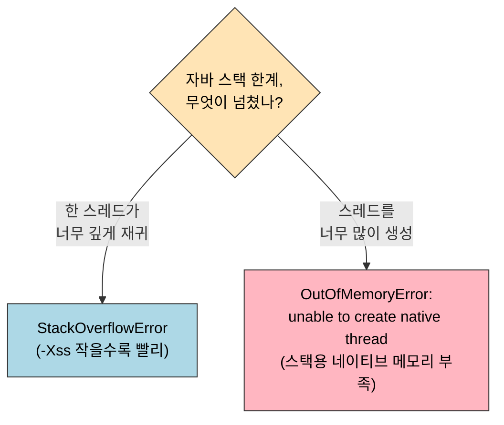
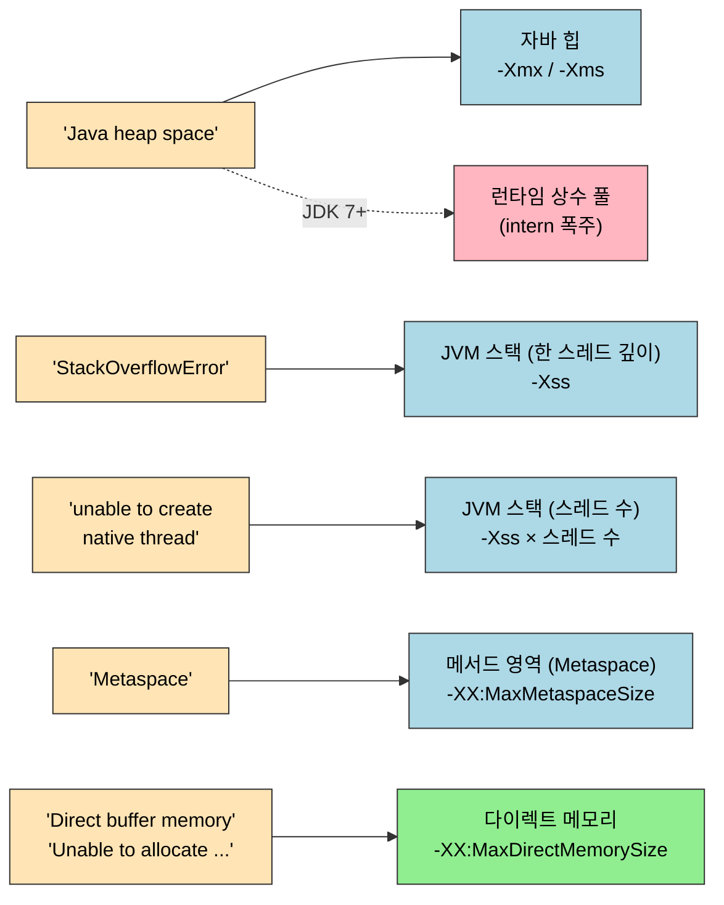

# 실전 — OutOfMemoryError 재현
---
> §2.2에서 본 7개 메모리 영역 각각이 *어떻게 부족해지는가*를 코드로 재현한다. 자바 가상 머신은 영역마다 다른 OOM 메시지를 발생시키며, 메시지를 보면 *어느 영역이 부족했는지*를 한눈에 알 수 있다. 본 노트는 책 §2.4의 4개 하위 절을 영역별 7개 코드 박제로 풀어 둔다. 각 코드는 `_practice/ch02-memory-area/{영역}/`에 독립 모듈로 만들어 두었으므로, 어느 OOM이 어느 영역에서 나는지를 *서로 격리해서* 관찰할 수 있다. 본 절을 한 줄로 압축하면 — **OOM 진단의 첫 단계는 "어느 영역의 OOM인가"이며, JVM 메시지가 그 답을 거의 그대로 알려 준다**. 메시지를 읽는 감각이 곧 실무 진단력이다.

## 1. §2.4.1 자바 힙 오버플로

> 가장 흔한 OOM이다. 객체가 *살아 있는 동안* 자바 힙에 누적되어 GC가 회수하지 못하면 발생한다.

재현 전략은 단순하다. 자바 힙 크기를 *고의로 작게* 잡고(`-Xms20m -Xmx20m`), 살아 있는 참조를 계속 늘려 GC가 손댈 수 없게 만든다.

```java
// HeapOOM.java — 책 p.77 §2.4.1
// VM 옵션: -Xms20m -Xmx20m -XX:+HeapDumpOnOutOfMemoryError
public class HeapOOM {
    static class OOMObject {}

    public static void main(String[] args) {
        List<OOMObject> list = new ArrayList<>();
        while (true) {
            list.add(new OOMObject());
        }
    }
}
```

### 실행 결과

```console
java.lang.OutOfMemoryError: Java heap space
Dumping heap to java_pid<NNNN>.hprof ...
Heap dump file created [22312245 bytes in 0.142 secs]
```

`-XX:+HeapDumpOnOutOfMemoryError` 옵션을 켜면 OOM 시점에 *그 순간의 힙 스냅샷*을 `.hprof` 파일로 떨군다. Eclipse MAT이나 VisualVM으로 열어서 *어느 클래스의 인스턴스가 메모리를 가장 많이 차지하는지* 분석한다. 자바 힙 OOM 진단의 표준 시작점이다.

힙 OOM의 *진짜 원인* 두 종류는 다음과 같다.

| 종류 | 신호 | 처방 |
|------|------|------|
| 메모리 누수 | 한 객체가 *살아 있을 이유*가 없는데 GC가 못 건드림 | 그 객체의 참조 체인을 끊는 코드 수정 |
| 메모리 부족 | 워크로드가 정상이지만 *힙이 작음* | `-Xmx` 증가, 또는 객체 라이프타임 단축 설계 |

힙 덤프 분석은 두 경우를 가르는 첫 단계다. 한쪽이 비정상적으로 비대하면 누수, 모든 클래스가 골고루 차 있으면 부족.

## 2. §2.4.2 가상 머신과 네이티브 메서드 스택 오버플로

> 자바 스택 OOM은 두 갈래로 갈린다. *한 스레드의 스택이 너무 깊어졌는가*와 *스레드가 너무 많아졌는가*.

두 갈래가 어떻게 서로 다른 예외로 떨어지는지 보면 다음과 같다. *깊이*가 문제면 `StackOverflowError`, *스레드 수*가 문제면 `OutOfMemoryError` 라 메시지로 곧장 구분된다.



### 2.1 한 스레드의 스택이 깊어졌을 때 — `StackOverflowError`

가장 단순한 재현은 *무한 재귀*다.

```java
// JavaVMStackSOF_1.java — 책 p.81 §2.4.2 첫 번째
// VM 옵션: -Xss128k
public class JavaVMStackSOF_1 {
    private int stackLength = 1;

    public void stackLeak() {
        stackLength++;
        stackLeak();
    }

    public static void main(String[] args) throws Throwable {
        JavaVMStackSOF_1 oom = new JavaVMStackSOF_1();
        try {
            oom.stackLeak();
        } catch (Throwable e) {
            System.out.println("stack length: " + oom.stackLength);
            throw e;
        }
    }
}
```

```console
stack length: 2402
Exception in thread "main" java.lang.StackOverflowError
    at JavaVMStackSOF_1.stackLeak(...)
    ...
```

`-Xss128k`로 스택을 작게 잡으면 2,400회 정도 재귀 후 *깊이 한계*에 부딪힌다. 책은 한 가지 변주를 더 든다 — 지역 변수가 많은 메서드를 재귀시키면 *프레임 한 개의 크기가 커지므로* 같은 스택 크기에서 더 얕은 깊이에 OOM이 난다 (`JavaVMStackSOF_2`).

### 2.2 스레드가 너무 많아졌을 때 — `OutOfMemoryError`

각 스레드는 자기 스택 메모리를 따로 가진다. 따라서 *스레드 수 × 스레드당 스택 크기*가 한계를 넘으면 새 스레드를 만들 때 OOM이 난다.

```java
// JavaVMStackOOM.java — 책 p.85 §2.4.2 세 번째
// VM 옵션: -Xss2m (각 스레드 스택을 크게 잡아 빨리 한계 도달)
// 주의: 이 코드는 운영체제를 부분 정지시킬 수 있다. 실행은 격리된 환경에서.
public class JavaVMStackOOM {
    private void dontStop() {
        while (true) {}
    }

    public void stackLeakByThread() {
        while (true) {
            new Thread(this::dontStop).start();
        }
    }

    public static void main(String[] args) {
        new JavaVMStackOOM().stackLeakByThread();
    }
}
```

```console
Exception in thread "main" java.lang.OutOfMemoryError: unable to create native thread
```

이 OOM의 메시지가 *`Java heap space`가 아니라 `unable to create native thread`* 라는 점이 핵심이다. 자바 힙은 텅 비어 있어도 *스레드 스택용 네이티브 메모리*가 부족하면 이 메시지가 난다.

> 책 p.85 주의: 이 코드는 운영체제가 만들 수 있는 스레드 수에 따라 *시스템 응답성을 분 단위로 떨어뜨리거나 hang* 시킬 수 있다. macOS·Linux 데스크탑에서는 `ulimit -u`로 스레드 수를 제한한 뒤 실행하거나, 컨테이너 안에서 격리 실행한다.

## 3. §2.4.3 메서드 영역과 런타임 상수 풀 오버플로

> 메서드 영역은 JDK 8부터 Metaspace로 옮겼고, 런타임 상수 풀의 *실체*도 JDK 7부터 자바 힙으로 이동했다. 책의 코드를 *그대로* 돌리면 책의 결과와 다른 메시지가 날 수 있다.

### 3.1 런타임 상수 풀 OOM — `String.intern()` 폭주

```java
// RuntimeConstantPoolOOM.java — 책 p.87 §2.4.3 첫 번째
// VM 옵션 (JDK 6 기준): -XX:PermSize=6m -XX:MaxPermSize=6m
// JDK 7+ 에서는 의미가 다르다 (아래 설명 참조)
public class RuntimeConstantPoolOOM {
    public static void main(String[] args) {
        List<String> list = new ArrayList<>();
        int i = 0;
        while (true) {
            list.add(String.valueOf(i++).intern());
        }
    }
}
```

**JDK 6 기준 결과** — `OutOfMemoryError: PermGen space`. `intern()`이 새 문자열을 영구 세대(PermGen)에 추가하므로, PermGen 한계에 부딪힌다.

**JDK 7+ 기준 결과** — 같은 코드가 *자바 힙 OOM*으로 떨어진다 (`Java heap space`). JDK 7부터 `intern()`이 *문자열 객체 자체*를 자바 힙으로 옮겼기 때문이다. 런타임 상수 풀은 그 객체의 *참조*만 들고 있는 등록부로 바뀌었다.

JDK 21에서 이 OOM을 재현하려면 `-Xmx10m` 같은 옵션으로 자바 힙을 인위적으로 작게 잡거나, `-XX:StringTableSize` 같은 옵션으로 *문자열 테이블 자체*의 한계를 조정한다.

### 3.2 메서드 영역 OOM — 동적 클래스 생성

```java
// JavaMethodAreaOOM.java — 책 p.89 §2.4.3 두 번째
// VM 옵션:
//   JDK 6:  -XX:PermSize=10m -XX:MaxPermSize=10m
//   JDK 8+: -XX:MetaspaceSize=10m -XX:MaxMetaspaceSize=10m
// 의존성: cglib:cglib-nodep:3.3.0 (또는 동등)
public class JavaMethodAreaOOM {
    public static void main(String[] args) {
        while (true) {
            Enhancer enhancer = new Enhancer();
            enhancer.setSuperclass(OOMObject.class);
            enhancer.setUseCache(false);
            enhancer.setCallback((MethodInterceptor) (obj, method, ARGs, proxy)
                -> proxy.invokeSuper(obj, ARGs));
            enhancer.create();
        }
    }

    static class OOMObject {}
}
```

CGLib의 `Enhancer`는 호출될 때마다 *새 동적 프록시 클래스*를 만들어 메서드 영역에 등록한다. 캐시를 꺼서(`setUseCache(false)`) *매번 새 클래스*가 만들어지게 하면, 메서드 영역이 빠르게 찬다.

**JDK 8+ 결과**:

```console
Exception in thread "main" java.lang.OutOfMemoryError: Metaspace
```

옛 메시지(`PermGen space`)가 아니라 `Metaspace`로 바뀐 점, 그리고 *자바 힙 옵션*(`-Xmx`)이 아니라 *Metaspace 옵션*(`-XX:MaxMetaspaceSize`)으로만 한계를 잡을 수 있다는 점이 핵심이다.

JDK 21의 CGLib 호환성은 약하다. JDK 17+에서 CGLib는 *내부 reflection 차단* 때문에 자주 동작하지 않으며, 그 대안으로 ByteBuddy를 쓰는 게 일반적이다. 본 저장소 실습 모듈도 CGLib 대신 ByteBuddy로 재구현해 메서드 영역 OOM을 재현한다.

```java
// _practice/ch02-memory-area/method-area/ — JDK 21 호환 변형
// 의존성: net.bytebuddy:byte-buddy
new ByteBuddy()
    .subclass(Object.class)
    .name("Generated" + counter++)
    .make()
    .load(getClass().getClassLoader());
```

## 4. §2.4.4 네이티브 다이렉트 메모리 오버플로

> 자바 힙 옵션과 *별도로* 한계를 가지는 영역이다. 힙 덤프에는 잡히지 않는다.

```java
// DirectMemoryOOM.java — 책 p.91 §2.4.4
// VM 옵션: -Xmx20m -XX:MaxDirectMemorySize=10m
public class DirectMemoryOOM {
    private static final int _1MB = 1024 * 1024;

    public static void main(String[] args) throws Exception {
        Field unsafeField = Unsafe.class.getDeclaredFields()[0];
        unsafeField.setAccessible(true);
        Unsafe unsafe = (Unsafe) unsafeField.get(null);
        while (true) {
            unsafe.allocateMemory(_1MB);
        }
    }
}
```

```console
Exception in thread "main" java.lang.OutOfMemoryError: Unable to allocate <N> bytes
    at jdk.internal.misc.Unsafe.allocateMemory(Native Method)
    ...
```

`Unsafe.allocateMemory`는 *JVM이 관리하지 않는* 네이티브 메모리를 직접 잡는다. 그래서 `-Xmx`로 잡힌 자바 힙은 *기대만큼 작아도*, 네이티브 메모리가 차서 OOM이 난다. 운영 환경에서 이 OOM이 까다로운 이유 두 가지:

1. *힙 덤프에 안 잡힌다*. 자바 힙은 충분히 여유로워 보인다.
2. *프로세스 RSS는 빠르게 커진다*. `top`이나 `ps`로 보면 자바 힙 한계의 몇 배까지 RSS가 올라간다.

진단의 첫 단서는 *RSS와 자바 힙 사용량의 차이*다. NMT(`-XX:NativeMemoryTracking=summary`)를 켜고 `jcmd <PID> VM.native_memory` 명령으로 영역별 네이티브 메모리 사용량을 본다.

## 5. 7개 OOM 영역 정리

운영 환경에서 본 OOM 메시지를 보면 *어느 영역으로 들어가야 진단이 시작되는지*가 즉시 정해진다. 메시지에서 영역으로 향하는 화살표가 곧 진단의 첫 분기다.



`Java heap space` 한 메시지가 *두 영역*(자바 힙 / 런타임 상수 풀)을 가리키는 점에 주의한다. JDK 7부터 `String.intern()`이 추가하는 문자열 객체가 자바 힙으로 옮겨 갔기 때문이다 — 점선 화살표가 그 분기다. 다이렉트 메모리만 파스텔 그린으로 따로 칠한 이유는 *`-Xmx`로 한계가 조절되지 않는 유일한 영역*임을 강조하기 위함이다.

같은 정보를 표로 다시 정리한다.

| OOM 종류 | 메시지 | 재현 모듈 | 핵심 옵션 |
|---------|------|---------|----------|
| 자바 힙 OOM | `Java heap space` | `heap/` | `-Xms20m -Xmx20m` |
| JVM 스택 SOF | `StackOverflowError` | `jvm-stack/` | `-Xss128k` |
| JVM 스택 OOM (스레드 폭주) | `unable to create native thread` | `native-stack/` | `-Xss2m` |
| Metaspace OOM | `Metaspace` | `method-area/` | `-XX:MaxMetaspaceSize=10m` |
| 런타임 상수 풀 OOM | `Java heap space` (JDK 7+) | `constant-pool/` | `-Xmx10m` |
| 다이렉트 메모리 OOM | `Unable to allocate ... bytes` | `direct-memory/` | `-XX:MaxDirectMemorySize=10m` |

각 모듈은 `_practice/ch02-memory-area/` 안에서 독립 Gradle 서브모듈로 빌드된다. 다음 명령으로 한 종류씩 실행해 OOM 메시지를 직접 확인할 수 있다.

```bash
cd write/01_language/java/05_JVM/_practice
./gradlew :ch02-memory-area:heap:run
./gradlew :ch02-memory-area:jvm-stack:run
# ...
```

## 6. 실행 결과 박제

각 모듈을 실행해 얻은 *실제 출력*은 본 저장소의 `_practice/ch02-memory-area/results/` (자동 생성 디렉토리)에 남는다. 실행 결과가 책의 결과와 다를 때마다 *어느 JDK 버전 변경이 차이를 만들었는지*를 노트에 별도로 정리한다.

| 모듈 | 책 기준 JDK | JDK 21 실행 결과 | 검증 상태 |
|------|------------|------------------|----------|
| `heap` | JDK 12 | `Java heap space` + heap dump 정상 생성 | ✅ 검증 |
| `jvm-stack` SOF | JDK 12 `-Xss128k` | `StackOverflowError`, stack length 976 (`-Xss220k`, JDK 21 최소 스택 208k 제약) | ✅ 검증 |
| `method-area` | JDK 12 + CGLib | ByteBuddy로 치환, `Metaspace` 정상 발생 | ✅ 검증 |
| `constant-pool` | JDK 6 (PermGen) | `Java heap space` (JDK 7+ 동작 변경 확인) | ✅ 검증 |
| `layout` | — | JOL 출력, 헤더 12바이트 = Mark Word 8 + 클래스 포인터 4 (압축 OOP) | ✅ 검증 |
| `direct-memory` | JDK 12 | `-XX:MaxDirectMemorySize`가 `Unsafe.allocateMemory` 직접 호출에는 적용되지 않음 — 시스템 RAM 고갈 위험 | ⚠️ 코드 박제만, 실행 금지 |
| `native-stack` | JDK 12 | 스레드 폭주로 OS hang 위험 | ⚠️ 코드 박제만, 격리된 환경에서만 |

### direct-memory 모듈에 대한 보강

책 §2.4.4의 코드는 `Unsafe.allocateMemory`를 *직접* 호출한다. HotSpot은 `ByteBuffer.allocateDirect`로 잡힌 다이렉트 메모리에 대해서는 `-XX:MaxDirectMemorySize` 한계를 적용하지만, `Unsafe.allocateMemory`로 잡힌 *네이티브 메모리*는 그 한계 밖이다. 그래서 책의 코드를 그대로 돌리면 OOM이 *늦게 나거나* 시스템 RAM이 먼저 고갈된다.

안전하게 다이렉트 메모리 OOM을 재현하려면 다음 변형을 쓴다.

```java
// 책 §2.4.4 변형 — ByteBuffer.allocateDirect 사용 시 한계가 적용됨
import java.nio.ByteBuffer;

public final class DirectMemorySafe {
    private static final int _1MB = 1024 * 1024;

    public static void main(String[] args) {
        while (true) {
            ByteBuffer.allocateDirect(_1MB);
        }
    }
}
```

이 변형은 `-XX:MaxDirectMemorySize=10m`을 잡으면 *10MB 시점*에서 정확히 OOM이 떨어진다. 본 저장소의 `direct-memory` 모듈은 책의 원본 코드를 *박제*하는 의도로 두고, 안전한 재현이 필요하면 위 변형을 별도 클래스로 추가해서 사용한다.


## 관련 문서

- [01-01.런타임 데이터 영역](./01-01.런타임%20데이터%20영역.md) — 본 노트의 7개 OOM이 발생하는 메모리 영역의 지도
- [01-02.핫스팟의 객체 들여다보기](./01-02.핫스팟의%20객체%20들여다보기.md) — 자바 힙 안 객체 레이아웃, 힙 OOM 진단의 전제
- [02-04.마치며](./02-04.마치며.md) — 2장이 3장 GC에 거는 토대 정리
- [`../_practice/ch02-memory-area/`](../_practice/ch02-memory-area/) — 7개 OOM 재현 모듈, 한 모듈에 한 OOM
