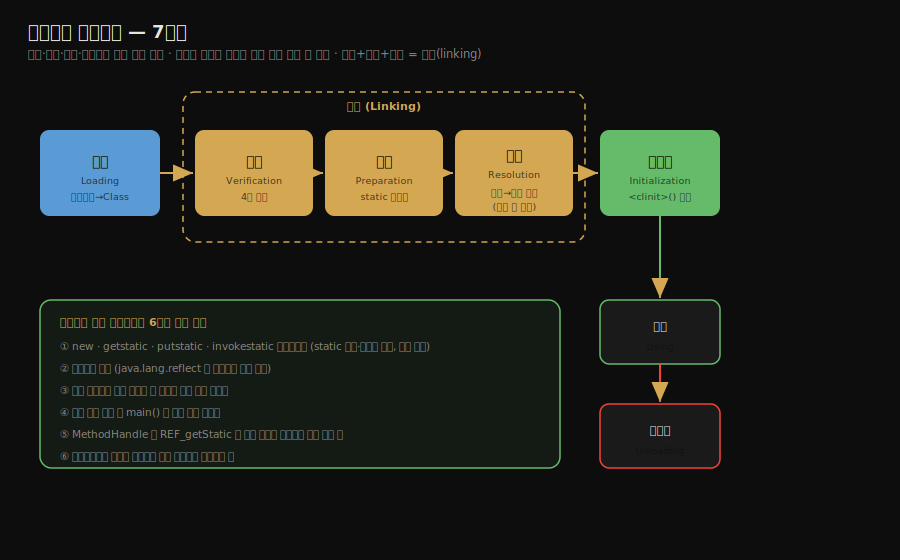

# 클래스 로딩 시점과 생명주기
---
> §7.1~§7.2를 한 줄로 압축하면 — **클래스는 로딩·검증·준비·해석·초기화·사용·언로딩의 7단계 생명주기를 거치며, JVM은 이 과정을 컴파일 시점이 아니라 런타임에 수행해 동적 로딩의 유연함을 얻습니다.** 핵심 질문은 "클래스를 *언제* 메모리에 올리고 *언제* 초기화하는가"이며, 자바는 로딩 시점은 명세에 맡기되 *초기화 시점*만은 6가지 규칙으로 엄격하게 못박았습니다.

이 글을 읽고 나면 클래스 생명주기 7단계를 순서대로 말하고, 어떤 코드가 초기화를 *즉시* 일으키고 어떤 코드는 일으키지 않는지 예제로 판별하며, "부모만 초기화되고 자식은 안 되는" 사례를 그림 없이 설명할 수 있습니다.


## 진입 — 왜 런타임에 로딩하는가

> 클래스 로딩을 런타임으로 미룬 결정이 자바의 동적 확장성을 만들었습니다. C·C++가 링크를 컴파일·빌드 때 끝내는 것과 정반대입니다.

C나 C++는 소스를 컴파일하고 링크할 때 모든 타입이 어디에 있는지 확정합니다. 실행 파일이 만들어지는 순간 구조가 굳습니다. 자바는 이 일을 *실행 중*으로 미룹니다. 타입의 로딩·연결·초기화를 모두 프로그램이 도는 동안 처리합니다.

처음에는 손해처럼 보입니다. 실행 중에 클래스를 읽고 검증하니 시동이 약간 느려집니다. 그러나 이 미룸이 자바 특유의 유연함을 만듭니다. 인터페이스를 먼저 정의하고 구현체는 런타임에 결정하거나, 사용자가 정의한 클래스 로더로 네트워크·DB에서 바이트 스트림을 읽어 클래스를 만드는 일이 모두 가능해집니다. 애플릿·OSGi·핫 디플로이가 이 위에 섭니다.

이 장의 좌표를 못박으면, [클래스 파일 구조](../ch06_class-file/01-01.클래스%20파일%20구조.md)가 *디스크의 `.class`가 어떻게 생겼나*였다면, 이 글은 *그 바이트가 JVM 메모리로 올라와 살아 움직이는 객체가 되기까지의 과정*입니다.


## 1. 생명주기 7단계

> 클래스는 로딩→검증→준비→해석→초기화→사용→언로딩의 7단계를 거칩니다. 앞 다섯 단계의 *시작* 순서는 정해져 있으나, 해석만은 런타임 바인딩을 위해 뒤로 미룰 수 있습니다.

클래스가 JVM 메모리에 적재되어 쓰이고 사라지기까지의 전체 생명주기는 일곱 단계입니다. 이 중 검증·준비·해석 세 단계를 묶어 **연결(linking)**이라 부릅니다.



각 단계의 시작 순서는 다음과 같이 정해져 있습니다. *시작* 순서가 정해진 것이지 한 단계가 끝나야 다음이 시작된다는 뜻은 아닙니다. 실제로는 한 단계가 진행되는 도중에 다음 단계가 맞물려 시작되곤 합니다.

1. 로딩·검증·준비·초기화는 이 순서대로 *시작*합니다. 생명주기의 골격이라 순서가 고정되어 있습니다.
2. 해석은 예외입니다. 경우에 따라 초기화 *뒤에* 시작될 수 있습니다. 자바의 런타임 바인딩(동적 바인딩)을 지원하기 위해서입니다. 실행 중에 비로소 어떤 메서드·필드를 가리키는지 확정해야 하는 상황이 있기 때문입니다.

연결이 *언제 시작되느냐*는 명세가 강제하지 않습니다. 로딩이 다 끝나기 전에 연결을 시작해도 되고, 로딩 도중 연결의 일부를 끼워 넣어도 됩니다. 명세가 못박은 것은 *시작 순서*이지 *완료·간격*이 아닙니다.


## 2. 초기화는 언제 시작되는가 — 6가지 능동 참조

> 로딩 시점은 명세가 JVM 구현에 맡기지만, 초기화 시점만은 6가지로 엄격히 규정합니다. 이 6가지를 능동 참조라 하며, 그 외 클래스 사용은 초기화를 일으키지 않습니다.

자바 명세는 *로딩을 언제 하라*고 강제하지 않습니다. 어느 JVM이 미리 당겨 로딩하든 게을리 미루든 구현의 자유입니다. 그러나 *초기화*만은 다릅니다. "이 여섯 가지 상황에서는 클래스가 아직 초기화되지 않았다면 *반드시 즉시* 초기화하라"고 못박았습니다. 이 여섯을 **능동 참조(active reference)**라 부릅니다.

초기화를 즉시 일으키는 능동 참조는 다음 여섯 가지입니다.

1. `new`, `getstatic`, `putstatic`, `invokestatic` 네 바이트코드를 만났을 때입니다. 자바 코드로는 객체를 `new`로 만들거나, `static` 필드를 읽고 쓰거나(단 컴파일 타임 상수는 예외 — §3 참조), `static` 메서드를 호출하는 경우입니다.
2. `java.lang.reflect` 패키지의 메서드로 클래스에 리플렉션 호출을 하는데 그 클래스가 아직 초기화 전이라면, 먼저 초기화를 일으킵니다.
3. 어떤 클래스를 초기화하려는데 그 부모 클래스가 아직 초기화되지 않았다면, 부모부터 초기화합니다.
4. 가상 머신이 기동할 때, `main()` 메서드를 담은 시작 클래스(메인 클래스)를 가장 먼저 초기화합니다.
5. `MethodHandle` 인스턴스가 가리키는 메서드 핸들이 `REF_getStatic`, `REF_putStatic`, `REF_invokeStatic` 같은 핸들로 해석되었고, 그 핸들에 대응하는 클래스가 아직 초기화 전이라면 초기화합니다. (JDK 7 동적 언어 지원에서 추가)
6. 인터페이스에 디폴트 메서드(`default` 메서드, JDK 8 추가)가 정의되어 있고, 그 인터페이스를 구현한 클래스가 초기화될 때, 해당 인터페이스를 먼저 초기화합니다.

이 여섯만이 클래스 초기화를 *즉시* 일으킵니다. 다른 모든 사용 방식은 초기화를 일으키지 않으며, 이를 **수동 참조(passive reference)**라 부릅니다.


## 3. 초기화를 일으키지 않는 수동 참조 — 세 예제

> 같은 클래스를 건드려도 초기화를 일으키지 않는 경우가 있습니다. 자식의 부모 static 참조·배열 선언·컴파일 타임 상수 세 가지가 대표적인 함정입니다.

능동 참조처럼 보이지만 초기화를 일으키지 않는 코드가 있습니다. 책 §7.2가 든 세 예제를 그대로 봅니다. 이 셋은 면접에서 자주 묻는 자리입니다.

### 예제 1 — 자식을 통한 부모의 static 필드 접근

자식 클래스를 통해 부모의 `static` 필드를 읽으면, 부모만 초기화되고 자식은 초기화되지 않습니다.

```java
class SuperClass {
    static {
        // 부모가 초기화될 때만 이 줄이 찍힙니다 — 초기화 여부의 관측 지점
        System.out.println("SuperClass init!");
    }
    public static int value = 123;   // static 필드는 부모에 선언
}

class SubClass extends SuperClass {
    static {
        System.out.println("SubClass init!");
    }
}

public class Test {
    public static void main(String[] args) {
        // SubClass 를 통해 부모 필드 value 에 접근
        System.out.println(SubClass.value);
    }
}
```

출력은 `SuperClass init!`과 `123`뿐이고, `SubClass init!`은 **찍히지 않습니다.** `static` 필드는 그 필드를 *실제로 선언한 클래스*만 초기화하기 때문입니다. `value`는 `SuperClass`의 것이므로 `SubClass`를 거쳐 접근해도 자식 초기화는 일어나지 않습니다. 자식을 거친 접근이 자식을 깨우리라는 직관이 깨지는 자리입니다.

### 예제 2 — 배열 선언

배열 타입을 선언하는 것만으로는 그 원소 클래스가 초기화되지 않습니다.

```java
public class Test {
    public static void main(String[] args) {
        // SuperClass 의 배열을 선언만 함 — 인스턴스 생성 아님
        SuperClass[] array = new SuperClass[10];
    }
}
```

`SuperClass init!`이 찍히지 않습니다. `new SuperClass[10]`은 `SuperClass`를 초기화하는 게 아니라, JVM이 자동 생성한 `[LSuperClass`라는 *배열 클래스*를 만드는 동작이기 때문입니다. 배열 클래스는 `newarray`·`anewarray` 바이트코드로 생기며, 원소 타입 자체의 초기화와는 별개입니다.

### 예제 3 — 컴파일 타임 상수

`static final` 상수를 참조해도 그 상수를 담은 클래스는 초기화되지 않습니다.

```java
class ConstClass {
    static {
        System.out.println("ConstClass init!");
    }
    // static final 컴파일 타임 상수
    public static final String HELLO_WORLD = "hello world";
}

public class Test {
    public static void main(String[] args) {
        // 상수를 참조
        System.out.println(ConstClass.HELLO_WORLD);
    }
}
```

`ConstClass init!`이 찍히지 않습니다. `static final` 상수는 컴파일 단계에서 그 값이 *참조하는 쪽의 상수 풀*로 복사되기 때문입니다. 컴파일이 끝나면 `Test`의 상수 풀에 `"hello world"`가 직접 박혀 있어, 런타임에는 `ConstClass`를 들여다볼 일이 없습니다. 원본 클래스와의 연결이 컴파일 시점에 끊어진 셈입니다.


## 4. 인터페이스의 초기화 규칙 차이

> 인터페이스도 초기화되지만, 클래스와 한 가지가 다릅니다. 클래스는 부모를 먼저 초기화하지만, 인터페이스는 부모 인터페이스를 *실제로 쓸 때*까지 미룹니다.

인터페이스에도 `<clinit>()` 초기화 과정이 있습니다. 인터페이스에 선언한 필드는 모두 암묵적으로 `static final`이므로 초기값을 넣어야 하기 때문입니다.

클래스와 인터페이스가 갈리는 지점은 부모 초기화 규칙입니다. 클래스를 초기화할 때는 부모 클래스가 먼저 초기화되어야 합니다(능동 참조 ③). 그러나 인터페이스를 초기화할 때는 부모 인터페이스를 *먼저* 초기화하지 않습니다. 부모 인터페이스는 그 안의 필드를 *실제로 사용하는 시점에* 비로소 초기화됩니다. 부모 인터페이스를 게으르게 초기화하는 셈입니다.


## 5. 면접 대비 요약

> 핵심은 "생명주기 7단계 순서"와 "초기화를 일으키는 6가지 vs 일으키지 않는 3예제"의 구분입니다.

### 한 줄 정의

클래스 로딩이란 `.class` 바이트 스트림을 JVM 메모리로 읽어 들여 검증·연결·초기화를 거쳐 `java.lang.Class` 객체로 만드는 런타임 과정을 말합니다.

### 핵심 포인트 3가지

1. 생명주기는 로딩·검증·준비·해석·초기화·사용·언로딩 7단계이며, 검증·준비·해석을 묶어 연결이라 부릅니다. 해석만 초기화 뒤로 미뤄질 수 있습니다.
2. 초기화 시점은 6가지 능동 참조로 엄격히 규정됩니다. `new`·static 접근·리플렉션·부모 초기화·메인 클래스·MethodHandle·디폴트 메서드입니다.
3. 자식을 통한 부모 static 접근, 배열 선언, 컴파일 타임 상수 참조는 초기화를 일으키지 않는 수동 참조입니다.

### 면접에서 받을 만한 질문

1. `SubClass.value`로 부모 static 필드를 읽으면 왜 자식은 초기화되지 않습니까?
2. `static final` 상수 참조가 원본 클래스를 초기화하지 않는 이유는 무엇입니까?
3. 클래스와 인터페이스의 부모 초기화 규칙은 어떻게 다릅니까?

> 세 질문에 *먼저 스스로 답해 본 뒤* 아래 §정답으로 내려갑니다. 자답 없이 읽으면 학습 효과가 줄어듭니다.


## 정답 (자답 후 펼치기)

> 위 §면접에서 받을 만한 질문의 3개에 *먼저 자답한 뒤* 아래를 읽으세요.

### 정답 1 — 자식을 통한 부모 static 접근

`static` 필드는 그 필드를 *실제로 선언한 클래스*만 초기화하기 때문입니다. `value`는 `SuperClass`에 선언되어 있으므로, `SubClass.value`로 접근하더라도 JVM은 `SuperClass`만 능동 참조로 보고 초기화합니다. `SubClass`는 자신의 `static` 멤버가 쓰이지 않는 한 초기화 대상이 아닙니다.

### 정답 2 — 컴파일 타임 상수

`static final` 상수는 컴파일 단계에서 값이 *참조하는 쪽의 상수 풀로 복사*되기 때문입니다. `Test`를 컴파일하면 `"hello world"`가 `Test`의 상수 풀에 직접 박혀, 런타임에는 `ConstClass`를 들여다볼 필요가 사라집니다. 원본 클래스와의 연결이 컴파일 시점에 끊어집니다.

### 정답 3 — 클래스 vs 인터페이스 부모 초기화

클래스는 초기화 전에 부모 클래스를 *반드시 먼저* 초기화합니다(능동 참조 ③). 반면 인터페이스는 부모 인터페이스를 미리 초기화하지 않고, 부모 인터페이스의 필드를 *실제로 사용하는 시점에* 게으르게 초기화합니다.


## 핵심 개념 체크리스트

- [ ] 생명주기 7단계를 순서대로 말할 수 있는가?
- [ ] 검증·준비·해석이 연결(linking)로 묶인다는 것을 아는가?
- [ ] 해석이 초기화 뒤로 미뤄질 수 있는 이유(런타임 바인딩)를 설명할 수 있는가?
- [ ] 초기화를 일으키는 6가지 능동 참조를 나열할 수 있는가?
- [ ] 수동 참조 3예제(부모 static·배열·상수)를 그림 없이 설명할 수 있는가?


## 관련 문서

> 이 글이 다룬 생명주기의 *다음 단계*들을 두 후속 편이 이어받습니다. 로딩·검증·준비의 내부 동작과, 해석·초기화의 상세가 각각의 자리입니다.

- [02-02. 로딩·검증·준비](./02-02.로딩%C2%B7검증%C2%B7준비.md) — 생명주기 앞 세 단계의 내부 동작
- [02-03. 해석과 초기화](./02-03.해석과%20초기화.md) § "초기화" — `<clinit>()`의 실체와 스레드 안전성
- [클래스 파일 구조](../ch06_class-file/01-01.클래스%20파일%20구조.md) — 로딩의 입력이 되는 `.class` 바이트 형식
