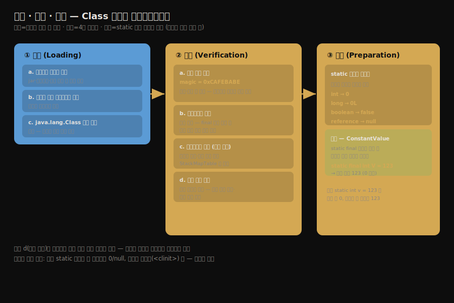
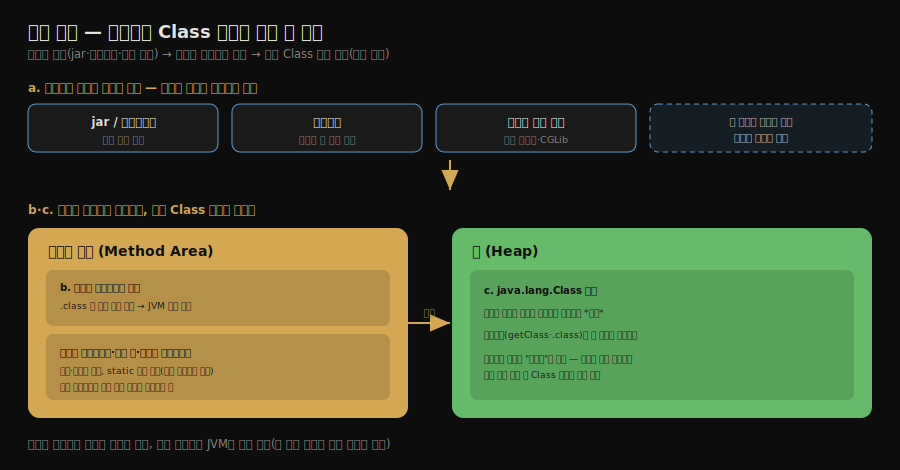
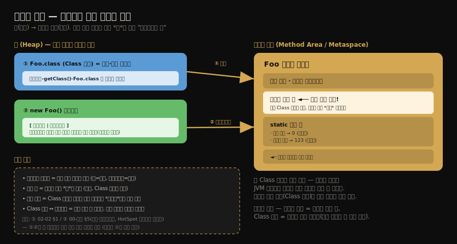
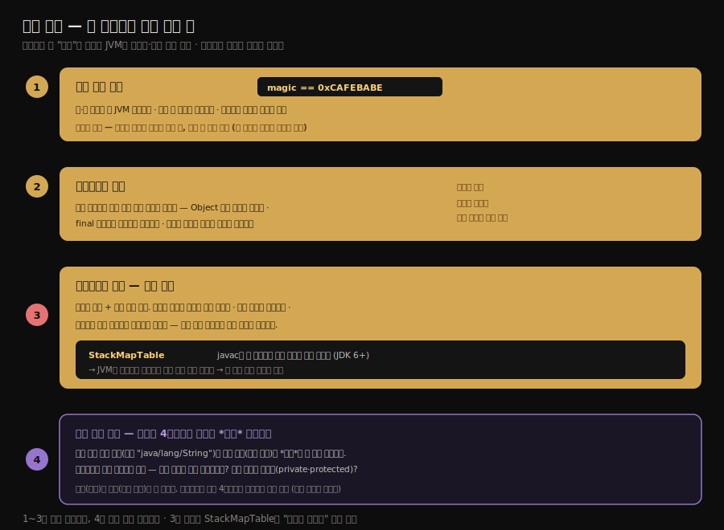
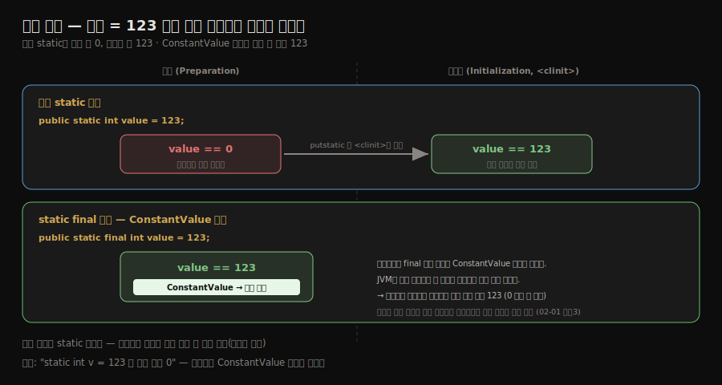

# 로딩·검증·준비
---
> §7.3.1~§7.3.3을 한 줄로 압축하면 — **로딩은 바이트 스트림을 메서드 영역 자료구조와 `Class` 객체로 바꾸고 검증은 그 바이트가 JVM을 깨뜨리지 않을지 네 단계로 거르며 준비는 `static` 변수에 자료형 기본값을 할당합니다.** 
>
> 이 세 단계의 핵심은 "준비 단계의 `static int v = 123`은 아직 0이다"라는 함정과, 검증이 왜 보안의 첫 관문인지입니다.

이 글을 읽고 나면 로딩의 세 작업을 말하고 검증 4단계가 각각 무엇을 거르는지 설명하며 준비 단계에서 일반 `static` 변수와 `static final` 상수가 왜 다르게 처리되는지 그림 없이 짚을 수 있습니다.


## 진입 — 검증은 왜 필요한가

> JVM은 `.class` 바이트를 신뢰하지 않습니다. 손으로 조작했거나 다른 컴파일러가 만든 바이트가 들어와도 가상 머신이 무너지지 않도록, 적재 전에 검사합니다.

[생명주기](./02-01.클래스%20로딩%20시점과%20생명주기.md)에서 본 7단계 중 이 글은 앞 세 단계입니다. 자바 소스를 `javac`로 컴파일한 `.class`만 JVM에 들어오는 게 아닙니다. 바이트를 직접 만들 수도, 손으로 고칠 수도, Kotlin·Scala 컴파일러가 떨어뜨릴 수도 있습니다. 

- 검증은 *그 출처를 믿지 않는다*는 전제에서 출발합니다. 잘못된 바이트가 메서드 영역에 적재되면 가상 머신 자체가 위협받기 때문입니다.

여기서 검증이 막으려는 것이 *깔끔한 예외*가 아니라는 점이 중요합니다. 

- 자바 *소스*는 컴파일러가 타입·문법을 보장하지만 JVM에 들어오는 것은 소스가 아니라 바이트코드입니다. 조작된 바이트코드는 점프 명령을 메서드 *밖으로* 튀게 하거나, 피연산자 스택에 엉뚱한 자료형을 올려 다른 메모리를 읽게 하거나, 타입 변환을 위조해 임의 주소에 접근하게 만들 수 있습니다. 
- 이것은 try-catch로 잡히는 예외가 아니라 *가상 머신의 메모리·타입 안전 보장 자체가 깨지는* 일이라, 크래시나 보안 구멍으로 이어집니다. 검증은 이 위협을 *적재 전에* 거르는 보안 관문입니다.

전체 흐름을 한 장으로 압축하면 다음과 같습니다.




## 1. 로딩 — 바이트가 Class 객체가 되는 세 작업

> 로딩 단계에서 JVM은 세 가지 일을 합니다. 바이트 스트림 획득, 메서드 영역 자료구조 변환, `Class` 객체 생성입니다.

로딩(loading)은 생명주기의 첫 단계입니다. 이 단계에서 가상 머신은 다음 세 작업을 완료합니다.

1. **클래스의 정규화된 이름으로 그 클래스를 정의하는 *바이너리 바이트 스트림*을 얻습니다.** 이 바이트를 *어디서 어떻게* 가져오는지는 명세가 강제하지 않습니다. jar 파일에서 읽든, 네트워크에서 내려받든(애플릿), 런타임에 동적으로 생성하든(동적 프록시) 자유입니다. 이 자유가 사용자 정의 클래스 로더의 토대입니다.
2. 그 바이트 스트림이 표현하는 정적 저장 구조를, *메서드 영역*의 **런타임 자료구조로 변환합니다.**
3. **메모리(힙)에 그 클래스를 대표하는 `java.lang.Class` 객체를 생성합니다.** 이 객체가 메서드 영역에 있는 클래스 데이터에 접근하는 입구가 됩니다.

여기서 *메서드 영역의 클래스 데이터*와 *힙의 `Class` 객체*를 헷갈리기 쉽습니다. 

- 클래스의 실제 정적 정보(필드 정의·메서드 바이트코드·상수 풀·`static` 변수)는 **메서드 영역에만** 있고 `Class` 객체가 그 정보를 복사해 가는 것이 아닙니다. 
- `Class` 객체는 *사본이 아니라 그 데이터를 가리키는 포인터*입니다. 

그렇다면 왜 따로 만드느냐 메서드 영역은 JVM 내부의 네이티브 구조라 자바 코드가 직접 만질 수 없기 때문입니다. 

- `obj.getClass()`·`Foo.class`·리플렉션처럼 *자바 코드가 클래스 정보를 다루려면 자바 객체가 필요*한데, 그 입구로 힙에 `Class` 객체 하나를 두는 것입니다. 
- 도서관에 비유하면 메서드 영역의 클래스 데이터는 서고의 *실제 책*이고 `Class` 객체는 로비의 *검색 단말기*입니다.
- 단말기가 책 내용을 복사한 게 아니라 책을 가리키며 이용자(자바 코드)는 단말기를 통해서만 책을 들여다봅니다. 그래서 `static value`의 실제 값은 메서드 영역에 있고(준비 때 0, 초기화 때 실제 값), `Foo.class`는 힙의 `Class` 객체입니다.

#### 왜 굳이 Class 객체를 따로 만드는가

메서드 영역에 클래스 정보가 이미 다 있는데 힙에 `Class` 객체를 *또* 만드는 이유는, **자바 코드가 그 클래스 정보에 손댈 방법이 필요하기 때문**입니다. 왜를 세 단으로 끊으면 분명합니다.

1. **클래스 정보는 메서드 영역(JVM 네이티브 구조)에 있어 자바 코드가 직접 접근할 수 없습니다.** C++로 짜인 JVM이 자기 형식으로 관리하는 메모리라, 자바 문법으로 읽을 통로가 없습니다.
2. **그런데 자바 코드는 런타임에 클래스를 다뤄야 합니다.** `obj.getClass()`로 타입을 묻고, `Foo.class.getDeclaredFields()`로 필드 목록을 얻고, `clazz.getConstructor().newInstance()`로 객체를 만드는 일이 모두 "클래스 정보를 자바로 다루는" 작업입니다.
3. **그래서 힙에 그 데이터를 가리키는 입구로 `Class` 객체를 둡니다.** `Foo.class`는 자바 객체라 자유롭게 다룰 수 있고, 그 메서드를 호출하면 JVM이 뒤에서 메서드 영역의 진짜 데이터를 읽어 돌려줍니다. 도서관 비유의 *검색 단말기*가 바로 이것입니다 — 책(메서드 영역)을 복사하지 않고 가리키기만 합니다.

이 구조가 추상적으로 끝나지 않는 까닭은, *런타임에 클래스를 다루는 모든 프레임워크*의 출입구가 이 `Class` 객체이기 때문입니다. Spring이 `@Component`를 스캔하고 빈을 만들고 AOP 프록시를 씌우는 일, JPA가 `@Entity`를 읽는 일, Jackson이 필드를 직렬화하는 일이 전부 `Class` 객체를 통한 리플렉션입니다. `Class` 객체가 없으면 Spring의 DI·AOP 자체가 성립하지 않습니다.

```java
Object bean = ctx.getBean(Foo.class);                  // Foo.class = 힙의 Class 객체
boolean isService = Foo.class.isAnnotationPresent(Service.class);  // 어노테이션 검사도 Class 객체로
```

비배열 클래스의 로딩은 사용자가 클래스 로더를 통해 직접 제어할 수 있습니다. 반면 배열 클래스는 클래스 로더로 만드는 게 아니라, JVM이 직접 메모리에서 생성합니다. 다만 배열의 원소 타입은 결국 클래스 로더로 로딩되므로, 배열도 클래스 로더와 무관하지 않습니다.



`Class` 객체·인스턴스·메서드 영역이 *서로 무엇을 가리키는가*를 한 장으로 보면 방향이 분명해집니다. 힙의 `Class` 객체(①)와 인스턴스(②)가 *각자* 메서드 영역의 클래스 데이터를 가리키며, 상수 풀은 그 메서드 영역 *안*에 있는 가리켜지는 쪽입니다. ②(인스턴스의 클래스 워드)는 [00-개관 §5](./00-개관.JDK%20구조와%20바이트코드.md)의 다이렉트 포인터를 함께 그린 것입니다.




## 2. 검증 — JVM을 지키는 네 단계 거름망

> 검증은 파일 형식·메타데이터·바이트코드·심볼 참조 네 단계를 거칩니다. 각 단계가 거르는 위협이 다릅니다.

검증(verification)은 연결의 첫 단계이며 메서드 영역에 적재된 바이트가 JVM 명세의 모든 제약을 지키는지, 가상 머신을 위협하지 않는지 확인합니다. 네 단계로 나뉩니다.

### 1. 파일 형식 검증

바이트 스트림이 클래스 파일 형식 명세에 맞는지 봅니다. 

- 가장 먼저 매직 넘버가 `0xCAFEBABE`로 시작하는지, 주·부 버전이 이 JVM이 처리할 범위인지, 상수 풀의 상수 타입이 올바른지 등을 검사합니다.
-  이 단계를 통과해야 바이트가 비로소 메서드 영역에 저장되며 이후 세 단계는 메서드 영역의 저장 구조를 대상으로 진행됩니다.

### 2. 메타데이터 검증

클래스의 메타데이터 정보를 의미적으로 분석해 자바 언어 명세를 어기지 않는지 봅니다. 

- 부모 클래스가 있는지(`Object` 외 모든 클래스는 부모가 있어야 함), `final` 클래스를 상속하지 않았는지, 추상 메서드가 아닌데 구현이 없지는 않은지 등을 검사합니다.

### 3. 바이트코드 검증

가장 복잡한 단계입니다. 데이터 흐름과 제어 흐름을 분석해 메서드 본문이 런타임에 가상 머신을 위협하지 않을지 확인합니다. 

- 점프 명령이 메서드 밖으로 튀지 않는지, 타입 변환이 유효한지, 피연산자 스택의 자료형이 명령어와 맞는지 등을 봅니다. 
- **분석은 비용이 크기 때문에**, JDK 6 이후 `javac`가 `StackMapTable` 속성을 클래스 파일에 미리 넣어 검증을 가속합니다.

`StackMapTable`이 가속하는 원리는 *추론을 대조로 바꾸는* 데 있습니다. **검증이 비싼 까닭은 JVM이 메서드의 모든 실행 경로를 따라가며 *각 분기점에서 피연산자 스택과 지역 변수의 자료형이 무엇인지* 스스로 추론**해야 하기 때문입니다. 

- `javac`는 컴파일 시점에 이미 이 타입 상태를 알고 있으므로, 각 분기점의 기대 타입을 `StackMapTable`에 미리 적어 둡니다. 그러면 JVM은 처음부터 추론하는 대신 *적힌 것과 실제가 맞는지 대조*만 하면 되어, 검증이 한 번의 선형 통과로 끝납니다. 
- 여기서 *분기점*은 함수 호출이 아니라 *점프 명령의 목적지*입니다 — `if/else`가 건너뛰는 곳, `for`/`while`이 맨 위로 되돌아오는 곳처럼 실행 경로가 갈라지거나 합류하는 지점입니다. 
- 일직선 코드는 위에서부터 따라가면 타입이 저절로 정해져 기록할 게 없지만 여러 경로가 합류하는 지점은 어느 경로로 왔느냐에 따라 스택 상태가 달라질 수 있어 그 자리에만 타입을 못박아 둡니다.

### 4. 심볼 참조 검증

**이 마지막 단계는 사실 연결의 *해석* 단계에 일어납니다.** 상수 풀의 심볼 참조를 직접 참조로 바꿀 때, 참조 대상이 실제로 존재하는지, 접근 권한이 있는지(`private`·`protected` 등) 확인합니다. 해석 단계의 동작이므로 [다음 글](./02-03.해석과%20초기화.md)에서 이어 봅니다.

왜 검증의 한 단계로 분류되면서 *실행 시점*은 해석이냐면, 심볼 참조 검증이 하는 일과 해석이 하는 일이 한 몸이기 때문입니다. 

- 해석은 상수 풀의 *심볼 참조*(이름, 예: `"java/lang/String"`)를 *직접 참조*(실제 메모리 위치)로 번역하는 단계입니다. 이름을 주소로 바꾸려면 *그 대상이 진짜 존재하는가, 접근해도 되는가*를 먼저 확인해야 하는데, 이 확인이 곧 심볼 참조 검증입니다. 
- 번역과 확인이 떼려야 뗄 수 없으므로, 검증의 논리적 4단계에 들어가지만 실제로는 해석 단계에 가서 일어납니다.



- 검증은 중요하지만 *필수는 아닙니다*. 신뢰할 수 있는 코드라면 `-Xverify:none` 옵션으로 대부분의 검증을 꺼서 로딩 시간을 줄일 수 있었습니다. 다만 이 옵션은 JDK 13에서 폐기 예고되었으므로 운영에서 의존하지 않습니다.


## 3. 준비 — static 변수에 기본값을 넣는 단계

> 준비 단계는 `static` 변수에 *자료형 기본값*을 메서드 영역에 할당합니다. 핵심 함정은 `static int v = 123`이 이 단계에서 아직 0이라는 점입니다.

준비(preparation)는 클래스의 `static` 변수에 메모리를 할당하고 *초기 기본값*을 설정하는 단계입니다. 여기서 두 가지를 정확히 구분해야 합니다.

1. 첫째, 이 단계가 다루는 것은 `static` 변수(클래스 변수)뿐이며 인스턴스 변수는 대상이 아닙니다. 인스턴스 변수는 객체가 생성될 때 힙에 함께 할당되기 때문입니다.
2. 둘째, 여기서 넣는 값은 *프로그래머가 적은 값*이 아니라 *자료형의 기본값*입니다. 다음 예를 봅니다.

```java
// 일반 static 변수
public static int value = 123;
```

- 준비 단계가 끝난 직후 `value`는 `123`이 아니라 **`0`**입니다. `value = 123`을 대입하는 `putstatic` 명령은 컴파일러가 `<clinit>()` 메서드에 모아 두며 이 메서드는 *초기화* 단계에 가서야 실행되기 때문입니다. 준비 단계는 메모리 자리를 잡고 자료형 기본값만 채웁니다.

자료형별 기본값은 `int`·`long`은 0, `boolean`은 `false`, `char`는 ``, 참조형은 `null`입니다.

### 예외 — ConstantValue가 붙은 상수

`static final` 상수는 준비 단계에서 곧바로 실제 값으로 초기화됩니다.

```java
// static final 상수 — ConstantValue 속성이 붙음
public static final int value = 123;
```

- 이 경우 `value`는 준비 단계 직후 이미 `123`입니다. 컴파일러가 이 필드에 `ConstantValue` 속성을 붙이기 때문입니다. 
- JVM은 준비 단계에서 `ConstantValue`를 발견하면 그 값을 즉시 변수에 넣습니다. 그래서 일반 `static` 변수는 0으로, 상수는 실제 값으로 갈립니다. 
- 이 차이가 [생명주기 글의 수동 참조 예제 3](./02-01.클래스%20로딩%20시점과%20생명주기.md)에서 상수 참조가 클래스를 초기화하지 않는 이유와 같은 뿌리입니다 — 상수는 컴파일·준비 단계에서 값이 확정됩니다.




## 실습 — javap 로 ConstantValue·StackMapTable 직접 보기

본문의 두 속성이 실제 `.class` 안에 있는지 `javap -v -p` 로 확인했습니다. 추상 설명이 아니라 바이트로 박혀 있습니다.

준비 단계의 `ConstantValue` — 일반 `static int value = 123` 에는 속성이 없고 대입 `putstatic value` 가 `<clinit>`에 모이지만 `static final int CONST = 456` 에는 필드 바로 아래 `ConstantValue: int 456` 이 붙습니다. 그래서 일반 static 은 준비 직후 0, 상수만 즉시 실제 값이라는 §3의 함정이 바이트로 드러납니다.

바이트코드 검증의 `StackMapTable` — 분기·반복이 있는 메서드(`for`+`if/else`)에는 `StackMapTable: number_of_entries = 4` 처럼 분기점별 타입 스냅숏(`append`·`same`·`chop` frame)이 붙고 `return a + b` 한 줄짜리 메서드에는 아예 없습니다. frame 이 찍힌 자리는 바이트코드의 `if_icmpge 32`·`goto 26` 같은 *점프 목적지*와 일치합니다 — 분기점이 점프 목적지임을 직접 확인할 수 있습니다.

> 실습 코드와 전체 관측은 `_practice/ch07-class-loading/verify-prepare/`(`PrepareDemo.java`·`VerifyDemo.java`·`VERIFY_PREPARE.md`)에 있습니다.


## 4. 면접 대비 요약

> 핵심은 "로딩 세 작업"과 "검증 4단계", 그리고 "준비 단계의 static 변수는 0"이라는 함정입니다.

### 한 줄 정의

로딩은 바이트 스트림을 메서드 영역 자료구조와 `Class` 객체로 바꾸는 단계, 검증은 그 바이트의 안전성을 거르는 단계, 준비는 `static` 변수에 자료형 기본값을 할당하는 단계를 말합니다.

### 핵심 포인트 3가지

1. 로딩은 바이너리 획득·메서드 영역 변환·`Class` 객체 생성 세 작업이며 바이트의 출처는 자유라 사용자 정의 로더가 가능합니다.
2. 검증은 파일 형식(매직넘버 `0xCAFEBABE`)·메타데이터·바이트코드·심볼 참조 네 단계이며 바이트코드 검증이 가장 복잡합니다.
3. 준비 단계에서 일반 `static int v = 123`은 0이고 `static final` 상수만 `ConstantValue`로 즉시 실제 값이 됩니다.

### 면접에서 받을 만한 질문

1. 검증이 *필수가 아닌데도* 기본으로 켜져 있는 이유는 무엇입니까?
2. `public static int v = 123`은 준비 단계가 끝난 직후 어떤 값입니까?
3. 바이트코드 검증이 가장 복잡한 단계인 이유와, JDK 6 이후 어떻게 가속됩니까?

> 세 질문에 *먼저 자답한 뒤* 아래 §정답으로 내려갑니다.


## 정답 (자답 후 펼치기)

> 위 §면접에서 받을 만한 질문의 3개에 *먼저 자답한 뒤* 아래를 읽으세요.

### 정답 1 — 검증을 기본으로 켜는 이유

JVM이 `.class` 바이트의 출처를 신뢰하지 않기 때문입니다. 손으로 조작했거나 다른 컴파일러가 만든 바이트가 들어올 수 있고 잘못된 바이트가 메서드 영역에 적재되면 가상 머신 자체가 무너질 수 있습니다. 검증은 적재 전 그 위협을 거르는 보안 관문이라 기본으로 켜 둡니다.

### 정답 2 — 준비 단계의 static 변수 값

`0`입니다. `value = 123`의 대입은 컴파일러가 `<clinit>()`에 모아 두고 *초기화* 단계에 실행하므로, 준비 단계에서는 메모리만 잡고 자료형 기본값 `0`만 채웁니다. `static final` 상수였다면 `ConstantValue` 덕에 준비 직후 이미 `123`입니다.

### 정답 3 — 바이트코드 검증의 복잡성

메서드 본문의 데이터 흐름과 제어 흐름을 모두 분석해 점프가 메서드 밖으로 튀지 않는지, 피연산자 스택 자료형이 명령어와 맞는지 등을 확인하기 때문입니다. 이 분석은 비용이 커서, JDK 6 이후 `javac`가 `StackMapTable` 속성에 검증 정보를 미리 넣어 런타임 검증을 가속합니다.


## 핵심 개념 체크리스트

- [ ] 로딩의 세 작업을 말할 수 있는가?
- [ ] 검증 4단계가 각각 무엇을 거르는지 설명할 수 있는가?
- [ ] 매직 넘버 `0xCAFEBABE`가 어느 검증 단계에서 확인되는지 아는가?
- [ ] 준비 단계에서 일반 변수와 상수가 다르게 처리되는 이유를 아는가?
- [ ] `StackMapTable`이 어느 검증을 가속하는지 설명할 수 있는가?


## 관련 문서

> 이 글의 앞뒤를 두 편이 받칩니다. 검증의 마지막 단계인 심볼 참조 검증은 다음 글의 해석 단계와 한 몸이고 전체 단계의 위치는 생명주기 글이 잡아 줍니다.

- [02-03. 해석과 초기화](./02-03.해석과%20초기화.md) § "해석" — 심볼 참조 검증이 일어나는 해석 단계
- [02-01. 클래스 로딩 시점과 생명주기](./02-01.클래스%20로딩%20시점과%20생명주기.md) — 이 세 단계가 전체 생명주기 어디에 있는지
- [클래스 파일 구조](./01-01.클래스%20파일%20구조.md) § "상수 풀" — 검증과 준비가 다루는 상수 풀·필드 구조
