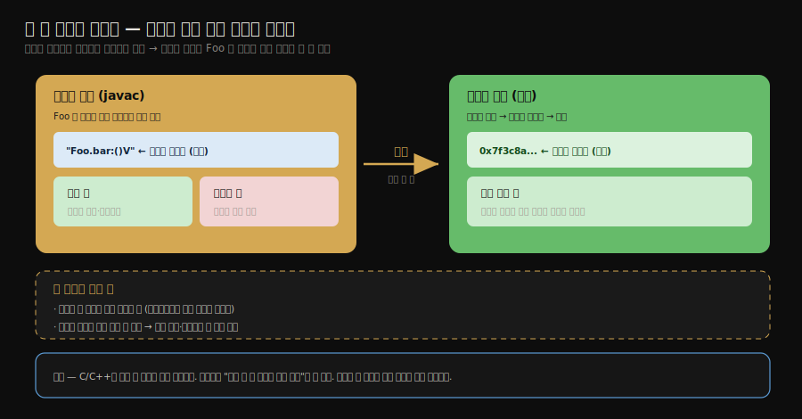
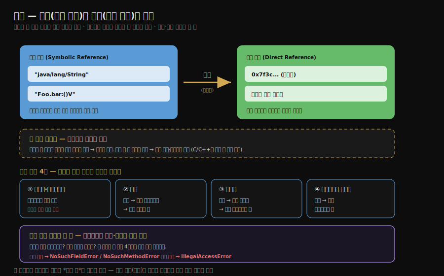

# 해석과 초기화
---
> §7.3.4~§7.3.5를 한 줄로 압축하면 — **해석은 상수 풀의 *심볼 참조*를 *직접 참조*로 바꾸는 단계이고 초기화는 컴파일러가 모은 `static` 코드를 `<clinit>()` 메서드로 실행하는 단계입니다.** 
>
> 초기화의 핵심은 "`<clinit>()`은 부모 먼저, 클래스당 한 번, 한 스레드만 실행한다"이며 이것이 static 싱글턴이 스레드 안전한 근거이자 동시에 데드락 함정의 자리입니다.

이 글을 읽고 나면 심볼 참조와 직접 참조의 차이를 말하고 `<clinit>()`에 무엇이 모이는지와 부모·자식 실행 순서를 예제로 설명하며 여러 스레드가 같은 클래스를 동시에 초기화할 때 왜 한 번만 실행되는지 그림 없이 짚을 수 있습니다.


## 진입 — 심볼 참조라는 미완의 주소

> 컴파일 시점에는 다른 클래스·메서드가 메모리 어디에 있을지 모릅니다. 그래서 `.class`는 *이름*으로만 참조를 적어 두고 실행 중에 그 이름을 실제 주소로 바꿉니다. 이 변환이 해석입니다.

[로딩·검증·준비](./02-02.로딩%C2%B7검증%C2%B7준비.md)까지 마치면 클래스 데이터가 메서드 영역에 자리잡습니다. 

- 그러나 상수 풀에는 다른 클래스·필드·메서드를 가리키는 참조가 *이름 문자열*로만 적혀 있습니다. 컴파일 시점에는 그 대상이 메모리 어디에 로딩될지 알 수 없기 때문입니다. 
- 이 이름 형태의 참조를 *심볼 참조*라 하고 실행 중에 실제 메모리 위치(포인터·핸들·오프셋)로 바꾼 것을 *직접 참조*라 합니다. 해석은 이 둘 사이의 다리입니다.

왜 굳이 두 단계로 나누었는지를 짚어 둘 만합니다. 

컴파일러가 처음부터 직접 참조(주소)를 박으려면 *컴파일 시점에 모든 대상이 이미 메모리에 로딩돼 있어야* 합니다. 그러나 자바는 클래스를 런타임에, 그것도 게으르게 로딩하므로([생명주기 글](./02-01.클래스%20로딩%20시점과%20생명주기.md)의 능동 참조) 컴파일 때는 `Foo`가 메모리 어디에 앉을지 알 수 없습니다. 

그래서 *일단 이름으로 적어 두고(컴파일)*, *실제 쓸 때 주소로 바꾸는(런타임 해석)* 2단계로 미룹니다. 이 분리 덕분에 컴파일과 로딩이 떨어져, 컴파일 시점에 대상이 없어도 되고 나중에 구현을 바꿔 끼울 수도 있습니다 — 동적 로딩과 다형성이 이 위에 섭니다. C·C++가 링크 때 주소를 모두 확정하는 것과 정반대 선택입니다.




## 1. 해석 — 심볼 참조를 직접 참조로

> 해석은 클래스·필드·메서드·인터페이스 메서드 네 종류의 심볼 참조를 직접 참조로 바꿉니다. 각각 대상을 찾는 규칙이 조금씩 다릅니다.

해석(resolution)은 상수 풀의 심볼 참조를 직접 참조로 변환하는 단계입니다. 심볼 참조는 대상을 *이름*으로 적은 것이라 메모리에 로딩되었는지와 무관하게 존재할 수 있지만 직접 참조는 *실제로 메모리에 존재하는 대상*을 가리킵니다. 해석 대상은 네 종류입니다.

1. **클래스·인터페이스 해석**:  현재 클래스가 아직 로딩하지 않은 클래스를 참조하면, 그 클래스를 먼저 로딩한 뒤 직접 참조로 바꿉니다. 배열 타입이면 원소 타입을 로딩하고 배열 객체를 생성합니다.
2. **필드 해석**: 필드가 속한 클래스를 먼저 해석한 뒤, 그 클래스 자신 → 부모 인터페이스 → 부모 클래스 순으로 대상 필드를 찾습니다.
3. **메서드 해석**: 메서드가 속한 클래스를 해석한 뒤, 클래스 자신 → 부모 클래스 → 구현 인터페이스 순으로 찾습니다. 대상이 인터페이스인데 클래스 메서드로 참조하면 오류입니다.
4. **인터페이스 메서드 해석**: 인터페이스 자신 → 부모 인터페이스 순으로 찾습니다.

해석은 [앞 글의 검증 4단계](./02-02.로딩%C2%B7검증%C2%B7준비.md) 중 *심볼 참조 검증*과 한 몸으로 일어납니다. 참조 대상이 실제로 존재하는지, 접근 권한이 있는지를 이 시점에 확인하기 때문입니다. 

- 대상이 없으면 `NoSuchFieldError`·`NoSuchMethodError`, 접근 권한이 없으면 `IllegalAccessError`가 납니다.

해석이 *런타임* 작업인 까닭도 같은 뿌리입니다. 심볼 참조가 가리키는 대상의 실제 메모리 위치는 *그 대상이 로딩된 뒤에야* 정해집니다

- . 컴파일러는 그 주소를 알 수 없으니 이름만 남기고 JVM이 실행 중 그 이름을 처음 만났을 때 비로소 대상을 로딩하고 주소를 확정해 직접 참조로 바꿉니다. 그래서 `NoSuchMethodError` 같은 오류가 *컴파일이 아니라 실행 중에* 터지는 것입니다
- 컴파일은 통과했는데 런타임에 그 메서드가 사라진 라이브러리로 바뀌면, 해석 시점에야 대상이 없음을 발견하기 때문입니다.

### "invokestatic은 정적 바인딩인데 해석은 왜 런타임인가"

여기서 헷갈리기 쉬운 모순이 하나 있습니다. [00-개관](./00-개관.가상%20머신%20실행%20서브시스템.md)에서 `invokestatic`·`invokespecial`은 *대상이 컴파일 타임에 확정*되는 정적 바인딩이라고 배웠는데, 방금 해석은 *런타임* 작업이라고 했습니다. 둘이 충돌하는 것처럼 보입니다. 매듭은 *무엇이* 컴파일 타임에 정해지고 *무엇이* 런타임에 일어나는지를 갈라 보면 풀립니다.

`Math.max(1, 2)`(=`invokestatic`) 한 줄이 거치는 세 시점으로 끊어 봅니다.

| 시점 | 주체 | 하는 일 |
|------|------|---------|
| ① 컴파일 (`javac`) | 컴파일러 | `invokestatic` 명령어를 박고, 상수 풀에 **심볼 참조**(이름 `"java/lang/Math.max..."`)를 기록 |
| ② 해석 (런타임) | JVM | 그 심볼 참조(이름)를 **직접 참조**(실제 메모리 주소)로 변환 — 대상이 로딩된 뒤에야 주소가 정해짐 |
| ③ 실행 (런타임) | JVM | 확정된 주소로 점프해 메서드 실행 |

- ①은 컴파일, ②③은 런타임입니다. 그러므로 "`invokestatic`이 정적 바인딩"이라는 말은 **"부를 메서드의 *이름·시그니처(심볼 참조)*가 컴파일 타임에 확정되어 실행 중에 안 바뀐다"**는 뜻이지, **"이름을 실제 주소로 바꾸는 해석을 컴파일 타임에 한다"**는 뜻이 아닙니다. 해석은 대상이 로딩된 뒤에야 주소를 알 수 있으니 어차피 런타임일 수밖에 없습니다.

- 대조하면 분명합니다. `invokestatic`·`invokespecial`이 *정적*인 까닭은 *수신인(어떤 이름의 메서드)*이 컴파일 타임에 고정되기 때문이고, `invokevirtual`이 *동적*인 까닭은 *실제 호출할 구현*을 실행 중 수신자의 실제 타입을 보고 고르기 때문입니다([03-02 디스패치](./03-02.메서드%20호출%20—%20디스패치%20완전%20정복.md)). 
- 둘 다 *해석(이름→주소 변환)*은 런타임에 하되, 갈리는 것은 *대상 결정* 시점입니다 — 정적 바인딩은 컴파일 타임에 대상까지 한 가지로 못박고, 동적 디스패치는 그 못박은 시그니처 안에서 실행 중 구현을 다시 고릅니다.

이 구분이 `NoSuchMethodError`가 런타임에 터지는 이유와도 한 뿌리입니다. 빌드할 때 라이브러리 A로 컴파일하면 심볼 참조(이름)만 박혀 통과하지만, 런타임에 시그니처가 다른 A'가 클래스패스에 올라가면 *해석 시점*에 그 이름의 메서드를 못 찾아 터집니다. 스프링 프로젝트에서 의존성 버전을 올렸다가 "컴파일은 됐는데 런타임에 `NoSuchMethodError`"를 만나는 전형적인 경로가 이것입니다.




## 2. 초기화 — <clinit>() 메서드의 실행

> 초기화는 컴파일러가 모은 `static` 변수 대입과 `static` 블록을 `<clinit>()` 메서드로 실행하는 단계입니다. 준비 단계가 자료형 기본값이었다면, 초기화가 비로소 프로그래머의 값을 넣습니다.

초기화(initialization)는 생명주기에서 클래스를 *실제로 쓸 수 있게* 만드는 마지막 단계입니다. [준비 단계](./02-02.로딩%C2%B7검증%C2%B7준비.md)가 `static` 변수에 자료형 기본값(0·null)을 넣었다면, 초기화는 프로그래머가 지정한 값을 넣고 `static` 블록을 실행합니다. 이 모든 일은 `<clinit>()`라는 컴파일러 생성 메서드에서 일어납니다.


### <clinit>()에 무엇이 모이는가

컴파일러는 클래스의 모든 `static` 변수 대입과 `static` 초기화 블록을 *소스에 나타난 순서대로* 모아 `<clinit>()` 메서드를 자동 생성합니다.

```java
class Example {
    static int a = 1;        // <clinit>() 에 수집됨
    static { b = 2; }        // static 블록도 수집됨 — a 다음 순서
    static int b;            // 위 블록이 b 에 대입 (앞 블록이 뒤 변수에 쓰기는 가능)
    int c = 3;               // 인스턴스 변수 — <clinit> 아님 (객체 생성 때 처리)
}
```

- 수집 순서에는 한 가지 제약이 있습니다. `static` 블록은 *뒤에 정의된* `static` 변수에 값을 *대입*할 수는 있지만 그 변수를 *읽을* 수는 없습니다. 
- 정의보다 앞선 위치에서 읽으려 하면 컴파일 오류("Illegal forward reference")가 납니다. 대입은 메모리 자리가 준비 단계에 이미 잡혀 있어 가능하고 읽기는 순서상 아직 값이 없어 막는 셈입니다.

### 부모가 먼저 실행된다

JVM은 부모 클래스의 `<clinit>()`이 자식보다 *먼저* 실행되도록 보장합니다. 그래서 부모의 `static` 블록은 자식의 어떤 `static` 동작보다 항상 앞섭니다.

```java
class Parent {
    static int A = 1;
    static { A = 2; }        // Parent <clinit>: A = 2
}

class Sub extends Parent {
    static int B = A;        // Sub <clinit>: B = A
}

public class Test {
    public static void main(String[] args) {
        // Sub.B 를 읽으면 Parent 초기화가 먼저 일어남
        System.out.println(Sub.B);
    }
}
```

- 출력은 `1`이 아니라 **`2`**입니다. `Sub.B`를 읽는 순간 `Sub` 초기화가 필요한데, 그 전에 부모 `Parent`의 `<clinit>()`이 먼저 실행되어 `A`가 2가 되기 때문입니다. 
- 그 다음 `Sub`의 `<clinit>()`이 `B = A`를 실행하므로 `B`는 2가 됩니다. 부모 우선 규칙이 없었다면 `B`는 준비 단계 기본값인 0이거나 대입 전 값이 될 텐데, JVM이 부모를 앞세워 일관성을 지킵니다.

인터페이스는 예외입니다. 인터페이스의 `<clinit>()`을 실행하기 전에 부모 인터페이스의 `<clinit>()`을 먼저 실행하지 않습니다. 부모 인터페이스는 그 변수를 실제로 쓸 때 초기화됩니다.

### <clinit>()이 없을 수도 있다

클래스에 `static` 변수 대입도 `static` 블록도 없으면, 컴파일러는 `<clinit>()`을 생성하지 않습니다. 초기화할 것이 없으니 메서드 자체가 불필요하기 때문입니다.


## 3. 초기화의 스레드 안전성

> JVM은 여러 스레드가 같은 클래스를 동시에 초기화하려 할 때, 락으로 한 스레드만 `<clinit>()`을 실행하게 합니다. 이것이 static 싱글턴이 스레드 안전한 근거이자, 데드락 함정의 자리입니다.

`<clinit>()`은 멀티스레드 환경에서 정확히 한 번만 실행됩니다. 여러 스레드가 동시에 같은 클래스를 초기화하려 하면, JVM이 클래스마다 초기화 락을 두고 *한 스레드만* `<clinit>()`을 실행하게 합니다. 나머지 스레드는 그 실행이 끝날 때까지 블록(대기)됩니다.

이 보장 덕분에 `static` 필드로 만든 싱글턴은 별도 동기화 없이도 스레드 안전합니다. `<clinit>()`이 클래스당 한 번만 돌기 때문입니다.

그러나 같은 메커니즘이 함정이 됩니다. `<clinit>()` 안에 끝나지 않는 코드가 있으면, 락을 쥔 스레드가 영원히 놓지 않아 다른 스레드가 무한히 대기합니다.

```java
class DeadLoopClass {
    static {
        // 의도적 무한 루프 — 한 스레드가 여기서 멈추면 락을 놓지 못함
        if (true) {
            System.out.println(Thread.currentThread() + " init DeadLoopClass");
            while (true) { }   // <clinit> 이 끝나지 않음
        }
    }
}

public class Test {
    public static void main(String[] args) {
        Runnable script = () -> {
            System.out.println(Thread.currentThread() + " start");
            // 두 스레드가 같은 클래스를 동시에 초기화 시도
            DeadLoopClass dlc = new DeadLoopClass();
            System.out.println(Thread.currentThread() + " run over");
        };
        new Thread(script).start();
        new Thread(script).start();
    }
}
```

- 두 스레드 모두 `start`를 찍지만 그중 한 스레드만 `<clinit>()`에 진입해 무한 루프에 빠집니다. 다른 스레드는 초기화 락을 기다리며 멈춥니다. 
- 결국 두 스레드 다 `run over`에 도달하지 못합니다. 일반적인 무한 루프와 달리, 이 데드락은 *한 스레드만 루프를 돌고 나머지는 조용히 대기*하므로 원인을 찾기 까다롭습니다.

이 데드락을 `jstack`으로 어떻게 식별하는지 알아 둘 만합니다. 스레드 덤프를 뜨면 한 스레드는 `<clinit>` 메서드 안에서 `RUNNABLE` 상태로 CPU 를 계속 태우고(루프를 도는 중), 다른 스레드는 그 클래스의 초기화 락을 기다립니다. 

- 핵심은 *대기 스레드를 어떻게 알아보느냐*인데, 그 스레드의 스택에 `- waiting on the Class initialization monitor for <클래스>` 라는 줄이 찍힙니다. 이 한 줄이 "클래스 초기화 락 대기 = `<clinit>` 데드락"의 결정적 단서입니다. 
- 주의할 점은 이 대기 스레드의 `Thread.State` 가 `BLOCKED` 가 아니라 `RUNNABLE` 로 보일 수 있다는 것입니다 — JVM 의 초기화 락은 일반 `synchronized` 모니터와 메커니즘이 달라 자바 레벨 상태를 그렇게 표시하기도 합니다. 
- 그래서 상태 라벨만 보면 데드락을 놓치기 쉽고 *`waiting on ... initialization monitor` 줄*을 봐야 정확합니다. 일반 데드락(서로의 락을 마주 기다림)은 `jstack` 이 "Found one Java-level deadlock" 으로 자동 탐지해 주지만 이 초기화 락 데드락은 그 자동 탐지에 잡히지 않으므로 이 줄을 직접 찾아야 합니다.


## 실습 — 부모 먼저와 clinit 데드락 직접 보기

본문의 두 규칙을 직접 재현했습니다. 부모 우선은 출력값으로, 초기화 락의 양면은 jstack 으로 확인됩니다.

부모 먼저 — `Parent`(static A=1, static{A=2})를 상속한 `Sub`(static B=A)에서 `Sub.B`를 읽으면 출력이 `2`입니다. `Sub` 초기화 전에 부모 `Parent`의 `<clinit>`이 먼저 돌아 `A=2`가 되고 그 다음 `Sub`의 `B=A`가 실행돼 `B=2`가 됩니다. 부모 우선 규칙이 없었다면 0이나 1이었을 값입니다.

clinit 데드락 — `<clinit>`에 `while(true){}`를 둔 `DeadLoopClass`를 두 스레드가 동시에 초기화하면, 한 스레드만 `<clinit>`에 진입해 무한 루프에 갇히고 초기화 락을 영영 놓지 않습니다. 다른 스레드는 그 락을 기다리며 멈춰 둘 다 끝나지 못합니다. jstack 을 뜨면 한 스레드는 `DeadLoopClass.<clinit>`에서 RUNNABLE 로 CPU 를 태우고(실측 70초+), 다른 스레드는 `- waiting on the Class initialization monitor for DeadLoopClass`로 대기합니다. 일반 무한 루프와 달리 *한 스레드만 돌고 나머지는 조용히 락 대기*라 원인 찾기가 까다롭습니다 — 대기 스레드의 `Thread.State`가 BLOCKED 가 아니라 RUNNABLE 로 보일 수 있어, 상태 라벨이 아니라 이 `waiting on ... initialization monitor` 줄이 데드락의 지문입니다.

> 실습 코드와 전체 관측은 `_practice/ch07-class-loading/resolution-init/`(`ParentFirst.java`·`ClinitDeadlock.java`·`RESOLUTION_INIT.md`)에 있습니다.


## 4. 면접 대비 요약

> 핵심은 "심볼 참조 → 직접 참조"의 해석과, "부모 먼저·한 번·한 스레드"라는 `<clinit>()`의 세 규칙입니다.

### 한 줄 정의

해석은 상수 풀의 이름 형태 참조(심볼 참조)를 실제 메모리 위치(직접 참조)로 바꾸는 단계, 초기화는 컴파일러가 모은 `static` 코드를 `<clinit>()`로 실행해 클래스를 사용 가능 상태로 만드는 단계를 말합니다.

### 핵심 포인트 3가지

1. 해석은 클래스·필드·메서드·인터페이스 메서드 네 종류의 심볼 참조를 직접 참조로 바꾸며 심볼 참조 검증이 이때 함께 일어납니다.
2. `<clinit>()`은 `static` 변수 대입과 `static` 블록을 소스 순서대로 모은 메서드이며 부모의 `<clinit>()`이 자식보다 먼저 실행됩니다.
3. JVM이 초기화 락으로 `<clinit>()`을 클래스당 한 번·한 스레드만 실행하므로 static 싱글턴은 스레드 안전하지만 `<clinit>()` 내 무한 루프는 데드락이 됩니다.

### 면접에서 받을 만한 질문

1. 심볼 참조와 직접 참조의 차이는 무엇입니까?
2. `static` 싱글턴이 동기화 코드 없이도 스레드 안전한 이유는 무엇입니까?
3. 부모와 자식의 `<clinit>()` 실행 순서는 어떻게 되며 인터페이스는 어떻게 다릅니까?

> 세 질문에 *먼저 자답한 뒤* 아래 §정답으로 내려갑니다.


## 정답 (자답 후 펼치기)

> 위 §면접에서 받을 만한 질문의 3개에 *먼저 자답한 뒤* 아래를 읽으세요.

### 정답 1 — 심볼 참조 vs 직접 참조

심볼 참조는 대상을 *이름 문자열*로 적은 것이라, 대상이 메모리에 로딩되었는지와 무관하게 존재할 수 있습니다. 컴파일 시점에는 대상의 메모리 위치를 알 수 없어 이름으로만 적습니다. 직접 참조는 *실제로 메모리에 존재하는 대상*을 가리키는 포인터·핸들·오프셋이며 해석 단계가 심볼 참조를 직접 참조로 바꿉니다.

### 정답 2 — static 싱글턴의 스레드 안전성

JVM이 초기화 락으로 `<clinit>()`을 *클래스당 한 번, 한 스레드만* 실행하기 때문입니다. 여러 스레드가 동시에 초기화를 시도해도 한 스레드만 `<clinit>()`을 돌리고 나머지는 완료까지 대기하므로, `static` 필드로 만든 싱글턴 인스턴스는 별도 동기화 없이도 단 한 번만 생성됩니다.

### 정답 3 — clinit 실행 순서

클래스는 부모의 `<clinit>()`이 자식보다 *먼저* 실행되도록 JVM이 보장합니다. 그래서 부모 `static` 블록이 자식의 어떤 static 동작보다 앞섭니다. 반면 인터페이스는 부모 인터페이스의 `<clinit>()`을 미리 실행하지 않고 부모 인터페이스 변수를 실제로 사용할 때 초기화합니다.


## 핵심 개념 체크리스트

- [ ] 심볼 참조와 직접 참조의 차이를 말할 수 있는가?
- [ ] 해석 대상 네 종류(클래스·필드·메서드·인터페이스 메서드)를 아는가?
- [ ] `<clinit>()`에 무엇이 모이고 무엇이 빠지는지(인스턴스 변수) 설명할 수 있는가?
- [ ] 부모·자식 `<clinit>()` 실행 순서와 그 결과를 예제로 설명할 수 있는가?
- [ ] `<clinit>()` 스레드 안전성이 어떻게 보장되고 어떤 함정이 있는지 아는가?


## 관련 문서

> 이 글은 생명주기의 마지막 단계를 마무리하고 다음 글에서 "누가 이 로딩을 수행하는가" — 클래스 로더로 넘어갑니다.

- [02-04. 클래스 로더와 부모 위임 모델](./02-04.클래스%20로더와%20부모%20위임%20모델.md) — 로딩을 실제로 수행하는 주체
- [02-02. 로딩·검증·준비](./02-02.로딩%C2%B7검증%C2%B7준비.md) § "검증" — 해석과 함께 일어나는 심볼 참조 검증
- [02-01. 클래스 로딩 시점과 생명주기](./02-01.클래스%20로딩%20시점과%20생명주기.md) § "초기화는 언제 시작되는가" — `<clinit>` 실행을 일으키는 능동 참조
