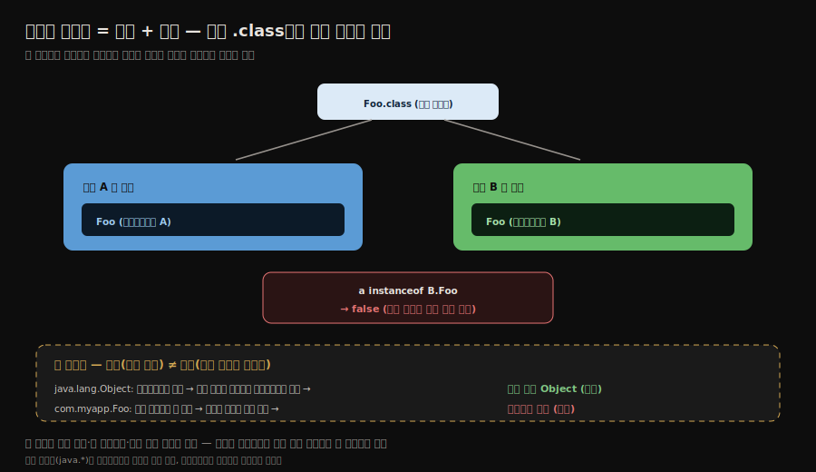
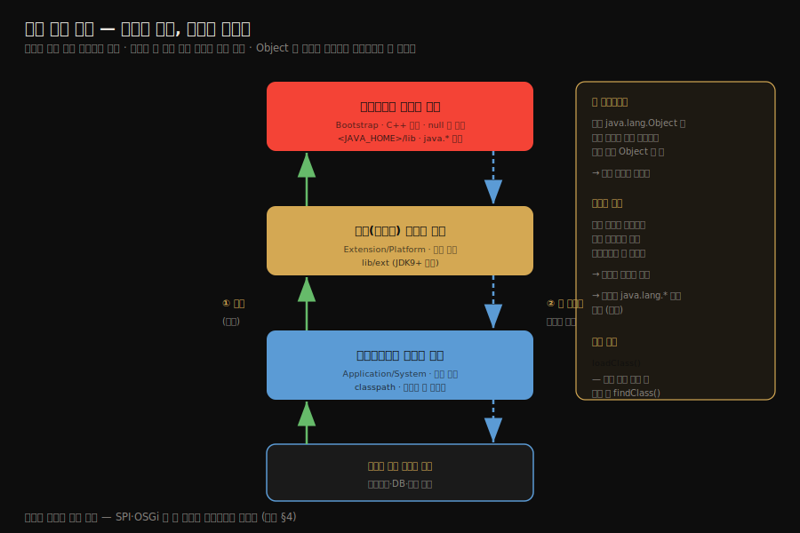
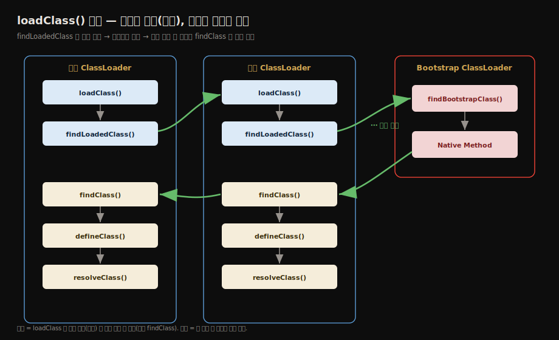
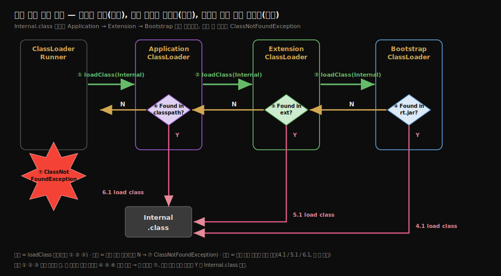
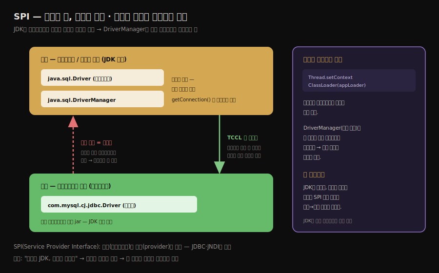
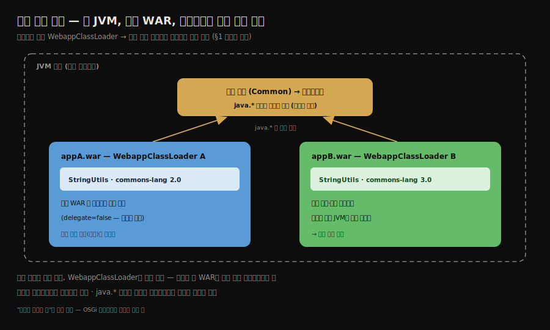

# 클래스 로더와 부모 위임 모델
---
> §7.4를 한 줄로 압축하면 — **클래스 로더는 부트스트랩·확장·애플리케이션 3계층을 이루고 로딩 요청은 항상 부모에게 먼저 위임되어 핵심 클래스가 한 곳에서만 로딩되도록 보장합니다.** 
>
> 핵심은 두 가지입니다. "클래스의 동일성은 *클래스 이름 + 로더*의 쌍으로 결정된다"는 것과, "위임 모델은 권장일 뿐 SPI·OSGi가 의도적으로 깨뜨린다"는 것입니다.

이 글을 읽고 나면 같은 `.class`라도 다른 로더로 로딩하면 왜 다른 타입이 되는지 예제로 설명하고 부모 위임 모델이 `java.lang.Object`의 유일성을 어떻게 지키는지 말하며 SPI가 왜 이 모델을 깨야 했는지 그림 없이 짚을 수 있습니다.


## 진입 — 클래스 로더는 무엇을 하는가

> 클래스 로딩의 "바이트 스트림 획득"만 따로 떼어 *클래스 로더*에 맡긴 것이, 자바의 동적 확장성을 떠받치는 설계입니다.

[로딩 단계](./02-02.로딩%C2%B7검증%C2%B7준비.md)에서 본 세 작업 중 첫째, *바이트 스트림을 가져오는 일*을 가상 머신 밖으로 빼내 별도 모듈에 맡긴 것이 클래스 로더입니다. 이 작은 분리가 큰 결과를 낳았습니다. 바이트를 어디서 어떻게 가져올지를 애플리케이션이 직접 정할 수 있게 되어, 네트워크 로딩·핫 디플로이·격리된 모듈 같은 기능이 모두 가능해졌습니다.


## 1. 클래스의 동일성 — 로더가 네임스페이스를 가른다

> 두 클래스가 같은가는 *클래스 이름*만으로 정해지지 않습니다. *어느 로더가 로딩했는가*까지 같아야 같은 클래스입니다.

JVM에서 두 클래스가 *동일한가*를 판정하는 기준은 클래스의 정규화된 이름만이 아닙니다. **그 클래스를 로딩한 클래스 로더까지 같아야** 같은 클래스입니다. 같은 `.class` 파일을 서로 다른 두 로더가 각각 로딩하면, JVM은 둘을 *다른 클래스*로 봅니다.

```java
public class ClassLoaderTest {
    public static void main(String[] args) throws Exception {
        // 사용자 정의 로더 — 클래스 이름의 .class 를 직접 읽어 defineClass
        ClassLoader myLoader = new ClassLoader() {
            @Override
            public Class<?> loadClass(String name) throws ClassNotFoundException {
                try {
                    String fileName = name.substring(name.lastIndexOf(".") + 1) + ".class";
                    InputStream is = getClass().getResourceAsStream(fileName);
                    if (is == null) {
                        return super.loadClass(name);   // 못 찾으면 기본 위임
                    }
                    byte[] b = is.readAllBytes();
                    return defineClass(name, b, 0, b.length);  // 직접 클래스 정의
                } catch (IOException e) {
                    throw new ClassNotFoundException(name);
                }
            }
        };

        // 사용자 로더로 ClassLoaderTest 자신을 다시 로딩
        Object obj = myLoader.loadClass("org.fenixsoft.classloading.ClassLoaderTest")
                             .newInstance();

        System.out.println(obj.getClass());
      
        // instanceof 비교 — 같은 .class 인데?
        System.out.println(obj instanceof org.fenixsoft.classloading.ClassLoaderTest);
    }
}
```

- 출력에서 `obj.getClass()`는 `ClassLoaderTest`를 가리키지만 `obj instanceof ClassLoaderTest`는 **`false`**입니다. 
- `obj`는 사용자 정의 로더가 로딩한 `ClassLoaderTest`이고 `instanceof`의 오른쪽은 애플리케이션 로더가 로딩한 `ClassLoaderTest`라, JVM에게는 *서로 다른 클래스*이기 때문입니다. 
- 같은 바이트에서 나왔어도 로더가 다르면 별개입니다. 이 성질이 모듈 격리·핫 디플로이의 기반이 됩니다 — 로더를 갈아치우면 같은 이름의 클래스를 새 버전으로 교체할 수 있습니다.

여기서 흔한 오해를 하나 짚어 둡니다. **"모든 로더가 결국 부트스트랩을 부모로 두니, 어떤 클래스든 결국 부트스트랩이 로딩해 다 같은 것 아닌가"** 싶을 수 있습니다. 

- 그러나 *부모에게 위임한다*는 것과 *부모가 로딩한다*는 것은 다릅니다. 위임은 요청을 위로 올려보내는 것이고 실제 로딩은 *그 요청을 처리할 수 있는 로더*가 합니다. 
- `java.lang.Object`는 부트스트랩이 가지고 있으니 어느 로더로 요청해도 부트스트랩이 로딩해 *모두 같은 Object*가 됩니다. 그러나 내가 짠 `com.myapp.Foo`는 부트스트랩·플랫폼 로더의 경로에 없어 위임이 위로 올라갔다 전부 실패하고 *결국 요청한 로더가 직접 로딩*합니다. 
- 그래서 같은 `Foo`라도 로더 A가 로딩한 것과 로더 B가 로딩한 것은 별개의 클래스입니다. 핵심 클래스는 부트스트랩이 로딩해 통일되지만 애플리케이션 클래스는 각 로더가 직접 로딩해 로더마다 갈리는 것 — 이 갈림이 톰캣의 웹앱 격리(§4)를 가능하게 합니다.




## 2. 3계층 클래스 로더와 부모 위임

> 클래스 로더는 부트스트랩·확장·애플리케이션 3계층을 이루고 로딩 요청은 항상 위(부모)로 먼저 위임됩니다. 이것이 부모 위임 모델입니다.

자바 애플리케이션은 세 종류의 시스템 클래스 로더를 씁니다.



1. 부트스트랩 클래스 로더(Bootstrap Class Loader)는 C++로 구현되어 가상 머신의 일부입니다. `<JAVA_HOME>/lib`의 핵심 클래스(`java.*`)를 로딩합니다. 자바 코드에서는 `null`로 표현됩니다.
2. 확장 클래스 로더(Extension Class Loader)는 자바로 구현되며 `<JAVA_HOME>/lib/ext`의 확장 라이브러리를 로딩합니다. (JDK 9부터 플랫폼 클래스 로더로 바뀝니다 — [다음 글](./02-05.자바%20모듈%20시스템과%20클래스%20로더%20변화.md))
3. 애플리케이션 클래스 로더(Application Class Loader)는 클래스패스의 클래스를 로딩하는 기본 로더입니다. 우리가 작성한 클래스 대부분이 이 로더로 로딩됩니다. 시스템 클래스 로더라고도 부릅니다.

어떤 클래스가 어느 로더로 로딩되는지는 대표 예로 감을 잡을 수 있습니다.

| 로더 | 로딩 경로 | 대표 클래스 |
|------|-----------|-------------|
| 부트스트랩 | `<JAVA_HOME>/lib` (java.base) | `Object`·`String`·`Integer`·`List`/`ArrayList`/`HashMap`·`Thread` 등 `java.*` 전부 |
| 플랫폼(구 확장) | JDK 표준 확장 모듈 | `java.sql.*`(JDBC API)·`javax.xml.*`·`java.naming`(JNDI) |
| 애플리케이션 | 클래스패스(내 jar·내 코드) | `com.myapp.*`·`org.springframework.*`·`com.mysql.cj.jdbc.Driver` 등 |

어떤 클래스의 로더는 `클래스.class.getClassLoader()`로 확인합니다. `String.class.getClassLoader()`는 `null`(부트스트랩이라 자바 객체가 없음)이고 내가 짠 클래스는 `AppClassLoader`를 반환합니다.

구현을 들여다보면 JDK 8 시점에는 이 셋의 정체가 더 분명합니다. 부트스트랩은 `rt.jar`(핵심 런타임 클래스 묶음)를 로딩하고, 확장·애플리케이션 로더는 `sun.misc.Launcher`의 static 내부 클래스로 둘 다 `URLClassLoader`를 상속해 구현됩니다. 이 구현 세부는 JDK 9의 모듈 시스템에서 한 차례 바뀌는데(부트스트랩이 자바 `BootClassLoader`로, 애플리케이션 로더가 더 이상 `URLClassLoader`가 아님), 그 변화는 [다음 글](./02-05.자바%20모듈%20시스템과%20클래스%20로더%20변화.md)에서 다룹니다.

이들은 *부모 위임 모델(parent delegation model)*로 협력합니다. 동작은 단순합니다. 어떤 로더에 로딩 요청이 오면, 그 로더는 직접 로딩하지 않고 *먼저 부모에게 위임*합니다. 부모도 자기 부모에게 다시 위임합니다. 이렇게 요청이 최상위 부트스트랩까지 올라간 뒤, 부모가 로딩하지 못한 경우에만 자식이 직접 로딩을 시도합니다.

여기서 부모-자식 관계는 상속이 아니라 *조합(composition)*으로 구현됩니다. 각 로더가 부모 로더를 필드로 들고 있습니다.

### 왜 위로 위임하는가

부모 위임의 목적은 *클래스의 유일성*입니다. `java.lang.Object`처럼 모든 클래스의 부모인 핵심 클래스가, 어느 로더로 요청되든 항상 부트스트랩 한 곳에서만 로딩되도록 보장합니다.

만약 위임이 없다면 어떻게 될까요. 

- 사용자가 클래스패스에 직접 만든 `java.lang.Object`를 두면, 애플리케이션 로더가 그것을 로딩해 *진짜 Object와 다른* Object가 시스템에 둘 생깁니다. 
- 같은 이름의 클래스가 여러 개 떠다니면 타입 체계 전체가 무너집니다. 위임 모델은 이런 혼란과 악의적 위조를 막습니다.

### 위임이 떠받치는 세 원리

지금까지 흩어 본 성질을 세 원리로 묶으면 부모 위임의 효과가 또렷해집니다. 클래스 로딩을 다룬 글들이 흔히 *위임(delegation)·가시성(visibility)·유일성(uniqueness)*으로 부르는 세 가지입니다.

1. *위임 원리*는 §2에서 본 그대로입니다. 로딩 요청을 먼저 부모에게 올려보내고 부모가 처리하지 못할 때만 자식이 직접 로딩합니다.
2. *가시성 원리*는 방향이 한쪽이라는 뜻입니다. 자식 로더는 부모가 로딩한 클래스를 볼 수 있지만, 부모는 자식이 로딩한 클래스를 볼 수 없습니다. 내가 짠 `com.myapp.Foo`가 `java.lang.Object`를 쓸 수 있는 것은 이 가시성 덕이고, 거꾸로 핵심 라이브러리가 내 구현체를 보지 못하는 것이 §4의 SPI 문제를 낳습니다.
3. *유일성 원리*는 §1에서 본 동일성의 다른 얼굴입니다. 상위 로더가 이미 로딩한 클래스를 하위 로더가 다시 로딩하지 않으므로, `java.lang.String` 같은 핵심 클래스는 시스템 전체에서 단 하나로 유지됩니다.


## 3. loadClass()의 위임 로직

> 부모 위임은 `loadClass()` 메서드에 코드로 박혀 있습니다. 부모에게 먼저 시도하고 실패할 때만 `findClass()`로 직접 로딩합니다.

부모 위임은 별도 장치가 아니라 `ClassLoader.loadClass()`의 코드 흐름 자체입니다. 책 §7.4가 보여 주는 핵심 로직을 옮기면 다음과 같습니다.

```java
protected Class<?> loadClass(String name, boolean resolve) throws ClassNotFoundException {
    synchronized (getClassLoadingLock(name)) {
        // ① 이미 로딩됐는지 먼저 확인 — 중복 로딩 방지
        Class<?> c = findLoadedClass(name);
      
        if (c == null) {
            try {
                if (parent != null) {
                    // ② 부모가 있으면 부모에게 먼저 위임 (재귀적으로 위로)
                    c = parent.loadClass(name, false);
                } else {
                    // ③ 부모가 null = 부트스트랩에게 위임
                    c = findBootstrapClassOrNull(name);
                }
            } catch (ClassNotFoundException e) {
                // 부모가 못 찾음 — 예외를 삼키고 내가 시도
            }
            if (c == null) {
                // ④ 부모가 실패했을 때만 내가 직접 로딩
                c = findClass(name);
            }
        }
        if (resolve) {
            resolveClass(c);   // 해석까지 요청받았으면 수행
        }
        return c;
    }
}
```

- 흐름은 네 단계입니다. 이미 로딩됐는지 확인하고(①), 부모에게 위임하고(②③), 부모가 실패할 때만 자기 `findClass()`로 직접 로딩합니다(④). 
- 그래서 사용자 정의 로더를 만들 때는 `loadClass()` 전체가 아니라 `findClass()`만 재정의하면, 위임 모델을 그대로 지키면서 *직접 로딩하는 부분*만 바꿀 수 있습니다.

이 위임-복귀 흐름을 세 로더에 펼쳐 보면 다음과 같습니다. 요청은 자식에서 부모로(녹색, 위로) 올라가고, 어느 부모도 처리하지 못하면 다시 자식의 `findClass()`로 내려와 직접 로딩합니다.



- 위 그림이 한 로더 안의 메서드 흐름이라면, 실제 클래스 하나를 로딩할 때 세 로더에 걸쳐 어떤 순서로 요청이 오가는지는 다음처럼 추적됩니다. 
- `Internal.class` 요청이 Application → Extension → Bootstrap으로 위임되어 올라가고(① ② ③), 각 로더가 자기 경로(classpath·ext·`rt.jar`)에서 탐색합니다. 못 찾으면(N) 요청이 다시 아래로 내려와 결국 `ClassNotFoundException`(⑦)이 되고, 어느 단계든 찾으면(Y) 그 로더가 직접 로딩합니다(4.1·5.1·6.1).



### 로딩이 시작되는 두 시점 — 로드 타임 vs 런타임

`loadClass()`는 위임 *방법*이지 로딩이 *언제* 시작되는지를 정하지는 않습니다. 로딩이 촉발되는 시점은 둘로 나뉩니다.

- *로드 타임 동적 로딩*은 어떤 클래스를 로딩할 때 그것이 참조하는 클래스를 따라 로딩하는 경우입니다. `Hello`를 로딩하면 그 안에서 쓰는 `Object`·`String`·`System`이 아직 없을 때 자동으로 함께 로딩됩니다. 코드에 *이름이 박혀 있어* 컴파일 시점에 의존이 드러나는 로딩입니다.
- *런타임 동적 로딩*은 실행 중에 *이름을 문자열로 받아* 로딩하는 경우입니다. `Class.forName("com.mysql.cj.jdbc.Driver")`처럼, 어떤 클래스를 쓸지 코드에 미리 박지 않고 실행 시점에 정합니다.

`Class.forName(...)`이 돌려주는 것은 인스턴스가 아니라 그 클래스의 메타데이터를 담은 `Class` 객체입니다. 

- 여기서 메서드·필드·생성자 정보를 꺼내는 것이 리플렉션이고, 실제 객체는 `newInstance()`(또는 `getDeclaredConstructor().newInstance()`)로 따로 만듭니다. 
- 어떤 구현을 쓸지 클래스패스에 들어온 jar로 결정하는 SPI(§4)와 JDBC 드라이버 로딩이 바로 이 런타임 동적 로딩 위에 서 있습니다.


## 4. 부모 위임 모델 깨뜨리기

> 위임 모델은 강제가 아니라 *권장*입니다. SPI·스레드 컨텍스트 로더·OSGi가 이 모델을 의도적으로 깨뜨려야 했던 사례가 있습니다.

부모 위임은 명세가 아니라 *권장 구현*입니다. 역사적으로 이 모델이 맞지 않는 상황이 있어, 세 차례 의도적으로 깨졌습니다.

### SPI와 스레드 컨텍스트 클래스 로더

가장 유명한 사례는 SPI(Service Provider Interface)입니다. JDBC·JNDI 같은 표준 인터페이스는 부트스트랩·확장 로더가 로딩하는 핵심 라이브러리에 있습니다. 그런데 그 *구현체*(예: MySQL JDBC 드라이버)는 애플리케이션이 클래스패스에 넣은 코드라, 애플리케이션 로더가 로딩합니다.

- 문제는 핵심 라이브러리(부모 로더)의 코드가 구현체(자식 로더)의 클래스를 로딩해야 한다는 점입니다. 부모 위임은 *부모가 자식에게 요청*하는 것을 허용하지 않습니다. 부모는 자식의 클래스패스를 모르기 때문입니다.
- 이를 풀려고 도입한 것이 *스레드 컨텍스트 클래스 로더(Thread Context Class Loader)*입니다. `Thread.setContextClassLoader()`로 스레드에 로더를 심어 두면, 부모 로더의 코드가 그 컨텍스트 로더를 꺼내 자식의 클래스를 로딩할 수 있습니다. 부모가 자식 로더에게 *역으로* 위임하는 셈이라, 부모 위임 모델을 의도적으로 위반합니다.

이 역전이 왜 *필연적*인지는 SPI 설계의 본질에서 옵니다. JDK는 *규격*(`java.sql.Driver` 인터페이스)만 정하고 *실제 구현*(MySQL·PostgreSQL·Oracle 드라이버)은 외부에 맡깁니다. 그래야 JDK를 고치지 않고도 드라이버 jar만 클래스패스에 넣으면 어떤 DB든 붙일 수 있기 때문입니다

- JDK가 세상의 모든 드라이버를 내장할 수는 없습니다. 그런데 `DriverManager.getConnection(...)`을 부르면 *규격을 가진 상위 코드*(DriverManager)가 *외부 구현*(드라이버)을 찾아 인스턴스를 만들어야 합니다. 
- 상위 코드는 부트스트랩·플랫폼 로더가, 구현체는 애플리케이션 로더가 로딩하므로, 상위가 하위의 클래스를 로딩해야 하는 역전이 *반드시* 생깁니다. 부모 위임으로는 불가능하니, 스레드에 애플리케이션 로더를 심어 그것을 꺼내 쓰는 우회로를 둔 것입니다. 
- 정리하면 "JDK는 규격만, 구현은 외부에"라는 SPI 구조가 상위→하위 로딩을 부르고 그 다리가 스레드 컨텍스트 로더입니다.



### OSGi의 네트워크형 위임

핫 디플로이를 지원하는 OSGi는 위임 구조 자체를 뒤집습니다. OSGi에서는 각 모듈(번들)이 자기 클래스 로더를 가지며 로더들이 트리가 아니라 *네트워크(망)* 형태로 서로 위임합니다. 모듈을 교체할 때 그 모듈의 로더만 새 것으로 갈아치우면 핫 스왑이 됩니다. 트리형 부모 위임으로는 이런 유연한 교체가 불가능해, OSGi는 자체 위임 규칙을 만들었습니다.

### 톰캣의 웹앱 격리

더 일상적인 사례는 톰캣입니다. 톰캣은 한 JVM 안에 여러 웹앱(WAR)을 동시에 띄웁니다. 

- 문제는 `appA`가 `commons-lang 2.0`을, `appB`가 `commons-lang 3.0`을 쓰는 것처럼 *같은 이름의 클래스를 다른 버전으로* 의존할 때입니다. 
- 한 JVM이니 충돌해야 할 것 같지만 충돌하지 않습니다. 톰캣이 *웹앱마다 별도 클래스 로더*(`WebappClassLoader`)를 두기 때문입니다 — `appA`의 `StringUtils`는 로더 A가, `appB`의 `StringUtils`는 로더 B가 로딩하므로 JVM에게는 §1에서 본 것처럼 *서로 다른 클래스*가 되어 공존합니다.

여기서 톰캣은 부모 위임을 한 발 더 비틉니다. 표준 위임은 부모에게 *먼저* 묻지만 `WebappClassLoader`는 *웹앱 자신의 클래스를 먼저* 찾고 없을 때만 부모(공통 라이브러리)로 올라갑니다. 그래야 각 웹앱이 공통 영역의 버전이 아니라 *자기 WAR 안의 버전*을 우선 쓰기 때문입니다. 

단 `java.*` 같은 핵심 클래스는 여전히 위임으로 부트스트랩에 맡겨 유일성을 지킵니다 — 위반은 *애플리케이션 클래스에 한정*됩니다. 톰캣 역시 "위임은 권장일 뿐"을 실무에서 활용하는 사례입니다.




## 실습 — getClassLoader로 동일성 확인

본문의 두 핵심을 직접 재현했습니다. 3계층 로더는 `getClassLoader()`로, "이름 + 로더" 동일성은 `instanceof`로 드러납니다.

3계층 로더 — `String.class.getClassLoader()`는 `null`(부트스트랩이라 자바 객체가 없음)이고 내가 짠 클래스는 `AppClassLoader`를 반환합니다. 부모 체인을 위로 따라가면 `App → Platform → null(부트스트랩)`으로 위임 방향이 보입니다. 여기서 중간이 노트가 말한 *확장 로더*가 아니라 `PlatformClassLoader`인데, JDK 9에서 확장 로더가 플랫폼 로더로 바뀐 결과입니다 — 다음 글(02-05)의 변화를 실습으로 미리 만나는 셈입니다.

이름 + 로더 동일성 — 사용자 정의 로더로 `ClassLoaderIdentity`를 다시 로딩해 만든 객체는 `obj.getClass()`의 이름이 `ClassLoaderIdentity`로 같지만 `obj instanceof ClassLoaderIdentity`는 `false`입니다. `obj`는 사용자 정의 로더가, `instanceof` 오른쪽은 App 로더가 로딩한 것이라 같은 바이트인데도 JVM에게는 별개의 클래스이기 때문입니다. 클래스 동일성이 *이름 + 로더*의 쌍임이 출력으로 드러납니다.

> 실습 코드와 전체 관측은 `_practice/ch07-class-loading/classloader/`(`LoaderInspect.java`·`ClassLoaderIdentity.java`·`CLASSLOADER.md`)에 있습니다.


## 5. 면접 대비 요약

> 핵심은 "클래스 동일성 = 이름 + 로더", "부모 위임이 핵심 클래스 유일성을 보장", "위임은 권장이라 SPI·OSGi가 깬다"입니다.

### 한 줄 정의

부모 위임 모델이란, 클래스 로딩 요청을 항상 부모 로더에게 먼저 위임하고 부모가 처리하지 못할 때만 자식이 직접 로딩하는 협력 방식을 말합니다.

### 핵심 포인트 3가지

1. 클래스의 동일성은 *클래스 이름 + 로더*의 쌍으로 결정됩니다. 같은 `.class`도 다른 로더로 로딩하면 `instanceof`가 `false`입니다.
2. 부모 위임은 `java.lang.Object` 같은 핵심 클래스가 항상 부트스트랩 한 곳에서만 로딩되도록 보장해, 클래스 유일성과 안전을 지킵니다.
3. 위임 모델은 권장일 뿐입니다. SPI는 스레드 컨텍스트 로더로, OSGi는 네트워크형 로더로 이 모델을 의도적으로 깨뜨립니다.

### 면접에서 받을 만한 질문

1. 같은 `.class` 파일을 다른 로더로 로딩하면 `instanceof`가 `false`인 이유는 무엇입니까?
2. 부모 위임 모델이 막아 주는 위협은 구체적으로 무엇입니까?
3. SPI가 부모 위임을 깨야 했던 이유와, 그 해법은 무엇입니까?

> 세 질문에 *먼저 자답한 뒤* 아래 §정답으로 내려갑니다.


## 정답 (자답 후 펼치기)

> 위 §면접에서 받을 만한 질문의 3개에 *먼저 자답한 뒤* 아래를 읽으세요.

### 정답 1 — 다른 로더면 다른 클래스

JVM이 클래스 동일성을 *이름 + 로더*의 쌍으로 판정하기 때문입니다. `obj`는 사용자 정의 로더가 로딩한 `ClassLoaderTest`이고 `instanceof` 오른쪽은 애플리케이션 로더가 로딩한 `ClassLoaderTest`라, 이름은 같지만 로더가 달라 JVM에게는 별개의 클래스입니다. 그래서 `instanceof`가 `false`입니다.

### 정답 2 — 부모 위임이 막는 위협

핵심 클래스의 *중복·위조*입니다. 위임이 없으면 사용자가 만든 `java.lang.Object`가 별도로 로딩되어 진짜 Object와 공존할 수 있고 같은 이름의 클래스가 여러 개 떠다니면 타입 체계가 무너집니다. 부모 위임은 핵심 클래스를 항상 부트스트랩 한 곳에서만 로딩하게 해 유일성을 지키고 악의적 `java.lang.*` 위조를 차단합니다.

### 정답 3 — SPI가 위임을 깬 이유

부모 로더(핵심 라이브러리)의 코드가 자식 로더(애플리케이션)의 구현체를 로딩해야 했기 때문입니다. JDBC 인터페이스는 부트스트랩·확장 로더에 있지만 드라이버 구현체는 클래스패스에 있어 애플리케이션 로더가 로딩하는데, 부모 위임은 부모가 자식에게 요청하는 것을 허용하지 않습니다. 해법은 스레드 컨텍스트 클래스 로더로, 스레드에 심어 둔 로더를 통해 부모가 자식 클래스를 역으로 로딩하게 합니다.


## 핵심 개념 체크리스트

- [ ] 클래스 동일성이 이름만으로 정해지지 않는 이유를 설명할 수 있는가?
- [ ] 3계층 로더(부트스트랩·확장·애플리케이션)의 역할을 말할 수 있는가?
- [ ] 부모 위임이 요청은 위로, 로딩은 아래로 흐른다는 것을 설명할 수 있는가?
- [ ] `loadClass()`에서 `findClass()`만 재정의하는 이유를 아는가?
- [ ] 위임 모델을 깬 세 사례(SPI·스레드 컨텍스트 로더·OSGi)를 말할 수 있는가?


## 관련 문서

> 이 글의 3계층 로더는 JDK 9 모듈 시스템에서 한 차례 바뀝니다. 그 변화를 다음 글이 이어받습니다.

- [02-05. 자바 모듈 시스템과 클래스 로더 변화](./02-05.자바%20모듈%20시스템과%20클래스%20로더%20변화.md) — 확장 로더가 플랫폼 로더로 바뀌는 이유
- [02-02. 로딩·검증·준비](./02-02.로딩%C2%B7검증%C2%B7준비.md) § "로딩" — 클래스 로더가 담당하는 바이트 스트림 획득
- [02-01. 클래스 로딩 시점과 생명주기](./02-01.클래스%20로딩%20시점과%20생명주기.md) — 로더가 수행하는 로딩의 전체 맥락
